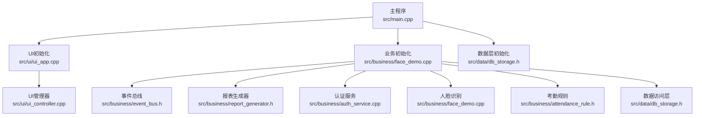
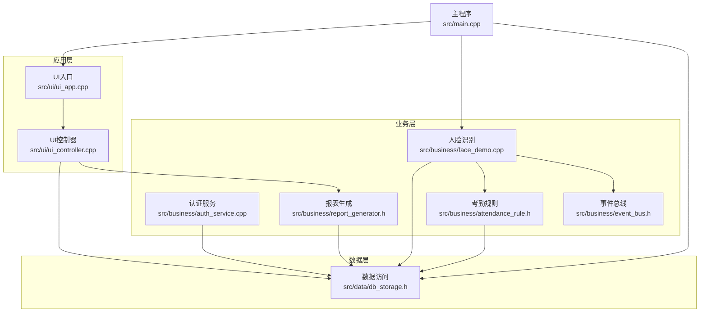
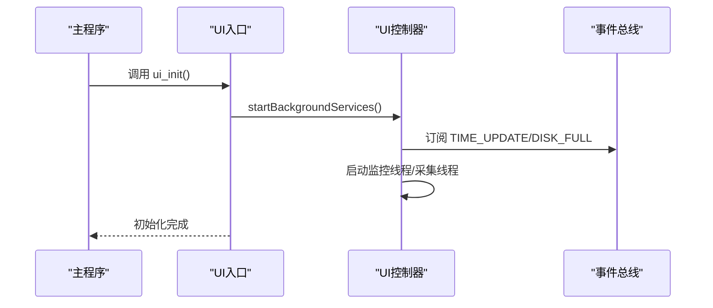
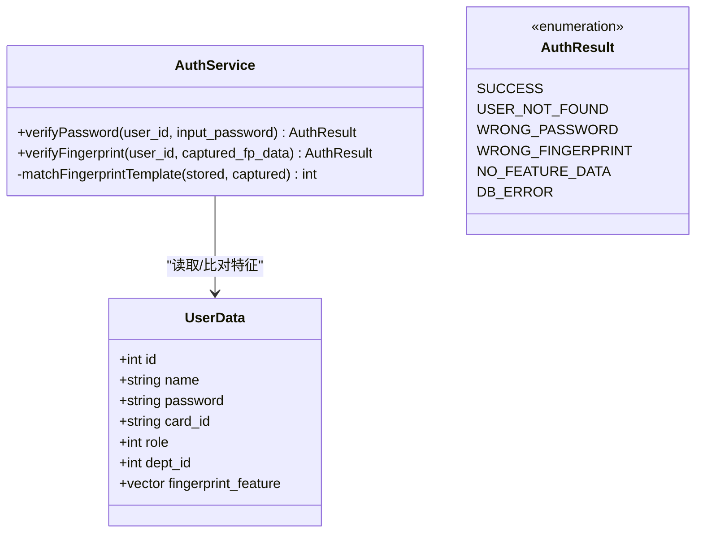
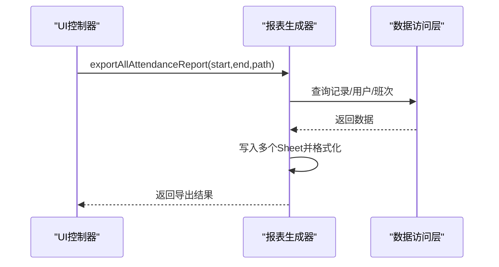
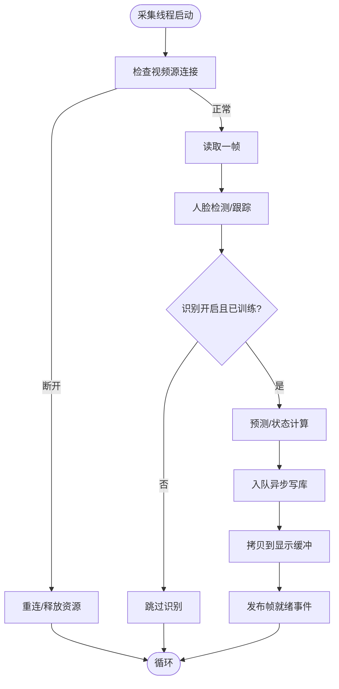
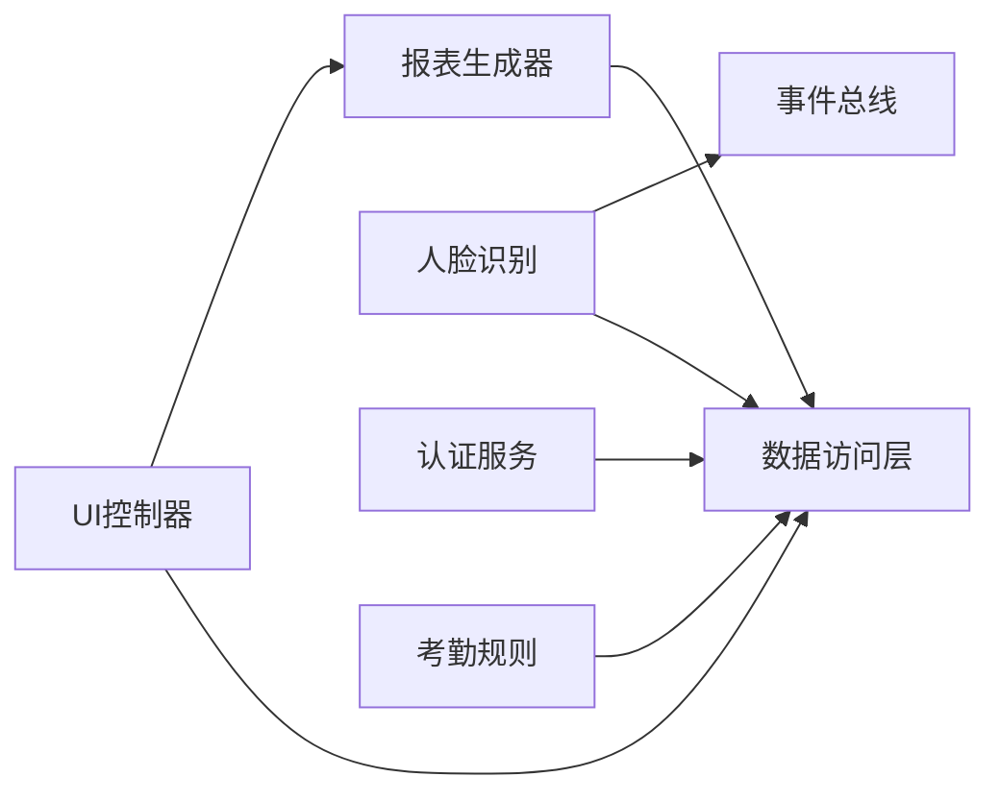

# 扩展开发

<cite>
**本文档引用的文件**
- [src/main.cpp](file://src/main.cpp)
- [src/ui/ui_app.h](file://src/ui/ui_app.h)
- [src/ui/ui_app.cpp](file://src/ui/ui_app.cpp)
- [src/ui/ui_controller.h](file://src/ui/ui_controller.h)
- [src/ui/ui_controller.cpp](file://src/ui/ui_controller.cpp)
- [src/business/auth_service.h](file://src/business/auth_service.h)
- [src/business/auth_service.cpp](file://src/business/auth_service.cpp)
- [src/business/face_demo.h](file://src/business/face_demo.h)
- [src/business/face_demo.cpp](file://src/business/face_demo.cpp)
- [src/business/report_generator.h](file://src/business/report_generator.h)
- [src/business/attendance_rule.h](file://src/business/attendance_rule.h)
- [src/business/event_bus.h](file://src/business/event_bus.h)
- [src/data/db_storage.h](file://src/data/db_storage.h)
</cite>

## 更新摘要
**所做更改**
- 新增了摄像头帧获取与显示的详细实现分析
- 扩展了认证服务的指纹识别集成指南
- 完善了UI控制器的后台服务管理机制
- 增强了事件总线在系统架构中的作用说明
- 更新了数据层接口的使用模式和最佳实践

## 目录
1. [简介](#简介)
2. [项目结构](#项目结构)
3. [核心组件](#核心组件)
4. [架构总览](#架构总览)
5. [详细组件分析](#详细组件分析)
6. [依赖分析](#依赖分析)
7. [性能考虑](#性能考虑)
8. [故障排查指南](#故障排查指南)
9. [结论](#结论)
10. [附录](#附录)

## 简介
本指南面向希望为智能考勤系统进行扩展开发的工程师，围绕以下目标展开：
- 插件开发方法：UI组件扩展、认证方式扩展、报表格式扩展
- 新认证方式集成：指纹识别、IC卡读卡、生物特征识别
- 硬件设备集成：摄像头、输入设备、显示设备
- 第三方服务集成：云服务对接、邮件通知、数据同步
- 扩展点识别与API设计原则
- 最佳实践与注意事项

系统采用清晰的分层架构：UI层（LVGL）、业务层（人脸识别、规则引擎、报表）、数据层（SQLite），并通过事件总线解耦模块。

## 项目结构
- UI层：负责显示与交互，使用LVGL与SDL驱动，提供屏幕管理、样式与事件绑定。
- 业务层：负责核心业务逻辑，包括人脸识别、考勤规则、报表生成、事件总线。
- 数据层：封装数据库访问，提供DAO接口与系统配置。
- 主程序：初始化顺序与主循环，驱动UI与业务模块。

**图表来源**
- [src/main.cpp:187-246](file://src/main.cpp#L187-L246)
- [src/ui/ui_app.cpp:34-94](file://src/ui/ui_app.cpp#L34-L94)
- [src/business/face_demo.cpp:557-694](file://src/business/face_demo.cpp#L557-L694)
- [src/data/db_storage.h:221-239](file://src/data/db_storage.h#L221-L239)

**章节来源**
- [src/main.cpp:187-246](file://src/main.cpp#L187-L246)
- [src/ui/ui_app.cpp:34-94](file://src/ui/ui_app.cpp#L34-L94)
- [src/business/face_demo.cpp:557-694](file://src/business/face_demo.cpp#L557-L694)
- [src/data/db_storage.h:221-239](file://src/data/db_storage.h#L221-L239)

## 核心组件
- UI控制器（UiController）：封装业务与数据接口，提供报表导出、摄像头帧获取、用户维护、系统统计等能力。
- 认证服务（AuthService）：提供密码与指纹验证，返回标准化结果枚举。
- 人脸识别（FaceDemo）：负责视频流采集、人脸检测与识别、训练与模型持久化、异步写库。
- 报表生成（ReportGenerator）：基于xlsxwriter生成多Sheet报表，支持全员与个人报表。
- 考勤规则（AttendanceRule）：提供打卡状态计算与记录语义结果。
- 事件总线（EventBus）：模块间解耦通信，支持时间、磁盘、摄像头帧等事件。
- 数据访问（DBStorage）：提供部门、班次、用户、考勤记录、系统配置等DAO接口。

**章节来源**
- [src/ui/ui_controller.h:21-110](file://src/ui/ui_controller.h#L21-L110)
- [src/business/auth_service.h:23-46](file://src/business/auth_service.h#L23-L46)
- [src/business/face_demo.h:40-212](file://src/business/face_demo.h#L40-L212)
- [src/business/report_generator.h:31-192](file://src/business/report_generator.h#L31-L192)
- [src/business/attendance_rule.h:43-92](file://src/business/attendance_rule.h#L43-L92)
- [src/business/event_bus.h:23-43](file://src/business/event_bus.h#L23-L43)
- [src/data/db_storage.h:213-683](file://src/data/db_storage.h#L213-L683)

## 架构总览
系统采用"主程序驱动 + 分层模块 + 事件总线"的架构。主程序负责初始化与主循环；UI层负责显示与输入；业务层负责核心算法与流程；数据层负责持久化；事件总线贯穿模块间通信。

**图表来源**
- [src/main.cpp:187-246](file://src/main.cpp#L187-L246)
- [src/ui/ui_app.cpp:34-94](file://src/ui/ui_app.cpp#L34-L94)
- [src/ui/ui_controller.cpp:380-410](file://src/ui/ui_controller.cpp#L380-L410)
- [src/business/face_demo.cpp:557-694](file://src/business/face_demo.cpp#L557-L694)
- [src/business/auth_service.cpp:9-90](file://src/business/auth_service.cpp#L9-L90)
- [src/business/report_generator.h:31-192](file://src/business/report_generator.h#L31-L192)
- [src/business/attendance_rule.h:43-92](file://src/business/attendance_rule.h#L43-L92)
- [src/business/event_bus.h:23-43](file://src/business/event_bus.h#L23-L43)
- [src/data/db_storage.h:213-683](file://src/data/db_storage.h#L213-L683)

## 详细组件分析

### UI组件扩展（UI控制器与屏幕管理）
- 扩展点
  - UI控制器接口：提供报表导出、摄像头帧获取、用户维护、系统统计等接口，便于在UI层直接调用。
  - 屏幕管理：通过屏幕模块加载主页，支持按键绑定与焦点组管理。
- 设计要点
  - 单例模式提供全局访问点，封装业务调用，降低UI复杂度。
  - 后台线程负责监控与采集，UI线程专注渲染与事件处理。
- 实现建议
  - 新增屏幕时，遵循现有屏幕加载模式，确保事件绑定与资源释放一致。
  - 摄像头帧获取采用线程安全缓存，注意尺寸与格式匹配。

**图表来源**
- [src/ui/ui_app.cpp:34-94](file://src/ui/ui_app.cpp#L34-L94)
- [src/ui/ui_controller.cpp:380-410](file://src/ui/ui_controller.cpp#L380-L410)
- [src/business/event_bus.h:23-43](file://src/business/event_bus.h#L23-L43)

**章节来源**
- [src/ui/ui_controller.h:21-110](file://src/ui/ui_controller.h#L21-L110)
- [src/ui/ui_controller.cpp:380-410](file://src/ui/ui_controller.cpp#L380-L410)
- [src/ui/ui_app.cpp:34-94](file://src/ui/ui_app.cpp#L34-L94)

### 认证方式扩展（密码、指纹、IC卡、生物特征）
- 扩展点
  - 认证服务接口：提供密码与指纹验证，返回标准化结果枚举。
  - 生物特征数据：用户结构体包含指纹特征字段，支持指纹特征入库与比对。
- 设计要点
  - 认证结果枚举统一，便于UI与业务层处理。
  - 指纹比对算法为占位实现，需替换为真实SDK调用。
- 实现建议
  - 新增认证方式时，保持返回枚举一致；在UI层根据枚举展示提示。
  - 指纹特征数据需安全存储与传输，注意长度与格式校验。

**图表来源**
- [src/business/auth_service.h:23-46](file://src/business/auth_service.h#L23-L46)
- [src/business/auth_service.cpp:9-90](file://src/business/auth_service.cpp#L9-L90)
- [src/data/db_storage.h:130-168](file://src/data/db_storage.h#L130-L168)

**章节来源**
- [src/business/auth_service.h:8-16](file://src/business/auth_service.h#L8-L16)
- [src/business/auth_service.cpp:42-69](file://src/business/auth_service.cpp#L42-L69)
- [src/data/db_storage.h:432-438](file://src/data/db_storage.h#L432-L438)

### 报表格式扩展（xlsxwriter）
- 扩展点
  - 报表生成器：支持全员与个人报表，包含多个Sheet，可扩展新报表类型。
  - 导出接口：UI控制器封装导出逻辑，便于在UI层触发。
- 设计要点
  - 多Sheet结构清晰，便于第三方系统读取。
  - 样式与颜色通过xlsxwriter格式化，异常状态可高亮。
- 实现建议
  - 新报表类型需定义数据结构与写入函数，保持与现有接口一致。
  - 注意日期与时间格式标准化，避免跨平台差异。

**图表来源**
- [src/ui/ui_controller.cpp:193-210](file://src/ui/ui_controller.cpp#L193-L210)
- [src/business/report_generator.h:90-98](file://src/business/report_generator.h#L90-L98)
- [src/data/db_storage.h:666-682](file://src/data/db_storage.h#L666-L682)

**章节来源**
- [src/business/report_generator.h:31-192](file://src/business/report_generator.h#L31-L192)
- [src/ui/ui_controller.cpp:292-318](file://src/ui/ui_controller.cpp#L292-L318)

### 硬件设备集成（摄像头、输入设备、显示设备）
- 摄像头
  - 业务层通过OpenCV与GStreamer读取视频流，支持SDP管道。
  - UI层通过控制器获取帧数据，线程安全拷贝到显示缓冲。
- 输入设备
  - UI层使用SDL键盘/鼠标驱动，绑定到LVGL焦点组，支持按键导航。
- 显示设备
  - LVGL通过SDL窗口渲染，支持自定义分辨率与样式。
- 实现建议
  - 摄像头异常重连与帧跳帧策略需健壮处理。
  - 输入设备需与焦点组联动，确保可访问性。

**图表来源**
- [src/business/face_demo.cpp:291-549](file://src/business/face_demo.cpp#L291-L549)
- [src/ui/ui_controller.cpp:658-680](file://src/ui/ui_controller.cpp#L658-L680)
- [src/business/event_bus.h:10-18](file://src/business/event_bus.h#L10-L18)

**章节来源**
- [src/business/face_demo.cpp:212-240](file://src/business/face_demo.cpp#L212-L240)
- [src/ui/ui_controller.cpp:212-231](file://src/ui/ui_controller.cpp#L212-L231)
- [src/ui/ui_app.cpp:55-81](file://src/ui/ui_app.cpp#L55-L81)

### 第三方服务集成（云服务、邮件通知、数据同步）
- 云服务对接
  - 可在UI控制器中新增云同步接口，调用HTTP客户端上传报表或用户数据。
  - 建议采用异步上传与断点续传策略，失败重试与幂等处理。
- 邮件通知
  - 可通过SMTP客户端在考勤异常时发送通知，结合事件总线触发。
- 数据同步
  - 基于UI控制器的导入/导出接口，扩展远程同步协议（如REST/FTP）。
- 实现建议
  - 统一封装网络请求与错误码，避免在业务层直接耦合网络细节。
  - 对敏感数据（如密码、指纹特征）进行加密传输与落盘。

### 扩展点识别与API设计原则
- 扩展点
  - 认证服务：新增认证方式需实现统一返回枚举。
  - 报表生成：新增报表类型需定义数据结构与写入函数。
  - 事件总线：模块间通信通过事件解耦。
  - 数据访问：DAO接口统一，便于替换存储后端。
- 设计原则
  - 单一职责：每个模块专注于自身领域。
  - 接口稳定：对外接口保持向后兼容。
  - 线程安全：共享资源使用互斥锁与原子变量。
  - 可观测性：日志与异常捕获，便于定位问题。

**章节来源**
- [src/business/auth_service.h:23-46](file://src/business/auth_service.h#L23-L46)
- [src/business/report_generator.h:31-192](file://src/business/report_generator.h#L31-L192)
- [src/business/event_bus.h:23-43](file://src/business/event_bus.h#L23-L43)
- [src/data/db_storage.h:213-683](file://src/data/db_storage.h#L213-L683)

## 依赖分析
- 模块耦合
  - UI控制器依赖数据层与报表生成器；业务层依赖数据层与事件总线。
  - 认证服务与人脸识别分别依赖数据层；报表生成器依赖数据层与xlsxwriter。
- 外部依赖
  - OpenCV：视频采集与人脸识别。
  - SQLite3：本地数据存储。
  - LVGL：嵌入式GUI。
  - xlsxwriter：报表导出。
- 潜在风险
  - 数据库并发写入：通过专用写线程与队列避免竞争。
  - 视频流稳定性：重连与帧跳帧策略保障体验。

**图表来源**
- [src/ui/ui_controller.cpp:380-410](file://src/ui/ui_controller.cpp#L380-L410)
- [src/business/face_demo.cpp:557-694](file://src/business/face_demo.cpp#L557-L694)
- [src/business/auth_service.cpp:9-90](file://src/business/auth_service.cpp#L9-L90)
- [src/business/report_generator.h:31-192](file://src/business/report_generator.h#L31-L192)
- [src/business/attendance_rule.h:43-92](file://src/business/attendance_rule.h#L43-L92)
- [src/business/event_bus.h:23-43](file://src/business/event_bus.h#L23-L43)
- [src/data/db_storage.h:213-683](file://src/data/db_storage.h#L213-L683)

**章节来源**
- [src/ui/ui_controller.cpp:380-410](file://src/ui/ui_controller.cpp#L380-L410)
- [src/business/face_demo.cpp:557-694](file://src/business/face_demo.cpp#L557-L694)
- [src/business/auth_service.cpp:9-90](file://src/business/auth_service.cpp#L9-L90)
- [src/business/report_generator.h:31-192](file://src/business/report_generator.h#L31-L192)
- [src/business/attendance_rule.h:43-92](file://src/business/attendance_rule.h#L43-L92)
- [src/business/event_bus.h:23-43](file://src/business/event_bus.h#L23-L43)
- [src/data/db_storage.h:213-683](file://src/data/db_storage.h#L213-L683)

## 性能考虑
- 识别性能
  - 采用帧跳策略与跟踪机制，减少CPU占用。
  - 识别冷却时间避免重复写库与UI抖动。
- 数据写入
  - 异步写库线程与队列，防止主线程阻塞。
  - 事务批量导入提升导入效率。
- UI渲染
  - 显示帧缓冲与事件通知，限制刷新频率保证流畅度。

## 故障排查指南
- 摄像头无画面
  - 检查GStreamer管道与权限；确认重连逻辑是否触发。
- 识别不准确
  - 检查训练样本与模型文件；确认预处理参数。
- 报表导出失败
  - 检查xlsxwriter依赖与输出路径权限。
- 数据库写入异常
  - 检查异步写线程状态与队列长度；查看日志异常栈。

**章节来源**
- [src/business/face_demo.cpp:314-344](file://src/business/face_demo.cpp#L314-L344)
- [src/business/face_demo.cpp:246-285](file://src/business/face_demo.cpp#L246-L285)
- [src/ui/ui_controller.cpp:193-210](file://src/ui/ui_controller.cpp#L193-L210)

## 结论
通过明确的分层架构与事件总线，系统为扩展开发提供了清晰的边界与稳定的接口。开发者可在认证、UI、报表与硬件集成等方面按本文档的扩展点与设计原则进行二次开发，同时遵循性能与可靠性最佳实践，确保系统在多场景下的稳定运行。

## 附录
- 新认证方式集成步骤
  - 在认证服务中新增验证函数，返回统一枚举。
  - 在UI层根据枚举展示提示与引导。
  - 在数据层扩展用户结构体以存储新特征。
- 硬件设备适配建议
  - 摄像头：优先使用GStreamer管道，实现断线重连与帧跳帧。
  - 输入设备：绑定LVGL焦点组，确保可访问性。
  - 显示设备：根据分辨率配置LVGL渲染参数。
- 第三方服务接入建议
  - 统一封装网络请求与错误处理。
  - 对敏感数据进行加密与权限控制。