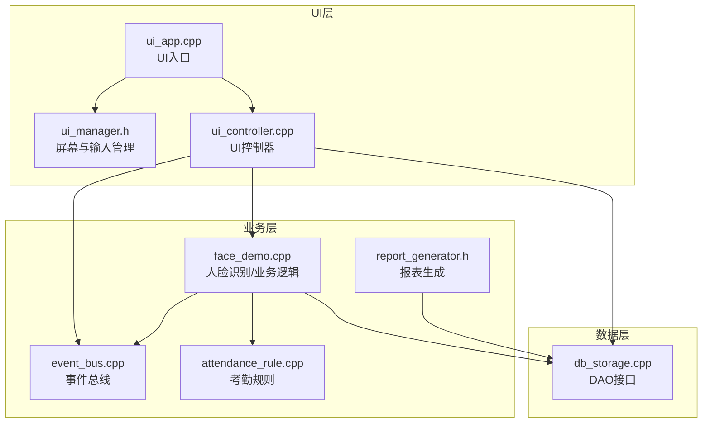
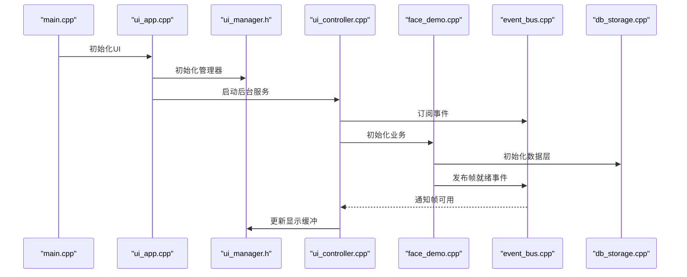
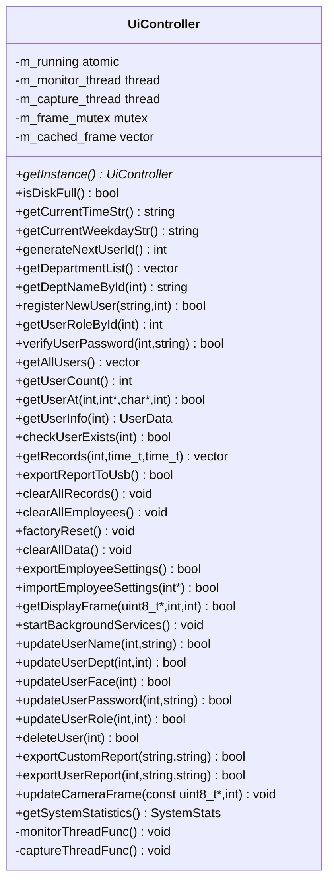
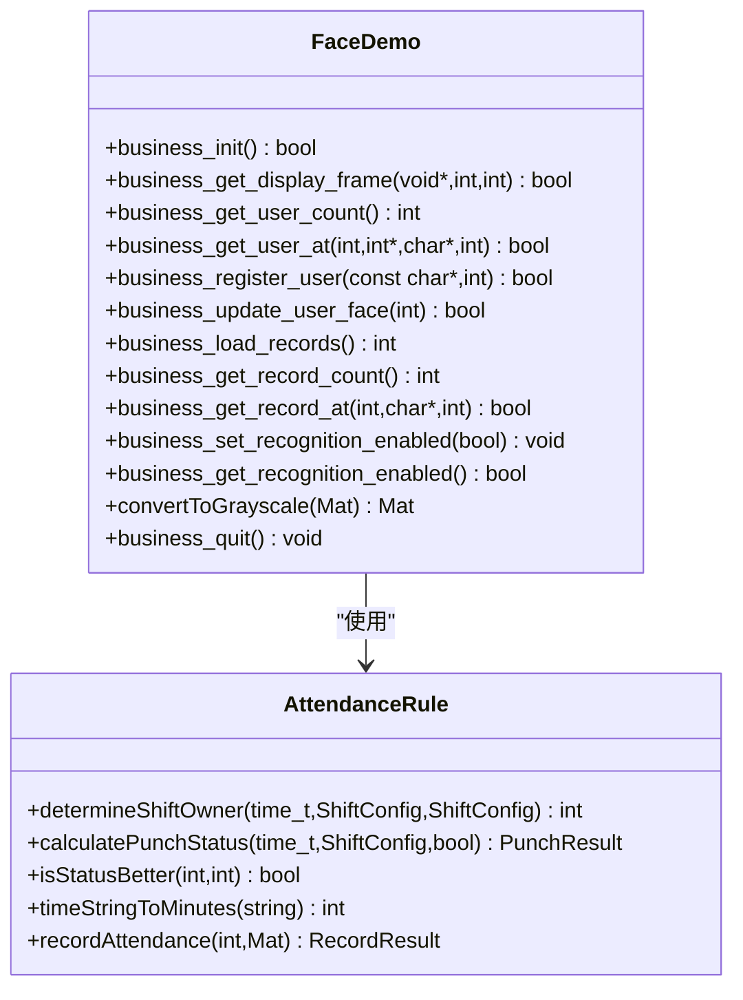
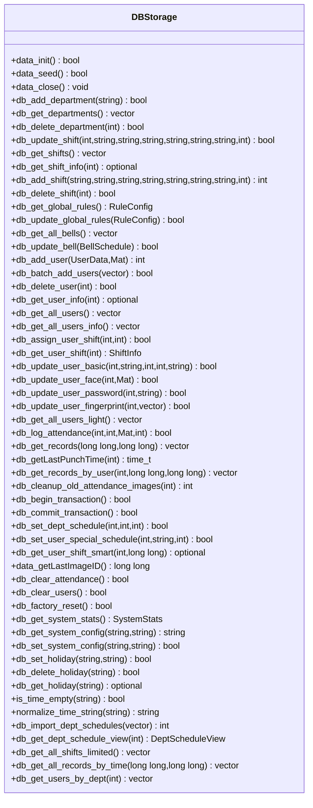
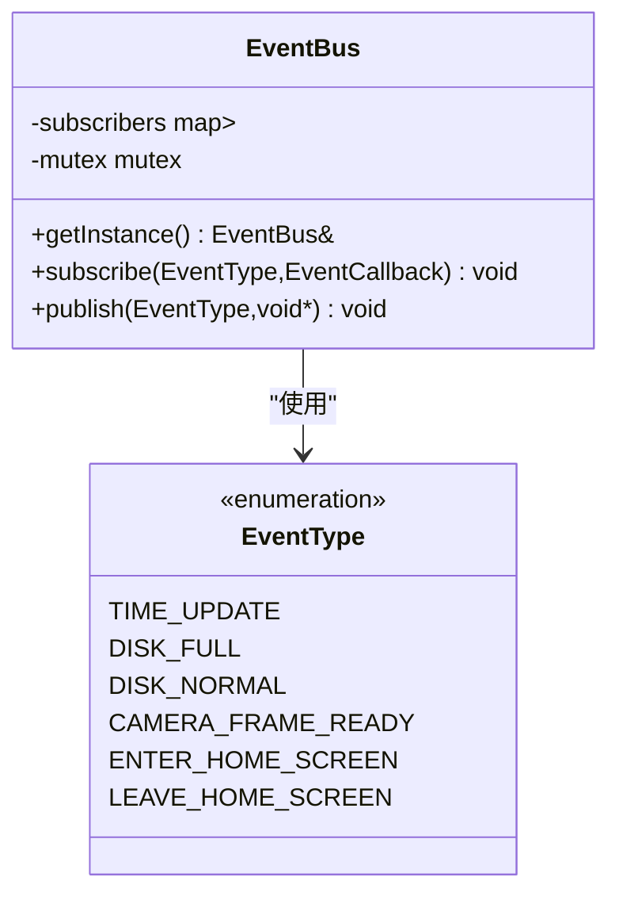
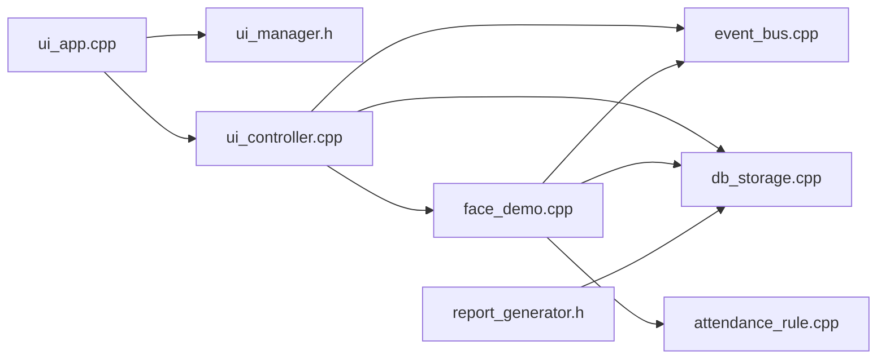

# 扩展点与API设计

<cite>
**本文档引用的文件**
- [src/business/event_bus.h](file://src/business/event_bus.h)
- [src/business/event_bus.cpp](file://src/business/event_bus.cpp)
- [src/business/face_demo.h](file://src/business/face_demo.h)
- [src/business/face_demo.cpp](file://src/business/face_demo.cpp)
- [src/business/attendance_rule.h](file://src/business/attendance_rule.h)
- [src/business/attendance_rule.cpp](file://src/business/attendance_rule.cpp)
- [src/business/report_generator.h](file://src/business/report_generator.h)
- [src/data/db_storage.h](file://src/data/db_storage.h)
- [src/data/db_storage.cpp](file://src/data/db_storage.cpp)
- [src/ui/ui_controller.h](file://src/ui/ui_controller.h)
- [src/ui/ui_controller.cpp](file://src/ui/ui_controller.cpp)
- [src/ui/managers/ui_manager.h](file://src/ui/managers/ui_manager.h)
- [src/ui/ui_app.h](file://src/ui/ui_app.h)
- [src/ui/ui_app.cpp](file://src/ui/ui_app.cpp)
- [src/main.cpp](file://src/main.cpp)
</cite>

## 目录
1. [简介](#简介)
2. [项目结构](#项目结构)
3. [核心组件](#核心组件)
4. [架构总览](#架构总览)
5. [详细组件分析](#详细组件分析)
6. [依赖关系分析](#依赖关系分析)
7. [性能考虑](#性能考虑)
8. [故障排查指南](#故障排查指南)
9. [结论](#结论)
10. [附录](#附录)

## 简介
本指南聚焦智能考勤系统的扩展点识别与API设计原则，面向希望基于现有框架进行二次开发的工程师。文档将系统梳理UI控制器的扩展接口、业务层的插件接口、数据层的DAO扩展点，并给出事件总线的扩展机制与最佳实践。同时提供API设计的稳定性、向后兼容性与版本管理策略，帮助开发者设计高质量的扩展功能。

## 项目结构
系统采用清晰的三层架构：
- UI层：负责界面渲染与交互，通过控制器封装业务调用，管理屏幕与输入设备。
- 业务层：封装人脸识别、考勤规则、报表生成等核心业务逻辑，提供稳定的对外接口。
- 数据层：封装SQLite访问、事务控制、缓存与并发安全，提供DAO接口。

**图表来源**
- [src/ui/ui_app.cpp:34-94](file://src/ui/ui_app.cpp#L34-L94)
- [src/ui/managers/ui_manager.h:71-156](file://src/ui/managers/ui_manager.h#L71-L156)
- [src/ui/ui_controller.cpp:380-410](file://src/ui/ui_controller.cpp#L380-L410)
- [src/business/face_demo.cpp:557-694](file://src/business/face_demo.cpp#L557-L694)
- [src/business/event_bus.cpp:3-28](file://src/business/event_bus.cpp#L3-L28)
- [src/business/attendance_rule.cpp:263-342](file://src/business/attendance_rule.cpp#L263-L342)
- [src/business/report_generator.h:31-192](file://src/business/report_generator.h#L31-L192)
- [src/data/db_storage.cpp:133-310](file://src/data/db_storage.cpp#L133-L310)

**章节来源**
- [src/ui/ui_app.cpp:34-94](file://src/ui/ui_app.cpp#L34-L94)
- [src/ui/managers/ui_manager.h:71-156](file://src/ui/managers/ui_manager.h#L71-L156)
- [src/ui/ui_controller.cpp:380-410](file://src/ui/ui_controller.cpp#L380-L410)
- [src/business/face_demo.cpp:557-694](file://src/business/face_demo.cpp#L557-L694)
- [src/business/event_bus.cpp:3-28](file://src/business/event_bus.cpp#L3-L28)
- [src/business/attendance_rule.cpp:263-342](file://src/business/attendance_rule.cpp#L263-L342)
- [src/business/report_generator.h:31-192](file://src/business/report_generator.h#L31-L192)
- [src/data/db_storage.cpp:133-310](file://src/data/db_storage.cpp#L133-L310)

## 核心组件
- UI控制器（UiController）：提供统一的业务调用封装，负责系统状态查询、员工管理、记录查询、报表导出、摄像头帧更新、后台服务启动等。通过单例模式提供全局访问。
- 业务层（FaceDemo）：封装人脸识别、训练、预处理、识别线程、数据库写入线程、事件发布等。提供C/C++双接口，便于UI与业务交互。
- 事件总线（EventBus）：提供线程安全的事件订阅与发布机制，支持时间更新、磁盘状态、摄像头帧就绪等事件。
- 数据层（DBStorage）：提供完整的DAO接口，包括部门、班次、用户、考勤记录、报表辅助查询等，内置并发控制与事务支持。
- 报表生成（ReportGenerator）：封装Excel报表导出，支持全员/个人报表与设置表导出。
- UI管理器（UiManager）：负责屏幕注册、输入组管理、摄像头帧缓冲区与线程安全更新。

**章节来源**
- [src/ui/ui_controller.h:21-110](file://src/ui/ui_controller.h#L21-L110)
- [src/ui/ui_controller.cpp:30-35](file://src/ui/ui_controller.cpp#L30-L35)
- [src/business/face_demo.h:29-212](file://src/business/face_demo.h#L29-L212)
- [src/business/event_bus.h:10-43](file://src/business/event_bus.h#L10-L43)
- [src/data/db_storage.h:213-683](file://src/data/db_storage.h#L213-L683)
- [src/business/report_generator.h:31-192](file://src/business/report_generator.h#L31-L192)
- [src/ui/managers/ui_manager.h:71-156](file://src/ui/managers/ui_manager.h#L71-L156)

## 架构总览
系统通过UI控制器统一调度业务与数据层，业务层内部通过事件总线与UI层解耦，数据层提供稳定的数据访问与并发保障。UI层通过管理器集中管理屏幕与输入，确保扩展屏幕时的一致性与安全性。

**图表来源**
- [src/main.cpp:213-225](file://src/main.cpp#L213-L225)
- [src/ui/ui_app.cpp:86-93](file://src/ui/ui_app.cpp#L86-L93)
- [src/ui/managers/ui_manager.h:84-103](file://src/ui/managers/ui_manager.h#L84-L103)
- [src/ui/ui_controller.cpp:380-410](file://src/ui/ui_controller.cpp#L380-L410)
- [src/business/face_demo.cpp:557-694](file://src/business/face_demo.cpp#L557-L694)
- [src/business/event_bus.cpp:3-28](file://src/business/event_bus.cpp#L3-L28)
- [src/data/db_storage.cpp:133-310](file://src/data/db_storage.cpp#L133-L310)

## 详细组件分析

### UI控制器扩展点
- 统一业务封装：UI控制器将业务层与数据层接口整合，提供简洁的API供UI调用，降低UI复杂度。
- 后台服务：提供监控线程与采集线程，分别处理时间/磁盘事件与摄像头帧采集，通过事件总线与UI解耦。
- 摄像头帧更新：提供线程安全的帧缓存与更新接口，配合UI管理器的显示缓冲区。
- 报表导出：封装报表生成逻辑，支持导出到USB目录，便于扩展其他导出方式。
- 数据维护：提供工厂重置、清空数据、导入员工设置等功能，便于系统维护与迁移。

**图表来源**
- [src/ui/ui_controller.h:21-110](file://src/ui/ui_controller.h#L21-L110)
- [src/ui/ui_controller.cpp:30-35](file://src/ui/ui_controller.cpp#L30-L35)

**章节来源**
- [src/ui/ui_controller.h:21-110](file://src/ui/ui_controller.h#L21-L110)
- [src/ui/ui_controller.cpp:380-410](file://src/ui/ui_controller.cpp#L380-L410)

### 业务层插件接口
- 人脸识别与预处理：提供人脸检测、预处理配置、识别开关、训练与模型保存等接口，支持多线程与异步写库。
- 识别线程与写库线程：识别线程负责检测、跟踪、状态计算与队列推送；写库线程负责串行写入数据库，避免并发冲突。
- 事件订阅：业务层订阅屏幕切换事件，动态控制识别开关，实现UI与业务的松耦合。
- 考勤规则：提供打卡归属判断、状态计算、重复打卡防抖、跨天处理等规则引擎接口。

**图表来源**
- [src/business/face_demo.h:29-212](file://src/business/face_demo.h#L29-L212)
- [src/business/face_demo.cpp:557-694](file://src/business/face_demo.cpp#L557-L694)
- [src/business/attendance_rule.h:43-92](file://src/business/attendance_rule.h#L43-L92)
- [src/business/attendance_rule.cpp:148-342](file://src/business/attendance_rule.cpp#L148-L342)

**章节来源**
- [src/business/face_demo.h:29-212](file://src/business/face_demo.h#L29-L212)
- [src/business/face_demo.cpp:287-549](file://src/business/face_demo.cpp#L287-L549)
- [src/business/attendance_rule.h:43-92](file://src/business/attendance_rule.h#L43-L92)
- [src/business/attendance_rule.cpp:148-342](file://src/business/attendance_rule.cpp#L148-L342)

### 数据层DAO扩展点
- 并发与事务：使用共享锁/互斥锁与RAII语义封装语句生命周期，提供事务接口，确保并发安全与一致性。
- 数据结构：定义完整的领域模型（部门、班次、用户、考勤记录、规则配置等），便于扩展与查询。
- 扩展接口：提供批量导入、报表辅助查询、系统配置、节假日管理等接口，满足业务扩展需求。

**图表来源**
- [src/data/db_storage.h:213-683](file://src/data/db_storage.h#L213-L683)

**章节来源**
- [src/data/db_storage.h:213-683](file://src/data/db_storage.h#L213-L683)
- [src/data/db_storage.cpp:133-310](file://src/data/db_storage.cpp#L133-L310)

### 事件总线扩展机制
- 事件类型：定义时间更新、磁盘状态、摄像头帧就绪、屏幕切换等事件类型。
- 订阅与发布：提供线程安全的订阅与发布接口，内部使用互斥锁保护订阅列表，发布时复制回调列表以避免迭代过程中的锁持有。
- 扩展事件：可在业务层或UI层新增自定义事件类型与处理器，通过统一的事件总线进行解耦通信。

**图表来源**
- [src/business/event_bus.h:10-43](file://src/business/event_bus.h#L10-L43)
- [src/business/event_bus.cpp:3-28](file://src/business/event_bus.cpp#L3-L28)

**章节来源**
- [src/business/event_bus.h:10-43](file://src/business/event_bus.h#L10-L43)
- [src/business/event_bus.cpp:3-28](file://src/business/event_bus.cpp#L3-L28)

### 报表生成扩展点
- 多报表类型：支持全员报表、个人报表与员工设置表导出。
- Sheet组织：报表生成器内部组织多个Sheet，便于扩展新的报表维度。
- 数据访问：封装数据库访问接口，便于扩展新的查询与统计逻辑。

**章节来源**
- [src/business/report_generator.h:31-192](file://src/business/report_generator.h#L31-L192)

## 依赖关系分析
- UI层依赖UI控制器与UI管理器，UI控制器进一步依赖业务层与数据层。
- 业务层依赖数据层与事件总线，同时通过事件总线与UI层解耦。
- 数据层提供DAO接口，内部使用SQLite与OpenCV，提供并发与事务保障。

**图表来源**
- [src/ui/ui_app.cpp:34-94](file://src/ui/ui_app.cpp#L34-L94)
- [src/ui/managers/ui_manager.h:71-156](file://src/ui/managers/ui_manager.h#L71-L156)
- [src/ui/ui_controller.cpp:380-410](file://src/ui/ui_controller.cpp#L380-L410)
- [src/business/face_demo.cpp:557-694](file://src/business/face_demo.cpp#L557-L694)
- [src/business/event_bus.cpp:3-28](file://src/business/event_bus.cpp#L3-L28)
- [src/business/attendance_rule.cpp:263-342](file://src/business/attendance_rule.cpp#L263-L342)
- [src/business/report_generator.h:31-192](file://src/business/report_generator.h#L31-L192)
- [src/data/db_storage.cpp:133-310](file://src/data/db_storage.cpp#L133-L310)

**章节来源**
- [src/ui/ui_app.cpp:34-94](file://src/ui/ui_app.cpp#L34-L94)
- [src/ui/managers/ui_manager.h:71-156](file://src/ui/managers/ui_manager.h#L71-L156)
- [src/ui/ui_controller.cpp:380-410](file://src/ui/ui_controller.cpp#L380-L410)
- [src/business/face_demo.cpp:557-694](file://src/business/face_demo.cpp#L557-L694)
- [src/business/event_bus.cpp:3-28](file://src/business/event_bus.cpp#L3-L28)
- [src/business/attendance_rule.cpp:263-342](file://src/business/attendance_rule.cpp#L263-L342)
- [src/business/report_generator.h:31-192](file://src/business/report_generator.h#L31-L192)
- [src/data/db_storage.cpp:133-310](file://src/data/db_storage.cpp#L133-L310)

## 性能考虑
- 并发与锁：数据层使用共享锁/互斥锁与RAII语句封装，避免重复释放与竞态；业务层使用读写锁分离，提高并发读性能。
- 异步写库：识别线程将打卡任务放入队列，写库线程串行处理，避免SQLite多线程竞争，提升吞吐。
- 跳帧与限流：识别线程采用跳帧策略与UI刷新限流，平衡识别精度与显示流畅度。
- 预编译语句：数据层对高频插入语句进行预编译，减少SQL解析开销。

**章节来源**
- [src/data/db_storage.cpp:35-65](file://src/data/db_storage.cpp#L35-L65)
- [src/business/face_demo.cpp:246-285](file://src/business/face_demo.cpp#L246-L285)
- [src/business/face_demo.cpp:291-549](file://src/business/face_demo.cpp#L291-L549)

## 故障排查指南
- 事件未触发：确认订阅是否在业务层初始化前完成，UI控制器启动后台服务时会发布事件，需确保订阅在业务层初始化后进行。
- 摄像头无帧：检查识别线程是否正常运行，确认帧缓冲区大小与UI管理器提供的缓冲区匹配。
- 数据库写入失败：检查写库线程状态与队列长度，避免队列溢出导致丢弃任务。
- 报表导出异常：确认输出目录存在与权限，检查报表生成器的Sheet写入逻辑。

**章节来源**
- [src/business/event_bus.cpp:3-28](file://src/business/event_bus.cpp#L3-L28)
- [src/business/face_demo.cpp:246-285](file://src/business/face_demo.cpp#L246-L285)
- [src/ui/ui_controller.cpp:212-231](file://src/ui/ui_controller.cpp#L212-L231)
- [src/business/report_generator.h:90-192](file://src/business/report_generator.h#L90-L192)

## 结论
本系统通过清晰的分层架构与完善的扩展点设计，实现了UI、业务与数据层的解耦与高内聚。事件总线提供了灵活的异步通信机制，UI控制器与业务层的接口设计保证了扩展的稳定性与可维护性。遵循本文档的API设计原则与最佳实践，开发者可以安全地扩展UI屏幕、业务算法与数据访问逻辑。

## 附录

### API设计原则与版本管理策略
- 接口稳定性
  - 保持对外接口签名稳定，避免破坏性变更。
  - 对新增功能采用可选参数或默认值，确保旧调用仍可工作。
- 向后兼容性
  - 新增字段或枚举值时，确保读取端具备默认值处理逻辑。
  - 对于可选功能，提供开关或配置项，避免强制依赖。
- 版本管理策略
  - 采用语义化版本号，主版本号用于破坏性变更，次版本号用于新增功能，修订号用于修复。
  - 对外发布的接口与数据结构在文档中标注版本范围，便于调用方评估兼容性。

### 事件总线扩展指南
- 自定义事件类型
  - 在事件枚举中新增事件类型，确保命名清晰且唯一。
- 事件处理器注册
  - 在业务层或UI层初始化阶段注册事件处理器，确保事件订阅在业务启动前完成。
- 异步事件处理
  - 对于耗时操作，使用队列与线程池异步处理，避免阻塞主线程。

### 扩展点使用示例
- 继承与重写扩展接口
  - UI控制器提供丰富的业务封装接口，可在不改变现有逻辑的前提下扩展新功能。
- 注册自定义组件
  - 通过UI管理器注册新屏幕，确保输入组与资源管理的一致性。
- 生命周期管理
  - 业务层与数据层均提供初始化与清理接口，扩展时需遵循相同的生命周期管理。

**章节来源**
- [src/ui/ui_controller.h:21-110](file://src/ui/ui_controller.h#L21-L110)
- [src/ui/managers/ui_manager.h:105-122](file://src/ui/managers/ui_manager.h#L105-L122)
- [src/business/face_demo.cpp:557-694](file://src/business/face_demo.cpp#L557-L694)
- [src/data/db_storage.cpp:133-310](file://src/data/db_storage.cpp#L133-L310)