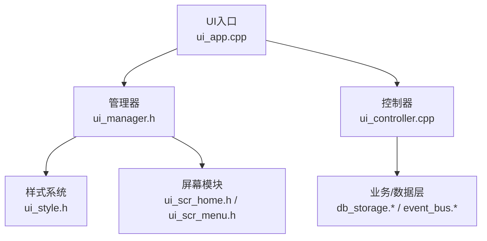
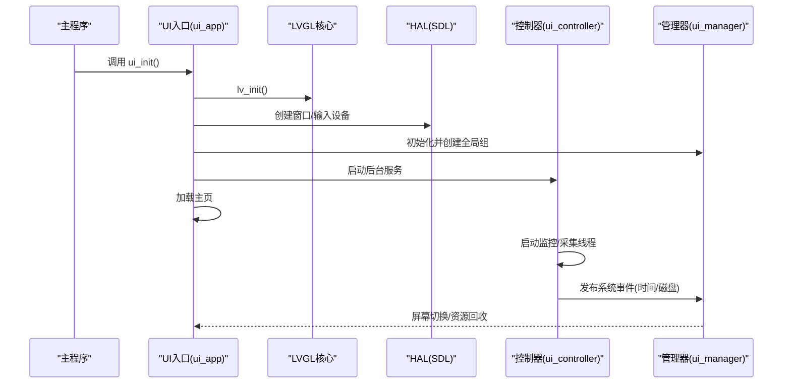
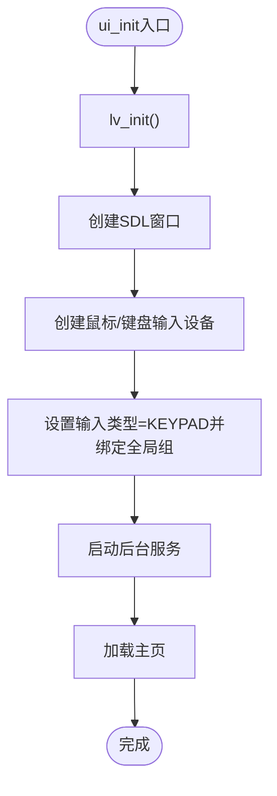
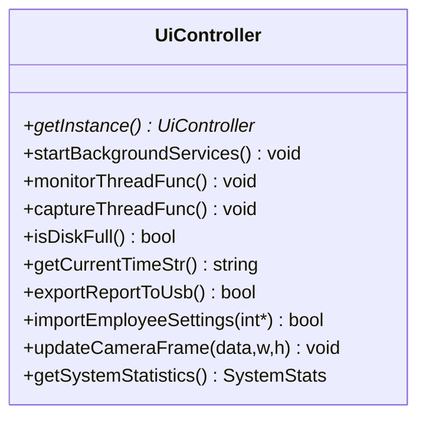
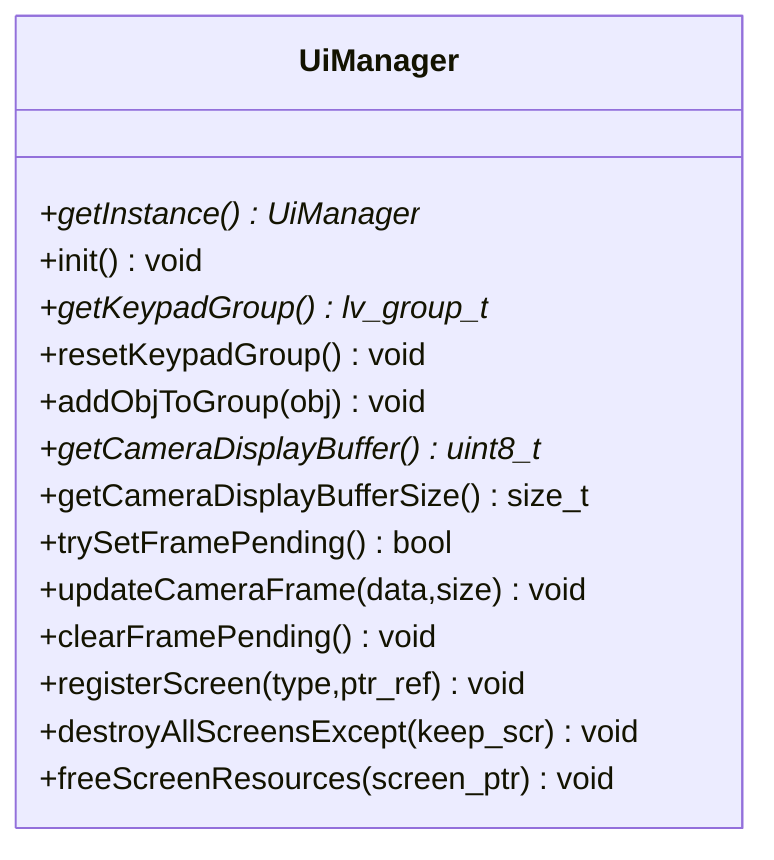
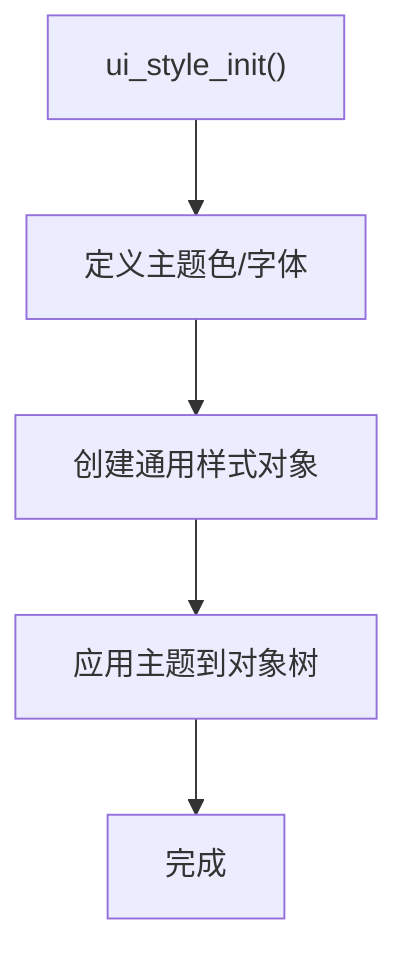
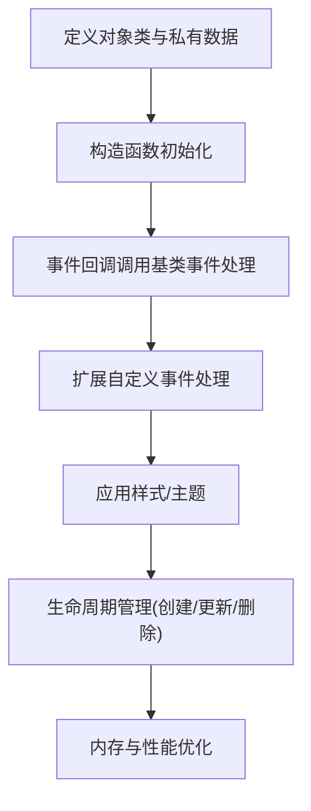
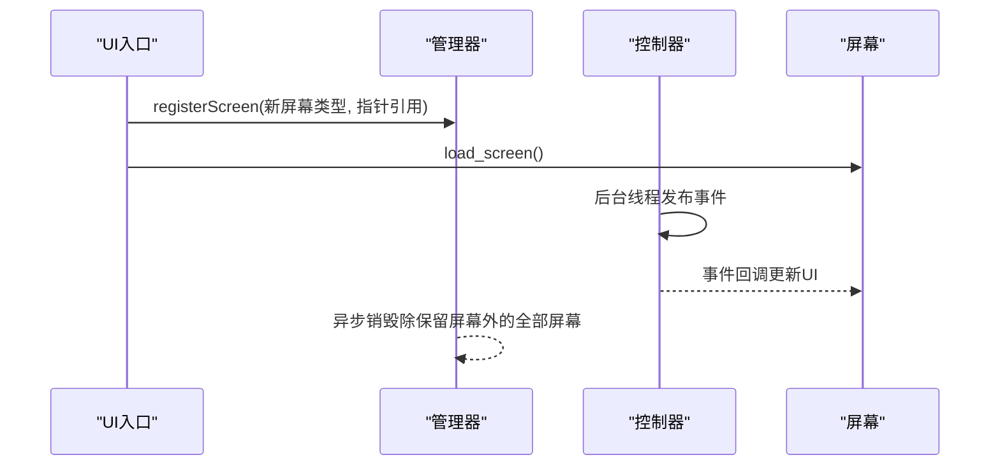
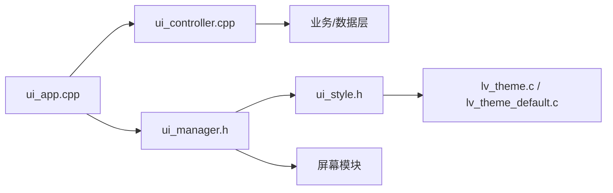

# UI组件扩展

<cite>
**本文档引用的文件**
- [lv_conf.h](file://lv_conf.h)
- [ui_app.h](file://src/ui/ui_app.h)
- [ui_app.cpp](file://src/ui/ui_app.cpp)
- [ui_controller.h](file://src/ui/ui_controller.h)
- [ui_controller.cpp](file://src/ui/ui_controller.cpp)
- [ui_manager.h](file://src/ui/managers/ui_manager.h)
- [ui_style.h](file://src/ui/common/ui_style.h)
- [ui_scr_home.h](file://src/ui/screens/home/ui_scr_home.h)
- [ui_scr_menu.h](file://src/ui/screens/menu/ui_scr_menu.h)
- [lv_theme.c](file://libs/lvgl/src/themes/lv_theme.c)
- [lv_theme_default.c](file://libs/lvgl/src/themes/default/lv_theme_default.c)
- [lv_objx_templ.c](file://libs/lvgl/src/widgets/objx_templ/lv_objx_templ.c)
</cite>

## 目录
1. [简介](#简介)
2. [项目结构](#项目结构)
3. [核心组件](#核心组件)
4. [架构总览](#架构总览)
5. [详细组件分析](#详细组件分析)
6. [依赖关系分析](#依赖关系分析)
7. [性能考量](#性能考量)
8. [故障排查指南](#故障排查指南)
9. [结论](#结论)
10. [附录](#附录)

## 简介
本指南面向希望在SmartAttendance项目中基于LVGL框架扩展自定义UI组件的开发者，涵盖以下主题：
- 基于LVGL的对象类与事件系统，构建自定义控件的完整流程
- 屏幕管理系统扩展：新增屏幕、导航与状态管理
- 样式系统定制：主题切换、动态样式修改、响应式布局
- 生命周期管理、内存优化与性能注意事项
- 提供从头文件声明、实现文件编写到资源集成的实践路径

## 项目结构
SmartAttendance的UI子系统采用分层组织：
- UI入口与平台适配：ui_app.*负责LVGL初始化、HAL(SDL)与输入设备绑定
- 控制器层：ui_controller.*封装业务/数据交互，提供线程与事件发布
- 管理器层：ui_manager.*统一管理屏幕、输入组、摄像头帧缓存
- 样式与主题：ui_style.h集中定义颜色、字体与通用样式
- 屏幕模块：按功能划分的屏幕文件，如home、menu等

**图表来源**
- [ui_app.cpp:34-94](file://src/ui/ui_app.cpp#L34-L94)
- [ui_manager.h:71-156](file://src/ui/managers/ui_manager.h#L71-L156)
- [ui_controller.cpp:380-410](file://src/ui/ui_controller.cpp#L380-L410)
- [ui_style.h:15-48](file://src/ui/common/ui_style.h#L15-L48)
- [ui_scr_home.h:10-28](file://src/ui/screens/home/ui_scr_home.h#L10-L28)
- [ui_scr_menu.h:9-17](file://src/ui/screens/menu/ui_scr_menu.h#L9-L17)

**章节来源**
- [ui_app.cpp:34-94](file://src/ui/ui_app.cpp#L34-L94)
- [ui_manager.h:71-156](file://src/ui/managers/ui_manager.h#L71-L156)
- [ui_controller.cpp:380-410](file://src/ui/ui_controller.cpp#L380-L410)
- [ui_style.h:15-48](file://src/ui/common/ui_style.h#L15-L48)
- [ui_scr_home.h:10-28](file://src/ui/screens/home/ui_scr_home.h#L10-L28)
- [ui_scr_menu.h:9-17](file://src/ui/screens/menu/ui_scr_menu.h#L9-L17)

## 核心组件
- UI入口与HAL初始化：负责LVGL初始化、SDL窗口与输入设备创建、键盘绑定到全局组、加载主页
- 控制器：封装业务逻辑、后台线程、事件发布（时间、磁盘状态）、数据导入导出
- 管理器：输入组管理、屏幕注册与销毁、摄像头帧缓存与同步
- 样式系统：主题色、字体、通用样式对象的集中定义与初始化
- 屏幕模块：各功能页面的加载与更新接口

**章节来源**
- [ui_app.cpp:34-94](file://src/ui/ui_app.cpp#L34-L94)
- [ui_controller.h:21-110](file://src/ui/ui_controller.h#L21-L110)
- [ui_controller.cpp:380-680](file://src/ui/ui_controller.cpp#L380-L680)
- [ui_manager.h:71-156](file://src/ui/managers/ui_manager.h#L71-L156)
- [ui_style.h:15-48](file://src/ui/common/ui_style.h#L15-L48)
- [ui_scr_home.h:10-28](file://src/ui/screens/home/ui_scr_home.h#L10-L28)
- [ui_scr_menu.h:9-17](file://src/ui/screens/menu/ui_scr_menu.h#L9-L17)

## 架构总览
下图展示了UI子系统的运行时交互：入口初始化LVGL与HAL，创建输入设备并绑定键盘组，启动控制器后台服务，加载主页；控制器通过事件总线发布系统状态，管理器负责屏幕生命周期与资源回收。

**图表来源**
- [ui_app.cpp:34-94](file://src/ui/ui_app.cpp#L34-L94)
- [ui_controller.cpp:380-410](file://src/ui/ui_controller.cpp#L380-L410)
- [ui_manager.h:71-156](file://src/ui/managers/ui_manager.h#L71-L156)

## 详细组件分析

### UI入口与HAL初始化
- 初始化LVGL与SDL窗口/输入设备
- 将键盘输入类型设置为KEYPAD并绑定到全局组，开启循环跳转
- 启动控制器后台服务后加载主页

**图表来源**
- [ui_app.cpp:34-94](file://src/ui/ui_app.cpp#L34-L94)

**章节来源**
- [ui_app.cpp:34-94](file://src/ui/ui_app.cpp#L34-L94)

### 控制器：业务与事件中枢
- 单例模式提供全局访问
- 后台线程：监控线程每秒发布时间事件，每5秒检查磁盘状态
- 采集线程：定期从业务层获取摄像头帧并推送至管理器
- 数据接口：用户管理、报表导出/导入、系统统计等

**图表来源**
- [ui_controller.h:21-110](file://src/ui/ui_controller.h#L21-L110)
- [ui_controller.cpp:380-680](file://src/ui/ui_controller.cpp#L380-L680)

**章节来源**
- [ui_controller.h:21-110](file://src/ui/ui_controller.h#L21-L110)
- [ui_controller.cpp:380-680](file://src/ui/ui_controller.cpp#L380-L680)

### 管理器：屏幕与资源管理
- 输入组管理：提供全局组句柄，支持清空与对象加入
- 屏幕管理：注册屏幕指针引用，支持异步销毁除保留屏幕外的全部屏幕
- 摄像头帧管理：线程安全的RGB帧缓存与待更新标记

**图表来源**
- [ui_manager.h:71-156](file://src/ui/managers/ui_manager.h#L71-L156)

**章节来源**
- [ui_manager.h:71-156](file://src/ui/managers/ui_manager.h#L71-L156)

### 样式系统与主题
- 颜色与字体：集中定义主题色、字体声明与通用样式对象
- 主题应用：通过LVGL主题API获取与应用主题，支持小/正常/大字体与主/辅颜色查询

**图表来源**
- [ui_style.h:15-48](file://src/ui/common/ui_style.h#L15-L48)
- [lv_theme.c:40-108](file://libs/lvgl/src/themes/lv_theme.c#L40-L108)
- [lv_theme_default.c:625-648](file://libs/lvgl/src/themes/default/lv_theme_default.c#L625-L648)

**章节来源**
- [ui_style.h:15-48](file://src/ui/common/ui_style.h#L15-L48)
- [lv_theme.c:40-108](file://libs/lvgl/src/themes/lv_theme.c#L40-L108)
- [lv_theme_default.c:625-648](file://libs/lvgl/src/themes/default/lv_theme_default.c#L625-L648)

### 自定义控件开发指南（基于LVGL）
- 继承体系与类定义
  - 使用对象类结构体定义控件行为与属性
  - 在构造/析构中初始化/释放控件私有数据
  - 事件处理：调用基类事件处理并在此基础上扩展
- 属性定义
  - 通过样式与自定义属性实现外观与行为
  - 利用LVGL的属性系统与样式生成器
- 事件处理机制
  - 在事件回调中处理点击、焦点、动画等
  - 与控制器/管理器协作，触发业务逻辑与屏幕切换
- 示例路径
  - 参考模板控件实现位置：[lv_objx_templ.c:99-141](file://libs/lvgl/src/widgets/objx_templ/lv_objx_templ.c#L99-L141)

**图表来源**
- [lv_objx_templ.c:99-141](file://libs/lvgl/src/widgets/objx_templ/lv_objx_templ.c#L99-L141)

**章节来源**
- [lv_objx_templ.c:99-141](file://libs/lvgl/src/widgets/objx_templ/lv_objx_templ.c#L99-L141)

### 屏幕管理系统扩展
- 新增屏幕
  - 在枚举中添加ScreenType项
  - 在管理器中注册屏幕指针引用
  - 提供load_*接口并在入口中调用
- 导航逻辑
  - 通过管理器的屏幕注册与销毁机制，确保资源及时回收
  - 使用事件总线在控制器层发布状态变化，驱动UI更新
- 状态管理
  - 使用原子标志与互斥锁保证帧同步与线程安全
  - 通过控制器线程定期发布系统状态事件

**图表来源**
- [ui_manager.h:105-122](file://src/ui/managers/ui_manager.h#L105-L122)
- [ui_scr_home.h:10-28](file://src/ui/screens/home/ui_scr_home.h#L10-L28)
- [ui_scr_menu.h:9-17](file://src/ui/screens/menu/ui_scr_menu.h#L9-L17)
- [ui_controller.cpp:394-410](file://src/ui/ui_controller.cpp#L394-L410)

**章节来源**
- [ui_manager.h:105-122](file://src/ui/managers/ui_manager.h#L105-L122)
- [ui_scr_home.h:10-28](file://src/ui/screens/home/ui_scr_home.h#L10-L28)
- [ui_scr_menu.h:9-17](file://src/ui/screens/menu/ui_scr_menu.h#L9-L17)
- [ui_controller.cpp:394-410](file://src/ui/ui_controller.cpp#L394-L410)

### UI样式系统的定制化
- 主题切换
  - 通过LVGL主题API设置主/辅颜色与字体
  - 在样式初始化中应用主题到对象树
- 动态样式修改
  - 使用样式对象的属性修改接口实现运行时调整
  - 结合事件总线在状态变化时批量更新样式
- 响应式布局
  - 基于屏幕尺寸与分辨率的样式适配
  - 使用容器布局与间距常量实现一致的视觉体验

**章节来源**
- [lv_theme.c:40-108](file://libs/lvgl/src/themes/lv_theme.c#L40-L108)
- [lv_theme_default.c:625-648](file://libs/lvgl/src/themes/default/lv_theme_default.c#L625-L648)
- [ui_style.h:15-48](file://src/ui/common/ui_style.h#L15-L48)

### 生命周期管理、内存优化与性能
- 生命周期
  - 控件创建：在构造函数中分配必要资源
  - 更新：在事件回调中处理状态变化
  - 销毁：在析构函数中释放资源，避免泄漏
- 内存优化
  - 使用静态数组作为摄像头帧缓存，减少频繁分配
  - 通过原子标志与互斥锁避免竞态条件
  - 合理设置渲染缓冲与图层大小，降低内存占用
- 性能
  - 后台线程与定时器分离CPU密集型任务
  - 使用LVGL的绘制缓冲与多线程渲染配置
  - 通过配置文件控制渲染质量与性能权衡

**章节来源**
- [ui_manager.h:83-103](file://src/ui/managers/ui_manager.h#L83-L103)
- [lv_conf.h:145-167](file://lv_conf.h#L145-L167)
- [lv_conf.h:168-230](file://lv_conf.h#L168-L230)

## 依赖关系分析
- UI入口依赖管理器与控制器，控制器依赖业务/数据层
- 管理器依赖样式系统与屏幕模块
- 样式系统依赖LVGL主题与字体

**图表来源**
- [ui_app.cpp:34-94](file://src/ui/ui_app.cpp#L34-L94)
- [ui_manager.h:71-156](file://src/ui/managers/ui_manager.h#L71-L156)
- [ui_controller.cpp:380-680](file://src/ui/ui_controller.cpp#L380-L680)
- [ui_style.h:15-48](file://src/ui/common/ui_style.h#L15-L48)
- [lv_theme.c:40-108](file://libs/lvgl/src/themes/lv_theme.c#L40-L108)
- [lv_theme_default.c:625-648](file://libs/lvgl/src/themes/default/lv_theme_default.c#L625-L648)

**章节来源**
- [ui_app.cpp:34-94](file://src/ui/ui_app.cpp#L34-L94)
- [ui_manager.h:71-156](file://src/ui/managers/ui_manager.h#L71-L156)
- [ui_controller.cpp:380-680](file://src/ui/ui_controller.cpp#L380-L680)
- [ui_style.h:15-48](file://src/ui/common/ui_style.h#L15-L48)
- [lv_theme.c:40-108](file://libs/lvgl/src/themes/lv_theme.c#L40-L108)
- [lv_theme_default.c:625-648](file://libs/lvgl/src/themes/default/lv_theme_default.c#L625-L648)

## 性能考量
- 渲染配置
  - 合理设置绘制缓冲大小与图层数量上限，避免内存压力
  - 根据目标平台选择合适的软件/硬件加速方案
- 线程与定时器
  - 将耗时任务放入后台线程，避免阻塞UI主线程
  - 使用原子标志与互斥锁保证跨线程安全
- 资源管理
  - 静态分配摄像头帧缓冲，减少堆分配开销
  - 在屏幕切换时异步销毁不再使用的对象，防止内存泄漏

[本节为通用指导，无需列出具体文件来源]

## 故障排查指南
- SDL窗口创建失败
  - 检查lv_conf.h中SDL相关配置与环境变量
  - 确认SDL库安装与WSLg配置
- 键盘无法操作
  - 确认输入设备类型设置为KEYPAD并绑定到全局组
- 磁盘空间告警不生效
  - 检查监控线程是否正常运行与事件发布
- 摄像头画面不更新
  - 确认采集线程正常运行与帧缓冲大小匹配
  - 检查原子标志与互斥锁使用是否正确

**章节来源**
- [ui_app.cpp:34-94](file://src/ui/ui_app.cpp#L34-L94)
- [ui_controller.cpp:394-410](file://src/ui/ui_controller.cpp#L394-L410)
- [ui_manager.h:83-103](file://src/ui/managers/ui_manager.h#L83-L103)

## 结论
通过以上架构与实践指南，开发者可以在SmartAttendance项目中高效地扩展LVGL UI组件，实现自定义控件、屏幕与样式的深度定制。遵循生命周期管理、内存优化与性能考量的最佳实践，可确保UI系统的稳定性与流畅性。

[本节为总结性内容，无需列出具体文件来源]

## 附录
- 示例路径参考
  - 自定义控件模板实现：[lv_objx_templ.c:99-141](file://libs/lvgl/src/widgets/objx_templ/lv_objx_templ.c#L99-L141)
  - 主题应用与字体查询：[lv_theme.c:40-108](file://libs/lvgl/src/themes/lv_theme.c#L40-L108)、[lv_theme_default.c:625-648](file://libs/lvgl/src/themes/default/lv_theme_default.c#L625-L648)
  - UI入口初始化与HAL绑定：[ui_app.cpp:34-94](file://src/ui/ui_app.cpp#L34-94)
  - 控制器后台服务与事件发布：[ui_controller.cpp:380-410](file://src/ui/ui_controller.cpp#L380-410)
  - 屏幕管理与资源回收：[ui_manager.h:105-122](file://src/ui/managers/ui_manager.h#L105-122)
  - 样式与主题初始化：[ui_style.h:15-48](file://src/ui/common/ui_style.h#L15-48)