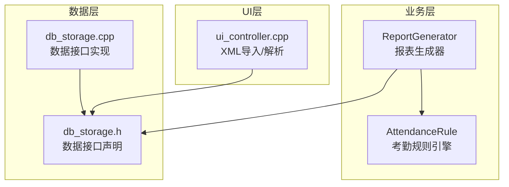
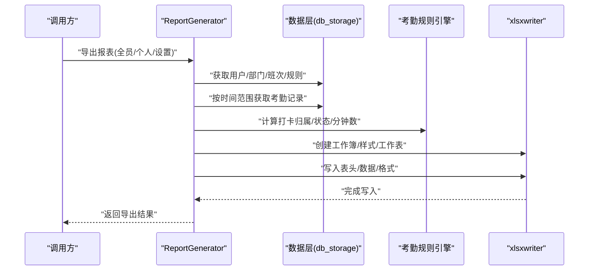
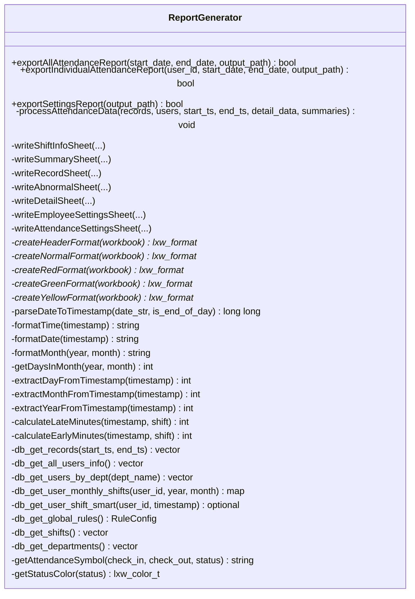
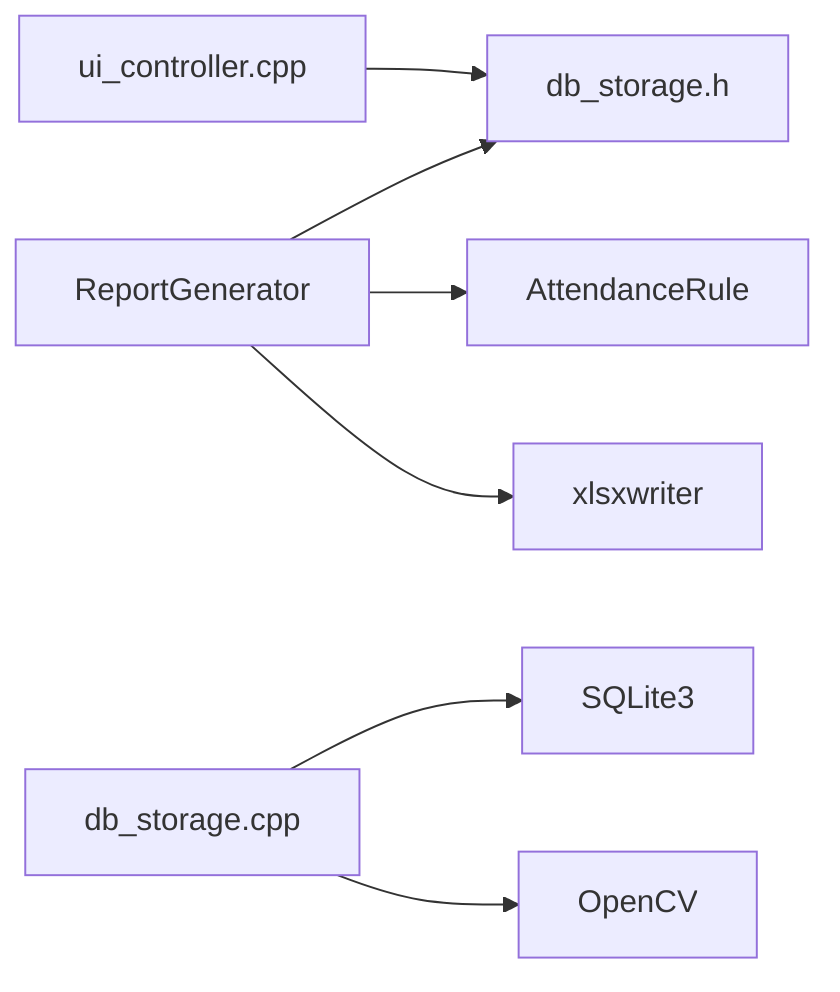

# 报表格式扩展

<cite>
**本文引用的文件**
- [report_generator.h](file://src/business/report_generator.h)
- [report_generator.cpp](file://src/business/report_generator.cpp)
- [db_storage.h](file://src/data/db_storage.h)
- [db_storage.cpp](file://src/data/db_storage.cpp)
- [attendance_rule.h](file://src/business/attendance_rule.h)
- [ui_controller.cpp](file://src/ui/ui_controller.cpp)
</cite>

## 目录
1. [简介](#简介)
2. [项目结构](#项目结构)
3. [核心组件](#核心组件)
4. [架构总览](#架构总览)
5. [详细组件分析](#详细组件分析)
6. [依赖关系分析](#依赖关系分析)
7. [性能考量](#性能考量)
8. [故障排查指南](#故障排查指南)
9. [结论](#结论)
10. [附录](#附录)

## 简介
本指南面向需要扩展现有报表生成功能的开发者，围绕“报表格式扩展”的目标，系统讲解如下主题：
- 如何创建自定义报表模板（Excel 工作簿与多工作表布局）
- 如何扩展数据导出格式（基于 xlsxwriter 的样式与内容写入）
- 如何实现报表字段的动态配置（按日期、班次、人员维度灵活组织）
- Excel 报表生成技术实现要点（xlsxwriter 库使用、表格样式定制、数据格式化）
- 报表数据源扩展方法（自定义查询语句、数据聚合逻辑、统计计算函数）
- 报表格式的标准化接口设计（模板引擎、样式系统、国际化支持）
- 提供可直接落地的代码示例路径，帮助快速创建新的报表类型并集成到现有系统

## 项目结构
SmartAttendance 的报表能力集中在业务层的报表生成器模块，数据访问由数据层统一提供，UI 层具备 XML 导入能力（用于员工排班等场景）。整体结构如下：

图表来源
- [report_generator.h:1-192](file://src/business/report_generator.h#L1-L192)
- [report_generator.cpp:1-120](file://src/business/report_generator.cpp#L1-L120)
- [db_storage.h:1-120](file://src/data/db_storage.h#L1-L120)
- [db_storage.cpp:1-120](file://src/data/db_storage.cpp#L1-L120)
- [ui_controller.cpp:500-540](file://src/ui/ui_controller.cpp#L500-L540)

章节来源
- [report_generator.h:1-192](file://src/business/report_generator.h#L1-L192)
- [report_generator.cpp:1-120](file://src/business/report_generator.cpp#L1-L120)
- [db_storage.h:1-120](file://src/data/db_storage.h#L1-L120)
- [db_storage.cpp:1-120](file://src/data/db_storage.cpp#L1-L120)
- [ui_controller.cpp:500-540](file://src/ui/ui_controller.cpp#L500-L540)

## 核心组件
- 报表生成器（ReportGenerator）
  - 负责将数据库中的考勤数据转化为 Excel 工作簿，包含多个工作表（排班信息、汇总、记录、异常统计、明细、设置表等）
  - 提供多种导出入口：全员报表、个人报表、员工及考勤设置表
  - 内置样式工厂（xlsxwriter 格式对象）与数据处理流程（时间解析、班次归属、迟到/早退分钟数计算、异常统计）

- 数据层（db_storage.*）
  - 提供统一的数据访问接口，包括部门、班次、用户、考勤记录、全局规则、排班管理等
  - 支持智能排班查询（个人特殊排班 > 部门周排班 > 默认班次），并考虑周末上班规则

- 考勤规则引擎（attendance_rule.h）
  - 定义打卡状态、班次配置、折中原则（12:00-13:00 分界）等规则
  - 提供状态比较、时间字符串转分钟等辅助函数

- UI 控制器（ui_controller.cpp）
  - 提供 XML 导入解析能力（如员工排班表），用于数据源扩展的输入端

章节来源
- [report_generator.h:31-190](file://src/business/report_generator.h#L31-L190)
- [report_generator.cpp:682-837](file://src/business/report_generator.cpp#L682-L837)
- [db_storage.h:170-212](file://src/data/db_storage.h#L170-L212)
- [db_storage.cpp:519-530](file://src/data/db_storage.cpp#L519-L530)
- [attendance_rule.h:43-92](file://src/business/attendance_rule.h#L43-L92)
- [ui_controller.cpp:502-532](file://src/ui/ui_controller.cpp#L502-L532)

## 架构总览
报表生成的整体流程如下：UI/业务层触发导出请求 → 报表生成器准备时间范围与数据 → 数据层提供基础数据与规则 → 报表生成器执行数据清洗与聚合 → 使用 xlsxwriter 写入多个工作表 → 保存为 Excel 文件。

图表来源
- [report_generator.cpp:682-794](file://src/business/report_generator.cpp#L682-L794)
- [db_storage.h:447-486](file://src/data/db_storage.h#L447-L486)
- [attendance_rule.h:43-92](file://src/business/attendance_rule.h#L43-L92)

章节来源
- [report_generator.cpp:682-794](file://src/business/report_generator.cpp#L682-L794)
- [db_storage.h:447-486](file://src/data/db_storage.h#L447-L486)
- [attendance_rule.h:43-92](file://src/business/attendance_rule.h#L43-L92)

## 详细组件分析

### 报表生成器类结构与职责
- 类型与职责
  - ReportGenerator：集中管理报表生成的生命周期、样式、数据处理与多工作表写入
  - 内部结构体：DailySummary、ExceptionRecord、DailyCellData、MonthlySummary
  - 导出接口：全员报表、个人报表、员工及考勤设置表
  - 样式工厂：表头、普通、异常颜色（红/绿/橙）等格式对象
  - 数据处理：时间解析、班次归属、迟到/早退分钟数、异常统计、汇总计算

图表来源
- [report_generator.h:31-190](file://src/business/report_generator.h#L31-L190)
- [report_generator.cpp:494-676](file://src/business/report_generator.cpp#L494-L676)

章节来源
- [report_generator.h:31-190](file://src/business/report_generator.h#L31-L190)
- [report_generator.cpp:494-676](file://src/business/report_generator.cpp#L494-L676)

### Excel 报表生成技术实现
- xlsxwriter 库使用
  - 创建工作簿与工作表
  - 使用格式对象（字体、颜色、边框、对齐、自动换行、冻结窗格等）
  - 写入合并单元格、行列宽、表头与数据
- 样式定制
  - 表头：加粗、背景色、边框、居中
  - 异常：红色字体、橙色字体、绿色字体
  - 数据：统一边框与居中对齐
- 数据格式化
  - 时间戳格式化为 HH:MM、YYYY-MM-DD
  - 日期字符串解析为时间戳（支持起止边界）
  - 月天数计算与星期几推导

章节来源
- [report_generator.cpp:406-446](file://src/business/report_generator.cpp#L406-L446)
- [report_generator.cpp:82-180](file://src/business/report_generator.cpp#L82-L180)
- [report_generator.cpp:842-947](file://src/business/report_generator.cpp#L842-L947)
- [report_generator.cpp:949-1097](file://src/business/report_generator.cpp#L949-L1097)
- [report_generator.cpp:1100-1182](file://src/business/report_generator.cpp#L1100-L1182)
- [report_generator.cpp:1185-1324](file://src/business/report_generator.cpp#L1185-L1324)
- [report_generator.cpp:1327-1478](file://src/business/report_generator.cpp#L1327-L1478)
- [report_generator.cpp:1483-1599](file://src/business/report_generator.cpp#L1483-L1599)

### 报表数据源扩展方法
- 自定义查询语句
  - 使用数据层提供的接口组合查询（如按部门、按时间段、按用户）
  - 示例路径：[db_get_all_records_by_time:667-674](file://src/data/db_storage.h#L667-L674)、[db_get_users_by_dept:677-682](file://src/data/db_storage.h#L677-L682)
- 数据聚合逻辑
  - 在报表生成器中实现按日/按月的聚合（迟到次数与分钟数、早退次数与分钟数、旷工天数、未排班天数）
  - 示例路径：[processAttendanceData:505-676](file://src/business/report_generator.cpp#L505-L676)
- 统计计算函数
  - 迟到/早退分钟数计算（结合班次与分界点）
  - 示例路径：[calculateLateMinutes:187-225](file://src/business/report_generator.cpp#L187-L225)、[calculateEarlyMinutes:233-266](file://src/business/report_generator.cpp#L233-L266)

章节来源
- [db_storage.h:667-682](file://src/data/db_storage.h#L667-L682)
- [report_generator.cpp:505-676](file://src/business/report_generator.cpp#L505-L676)
- [report_generator.cpp:187-266](file://src/business/report_generator.cpp#L187-L266)

### 报表字段的动态配置
- 日期维度：起止日期解析、当月天数、星期推导
- 班次维度：智能排班查询（个人 > 部门 > 默认），考虑跨日与周末规则
- 人员维度：按部门筛选、按用户筛选、职位映射
- 示例路径：
  - [parseDateToTimestamp/formatDate/formatTime:52-110](file://src/business/report_generator.cpp#L52-L110)
  - [db_get_user_shift_smart:519-530](file://src/data/db_storage.cpp#L519-L530)
  - [db_get_users_by_dept:677-682](file://src/data/db_storage.h#L677-L682)

章节来源
- [report_generator.cpp:52-110](file://src/business/report_generator.cpp#L52-L110)
- [db_storage.cpp:519-530](file://src/data/db_storage.cpp#L519-L530)
- [db_storage.h:677-682](file://src/data/db_storage.h#L677-L682)

### 报表格式的标准化接口设计
- 模板引擎
  - 以“工作簿 + 多工作表 + 样式工厂”的方式组织模板，便于扩展新的报表类型
  - 示例路径：[writeShiftInfoSheet:842-947](file://src/business/report_generator.cpp#L842-L947)、[writeSummarySheet:949-1097](file://src/business/report_generator.cpp#L949-L1097)
- 样式系统
  - 通过 createHeaderFormat/createNormalFormat/createRedFormat 等工厂方法集中管理样式
  - 示例路径：[样式工厂:406-446](file://src/business/report_generator.cpp#L406-L446)
- 国际化支持
  - 数据层提供语言设置（language），可用于控制日期格式、提示文本等
  - 示例路径：[RuleConfig.language:87-112](file://src/data/db_storage.h#L87-L112)、[db_get_global_rules:599-657](file://src/data/db_storage.cpp#L599-L657)

章节来源
- [report_generator.cpp:406-446](file://src/business/report_generator.cpp#L406-L446)
- [report_generator.cpp:842-947](file://src/business/report_generator.cpp#L842-L947)
- [report_generator.cpp:949-1097](file://src/business/report_generator.cpp#L949-L1097)
- [db_storage.h:87-112](file://src/data/db_storage.h#L87-L112)
- [db_storage.cpp:599-657](file://src/data/db_storage.cpp#L599-L657)

### 创建新的报表类型的实践指南
- 步骤一：确定报表目标与数据范围
  - 明确报表用途（如考勤分析、排班对比、异常趋势）
  - 确定时间范围、人员范围、班次范围
- 步骤二：扩展数据源接口
  - 在数据层增加必要的查询接口（如按部门/项目维度聚合）
  - 示例路径：[db_get_users_by_dept:677-682](file://src/data/db_storage.h#L677-L682)
- 步骤三：实现数据处理逻辑
  - 在报表生成器中编写数据清洗与聚合函数
  - 示例路径：[processAttendanceData:505-676](file://src/business/report_generator.cpp#L505-L676)
- 步骤四：设计工作表与样式
  - 参考现有工作表的表头、合并单元格、冻结窗格、列宽设置
  - 示例路径：[writeSummarySheet:949-1097](file://src/business/report_generator.cpp#L949-L1097)
- 步骤五：集成导出入口
  - 在 ReportGenerator 中新增导出方法，并在调用方（如 UI 或服务层）触发
  - 示例路径：[exportAllAttendanceReport:682-736](file://src/business/report_generator.cpp#L682-L736)

章节来源
- [report_generator.cpp:505-676](file://src/business/report_generator.cpp#L505-L676)
- [report_generator.cpp:682-736](file://src/business/report_generator.cpp#L682-L736)
- [report_generator.cpp:949-1097](file://src/business/report_generator.cpp#L949-L1097)
- [db_storage.h:677-682](file://src/data/db_storage.h#L677-L682)

## 依赖关系分析
- ReportGenerator 依赖
  - 数据层接口：用户、部门、班次、考勤记录、全局规则、排班管理
  - 考勤规则引擎：状态计算、时间解析、折中原则
  - xlsxwriter：工作簿、工作表、格式对象
- 数据层依赖
  - SQLite3：持久化存储与事务
  - OpenCV：图片编码/解码（用于人脸/抓拍）
- UI 层依赖
  - XML 解析：用于导入员工排班等数据

图表来源
- [report_generator.h:9-13](file://src/business/report_generator.h#L9-L13)
- [report_generator.cpp:6-16](file://src/business/report_generator.cpp#L6-L16)
- [db_storage.h:10-14](file://src/data/db_storage.h#L10-L14)
- [db_storage.cpp:7-19](file://src/data/db_storage.cpp#L7-L19)
- [ui_controller.cpp:502-532](file://src/ui/ui_controller.cpp#L502-L532)

章节来源
- [report_generator.h:9-13](file://src/business/report_generator.h#L9-L13)
- [report_generator.cpp:6-16](file://src/business/report_generator.cpp#L6-L16)
- [db_storage.h:10-14](file://src/data/db_storage.h#L10-L14)
- [db_storage.cpp:7-19](file://src/data/db_storage.cpp#L7-L19)
- [ui_controller.cpp:502-532](file://src/ui/ui_controller.cpp#L502-L532)

## 性能考量
- 数据访问优化
  - 使用联合索引加速按用户与时间的查询（已建立 idx_att_user_time）
  - 预编译高频 SQL 语句（如插入考勤记录）
- 并发与一致性
  - 使用共享/排他锁保护数据库访问
  - 事务批量导入/更新，减少磁盘 IO
- 报表生成优化
  - 使用格式对象复用，避免重复创建
  - 合理设置列宽与冻结窗格，提升渲染效率
  - 对大范围数据采用分批写入策略

章节来源
- [db_storage.cpp:280-293](file://src/data/db_storage.cpp#L280-L293)
- [db_storage.cpp:300-307](file://src/data/db_storage.cpp#L300-L307)
- [db_storage.cpp:314-327](file://src/data/db_storage.cpp#L314-L327)

## 故障排查指南
- 日期解析失败
  - 现象：parseDateToTimestamp 返回 0
  - 排查：确认输入日期格式（YYYY-MM-DD 或 YYYY/MM/DD），检查边界时间（是否为 23:59:59）
  - 参考路径：[parseDateToTimestamp:52-80](file://src/business/report_generator.cpp#L52-L80)
- 无排班导致异常统计差异
  - 现象：STATUS_NO_SHIFT 与 STATUS_ABSENT 区分不清
  - 排查：检查 db_get_user_shift_smart 的返回值，确认节点K（周末上班规则）配置
  - 参考路径：[processAttendanceData:626-651](file://src/business/report_generator.cpp#L626-L651)、[db_get_user_shift_smart:519-530](file://src/data/db_storage.cpp#L519-L530)
- 样式未生效
  - 现象：表头/数据未按预期着色或对齐
  - 排查：确认格式对象创建顺序、合并单元格区域、冻结窗格位置
  - 参考路径：[样式工厂:406-446](file://src/business/report_generator.cpp#L406-L446)、[writeSummarySheet:949-1097](file://src/business/report_generator.cpp#L949-L1097)
- XML 导入异常
  - 现象：导入员工排班表时解析失败
  - 排查：检查 XML 片段是否符合 row/c 标签规范，确认正则匹配是否正确
  - 参考路径：[ui_controller.cpp:502-532](file://src/ui/ui_controller.cpp#L502-L532)

章节来源
- [report_generator.cpp:52-80](file://src/business/report_generator.cpp#L52-L80)
- [report_generator.cpp:626-651](file://src/business/report_generator.cpp#L626-L651)
- [db_storage.cpp:519-530](file://src/data/db_storage.cpp#L519-L530)
- [report_generator.cpp:406-446](file://src/business/report_generator.cpp#L406-L446)
- [report_generator.cpp:949-1097](file://src/business/report_generator.cpp#L949-L1097)
- [ui_controller.cpp:502-532](file://src/ui/ui_controller.cpp#L502-L532)

## 结论
通过 ReportGenerator 的模块化设计与数据层的统一接口，SmartAttendance 已形成一套可扩展的报表体系。开发者可在不破坏现有结构的前提下，按需扩展新的报表类型：选择合适的数据源接口、实现数据处理与聚合逻辑、设计工作表与样式、并通过标准化的导出入口集成到系统中。配合 xlsxwriter 的丰富样式能力与数据层的并发/事务保障，能够稳定地支撑多样化的报表需求。

## 附录
- 快速定位关键实现路径
  - 报表导出入口：[exportAllAttendanceReport:682-736](file://src/business/report_generator.cpp#L682-L736)、[exportIndividualAttendanceReport:739-794](file://src/business/report_generator.cpp#L739-L794)、[exportSettingsReport:797-837](file://src/business/report_generator.cpp#L797-L837)
  - 数据处理与聚合：[processAttendanceData:505-676](file://src/business/report_generator.cpp#L505-L676)
  - 工作表写入：[writeShiftInfoSheet:842-947](file://src/business/report_generator.cpp#L842-L947)、[writeSummarySheet:949-1097](file://src/business/report_generator.cpp#L949-L1097)、[writeRecordSheet:1100-1182](file://src/business/report_generator.cpp#L1100-L1182)、[writeAbnormalSheet:1185-1324](file://src/business/report_generator.cpp#L1185-L1324)、[writeDetailSheet:1327-1478](file://src/business/report_generator.cpp#L1327-L1478)、[writeEmployeeSettingsSheet:1483-1599](file://src/business/report_generator.cpp#L1483-L1599)
  - 样式工厂：[createHeaderFormat:407-415](file://src/business/report_generator.cpp#L407-L415)、[createRedFormat:424-430](file://src/business/report_generator.cpp#L424-L430)、[createGreenFormat:432-438](file://src/business/report_generator.cpp#L432-L438)、[createYellowFormat:440-446](file://src/business/report_generator.cpp#L440-L446)
  - 数据接口：[db_get_all_records_by_time:667-674](file://src/data/db_storage.h#L667-L674)、[db_get_users_by_dept:677-682](file://src/data/db_storage.h#L677-L682)、[db_get_user_shift_smart:519-530](file://src/data/db_storage.cpp#L519-L530)
  - XML 导入：[ui_controller.cpp:502-532](file://src/ui/ui_controller.cpp#L502-L532)