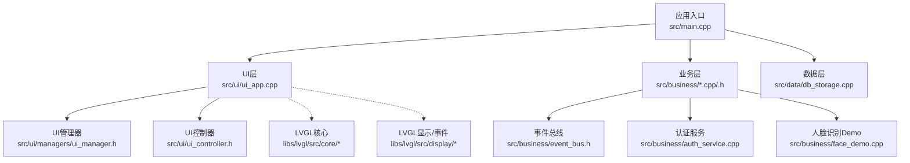
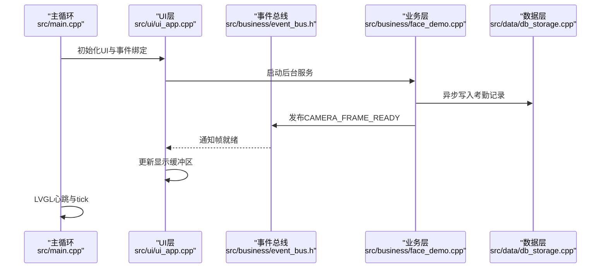
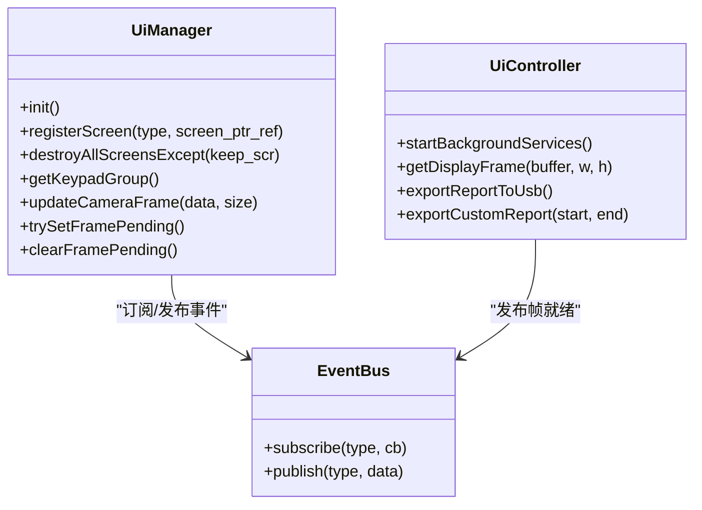
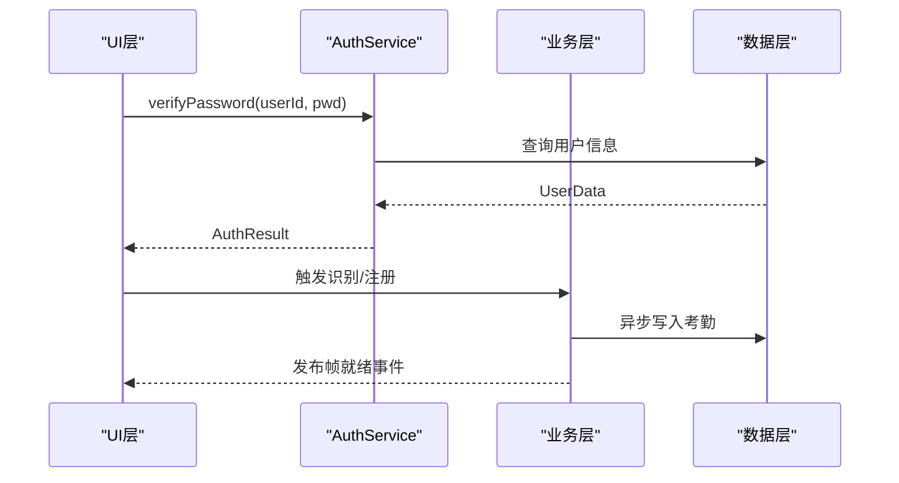
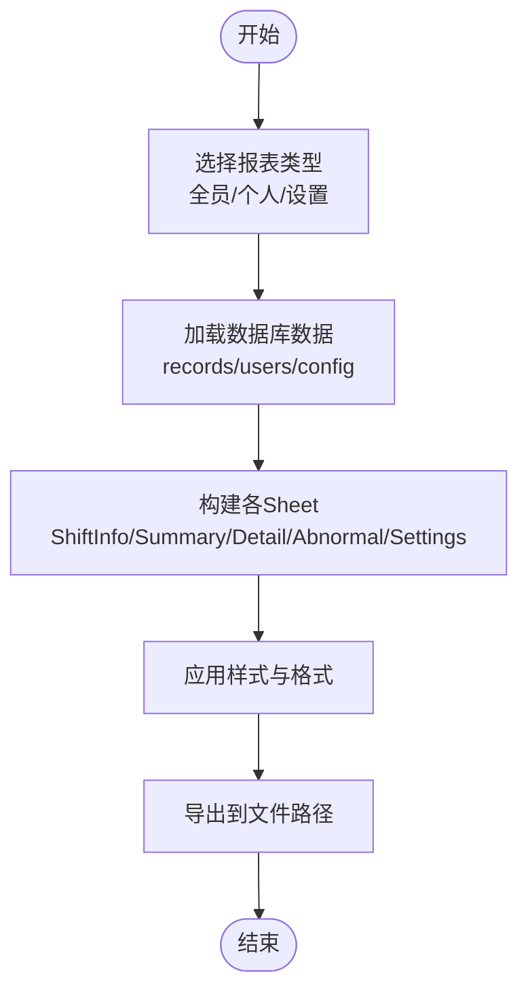
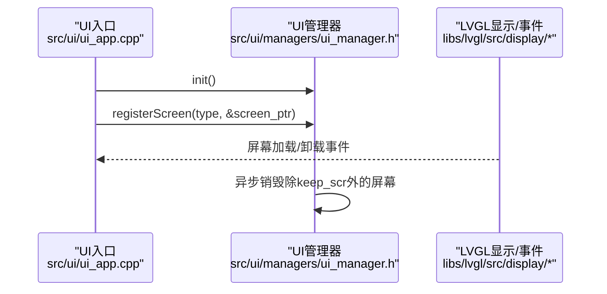
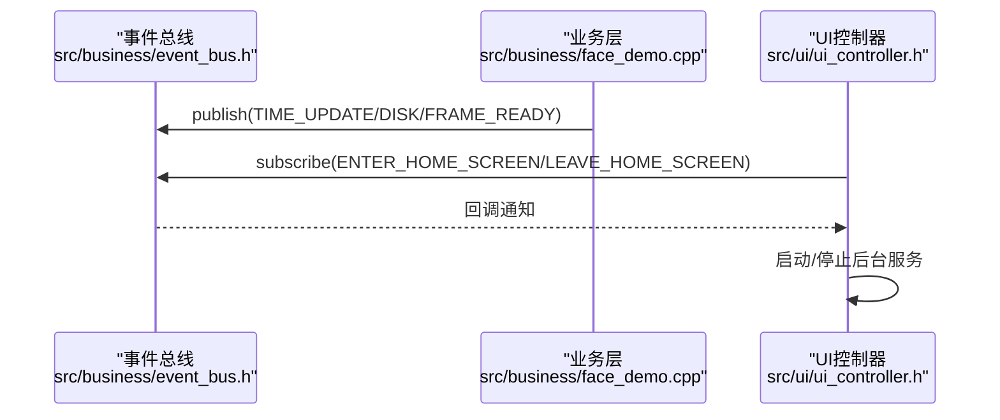
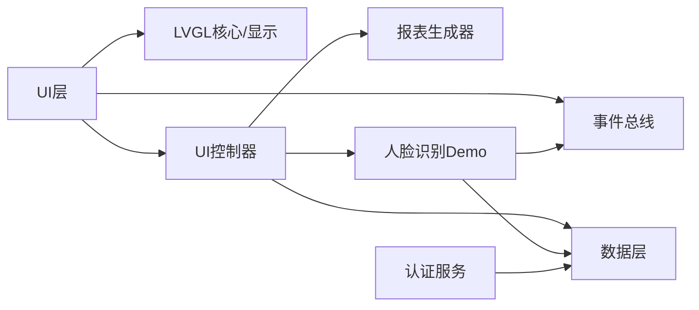

# 插件开发

<cite>
**本文引用的文件**
- [src/main.cpp](file://src/main.cpp)
- [src/ui/ui_app.cpp](file://src/ui/ui_app.cpp)
- [src/ui/managers/ui_manager.h](file://src/ui/managers/ui_manager.h)
- [src/ui/ui_controller.h](file://src/ui/ui_controller.h)
- [libs/lvgl/src/core/lv_obj.h](file://libs/lvgl/src/core/lv_obj.h)
- [libs/lvgl/src/core/lv_obj_class.h](file://libs/lvgl/src/core/lv_obj_class.h)
- [libs/lvgl/src/display/lv_display.c](file://libs/lvgl/src/display/lv_display.c)
- [libs/lvgl/src/misc/lv_event.h](file://libs/lvgl/src/misc/lv_event.h)
- [libs/lvgl/src/others/xml/lv_xml_widget.h](file://libs/lvgl/src/others/xml/lv_xml_widget.h)
- [libs/lvgl/src/others/xml/lv_xml_widget.c](file://libs/lvgl/src/others/xml/lv_xml_widget.c)
- [src/business/auth_service.h](file://src/business/auth_service.h)
- [src/business/auth_service.cpp](file://src/business/auth_service.cpp)
- [src/business/event_bus.h](file://src/business/event_bus.h)
- [src/business/face_demo.h](file://src/business/face_demo.h)
- [src/business/face_demo.cpp](file://src/business/face_demo.cpp)
- [src/business/report_generator.h](file://src/business/report_generator.h)
- [src/data/db_storage.cpp](file://src/data/db_storage.cpp)
</cite>

## 目录
1. [简介](#简介)
2. [项目结构](#项目结构)
3. [核心组件](#核心组件)
4. [架构总览](#架构总览)
5. [详细组件分析](#详细组件分析)
6. [依赖关系分析](#依赖关系分析)
7. [性能考量](#性能考量)
8. [故障排查指南](#故障排查指南)
9. [结论](#结论)
10. [附录](#附录)

## 简介
本指南面向希望在智能考勤系统中扩展插件能力的开发者，围绕以下目标展开：
- UI组件扩展：基于LVGL创建新控件、屏幕管理机制扩展、事件处理系统集成
- 认证方式扩展：新增认证算法、生物特征识别接口集成模式
- 报表格式扩展：自定义报表模板、数据导出格式扩展
- 插件架构设计：接口标准化、模块化设计、向后兼容性保障
- 实战示例与最佳实践：提供可落地的实现路径与参考代码片段路径

## 项目结构
系统采用分层架构：
- 应用入口与主循环：负责系统初始化、事件驱动与主循环调度
- UI层：基于LVGL，负责屏幕管理、事件绑定、输入设备接入
- 业务层：负责人脸识别、考勤规则、认证服务、事件总线
- 数据层：负责SQLite数据库、文件系统、图像存储与导出

**图表来源**
- [src/main.cpp:187-246](file://src/main.cpp#L187-L246)
- [src/ui/ui_app.cpp:34-94](file://src/ui/ui_app.cpp#L34-L94)
- [src/ui/managers/ui_manager.h:71-156](file://src/ui/managers/ui_manager.h#L71-L156)
- [src/ui/ui_controller.h:21-110](file://src/ui/ui_controller.h#L21-L110)
- [src/business/event_bus.h:23-43](file://src/business/event_bus.h#L23-L43)
- [src/business/auth_service.cpp:9-90](file://src/business/auth_service.cpp#L9-L90)
- [src/business/face_demo.cpp:557-694](file://src/business/face_demo.cpp#L557-L694)
- [src/data/db_storage.cpp:133-200](file://src/data/db_storage.cpp#L133-L200)

**章节来源**
- [src/main.cpp:187-246](file://src/main.cpp#L187-L246)
- [src/ui/ui_app.cpp:34-94](file://src/ui/ui_app.cpp#L34-L94)
- [src/ui/managers/ui_manager.h:71-156](file://src/ui/managers/ui_manager.h#L71-L156)
- [src/ui/ui_controller.h:21-110](file://src/ui/ui_controller.h#L21-L110)
- [src/business/event_bus.h:23-43](file://src/business/event_bus.h#L23-L43)
- [src/business/auth_service.cpp:9-90](file://src/business/auth_service.cpp#L9-L90)
- [src/business/face_demo.cpp:557-694](file://src/business/face_demo.cpp#L557-L694)
- [src/data/db_storage.cpp:133-200](file://src/data/db_storage.cpp#L133-L200)

## 核心组件
- UI层与LVGL集成：负责窗口创建、输入设备绑定、样式初始化、屏幕加载与事件传播
- UI管理器：集中管理屏幕生命周期、输入组、摄像头帧共享与异步销毁
- UI控制器：封装业务/数据接口，提供报表导出、摄像头帧获取、系统状态查询等
- 事件总线：跨模块解耦的发布/订阅机制，支撑屏幕切换、摄像头帧就绪等事件
- 认证服务：密码与指纹验证，支持扩展其他认证算法
- 人脸识别Demo：后台线程采集、检测、识别、异步写库、UI帧推送
- 报表生成器：Excel导出（xlsxwriter），支持多Sheet模板与样式
- 数据层：SQLite数据库、文件系统、图像存储、事务与并发控制

**章节来源**
- [src/ui/ui_app.cpp:34-94](file://src/ui/ui_app.cpp#L34-L94)
- [src/ui/managers/ui_manager.h:71-156](file://src/ui/managers/ui_manager.h#L71-L156)
- [src/ui/ui_controller.h:21-110](file://src/ui/ui_controller.h#L21-L110)
- [src/business/event_bus.h:23-43](file://src/business/event_bus.h#L23-L43)
- [src/business/auth_service.cpp:9-90](file://src/business/auth_service.cpp#L9-L90)
- [src/business/face_demo.cpp:246-285](file://src/business/face_demo.cpp#L246-L285)
- [src/business/report_generator.h:31-192](file://src/business/report_generator.h#L31-L192)
- [src/data/db_storage.cpp:133-200](file://src/data/db_storage.cpp#L133-L200)

## 架构总览
系统通过主循环驱动LVGL心跳，业务层在后台线程完成图像采集、识别与写库，UI层通过事件总线与业务层解耦交互。

**图表来源**
- [src/main.cpp:229-238](file://src/main.cpp#L229-L238)
- [src/ui/ui_app.cpp:86-93](file://src/ui/ui_app.cpp#L86-L93)
- [src/business/face_demo.cpp:523-523](file://src/business/face_demo.cpp#L523-L523)
- [src/business/event_bus.h:30-31](file://src/business/event_bus.h#L30-L31)
- [src/data/db_storage.cpp:33-65](file://src/data/db_storage.cpp#L33-L65)

## 详细组件分析

### UI组件扩展（基于LVGL）
- 创建新控件
  - 使用对象类与事件回调机制，遵循LVGL对象生命周期与属性系统
  - 参考路径：[对象标志与属性:48-173](file://libs/lvgl/src/core/lv_obj.h#L48-L173)，[对象类与事件回调:28-63](file://libs/lvgl/src/core/lv_obj_class.h#L28-L63)
- 屏幕管理扩展
  - 通过UI管理器集中注册/销毁屏幕，支持异步清理与资源回收
  - 参考路径：[屏幕注册与销毁:106-121](file://src/ui/managers/ui_manager.h#L106-L121)
- 事件处理系统集成
  - 通过事件总线发布/订阅跨模块事件，UI层监听帧就绪等事件
  - 参考路径：[事件总线接口:23-43](file://src/business/event_bus.h#L23-L43)，[屏幕事件与刷新:1340-1372](file://libs/lvgl/src/display/lv_display.c#L1340-L1372)

**图表来源**
- [src/ui/managers/ui_manager.h:71-156](file://src/ui/managers/ui_manager.h#L71-L156)
- [src/business/event_bus.h:23-43](file://src/business/event_bus.h#L23-L43)
- [src/ui/ui_controller.h:67-108](file://src/ui/ui_controller.h#L67-L108)

**章节来源**
- [libs/lvgl/src/core/lv_obj.h:48-173](file://libs/lvgl/src/core/lv_obj.h#L48-L173)
- [libs/lvgl/src/core/lv_obj_class.h:28-63](file://libs/lvgl/src/core/lv_obj_class.h#L28-L63)
- [src/ui/managers/ui_manager.h:106-121](file://src/ui/managers/ui_manager.h#L106-L121)
- [src/business/event_bus.h:23-43](file://src/business/event_bus.h#L23-L43)
- [libs/lvgl/src/display/lv_display.c:1340-1372](file://libs/lvgl/src/display/lv_display.c#L1340-L1372)

### 认证方式扩展（新增算法与生物特征接口）
- 扩展认证算法
  - 在认证服务中增加新算法的验证函数，保持与现有枚举与返回值一致
  - 参考路径：[认证结果枚举:9-16](file://src/business/auth_service.h#L9-L16)，[密码/指纹验证实现:9-90](file://src/business/auth_service.cpp#L9-L90)
- 生物特征识别接口集成
  - 通过业务层的后台线程与事件总线，将识别结果与写库逻辑解耦
  - 参考路径：[人脸识别初始化与线程:557-694](file://src/business/face_demo.cpp#L557-694)，[事件订阅与识别开关:558-568](file://src/business/face_demo.cpp#L558-568)

**图表来源**
- [src/business/auth_service.cpp:9-90](file://src/business/auth_service.cpp#L9-L90)
- [src/business/face_demo.cpp:557-694](file://src/business/face_demo.cpp#L557-L694)
- [src/business/event_bus.h:30-31](file://src/business/event_bus.h#L30-L31)

**章节来源**
- [src/business/auth_service.h:9-16](file://src/business/auth_service.h#L9-L16)
- [src/business/auth_service.cpp:9-90](file://src/business/auth_service.cpp#L9-L90)
- [src/business/face_demo.cpp:557-694](file://src/business/face_demo.cpp#L557-L694)

### 报表格式扩展（自定义模板与导出格式）
- 自定义报表模板
  - 报表生成器提供多Sheet写入接口，支持自定义样式与数据结构
  - 参考路径：[报表类型与结构:16-86](file://src/business/report_generator.h#L16-L86)，[写入函数集合:144-190](file://src/business/report_generator.h#L144-L190)
- 数据导出格式扩展
  - 基于xlsxwriter，可扩展新Sheet或新列，保持与现有数据模型一致
  - 参考路径：[导出接口:90-98](file://src/business/report_generator.h#L90-L98)，[UI控制器导出封装:54-86](file://src/ui/ui_controller.h#L54-L86)

**图表来源**
- [src/business/report_generator.h:90-190](file://src/business/report_generator.h#L90-L190)
- [src/ui/ui_controller.h:54-86](file://src/ui/ui_controller.h#L54-L86)

**章节来源**
- [src/business/report_generator.h:16-86](file://src/business/report_generator.h#L16-L86)
- [src/business/report_generator.h:90-190](file://src/business/report_generator.h#L90-L190)
- [src/ui/ui_controller.h:54-86](file://src/ui/ui_controller.h#L54-L86)

### 屏幕管理机制扩展
- 屏幕注册与销毁
  - 通过UI管理器集中管理屏幕指针引用，支持异步销毁与资源回收
  - 参考路径：[屏幕注册/销毁:106-121](file://src/ui/managers/ui_manager.h#L106-L121)
- 输入设备与焦点组
  - 将键盘绑定到全局输入组，支持循环导航与按键事件
  - 参考路径：[键盘绑定与组管理:68-81](file://src/ui/ui_app.cpp#L68-L81)

**图表来源**
- [src/ui/ui_app.cpp:68-81](file://src/ui/ui_app.cpp#L68-L81)
- [src/ui/managers/ui_manager.h:106-121](file://src/ui/managers/ui_manager.h#L106-L121)
- [libs/lvgl/src/display/lv_display.c:1340-1372](file://libs/lvgl/src/display/lv_display.c#L1340-L1372)

**章节来源**
- [src/ui/ui_app.cpp:68-81](file://src/ui/ui_app.cpp#L68-L81)
- [src/ui/managers/ui_manager.h:106-121](file://src/ui/managers/ui_manager.h#L106-L121)
- [libs/lvgl/src/display/lv_display.c:1340-1372](file://libs/lvgl/src/display/lv_display.c#L1340-L1372)

### 事件处理系统集成
- 事件总线
  - 提供线程安全的订阅/发布接口，支持时间更新、磁盘状态、摄像头帧等事件
  - 参考路径：[事件类型与回调:10-21](file://src/business/event_bus.h#L10-L21)
- LVGL事件与屏幕切换
  - 屏幕加载/卸载事件触发，配合UI管理器进行资源回收
  - 参考路径：[屏幕事件回调:1340-1372](file://libs/lvgl/src/display/lv_display.c#L1340-1372)
- UI控制器与后台服务
  - UI控制器启动监控与采集线程，通过事件总线与业务层解耦
  - 参考路径：[后台服务启动:67-108](file://src/ui/ui_controller.h#L67-108)

**图表来源**
- [src/business/event_bus.h:23-43](file://src/business/event_bus.h#L23-L43)
- [src/business/face_demo.cpp:558-568](file://src/business/face_demo.cpp#L558-L568)
- [src/ui/ui_controller.h:67-108](file://src/ui/ui_controller.h#L67-L108)

**章节来源**
- [src/business/event_bus.h:10-21](file://src/business/event_bus.h#L10-L21)
- [libs/lvgl/src/display/lv_display.c:1340-1372](file://libs/lvgl/src/display/lv_display.c#L1340-L1372)
- [src/ui/ui_controller.h:67-108](file://src/ui/ui_controller.h#L67-L108)

## 依赖关系分析
- UI层依赖LVGL核心与显示模块，通过事件总线与业务层解耦
- 业务层依赖数据层与事件总线，后台线程负责I/O密集型任务
- 认证服务与人脸识别Demo共享数据层接口，认证结果与识别结果通过事件总线传递
- 报表生成器依赖xlsxwriter与数据层查询接口

**图表来源**
- [src/ui/ui_app.cpp:34-94](file://src/ui/ui_app.cpp#L34-L94)
- [src/business/event_bus.h:23-43](file://src/business/event_bus.h#L23-L43)
- [src/ui/ui_controller.h:21-110](file://src/ui/ui_controller.h#L21-L110)
- [src/business/face_demo.cpp:557-694](file://src/business/face_demo.cpp#L557-L694)
- [src/business/auth_service.cpp:9-90](file://src/business/auth_service.cpp#L9-L90)
- [src/business/report_generator.h:90-190](file://src/business/report_generator.h#L90-L190)
- [src/data/db_storage.cpp:133-200](file://src/data/db_storage.cpp#L133-L200)

**章节来源**
- [src/ui/ui_app.cpp:34-94](file://src/ui/ui_app.cpp#L34-L94)
- [src/business/event_bus.h:23-43](file://src/business/event_bus.h#L23-L43)
- [src/ui/ui_controller.h:21-110](file://src/ui/ui_controller.h#L21-L110)
- [src/business/face_demo.cpp:557-694](file://src/business/face_demo.cpp#L557-L694)
- [src/business/auth_service.cpp:9-90](file://src/business/auth_service.cpp#L9-L90)
- [src/business/report_generator.h:90-190](file://src/business/report_generator.h#L90-L190)
- [src/data/db_storage.cpp:133-200](file://src/data/db_storage.cpp#L133-L200)

## 性能考量
- UI主循环与LVGL心跳：限制最小/最大休眠时间，保证响应速度与CPU占用平衡
  - 参考路径：[主循环心跳与tick:229-238](file://src/main.cpp#L229-238)
- 后台线程与并发控制：使用读写锁与条件变量，避免数据库竞争，降低UI阻塞
  - 参考路径：[数据库读写锁:35-37](file://src/data/db_storage.cpp#L35-L37)，[写库线程:246-285](file://src/business/face_demo.cpp#L246-285)
- 人脸识别线程：跳帧检测、冷却时间、UI刷新限流，兼顾识别精度与流畅度
  - 参考路径：[识别线程与刷新限流:291-549](file://src/business/face_demo.cpp#L291-549)

**章节来源**
- [src/main.cpp:229-238](file://src/main.cpp#L229-L238)
- [src/data/db_storage.cpp:35-37](file://src/data/db_storage.cpp#L35-L37)
- [src/business/face_demo.cpp:246-285](file://src/business/face_demo.cpp#L246-L285)
- [src/business/face_demo.cpp#L291-549:291-549](file://src/business/face_demo.cpp#L291-L549)

## 故障排查指南
- UI初始化失败
  - 检查SDL窗口创建与LVGL初始化，确认环境变量与依赖库
  - 参考路径：[UI初始化与SDL窗口:43-53](file://src/ui/ui_app.cpp#L43-L53)
- 事件未触发
  - 确认事件总线订阅与发布逻辑，检查回调注册与线程安全
  - 参考路径：[事件总线接口:23-43](file://src/business/event_bus.h#L23-43)
- 认证失败或无特征数据
  - 检查用户是否存在、密码/指纹是否录入，核对认证服务返回值
  - 参考路径：[认证结果与处理:9-90](file://src/business/auth_service.cpp#L9-90)
- 报表导出异常
  - 检查xlsxwriter依赖与输出路径权限，核对报表模板与数据结构
  - 参考路径：[报表导出接口:90-98](file://src/business/report_generator.h#L90-98)

**章节来源**
- [src/ui/ui_app.cpp:43-53](file://src/ui/ui_app.cpp#L43-L53)
- [src/business/event_bus.h:23-43](file://src/business/event_bus.h#L23-L43)
- [src/business/auth_service.cpp:9-90](file://src/business/auth_service.cpp#L9-L90)
- [src/business/report_generator.h:90-98](file://src/business/report_generator.h#L90-L98)

## 结论
本指南提供了在智能考勤系统中扩展插件能力的完整路径：UI组件扩展基于LVGL对象系统与事件总线；认证方式扩展通过认证服务接口与业务层后台线程实现；报表格式扩展依托xlsxwriter与数据层查询接口。通过模块化设计与事件解耦，系统具备良好的可扩展性与向后兼容性。建议在实现新插件时遵循接口标准化、最小侵入与充分测试的原则。

## 附录
- LVGL XML控件扩展（可选）
  - 通过注册Widget处理器，支持XML定义的控件生成与属性应用
  - 参考路径：[XML控件注册与处理器:40-68](file://libs/lvgl/src/others/xml/lv_xml_widget.h#L40-L68)，[注册实现:41-58](file://libs/lvgl/src/others/xml/lv_xml_widget.c#L41-L58)

**章节来源**
- [libs/lvgl/src/others/xml/lv_xml_widget.h:40-68](file://libs/lvgl/src/others/xml/lv_xml_widget.h#L40-L68)
- [libs/lvgl/src/others/xml/lv_xml_widget.c:41-58](file://libs/lvgl/src/others/xml/lv_xml_widget.c#L41-L58)