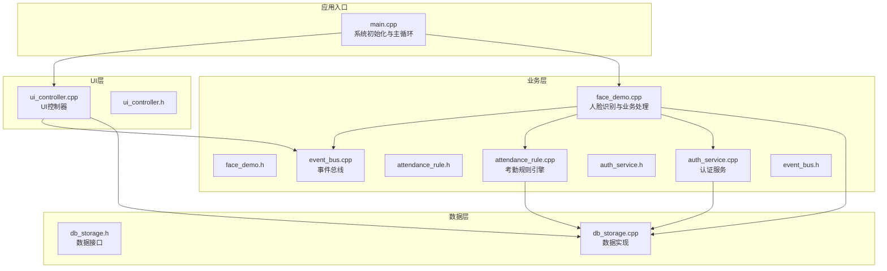
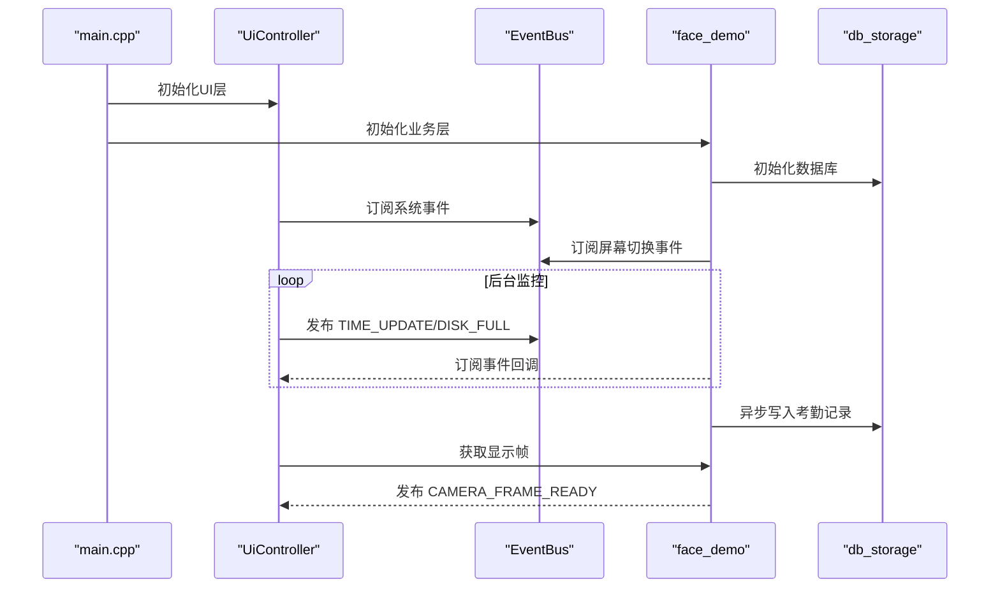
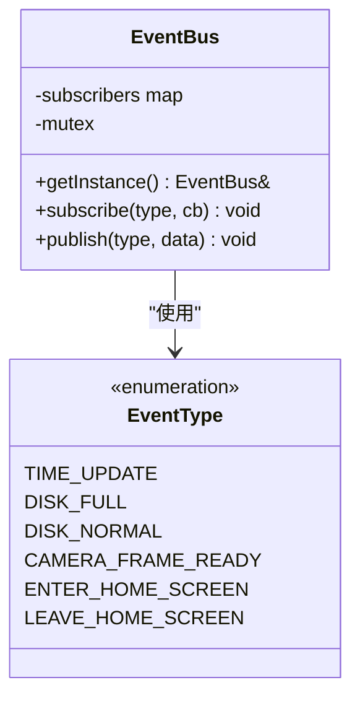
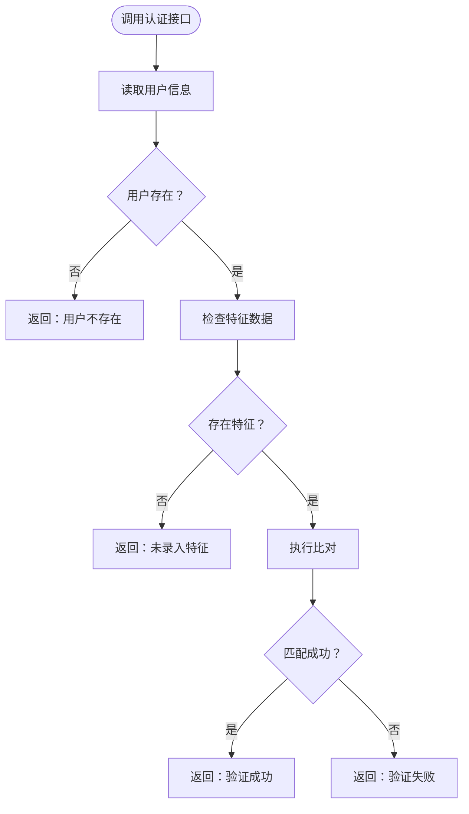
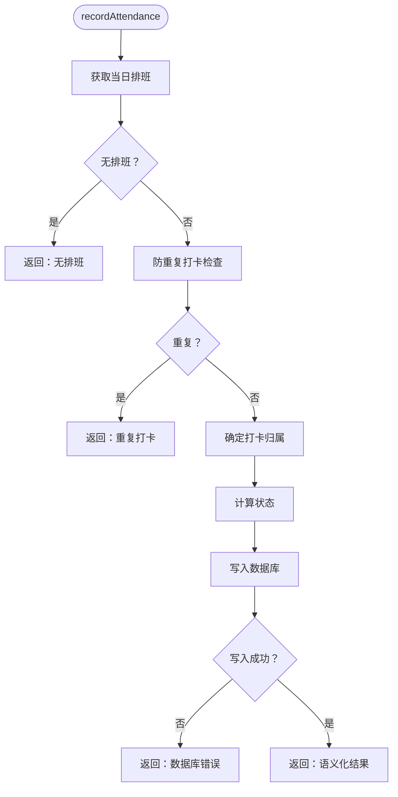
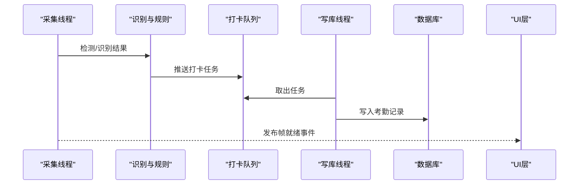
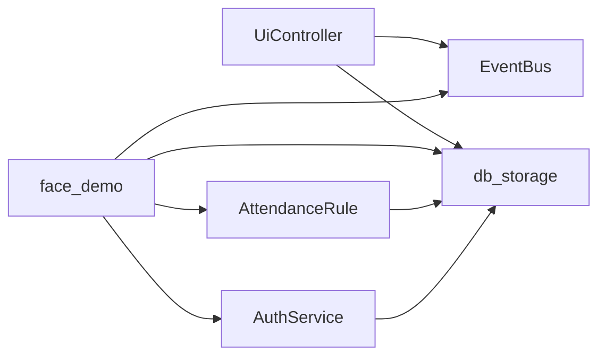

# 插件架构设计

<cite>
**本文档引用的文件**
- [event_bus.h](file://src/business/event_bus.h)
- [event_bus.cpp](file://src/business/event_bus.cpp)
- [attendance_rule.h](file://src/business/attendance_rule.h)
- [attendance_rule.cpp](file://src/business/attendance_rule.cpp)
- [auth_service.h](file://src/business/auth_service.h)
- [auth_service.cpp](file://src/business/auth_service.cpp)
- [face_demo.h](file://src/business/face_demo.h)
- [face_demo.cpp](file://src/business/face_demo.cpp)
- [ui_controller.h](file://src/ui/ui_controller.h)
- [ui_controller.cpp](file://src/ui/ui_controller.cpp)
- [db_storage.h](file://src/data/db_storage.h)
- [db_storage.cpp](file://src/data/db_storage.cpp)
- [main.cpp](file://src/main.cpp)
</cite>

## 目录
1. [简介](#简介)
2. [项目结构](#项目结构)
3. [核心组件](#核心组件)
4. [架构总览](#架构总览)
5. [详细组件分析](#详细组件分析)
6. [依赖关系分析](#依赖关系分析)
7. [性能考量](#性能考量)
8. [故障排查指南](#故障排查指南)
9. [结论](#结论)
10. [附录](#附录)

## 简介
本设计文档围绕智能考勤系统的插件化架构展开，重点阐述接口标准化、模块化设计原则、向后兼容性保障策略，以及事件驱动架构在插件系统中的应用。通过对事件总线、插件间通信机制、异步处理策略、生命周期管理、安全性与资源限制、开发最佳实践等方面的深入分析，帮助读者全面理解系统如何通过模块解耦与事件编排实现可扩展、可维护、可演进的插件体系。

## 项目结构
系统采用典型的三层架构：UI层、业务层、数据层。插件化思想体现在业务层通过事件总线与UI层松耦合交互，同时业务层内部通过模块化接口（如认证服务、考勤规则引擎、人脸识别）实现功能的可插拔组合。

**图表来源**
- [main.cpp:187-246](file://src/main.cpp#L187-L246)
- [ui_controller.cpp:30-680](file://src/ui/ui_controller.cpp#L30-L680)
- [face_demo.cpp:557-694](file://src/business/face_demo.cpp#L557-L694)
- [event_bus.cpp:1-28](file://src/business/event_bus.cpp#L1-L28)
- [db_storage.cpp:133-310](file://src/data/db_storage.cpp#L133-L310)

**章节来源**
- [main.cpp:187-246](file://src/main.cpp#L187-L246)
- [ui_controller.h:21-110](file://src/ui/ui_controller.h#L21-L110)
- [face_demo.h:34-212](file://src/business/face_demo.h#L34-L212)
- [event_bus.h:23-42](file://src/business/event_bus.h#L23-L42)
- [db_storage.h:213-683](file://src/data/db_storage.h#L213-L683)

## 核心组件
- 事件总线（EventBus）：提供线程安全的发布/订阅机制，支撑UI与业务层解耦。
- 认证服务（AuthService）：提供密码与指纹验证能力，面向业务层调用。
- 考勤规则引擎（AttendanceRule）：实现打卡归属、状态计算与记录落库的完整流程。
- 人脸识别业务（face_demo）：负责视频流采集、人脸检测/识别、异步写库与事件发布。
- UI控制器（UiController）：封装业务接口，启动后台服务线程，发布系统事件。
- 数据层（db_storage）：提供统一的数据访问接口，内置并发控制与性能优化。

**章节来源**
- [event_bus.h:23-42](file://src/business/event_bus.h#L23-L42)
- [auth_service.h:23-46](file://src/business/auth_service.h#L23-L46)
- [attendance_rule.h:43-92](file://src/business/attendance_rule.h#L43-L92)
- [face_demo.h:34-212](file://src/business/face_demo.h#L34-L212)
- [ui_controller.h:21-110](file://src/ui/ui_controller.h#L21-L110)
- [db_storage.h:213-683](file://src/data/db_storage.h#L213-L683)

## 架构总览
系统采用事件驱动的插件化架构：业务层通过事件总线向UI层广播状态变化（如时间更新、磁盘状态、摄像头帧就绪），UI层通过订阅这些事件实现响应式更新。业务层内部模块通过清晰的接口协作，形成可插拔的功能集合。

**图表来源**
- [main.cpp:213-225](file://src/main.cpp#L213-L225)
- [ui_controller.cpp:380-410](file://src/ui/ui_controller.cpp#L380-L410)
- [face_demo.cpp:557-569](file://src/business/face_demo.cpp#L557-L569)
- [event_bus.cpp:8-28](file://src/business/event_bus.cpp#L8-L28)
- [db_storage.cpp:133-310](file://src/data/db_storage.cpp#L133-L310)

## 详细组件分析

### 事件总线（EventBus）设计
- 设计要点
  - 单例模式提供全局事件中枢。
  - 线程安全：使用互斥锁保护订阅列表与发布过程。
  - 发布时复制回调列表，避免在回调执行期间持有锁。
  - 支持多类型事件（时间更新、磁盘状态、摄像头帧就绪等）。

**图表来源**
- [event_bus.h:23-42](file://src/business/event_bus.h#L23-L42)
- [event_bus.cpp:1-28](file://src/business/event_bus.cpp#L1-L28)

**章节来源**
- [event_bus.h:10-18](file://src/business/event_bus.h#L10-L18)
- [event_bus.cpp:8-28](file://src/business/event_bus.cpp#L8-L28)

### 认证服务（AuthService）
- 功能职责
  - 提供密码与指纹验证接口，返回标准化的认证结果枚举。
  - 与数据层交互获取用户信息与特征数据。
- 设计原则
  - 专注单一职责：仅负责身份认证。
  - 与业务层解耦：业务层通过统一接口调用认证能力。

**图表来源**
- [auth_service.h:8-16](file://src/business/auth_service.h#L8-L16)
- [auth_service.cpp:9-69](file://src/business/auth_service.cpp#L9-L69)

**章节来源**
- [auth_service.h:23-46](file://src/business/auth_service.h#L23-L46)
- [auth_service.cpp:9-90](file://src/business/auth_service.cpp#L9-L90)

### 考勤规则引擎（AttendanceRule）
- 功能职责
  - 计算打卡归属班次、状态（正常/迟到/早退/旷工）。
  - 防重复打卡、跨天时间处理、折中原则等复杂逻辑。
  - 调用数据层写入考勤记录并返回语义化结果。
- 设计原则
  - 纯函数化：核心计算逻辑与数据访问分离。
  - 可测试性：提供清晰的输入输出与中间步骤。

**图表来源**
- [attendance_rule.cpp:263-342](file://src/business/attendance_rule.cpp#L263-L342)

**章节来源**
- [attendance_rule.h:43-92](file://src/business/attendance_rule.h#L43-L92)
- [attendance_rule.cpp:148-187](file://src/business/attendance_rule.cpp#L148-L187)
- [attendance_rule.cpp:192-256](file://src/business/attendance_rule.cpp#L192-L256)
- [attendance_rule.cpp:263-342](file://src/business/attendance_rule.cpp#L263-L342)

### 人脸识别业务（face_demo）
- 功能职责
  - 后台采集线程：持续读取视频帧、人脸检测、识别与可视化。
  - 异步写库线程：消费打卡任务队列，串行写入数据库，避免多线程竞争。
  - 事件发布：向UI层发布摄像头帧就绪事件。
  - 配置与训练：支持模型加载/训练、预处理配置、识别开关。
- 设计原则
  - 线程分离：采集/识别与写库解耦，提高吞吐与稳定性。
  - 事件驱动：通过事件总线与UI层解耦。
  - 容错与限流：重连机制、冷却时间、队列长度控制。

**图表来源**
- [face_demo.cpp:246-285](file://src/business/face_demo.cpp#L246-L285)
- [face_demo.cpp:291-549](file://src/business/face_demo.cpp#L291-L549)
- [face_demo.cpp:523](file://src/business/face_demo.cpp#L523)

**章节来源**
- [face_demo.h:34-212](file://src/business/face_demo.h#L34-L212)
- [face_demo.cpp:246-285](file://src/business/face_demo.cpp#L246-L285)
- [face_demo.cpp:291-549](file://src/business/face_demo.cpp#L291-L549)

### UI控制器（UiController）
- 功能职责
  - 封装业务接口，提供统一的UI调用入口。
  - 启动后台线程：监控时间与磁盘、采集摄像头帧。
  - 通过事件总线发布系统事件（时间更新、磁盘状态）。
- 设计原则
  - 单例模式：全局访问点，避免重复初始化。
  - 线程安全：使用互斥锁保护共享资源（帧缓存）。

**章节来源**
- [ui_controller.h:21-110](file://src/ui/ui_controller.h#L21-L110)
- [ui_controller.cpp:380-410](file://src/ui/ui_controller.cpp#L380-L410)
- [ui_controller.cpp:658-680](file://src/ui/ui_controller.cpp#L658-L680)

### 数据层（db_storage）
- 功能职责
  - 提供完整的DAO接口：部门、班次、用户、考勤记录、系统配置等。
  - 并发控制：读写锁分离，提升读多写少场景的性能。
  - 性能优化：WAL模式、预编译语句、联合索引、事务批量写入。
- 设计原则
  - 接口稳定：对外暴露稳定的结构体与函数签名，便于向后兼容。
  - 事务封装：批量导入/更新使用事务，保证一致性与性能。

**章节来源**
- [db_storage.h:213-683](file://src/data/db_storage.h#L213-L683)
- [db_storage.cpp:133-310](file://src/data/db_storage.cpp#L133-L310)
- [db_storage.cpp:312-430](file://src/data/db_storage.cpp#L312-L430)

## 依赖关系分析
- 模块耦合
  - UI层依赖事件总线与业务层接口，不直接依赖数据层。
  - 业务层依赖事件总线、认证服务、考勤规则引擎与数据层。
  - 数据层提供统一接口，被UI与业务层共同依赖。
- 外部依赖
  - OpenCV：图像处理与人脸识别。
  - SQLite3：本地数据库存储。
  - LVGL：嵌入式图形界面（UI层）。

**图表来源**
- [ui_controller.cpp:13-14](file://src/ui/ui_controller.cpp#L13-L14)
- [face_demo.cpp:22-25](file://src/business/face_demo.cpp#L22-L25)
- [attendance_rule.cpp:2](file://src/business/attendance_rule.cpp#L2)
- [auth_service.cpp:2](file://src/business/auth_service.cpp#L2)
- [db_storage.cpp:7-19](file://src/data/db_storage.cpp#L7-L19)

**章节来源**
- [ui_controller.cpp:13-14](file://src/ui/ui_controller.cpp#L13-L14)
- [face_demo.cpp:22-25](file://src/business/face_demo.cpp#L22-L25)
- [attendance_rule.cpp:2](file://src/business/attendance_rule.cpp#L2)
- [auth_service.cpp:2](file://src/business/auth_service.cpp#L2)
- [db_storage.cpp:7-19](file://src/data/db_storage.cpp#L7-L19)

## 性能考量
- 事件总线
  - 发布时复制回调列表，避免回调期间持有锁，降低锁竞争。
- 数据层
  - WAL模式、读写锁分离、预编译语句、联合索引，显著提升并发与查询效率。
- 业务层
  - 采集/识别与写库双线程分离，队列限流与冷却时间控制，避免过载。
- UI层
  - 后台线程定期发布时间与磁盘事件，避免阻塞主线程。

**章节来源**
- [event_bus.cpp:14-28](file://src/business/event_bus.cpp#L14-L28)
- [db_storage.cpp:148-160](file://src/data/db_storage.cpp#L148-L160)
- [db_storage.cpp:300-307](file://src/data/db_storage.cpp#L300-L307)
- [face_demo.cpp:246-285](file://src/business/face_demo.cpp#L246-L285)
- [ui_controller.cpp:394-410](file://src/ui/ui_controller.cpp#L394-L410)

## 故障排查指南
- 事件未到达
  - 检查订阅是否在事件发布前完成。
  - 确认事件类型与数据指针传递正确。
- 数据库写入失败
  - 查看事务与预编译语句状态，确认写库线程运行标志。
  - 检查磁盘空间与文件权限。
- 人脸识别异常
  - 检查摄像头连接与GStreamer管道参数。
  - 确认模型文件存在且可读，必要时重新训练。
- UI无画面
  - 确认采集线程运行与帧缓存更新。
  - 检查事件发布CAMERA_FRAME_READY是否触发。

**章节来源**
- [face_demo.cpp:246-285](file://src/business/face_demo.cpp#L246-L285)
- [face_demo.cpp:314-344](file://src/business/face_demo.cpp#L314-L344)
- [ui_controller.cpp:658-680](file://src/ui/ui_controller.cpp#L658-L680)

## 结论
本插件化架构通过事件总线实现UI与业务层的解耦，业务层内部以模块化接口组织功能，数据层提供稳定一致的访问能力。事件驱动、异步处理与并发控制共同保障了系统的可扩展性与稳定性。遵循接口标准化与向后兼容策略，可在不破坏现有功能的前提下平滑引入新插件与新特性。

## 附录
- 插件开发最佳实践
  - 接口标准化：统一事件类型与回调签名，避免紧耦合。
  - 生命周期管理：插件需提供初始化/启动/停止/卸载接口，确保资源可控。
  - 异步与线程安全：使用事件总线与队列，避免阻塞UI线程。
  - 错误处理：捕获异常并降级处理，避免影响主流程。
  - 性能优化：利用预编译语句、读写锁与限流策略，提升吞吐与稳定性。
  - 安全性：对外部输入进行校验，限制资源使用，必要时引入沙箱或权限控制。