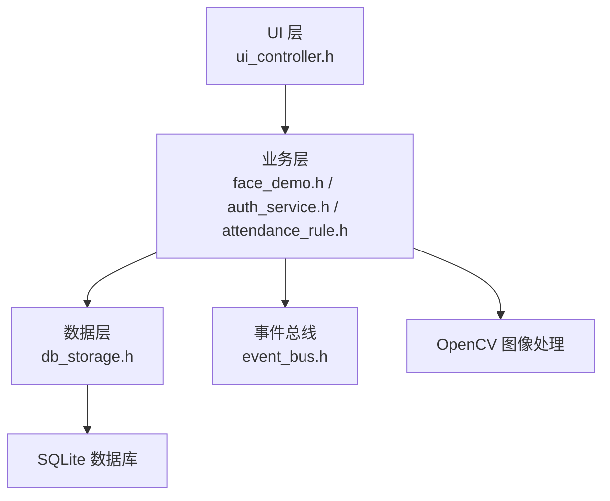
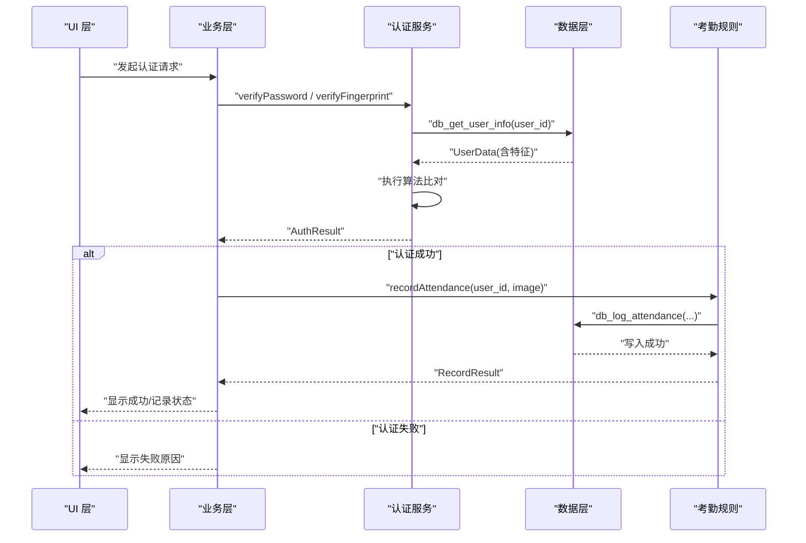
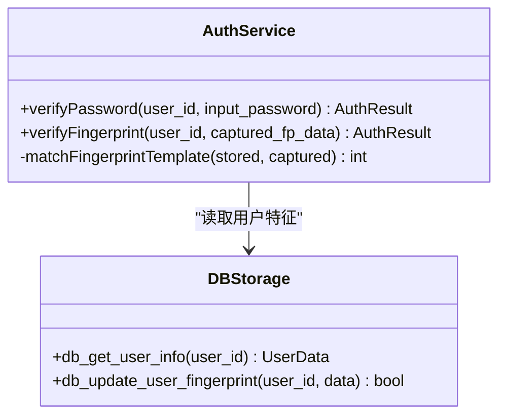
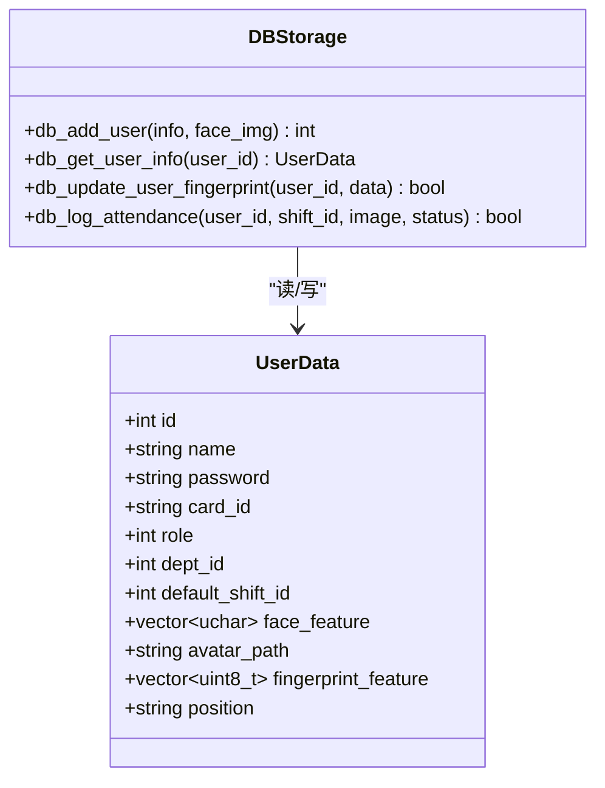
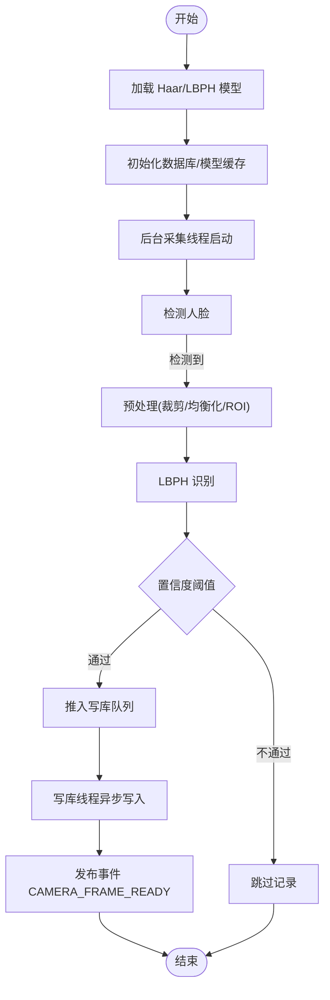
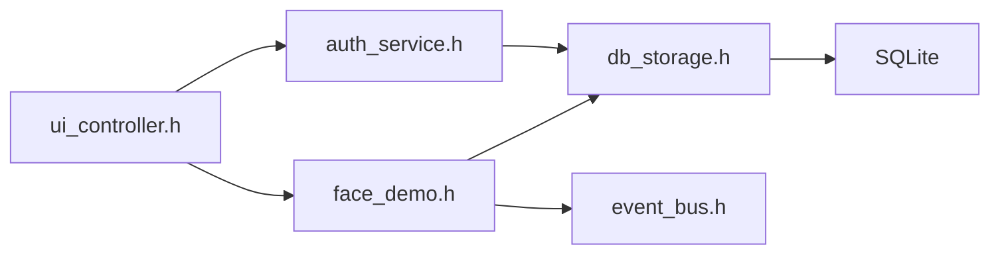

# 认证方式扩展

<cite>
**本文引用的文件**
- [src/business/auth_service.h](file://src/business/auth_service.h)
- [src/business/auth_service.cpp](file://src/business/auth_service.cpp)
- [src/data/db_storage.h](file://src/data/db_storage.h)
- [src/data/db_storage.cpp](file://src/data/db_storage.cpp)
- [src/business/face_demo.h](file://src/business/face_demo.h)
- [src/business/face_demo.cpp](file://src/business/face_demo.cpp)
- [src/business/attendance_rule.h](file://src/business/attendance_rule.h)
- [src/business/event_bus.h](file://src/business/event_bus.h)
- [src/business/event_bus.cpp](file://src/business/event_bus.cpp)
- [src/ui/ui_controller.h](file://src/ui/ui_controller.h)
- [src/main.cpp](file://src/main.cpp)
</cite>

## 目录
1. [简介](#简介)
2. [项目结构](#项目结构)
3. [核心组件](#核心组件)
4. [架构总览](#架构总览)
5. [详细组件分析](#详细组件分析)
6. [依赖关系分析](#依赖关系分析)
7. [性能考量](#性能考量)
8. [故障排查指南](#故障排查指南)
9. [结论](#结论)
10. [附录](#附录)

## 简介
本指南面向在 SmartAttendance 项目上扩展“认证方式”的开发者，目标是在现有认证服务架构基础上，安全、稳定地接入新的认证方式（如生物特征识别、IC 卡读取、密码验证等），并支持多模态认证的协调机制。文档将重点阐述：
- 生物特征识别接口的标准化设计
- 认证算法的抽象化封装
- 多模态认证的协调机制
- 人脸识别扩展的实现方法（OpenCV 集成、特征提取、相似度匹配策略）
- 其他认证方式的接入模式
- 认证服务的扩展接口设计（回调、错误处理、安全性）
- 完整的代码示例与集成测试方法

## 项目结构
SmartAttendance 采用分层架构：UI 层负责交互与展示，业务层负责核心业务逻辑（含人脸、认证、考勤规则），数据层负责数据库与文件系统操作。认证扩展应遵循“接口稳定、算法可插拔、错误可控、安全优先”的原则。

图表来源
- [src/ui/ui_controller.h:21-108](file://src/ui/ui_controller.h#L21-L108)
- [src/business/face_demo.h:30-211](file://src/business/face_demo.h#L30-L211)
- [src/business/auth_service.h:23-44](file://src/business/auth_service.h#L23-L44)
- [src/business/attendance_rule.h:43-89](file://src/business/attendance_rule.h#L43-L89)
- [src/business/event_bus.h:23-41](file://src/business/event_bus.h#L23-L41)
- [src/data/db_storage.h:213-682](file://src/data/db_storage.h#L213-L682)

章节来源
- [src/main.cpp:213-224](file://src/main.cpp#L213-L224)
- [src/ui/ui_controller.h:21-108](file://src/ui/ui_controller.h#L21-L108)
- [src/business/face_demo.h:30-211](file://src/business/face_demo.h#L30-L211)
- [src/business/auth_service.h:23-44](file://src/business/auth_service.h#L23-L44)
- [src/business/attendance_rule.h:43-89](file://src/business/attendance_rule.h#L43-L89)
- [src/business/event_bus.h:23-41](file://src/business/event_bus.h#L23-L41)
- [src/data/db_storage.h:213-682](file://src/data/db_storage.h#L213-L682)

## 核心组件
- 认证服务（AuthService）：提供密码与指纹两类 1:1 认证能力，返回标准化结果枚举，便于上层统一处理。
- 数据层（db_storage）：提供用户信息、指纹特征、考勤记录等数据访问接口，支持 BLOB 存储与事务。
- 业务层（face_demo）：封装人脸识别、预处理、训练、识别与考勤记录写入的完整流程，支持多线程与异步写库。
- 事件总线（event_bus）：提供线程安全的事件订阅/发布机制，用于 UI 与业务层解耦。
- 考勤规则（attendance_rule）：提供打卡状态计算与记录写入的规则引擎接口。

章节来源
- [src/business/auth_service.h:8-16](file://src/business/auth_service.h#L8-L16)
- [src/business/auth_service.cpp:9-37](file://src/business/auth_service.cpp#L9-L37)
- [src/data/db_storage.h:130-168](file://src/data/db_storage.h#L130-L168)
- [src/business/face_demo.cpp:291-549](file://src/business/face_demo.cpp#L291-L549)
- [src/business/event_bus.cpp:3-28](file://src/business/event_bus.cpp#L3-L28)
- [src/business/attendance_rule.h:8-41](file://src/business/attendance_rule.h#L8-L41)

## 架构总览
认证扩展的整体流程如下：UI 层触发认证请求，业务层调用认证服务，认证服务访问数据层获取用户特征，执行算法比对，返回结果；成功后由业务层调用考勤规则引擎写入记录。

图表来源
- [src/business/auth_service.cpp:9-37](file://src/business/auth_service.cpp#L9-L37)
- [src/business/auth_service.cpp:42-69](file://src/business/auth_service.cpp#L42-L69)
- [src/data/db_storage.h:374-382](file://src/data/db_storage.h#L374-L382)
- [src/business/attendance_rule.h:87-88](file://src/business/attendance_rule.h#L87-L88)
- [src/data/db_storage.h:458-458](file://src/data/db_storage.h#L458-L458)

## 详细组件分析

### 认证服务（AuthService）扩展设计
- 接口标准化：保持 verifyPassword 与 verifyFingerprint 的签名不变，新增认证方式时仅需扩展算法实现与数据读取。
- 结果枚举：统一返回 AuthResult，便于 UI 与业务层一致处理。
- 算法抽象：将指纹比对封装为 matchFingerprintTemplate，未来可替换为厂商 SDK。
- 数据访问：通过 db_get_user_info 获取用户特征，避免在认证服务内直接操作数据库。

图表来源
- [src/business/auth_service.h:23-44](file://src/business/auth_service.h#L23-L44)
- [src/business/auth_service.cpp:9-69](file://src/business/auth_service.cpp#L9-L69)
- [src/data/db_storage.h:374-382](file://src/data/db_storage.h#L374-L382)

章节来源
- [src/business/auth_service.h:8-16](file://src/business/auth_service.h#L8-L16)
- [src/business/auth_service.cpp:9-37](file://src/business/auth_service.cpp#L9-L37)
- [src/business/auth_service.cpp:42-69](file://src/business/auth_service.cpp#L42-L69)
- [src/business/auth_service.cpp:74-90](file://src/business/auth_service.cpp#L74-L90)

### 数据层（db_storage）扩展要点
- 用户特征字段：UserData 已包含 face_feature 与 fingerprint_feature，分别用于人脸与指纹特征存储。
- BLOB 序列化：提供 matToBytes/bytesToMat 辅助函数，便于将 OpenCV Mat 与二进制互转。
- 指纹写入：db_update_user_fingerprint 支持将采集到的指纹特征写入数据库。
- 事务与并发：使用共享/排他锁保障多线程安全，预编译语句提升写库性能。

图表来源
- [src/data/db_storage.h:130-168](file://src/data/db_storage.h#L130-L168)
- [src/data/db_storage.cpp:773-800](file://src/data/db_storage.cpp#L773-L800)
- [src/data/db_storage.cpp:438-438](file://src/data/db_storage.cpp#L438-L438)
- [src/data/db_storage.cpp:458-458](file://src/data/db_storage.cpp#L458-L458)

章节来源
- [src/data/db_storage.h:130-168](file://src/data/db_storage.h#L130-L168)
- [src/data/db_storage.cpp:69-89](file://src/data/db_storage.cpp#L69-L89)
- [src/data/db_storage.cpp:773-800](file://src/data/db_storage.cpp#L773-L800)
- [src/data/db_storage.cpp:438-438](file://src/data/db_storage.cpp#L438-L438)
- [src/data/db_storage.cpp:458-458](file://src/data/db_storage.cpp#L458-L458)

### 人脸识别扩展（OpenCV 集成）
- 模型与检测：使用 Haar 级联分类器进行人脸检测，LBPH 人脸识别器进行识别。
- 预处理流程：支持裁剪、尺寸归一化、直方图均衡化（含 CLAHE）、ROI 增强等。
- 多线程与异步写库：后台采集线程负责检测/识别，识别线程将打卡任务放入队列，写库线程异步落库，避免 UI 卡顿。
- 事件驱动：通过 EventBus 发布 CAMERA_FRAME_READY 等事件，驱动 UI 刷新。

图表来源
- [src/business/face_demo.cpp:557-694](file://src/business/face_demo.cpp#L557-L694)
- [src/business/face_demo.cpp:291-549](file://src/business/face_demo.cpp#L291-L549)
- [src/business/event_bus.cpp:15-28](file://src/business/event_bus.cpp#L15-L28)

章节来源
- [src/business/face_demo.h:42-84](file://src/business/face_demo.h#L42-L84)
- [src/business/face_demo.h:105-136](file://src/business/face_demo.h#L105-L136)
- [src/business/face_demo.cpp:88-106](file://src/business/face_demo.cpp#L88-L106)
- [src/business/face_demo.cpp:138-165](file://src/business/face_demo.cpp#L138-L165)
- [src/business/face_demo.cpp:291-549](file://src/business/face_demo.cpp#L291-L549)
- [src/business/face_demo.cpp:557-694](file://src/business/face_demo.cpp#L557-L694)
- [src/business/event_bus.h:10-18](file://src/business/event_bus.h#L10-L18)

### 多模态认证协调机制
- 统一结果枚举：所有认证方式返回 AuthResult，UI 与业务层无需关心具体算法细节。
- 事件与状态：通过 EventBus 与业务层状态机（如识别开关）协同，确保 UI 与识别线程的解耦。
- 防重复与冷却：业务层内置防重复打卡与冷却时间控制，避免误触发。
- 写库异步化：识别成功后将记录推入队列，写库线程异步处理，降低主线程压力。

章节来源
- [src/business/auth_service.h:8-16](file://src/business/auth_service.h#L8-L16)
- [src/business/face_demo.cpp:388-499](file://src/business/face_demo.cpp#L388-L499)
- [src/business/event_bus.h:10-18](file://src/business/event_bus.h#L10-L18)

### 其他认证方式接入模式
- 指纹识别：通过 db_update_user_fingerprint 写入特征，AuthService.verifyFingerprint 调用 matchFingerprintTemplate 执行比对。
- 密码验证：AuthService.verifyPassword 读取用户密码字段，进行比对（建议生产使用哈希）。
- IC 卡读取：可在 UI 层或业务层监听卡片事件，读取卡号并与用户绑定的 card_id 对比，成功后调用 recordAttendance。

章节来源
- [src/business/auth_service.cpp:9-37](file://src/business/auth_service.cpp#L9-L37)
- [src/business/auth_service.cpp:42-69](file://src/business/auth_service.cpp#L42-L69)
- [src/data/db_storage.h:438-438](file://src/data/db_storage.h#L438-L438)
- [src/data/db_storage.h:140-141](file://src/data/db_storage.h#L140-L141)

## 依赖关系分析
- UI 层依赖业务层提供的接口，业务层依赖数据层与事件总线。
- 认证服务依赖数据层读取用户特征，不直接操作数据库。
- 人脸识别模块依赖 OpenCV 与 SQLite，通过数据层持久化特征与记录。

图表来源
- [src/ui/ui_controller.h:21-108](file://src/ui/ui_controller.h#L21-L108)
- [src/business/face_demo.h:30-211](file://src/business/face_demo.h#L30-L211)
- [src/business/auth_service.h:23-44](file://src/business/auth_service.h#L23-L44)
- [src/data/db_storage.h:213-682](file://src/data/db_storage.h#L213-L682)
- [src/business/event_bus.h:23-41](file://src/business/event_bus.h#L23-L41)

章节来源
- [src/ui/ui_controller.h:21-108](file://src/ui/ui_controller.h#L21-L108)
- [src/business/face_demo.h:30-211](file://src/business/face_demo.h#L30-L211)
- [src/business/auth_service.h:23-44](file://src/business/auth_service.h#L23-L44)
- [src/data/db_storage.h:213-682](file://src/data/db_storage.h#L213-L682)
- [src/business/event_bus.h:23-41](file://src/business/event_bus.h#L23-L41)

## 性能考量
- 异步写库：识别线程将记录推入队列，写库线程异步处理，避免阻塞识别线程。
- 线程安全：数据层使用共享/排他锁，预编译语句减少 SQL 解析开销。
- 队列长度控制：写库线程对队列长度进行限制，防止内存占用过高。
- 预处理优化：合理设置跳帧与 UI 刷新频率，平衡识别精度与流畅度。

章节来源
- [src/business/face_demo.cpp:246-285](file://src/business/face_demo.cpp#L246-L285)
- [src/data/db_storage.cpp:35-65](file://src/data/db_storage.cpp#L35-L65)
- [src/data/db_storage.cpp:301-307](file://src/data/db_storage.cpp#L301-L307)
- [src/business/face_demo.cpp:470-478](file://src/business/face_demo.cpp#L470-L478)
- [src/business/face_demo.cpp:516-527](file://src/business/face_demo.cpp#L516-L527)

## 故障排查指南
- 认证失败排查
  - 用户不存在：检查用户 ID 与 db_get_user_info 返回值。
  - 特征缺失：确认指纹/人脸特征是否已录入。
  - 算法比对失败：检查 matchFingerprintTemplate 的阈值与输入数据。
- 人脸识别问题
  - 模型加载失败：确认模型文件路径与权限。
  - 识别线程异常：查看捕获的 OpenCV/标准异常日志。
  - UI 无画面：检查 CAMERA_FRAME_READY 事件是否发布与订阅。
- 数据库问题
  - 写库失败：检查预编译语句与事务提交。
  - 并发冲突：确认共享/排他锁使用是否正确。

章节来源
- [src/business/auth_service.cpp:14-17](file://src/business/auth_service.cpp#L14-L17)
- [src/business/auth_service.cpp:56-58](file://src/business/auth_service.cpp#L56-L58)
- [src/business/auth_service.cpp:74-90](file://src/business/auth_service.cpp#L74-L90)
- [src/business/face_demo.cpp:537-547](file://src/business/face_demo.cpp#L537-L547)
- [src/business/face_demo.cpp:557-575](file://src/business/face_demo.cpp#L557-L575)
- [src/business/event_bus.cpp:15-28](file://src/business/event_bus.cpp#L15-L28)
- [src/data/db_storage.cpp:301-307](file://src/data/db_storage.cpp#L301-L307)

## 结论
通过 AuthService 的标准化接口、db_storage 的特征存储与事务保障、face_demo 的多线程异步架构以及 event_bus 的事件解耦，SmartAttendance 已具备良好的认证扩展基础。新增认证方式时，只需遵循“接口稳定、算法可插拔、错误可控、安全优先”的原则，即可快速、安全地完成扩展与集成。

## 附录

### 认证服务扩展接口设计（示例路径）
- 密码验证接口：[src/business/auth_service.cpp:9-37](file://src/business/auth_service.cpp#L9-L37)
- 指纹验证接口：[src/business/auth_service.cpp:42-69](file://src/business/auth_service.cpp#L42-L69)
- 指纹算法模拟：[src/business/auth_service.cpp:74-90](file://src/business/auth_service.cpp#L74-L90)
- 用户信息读取：[src/data/db_storage.h:374-382](file://src/data/db_storage.h#L374-L382)
- 指纹特征写入：[src/data/db_storage.h:438-438](file://src/data/db_storage.h#L438-L438)

### 人脸识别扩展（示例路径）
- 业务初始化与模型加载：[src/business/face_demo.cpp:557-694](file://src/business/face_demo.cpp#L557-L694)
- 预处理流程：[src/business/face_demo.cpp:138-165](file://src/business/face_demo.cpp#L138-L165)
- 识别与写库队列：[src/business/face_demo.cpp:388-499](file://src/business/face_demo.cpp#L388-L499)
- 事件发布：[src/business/event_bus.cpp:15-28](file://src/business/event_bus.cpp#L15-L28)

### 多模态认证协调（示例路径）
- 事件类型定义：[src/business/event_bus.h:10-18](file://src/business/event_bus.h#L10-L18)
- 识别开关控制：[src/business/face_demo.h:172-182](file://src/business/face_demo.h#L172-L182)
- 防重复与冷却：[src/business/face_demo.cpp:420-499](file://src/business/face_demo.cpp#L420-L499)

### 安全性与错误处理
- 密码建议使用哈希存储与比对（参考接口注释）：[src/data/db_storage.h:224-224](file://src/data/db_storage.h#L224-L224)
- 指纹算法需替换为厂商 SDK（模拟函数标注警告）：[src/business/auth_service.cpp:75-80](file://src/business/auth_service.cpp#L75-L80)
- 异常捕获与降级处理：[src/business/face_demo.cpp:537-547](file://src/business/face_demo.cpp#L537-L547)

### 集成测试方法
- 框架依赖自检：[src/main.cpp:49-59](file://src/main.cpp#L49-L59)
- DAO 与播种测试：[src/main.cpp:65-151](file://src/main.cpp#L65-L151)
- 业务层初始化测试：[src/main.cpp:219-224](file://src/main.cpp#L219-L224)