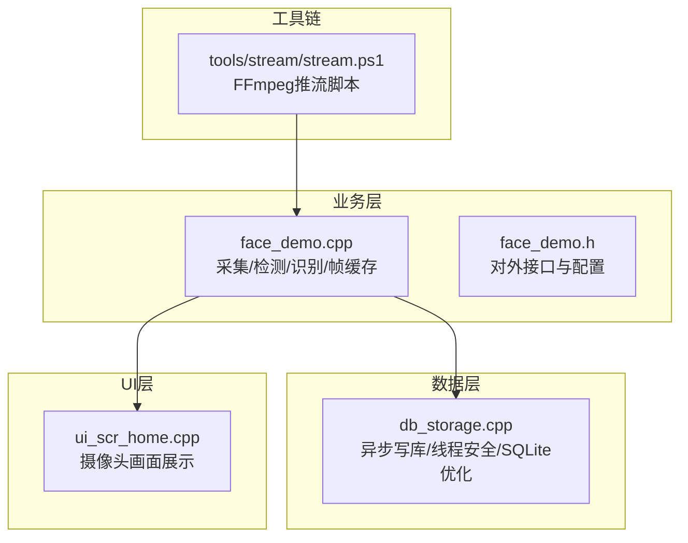
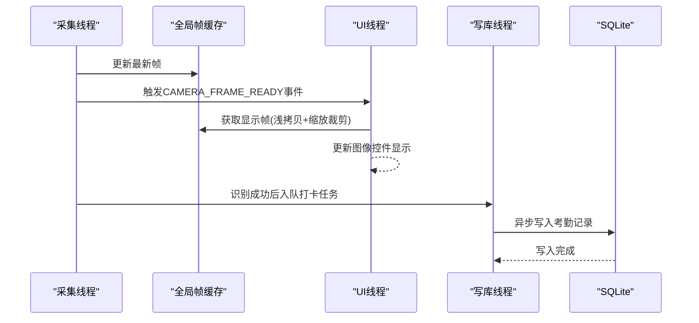
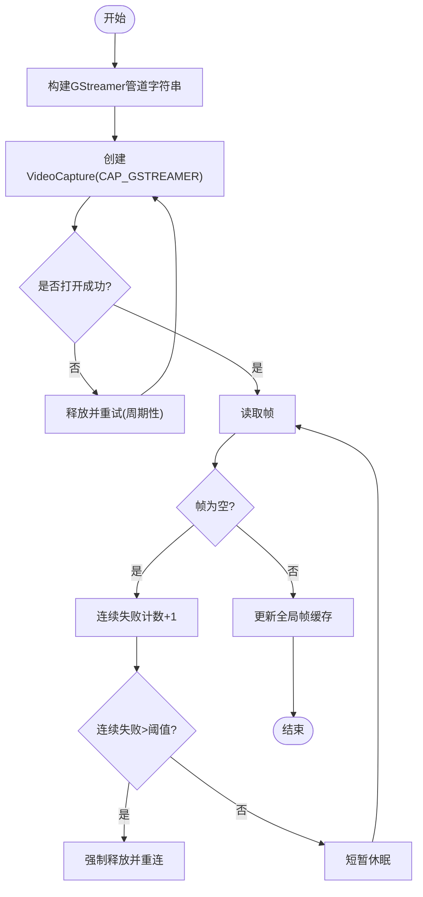
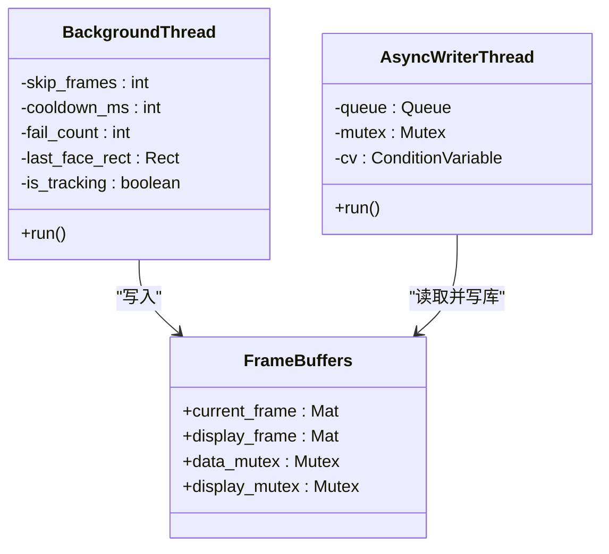
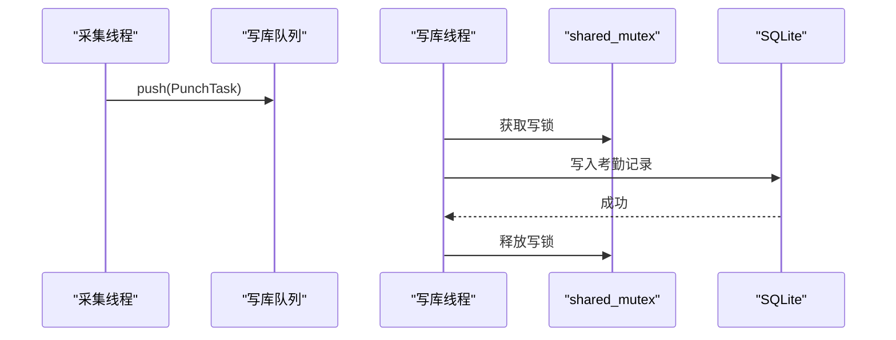
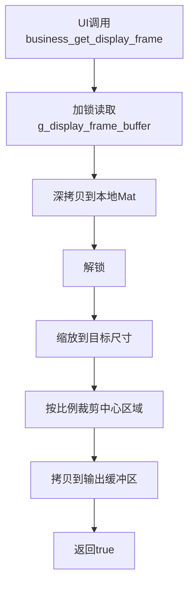
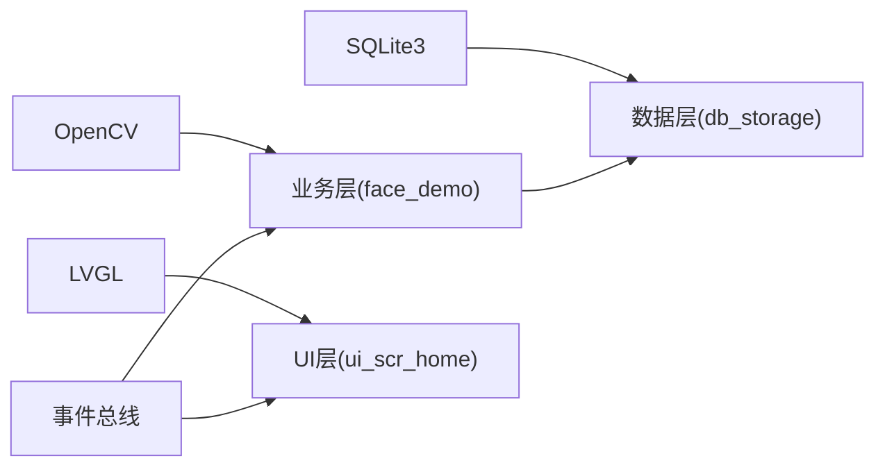

# 摄像头设备集成

<cite>
**本文档引用的文件**
- [face_demo.cpp](file://src/business/face_demo.cpp)
- [face_demo.h](file://src/business/face_demo.h)
- [db_storage.cpp](file://src/data/db_storage.cpp)
- [ui_scr_home.cpp](file://src/ui/screens/home/ui_scr_home.cpp)
- [stream.ps1](file://tools/stream/stream.ps1)
</cite>

## 目录
1. [简介](#简介)
2. [项目结构](#项目结构)
3. [核心组件](#核心组件)
4. [架构总览](#架构总览)
5. [详细组件分析](#详细组件分析)
6. [依赖关系分析](#依赖关系分析)
7. [性能考量](#性能考量)
8. [故障排查指南](#故障排查指南)
9. [结论](#结论)
10. [附录](#附录)

## 简介
本文件面向SmartAttendance项目中的摄像头设备集成，围绕以下目标展开：
- OpenCV摄像头驱动集成：VideoCapture类的初始化、参数配置与错误处理。
- GStreamer视频流协议实现：SDP文件格式、RTP传输协议、视频编解码器配置。
- 多线程视频采集架构：后台采集线程设计、帧缓冲区管理、线程同步机制。
- 多种摄像头硬件适配：USB摄像头、IP摄像头、工业相机的驱动配置思路。
- 性能优化技巧与常见问题解决方案。

## 项目结构
与摄像头集成直接相关的模块分布如下：
- 业务层：负责视频采集、人脸检测与识别、帧缓存与UI交互。
- 数据层：负责异步写库、线程安全与SQLite性能优化。
- UI层：负责显示摄像头画面与状态信息。
- 工具链：提供Windows侧FFmpeg推流脚本，便于构建端到端测试环境。

**图表来源**
- [face_demo.cpp](file://src/business/face_demo.cpp)
- [face_demo.h](file://src/business/face_demo.h)
- [db_storage.cpp](file://src/data/db_storage.cpp)
- [ui_scr_home.cpp](file://src/ui/screens/home/ui_scr_home.cpp)
- [stream.ps1](file://tools/stream/stream.ps1)

**章节来源**
- [face_demo.cpp](file://src/business/face_demo.cpp)
- [face_demo.h](file://src/business/face_demo.h)
- [db_storage.cpp](file://src/data/db_storage.cpp)
- [ui_scr_home.cpp](file://src/ui/screens/home/ui_scr_home.cpp)
- [stream.ps1](file://tools/stream/stream.ps1)

## 核心组件
- VideoCapture与GStreamer管道
  - 使用硬编码的GStreamer管道参数，基于UDP/RTP RAW视频流，BGR格式输出，最大缓冲1帧，非同步、丢弃策略。
  - 管道参数包含udpsrc、rtpjitterbuffer、rtpvrawdepay、videoconvert、appsink等元素，明确RTP负载类型、采样格式与分辨率。
- 后台采集线程
  - 独立线程持续读取视频帧，进行人脸检测与识别，维护全局帧缓存与UI显示帧缓存。
  - 采用跳帧策略降低CPU占用，使用冷却时间避免重复识别与重复打卡。
- 异步写库线程
  - 单独线程消费队列，串行写入数据库，避免SQLite多线程竞争。
  - 使用条件变量与互斥锁协调生产者与消费者。
- 帧缓冲与线程同步
  - 两套互斥锁分别保护全局帧与UI帧，UI侧获取帧时进行缩放与裁剪，避免阻塞采集线程。
- UI集成
  - UI层通过回调接口获取最新帧，居中显示摄像头画面，配合事件总线触发刷新。

**章节来源**
- [face_demo.cpp:223-240](file://src/business/face_demo.cpp#L223-L240)
- [face_demo.cpp:291-549](file://src/business/face_demo.cpp#L291-L549)
- [face_demo.cpp:246-285](file://src/business/face_demo.cpp#L246-L285)
- [face_demo.cpp:1024-1068](file://src/business/face_demo.cpp#L1024-L1068)
- [ui_scr_home.cpp:198-209](file://src/ui/screens/home/ui_scr_home.cpp#L198-L209)

## 架构总览
摄像头设备集成采用“采集-处理-展示-落库”的流水线架构，关键特性：
- 采集线程：稳定读取GStreamer视频流，跳帧与冷却策略保障实时性。
- 处理线程：人脸检测与识别，结果叠加到帧上，更新UI帧缓存。
- 展示线程：UI侧安全获取帧，缩放与裁剪，避免阻塞采集。
- 写库线程：异步落库，避免阻塞主线程与采集线程。

**图表来源**
- [face_demo.cpp:291-549](file://src/business/face_demo.cpp#L291-L549)
- [face_demo.cpp:246-285](file://src/business/face_demo.cpp#L246-L285)
- [face_demo.cpp:1024-1068](file://src/business/face_demo.cpp#L1024-L1068)

## 详细组件分析

### OpenCV VideoCapture与GStreamer集成
- 初始化方式
  - 使用VideoCapture构造函数，显式指定后端为CAP_GSTREAMER，传入硬编码管道字符串。
  - 管道参数明确RTP RAW、YCbCr-4:2:2采样、分辨率640x480、时钟频率90kHz、负载类型96。
- appsink配置
  - sync=false、drop=true、max-buffers=1，确保低延迟与抗丢帧能力。
- 重连与错误恢复
  - 采集线程周期性检测cap.isOpened()，失败时释放并重建VideoCapture，连续长时间无帧时强制释放以恢复。
- 适配性
  - 管道参数与SDP文件严格一致，便于在不同平台复用同一套参数。

**图表来源**
- [face_demo.cpp:223-240](file://src/business/face_demo.cpp#L223-L240)
- [face_demo.cpp:312-344](file://src/business/face_demo.cpp#L312-L344)

**章节来源**
- [face_demo.cpp:223-240](file://src/business/face_demo.cpp#L223-L240)
- [face_demo.cpp:312-344](file://src/business/face_demo.cpp#L312-L344)

### 多线程视频采集架构
- 后台采集线程
  - 跳帧策略：SKIP_FRAMES=4，每5帧做一次检测，其余帧复用上一帧检测结果。
  - 冷却时间：RECOG_COOLDOWN_MS=2000ms，避免频繁识别。
  - 识别冷却：按用户维度维护冷却时间，防止重复打卡。
  - 防抖缓存：内存中缓存上次打卡时间，60秒内重复打卡直接提示。
- 异步写库线程
  - 使用条件变量与互斥锁协调，队列长度限制，超限丢弃以保系统稳定。
  - 写库线程异常捕获，避免崩溃影响主线程。
- 帧缓冲与UI
  - g_display_frame_buffer专用于UI显示，缩放与裁剪在锁外进行，降低锁持有时间。
  - UI侧通过business_get_display_frame获取帧，确保线程安全。

**图表来源**
- [face_demo.cpp:291-549](file://src/business/face_demo.cpp#L291-L549)
- [face_demo.cpp:246-285](file://src/business/face_demo.cpp#L246-L285)
- [face_demo.cpp:1024-1068](file://src/business/face_demo.cpp#L1024-L1068)

**章节来源**
- [face_demo.cpp:291-549](file://src/business/face_demo.cpp#L291-L549)
- [face_demo.cpp:246-285](file://src/business/face_demo.cpp#L246-L285)
- [face_demo.cpp:1024-1068](file://src/business/face_demo.cpp#L1024-L1068)

### 数据层与异步写库
- 线程安全
  - 使用shared_mutex实现读写分离，提升并发读取效率。
  - 写库线程独占写锁，避免竞争。
- SQLite性能优化
  - WAL模式、NORMAL同步、内存临时存储、缓存大小调整、外键约束启用。
- 异步写库
  - 通过队列与条件变量解耦生产者与消费者，防止阻塞采集线程。

**图表来源**
- [db_storage.cpp:35-38](file://src/data/db_storage.cpp#L35-L38)
- [db_storage.cpp:148-160](file://src/data/db_storage.cpp#L148-L160)
- [face_demo.cpp:246-285](file://src/business/face_demo.cpp#L246-L285)

**章节来源**
- [db_storage.cpp:35-38](file://src/data/db_storage.cpp#L35-L38)
- [db_storage.cpp:148-160](file://src/data/db_storage.cpp#L148-L160)
- [face_demo.cpp:246-285](file://src/business/face_demo.cpp#L246-L285)

### UI集成与帧获取
- UI侧通过business_get_display_frame安全获取最新帧，内部进行缩放与裁剪，确保显示效果与性能平衡。
- UI层在主页中居中显示摄像头画面，边框增强视觉效果。

**图表来源**
- [face_demo.cpp:1024-1068](file://src/business/face_demo.cpp#L1024-L1068)
- [ui_scr_home.cpp:198-209](file://src/ui/screens/home/ui_scr_home.cpp#L198-L209)

**章节来源**
- [face_demo.cpp:1024-1068](file://src/business/face_demo.cpp#L1024-L1068)
- [ui_scr_home.cpp:198-209](file://src/ui/screens/home/ui_scr_home.cpp#L198-L209)

### 多种摄像头硬件适配方案
- USB摄像头
  - Windows侧使用FFmpeg dshow输入源，推流到RTP端口，Linux侧通过GStreamer udpsrc接收。
  - 推流脚本stream.ps1提供完整的参数模板，包括分辨率、帧率、像素格式、RTP负载类型与打包大小。
- IP摄像头
  - 通过RTP RAW直连，无需额外转码，降低延迟与CPU占用。
  - 管道参数与SDP文件严格一致，便于跨平台部署。
- 工业相机
  - 建议使用GStreamer v4l2src或自定义源，确保与RTP RAW格式兼容。
  - 通过appsink的max-buffers=1与drop=true实现低延迟显示。

**章节来源**
- [stream.ps1:26-34](file://tools/stream/stream.ps1#L26-L34)
- [face_demo.cpp:223-240](file://src/business/face_demo.cpp#L223-L240)

## 依赖关系分析
- 业务层依赖
  - OpenCV：VideoCapture、图像处理、人脸检测与识别。
  - 事件总线：CAMERA_FRAME_READY事件驱动UI刷新。
  - SQLite：异步写库。
- 数据层依赖
  - SQLite3：持久化存储。
  - OpenCV：图像编码/解码。
- UI层依赖
  - LVGL：图像控件与布局。
  - 事件总线：接收刷新事件。

**图表来源**
- [face_demo.cpp](file://src/business/face_demo.cpp)
- [db_storage.cpp](file://src/data/db_storage.cpp)
- [ui_scr_home.cpp](file://src/ui/screens/home/ui_scr_home.cpp)

**章节来源**
- [face_demo.cpp](file://src/business/face_demo.cpp)
- [db_storage.cpp](file://src/data/db_storage.cpp)
- [ui_scr_home.cpp](file://src/ui/screens/home/ui_scr_home.cpp)

## 性能考量
- 采集线程优化
  - 跳帧策略：每5帧检测一次，显著降低CPU占用。
  - 识别冷却：2秒冷却时间，避免重复识别。
  - UI刷新限流：≥16ms刷新一次，保证预览顺滑。
- 写库线程优化
  - shared_mutex读写分离，提升并发读取性能。
  - SQLite PRAGMAS优化：WAL、NORMAL同步、内存临时存储、缓存大小、外键约束。
  - 队列长度限制与丢弃策略，防止内存膨胀。
- 显示优化
  - UI侧缩放与裁剪在锁外进行，缩短锁持有时间。
  - appsink max-buffers=1，降低内存占用与延迟。

**章节来源**
- [face_demo.cpp:291-549](file://src/business/face_demo.cpp#L291-L549)
- [face_demo.cpp:1024-1068](file://src/business/face_demo.cpp#L1024-L1068)
- [db_storage.cpp:148-160](file://src/data/db_storage.cpp#L148-L160)

## 故障排查指南
- 无法打开摄像头/视频流
  - 检查GStreamer管道参数与SDP文件一致性；确认端口与IP可达。
  - 采集线程会周期性重试，观察日志输出。
- 帧读取失败或长时间无帧
  - 连续失败超过阈值会强制释放并重连，必要时检查网络与设备。
- 识别不准确或频繁重复
  - 调整预处理配置（直方图均衡化、ROI增强、尺寸归一化）。
  - 调整识别阈值与冷却时间。
- UI卡顿或延迟大
  - 检查UI刷新频率与锁持有时间，避免在UI线程做耗时操作。
- 写库失败或阻塞
  - 检查队列长度与丢弃策略，确认写库线程异常捕获逻辑。

**章节来源**
- [face_demo.cpp:312-344](file://src/business/face_demo.cpp#L312-L344)
- [face_demo.cpp:537-547](file://src/business/face_demo.cpp#L537-L547)
- [face_demo.cpp:971-983](file://src/business/face_demo.cpp#L971-L983)

## 结论
本项目通过硬编码GStreamer管道与多线程架构，实现了稳定、低延迟的摄像头设备集成。采集线程采用跳帧与冷却策略，UI线程安全获取帧，写库线程异步落库，整体在性能与稳定性之间取得良好平衡。针对不同摄像头硬件，提供了统一的RTP RAW接入方案，便于扩展与维护。

## 附录
- 关键接口与配置
  - business_get_display_frame：线程安全获取显示帧。
  - PreprocessConfig：直方图均衡化、CLAHE、ROI增强等预处理配置。
  - SQLite PRAGMAS：WAL、同步模式、缓存与临时存储优化。
- 推荐实践
  - 保持GStreamer管道参数与SDP文件一致。
  - 在UI线程避免做耗时操作，尽量在锁外完成图像处理。
  - 合理设置appsink参数以平衡延迟与稳定性。