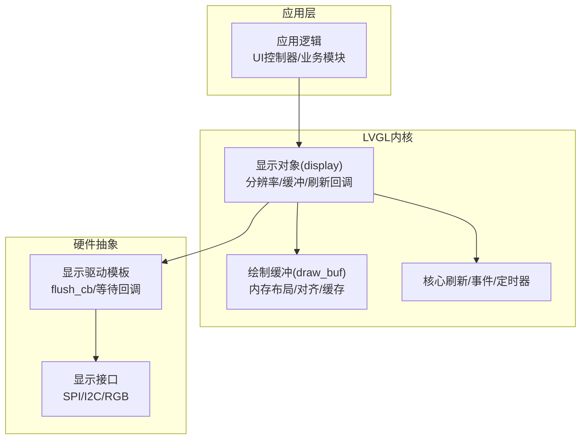
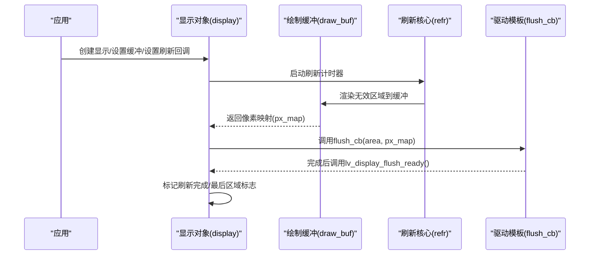
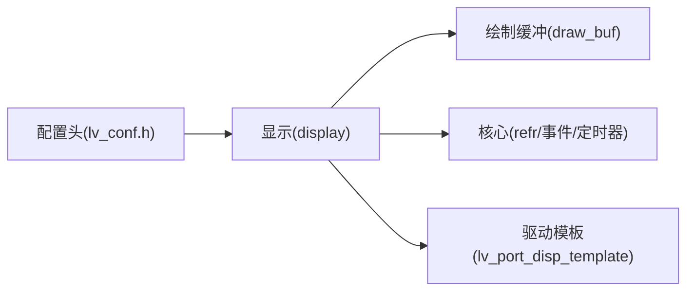

# 显示设备集成

<cite>
**本文引用的文件**
- [lv_display.c](file://libs/lvgl/src/display/lv_display.c)
- [lv_display.h](file://libs/lvgl/src/display/lv_display.h)
- [lv_display_private.h](file://libs/lvgl/src/display/lv_display_private.h)
- [lv_draw_buf.c](file://libs/lvgl/src/draw/lv_draw_buf.c)
- [lv_draw_buf.h](file://libs/lvgl/src/draw/lv_draw_buf.h)
- [lv_drivers.h](file://libs/lvgl/src/drivers/lv_drivers.h)
- [lv_port_disp_template.c](file://libs/lvgl/examples/porting/lv_port_disp_template.c)
- [lv_conf.h](file://lv_conf.h)
</cite>

## 目录
1. [简介](#简介)
2. [项目结构](#项目结构)
3. [核心组件](#核心组件)
4. [架构总览](#架构总览)
5. [详细组件分析](#详细组件分析)
6. [依赖关系分析](#依赖关系分析)
7. [性能考量](#性能考量)
8. [故障排查指南](#故障排查指南)
9. [结论](#结论)
10. [附录](#附录)

## 简介
本文件面向在嵌入式与通用平台上集成LVGL显示设备的工程师，系统化阐述LVGL显示驱动的开发方法与最佳实践，覆盖以下主题：
- 帧缓冲区管理：单缓冲、双缓冲、部分渲染与全屏渲染模式的选择与配置
- 颜色格式转换：RGB565、RGB888、XRGB888、ARGB888等格式的使用场景与注意事项
- 刷新策略优化：刷新回调、等待刷新完成、垂直同步事件注册
- 多显示接口适配：SPI/I2C/RGB接口的驱动实现要点与配置参数
- 多分辨率支持：1920x1080、1280x720等分辨率的适配方案
- 性能优化：双缓冲、垂直同步、刷新率调节、内存对齐与缓存处理
- 功耗优化：刷新区域最小化、按需刷新、关闭非必要功能

## 项目结构
LVGL显示子系统由“显示对象”“绘制缓冲”“驱动层”三部分组成，配合配置头文件进行全局能力开关与参数定制。

图表来源
- [lv_display.c:62-171](file://libs/lvgl/src/display/lv_display.c#L62-L171)
- [lv_draw_buf.c:218-248](file://libs/lvgl/src/draw/lv_draw_buf.c#L218-L248)
- [lv_port_disp_template.c:53-92](file://libs/lvgl/examples/porting/lv_port_disp_template.c#L53-L92)

章节来源
- [lv_display.c:62-171](file://libs/lvgl/src/display/lv_display.c#L62-L171)
- [lv_draw_buf.c:218-248](file://libs/lvgl/src/draw/lv_draw_buf.c#L218-L248)
- [lv_port_disp_template.c:53-92](file://libs/lvgl/examples/porting/lv_port_disp_template.c#L53-L92)

## 核心组件
- 显示对象（lv_display_t）
  - 负责分辨率、物理分辨率、偏移、DPI、旋转、渲染模式、刷新回调、双缓冲等
  - 提供屏幕管理、图层管理、刷新计时器、事件回调等能力
- 绘制缓冲（lv_draw_buf_t）
  - 封装图像头、数据指针、对齐、缓存操作、复制、重塑等
  - 支持自动计算stride、按颜色格式对齐、缓存失效/刷新
- 驱动模板（lv_port_disp_template）
  - 展示如何初始化显示、设置flush回调、配置缓冲模式与大小
  - 提供启用/禁用刷新的示例

章节来源
- [lv_display.h:88-494](file://libs/lvgl/src/display/lv_display.h#L88-L494)
- [lv_display_private.h:36-174](file://libs/lvgl/src/display/lv_display_private.h#L36-L174)
- [lv_draw_buf.h:103-331](file://libs/lvgl/src/draw/lv_draw_buf.h#L103-L331)
- [lv_port_disp_template.c:53-92](file://libs/lvgl/examples/porting/lv_port_disp_template.c#L53-L92)

## 架构总览
LVGL显示刷新流程如下：应用创建显示对象并设置缓冲；刷新计时器周期性触发无效区域合并与渲染；渲染完成后调用flush回调将像素写入显示；可选注册垂直同步事件以配合硬件同步。

图表来源
- [lv_display.c:108-113](file://libs/lvgl/src/display/lv_display.c#L108-L113)
- [lv_display.c:612-620](file://libs/lvgl/src/display/lv_display.c#L612-L620)
- [lv_display.h:314-324](file://libs/lvgl/src/display/lv_display.h#L314-L324)

## 详细组件分析

### 显示对象与刷新控制
- 创建与默认显示
  - 使用创建函数初始化显示对象，设置默认屏幕、主题、刷新计时器
- 分辨率与物理参数
  - 设置原生分辨率、物理分辨率、偏移，旋转与矩阵旋转
- 缓冲与渲染模式
  - PARTIAL：小缓冲分块渲染，适合内存受限场景
  - DIRECT/FULL：整屏缓冲，便于DMA/硬件加速
- 刷新回调与等待
  - 设置flush_cb与flush_wait_cb，刷新完成后调用ready接口
- 双缓冲与第三缓冲
  - 可配置两套或三套缓冲，提升并发与稳定性

章节来源
- [lv_display.c:62-171](file://libs/lvgl/src/display/lv_display.c#L62-L171)
- [lv_display.c:252-296](file://libs/lvgl/src/display/lv_display.c#L252-L296)
- [lv_display.c:442-537](file://libs/lvgl/src/display/lv_display.c#L442-L537)
- [lv_display.c:538-553](file://libs/lvgl/src/display/lv_display.c#L538-L553)
- [lv_display.c:612-620](file://libs/lvgl/src/display/lv_display.c#L612-L620)
- [lv_display.h:125-175](file://libs/lvgl/src/display/lv_display.h#L125-L175)
- [lv_display.h:257-325](file://libs/lvgl/src/display/lv_display.h#L257-L325)

### 绘制缓冲与内存管理
- 初始化与创建
  - 支持传入外部缓冲或内部分配，自动对齐与stride计算
- stride与对齐
  - 按宽度、颜色格式与全局对齐常量计算stride，确保内存对齐
- 缓存与预乘
  - 可对带Alpha的缓冲执行预乘，减少合成开销
- 复制与重塑
  - 在相同颜色格式下高效复制区域，或调整尺寸/stride

章节来源
- [lv_draw_buf.c:218-248](file://libs/lvgl/src/draw/lv_draw_buf.c#L218-L248)
- [lv_draw_buf.c:250-291](file://libs/lvgl/src/draw/lv_draw_buf.c#L250-L291)
- [lv_draw_buf.c:366-375](file://libs/lvgl/src/draw/lv_draw_buf.c#L366-L375)
- [lv_draw_buf.c:399-468](file://libs/lvgl/src/draw/lv_draw_buf.c#L399-L468)
- [lv_draw_buf.c:470-488](file://libs/lvgl/src/draw/lv_draw_buf.c#L470-L488)
- [lv_draw_buf.h:181-191](file://libs/lvgl/src/draw/lv_draw_buf.h#L181-L191)

### 颜色格式与转换
- 支持格式
  - RGB565、RGB888、XRGB888、ARGB888等，可通过配置项选择启用
- 端序与交换
  - RGB565端序可在flush_cb中通过软件交换实现
- 预乘Alpha
  - 对ARGB8888等格式可预乘，降低合成成本

章节来源
- [lv_display.h:327-344](file://libs/lvgl/src/display/lv_display.h#L327-L344)
- [lv_conf.h:168-230](file://lv_conf.h#L168-L230)

### 刷新策略与垂直同步
- 刷新回调
  - flush_cb接收区域与像素映射，应将数据拷贝至显示区域
- 刷新等待
  - 可自定义等待回调，或使用ready标志位
- 垂直同步事件
  - 注册VSYNC事件，周期性发送vsync事件用于上层同步

章节来源
- [lv_display.h:314-324](file://libs/lvgl/src/display/lv_display.h#L314-L324)
- [lv_display.h:613-629](file://libs/lvgl/src/display/lv_display.h#L613-L629)

### 多显示接口适配（SPI/I2C/RGB）
- 接口适配入口
  - 驱动头文件集中包含多种平台/控制器驱动
- 适配要点
  - 在驱动中实现初始化、传输、命令/数据切换、复位等
  - 在flush_cb中实现像素写入与DMA/硬件加速
- 示例参考
  - 模板文件展示了缓冲模式、字节宽度、刷新使能等典型配置

章节来源
- [lv_drivers.h:26-38](file://libs/lvgl/src/drivers/lv_drivers.h#L26-L38)
- [lv_port_disp_template.c:53-92](file://libs/lvgl/examples/porting/lv_port_disp_template.c#L53-L92)

### 多分辨率支持（1920x1080、1280x720等）
- 分辨率设置
  - 通过设置原生分辨率与物理分辨率、偏移，适配不同面板
- 旋转与DPI
  - 旋转会自动交换宽高；DPI影响控件尺寸与间距
- 缓冲大小
  - 全屏DIRECT/FULL模式下，缓冲大小为“分辨率×每像素字节数”
  - PARTIAL模式下，缓冲高度可按行数裁剪以节省RAM

章节来源
- [lv_display.h:125-175](file://libs/lvgl/src/display/lv_display.h#L125-L175)
- [lv_display.c:465-497](file://libs/lvgl/src/display/lv_display.c#L465-L497)
- [lv_display.c:499-529](file://libs/lvgl/src/display/lv_display.c#L499-L529)

### 刷新流程与错误处理
- 流程要点
  - 计时器触发→无效区域合并→渲染→flush→ready→更新最后区域标志
- 错误处理
  - 断言与日志：空指针、内存不足、stride不匹配等
  - 用户可注册事件回调监听刷新相关事件

章节来源
- [lv_display.c:108-113](file://libs/lvgl/src/display/lv_display.c#L108-L113)
- [lv_display.c:612-620](file://libs/lvgl/src/display/lv_display.c#L612-L620)
- [lv_draw_buf.c:226-230](file://libs/lvgl/src/draw/lv_draw_buf.c#L226-L230)

## 依赖关系分析

图表来源
- [lv_conf.h:29-31](file://lv_conf.h#L29-L31)
- [lv_display.c:62-171](file://libs/lvgl/src/display/lv_display.c#L62-L171)
- [lv_draw_buf.c:218-248](file://libs/lvgl/src/draw/lv_draw_buf.c#L218-L248)
- [lv_port_disp_template.c:53-92](file://libs/lvgl/examples/porting/lv_port_disp_template.c#L53-L92)

章节来源
- [lv_conf.h:29-31](file://lv_conf.h#L29-L31)
- [lv_display.c:62-171](file://libs/lvgl/src/display/lv_display.c#L62-L171)
- [lv_draw_buf.c:218-248](file://libs/lvgl/src/draw/lv_draw_buf.c#L218-L248)
- [lv_port_disp_template.c:53-92](file://libs/lvgl/examples/porting/lv_port_disp_template.c#L53-L92)

## 性能考量
- 双缓冲与第三缓冲
  - 减少撕裂与竞态，提升交互流畅度
- 刷新区域最小化
  - 仅渲染无效区域，避免全屏重绘
- stride与对齐
  - 使用自动stride与对齐常量，减少内存浪费与访问异常
- 缓存与预乘
  - 预乘Alpha减少合成开销；必要时刷新/失效缓存
- 刷新率与计时器
  - 通过刷新周期控制刷新频率，平衡性能与能耗
- 渲染单元并行
  - 多draw unit并行渲染，提升大屏/复杂界面性能

章节来源
- [lv_display.c:442-537](file://libs/lvgl/src/display/lv_display.c#L442-L537)
- [lv_draw_buf.c:101-111](file://libs/lvgl/src/draw/lv_draw_buf.c#L101-L111)
- [lv_draw_buf.c:124-144](file://libs/lvgl/src/draw/lv_draw_buf.c#L124-L144)
- [lv_draw_buf.c:470-488](file://libs/lvgl/src/draw/lv_draw_buf.c#L470-L488)
- [lv_conf.h:90-92](file://lv_conf.h#L90-L92)
- [lv_conf.h:128-133](file://lv_conf.h#L128-L133)
- [lv_conf.h:192-196](file://lv_conf.h#L192-L196)

## 故障排查指南
- 常见问题
  - 缓冲未对齐：检查缓冲起始地址与颜色格式对齐要求
  - stride过小：确认按宽度与颜色格式计算的stride是否满足最小值
  - 内存不足：减小缓冲尺寸或切换PARTIAL模式
  - 刷新卡住：确保在flush_cb完成后调用ready接口
- 建议步骤
  - 打开调试宏定位问题范围
  - 逐步缩小到具体刷新区域与颜色格式
  - 使用事件回调观察刷新状态与VSYNC事件

章节来源
- [lv_draw_buf.c:557-564](file://libs/lvgl/src/draw/lv_draw_buf.c#L557-L564)
- [lv_draw_buf.c:640-647](file://libs/lvgl/src/draw/lv_draw_buf.c#L640-L647)
- [lv_display.c:612-620](file://libs/lvgl/src/display/lv_display.c#L612-L620)
- [lv_conf.h:412-451](file://lv_conf.h#L412-L451)

## 结论
通过合理选择渲染模式、配置缓冲与颜色格式、利用双缓冲与垂直同步事件，并结合内存对齐与缓存策略，可在不同硬件平台上稳定高效地运行LVGL显示系统。针对高分辨率与高性能需求，建议优先采用DIRECT/FULL模式并启用多渲染单元，同时严格遵循缓冲对齐与stride计算规则，确保系统在资源约束下仍保持流畅体验。

## 附录
- 关键API路径
  - 显示创建与属性：[lv_display_create:62-171](file://libs/lvgl/src/display/lv_display.c#L62-L171)，[lv_display_set_resolution:252-263](file://libs/lvgl/src/display/lv_display.c#L252-L263)，[lv_display_set_dpi:289-295](file://libs/lvgl/src/display/lv_display.c#L289-L295)
  - 缓冲设置与管理：[lv_display_set_buffers:465-497](file://libs/lvgl/src/display/lv_display.c#L465-L497)，[lv_draw_buf_init:218-248](file://libs/lvgl/src/draw/lv_draw_buf.c#L218-L248)，[lv_draw_buf_adjust_stride:399-468](file://libs/lvgl/src/draw/lv_draw_buf.c#L399-L468)
  - 刷新回调与等待：[lv_display_set_flush_cb:314-324](file://libs/lvgl/src/display/lv_display.h#L314-L324)，[lv_display_flush_ready:379-389](file://libs/lvgl/src/display/lv_display.h#L379-L389)
  - 垂直同步：[lv_display_register_vsync_event:613-629](file://libs/lvgl/src/display/lv_display.h#L613-L629)