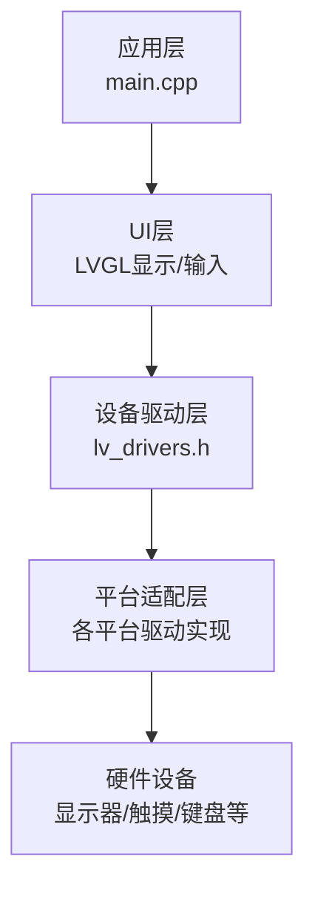
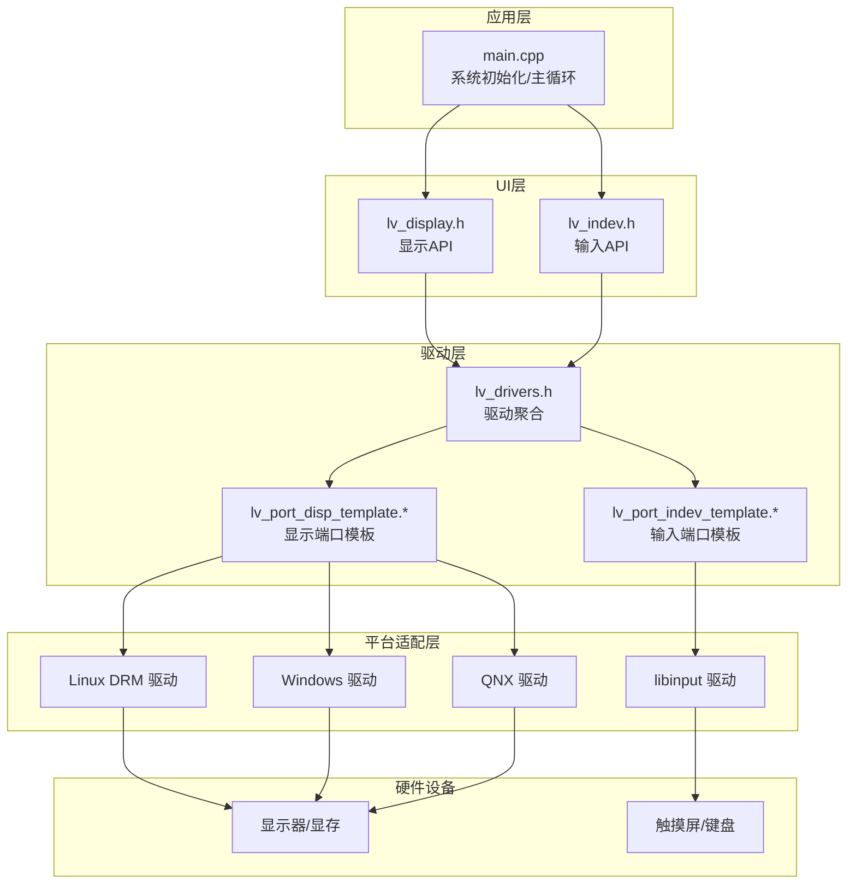
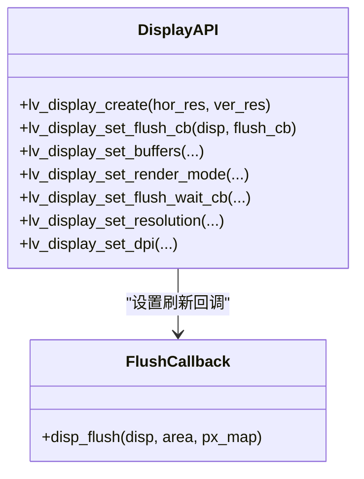
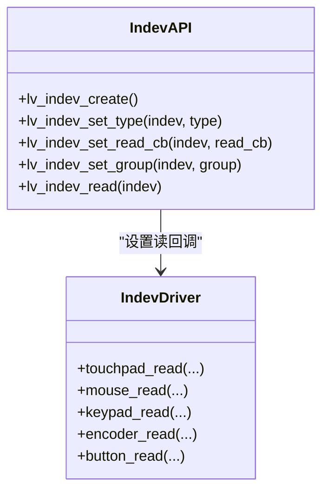
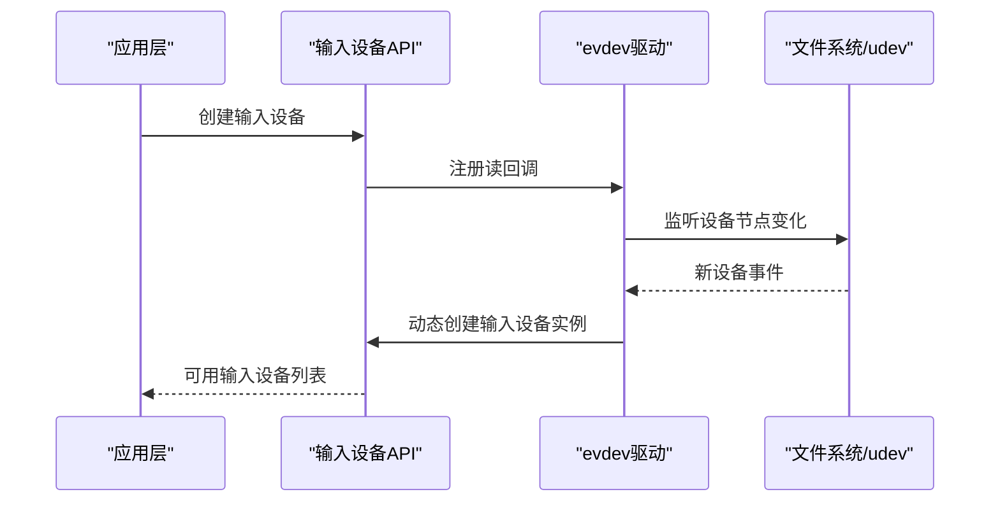
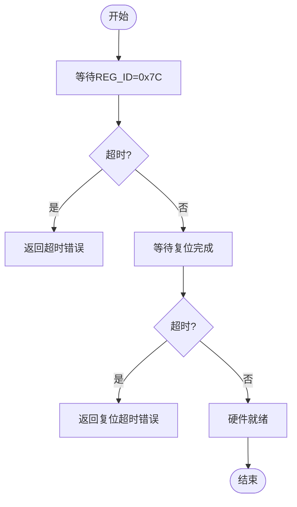
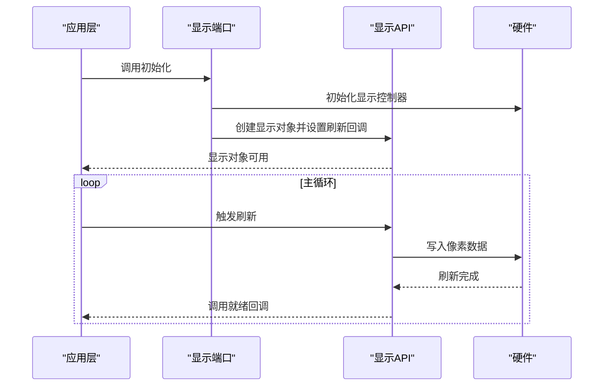
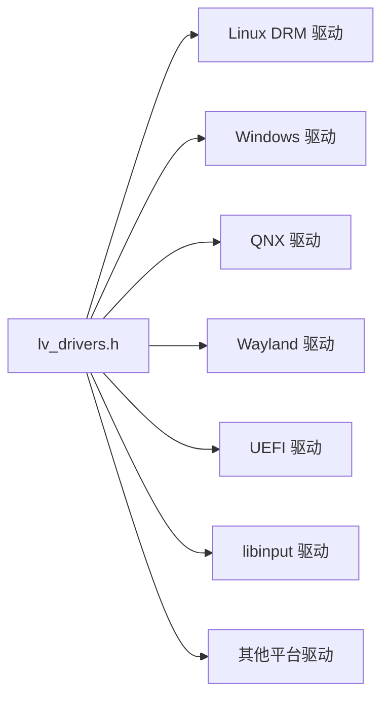

# 硬件抽象层设计

<cite>
**本文档引用的文件**
- [main.cpp](file://src/main.cpp)
- [lv_drivers.h](file://libs/lvgl/src/drivers/lv_drivers.h)
- [lv_display.h](file://libs/lvgl/src/display/lv_display.h)
- [lv_indev.h](file://libs/lvgl/src/indev/lv_indev.h)
- [lv_port_disp_template.h](file://libs/lvgl/examples/porting/lv_port_disp_template.h)
- [lv_port_indev_template.h](file://libs/lvgl/examples/porting/lv_port_indev_template.h)
- [lv_port_disp_template.c](file://libs/lvgl/examples/porting/lv_port_disp_template.c)
- [lv_port_indev_template.c](file://libs/lvgl/examples/porting/lv_port_indev_template.c)
- [lv_linux_drm.c](file://libs/lvgl/src/drivers/display/drm/lv_linux_drm.c)
- [lv_libinput.c](file://libs/lvgl/src/drivers/libinput/lv_libinput.c)
- [lv_windows_input.c](file://libs/lvgl/src/drivers/windows/lv_windows_input.c)
- [lv_qnx.c](file://libs/lvgl/src/drivers/qnx/lv_qnx.c)
- [EVE_commands.c](file://libs/lvgl/src/libs/FT800-FT813/EVE_commands.c)
</cite>

## 目录
1. [引言](#引言)
2. [项目结构](#项目结构)
3. [核心组件](#核心组件)
4. [架构总览](#架构总览)
5. [详细组件分析](#详细组件分析)
6. [依赖关系分析](#依赖关系分析)
7. [性能考虑](#性能考虑)
8. [故障排查指南](#故障排查指南)
9. [结论](#结论)

## 引言
本文件面向智能考勤系统的硬件抽象层（Hardware Abstraction Layer, HAL）设计，基于仓库中的 LVGL 显示与输入设备驱动体系，系统性阐述 HAL 的设计原则与架构模式，包括接口标准化、设备状态管理、错误处理机制；深入解析设备接口的抽象化设计（统一的设备初始化、配置、控制、数据读写接口规范）；阐述硬件设备的状态管理机制（设备检测、在线状态监控、热插拔处理）；并提供硬件错误处理与恢复策略（设备故障检测、自动重连、降级处理），最后给出接口设计示例、实现模式与最佳实践指南。

## 项目结构
本项目采用分层架构：
- 应用层：主程序入口负责系统初始化、UI 层与业务层初始化、主循环调度
- UI 层：基于 LVGL 的显示与输入设备抽象
- 设备驱动层：LVGL 提供的跨平台显示与输入设备驱动集合
- 平台适配层：针对不同平台（Linux DRM、Windows、QNX、Wayland、UEFI 等）的具体实现

**图表来源**
- [main.cpp:187-246](file://src/main.cpp#L187-L246)
- [lv_drivers.h:16-67](file://libs/lvgl/src/drivers/lv_drivers.h#L16-L67)

**章节来源**
- [main.cpp:187-246](file://src/main.cpp#L187-L246)
- [lv_drivers.h:16-67](file://libs/lvgl/src/drivers/lv_drivers.h#L16-L67)

## 核心组件
- 显示设备抽象：通过 LVGL 的显示对象与回调接口，屏蔽底层渲染差异，支持多种缓冲模式与刷新策略
- 输入设备抽象：通过输入设备对象与读回调接口，统一指针、键盘、按键、编码器等输入类型
- 驱动聚合：通过驱动头文件集中包含各平台驱动，便于按需启用与编译
- 平台适配：针对具体平台（如 Linux DRM、Windows、QNX 等）实现初始化、刷新与事件读取

**章节来源**
- [lv_display.h:88-120](file://libs/lvgl/src/display/lv_display.h#L88-L120)
- [lv_indev.h:84-108](file://libs/lvgl/src/indev/lv_indev.h#L84-L108)
- [lv_drivers.h:16-67](file://libs/lvgl/src/drivers/lv_drivers.h#L16-L67)

## 架构总览
下图展示了 HAL 的总体架构：应用层通过 LVGL 抽象访问显示与输入设备；驱动层通过统一接口对接平台适配层；平台适配层与真实硬件交互。

**图表来源**
- [lv_display.h:88-120](file://libs/lvgl/src/display/lv_display.h#L88-L120)
- [lv_indev.h:84-108](file://libs/lvgl/src/indev/lv_indev.h#L84-L108)
- [lv_drivers.h:16-67](file://libs/lvgl/src/drivers/lv_drivers.h#L16-L67)
- [lv_port_disp_template.h:36-45](file://libs/lvgl/examples/porting/lv_port_disp_template.h#L36-L45)
- [lv_port_indev_template.h:37](file://libs/lvgl/examples/porting/lv_port_indev_template.h#L37)

## 详细组件分析

### 显示设备抽象与接口标准化
- 统一初始化：通过创建显示对象并设置刷新回调，实现跨平台一致的初始化流程
- 缓冲与渲染模式：支持部分渲染、直接渲染与全量渲染三种模式，满足不同内存与带宽约束
- 刷新等待机制：提供刷新等待回调，允许使用信号量、轮询等方式同步刷新完成
- 分辨率与 DPI：支持设置物理分辨率、偏移与 DPI，适配不同尺寸与密度的显示设备

**图表来源**
- [lv_display.h:94](file://libs/lvgl/src/display/lv_display.h#L94)
- [lv_display.h:314](file://libs/lvgl/src/display/lv_display.h#L314)
- [lv_display.h:267](file://libs/lvgl/src/display/lv_display.h#L267)
- [lv_display.h:307](file://libs/lvgl/src/display/lv_display.h#L307)
- [lv_display.h:324](file://libs/lvgl/src/display/lv_display.h#L324)
- [lv_display.h:133](file://libs/lvgl/src/display/lv_display.h#L133)
- [lv_display.h:174](file://libs/lvgl/src/display/lv_display.h#L174)

**章节来源**
- [lv_display.h:88-120](file://libs/lvgl/src/display/lv_display.h#L88-L120)
- [lv_display.h:257-293](file://libs/lvgl/src/display/lv_display.h#L257-L293)
- [lv_display.h:303-324](file://libs/lvgl/src/display/lv_display.h#L303-L324)
- [lv_display.h:125-174](file://libs/lvgl/src/display/lv_display.h#L125-L174)

### 输入设备抽象与接口标准化
- 类型与状态：统一指针、键盘、按键、编码器等类型，提供按下/释放状态与坐标、按键码等数据
- 读回调：通过读回调函数从硬件读取最新状态，支持定时器与事件驱动两种模式
- 组与焦点：支持为输入设备分配组，实现焦点导航与可访问性
- 事件处理：输入设备事件可直接传递至控件树，或在驱动层拦截处理

**图表来源**
- [lv_indev.h:88](file://libs/lvgl/src/indev/lv_indev.h#L88)
- [lv_indev.h:135](file://libs/lvgl/src/indev/lv_indev.h#L135)
- [lv_indev.h:142](file://libs/lvgl/src/indev/lv_indev.h#L142)
- [lv_indev.h:121](file://libs/lvgl/src/indev/lv_indev.h#L121)
- [lv_indev.h:108](file://libs/lvgl/src/indev/lv_indev.h#L108)

**章节来源**
- [lv_indev.h:29-76](file://libs/lvgl/src/indev/lv_indev.h#L29-L76)
- [lv_indev.h:135-156](file://libs/lvgl/src/indev/lv_indev.h#L135-L156)
- [lv_indev.h:170-191](file://libs/lvgl/src/indev/lv_indev.h#L170-L191)
- [lv_indev.h:108-121](file://libs/lvgl/src/indev/lv_indev.h#L108-L121)

### 设备状态管理与热插拔处理
- 设备发现与监控：Linux evdev 驱动通过 inotify 监控设备目录变化，动态发现新设备并尝试创建输入设备
- 状态更新：libinput 驱动根据事件流更新触摸点坐标与按下状态，并进行边界裁剪
- 平台适配：Windows/QNX 驱动通过各自平台 API 获取输入事件，统一转换为 LVGL 输入数据结构

**图表来源**
- [lv_libinput.c:445](file://libs/lvgl/src/drivers/libinput/lv_libinput.c#L445)
- [lv_windows_input.c:386](file://libs/lvgl/src/drivers/windows/lv_windows_input.c#L386)
- [lv_qnx.c:440](file://libs/lvgl/src/drivers/qnx/lv_qnx.c#L440)

**章节来源**
- [lv_libinput.c:445](file://libs/lvgl/src/drivers/libinput/lv_libinput.c#L445-L467)
- [lv_windows_input.c:386](file://libs/lvgl/src/drivers/windows/lv_windows_input.c#L386-L428)
- [lv_qnx.c:440](file://libs/lvgl/src/drivers/qnx/lv_qnx.c#L440-L484)

### 错误处理与恢复策略
- 设备就绪等待：EVE 显存芯片提供寄存器就绪与复位完成的超时等待逻辑，确保通信前硬件状态稳定
- 刷新完成通知：显示驱动在刷新完成后调用就绪回调，避免竞态条件
- 日志与错误码：多处驱动使用日志输出与错误码返回，便于定位问题

**图表来源**
- [EVE_commands.c:1477](file://libs/lvgl/src/libs/FT800-FT813/EVE_commands.c#L1477-L1522)

**章节来源**
- [EVE_commands.c:1477](file://libs/lvgl/src/libs/FT800-FT813/EVE_commands.c#L1477-L1522)

### 接口设计示例与实现模式
- 显示端口模板：提供显示初始化、缓冲区配置与刷新使能/禁用的示例实现
- 输入端口模板：提供触摸板、鼠标、键盘、编码器、按键的初始化与读回调示例
- 驱动聚合：通过头文件集中包含各平台驱动，便于按需启用

**图表来源**
- [lv_port_disp_template.c:53](file://libs/lvgl/examples/porting/lv_port_disp_template.c#L53-L92)
- [lv_port_disp_template.c:124](file://libs/lvgl/examples/porting/lv_port_disp_template.c#L124-L143)
- [lv_display.h:379](file://libs/lvgl/src/display/lv_display.h#L379)

**章节来源**
- [lv_port_disp_template.h:36-45](file://libs/lvgl/examples/porting/lv_port_disp_template.h#L36-L45)
- [lv_port_indev_template.h:37](file://libs/lvgl/examples/porting/lv_port_indev_template.h#L37)
- [lv_port_disp_template.c:53](file://libs/lvgl/examples/porting/lv_port_disp_template.c#L53-L92)
- [lv_port_indev_template.c:69](file://libs/lvgl/examples/porting/lv_port_indev_template.c#L69-L164)

## 依赖关系分析
- 驱动聚合：lv_drivers.h 通过 include 将各平台驱动头文件聚合，形成统一入口
- 平台驱动：Linux DRM、Windows、QNX、Wayland、UEFI 等驱动分别实现显示与输入功能
- 示例端口：porting 示例提供最小可运行的端口实现，便于快速移植

**图表来源**
- [lv_drivers.h:16-67](file://libs/lvgl/src/drivers/lv_drivers.h#L16-L67)

**章节来源**
- [lv_drivers.h:16-67](file://libs/lvgl/src/drivers/lv_drivers.h#L16-L67)

## 性能考虑
- 渲染模式选择：根据内存与带宽情况选择部分渲染、直接渲染或全量渲染
- 刷新等待策略：使用等待回调配合硬件同步，减少 CPU 空转
- 缓冲区大小：合理设置缓冲区大小与步长，平衡内存占用与刷新效率
- 事件驱动：优先使用事件驱动模式减少轮询开销

## 故障排查指南
- 显示无输出：检查刷新回调是否正确设置与调用，确认缓冲区配置与渲染模式
- 输入无响应：检查输入设备读回调是否注册，平台驱动是否正确初始化
- 热插拔异常：确认 evdev 监控是否启用，inotify 是否正常工作
- 硬件就绪失败：检查超时参数与硬件连接状态，查看日志输出

**章节来源**
- [lv_port_disp_template.c:124](file://libs/lvgl/examples/porting/lv_port_disp_template.c#L124-L143)
- [lv_libinput.c:445](file://libs/lvgl/src/drivers/libinput/lv_libinput.c#L445-L467)
- [EVE_commands.c:1477](file://libs/lvgl/src/libs/FT800-FT813/EVE_commands.c#L1477-L1522)

## 结论
本 HAL 设计通过 LVGL 的显示与输入抽象，实现了跨平台硬件访问的一致性接口；通过统一的初始化、配置、控制与数据读写接口，简化了上层应用开发；通过状态管理与热插拔处理，提升了系统的鲁棒性；通过错误处理与恢复策略，增强了系统稳定性。结合示例端口与平台驱动，开发者可以快速完成硬件适配与优化。