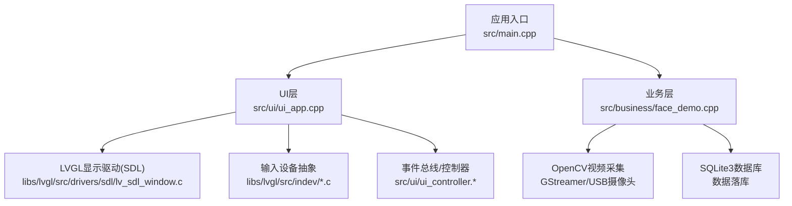
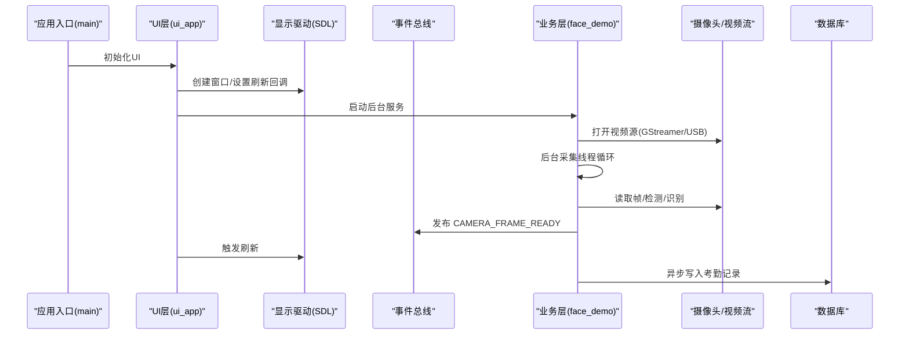
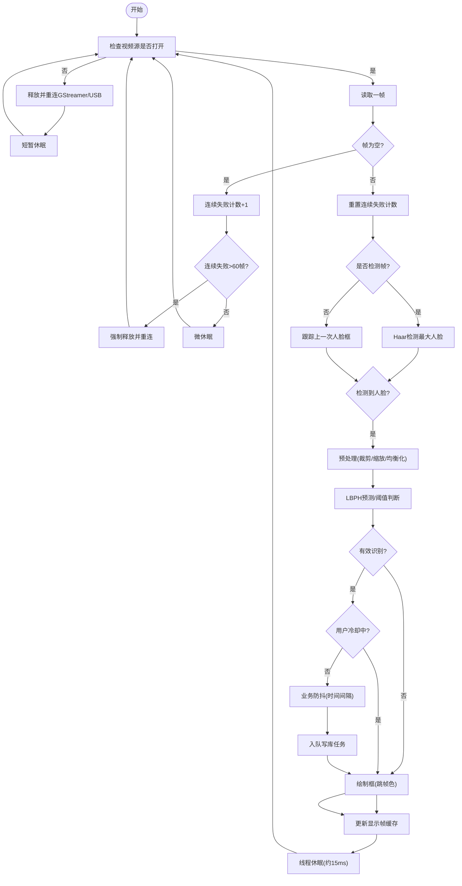
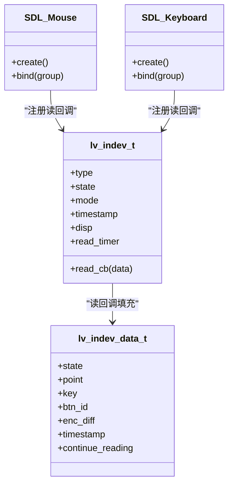
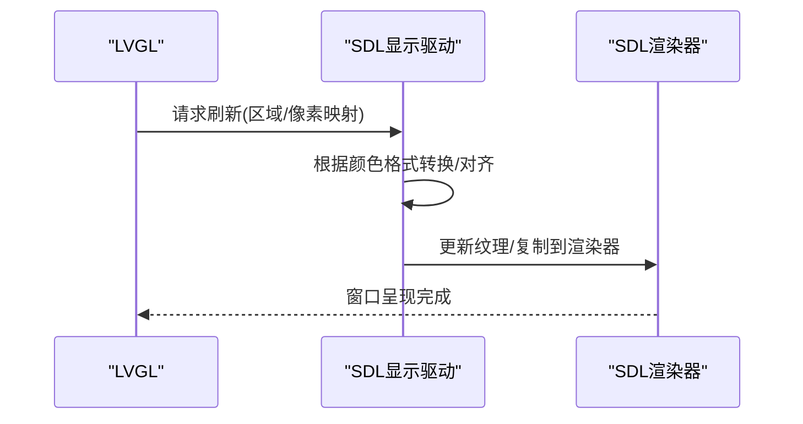
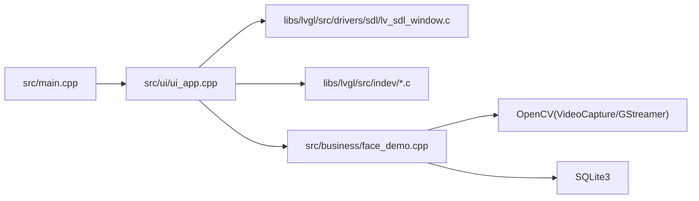

# 硬件设备集成

<cite>
**本文档引用的文件**
- [main.cpp](file://src/main.cpp)
- [face_demo.h](file://src/business/face_demo.h)
- [face_demo.cpp](file://src/business/face_demo.cpp)
- [ui_app.h](file://src/ui/ui_app.h)
- [ui_app.cpp](file://src/ui/ui_app.cpp)
- [lv_conf.h](file://lv_conf.h)
- [lv_indev.h](file://libs/lvgl/src/indev/lv_indev.h)
- [lv_indev.c](file://libs/lvgl/src/indev/lv_indev.c)
- [lv_indev_private.h](file://libs/lvgl/src/indev/lv_indev_private.h)
- [lv_sdl_window.c](file://libs/lvgl/src/drivers/sdl/lv_sdl_window.c)
- [lv_port_disp_template.h](file://libs/lvgl/examples/porting/lv_port_disp_template.h)
- [lv_port_indev_template.h](file://libs/lvgl/examples/porting/lv_port_indev_template.h)
</cite>

## 目录
1. [简介](#简介)
2. [项目结构](#项目结构)
3. [核心组件](#核心组件)
4. [架构总览](#架构总览)
5. [详细组件分析](#详细组件分析)
6. [依赖关系分析](#依赖关系分析)
7. [性能考虑](#性能考虑)
8. [故障排查指南](#故障排查指南)
9. [结论](#结论)
10. [附录](#附录)

## 简介
本指南面向智能考勤系统的硬件设备集成，聚焦以下目标：
- 摄像头设备集成：驱动适配、图像采集接口、视频流处理方案
- 输入设备集成：指纹识别器、IC卡读卡器、触摸屏等外设的驱动开发与接口封装
- 显示设备适配：多分辨率显示器支持、颜色格式转换、刷新率优化
- 硬件抽象层设计：设备接口标准化、设备状态管理、错误处理机制
- 硬件配置示例与调试方法：帮助开发者完成设备正确集成

## 项目结构
系统采用分层架构：
- 应用入口负责系统初始化、依赖自检与主循环调度
- UI层基于LVGL，提供显示与输入设备抽象
- 业务层负责摄像头采集、人脸检测与识别、考勤记录异步落库
- 数据层负责数据库访问与缓存

图表来源
- [main.cpp:187-246](file://src/main.cpp#L187-L246)
- [ui_app.cpp:34-94](file://src/ui/ui_app.cpp#L34-L94)
- [face_demo.cpp:557-694](file://src/business/face_demo.cpp#L557-L694)
- [lv_sdl_window.c:95-239](file://libs/lvgl/src/drivers/sdl/lv_sdl_window.c#L95-L239)
- [lv_indev.c:261-317](file://libs/lvgl/src/indev/lv_indev.c#L261-L317)

章节来源
- [main.cpp:187-246](file://src/main.cpp#L187-L246)
- [ui_app.cpp:34-94](file://src/ui/ui_app.cpp#L34-L94)
- [face_demo.cpp:557-694](file://src/business/face_demo.cpp#L557-L694)

## 核心组件
- 应用入口与主循环：负责系统初始化、依赖检查、UI与业务初始化、LVGL心跳与定时器
- UI层与显示驱动：使用LVGL SDL驱动创建窗口、设置刷新回调、绑定输入设备
- 业务层摄像头与识别：后台采集线程、人脸检测与识别、异步写库、事件发布
- 输入设备抽象：LVGL输入设备类型与读回调机制，支持指针/键盘/编码器/按钮
- LVGL配置：颜色深度、刷新周期、渲染配置等

章节来源
- [main.cpp:187-246](file://src/main.cpp#L187-L246)
- [ui_app.cpp:34-94](file://src/ui/ui_app.cpp#L34-L94)
- [face_demo.cpp:557-694](file://src/business/face_demo.cpp#L557-L694)
- [lv_conf.h:29-95](file://lv_conf.h#L29-L95)

## 架构总览
系统采用“UI层 + 业务层 + 数据层”的分层设计，业务层通过事件总线与UI层解耦，摄像头采集与识别在后台线程运行，避免阻塞UI。

图表来源
- [main.cpp:213-238](file://src/main.cpp#L213-L238)
- [ui_app.cpp:86-93](file://src/ui/ui_app.cpp#L86-L93)
- [face_demo.cpp:522-527](file://src/business/face_demo.cpp#L522-L527)
- [face_demo.cpp:1024-1036](file://src/business/face_demo.cpp#L1024-L1036)

## 详细组件分析

### 摄像头设备集成
- 驱动与适配
  - 业务层通过OpenCV VideoCapture打开视频源，支持GStreamer管道与USB摄像头
  - 硬编码GStreamer管道参数，适配RAW/YCbCr-4:2:2格式，输出BGR
  - 提供SDP重连逻辑，连续读取失败时强制释放并重连
- 图像采集接口
  - 后台线程持续读取帧，使用互斥锁保护共享帧，避免UI与采集线程竞争
  - 采集线程对帧进行人脸检测/识别，绘制框与文本，更新显示帧缓存
  - UI通过business_get_display_frame获取缩放后的RGB帧，用于显示
- 视频流处理
  - 跳帧策略：每5帧检测一次，其余帧复用上一次检测结果，降低CPU占用
  - 识别冷却：用户识别冷却时间控制，避免频繁重复打卡
  - 异步写库：识别结果入队，后台线程串行写库，避免SQLite并发冲突

图表来源
- [face_demo.cpp:312-549](file://src/business/face_demo.cpp#L312-L549)
- [face_demo.cpp:223-240](file://src/business/face_demo.cpp#L223-L240)
- [face_demo.cpp:1024-1036](file://src/business/face_demo.cpp#L1024-L1036)

章节来源
- [face_demo.cpp:223-240](file://src/business/face_demo.cpp#L223-L240)
- [face_demo.cpp:312-549](file://src/business/face_demo.cpp#L312-L549)
- [face_demo.cpp:1024-1036](file://src/business/face_demo.cpp#L1024-L1036)

### 输入设备集成
- LVGL输入设备抽象
  - 输入设备类型：指针、键盘、编码器、按钮
  - 读回调机制：每个输入设备注册读回调，在定时器中被周期性调用
  - 设备状态：按下/释放状态、时间戳、长按重复等
- SDL输入设备仿真
  - UI层创建SDL鼠标与键盘输入设备，绑定到UI组，实现键盘导航
- 外设扩展建议
  - 指纹识别器/IC卡读卡器/触摸屏：通过实现LVGL输入设备读回调接入
  - 读回调中将外设事件转换为LVGL输入数据结构，交由LVGL处理

图表来源
- [lv_indev.h:62-78](file://libs/lvgl/src/indev/lv_indev.h#L62-L78)
- [lv_indev.c:261-317](file://libs/lvgl/src/indev/lv_indev.c#L261-L317)
- [lv_indev_private.h:30-59](file://libs/lvgl/src/indev/lv_indev_private.h#L30-L59)
- [ui_app.cpp:55-81](file://src/ui/ui_app.cpp#L55-L81)

章节来源
- [lv_indev.h:62-78](file://libs/lvgl/src/indev/lv_indev.h#L62-L78)
- [lv_indev.c:261-317](file://libs/lvgl/src/indev/lv_indev.c#L261-L317)
- [lv_indev_private.h:30-59](file://libs/lvgl/src/indev/lv_indev_private.h#L30-L59)
- [ui_app.cpp:55-81](file://src/ui/ui_app.cpp#L55-L81)

### 显示设备适配
- SDL显示驱动
  - 创建窗口、设置标题、渲染器、纹理与缓冲区
  - 刷新回调flush_cb将LVGL绘制区域映射到SDL纹理并呈现
- LVGL配置
  - 颜色深度、默认刷新周期、DPI、渲染配置等
- 多分辨率与颜色格式
  - 通过LVGL颜色格式与stride对齐配置，适配不同像素格式
  - SDL纹理与LVGL缓冲区之间进行格式转换与更新

图表来源
- [lv_sdl_window.c:250-437](file://libs/lvgl/src/drivers/sdl/lv_sdl_window.c#L250-L437)
- [lv_conf.h:29-95](file://lv_conf.h#L29-L95)

章节来源
- [lv_sdl_window.c:250-437](file://libs/lvgl/src/drivers/sdl/lv_sdl_window.c#L250-L437)
- [lv_conf.h:29-95](file://lv_conf.h#L29-L95)

### 硬件抽象层设计
- 设备接口标准化
  - 显示：LVGL显示驱动接口，flush回调、缓冲区管理
  - 输入：LVGL输入设备接口，读回调、事件数据结构
  - 摄像头：业务层统一接口，后台线程与UI线程分离
- 设备状态管理
  - 采集线程状态、识别开关、冷却时间、UI刷新节流
- 错误处理机制
  - OpenCV异常捕获、未知异常捕获、视频流断连重连、队列满丢弃

章节来源
- [face_demo.cpp:537-547](file://src/business/face_demo.cpp#L537-L547)
- [face_demo.cpp:315-340](file://src/business/face_demo.cpp#L315-L340)
- [face_demo.cpp:472-478](file://src/business/face_demo.cpp#L472-L478)

## 依赖关系分析
- 应用入口依赖UI层与业务层
- UI层依赖LVGL显示驱动与输入设备
- 业务层依赖OpenCV、SQLite3与事件总线
- LVGL输入设备依赖读回调与事件数据结构

图表来源
- [main.cpp:213-238](file://src/main.cpp#L213-L238)
- [ui_app.cpp:34-94](file://src/ui/ui_app.cpp#L34-L94)
- [face_demo.cpp:557-694](file://src/business/face_demo.cpp#L557-L694)
- [lv_sdl_window.c:95-239](file://libs/lvgl/src/drivers/sdl/lv_sdl_window.c#L95-L239)
- [lv_indev.c:261-317](file://libs/lvgl/src/indev/lv_indev.c#L261-L317)

章节来源
- [main.cpp:213-238](file://src/main.cpp#L213-L238)
- [ui_app.cpp:34-94](file://src/ui/ui_app.cpp#L34-L94)
- [face_demo.cpp:557-694](file://src/business/face_demo.cpp#L557-L694)

## 性能考虑
- 采集线程优化
  - 跳帧检测降低CPU占用，同时保持识别精度
  - 识别冷却与业务防抖减少重复写库
- UI刷新节流
  - UI刷新最小间隔约16ms，兼顾流畅度与CPU占用
- 渲染与缓冲
  - LVGL颜色深度与stride对齐配置，减少格式转换成本
  - SDL纹理更新与Direct模式选择影响性能

章节来源
- [face_demo.cpp:291-307](file://src/business/face_demo.cpp#L291-L307)
- [face_demo.cpp:514-527](file://src/business/face_demo.cpp#L514-L527)
- [lv_conf.h:128-167](file://lv_conf.h#L128-L167)

## 故障排查指南
- 摄像头/视频流问题
  - 管道参数不匹配：确认GStreamer管道与源格式一致
  - 断流重连：监控连续失败计数，超过阈值强制释放并重连
  - OpenCV异常：捕获异常并短暂休眠，避免刷屏
- UI黑屏/无响应
  - SDL窗口创建失败：检查lv_conf.h中SDL启用与依赖安装
  - 键盘绑定：确保键盘输入类型设置为KEYPAD并绑定UI组
- 数据库写入失败
  - 队列满丢弃：观察队列长度，必要时降低识别频率
  - 异常捕获：写库异常不会导致进程崩溃

章节来源
- [face_demo.cpp:223-240](file://src/business/face_demo.cpp#L223-L240)
- [face_demo.cpp:334-340](file://src/business/face_demo.cpp#L334-L340)
- [face_demo.cpp:537-547](file://src/business/face_demo.cpp#L537-L547)
- [ui_app.cpp:55-81](file://src/ui/ui_app.cpp#L55-L81)

## 结论
本指南提供了智能考勤系统硬件设备集成的完整路径：摄像头驱动适配与视频流处理、输入设备抽象与外设接入、显示设备多分辨率与颜色格式适配、以及硬件抽象层的设计要点。通过事件总线与后台线程分离，系统在保证UI流畅的同时，实现了高效的人脸识别与考勤记录落库。

## 附录

### 硬件配置示例
- 显示配置
  - 分辨率：在UI层宏定义中设置SCREEN_W/SCREEN_H
  - 颜色深度：在LVGL配置中设置LV_COLOR_DEPTH
  - 刷新周期：在LVGL配置中设置LV_DEF_REFR_PERIOD
- 摄像头配置
  - GStreamer管道参数：根据实际源格式调整payload/width/height/colorimetry
  - USB摄像头：确保驱动与权限正确，OpenCV可正常打开设备
- 输入设备配置
  - 键盘/鼠标：UI层已创建并绑定到UI组
  - 外设扩展：参考LVGL输入设备模板文件实现读回调

章节来源
- [ui_app.cpp:20-27](file://src/ui/ui_app.cpp#L20-L27)
- [lv_conf.h:29-95](file://lv_conf.h#L29-L95)
- [face_demo.cpp:223-240](file://src/business/face_demo.cpp#L223-L240)
- [lv_port_indev_template.h:7-49](file://libs/lvgl/examples/porting/lv_port_indev_template.h#L7-L49)
- [lv_port_disp_template.h:6-57](file://libs/lvgl/examples/porting/lv_port_disp_template.h#L6-L57)