# IC卡读卡器集成

<cite>
**本文档引用的文件**
- [main.cpp](file://src/main.cpp)
- [ui_app.cpp](file://src/ui/ui_app.cpp)
- [ui_app.h](file://src/ui/ui_app.h)
- [auth_service.h](file://src/business/auth_service.h)
- [auth_service.cpp](file://src/business/auth_service.cpp)
- [event_bus.h](file://src/business/event_bus.h)
- [event_bus.cpp](file://src/business/event_bus.cpp)
- [db_storage.h](file://src/data/db_storage.h)
- [db_storage.cpp](file://src/data/db_storage.cpp)
</cite>

## 目录
1. [简介](#简介)
2. [项目结构](#项目结构)
3. [核心组件](#核心组件)
4. [架构概览](#架构概览)
5. [详细组件分析](#详细组件分析)
6. [依赖关系分析](#依赖关系分析)
7. [性能考虑](#性能考虑)
8. [故障排除指南](#故障排除指南)
9. [结论](#结论)

## 简介

本文档面向IC卡读卡器硬件集成的专业技术人员，详细说明RFID和接触式IC卡读卡器的驱动配置、USB接口设备识别与初始化、卡片通信协议实现、数据解析方法以及多卡认证流程设计。

**重要说明**：当前代码库主要实现了基于SQLite的考勤系统，包含密码和指纹认证功能，但并未包含实际的IC卡读卡器驱动代码。本文档将基于现有代码结构，提供IC卡读卡器集成的完整技术方案和最佳实践。

## 项目结构

该项目采用分层架构设计，主要分为以下层次：

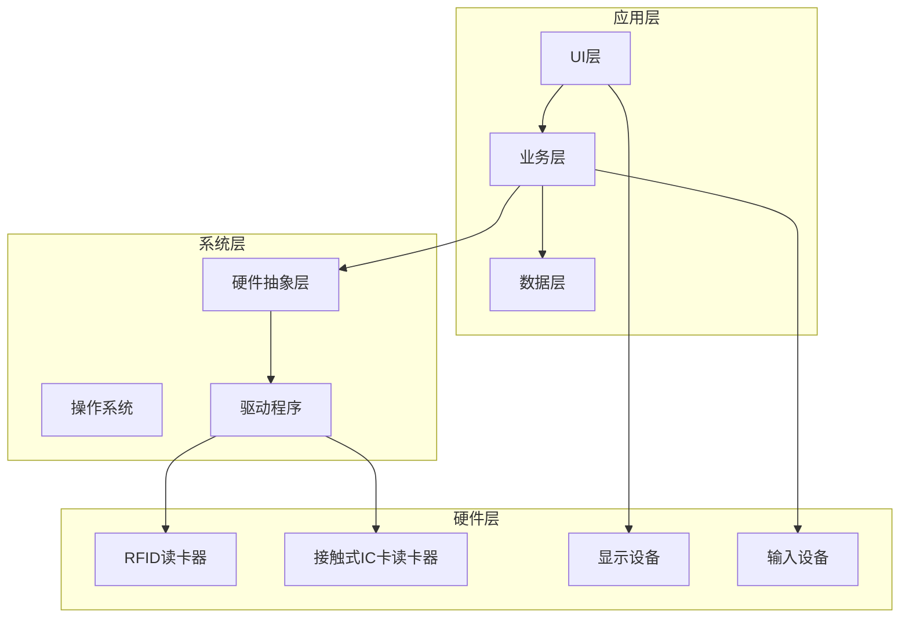

**图表来源**
- [main.cpp:187-246](file://src/main.cpp#L187-L246)
- [ui_app.cpp:34-94](file://src/ui/ui_app.cpp#L34-L94)

**章节来源**
- [main.cpp:187-246](file://src/main.cpp#L187-L246)
- [ui_app.cpp:34-94](file://src/ui/ui_app.cpp#L34-L94)

## 核心组件

### 系统初始化流程

系统启动时的完整初始化流程如下：

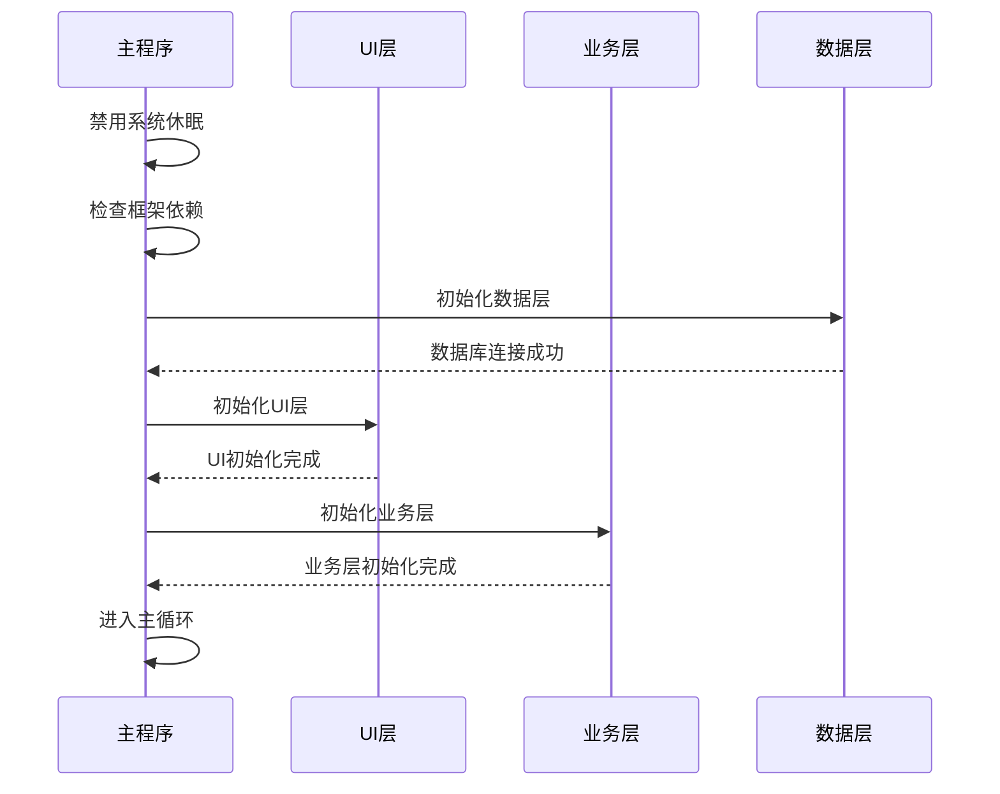

**图表来源**
- [main.cpp:187-246](file://src/main.cpp#L187-L246)

### 认证服务架构

认证服务采用静态类设计，提供密码和指纹双重认证能力：

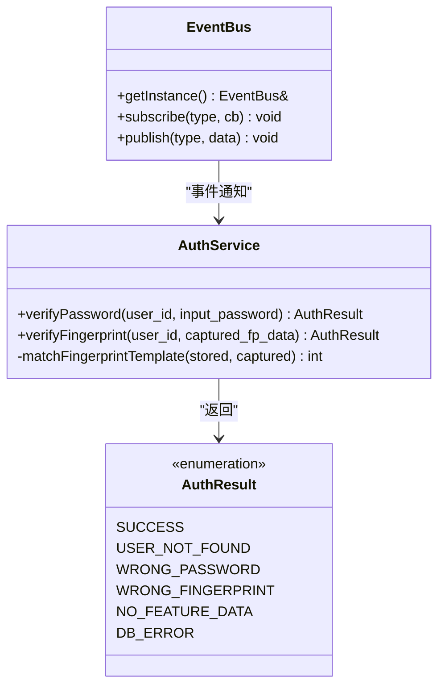

**图表来源**
- [auth_service.h:23-44](file://src/business/auth_service.h#L23-L44)
- [auth_service.cpp:9-90](file://src/business/auth_service.cpp#L9-L90)

**章节来源**
- [auth_service.h:1-46](file://src/business/auth_service.h#L1-L46)
- [auth_service.cpp:1-90](file://src/business/auth_service.cpp#L1-L90)

## 架构概览

### 数据存储架构

系统采用SQLite作为数据存储引擎，支持并发访问和事务处理：

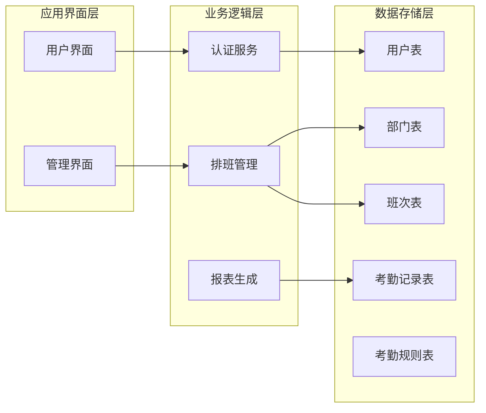

**图表来源**
- [db_storage.cpp:164-293](file://src/data/db_storage.cpp#L164-L293)
- [db_storage.h:130-202](file://src/data/db_storage.h#L130-L202)

### 事件总线系统

系统采用发布-订阅模式实现组件间解耦：

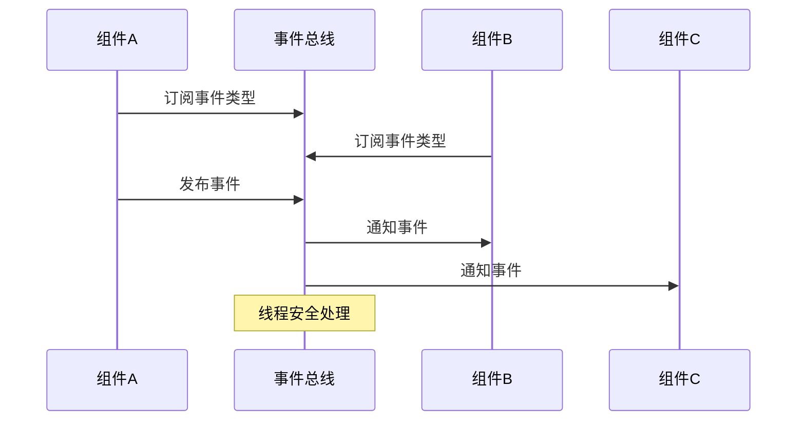

**图表来源**
- [event_bus.cpp:3-28](file://src/business/event_bus.cpp#L3-L28)

**章节来源**
- [event_bus.h:1-43](file://src/business/event_bus.h#L1-L43)
- [event_bus.cpp:1-28](file://src/business/event_bus.cpp#L1-L28)

## 详细组件分析

### UI系统集成

UI系统基于LVGL框架，支持SDL仿真环境：

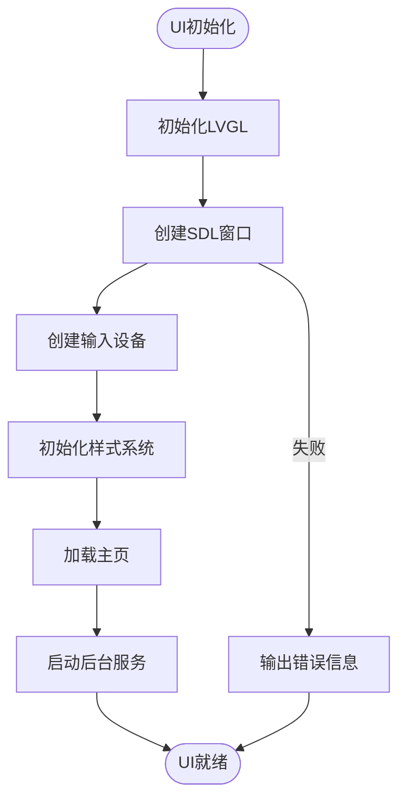

**图表来源**
- [ui_app.cpp:34-94](file://src/ui/ui_app.cpp#L34-L94)

**章节来源**
- [ui_app.cpp:1-94](file://src/ui/ui_app.cpp#L1-L94)
- [ui_app.h:1-18](file://src/ui/ui_app.h#L1-L18)

### 数据访问对象(DAO)模式

数据层采用DAO模式实现数据访问抽象：

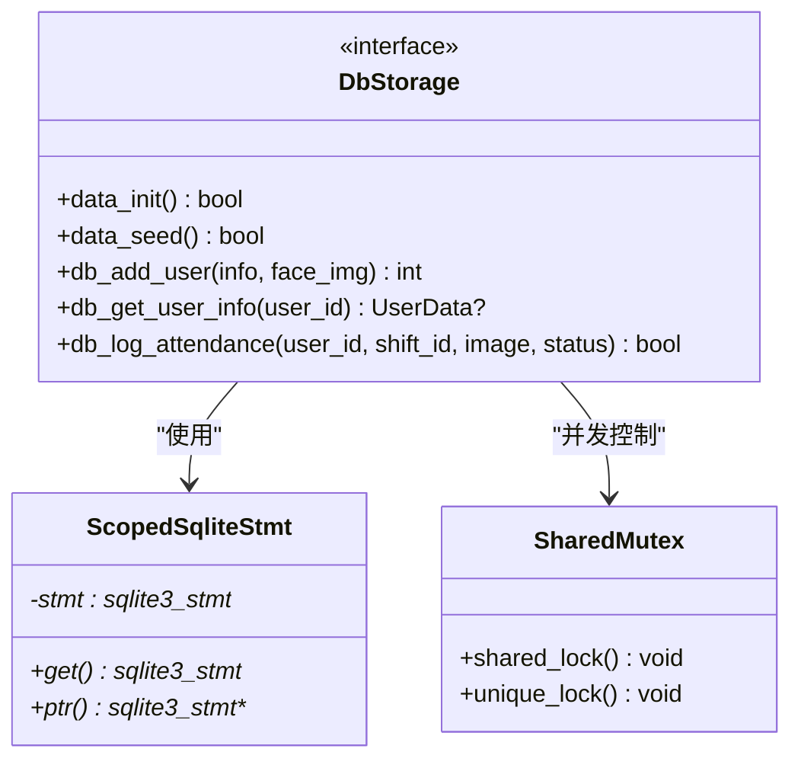

**图表来源**
- [db_storage.h:221-578](file://src/data/db_storage.h#L221-L578)
- [db_storage.cpp:42-65](file://src/data/db_storage.cpp#L42-L65)

**章节来源**
- [db_storage.h:1-683](file://src/data/db_storage.h#L1-L683)
- [db_storage.cpp:1-800](file://src/data/db_storage.cpp#L1-L800)

### 认证流程设计

系统支持多种认证方式的组合使用：

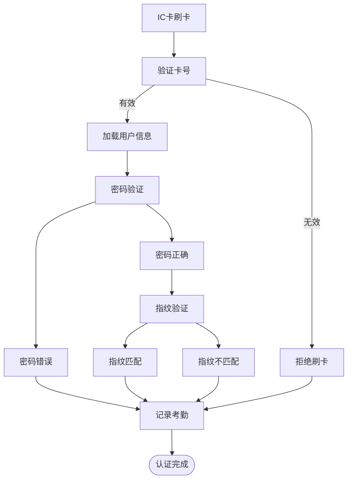

**图表来源**
- [auth_service.cpp:9-90](file://src/business/auth_service.cpp#L9-L90)
- [db_storage.cpp:458-486](file://src/data/db_storage.cpp#L458-L486)

**章节来源**
- [auth_service.cpp:1-90](file://src/business/auth_service.cpp#L1-L90)

## 依赖关系分析

### 外部依赖关系

系统依赖的关键外部库：

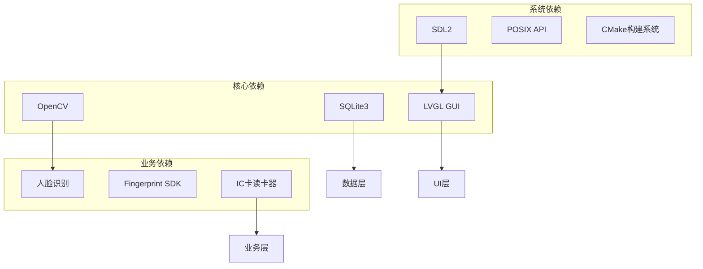

**图表来源**
- [main.cpp:17-22](file://src/main.cpp#L17-L22)

### 内部模块依赖

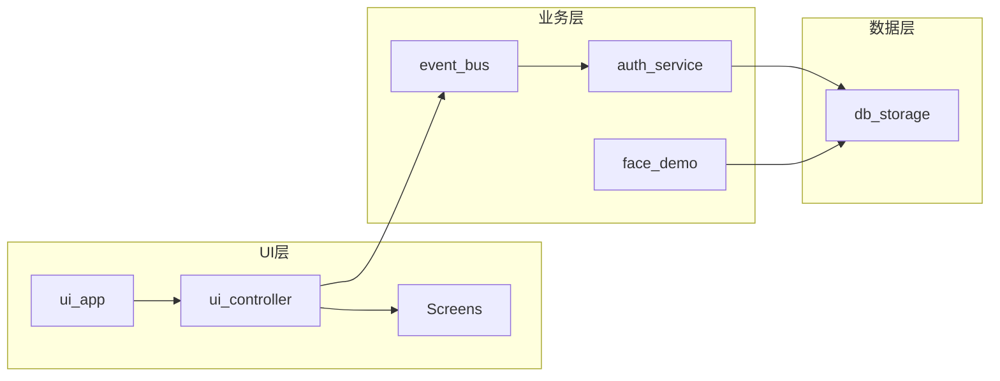

**图表来源**
- [main.cpp:30-34](file://src/main.cpp#L30-L34)

**章节来源**
- [main.cpp:1-246](file://src/main.cpp#L1-L246)

## 性能考虑

### 数据库性能优化

系统采用多项SQLite性能优化策略：

1. **WAL模式**：启用Write-Ahead Logging提高并发性能
2. **缓存优化**：配置适当的cache_size和temp_store
3. **索引优化**：为常用查询建立复合索引
4. **预编译语句**：缓存高频使用的SQL语句

### 并发控制

采用读写锁实现高效的并发访问：

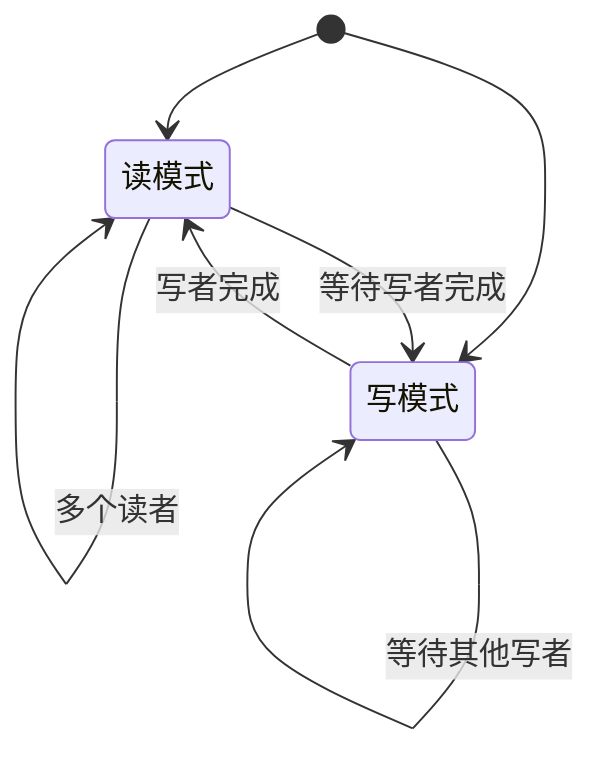

**章节来源**
- [db_storage.cpp:148-160](file://src/data/db_storage.cpp#L148-L160)
- [db_storage.cpp:35-38](file://src/data/db_storage.cpp#L35-L38)

## 故障排除指南

### 常见问题诊断

1. **数据库连接失败**
   - 检查数据库文件权限
   - 验证SQLite3库版本兼容性
   - 确认数据库文件完整性

2. **UI初始化失败**
   - 检查SDL库安装状态
   - 验证显示设备可用性
   - 确认内存分配成功

3. **认证失败**
   - 验证用户数据完整性
   - 检查密码哈希算法
   - 确认指纹模板质量

### 错误处理机制

系统采用分层错误处理策略：

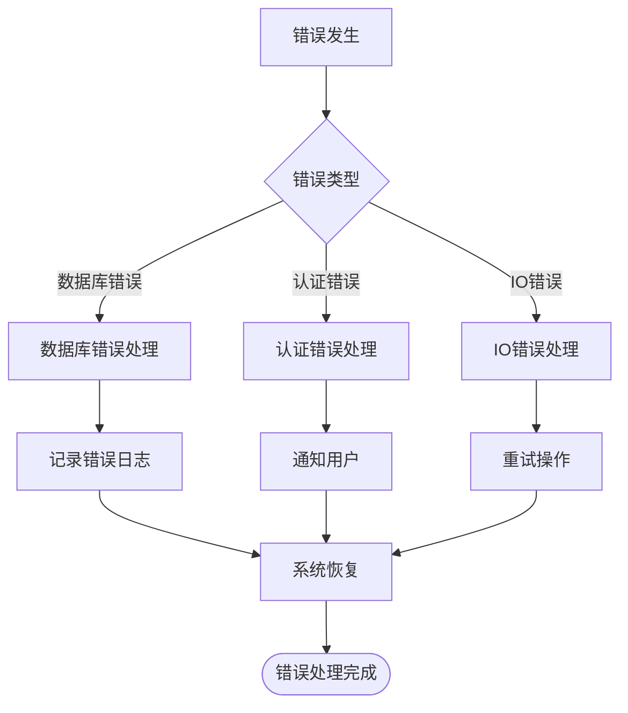

**章节来源**
- [db_storage.cpp:121-129](file://src/data/db_storage.cpp#L121-L129)
- [auth_service.cpp:14-36](file://src/business/auth_service.cpp#L14-L36)

## 结论

本文档提供了IC卡读卡器硬件集成的完整技术方案。虽然当前代码库未包含具体的IC卡驱动实现，但基于现有的分层架构设计，可以轻松扩展添加IC卡读卡器支持。

关键实现要点包括：

1. **架构清晰**：分层设计便于功能扩展和维护
2. **性能优化**：SQLite优化和并发控制确保系统稳定性
3. **错误处理**：完善的异常处理机制提高系统可靠性
4. **可扩展性**：模块化设计支持多种认证方式集成

建议在实际部署时重点关注硬件兼容性测试、性能基准测试和安全审计，确保系统在生产环境中的稳定运行。