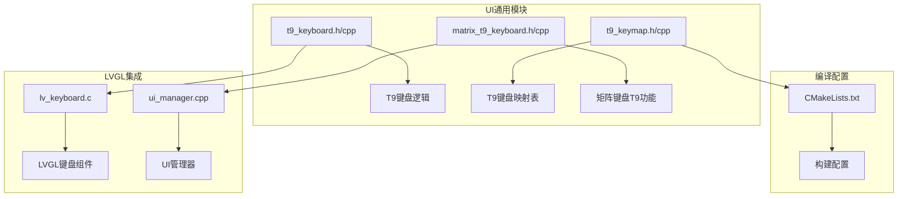
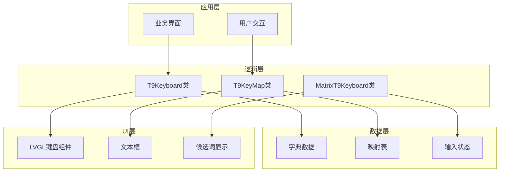
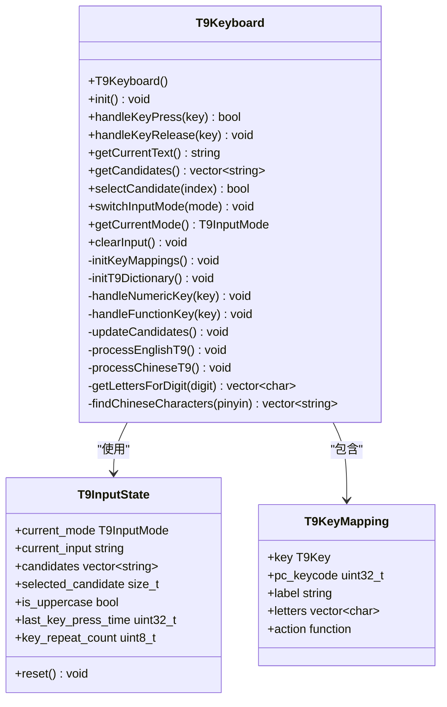
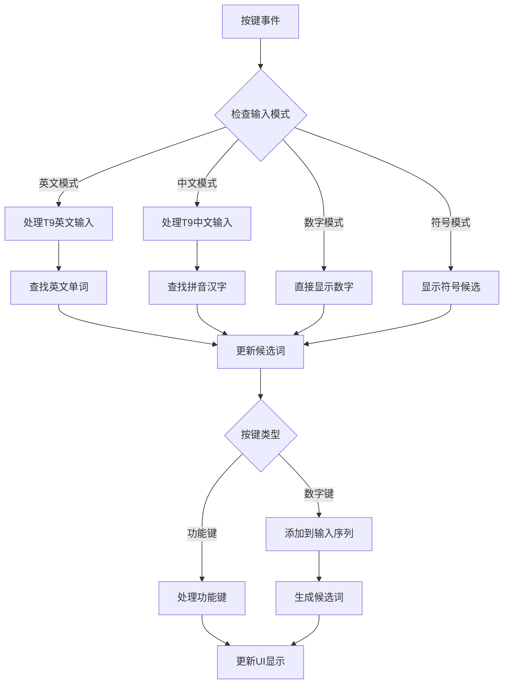
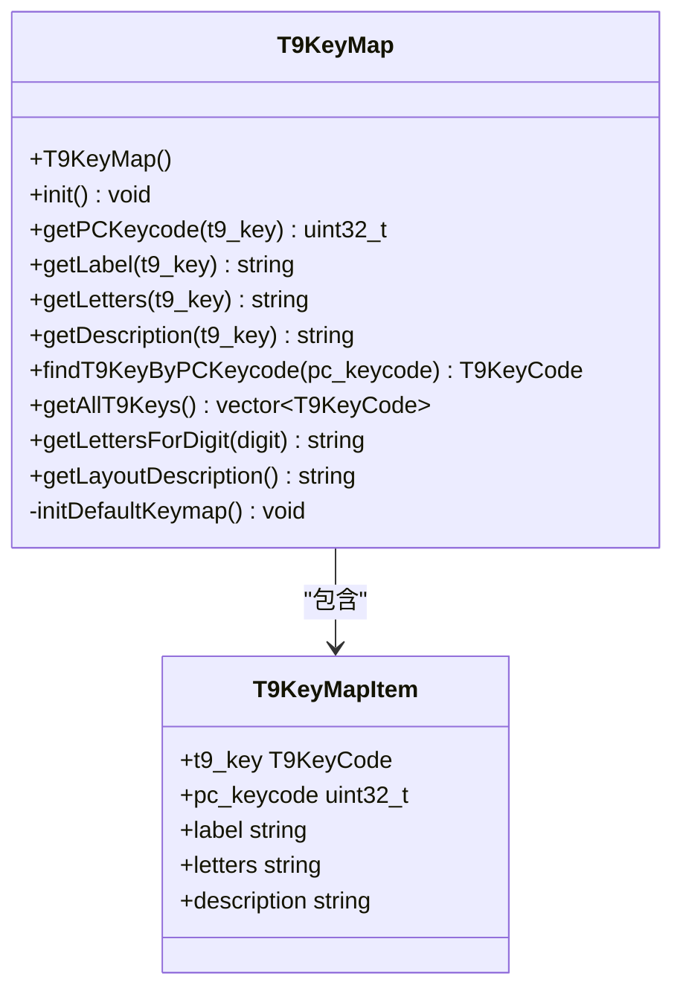
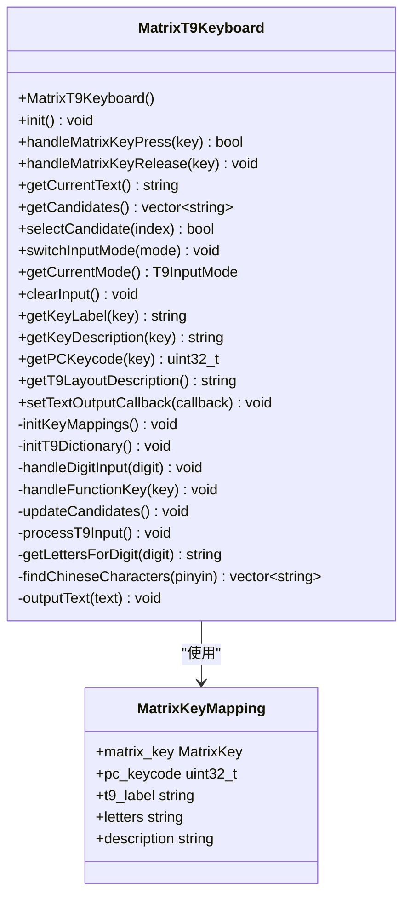
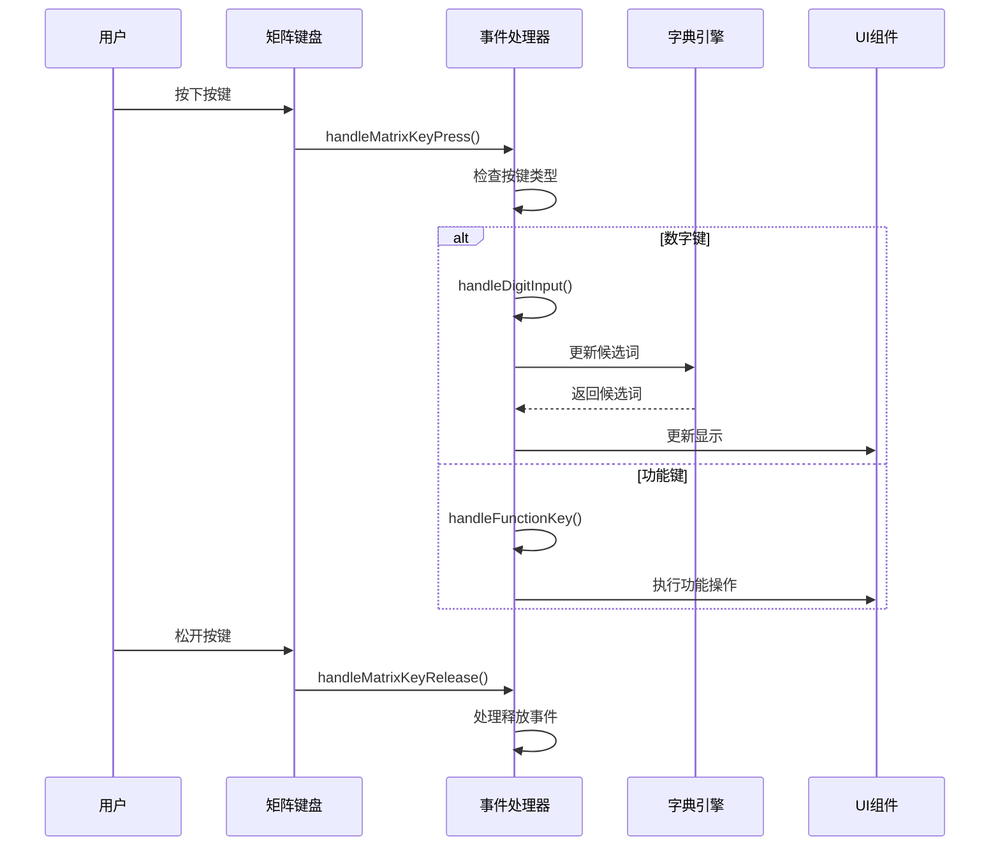
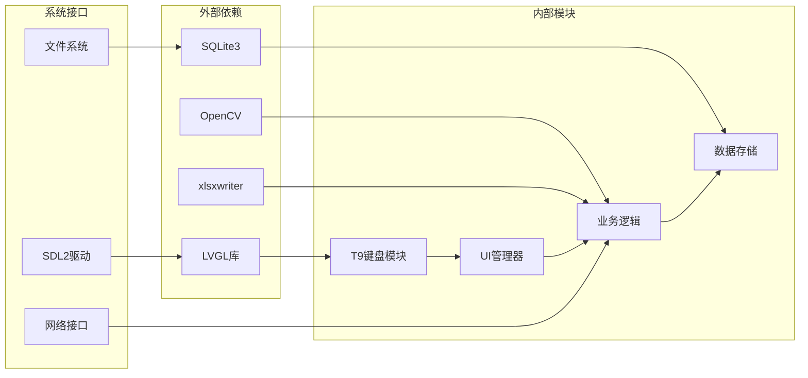

# T9键盘集成指南

<cite>
**本文档引用的文件**
- [T9键盘集成指南.md](file://docs/markdowm/T9键盘集成指南.md)
- [t9_keyboard.h](file://src/ui/common/t9_keyboard.h)
- [t9_keyboard.cpp](file://src/ui/common/t9_keyboard.cpp)
- [t9_keymap.h](file://src/ui/common/t9_keymap.h)
- [t9_keymap.cpp](file://src/ui/common/t9_keymap.cpp)
- [matrix_t9_keyboard.h](file://src/ui/common/matrix_t9_keyboard.h)
- [matrix_t9_keyboard.cpp](file://src/ui/common/matrix_t9_keyboard.cpp)
- [CMakeLists.txt](file://CMakeLists.txt)
- [lv_keyboard.c](file://libs/lvgl/src/widgets/keyboard/lv_keyboard.c)
- [ui_manager.cpp](file://src/ui/managers/ui_manager.cpp)
</cite>

## 目录
1. [简介](#简介)
2. [项目结构](#项目结构)
3. [核心组件](#核心组件)
4. [架构概览](#架构概览)
5. [详细组件分析](#详细组件分析)
6. [依赖关系分析](#依赖关系分析)
7. [性能考虑](#性能考虑)
8. [故障排除指南](#故障排除指南)
9. [总结](#总结)

## 简介

本文档详细介绍如何将T9键盘功能集成到智能考勤系统中。T9键盘是一个4x4的硬件键盘，支持数字模式、英文模式、中文模式和符号模式四种输入方式，能够通过映射到PC键盘实现智能输入法功能。

## 项目结构

智能考勤系统的T9键盘集成采用模块化设计，主要包含以下文件结构：



**图表来源**
- [CMakeLists.txt:80-112](file://CMakeLists.txt#L80-L112)
- [t9_keyboard.h:1-156](file://src/ui/common/t9_keyboard.h#L1-L156)
- [matrix_t9_keyboard.h:1-163](file://src/ui/common/matrix_t9_keyboard.h#L1-L163)

**章节来源**
- [CMakeLists.txt:80-112](file://CMakeLists.txt#L80-L112)
- [T9键盘集成指南.md:68-78](file://docs/markdowm/T9键盘集成指南.md#L68-L78)

## 核心组件

### T9键盘核心功能

T9键盘系统包含三个核心组件，每个组件都有特定的功能职责：

#### 1. T9键盘逻辑处理类
- **功能**：处理T9输入法的核心逻辑
- **特性**：支持四种输入模式、候选词选择、输入状态管理
- **接口**：初始化、按键处理、模式切换、文本获取

#### 2. T9键盘映射表类
- **功能**：提供T9键盘到PC键盘的映射关系
- **特性**：支持正向和反向查找、按键属性管理
- **接口**：键码映射、标签获取、字母映射

#### 3. 矩阵键盘T9功能类
- **功能**：专门处理4x4矩阵键盘的T9功能
- **特性**：矩阵按键定位、PC键码模拟、回调机制
- **接口**：按键事件处理、文本输出、布局描述

**章节来源**
- [t9_keyboard.h:77-156](file://src/ui/common/t9_keyboard.h#L77-L156)
- [t9_keymap.h:49-88](file://src/ui/common/t9_keymap.h#L49-L88)
- [matrix_t9_keyboard.h:81-163](file://src/ui/common/matrix_t9_keyboard.h#L81-L163)

## 架构概览

T9键盘集成采用分层架构设计，确保模块间的松耦合和高内聚：



**图表来源**
- [t9_keyboard.cpp:39-48](file://src/ui/common/t9_keyboard.cpp#L39-L48)
- [matrix_t9_keyboard.cpp:26-36](file://src/ui/common/matrix_t9_keyboard.cpp#L26-L36)

## 详细组件分析

### T9键盘逻辑处理类分析

T9Keyboard类是整个T9输入法系统的核心，负责处理各种输入模式和候选词生成：



**图表来源**
- [t9_keyboard.h:77-156](file://src/ui/common/t9_keyboard.h#L77-L156)
- [t9_keyboard.cpp:54-107](file://src/ui/common/t9_keyboard.cpp#L54-L107)

#### 输入模式处理流程

T9键盘支持四种不同的输入模式，每种模式都有特定的处理逻辑：



**图表来源**
- [t9_keyboard.cpp:109-144](file://src/ui/common/t9_keyboard.cpp#L109-L144)
- [t9_keyboard.cpp:150-178](file://src/ui/common/t9_keyboard.cpp#L150-L178)

**章节来源**
- [t9_keyboard.cpp:109-144](file://src/ui/common/t9_keyboard.cpp#L109-L144)
- [t9_keyboard.cpp:242-297](file://src/ui/common/t9_keyboard.cpp#L242-L297)

### T9键盘映射表类分析

T9KeyMap类提供T9键盘到PC键盘的双向映射功能：



**图表来源**
- [t9_keymap.h:49-88](file://src/ui/common/t9_keymap.h#L49-L88)
- [t9_keymap.cpp:17-40](file://src/ui/common/t9_keymap.cpp#L17-L40)

#### 键盘布局映射

T9键盘采用4x4布局设计，每个按键都有特定的功能映射：

| 按键位置 | T9键码 | PC键码 | 功能描述 | 字母映射 |
|---------|--------|--------|----------|----------|
| (1,1) | T9_KEY_1 | 0x31 | 数字1 | "" |
| (1,2) | T9_KEY_2 | 0x32 | 数字2/ABC | "abc" |
| (1,3) | T9_KEY_3 | 0x33 | 数字3/DEF | "def" |
| (1,4) | T9_KEY_ESC | 0x1B | 退出键 | "" |
| (2,1) | T9_KEY_4 | 0x34 | 数字4/GHI | "ghi" |
| (2,2) | T9_KEY_5 | 0x35 | 数字5/JKL | "jkl" |
| (2,3) | T9_KEY_6 | 0x36 | 数字6/MNO | "mno" |
| (2,4) | T9_KEY_MENU | 0x0D | 菜单键 | "" |
| (3,1) | T9_KEY_7 | 0x37 | 数字7/PQRS | "pqrs" |
| (3,2) | T9_KEY_8 | 0x38 | 数字8/TUV | "tuv" |
| (3,3) | T9_KEY_9 | 0x39 | 数字9/WXYZ | "wxyz" |
| (3,4) | T9_KEY_UP | 0x26 | 上方向键 | "" |
| (4,1) | T9_KEY_STAR | 0x2A | 星号键 | "" |
| (4,2) | T9_KEY_0 | 0x30 | 数字0/空格 | " " |
| (4,3) | T9_KEY_OK | 0x0D | 确认键 | "" |
| (4,4) | T9_KEY_DOWN | 0x28 | 下方向键 | "" |

**章节来源**
- [t9_keymap.cpp:17-40](file://src/ui/common/t9_keymap.cpp#L17-L40)
- [matrix_t9_keyboard.cpp:42-175](file://src/ui/common/matrix_t9_keyboard.cpp#L42-L175)

### 矩阵键盘T9功能类分析

MatrixT9Keyboard类专门处理4x4矩阵键盘的T9功能，提供更灵活的按键映射：



**图表来源**
- [matrix_t9_keyboard.h:81-163](file://src/ui/common/matrix_t9_keyboard.h#L81-L163)
- [matrix_t9_keyboard.cpp:26-548](file://src/ui/common/matrix_t9_keyboard.cpp#L26-L548)

#### 矩阵按键事件处理流程

矩阵键盘的按键事件处理采用状态机模式：



**图表来源**
- [matrix_t9_keyboard.cpp:201-249](file://src/ui/common/matrix_t9_keyboard.cpp#L201-L249)
- [matrix_t9_keyboard.cpp:287-361](file://src/ui/common/matrix_t9_keyboard.cpp#L287-L361)

**章节来源**
- [matrix_t9_keyboard.cpp:201-249](file://src/ui/common/matrix_t9_keyboard.cpp#L201-L249)
- [matrix_t9_keyboard.cpp:363-426](file://src/ui/common/matrix_t9_keyboard.cpp#L363-L426)

## 依赖关系分析

T9键盘集成涉及多个层次的依赖关系：



**图表来源**
- [CMakeLists.txt:24-38](file://CMakeLists.txt#L24-L38)
- [CMakeLists.txt:141-148](file://CMakeLists.txt#L141-L148)

### 编译配置依赖

构建系统通过CMakeLists.txt管理所有依赖关系：

**章节来源**
- [CMakeLists.txt:24-38](file://CMakeLists.txt#L24-L38)
- [CMakeLists.txt:141-148](file://CMakeLists.txt#L141-L148)

## 性能考虑

### 内存管理优化

T9键盘系统采用多种内存管理策略：

1. **对象池模式**：对于频繁创建销毁的对象使用对象池
2. **延迟初始化**：字典和映射表采用延迟加载策略
3. **字符串优化**：使用移动语义减少字符串复制
4. **缓存机制**：候选词结果缓存，避免重复计算

### 算法复杂度分析

- **字典查找**：O(log n) 基于哈希表的查找
- **候选词生成**：O(k) k为输入序列长度
- **模式切换**：O(1) 常数时间操作
- **内存占用**：约 O(n*m) n为字典大小，m为平均词条长度

### UI渲染优化

LVGL集成采用高效的渲染策略：

- **批量更新**：合并多次UI更新操作
- **增量渲染**：只更新变化的部分
- **双缓冲**：避免闪烁现象
- **事件节流**：限制高频事件处理

## 故障排除指南

### 常见问题及解决方案

#### 1. 按键无响应问题

**症状**：按键按下无任何反应
**排查步骤**：
1. 检查键码映射表是否正确初始化
2. 验证事件处理函数是否被调用
3. 确认T9键盘逻辑实例已正确创建

**解决方案**：
```cpp
// 验证键码映射
uint32_t keycode = keymap.getPCKeycode(T9_KEY_1);
if (keycode == 0) {
    // 键码映射错误
    log_error("T9键码映射失败");
}
```

#### 2. 输入法切换异常

**症状**：#键按下无法切换输入模式
**排查步骤**：
1. 检查#键的键码映射是否正确
2. 验证输入法切换逻辑实现
3. 确认模式状态正确更新

**解决方案**：
```cpp
// 手动切换输入法
void forceSwitchMode(T9InputMode target_mode) {
    t9_kb.switchInputMode(target_mode);
    t9_kb.clearInput();
    updateModeDisplay(target_mode);
}
```

#### 3. 候选词显示问题

**症状**：候选词不显示或显示错误
**排查步骤**：
1. 检查字典初始化是否完成
2. 验证T9输入处理逻辑
3. 确认UI更新函数正常工作

**解决方案**：
```cpp
// 手动刷新候选词
void refreshCandidates() {
    t9_kb.updateCandidates();
    auto candidates = t9_kb.getCandidates();
    updateCandidateDisplay(candidates);
}
```

### 调试方法

启用调试输出以帮助问题诊断：

```cpp
#define T9_DEBUG 1

#ifdef T9_DEBUG
    #define T9_LOG(fmt, ...) printf("[T9_DEBUG] " fmt "\n", ##__VA_ARGS__)
#else
    #define T9_LOG(fmt, ...)
#endif

// 在关键函数中添加日志
void T9Keyboard::handleKeyPress(T9Key key) {
    T9_LOG("处理按键: %d", static_cast<int>(key));
    // ...
}
```

**章节来源**
- [T9键盘集成指南.md:291-330](file://docs/markdowm/T9键盘集成指南.md#L291-L330)

## 总结

T9键盘集成为智能考勤系统提供了完整的文本输入解决方案。通过模块化设计和清晰的架构分离，系统实现了：

1. **完整的T9输入法支持**：支持数字、英文、中文、符号四种模式
2. **灵活的硬件适配**：支持物理T9键盘和软件模拟
3. **高效的LVGL集成**：无缝集成到现有的UI框架中
4. **良好的扩展性**：易于添加新的输入模式和功能
5. **完善的错误处理**：提供全面的故障排除和调试支持

该集成方案为后续硬件部署和功能扩展奠定了坚实的基础，显著提升了系统的用户体验和输入效率。