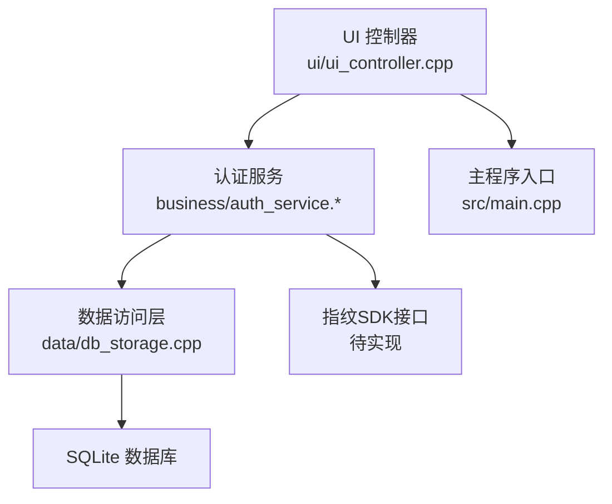
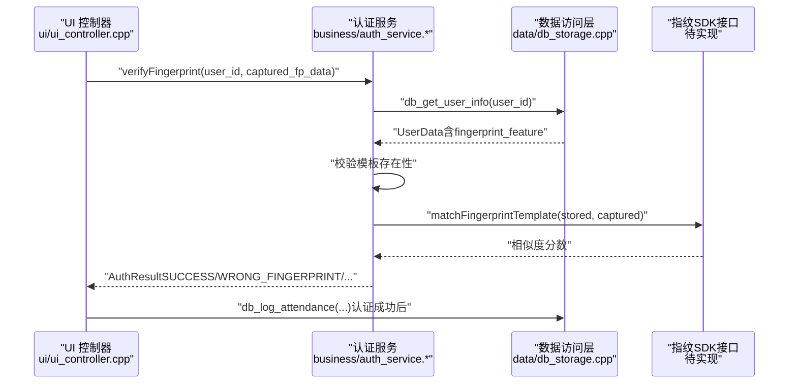
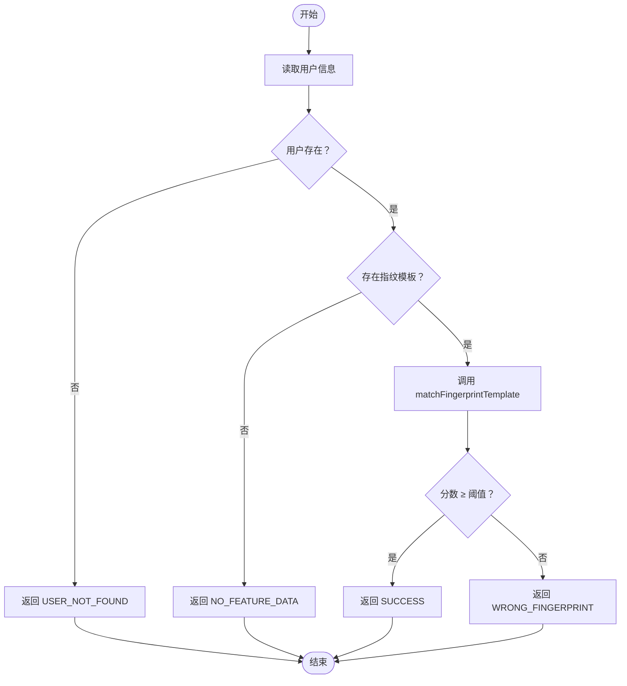
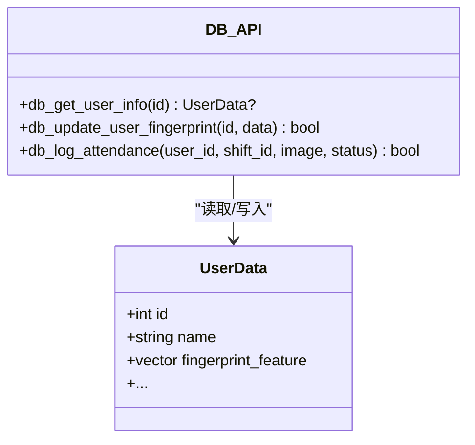
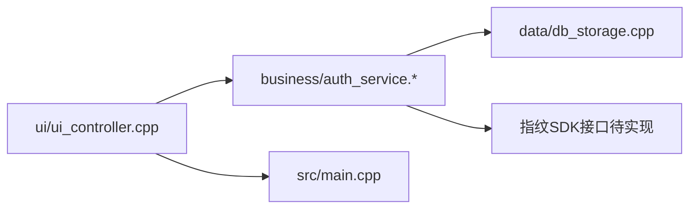

# 指纹识别器集成

<cite>
**本文引用的文件**   
- [src/business/auth_service.h](file://src/business/auth_service.h)
- [src/business/auth_service.cpp](file://src/business/auth_service.cpp)
- [src/data/db_storage.cpp](file://src/data/db_storage.cpp)
- [src/ui/ui_controller.cpp](file://src/ui/ui_controller.cpp)
- [src/main.cpp](file://src/main.cpp)
- [docs/markdowm/FA03H_rules.md](file://docs/markdowm/FA03H_rules.md)
</cite>

## 目录
1. [简介](#简介)
2. [项目结构](#项目结构)
3. [核心组件](#核心组件)
4. [架构总览](#架构总览)
5. [详细组件分析](#详细组件分析)
6. [依赖关系分析](#依赖关系分析)
7. [性能考量](#性能考量)
8. [故障排查指南](#故障排查指南)
9. [结论](#结论)
10. [附录](#附录)

## 简介
本技术文档面向指纹识别器硬件集成，围绕USB指纹采集器的驱动安装与配置、指纹SDK集成、特征模板管理与比对算法配置、认证流程实现、多指纹模板管理与批量处理机制展开。结合仓库现有代码，重点梳理认证服务层、数据持久化层与UI控制层之间的协作关系，并给出可落地的集成步骤、错误处理策略与性能优化建议。

## 项目结构
本项目采用典型的三层架构：
- UI层：负责用户交互与事件调度，位于 ui/ 子目录，通过控制器封装业务调用。
- 业务层：封装认证、考勤规则等业务逻辑，位于 business/ 子目录。
- 数据层：封装SQLite访问、用户与考勤数据的增删改查，位于 data/ 子目录。

**图表来源**
- [src/ui/ui_controller.cpp:1-200](file://src/ui/ui_controller.cpp#L1-L200)
- [src/business/auth_service.h:1-46](file://src/business/auth_service.h#L1-L46)
- [src/business/auth_service.cpp:39-90](file://src/business/auth_service.cpp#L39-L90)
- [src/data/db_storage.cpp:210-220](file://src/data/db_storage.cpp#L210-L220)
- [src/main.cpp:187-246](file://src/main.cpp#L187-L246)

**章节来源**
- [src/main.cpp:187-246](file://src/main.cpp#L187-L246)
- [src/ui/ui_controller.cpp:1-200](file://src/ui/ui_controller.cpp#L1-L200)
- [src/business/auth_service.h:1-46](file://src/business/auth_service.h#L1-L46)
- [src/business/auth_service.cpp:39-90](file://src/business/auth_service.cpp#L39-L90)
- [src/data/db_storage.cpp:210-220](file://src/data/db_storage.cpp#L210-L220)

## 核心组件
- 认证服务（AuthService）
  - 提供密码与指纹两类验证接口，返回统一的结果枚举。
  - 指纹验证流程：读取用户信息 → 校验是否存在 → 校验是否存在指纹模板 → 调用比对算法 → 返回结果。
- 数据访问层（db_storage.cpp）
  - 用户表包含指纹特征字段（BLOB），提供模板读取与更新接口。
  - 提供轻量查询、考勤记录写入、磁盘清理等能力。
- UI控制器（ui_controller.cpp）
  - 作为UI与业务/数据层的桥接，封装常用查询与业务调用。
- 主程序（main.cpp）
  - 负责系统初始化、依赖检查、UI与业务层初始化、主循环与资源回收。

**章节来源**
- [src/business/auth_service.h:8-44](file://src/business/auth_service.h#L8-L44)
- [src/business/auth_service.cpp:42-69](file://src/business/auth_service.cpp#L42-L69)
- [src/data/db_storage.cpp:978-984](file://src/data/db_storage.cpp#L978-L984)
- [src/data/db_storage.cpp:1243-1287](file://src/data/db_storage.cpp#L1243-L1287)
- [src/ui/ui_controller.cpp:155-170](file://src/ui/ui_controller.cpp#L155-L170)
- [src/main.cpp:202-225](file://src/main.cpp#L202-L225)

## 架构总览
下图展示指纹认证从UI触发到数据库落库的关键调用链路与职责边界：

**图表来源**
- [src/ui/ui_controller.cpp:155-170](file://src/ui/ui_controller.cpp#L155-L170)
- [src/business/auth_service.cpp:42-69](file://src/business/auth_service.cpp#L42-L69)
- [src/data/db_storage.cpp:978-984](file://src/data/db_storage.cpp#L978-L984)
- [src/data/db_storage.cpp:1321-1373](file://src/data/db_storage.cpp#L1321-L1373)

## 详细组件分析

### 认证服务（AuthService）
- 职责
  - 提供密码与指纹两类验证接口。
  - 指纹验证流程：读取用户信息 → 校验是否存在 → 校验是否存在指纹模板 → 调用比对算法 → 返回结果。
- 关键点
  - 指纹模板来自用户信息结构体中的二进制字段。
  - 比对算法占位，需替换为真实SDK调用。
  - 阈值判断（示例阈值为80分）可根据SDK输出调整。

**图表来源**
- [src/business/auth_service.cpp:42-69](file://src/business/auth_service.cpp#L42-L69)
- [src/business/auth_service.cpp:74-90](file://src/business/auth_service.cpp#L74-L90)

**章节来源**
- [src/business/auth_service.h:9-44](file://src/business/auth_service.h#L9-L44)
- [src/business/auth_service.cpp:42-69](file://src/business/auth_service.cpp#L42-L69)
- [src/business/auth_service.cpp:74-90](file://src/business/auth_service.cpp#L74-L90)

### 数据访问层（db_storage.cpp）
- 用户表结构
  - 新增指纹特征字段（BLOB），用于存储SDK生成的模板数据。
- 关键接口
  - 读取用户信息：包含指纹特征字段的填充。
  - 更新用户指纹模板：支持清空/删除模板（传入空数据）。
- 性能与并发
  - 使用共享/排他锁保护数据库访问。
  - 预编译高频SQL，减少解析开销。

**图表来源**
- [src/data/db_storage.cpp:210-220](file://src/data/db_storage.cpp#L210-L220)
- [src/data/db_storage.cpp:978-984](file://src/data/db_storage.cpp#L978-L984)
- [src/data/db_storage.cpp:1243-1287](file://src/data/db_storage.cpp#L1243-L1287)
- [src/data/db_storage.cpp:1321-1373](file://src/data/db_storage.cpp#L1321-L1373)

**章节来源**
- [src/data/db_storage.cpp:210-220](file://src/data/db_storage.cpp#L210-L220)
- [src/data/db_storage.cpp:978-984](file://src/data/db_storage.cpp#L978-L984)
- [src/data/db_storage.cpp:1243-1287](file://src/data/db_storage.cpp#L1243-L1287)
- [src/data/db_storage.cpp:1321-1373](file://src/data/db_storage.cpp#L1321-L1373)

### UI控制器（ui_controller.cpp）
- 职责
  - 作为UI与业务/数据层的桥接，封装常用查询与业务调用。
  - 提供用户信息查询、角色查询等辅助能力。
- 与认证流程的关系
  - UI层在指纹采集完成后，调用认证服务进行验证。
  - 认证成功后，UI层可进一步调用数据层写入考勤记录。

**章节来源**
- [src/ui/ui_controller.cpp:155-170](file://src/ui/ui_controller.cpp#L155-L170)

### 主程序（main.cpp）
- 职责
  - 系统初始化、依赖检查、UI与业务层初始化、主循环与资源回收。
- 与指纹集成的关系
  - 业务层初始化成功后，认证服务方可正常工作。
  - UI层负责触发认证流程。

**章节来源**
- [src/main.cpp:202-225](file://src/main.cpp#L202-L225)

## 依赖关系分析
- 认证服务依赖数据访问层提供的用户信息读取与指纹模板字段。
- UI控制器依赖认证服务与数据访问层，向上提供简化的业务接口。
- 主程序负责协调UI与业务层的初始化顺序，确保认证服务可用。

**图表来源**
- [src/ui/ui_controller.cpp:155-170](file://src/ui/ui_controller.cpp#L155-L170)
- [src/business/auth_service.cpp:42-69](file://src/business/auth_service.cpp#L42-L69)
- [src/data/db_storage.cpp:978-984](file://src/data/db_storage.cpp#L978-L984)
- [src/main.cpp:202-225](file://src/main.cpp#L202-L225)

**章节来源**
- [src/ui/ui_controller.cpp:155-170](file://src/ui/ui_controller.cpp#L155-L170)
- [src/business/auth_service.cpp:42-69](file://src/business/auth_service.cpp#L42-L69)
- [src/data/db_storage.cpp:978-984](file://src/data/db_storage.cpp#L978-L984)
- [src/main.cpp:202-225](file://src/main.cpp#L202-L225)

## 性能考量
- 指纹模板存储
  - 使用BLOB字段存储模板，避免二次编码带来的额外开销。
- 数据库访问
  - 使用共享/排他锁保护并发访问，预编译高频SQL减少解析成本。
- 比对算法
  - 占位函数需替换为真实SDK调用；SDK通常提供异步/批处理能力，可结合线程池优化吞吐。
- UI响应
  - LVGL主循环限制最小/最大休眠时间，保证界面流畅与CPU占用平衡。

**章节来源**
- [src/data/db_storage.cpp:1321-1373](file://src/data/db_storage.cpp#L1321-L1373)
- [src/business/auth_service.cpp:74-90](file://src/business/auth_service.cpp#L74-L90)
- [src/main.cpp:229-238](file://src/main.cpp#L229-L238)

## 故障排查指南
- 常见错误与定位
  - 用户不存在：认证服务返回“用户不存在”。
  - 未录入指纹：认证服务返回“无特征数据”。
  - 指纹不匹配：认证服务返回“指纹不匹配”。
  - 数据库错误：数据访问层返回失败或受影响行数为0。
- 排查步骤
  - 确认用户ID正确且存在。
  - 确认用户指纹模板已录入且非空。
  - 检查SDK接口是否正确实现与返回有效分数。
  - 检查数据库连接与事务状态，确认预编译语句可用。
- 相关参考
  - 考勤规则与流程可参考FA03H相关文档，确保认证成功后流程一致。

**章节来源**
- [src/business/auth_service.cpp:42-69](file://src/business/auth_service.cpp#L42-L69)
- [src/data/db_storage.cpp:1243-1287](file://src/data/db_storage.cpp#L1243-L1287)
- [docs/markdowm/FA03H_rules.md:10-127](file://docs/markdowm/FA03H_rules.md#L10-L127)

## 结论
本项目已具备指纹认证的高层设计与数据模型支撑（用户表含指纹特征字段、认证服务接口、UI与业务层桥接）。后续集成的关键在于：
- 完成指纹SDK的接入与比对算法封装；
- 明确阈值与误报率配置；
- 完善模板更新、删除与批量处理流程；
- 在UI层完善采集与反馈流程，确保用户体验与系统稳定性。

## 附录

### 指纹SDK集成要点
- 接口封装
  - 将SDK的“模板提取”“模板比对”“模板更新/删除”等能力封装为统一接口，供认证服务调用。
- 错误码映射
  - 将SDK错误码映射为认证服务的统一结果枚举，便于UI层呈现。
- 性能优化
  - 使用线程池与异步回调，避免阻塞UI线程。
  - 对比对结果进行缓存与去抖，降低重复比对次数。

### 多指纹模板管理方案
- 模板更新
  - 通过数据访问层提供的更新接口，支持清空/覆盖模板。
- 模板删除
  - 传入空数据触发删除，确保后续认证返回“无特征数据”。
- 批量处理
  - 基于数据层的批量更新接口，结合UI层的批量导入流程，实现模板批量写入与清理。

**章节来源**
- [src/data/db_storage.cpp:1243-1287](file://src/data/db_storage.cpp#L1243-L1287)