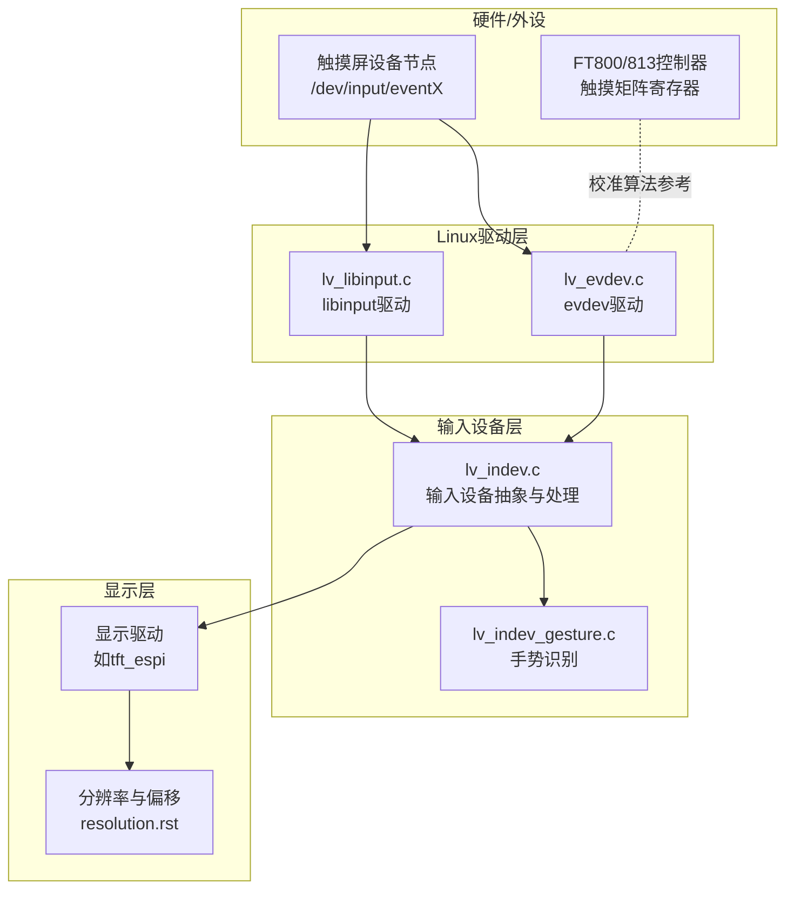
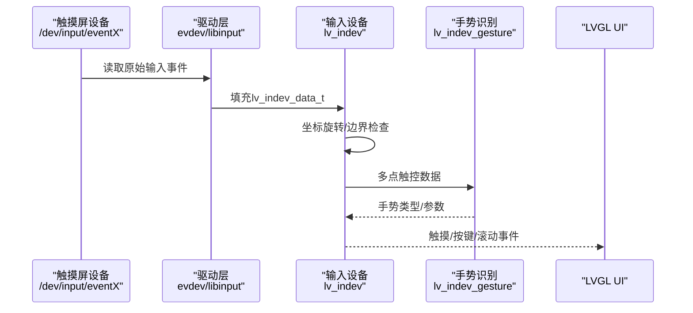
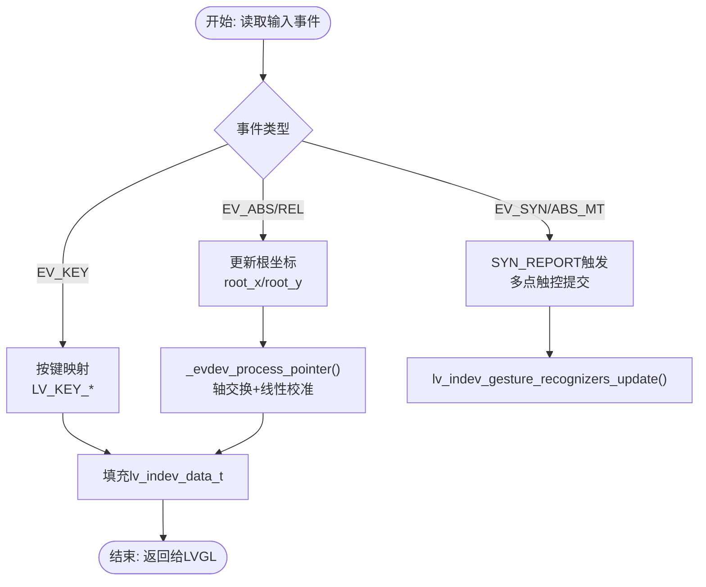
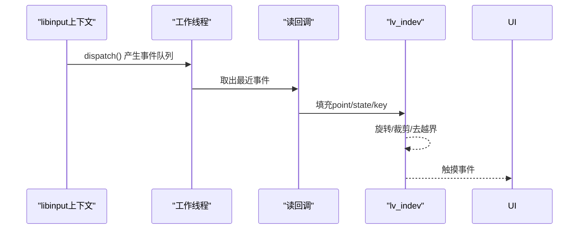
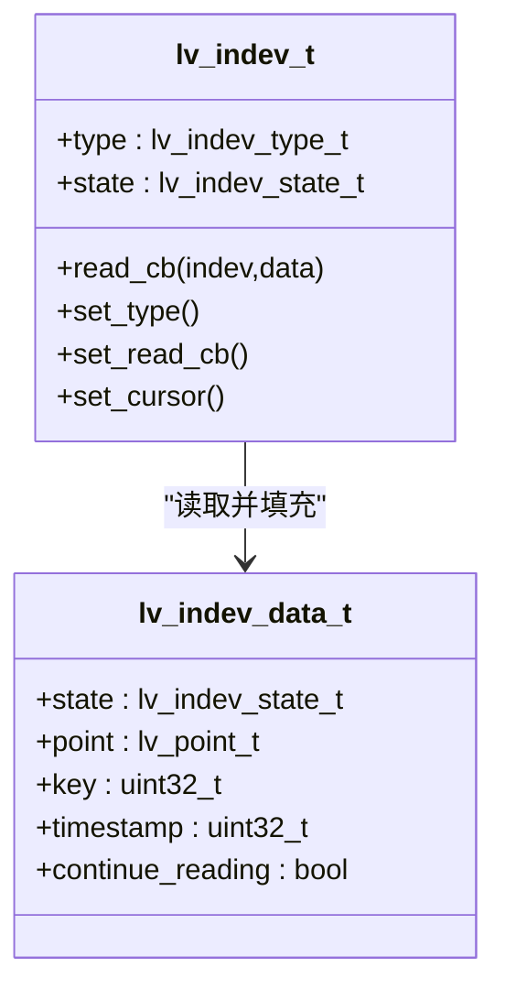
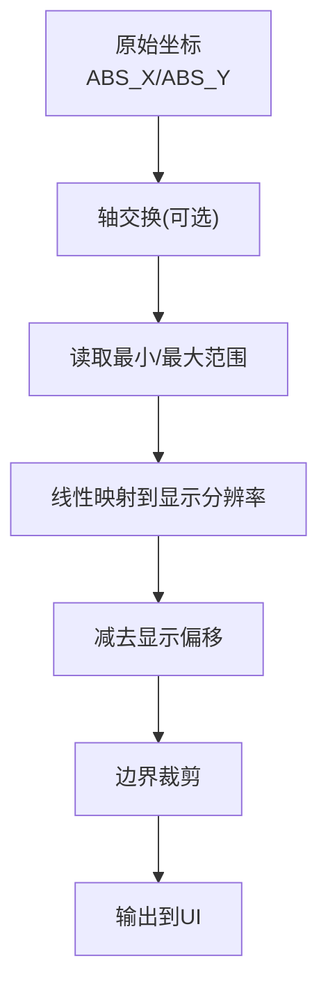
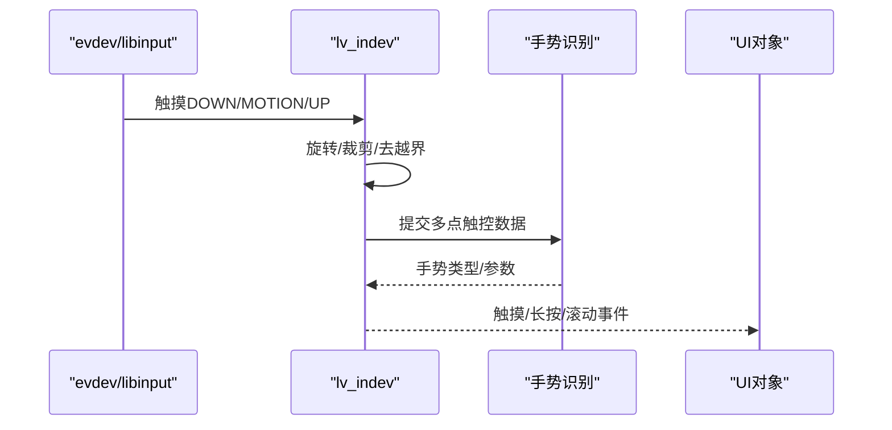
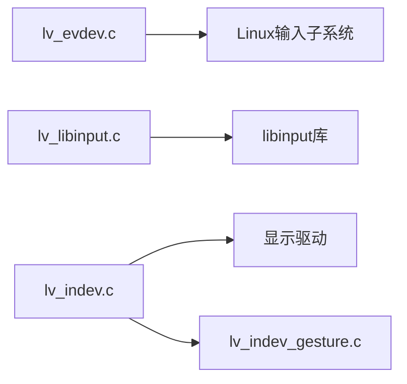

# 触摸屏设备集成

<cite>
**本文档引用的文件**
- [lv_evdev.c](file://libs/lvgl/src/drivers/evdev/lv_evdev.c)
- [lv_libinput.c](file://libs/lvgl/src/drivers/libinput/lv_libinput.c)
- [lv_indev.c](file://libs/lvgl/src/indev/lv_indev.c)
- [lv_indev.h](file://libs/lvgl/src/indev/lv_indev.h)
- [lv_indev_gesture.c](file://libs/lvgl/src/indev/lv_indev_gesture.c)
- [lv_port_indev_template.c](file://libs/lvgl/examples/porting/lv_port_indev_template.c)
- [resolution.rst](file://libs/lvgl/docs/src/details/main-modules/display/resolution.rst)
- [EVE_commands.c](file://libs/lvgl/src/libs/FT800-FT813/EVE_commands.c)
- [EVE.h](file://libs/lvgl/src/libs/FT800-FT813/EVE.h)
- [lv_nuttx_touchscreen.c](file://libs/lvgl/src/drivers/nuttx/lv_nuttx_touchscreen.c)
- [lv_tft_espi.cpp](file://libs/lvgl/src/drivers/display/tft_espi/lv_tft_espi.cpp)
</cite>

## 目录
1. [简介](#简介)
2. [项目结构](#项目结构)
3. [核心组件](#核心组件)
4. [架构总览](#架构总览)
5. [详细组件分析](#详细组件分析)
6. [依赖关系分析](#依赖关系分析)
7. [性能考虑](#性能考虑)
8. [故障排除指南](#故障排除指南)
9. [结论](#结论)
10. [附录](#附录)

## 简介
本指南面向在Linux环境下集成触摸屏设备的开发者，围绕LVGL图形库的输入子系统，系统讲解触摸屏驱动的配置与使用，涵盖libinput与evdev两种驱动模式的差异、多点触控校准算法、触摸事件处理机制、与LVGL输入设备的集成方法，以及针对不同分辨率与尺寸触摸屏的适配策略与性能调优技巧。读者无需深入底层，即可基于现有驱动快速完成从硬件到UI的端到端集成。

## 项目结构
本仓库包含完整的LVGL源码与示例，触摸屏相关能力主要分布在以下模块：
- 输入设备抽象与处理：lv_indev系列文件
- Linux evdev驱动：lv_evdev.c
- Linux libinput驱动：lv_libinput.c
- 手势识别：lv_indev_gesture.c
- 文档与示例：porting模板、显示分辨率文档、FT800/813校准示例等

图示来源
- [lv_evdev.c:1-682](file://libs/lvgl/src/drivers/evdev/lv_evdev.c#L1-L682)
- [lv_libinput.c:1-676](file://libs/lvgl/src/drivers/libinput/lv_libinput.c#L1-L676)
- [lv_indev.c:1-800](file://libs/lvgl/src/indev/lv_indev.c#L1-L800)
- [lv_indev_gesture.c:239-909](file://libs/lvgl/src/indev/lv_indev_gesture.c#L239-L909)
- [lv_tft_espi.cpp:81-110](file://libs/lvgl/src/drivers/display/tft_espi/lv_tft_espi.cpp#L81-L110)
- [resolution.rst:1-26](file://libs/lvgl/docs/src/details/main-modules/display/resolution.rst#L1-L26)

章节来源
- [lv_evdev.c:1-682](file://libs/lvgl/src/drivers/evdev/lv_evdev.c#L1-L682)
- [lv_libinput.c:1-676](file://libs/lvgl/src/drivers/libinput/lv_libinput.c#L1-L676)
- [lv_indev.c:1-800](file://libs/lvgl/src/indev/lv_indev.c#L1-L800)
- [lv_indev_gesture.c:239-909](file://libs/lvgl/src/indev/lv_indev_gesture.c#L239-L909)
- [lv_tft_espi.cpp:81-110](file://libs/lvgl/src/drivers/display/tft_espi/lv_tft_espi.cpp#L81-L110)
- [resolution.rst:1-26](file://libs/lvgl/docs/src/details/main-modules/display/resolution.rst#L1-L26)

## 核心组件
- 输入设备抽象（lv_indev）：统一管理输入设备类型、读回调、状态机与事件分发，负责坐标旋转、边界检查与指针事件处理。
- evdev驱动：直接读取Linux输入子系统事件节点，支持绝对坐标、相对坐标、按键与多点触控，内置校准与手势识别。
- libinput驱动：通过libinput上下文轮询事件，自动过滤非触摸事件，支持多指与压力相关扩展。
- 手势识别：对多点触控轨迹进行聚类、中心点计算与缩放/旋转识别，输出手势类型与数据。
- 显示与分辨率：提供设置物理分辨率、活动区域偏移的接口，确保触摸坐标与显示区域一致。

章节来源
- [lv_indev.h:29-76](file://libs/lvgl/src/indev/lv_indev.h#L29-L76)
- [lv_evdev.c:127-151](file://libs/lvgl/src/drivers/evdev/lv_evdev.c#L127-L151)
- [lv_libinput.c:383-407](file://libs/lvgl/src/drivers/libinput/lv_libinput.c#L383-L407)
- [lv_indev_gesture.c:272-909](file://libs/lvgl/src/indev/lv_indev_gesture.c#L272-L909)

## 架构总览
下图展示触摸屏从硬件到UI的完整链路：设备节点经由evdev或libinput进入LVGL输入设备，再由输入设备处理层完成坐标变换、旋转与边界检查，并触发手势识别与UI事件。

图示来源
- [lv_evdev.c:159-345](file://libs/lvgl/src/drivers/evdev/lv_evdev.c#L159-L345)
- [lv_libinput.c:409-548](file://libs/lvgl/src/drivers/libinput/lv_libinput.c#L409-L548)
- [lv_indev.c:686-747](file://libs/lvgl/src/indev/lv_indev.c#L686-L747)
- [lv_indev_gesture.c:239-269](file://libs/lvgl/src/indev/lv_indev_gesture.c#L239-L269)

## 详细组件分析

### evdev驱动：Linux输入子系统直连
- 设备发现与类型判断：通过ioctl查询EV_REL/EV_ABS/EV_KEY能力，自动识别相对指针、绝对触摸或按键设备。
- 校准与坐标变换：读取ABS_X/ABS_Y的最小最大值，结合显示偏移与分辨率进行线性映射；支持轴交换以适配不同安装方向。
- 多点触控与SYN_REPORT：按槽位维护多个触摸点，SYN_REPORT时统一提交，触发手势识别。
- 键盘事件：将常见按键映射为LVGL控制键，支持短按立即释放以避免重复触发。
- 设备移除与异步删除：检测ENODEV等错误后异步删除输入设备，避免阻塞主线程。

图示来源
- [lv_evdev.c:159-345](file://libs/lvgl/src/drivers/evdev/lv_evdev.c#L159-L345)
- [lv_evdev.c:266-289](file://libs/lvgl/src/drivers/evdev/lv_evdev.c#L266-L289)

章节来源
- [lv_evdev.c:477-592](file://libs/lvgl/src/drivers/evdev/lv_evdev.c#L477-L592)
- [lv_evdev.c:547-565](file://libs/lvgl/src/drivers/evdev/lv_evdev.c#L547-L565)
- [lv_evdev.c:127-151](file://libs/lvgl/src/drivers/evdev/lv_evdev.c#L127-L151)

### libinput驱动：用户态输入栈
- 设备扫描与能力查询：遍历/dev/input下的eventX节点，使用libinput探测键盘/指针/触摸能力。
- 事件轮询与线程模型：通过poll监听libinput上下文FD，后台线程持续dispatch事件，主线程安全地取用最新事件。
- 触摸事件处理：按槽位记录多指状态，对触摸DOWN/MOTION/UP进行坐标变换与边界裁剪，避免越界事件影响UI。
- 兼容性处理：当一指抬起而另一指仍按下时注入虚拟事件，保证双指场景的正确性。

图示来源
- [lv_libinput.c:306-341](file://libs/lvgl/src/drivers/libinput/lv_libinput.c#L306-L341)
- [lv_libinput.c:383-407](file://libs/lvgl/src/drivers/libinput/lv_libinput.c#L383-L407)
- [lv_libinput.c:409-548](file://libs/lvgl/src/drivers/libinput/lv_libinput.c#L409-L548)

章节来源
- [lv_libinput.c:134-186](file://libs/lvgl/src/drivers/libinput/lv_libinput.c#L134-L186)
- [lv_libinput.c:202-261](file://libs/lvgl/src/drivers/libinput/lv_libinput.c#L202-L261)

### 输入设备处理与事件分发
- 类型与状态：支持指针、键盘、编码器、按钮等类型；状态包括按下/释放。
- 读回调与定时器：默认使用定时器周期读取，也可切换为事件驱动模式。
- 指针处理：执行显示旋转、坐标边界检查、光标同步、滚动与长按等逻辑。
- 事件回调：允许为输入设备添加事件回调，实现自定义处理。

图示来源
- [lv_indev.h:29-76](file://libs/lvgl/src/indev/lv_indev.h#L29-L76)
- [lv_indev.c:115-150](file://libs/lvgl/src/indev/lv_indev.c#L115-L150)
- [lv_indev.c:177-209](file://libs/lvgl/src/indev/lv_indev.c#L177-L209)

章节来源
- [lv_indev.h:29-76](file://libs/lvgl/src/indev/lv_indev.h#L29-L76)
- [lv_indev.c:686-747](file://libs/lvgl/src/indev/lv_indev.c#L686-L747)

### 多点触控校准与坐标映射
- 屏幕坐标与物理坐标的映射：evdev路径通过ioctl读取ABS_X/ABS_Y的最小最大值，结合显示偏移与分辨率进行线性映射；libinput路径使用libinput_event_touch_get_x/y_transformed并考虑显示偏移与物理分辨率。
- 轴交换：支持swap_axes以适配不同安装方向。
- 边缘校正：在输入设备处理层进行边界裁剪，防止越界坐标进入UI。
- 压力感应：libinput路径可访问压力相关事件，但当前LVGL输入层未暴露压力字段；evdev路径未显式处理ABS_PRESSURE。

图示来源
- [lv_evdev.c:127-151](file://libs/lvgl/src/drivers/evdev/lv_evdev.c#L127-L151)
- [lv_libinput.c:442-456](file://libs/lvgl/src/drivers/libinput/lv_libinput.c#L442-L456)
- [lv_indev.c:693-715](file://libs/lvgl/src/indev/lv_indev.c#L693-L715)

章节来源
- [lv_evdev.c:547-565](file://libs/lvgl/src/drivers/evdev/lv_evdev.c#L547-L565)
- [lv_libinput.c:442-456](file://libs/lvgl/src/drivers/libinput/lv_libinput.c#L442-L456)
- [lv_indev.c:693-715](file://libs/lvgl/src/indev/lv_indev.c#L693-L715)

### 触摸事件处理机制
- 事件捕获：evdev/libinput分别读取触摸DOWN/MOTION/UP事件，libinput还支持绝对指针与按键事件。
- 数据提交：evdev在SYN_REPORT时统一提交多点触控数据；libinput直接将最新状态写入内部缓冲。
- 事件传递：输入设备处理层将事件转换为LVGL可用的point/state/key，并触发手势识别与UI事件。

图示来源
- [lv_evdev.c:159-345](file://libs/lvgl/src/drivers/evdev/lv_evdev.c#L159-L345)
- [lv_libinput.c:409-548](file://libs/lvgl/src/drivers/libinput/lv_libinput.c#L409-L548)
- [lv_indev_gesture.c:239-269](file://libs/lvgl/src/indev/lv_indev_gesture.c#L239-L269)

章节来源
- [lv_evdev.c:159-345](file://libs/lvgl/src/drivers/evdev/lv_evdev.c#L159-L345)
- [lv_libinput.c:409-548](file://libs/lvgl/src/drivers/libinput/lv_libinput.c#L409-L548)

### 与LVGL输入设备的集成方法
- 创建输入设备：通过lv_indev_create设置类型与读回调，绑定到默认显示。
- 事件转换：在读回调中将原始坐标转换为LVGL坐标，设置state与timestamp。
- 坐标变换：利用显示旋转与偏移，确保触摸位置与UI一致。
- 触摸精度优化：启用SYN_REPORT合并、减少重复事件、合理设置读回调频率。

章节来源
- [lv_port_indev_template.c:69-164](file://libs/lvgl/examples/porting/lv_port_indev_template.c#L69-L164)
- [lv_indev.c:686-747](file://libs/lvgl/src/indev/lv_indev.c#L686-L747)

### 不同分辨率与尺寸的适配方案
- 物理分辨率与活动区域：通过设置物理分辨率与偏移，使触摸坐标与LVGL显示区域一致。
- 旋转与裁剪：在输入设备处理层进行旋转与边界裁剪，避免越界。
- 显示驱动联动：显示驱动在分辨率变化时同步设置旋转，确保坐标系一致性。

章节来源
- [resolution.rst:7-26](file://libs/lvgl/docs/src/details/main-modules/display/resolution.rst#L7-L26)
- [lv_tft_espi.cpp:85-108](file://libs/lvgl/src/drivers/display/tft_espi/lv_tft_espi.cpp#L85-L108)
- [lv_indev.c:693-715](file://libs/lvgl/src/indev/lv_indev.c#L693-L715)

### 性能调优技巧
- 事件驱动与定时器模式：根据系统负载选择合适的读取模式，避免频繁唤醒。
- 合并多点触控：在SYN_REPORT时一次性提交，减少中间状态带来的开销。
- 减少重复事件：在读回调中去重与合并，降低UI层处理压力。
- 合理的刷新周期：平衡响应性与CPU占用，避免过高的读取频率。

章节来源
- [lv_evdev.c:253-306](file://libs/lvgl/src/drivers/evdev/lv_evdev.c#L253-L306)
- [lv_libinput.c:306-341](file://libs/lvgl/src/drivers/libinput/lv_libinput.c#L306-L341)

## 依赖关系分析
- lv_evdev依赖Linux输入子系统与内核事件节点，通过ioctl查询设备能力与ABS范围，依赖SYN_REPORT进行批量提交。
- lv_libinput依赖libinput库与线程模型，通过poll监听上下文FD，后台线程分发事件。
- lv_indev依赖显示驱动提供的分辨率与偏移，进行坐标变换与边界检查。
- lv_indev_gesture依赖lv_indev的多点触控数据，进行手势识别与事件输出。

图示来源
- [lv_evdev.c:1-682](file://libs/lvgl/src/drivers/evdev/lv_evdev.c#L1-L682)
- [lv_libinput.c:1-676](file://libs/lvgl/src/drivers/libinput/lv_libinput.c#L1-L676)
- [lv_indev.c:1-800](file://libs/lvgl/src/indev/lv_indev.c#L1-L800)
- [lv_indev_gesture.c:239-909](file://libs/lvgl/src/indev/lv_indev_gesture.c#L239-L909)

章节来源
- [lv_evdev.c:1-682](file://libs/lvgl/src/drivers/evdev/lv_evdev.c#L1-L682)
- [lv_libinput.c:1-676](file://libs/lvgl/src/drivers/libinput/lv_libinput.c#L1-L676)
- [lv_indev.c:1-800](file://libs/lvgl/src/indev/lv_indev.c#L1-L800)
- [lv_indev_gesture.c:239-909](file://libs/lvgl/src/indev/lv_indev_gesture.c#L239-L909)

## 性能考虑
- 事件合并：在evdev路径中等待SYN_REPORT，减少中间状态；libinput路径通过内部队列合并事件。
- 读回调频率：根据触摸采样率与UI刷新周期设置合理的读取间隔，避免过度唤醒。
- 去重与裁剪：在输入设备层尽早去重与裁剪，降低后续处理成本。
- 手势识别开销：仅在多点触控场景启用，避免单点触控时的额外计算。

## 故障排除指南
- 设备无法识别：确认设备节点权限与内核驱动加载；检查evdev/libinput是否能打开设备。
- 坐标错位：检查显示偏移与分辨率设置；确认输入设备处理层的旋转与裁剪逻辑。
- 多点触控异常：验证SYN_REPORT时机与槽位管理；libinput路径需关注多指场景的虚拟事件注入。
- 键盘事件冲突：确认按键映射与释放策略，避免长按键被立即释放。

章节来源
- [lv_evdev.c:310-319](file://libs/lvgl/src/drivers/evdev/lv_evdev.c#L310-L319)
- [lv_libinput.c:474-511](file://libs/lvgl/src/drivers/libinput/lv_libinput.c#L474-L511)
- [lv_indev.c:693-715](file://libs/lvgl/src/indev/lv_indev.c#L693-L715)

## 结论
通过evdev与libinput两种驱动模式，LVGL在Linux环境下实现了对触摸屏的全面支持。evdev适合直接对接原生输入设备，libinput则提供了更丰富的用户态输入栈能力。结合输入设备层的坐标变换、边界检查与手势识别，开发者可以快速完成从硬件到UI的触摸屏集成，并针对不同分辨率与尺寸进行适配与性能优化。

## 附录
- FT800/813触摸矩阵校准参考：提供基于三个标定点的线性变换计算，可作为多点校准的理论依据与实现思路参考。
- NuttX触摸屏驱动示例：展示了如何在嵌入式RTOS中实现触摸屏输入设备，便于理解跨平台输入设备抽象。

章节来源
- [EVE_commands.c:3796-3916](file://libs/lvgl/src/libs/FT800-FT813/EVE_commands.c#L3796-L3916)
- [EVE.h:547-567](file://libs/lvgl/src/libs/FT800-FT813/EVE.h#L547-L567)
- [lv_nuttx_touchscreen.c:63-156](file://libs/lvgl/src/drivers/nuttx/lv_nuttx_touchscreen.c#L63-L156)