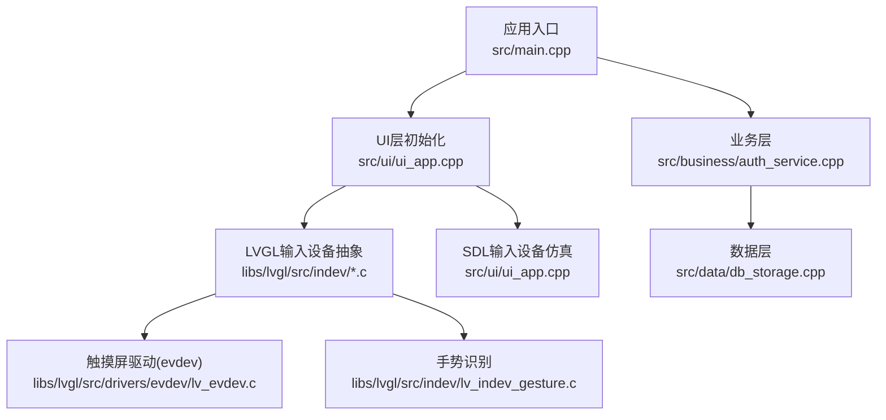
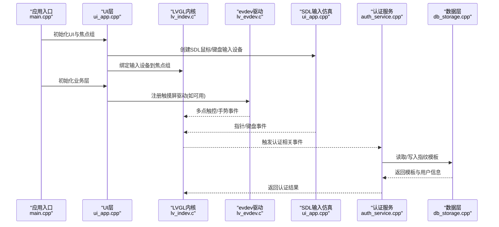
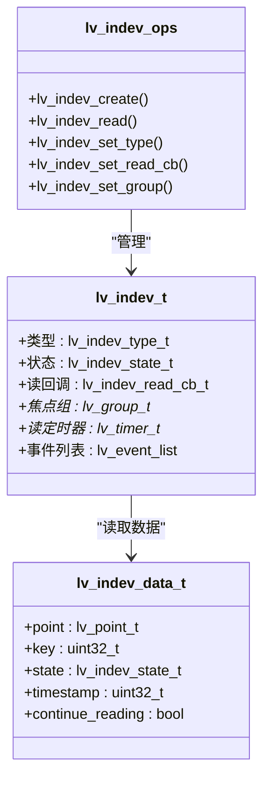
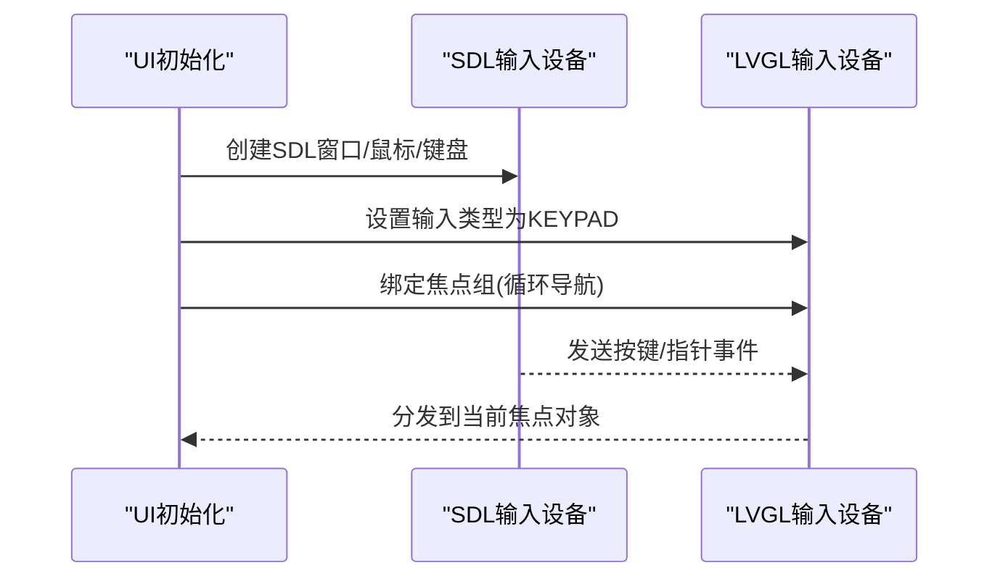
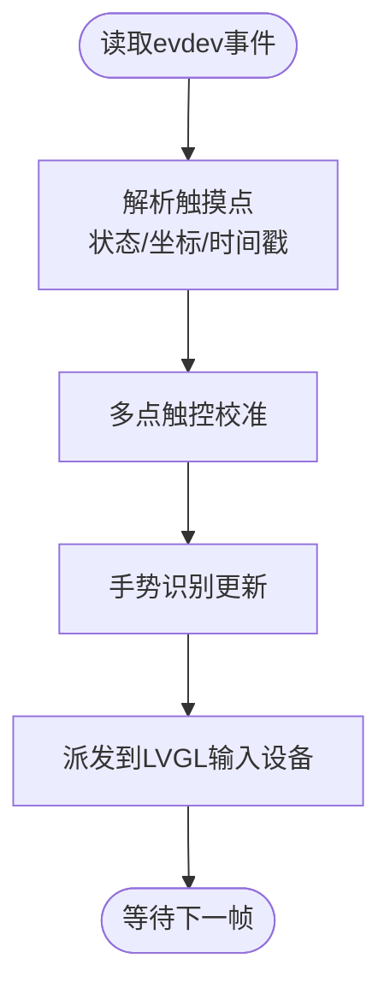
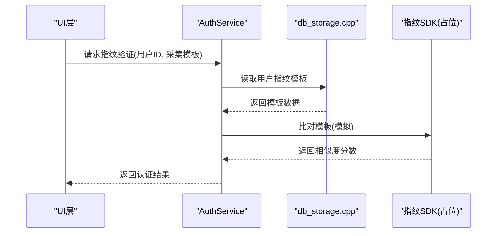
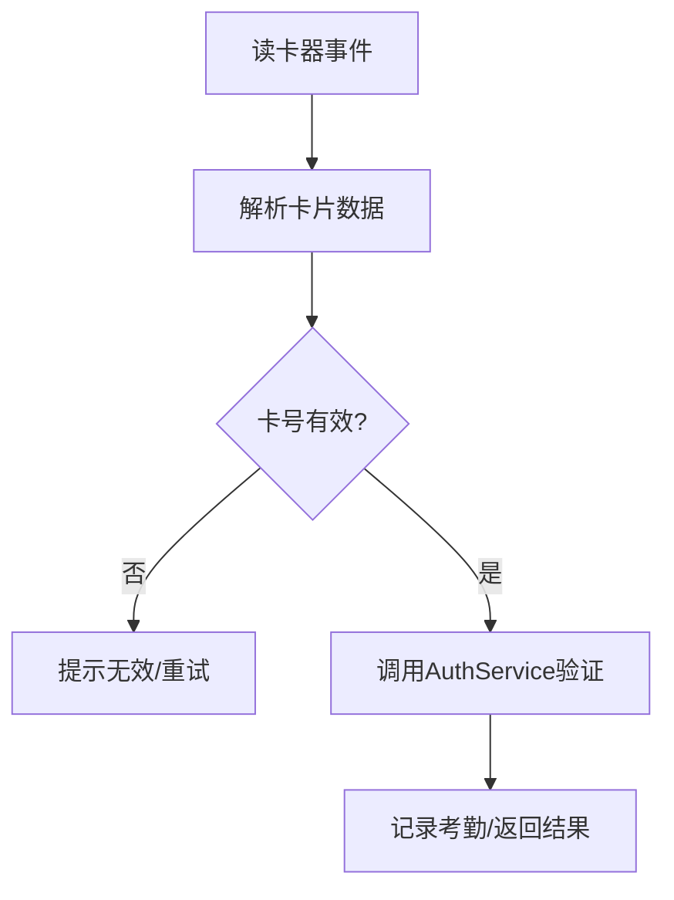
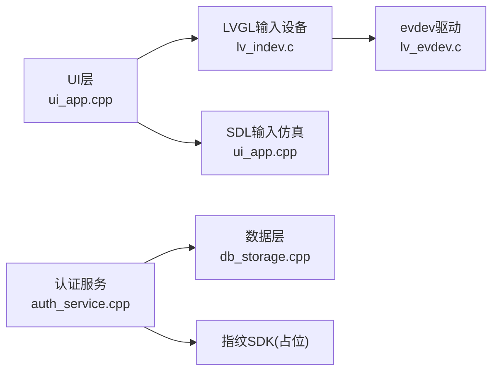

# 输入设备集成

<cite>
**本文引用的文件**
- [src/main.cpp](file://src/main.cpp)
- [src/ui/ui_app.h](file://src/ui/ui_app.h)
- [src/ui/ui_app.cpp](file://src/ui/ui_app.cpp)
- [libs/lvgl/src/indev/lv_indev.h](file://libs/lvgl/src/indev/lv_indev.h)
- [libs/lvgl/src/indev/lv_indev.c](file://libs/lvgl/src/indev/lv_indev.c)
- [libs/lvgl/src/indev/lv_indev_gesture.c](file://libs/lvgl/src/indev/lv_indev_gesture.c)
- [libs/lvgl/src/drivers/evdev/lv_evdev.c](file://libs/lvgl/src/drivers/evdev/lv_evdev.c)
- [src/business/auth_service.h](file://src/business/auth_service.h)
- [src/business/auth_service.cpp](file://src/business/auth_service.cpp)
- [src/data/db_storage.cpp](file://src/data/db_storage.cpp)
- [lv_conf.h](file://lv_conf.h)
- [src/ui/screens/sys_info/ui_scr_sys_info.cpp](file://src/ui/screens/sys_info/ui_scr_sys_info.cpp)
</cite>

## 目录
1. [简介](#简介)
2. [项目结构](#项目结构)
3. [核心组件](#核心组件)
4. [架构总览](#架构总览)
5. [详细组件分析](#详细组件分析)
6. [依赖关系分析](#依赖关系分析)
7. [性能考虑](#性能考虑)
8. [故障排查指南](#故障排查指南)
9. [结论](#结论)
10. [附录](#附录)

## 简介
本指南围绕智能考勤系统的输入设备集成展开，目标是帮助开发者在桌面仿真与嵌入式环境中完成以下任务：
- 指纹识别器集成：驱动安装、SDK对接、特征模板管理、认证流程。
- IC卡读卡器适配：不同协议（RFID、接触式IC卡）接口实现、卡片数据解析、认证算法集成。
- 触摸屏设备驱动：多点触控校准、压力感应、手势识别。
- 输入事件处理：LVGL输入设备抽象层使用、事件分发与处理流程。
- 硬件兼容性测试、性能调优与故障诊断。

本指南基于仓库现有代码与LVGL输入设备框架，结合业务层认证与数据层存储，给出可落地的集成步骤与最佳实践。

## 项目结构
项目采用分层架构：
- 应用入口与主循环：负责系统初始化、UI与业务初始化、主循环心跳。
- UI层：基于LVGL，使用SDL仿真显示与输入，管理焦点组与事件。
- 业务层：认证服务（密码/指纹）、考勤规则与记录。
- 数据层：SQLite存储、BLOB存取、并发控制与性能优化。

图表来源
- [src/main.cpp:187-246](file://src/main.cpp#L187-L246)
- [src/ui/ui_app.cpp:34-94](file://src/ui/ui_app.cpp#L34-L94)
- [libs/lvgl/src/indev/lv_indev.c:115-150](file://libs/lvgl/src/indev/lv_indev.c#L115-L150)
- [libs/lvgl/src/drivers/evdev/lv_evdev.c:266-289](file://libs/lvgl/src/drivers/evdev/lv_evdev.c#L266-L289)

章节来源
- [src/main.cpp:187-246](file://src/main.cpp#L187-L246)
- [src/ui/ui_app.cpp:34-94](file://src/ui/ui_app.cpp#L34-L94)

## 核心组件
- LVGL输入设备抽象层：定义输入类型、状态、读回调、事件分发等。
- SDL输入设备仿真：在桌面环境下模拟鼠标/键盘输入，绑定到LVGL焦点组。
- evdev触摸屏驱动：Linux输入子系统驱动，支持多点触控与手势识别。
- 认证服务：密码与指纹验证，指纹比对占位为SDK模拟。
- 数据层：SQLite + BLOB，指纹特征模板持久化，事务与并发控制。

章节来源
- [libs/lvgl/src/indev/lv_indev.h:29-76](file://libs/lvgl/src/indev/lv_indev.h#L29-L76)
- [libs/lvgl/src/indev/lv_indev.c:115-150](file://libs/lvgl/src/indev/lv_indev.c#L115-L150)
- [libs/lvgl/src/drivers/evdev/lv_evdev.c:266-289](file://libs/lvgl/src/drivers/evdev/lv_evdev.c#L266-L289)
- [src/business/auth_service.cpp:39-90](file://src/business/auth_service.cpp#L39-L90)
- [src/data/db_storage.cpp:206-221](file://src/data/db_storage.cpp#L206-L221)

## 架构总览
下图展示输入设备在系统中的位置与交互：

图表来源
- [src/main.cpp:213-225](file://src/main.cpp#L213-L225)
- [src/ui/ui_app.cpp:34-94](file://src/ui/ui_app.cpp#L34-L94)
- [libs/lvgl/src/indev/lv_indev.c:216-283](file://libs/lvgl/src/indev/lv_indev.c#L216-L283)
- [libs/lvgl/src/drivers/evdev/lv_evdev.c:266-289](file://libs/lvgl/src/drivers/evdev/lv_evdev.c#L266-L289)
- [src/business/auth_service.cpp:39-90](file://src/business/auth_service.cpp#L39-L90)
- [src/data/db_storage.cpp:206-221](file://src/data/db_storage.cpp#L206-L221)

## 详细组件分析

### LVGL输入设备抽象层
- 输入类型：指针、键盘、按钮、编码器。
- 读回调：驱动通过回调填充坐标、按键、状态与时间戳。
- 事件模型：定时轮询或事件驱动，支持长按、滚动、手势等。
- 焦点组：键盘输入绑定到焦点组，实现导航与选择。

图表来源
- [libs/lvgl/src/indev/lv_indev.h:29-76](file://libs/lvgl/src/indev/lv_indev.h#L29-L76)
- [libs/lvgl/src/indev/lv_indev.c:115-150](file://libs/lvgl/src/indev/lv_indev.c#L115-L150)

章节来源
- [libs/lvgl/src/indev/lv_indev.h:29-76](file://libs/lvgl/src/indev/lv_indev.h#L29-L76)
- [libs/lvgl/src/indev/lv_indev.c:177-283](file://libs/lvgl/src/indev/lv_indev.c#L177-L283)

### SDL输入设备仿真（桌面环境）
- 使用SDL创建窗口与输入设备（鼠标/键盘），在WSL2/PC环境下仿真。
- 将键盘输入类型设置为KEYPAD并绑定到UI焦点组，确保键盘导航可用。

图表来源
- [src/ui/ui_app.cpp:45-82](file://src/ui/ui_app.cpp#L45-L82)
- [libs/lvgl/src/indev/lv_indev.c:264-272](file://libs/lvgl/src/indev/lv_indev.c#L264-L272)

章节来源
- [src/ui/ui_app.cpp:34-94](file://src/ui/ui_app.cpp#L34-L94)

### evdev触摸屏驱动与多点触控
- 通过Linux evdev接口读取触摸事件，支持多点触控与校准。
- 将校准后的触摸点传递给手势识别器，支持捏合、旋转、双指滑动等。

图表来源
- [libs/lvgl/src/drivers/evdev/lv_evdev.c:266-289](file://libs/lvgl/src/drivers/evdev/lv_evdev.c#L266-L289)
- [libs/lvgl/src/indev/lv_indev_gesture.c:869-909](file://libs/lvgl/src/indev/lv_indev_gesture.c#L869-L909)

章节来源
- [libs/lvgl/src/drivers/evdev/lv_evdev.c:266-289](file://libs/lvgl/src/drivers/evdev/lv_evdev.c#L266-L289)

### 指纹识别器集成
- 特征模板管理：用户表新增fingerprint_data BLOB字段，用于存储指纹模板。
- 认证流程：AuthService提供verifyFingerprint，内部调用matchFingerprintTemplate进行比对。
- SDK对接：matchFingerprintTemplate为占位实现，需替换为厂商SDK调用。

图表来源
- [src/business/auth_service.cpp:39-90](file://src/business/auth_service.cpp#L39-L90)
- [src/data/db_storage.cpp:206-221](file://src/data/db_storage.cpp#L206-L221)

章节来源
- [src/business/auth_service.h:8-44](file://src/business/auth_service.h#L8-L44)
- [src/business/auth_service.cpp:39-90](file://src/business/auth_service.cpp#L39-L90)
- [src/data/db_storage.cpp:206-221](file://src/data/db_storage.cpp#L206-L221)

### IC卡读卡器适配方案
- 协议支持：RFID与接触式IC卡读卡器均可通过LVGL输入设备抽象接入。
- 接口实现：在业务层扩展读卡器驱动，解析卡片UID/扇区数据，映射到用户标识。
- 认证集成：将读卡器输出与AuthService结合，实现卡号认证与考勤记录。

[此图为概念流程，不对应具体源码文件]

### 触摸屏驱动开发（多点触控、压力、手势）
- 多点触控校准：在evdev驱动中对原始坐标进行校准，提高精度。
- 压力感应：若硬件支持，可在驱动层读取压力值并传递至LVGL。
- 手势识别：利用LVGL手势识别器，支持缩放、旋转、滑动等。

章节来源
- [libs/lvgl/src/drivers/evdev/lv_evdev.c:266-289](file://libs/lvgl/src/drivers/evdev/lv_evdev.c#L266-L289)
- [libs/lvgl/src/indev/lv_indev_gesture.c:140-195](file://libs/lvgl/src/indev/lv_indev_gesture.c#L140-L195)

### 输入事件处理机制（LVGL）
- 事件分发：lv_indev_read周期性读取设备，根据类型分派到指针/键盘/编码器处理器。
- 焦点导航：键盘事件绑定到焦点组，NEXT/PREV切换焦点。
- 长按/滚动/手势：通过状态机与计时器实现，支持滚动抛物线动画。

章节来源
- [libs/lvgl/src/indev/lv_indev.c:216-283](file://libs/lvgl/src/indev/lv_indev.c#L216-L283)
- [libs/lvgl/src/indev/lv_indev.c:754-800](file://libs/lvgl/src/indev/lv_indev.c#L754-L800)

## 依赖关系分析
- UI层依赖LVGL输入设备与SDL仿真。
- 业务层依赖数据层进行用户与模板读写。
- evdev驱动依赖Linux输入子系统，向上提供LVGL事件。
- 认证服务依赖SDK（占位）与数据库。

图表来源
- [src/ui/ui_app.cpp:34-94](file://src/ui/ui_app.cpp#L34-L94)
- [libs/lvgl/src/indev/lv_indev.c:115-150](file://libs/lvgl/src/indev/lv_indev.c#L115-L150)
- [libs/lvgl/src/drivers/evdev/lv_evdev.c:266-289](file://libs/lvgl/src/drivers/evdev/lv_evdev.c#L266-L289)
- [src/business/auth_service.cpp:39-90](file://src/business/auth_service.cpp#L39-L90)
- [src/data/db_storage.cpp:206-221](file://src/data/db_storage.cpp#L206-L221)

章节来源
- [src/ui/ui_app.cpp:34-94](file://src/ui/ui_app.cpp#L34-L94)
- [libs/lvgl/src/indev/lv_indev.c:115-150](file://libs/lvgl/src/indev/lv_indev.c#L115-L150)
- [libs/lvgl/src/drivers/evdev/lv_evdev.c:266-289](file://libs/lvgl/src/drivers/evdev/lv_evdev.c#L266-L289)
- [src/business/auth_service.cpp:39-90](file://src/business/auth_service.cpp#L39-L90)
- [src/data/db_storage.cpp:206-221](file://src/data/db_storage.cpp#L206-L221)

## 性能考虑
- LVGL配置：根据目标平台调整刷新周期、渲染缓冲与线程优先级。
- SQLite优化：WAL模式、NORMAL同步、内存临时表、缓存大小、外键约束。
- 并发控制：读写锁保护数据库访问，避免竞态。
- 事件处理：合理设置输入设备读取周期，避免过短导致CPU占用过高。

章节来源
- [lv_conf.h:90-110](file://lv_conf.h#L90-L110)
- [src/data/db_storage.cpp:148-160](file://src/data/db_storage.cpp#L148-L160)
- [libs/lvgl/src/indev/lv_indev.c:132-133](file://libs/lvgl/src/indev/lv_indev.c#L132-L133)

## 故障排查指南
- 指纹认证失败
  - 检查用户是否已录入指纹模板。
  - 确认matchFingerprintTemplate已替换为真实SDK调用。
  - 查看数据库指纹字段是否正确写入。
- 触摸屏无响应
  - 确认evdev设备节点权限与驱动加载。
  - 检查校准参数与分辨率设置。
- 键盘导航异常
  - 确认键盘输入类型设置为KEYPAD并绑定焦点组。
  - 检查焦点组循环导航配置。
- 数据库性能问题
  - 启用WAL模式与适当缓存。
  - 使用联合索引加速查询。

章节来源
- [src/business/auth_service.cpp:39-90](file://src/business/auth_service.cpp#L39-L90)
- [src/data/db_storage.cpp:206-221](file://src/data/db_storage.cpp#L206-L221)
- [libs/lvgl/src/drivers/evdev/lv_evdev.c:266-289](file://libs/lvgl/src/drivers/evdev/lv_evdev.c#L266-L289)
- [src/ui/ui_app.cpp:68-82](file://src/ui/ui_app.cpp#L68-L82)
- [src/data/db_storage.cpp:148-160](file://src/data/db_storage.cpp#L148-L160)

## 结论
本指南提供了从LVGL输入设备抽象到业务认证与数据存储的完整集成路径。针对指纹识别器、IC卡读卡器与触摸屏设备，建议：
- 指纹：完成SDK对接与模板持久化，完善比对阈值与日志。
- IC卡：扩展读卡器驱动与卡号映射，统一认证入口。
- 触摸屏：完善校准与压力处理，增强手势识别鲁棒性。
- 事件处理：结合LVGL事件模型与焦点组，确保交互一致性与可维护性。

[本节为总结性内容，不直接分析具体文件]

## 附录
- 系统统计界面展示了指纹与卡号注册数量，便于运维监控与容量评估。

章节来源
- [src/ui/screens/sys_info/ui_scr_sys_info.cpp:197-218](file://src/ui/screens/sys_info/ui_scr_sys_info.cpp#L197-L218)