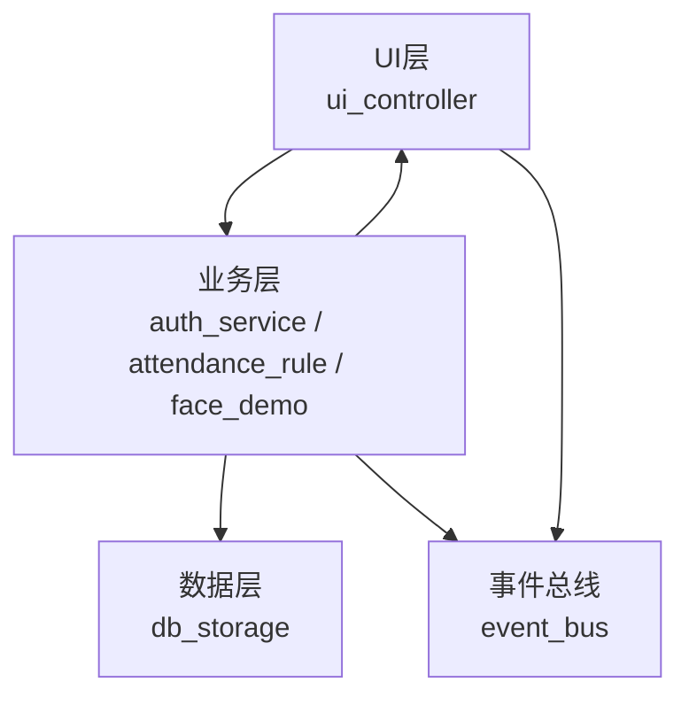
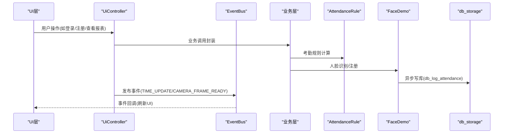
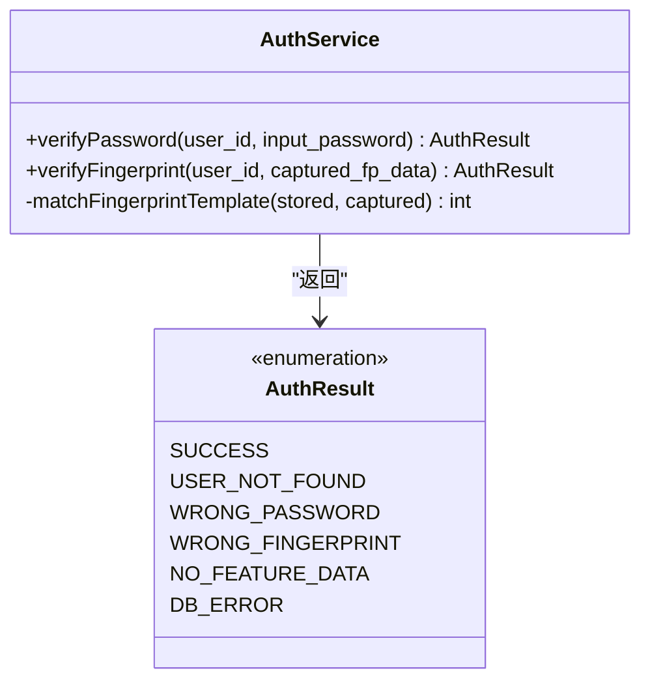
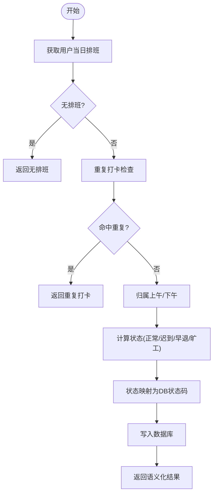
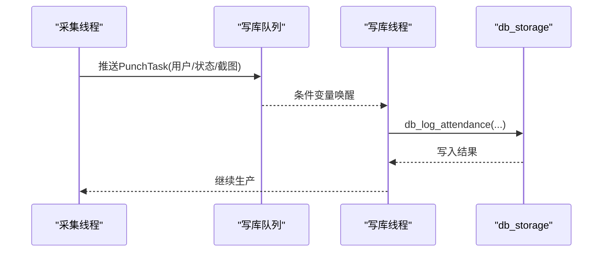
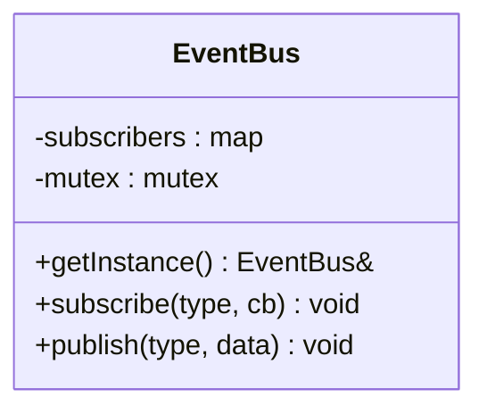
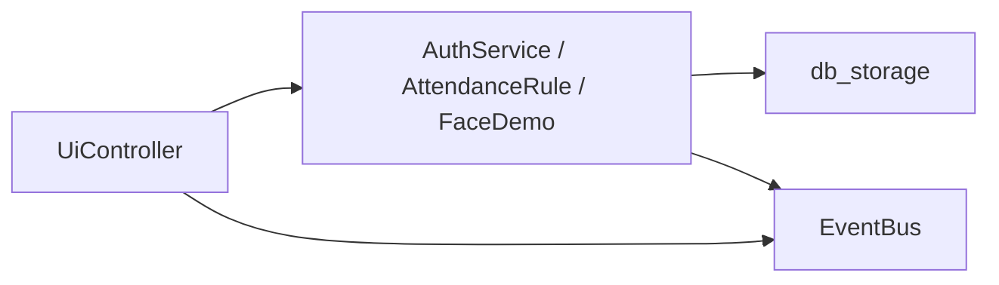

# 第三方服务集成

<cite>
**本文档引用的文件**
- [src/business/auth_service.h](file://src/business/auth_service.h)
- [src/business/auth_service.cpp](file://src/business/auth_service.cpp)
- [src/business/event_bus.h](file://src/business/event_bus.h)
- [src/business/event_bus.cpp](file://src/business/event_bus.cpp)
- [src/business/attendance_rule.h](file://src/business/attendance_rule.h)
- [src/business/attendance_rule.cpp](file://src/business/attendance_rule.cpp)
- [src/business/face_demo.h](file://src/business/face_demo.h)
- [src/business/face_demo.cpp](file://src/business/face_demo.cpp)
- [src/data/db_storage.cpp](file://src/data/db_storage.cpp)
- [src/ui/ui_controller.h](file://src/ui/ui_controller.h)
- [src/ui/ui_controller.cpp](file://src/ui/ui_controller.cpp)
</cite>

## 目录
1. [简介](#简介)
2. [项目结构](#项目结构)
3. [核心组件](#核心组件)
4. [架构总览](#架构总览)
5. [详细组件分析](#详细组件分析)
6. [依赖关系分析](#依赖关系分析)
7. [性能考量](#性能考量)
8. [故障排查指南](#故障排查指南)
9. [结论](#结论)
10. [附录](#附录)

## 简介
本指南面向需要将智能考勤系统与第三方服务对接的开发者，围绕以下目标提供可落地的集成方案：
- 云端数据同步：基于现有数据层接口，扩展远端同步能力（如设备配置、用户与考勤数据）。
- 远程配置管理：通过系统配置表实现远程下发与更新，支持规则、班次、节假日等。
- 用户认证服务：复用内置认证能力，扩展外部认证（如LDAP/SSO）的适配层。
- 邮件通知服务：在考勤事件发生时，通过异步队列投递通知，支持模板化与重试。
- 数据同步服务：离线数据处理、冲突解决与网络异常处理策略。
- API网关设计：RESTful封装、认证授权、请求限流与错误处理。

本指南以仓库现有代码为依据，给出对接思路、接口映射与最佳实践，帮助快速完成第三方服务集成。

## 项目结构
系统采用清晰的分层架构：
- UI层：负责展示与交互，通过控制器封装业务调用。
- 业务层：包含认证、规则引擎、人脸识别与异步写库等核心逻辑。
- 数据层：封装SQLite访问、表结构与事务，提供统一的数据接口。
- 事件总线：跨模块解耦的事件发布/订阅机制。

图表来源
- [src/ui/ui_controller.h](file://src/ui/ui_controller.h)
- [src/business/auth_service.h](file://src/business/auth_service.h)
- [src/business/attendance_rule.h](file://src/business/attendance_rule.h)
- [src/business/face_demo.h](file://src/business/face_demo.h)
- [src/data/db_storage.cpp](file://src/data/db_storage.cpp)
- [src/business/event_bus.h](file://src/business/event_bus.h)

章节来源
- [src/ui/ui_controller.h](file://src/ui/ui_controller.h)
- [src/business/auth_service.h](file://src/business/auth_service.h)
- [src/business/attendance_rule.h](file://src/business/attendance_rule.h)
- [src/business/face_demo.h](file://src/business/face_demo.h)
- [src/data/db_storage.cpp](file://src/data/db_storage.cpp)
- [src/business/event_bus.h](file://src/business/event_bus.h)

## 核心组件
- 认证服务：提供密码与指纹验证，返回标准化结果枚举，便于与外部认证系统对接。
- 考勤规则引擎：负责打卡归属、状态计算与重复打卡防护，输出语义化结果。
- 人脸识别与异步写库：后台线程采集、识别与落库，使用队列与条件变量解耦生产者与消费者。
- 数据层：统一的SQLite访问层，提供CRUD与事务接口，支持预编译语句与并发控制。
- 事件总线：线程安全的事件发布/订阅，支撑UI与业务模块解耦。

章节来源
- [src/business/auth_service.h](file://src/business/auth_service.h)
- [src/business/attendance_rule.h](file://src/business/attendance_rule.h)
- [src/business/face_demo.h](file://src/business/face_demo.h)
- [src/data/db_storage.cpp](file://src/data/db_storage.cpp)
- [src/business/event_bus.h](file://src/business/event_bus.h)

## 架构总览
下图展示了从UI到业务、再到数据层的整体调用链路，以及事件总线在其中的解耦作用。

图表来源
- [src/ui/ui_controller.cpp](file://src/ui/ui_controller.cpp)
- [src/business/attendance_rule.cpp](file://src/business/attendance_rule.cpp)
- [src/business/face_demo.cpp](file://src/business/face_demo.cpp)
- [src/data/db_storage.cpp](file://src/data/db_storage.cpp)
- [src/business/event_bus.cpp](file://src/business/event_bus.cpp)

## 详细组件分析

### 组件A：认证服务与外部认证适配
- 功能要点
  - 密码验证与指纹验证，返回统一结果枚举。
  - 指纹比对为占位实现，需替换为真实SDK。
- 集成建议
  - 将外部认证（LDAP/SSO）封装为统一接口，返回与内部相同的枚举，保证上层一致处理。
  - 在认证成功后，调用考勤规则引擎记录考勤。

图表来源
- [src/business/auth_service.h](file://src/business/auth_service.h)
- [src/business/auth_service.cpp](file://src/business/auth_service.cpp)

章节来源
- [src/business/auth_service.h](file://src/business/auth_service.h)
- [src/business/auth_service.cpp](file://src/business/auth_service.cpp)

### 组件B：考勤规则引擎与重复打卡防护
- 功能要点
  - 将“上午/下午”班次归属与“折中原则”结合，计算迟到/早退/旷工。
  - 防重复打卡：基于全局规则的重复打卡限制窗口。
  - 写库：将状态映射为数据库状态码并落库。
- 集成建议
  - 将规则下发与合并策略抽象为远程配置接口，与本地规则表协同。
  - 将“周末是否上班”等节点K规则纳入远程配置项。

图表来源
- [src/business/attendance_rule.cpp](file://src/business/attendance_rule.cpp)

章节来源
- [src/business/attendance_rule.h](file://src/business/attendance_rule.h)
- [src/business/attendance_rule.cpp](file://src/business/attendance_rule.cpp)

### 组件C：人脸识别与异步写库队列
- 功能要点
  - 后台线程持续采集/识别，使用队列与条件变量解耦。
  - 写库线程串行落库，避免SQLite多线程竞争。
  - UI显示帧缓存与限流，保证流畅性。
- 集成建议
  - 将识别结果与考勤事件解耦，通过事件总线通知UI与业务。
  - 队列容量与溢出策略需结合设备性能与网络状况评估。

图表来源
- [src/business/face_demo.cpp](file://src/business/face_demo.cpp)
- [src/data/db_storage.cpp](file://src/data/db_storage.cpp)

章节来源
- [src/business/face_demo.h](file://src/business/face_demo.h)
- [src/business/face_demo.cpp](file://src/business/face_demo.cpp)
- [src/data/db_storage.cpp](file://src/data/db_storage.cpp)

### 组件D：事件总线与UI联动
- 功能要点
  - 线程安全的订阅/发布，支持时间更新、磁盘状态、摄像头帧就绪等事件。
  - UI通过事件驱动刷新显示，降低耦合。
- 集成建议
  - 将远程配置变更、设备状态变化等事件通过事件总线广播，驱动UI与业务刷新。

图表来源
- [src/business/event_bus.h](file://src/business/event_bus.h)
- [src/business/event_bus.cpp](file://src/business/event_bus.cpp)

章节来源
- [src/business/event_bus.h](file://src/business/event_bus.h)
- [src/business/event_bus.cpp](file://src/business/event_bus.cpp)

### 组件E：数据层与远程同步接口
- 功能要点
  - SQLite封装、预编译语句、读写锁、索引与事务。
  - 提供用户、考勤、班次、节假日、系统配置等表的CRUD。
- 集成建议
  - 将远程同步抽象为“增量拉取/批量推送”，结合本地版本号与冲突解决策略。
  - 对大体量数据采用分页与增量策略，避免阻塞主线程。

章节来源
- [src/data/db_storage.cpp](file://src/data/db_storage.cpp)

## 依赖关系分析
- UI层依赖业务层与数据层接口，通过控制器封装调用。
- 业务层依赖数据层与事件总线，规则引擎与人脸识别模块相互协作。
- 数据层依赖SQLite与OpenCV，提供统一的访问接口。
- 事件总线为跨模块解耦的关键基础设施。

图表来源
- [src/ui/ui_controller.h](file://src/ui/ui_controller.h)
- [src/business/auth_service.h](file://src/business/auth_service.h)
- [src/business/attendance_rule.h](file://src/business/attendance_rule.h)
- [src/business/face_demo.h](file://src/business/face_demo.h)
- [src/data/db_storage.cpp](file://src/data/db_storage.cpp)
- [src/business/event_bus.h](file://src/business/event_bus.h)

章节来源
- [src/ui/ui_controller.h](file://src/ui/ui_controller.h)
- [src/business/auth_service.h](file://src/business/auth_service.h)
- [src/business/attendance_rule.h](file://src/business/attendance_rule.h)
- [src/business/face_demo.h](file://src/business/face_demo.h)
- [src/data/db_storage.cpp](file://src/data/db_storage.cpp)
- [src/business/event_bus.h](file://src/business/event_bus.h)

## 性能考量
- 线程与锁
  - 读写锁分离，读多写少场景提升并发性能。
  - 队列与条件变量解耦生产者与消费者，避免阻塞UI。
- 预编译语句
  - 高频写入使用预编译语句，减少SQL解析开销。
- I/O与缓存
  - UI帧缓存与限流，避免频繁拷贝与过度刷新。
  - 识别冷却时间与业务防抖，降低重复写库压力。

章节来源
- [src/data/db_storage.cpp](file://src/data/db_storage.cpp)
- [src/business/face_demo.cpp](file://src/business/face_demo.cpp)

## 故障排查指南
- 认证失败
  - 检查用户是否存在与密码/指纹是否录入。
  - 指纹比对为占位实现，需替换为真实SDK。
- 考勤重复
  - 检查全局重复打卡限制与业务防抖缓存。
- 写库异常
  - 检查写库线程状态与队列长度，关注溢出与异常捕获。
- 事件未触发
  - 确认订阅关系与事件发布时机，检查线程安全与锁范围。

章节来源
- [src/business/auth_service.cpp](file://src/business/auth_service.cpp)
- [src/business/attendance_rule.cpp](file://src/business/attendance_rule.cpp)
- [src/business/face_demo.cpp](file://src/business/face_demo.cpp)
- [src/business/event_bus.cpp](file://src/business/event_bus.cpp)

## 结论
通过现有分层架构与接口，系统具备良好的扩展性。第三方服务集成可围绕“认证适配、规则与配置下发、异步通知与写库、事件总线与UI联动”展开，遵循“解耦、异步、幂等、可观测”的原则，确保稳定性与可维护性。

## 附录

### A. 云端数据同步与远程配置管理
- 远程配置管理
  - 使用系统配置表（Key-Value）承载远程下发的规则与开关。
  - 业务层在启动与事件触发时读取配置，动态刷新行为。
- 云端同步策略
  - 增量拉取：基于版本号/时间戳，仅同步变更。
  - 批量推送：将本地变更聚合后推送，支持重试与幂等。
  - 冲突解决：优先级策略（如“远端覆盖本地”或“合并策略”）。
- 网络异常处理
  - 断线重连与指数退避。
  - 本地缓存与离线队列，网络恢复后补传。

章节来源
- [src/data/db_storage.cpp](file://src/data/db_storage.cpp)

### B. 邮件通知服务实现
- 接口设计
  - 通知投递接口：接收事件类型、收件人、模板参数，返回投递结果。
  - 模板管理：模板存储与版本控制，支持参数注入与本地化。
  - 发送队列：异步队列+重试机制，保障可靠性。
- 集成步骤
  - 在考勤事件（如迟到/早退/异常）发生时，调用通知接口。
  - 模板参数从用户与考勤记录中抽取，拼装邮件正文。
  - 失败重试与超时控制，记录日志便于追踪。

章节来源
- [src/business/attendance_rule.cpp](file://src/business/attendance_rule.cpp)
- [src/business/event_bus.cpp](file://src/business/event_bus.cpp)

### C.API网关设计
- RESTful封装
  - 资源与动作：用户/班次/考勤/配置等资源的CRUD。
  - 请求/响应：统一的错误码与消息结构。
- 认证授权
  - 基于令牌的认证（如JWT），路由级鉴权。
  - 角色权限控制（管理员/普通用户）。
- 请求限流与错误处理
  - 限流策略：令牌桶/滑动窗口，避免突发流量。
  - 错误处理：结构化错误码、上下文信息与重试建议。

章节来源
- [src/ui/ui_controller.h](file://src/ui/ui_controller.h)
- [src/ui/ui_controller.cpp](file://src/ui/ui_controller.cpp)