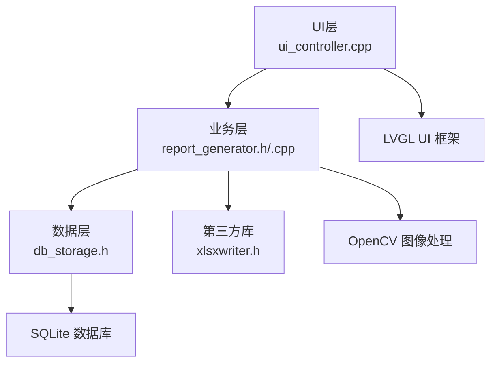
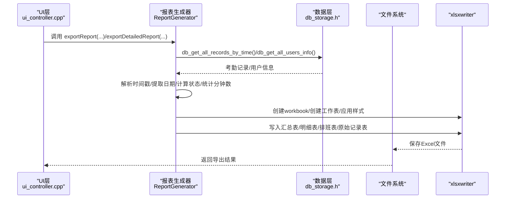
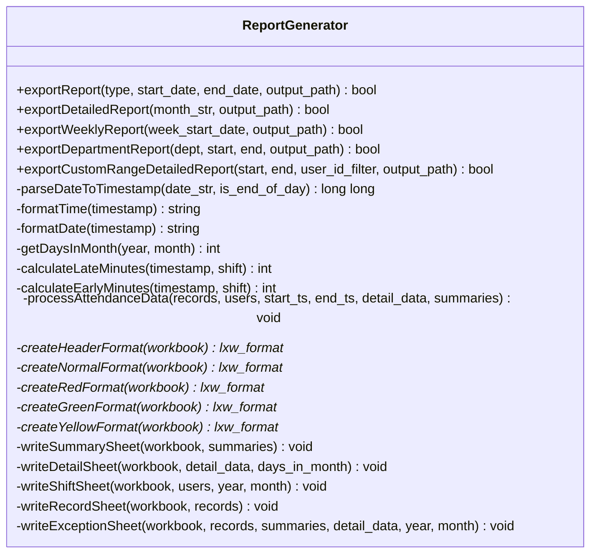
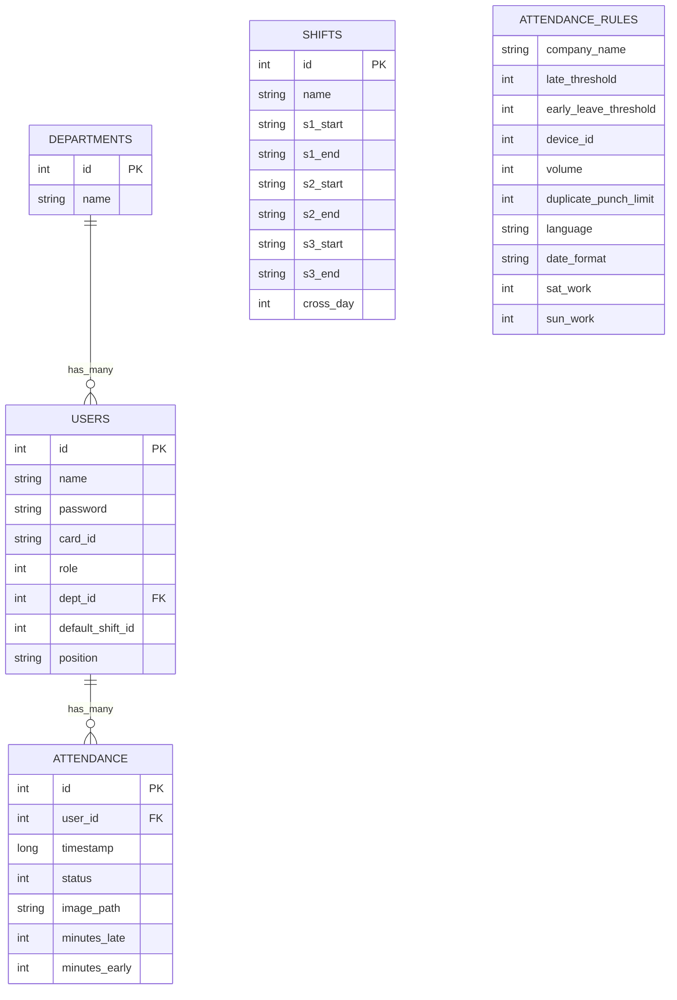
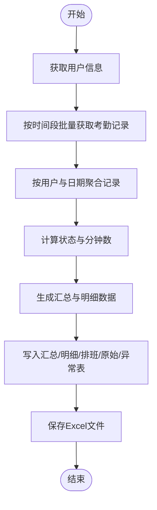
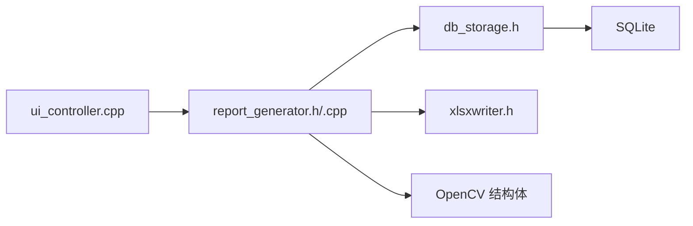

# 报表生成系统

<cite>
**本文引用的文件**
- [report_generator.h](file://src/business/report_generator.h)
- [report_generator.cpp](file://src/business/report_generator.cpp)
- [db_storage.h](file://src/data/db_storage.h)
- [attendance_rule.h](file://src/business/attendance_rule.h)
- [ui_controller.cpp](file://src/ui/ui_controller.cpp)
- [main.cpp](file://src/main.cpp)
</cite>

## 目录
1. [简介](#简介)
2. [项目结构](#项目结构)
3. [核心组件](#核心组件)
4. [架构总览](#架构总览)
5. [详细组件分析](#详细组件分析)
6. [依赖关系分析](#依赖关系分析)
7. [性能考量](#性能考量)
8. [故障排查指南](#故障排查指南)
9. [结论](#结论)
10. [附录](#附录)

## 简介
本技术文档面向SmartAttendance报表生成系统，聚焦Excel报表的生成机制、xlsxwriter库的使用、数据导出流程与格式化处理、考勤统计算法与数据聚合、报表模板设计、触发机制与异步处理、性能优化策略、API接口说明、参数配置、输出格式、模板定制与样式设置、国际化支持，以及数据来源、处理流程与质量保证机制。文档旨在帮助开发者与运维人员全面理解系统实现与扩展点。

## 项目结构
SmartAttendance采用分层架构：UI层负责交互与触发，业务层封装核心业务逻辑（含报表生成），数据层负责数据库访问与DAO接口，底层依赖OpenCV、SQLite与xlsxwriter等第三方库。报表生成位于业务层，通过数据层提供的DAO接口获取考勤记录与用户信息，使用xlsxwriter生成Excel文件。

图表来源
- [ui_controller.cpp:189-209](file://src/ui/ui_controller.cpp#L189-L209)
- [report_generator.h:33-221](file://src/business/report_generator.h#L33-L221)
- [db_storage.h:187-596](file://src/data/db_storage.h#L187-L596)

章节来源
- [main.cpp:187-246](file://src/main.cpp#L187-L246)
- [ui_controller.cpp:189-209](file://src/ui/ui_controller.cpp#L189-L209)
- [report_generator.h:33-221](file://src/business/report_generator.h#L33-L221)
- [db_storage.h:187-596](file://src/data/db_storage.h#L187-L596)

## 核心组件
- 报表生成器（ReportGenerator）
  - 负责导出多种报表类型（汇总、异常、员工信息、周报、部门），并基于xlsxwriter生成Excel工作簿。
  - 提供时间范围解析、样式创建、数据聚合与写入工作表的完整流程。
- 数据层（db_storage.h）
  - 提供用户、部门、班次、考勤记录、系统配置等DAO接口，支持批量查询与事务接口，为报表提供数据源。
- 考勤规则引擎（attendance_rule.h）
  - 定义打卡状态与计算逻辑，为报表统计提供语义一致的考勤状态与分钟数。
- UI控制器（ui_controller.cpp）
  - 提供报表导出的触发入口，组织时间范围与输出路径，并调用报表生成器。

章节来源
- [report_generator.h:15-221](file://src/business/report_generator.h#L15-L221)
- [db_storage.h:187-596](file://src/data/db_storage.h#L187-L596)
- [attendance_rule.h:43-92](file://src/business/attendance_rule.h#L43-L92)
- [ui_controller.cpp:189-209](file://src/ui/ui_controller.cpp#L189-L209)

## 架构总览
报表生成从UI触发，经业务层解析时间范围与报表类型，调用数据层DAO批量获取所需数据，随后在业务层完成数据聚合与统计，最终使用xlsxwriter写入Excel工作簿并保存到指定路径。

图表来源
- [ui_controller.cpp:189-209](file://src/ui/ui_controller.cpp#L189-L209)
- [report_generator.h:100-134](file://src/business/report_generator.h#L100-L134)
- [report_generator.cpp:684-765](file://src/business/report_generator.cpp#L684-L765)
- [db_storage.h:580-596](file://src/data/db_storage.h#L580-L596)

## 详细组件分析

### 报表生成器（ReportGenerator）
- 报表类型与接口
  - 支持汇总表、异常统计、员工信息、周报、部门报表等多种类型导出。
  - 提供自定义时间段详细报表与按工号筛选的导出能力。
- 数据结构
  - 日常汇总、每日单元格数据、月度汇总等结构体承载统计字段与状态。
- 核心流程
  - 时间处理：将“YYYY-MM-DD”解析为时间戳，格式化时间与日期，计算当月天数与日期提取。
  - 数据聚合：按用户与日期聚合考勤记录，计算迟到/早退分钟数，确定最终状态。
  - 样式与写表：创建标题、常规、异常颜色等格式，分别写入汇总表与明细表。
- Excel写入
  - 使用xlsxwriter创建工作簿与工作表，应用格式，逐行写入数据。
  - 提供写入排班表、原始记录表、异常统计表等辅助方法。

图表来源
- [report_generator.h:33-221](file://src/business/report_generator.h#L33-L221)

章节来源
- [report_generator.h:15-221](file://src/business/report_generator.h#L15-L221)
- [report_generator.cpp:684-765](file://src/business/report_generator.cpp#L684-L765)
- [report_generator.cpp:406-440](file://src/business/report_generator.cpp#L406-L440)

### 数据层（db_storage.h）
- 数据结构
  - 用户、部门、班次、考勤记录、系统规则、定时响铃等结构体，支撑报表所需字段。
- DAO接口
  - 提供批量获取考勤记录（按时间段）、批量获取用户信息、按部门获取用户、获取系统配置等接口。
  - 提供事务接口与清理接口，保障批量导出的性能与一致性。
- 报表辅助查询
  - 提供按时间段批量获取全公司打卡记录，避免N+1查询问题，提升报表生成效率。

图表来源
- [db_storage.h:18-176](file://src/data/db_storage.h#L18-L176)

章节来源
- [db_storage.h:187-596](file://src/data/db_storage.h#L187-L596)

### 考勤规则引擎（attendance_rule.h）
- 打卡状态与计算
  - 定义打卡状态枚举与结果详情结构体，提供计算打卡状态、判断班次归属、比较状态优劣等静态方法。
- 与报表的关系
  - 报表统计依赖规则引擎的语义结果（迟到/早退/旷工/无排班），确保报表状态与业务一致。

章节来源
- [attendance_rule.h:8-92](file://src/business/attendance_rule.h#L8-L92)

### UI控制器（ui_controller.cpp）
- 报表导出触发
  - 提供导出到USB模拟目录的汇总报表、自定义时间段详细报表、个人报表等接口。
  - 组织输出目录与文件命名，调用报表生成器并返回结果给UI层。

章节来源
- [ui_controller.cpp:189-209](file://src/ui/ui_controller.cpp#L189-L209)
- [ui_controller.cpp:292-317](file://src/ui/ui_controller.cpp#L292-L317)

### 报表模板与样式设计
- 工作表结构
  - 汇总表：按用户维度展示正常天数、迟到次数与分钟数、早退次数与分钟数、旷工天数、未排班天数等。
  - 明细表：按日期与用户展示上下班打卡时间、状态、迟到/早退分钟数、最终状态与异常标记。
  - 排班表：展示用户当月排班信息。
  - 原始记录表：展示原始打卡记录。
  - 异常统计表：结合明细与汇总统计异常情况。
- 样式与颜色
  - 标题格式、常规格式、异常颜色（红/绿/黄）等格式，用于突出异常与关键指标。
- 模板定制
  - 可通过xlsxwriter格式对象设置字体、对齐、边框、背景色等，满足不同企业风格需求。
  - 可增加多语言标签与日期格式化，配合系统规则中的语言与日期格式配置实现国际化。

章节来源
- [report_generator.h:136-155](file://src/business/report_generator.h#L136-L155)
- [report_generator.cpp:406-440](file://src/business/report_generator.cpp#L406-L440)
- [report_generator.cpp:684-765](file://src/business/report_generator.cpp#L684-L765)

### 报表生成流程与算法
- 数据获取
  - 使用数据层批量查询接口获取时间段内全公司考勤记录与用户信息，避免多次查询带来的性能损耗。
- 数据聚合
  - 以用户与日期为键聚合记录，计算每日最早打卡与最晚打卡，依据班次与规则计算迟到/早退分钟数，确定最终状态。
- 统计逻辑
  - 汇总表统计正常天数、迟到/早退次数与累计分钟数、旷工天数、未排班天数等。
- 写表流程
  - 先写入标题与表头，再逐行写入数据，应用对应格式，最后保存文件。

图表来源
- [db_storage.h:580-596](file://src/data/db_storage.h#L580-L596)
- [report_generator.h:205-218](file://src/business/report_generator.h#L205-L218)
- [report_generator.cpp:684-765](file://src/business/report_generator.cpp#L684-L765)

## 依赖关系分析
- ReportGenerator依赖xlsxwriter进行Excel写入，依赖db_storage.h进行数据访问，依赖OpenCV结构体（如cv::Mat）参与业务流程（非报表直接依赖）。
- UI层通过UiController触发报表生成，组织输出路径与时间范围。
- 数据层提供DAO接口与事务支持，保障批量导出的性能与一致性。

图表来源
- [report_generator.h:12-13](file://src/business/report_generator.h#L12-L13)
- [db_storage.h:10-14](file://src/data/db_storage.h#L10-L14)
- [ui_controller.cpp:189-209](file://src/ui/ui_controller.cpp#L189-L209)

章节来源
- [report_generator.h:12-13](file://src/business/report_generator.h#L12-L13)
- [db_storage.h:10-14](file://src/data/db_storage.h#L10-L14)
- [ui_controller.cpp:189-209](file://src/ui/ui_controller.cpp#L189-L209)

## 性能考量
- 批量查询
  - 使用数据层提供的批量查询接口，避免N+1查询，显著降低数据库压力。
- 事务处理
  - 在批量导入/同步等场景使用事务接口，减少写入开销，提高吞吐。
- 内存与队列
  - 业务层对写库队列进行容量限制与丢弃策略，防止内存耗尽导致系统崩溃。
- 文件I/O
  - 报表生成完成后一次性写入文件，避免频繁I/O操作。
- 并发与异步
  - UI层可将报表导出置于后台线程执行，避免阻塞主线程，提升用户体验。

章节来源
- [db_storage.h:463-474](file://src/data/db_storage.h#L463-L474)
- [face_demo.cpp:935-951](file://src/business/face_demo.cpp#L935-L951)
- [ui_controller.cpp:362-374](file://src/ui/ui_controller.cpp#L362-L374)

## 故障排查指南
- 导出失败
  - 检查输出路径是否存在且具备写权限；确认xlsxwriter库正确链接；核对时间范围格式与边界。
- 数据缺失
  - 确认数据层DAO接口调用成功，批量查询接口返回非空；检查数据库连接与表结构。
- 样式异常
  - 检查格式创建与应用顺序，确保在写入数据前已创建并应用格式。
- 性能问题
  - 使用批量查询与事务接口；避免在报表生成过程中进行额外的网络或磁盘I/O；必要时将导出置于后台线程。

章节来源
- [report_generator.cpp:406-440](file://src/business/report_generator.cpp#L406-L440)
- [db_storage.h:580-596](file://src/data/db_storage.h#L580-L596)

## 结论
SmartAttendance报表生成系统通过清晰的分层设计与高效的批量查询，实现了从考勤数据到Excel报表的自动化生成。ReportGenerator封装了完整的数据聚合与写表流程，结合xlsxwriter提供了灵活的样式与模板定制能力。配合UI层的触发与后台线程，系统在保证性能的同时，满足了多类型报表的多样化需求。未来可在国际化与模板库方面进一步增强，以适配更多企业场景。

## 附录

### API接口文档
- 汇总报表导出
  - 参数：报表类型、起始日期、结束日期、输出路径
  - 返回：布尔值（成功/失败）
- 月度详细报表导出
  - 参数：月份字符串、输出路径
  - 返回：布尔值
- 周报表导出
  - 参数：周起始日期、输出路径
  - 返回：布尔值
- 部门报表导出
  - 参数：部门名称、起始日期、结束日期、输出路径
  - 返回：布尔值
- 自定义时间段详细报表导出
  - 参数：起始日期、结束日期、工号筛选（-1表示全员）、输出路径
  - 返回：布尔值

章节来源
- [report_generator.h:100-134](file://src/business/report_generator.h#L100-L134)

### 输出格式说明
- 文件格式：Excel（xlsx）
- 工作表：汇总表、明细表、排班表、原始记录表、异常统计表
- 样式：标题、常规、异常（红/绿/黄）等格式

章节来源
- [report_generator.h:136-155](file://src/business/report_generator.h#L136-L155)
- [report_generator.cpp:684-765](file://src/business/report_generator.cpp#L684-L765)

### 国际化与模板定制
- 国际化
  - 系统规则中包含语言与日期格式配置，可用于报表中的日期与标签本地化。
- 模板定制
  - 通过xlsxwriter格式对象设置字体、对齐、边框、背景色等，满足企业风格需求。

章节来源
- [db_storage.h:59-86](file://src/data/db_storage.h#L59-L86)
- [report_generator.cpp:406-440](file://src/business/report_generator.cpp#L406-L440)