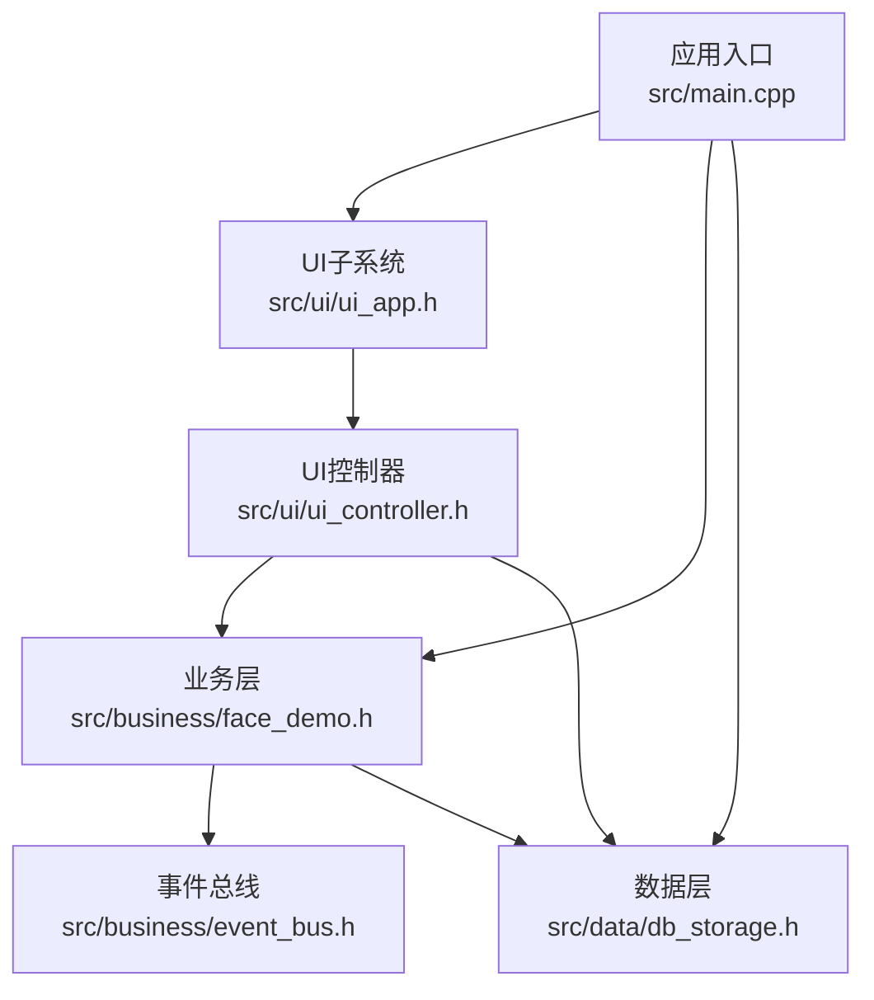
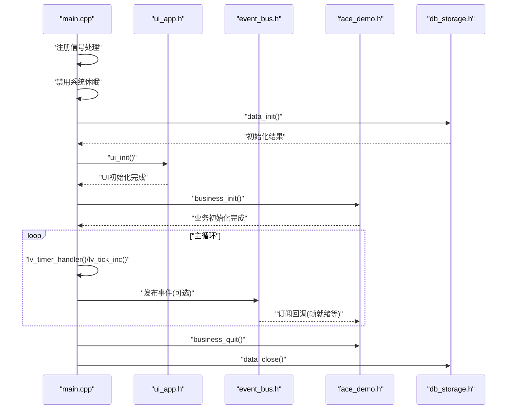
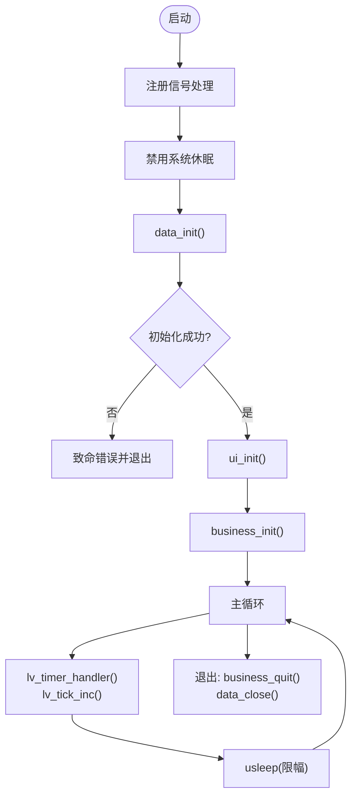
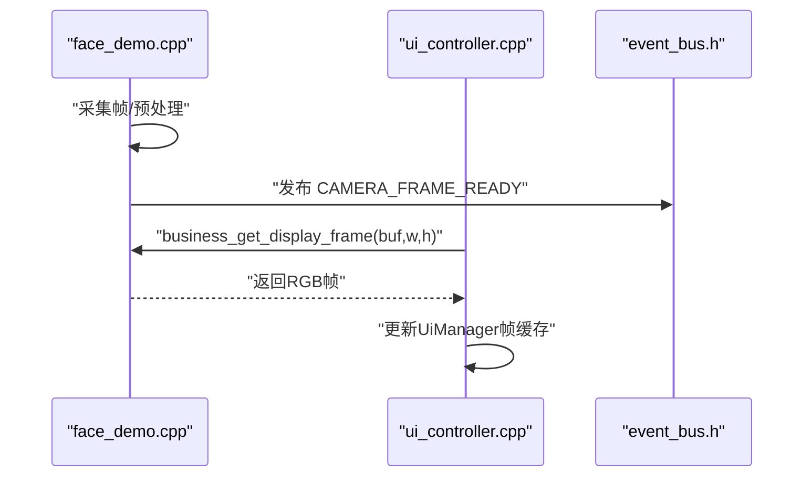
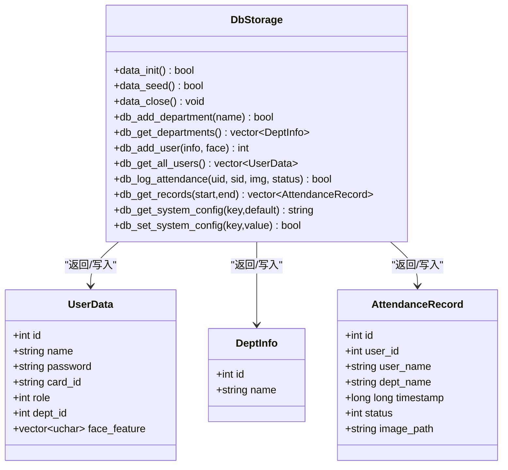
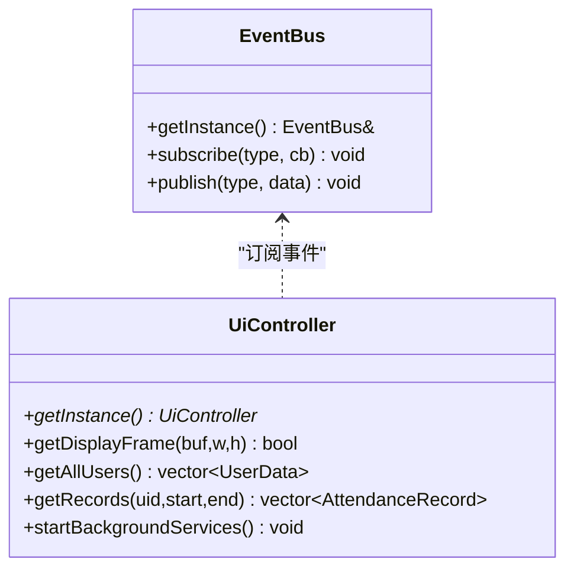
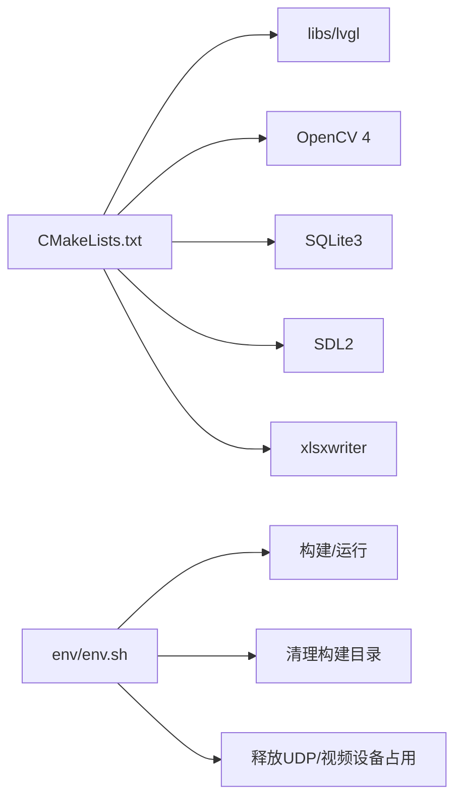

# 故障排除

<cite>
**本文档引用的文件**
- [CMakeLists.txt](file://CMakeLists.txt)
- [main.cpp](file://src/main.cpp)
- [env.sh](file://env/env.sh)
- [ui_app.h](file://src/ui/ui_app.h)
- [db_storage.h](file://src/data/db_storage.h)
- [face_demo.h](file://src/business/face_demo.h)
- [event_bus.h](file://src/business/event_bus.h)
- [ui_controller.h](file://src/ui/ui_controller.h)
- [face_demo.cpp](file://src/business/face_demo.cpp)
- [ui_controller.cpp](file://src/ui/ui_controller.cpp)
</cite>

## 目录
1. [简介](#简介)
2. [项目结构](#项目结构)
3. [核心组件](#核心组件)
4. [架构总览](#架构总览)
5. [详细组件分析](#详细组件分析)
6. [依赖关系分析](#依赖关系分析)
7. [性能考虑](#性能考虑)
8. [故障排除指南](#故障排除指南)
9. [结论](#结论)
10. [附录](#附录)

## 简介
本指南面向SmartAttendance系统的运维与开发人员，提供系统化的故障排查流程、常见问题定位与解决方法，涵盖编译错误、运行时异常、性能问题、日志分析、错误追踪、断点设置、内存泄漏检测、紧急处理预案与预防措施。文档同时给出调试环境配置、工具使用建议与社区支持资源。

## 项目结构
SmartAttendance采用分层架构：应用入口负责初始化与主循环；UI层基于LVGL；业务层集成OpenCV进行人脸识别与视频流处理；数据层基于SQLite3并提供DAO接口；事件总线实现UI与业务层解耦。

**图表来源**
- [main.cpp:187-246](file://src/main.cpp#L187-L246)
- [ui_app.h:12](file://src/ui/ui_app.h#L12)
- [face_demo.h:40](file://src/business/face_demo.h#L40)
- [db_storage.h:195](file://src/data/db_storage.h#L195)
- [event_bus.h:21-39](file://src/business/event_bus.h#L21-L39)
- [ui_controller.h:21-104](file://src/ui/ui_controller.h#L21-L104)

**章节来源**
- [CMakeLists.txt:84-110](file://CMakeLists.txt#L84-L110)
- [main.cpp:187-246](file://src/main.cpp#L187-L246)

## 核心组件
- 应用入口与主循环：负责系统初始化顺序、信号处理、LVGL心跳与退出清理。
- UI子系统：负责HAL初始化、输入设备配置、管理器启动与主页加载。
- 业务层：封装OpenCV人脸检测/识别、视频流采集、预处理配置、注册与识别流程。
- 数据层：提供DAO接口（部门、班次、用户、考勤记录、系统配置等），支持播种与事务。
- 事件总线：线程安全的发布/订阅机制，驱动UI与业务层解耦。
- UI控制器：封装UI与业务/数据层交互，提供后台线程与线程安全的数据缓存。

**章节来源**
- [main.cpp:187-246](file://src/main.cpp#L187-L246)
- [ui_app.h:12](file://src/ui/ui_app.h#L12)
- [face_demo.h:40](file://src/business/face_demo.h#L40)
- [db_storage.h:195](file://src/data/db_storage.h#L195)
- [event_bus.h:21-39](file://src/business/event_bus.h#L21-L39)
- [ui_controller.h:21-104](file://src/ui/ui_controller.h#L21-L104)

## 架构总览
系统初始化顺序与主循环如下：

**图表来源**
- [main.cpp:187-246](file://src/main.cpp#L187-L246)
- [ui_app.h:12](file://src/ui/ui_app.h#L12)
- [event_bus.h:21-39](file://src/business/event_bus.h#L21-L39)
- [face_demo.h:40](file://src/business/face_demo.h#L40)
- [db_storage.h:195](file://src/data/db_storage.h#L195)

## 详细组件分析

### 组件A：应用入口与主循环
- 初始化顺序：信号处理 → 禁用休眠 → 数据层初始化 → UI初始化 → 业务层初始化 → 主循环。
- 主循环：驱动LVGL心跳、限制睡眠时间范围、更新tick。
- 退出路径：捕获SIGINT，触发退出标志，清理业务层与数据层。

**图表来源**
- [main.cpp:187-246](file://src/main.cpp#L187-L246)

**章节来源**
- [main.cpp:187-246](file://src/main.cpp#L187-L246)

### 组件B：业务层（人脸识别与视频流）
- 初始化：加载模型、初始化识别器、打开摄像头或视频流。
- 视频帧获取：线程安全地从业务层获取帧，供UI显示。
- 异常处理：捕获OpenCV与标准异常，避免崩溃并降低日志刷屏频率。
- 性能要点：帧释放、线程休眠、锁外耗时操作。

**图表来源**
- [face_demo.cpp:524-550](file://src/business/face_demo.cpp#L524-L550)
- [face_demo.cpp:992-1004](file://src/business/face_demo.cpp#L992-L1004)
- [ui_controller.cpp:405-416](file://src/ui/ui_controller.cpp#L405-L416)
- [event_bus.h:21-39](file://src/business/event_bus.h#L21-L39)

**章节来源**
- [face_demo.h:40](file://src/business/face_demo.h#L40)
- [face_demo.cpp:524-550](file://src/business/face_demo.cpp#L524-L550)
- [face_demo.cpp:992-1004](file://src/business/face_demo.cpp#L992-L1004)
- [ui_controller.cpp:405-416](file://src/ui/ui_controller.cpp#L405-L416)

### 组件C：数据层（DAO接口）
- 核心职责：提供部门、班次、用户、考勤记录、系统配置等DAO接口；支持播种、事务、批量导入、清理过期图片等。
- 设计要点：结构体与接口清晰，支持可选返回与事务封装，便于业务层调用。

**图表来源**
- [db_storage.h:195](file://src/data/db_storage.h#L195)
- [db_storage.h:104-142](file://src/data/db_storage.h#L104-L142)
- [db_storage.h:22-28](file://src/data/db_storage.h#L22-L28)
- [db_storage.h:148-176](file://src/data/db_storage.h#L148-L176)

**章节来源**
- [db_storage.h:195](file://src/data/db_storage.h#L195)
- [db_storage.h:104-142](file://src/data/db_storage.h#L104-L142)
- [db_storage.h:22-28](file://src/data/db_storage.h#L22-L28)
- [db_storage.h:148-176](file://src/data/db_storage.h#L148-L176)

### 组件D：事件总线与UI控制器
- 事件总线：单例，线程安全发布/订阅，支持时间更新、磁盘状态、相机帧就绪等事件。
- UI控制器：封装业务/数据层调用，提供后台线程、帧缓存与线程安全访问。

**图表来源**
- [event_bus.h:21-39](file://src/business/event_bus.h#L21-L39)
- [ui_controller.h:21-104](file://src/ui/ui_controller.h#L21-L104)

**章节来源**
- [event_bus.h:21-39](file://src/business/event_bus.h#L21-L39)
- [ui_controller.h:21-104](file://src/ui/ui_controller.h#L21-L104)

## 依赖关系分析
- 编译与链接：CMake负责查找SDL2、FreeType、OpenCV、SQLite3、xlsxwriter，并将LVGL作为子目录引入，设置宏与包含路径。
- 运行时依赖：OpenCV核心/视频IO/高GUI/目标检测/图像编解码；SQLite3；SDL2；xlsxwriter。
- 环境脚本：env.sh提供一键构建、运行、清理与资源回收（端口与设备占用）。

**图表来源**
- [CMakeLists.txt:24-37](file://CMakeLists.txt#L24-L37)
- [CMakeLists.txt:56-71](file://CMakeLists.txt#L56-L71)
- [CMakeLists.txt:139-146](file://CMakeLists.txt#L139-L146)
- [env.sh:48-63](file://env/env.sh#L48-L63)
- [env.sh:67-99](file://env/env.sh#L67-L99)

**章节来源**
- [CMakeLists.txt:24-37](file://CMakeLists.txt#L24-L37)
- [CMakeLists.txt:56-71](file://CMakeLists.txt#L56-L71)
- [CMakeLists.txt:139-146](file://CMakeLists.txt#L139-L146)
- [env.sh:48-63](file://env/env.sh#L48-L63)
- [env.sh:67-99](file://env/env.sh#L67-L99)

## 性能考虑
- 主循环节流：限制usleep范围，兼顾响应速度与CPU占用。
- UI帧率控制：业务层与UI控制器分别对采集与显示进行节流，避免过度占用。
- 耗时操作分离：锁外进行缩放与格式转换，减少临界区时间。
- OpenCV帧释放：及时release当前帧，降低内存峰值。
- 事务与批量：数据层提供事务接口，批量导入时显著提升性能。

**章节来源**
- [main.cpp:229-238](file://src/main.cpp#L229-L238)
- [face_demo.cpp:531-537](file://src/business/face_demo.cpp#L531-L537)
- [face_demo.cpp:992-1004](file://src/business/face_demo.cpp#L992-L1004)
- [db_storage.h:332](file://src/data/db_storage.h#L332)

## 故障排除指南

### 一、编译错误
- 症状
  - 找不到OpenCV/SQLite3/xlsxwriter/SDL2头文件或库。
  - CMake导出compile_commands.json失败或VS Code无法解析头文件。
- 排查步骤
  - 确认系统已安装对应开发包（OpenCV4、SQLite3、SDL2、Freetype、xlsxwriter）。
  - 检查CMake输出的依赖路径与版本信息，确认find_package结果。
  - 确认LVGL子目录与配置文件路径设置正确。
  - 确认CMAKE_EXPORT_COMPILE_COMMANDS开启，VS Code工作区根目录正确。
- 解决方案
  - 使用包管理器安装缺失依赖；必要时调整OpenCV头文件路径。
  - 修正CMakeLists.txt中的路径与宏定义；重新生成构建系统。
  - 如使用FetchContent集成第三方库，检查Git仓库可达与标签版本。

**章节来源**
- [CMakeLists.txt:24-37](file://CMakeLists.txt#L24-L37)
- [CMakeLists.txt:56-71](file://CMakeLists.txt#L56-L71)
- [CMakeLists.txt:139-146](file://CMakeLists.txt#L139-L146)
- [CMakeLists.txt:12-13](file://CMakeLists.txt#L12-L13)

### 二、运行时异常
- 症状
  - 程序启动后黑屏或无画面。
  - 摄像头无法打开或占用冲突。
  - 点击退出无响应或无法终止。
- 排查步骤
  - 使用env.sh的run命令，自动释放UDP 5004与/dev/video0占用，杀掉残留进程。
  - 检查SDL环境变量与控制台屏保设置，确认已禁用。
  - 在业务层捕获OpenCV异常与标准异常，观察日志输出。
- 解决方案
  - 先执行env.sh中的run，再启动程序；确保无其他进程占用摄像头。
  - 在main.cpp中确认信号处理已注册，Ctrl+C可触发退出。
  - 临时降低业务层采集线程的休眠时间，缓解CPU占用导致的卡顿。

**章节来源**
- [env.sh:67-99](file://env/env.sh#L67-L99)
- [main.cpp:190-191](file://src/main.cpp#L190-L191)
- [face_demo.cpp:539-549](file://src/business/face_demo.cpp#L539-L549)

### 三、性能问题
- 症状
  - UI卡顿、帧率低、CPU占用高。
  - 主循环响应变慢。
- 排查步骤
  - 检查主循环usleep上下限是否被意外修改。
  - 检查业务层是否频繁进行耗时操作（缩放、格式转换）在锁内。
  - 检查是否未及时释放OpenCV帧。
- 解决方案
  - 将耗时操作移出临界区；释放当前帧后再进入下一轮。
  - 适当增大采集线程休眠时间，平衡流畅度与CPU占用。
  - 使用事务接口进行批量导入，减少数据库往返。

**章节来源**
- [main.cpp:229-238](file://src/main.cpp#L229-L238)
- [face_demo.cpp:531-537](file://src/business/face_demo.cpp#L531-L537)
- [face_demo.cpp:992-1004](file://src/business/face_demo.cpp#L992-L1004)

### 四、日志分析与错误追踪
- 日志来源
  - main.cpp：系统启动、依赖检查、初始化与退出。
  - business_init/capture循环：OpenCV与标准异常日志。
  - 数据层：播种与DAO调用的返回状态。
- 分析要点
  - 关注“依赖检查”输出，确认OpenCV、SQLite3、LVGL版本。
  - 关注业务层异常捕获日志，定位OpenCV相关问题。
  - 关注UI控制器后台线程的帧获取与推送日志。

**章节来源**
- [main.cpp:49-59](file://src/main.cpp#L49-L59)
- [main.cpp:200-208](file://src/main.cpp#L200-L208)
- [face_demo.cpp:539-549](file://src/business/face_demo.cpp#L539-L549)
- [ui_controller.cpp:405-416](file://src/ui/ui_controller.cpp#L405-L416)

### 五、调试环境配置与断点设置
- 环境脚本
  - 使用env.sh的make与run，自动构建与运行，释放资源。
  - 清理构建目录：clean/m/cl/make-distclean。
- 断点建议
  - main.cpp：注册信号处、主循环入口、退出清理处。
  - face_demo.cpp：采集循环入口、帧就绪发布点、帧获取接口。
  - ui_controller.cpp：后台线程循环、帧缓存更新。
  - db_storage.h：DAO接口调用前后，播种与事务边界。

**章节来源**
- [env.sh:48-63](file://env/env.sh#L48-L63)
- [env.sh:67-99](file://env/env.sh#L67-L99)
- [main.cpp:187-246](file://src/main.cpp#L187-L246)
- [face_demo.cpp:524-550](file://src/business/face_demo.cpp#L524-L550)
- [face_demo.cpp:992-1004](file://src/business/face_demo.cpp#L992-L1004)
- [ui_controller.cpp:405-416](file://src/ui/ui_controller.cpp#L405-L416)

### 六、内存泄漏检测
- 建议工具
  - Linux：valgrind、AddressSanitizer（编译时开启）。
  - Windows：Visual Studio诊断工具、Application Verifier。
- 关注点
  - OpenCV Mat对象的释放（frame.release）。
  - UI控制器帧缓存的容量与生命周期。
  - 业务层与UI层之间的数据拷贝与共享策略。

**章节来源**
- [face_demo.cpp:532](file://src/business/face_demo.cpp#L532)
- [ui_controller.h:102-103](file://src/ui/ui_controller.h#L102-L103)

### 七、紧急处理预案
- 黑屏/无画面
  - 执行env.sh run，释放UDP 5004与/dev/video0，杀掉残留进程。
  - 禁用系统屏保与自动休眠。
- 无法退出
  - 使用Ctrl+C触发SIGINT；若无效，使用任务管理器强制结束。
- 数据异常
  - data_init失败：检查数据库文件权限与磁盘空间。
  - 播种失败：确认默认数据插入逻辑与表结构。

**章节来源**
- [env.sh:67-99](file://env/env.sh#L67-L99)
- [main.cpp:190-191](file://src/main.cpp#L190-L191)
- [main.cpp:205-208](file://src/main.cpp#L205-L208)

### 八、预防措施
- 构建规范
  - 固定C++17标准、开启调试符号、导出compile_commands.json。
  - 明确OpenCV头文件路径，避免多版本冲突。
- 运行规范
  - 启动前释放端口与设备占用；禁用系统屏保。
  - 使用事务接口进行批量操作；及时释放OpenCV帧。
- 监控与告警
  - 通过事件总线订阅关键事件（帧就绪、磁盘状态）。
  - UI控制器定期检查系统状态并上报。

**章节来源**
- [CMakeLists.txt:7-13](file://CMakeLists.txt#L7-L13)
- [CMakeLists.txt:134-135](file://CMakeLists.txt#L134-L135)
- [env.sh:67-99](file://env/env.sh#L67-L99)
- [face_demo.cpp:531-537](file://src/business/face_demo.cpp#L531-L537)
- [event_bus.h:10-16](file://src/business/event_bus.h#L10-L16)
- [ui_controller.h:27-29](file://src/ui/ui_controller.h#L27-L29)

## 结论
通过系统化的初始化顺序、事件驱动的解耦设计、完善的日志与异常捕获、以及环境脚本与性能优化策略，SmartAttendance具备良好的可维护性与可扩展性。遵循本指南的故障排查流程与预防措施，可有效降低编译、运行与性能问题的发生概率，并在出现问题时快速定位与恢复。

## 附录
- 社区支持与问题反馈
  - 仓库内提供文档与示例，建议参考示例工程与文档说明。
  - 如需进一步支持，请在仓库Issue区提交问题描述与日志片段。
- 版本更新信息
  - 项目版本与变更可在CMake与README中查看；建议关注依赖库版本兼容性。