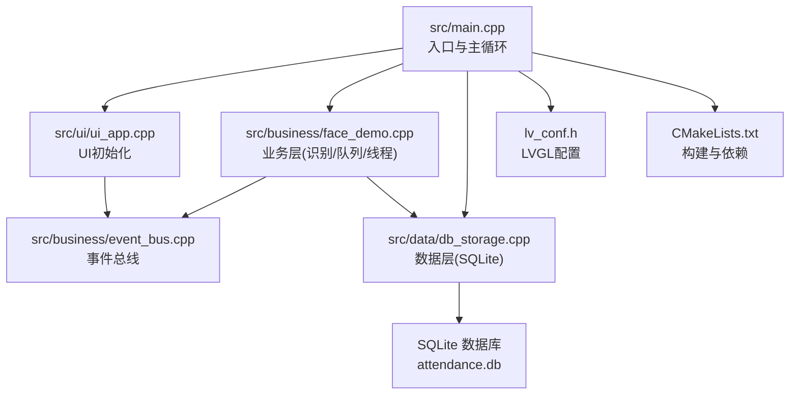
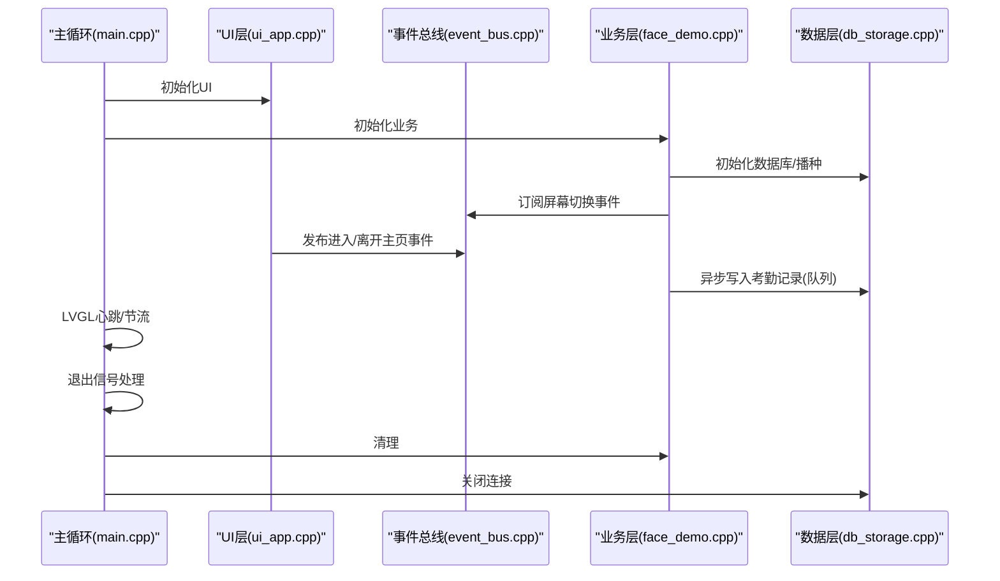
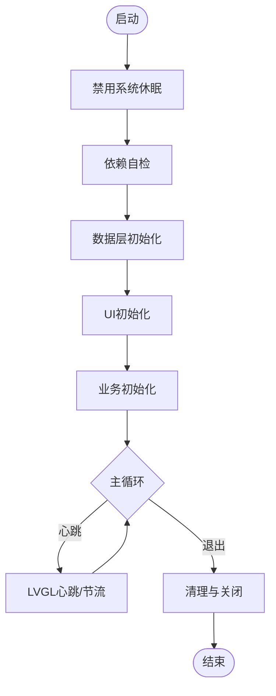
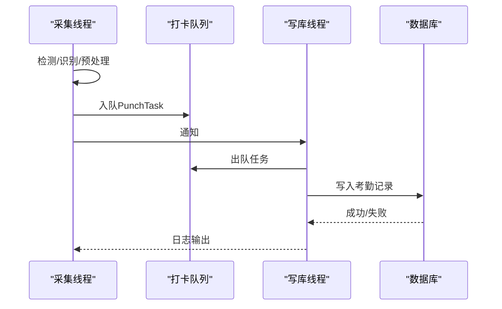
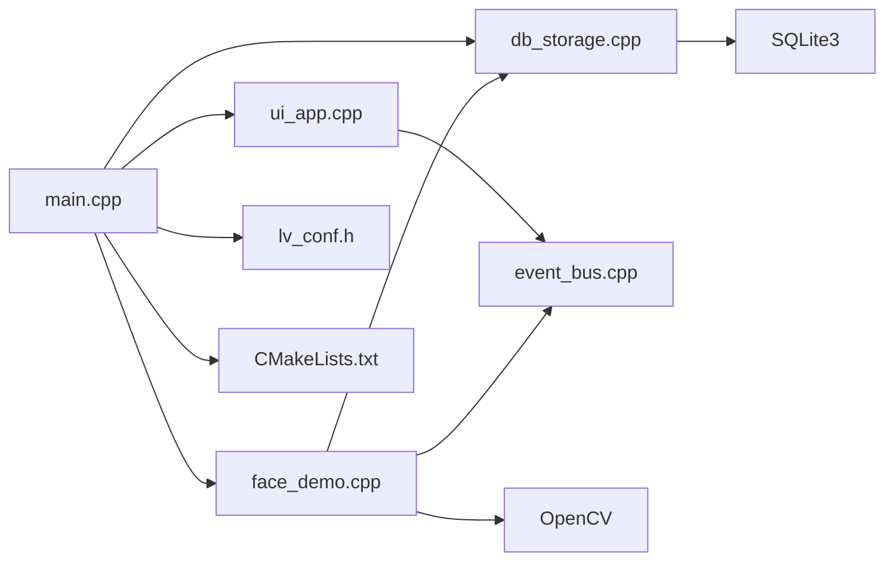

# 故障排除

<cite>
**本文引用的文件**   
- [src/main.cpp](file://src/main.cpp)
- [CMakeLists.txt](file://CMakeLists.txt)
- [src/ui/ui_app.cpp](file://src/ui/ui_app.cpp)
- [src/business/event_bus.h](file://src/business/event_bus.h)
- [src/business/event_bus.cpp](file://src/business/event_bus.cpp)
- [src/business/face_demo.h](file://src/business/face_demo.h)
- [src/business/face_demo.cpp](file://src/business/face_demo.cpp)
- [src/data/db_storage.h](file://src/data/db_storage.h)
- [src/data/db_storage.cpp](file://src/data/db_storage.cpp)
- [lv_conf.h](file://lv_conf.h)
- [tools/stress_test.sh](file://tools/stress_test.sh)
- [docs/SmartAttendance框架结构.txt](file://docs/SmartAttendance框架结构.txt)
- [docs/markdowm/FA03H_rules.md](file://docs/markdowm/FA03H_rules.md)
</cite>

## 目录
1. [简介](#简介)
2. [项目结构](#项目结构)
3. [核心组件](#核心组件)
4. [架构总览](#架构总览)
5. [详细组件分析](#详细组件分析)
6. [依赖关系分析](#依赖关系分析)
7. [性能考虑](#性能考虑)
8. [故障排除指南](#故障排除指南)
9. [结论](#结论)
10. [附录](#附录)

## 简介
本手册面向智能考勤系统的运维与开发人员，聚焦于常见问题的诊断与修复，涵盖编译错误、运行时崩溃、功能异常、性能问题、数据问题、系统监控与预警、以及紧急处置方案。文档基于仓库现有代码与构建脚本，提供可操作的定位思路与修复步骤，并辅以可视化图示帮助快速理解系统交互。

## 项目结构
项目采用分层架构：UI层（LVGL + SDL）、业务层（人脸识别、事件总线、规则引擎）、数据层（SQLite + BLOB存储）。顶层入口负责系统初始化与主循环，CMake负责依赖解析与链接。

**图表来源**
- [src/main.cpp:187-246](file://src/main.cpp#L187-L246)
- [src/ui/ui_app.cpp:34-94](file://src/ui/ui_app.cpp#L34-L94)
- [src/business/face_demo.cpp:557-694](file://src/business/face_demo.cpp#L557-L694)
- [src/data/db_storage.cpp:133-310](file://src/data/db_storage.cpp#L133-L310)
- [lv_conf.h:1-120](file://lv_conf.h#L1-L120)
- [CMakeLists.txt:1-155](file://CMakeLists.txt#L1-L155)

**章节来源**
- [docs/SmartAttendance框架结构.txt:1-79](file://docs/SmartAttendance框架结构.txt#L1-L79)

## 核心组件
- 入口与主循环：负责系统初始化、信号处理、UI与业务初始化、LVGL心跳驱动与退出清理。
- UI层：基于LVGL与SDL，负责窗口创建、输入设备绑定、屏幕加载与后台服务启动。
- 业务层：人脸识别采集与识别、异步打卡写库、事件总线、配置缓存与线程池。
- 数据层：SQLite封装、表结构与索引、BLOB存储、事务与并发控制、数据播种。
- 配置与构建：LVGL配置、CMake依赖与链接、编译命令导出。

**章节来源**
- [src/main.cpp:187-246](file://src/main.cpp#L187-L246)
- [src/ui/ui_app.cpp:34-94](file://src/ui/ui_app.cpp#L34-L94)
- [src/business/face_demo.cpp:557-694](file://src/business/face_demo.cpp#L557-L694)
- [src/data/db_storage.cpp:133-310](file://src/data/db_storage.cpp#L133-L310)
- [lv_conf.h:1-120](file://lv_conf.h#L1-L120)
- [CMakeLists.txt:1-155](file://CMakeLists.txt#L1-L155)

## 架构总览
系统采用“主线程驱动LVGL + 后台线程处理业务”的模式，业务层通过事件总线与UI层解耦，数据库写入通过队列与专用线程串行化，降低多线程竞争风险。

**图表来源**
- [src/main.cpp:187-246](file://src/main.cpp#L187-L246)
- [src/ui/ui_app.cpp:34-94](file://src/ui/ui_app.cpp#L34-L94)
- [src/business/event_bus.cpp:1-28](file://src/business/event_bus.cpp#L1-L28)
- [src/business/face_demo.cpp:246-285](file://src/business/face_demo.cpp#L246-L285)
- [src/data/db_storage.cpp:133-310](file://src/data/db_storage.cpp#L133-L310)

## 详细组件分析

### 组件A：入口与主循环（编译/运行/退出）
- 初始化顺序：禁用休眠 → 框架依赖自检 → 数据层初始化 → UI初始化 → 业务初始化 → 主循环。
- 信号处理：捕获中断信号，设置退出标志，优雅退出。
- LVGL心跳：根据下次定时器时间动态节流，避免忙等。
- 退出清理：业务层清理、数据库关闭。

**图表来源**
- [src/main.cpp:156-246](file://src/main.cpp#L156-L246)

**章节来源**
- [src/main.cpp:156-246](file://src/main.cpp#L156-L246)

### 组件B：UI层（SDL + LVGL）
- 窗口与输入：创建SDL窗口与鼠标/键盘输入设备，绑定Keypad组。
- 初始化流程：样式、管理器、键盘绑定、后台服务启动、加载主页。
- 与业务层：通过事件总线联动，如进入/离开主页时控制识别开关。

**章节来源**
- [src/ui/ui_app.cpp:34-94](file://src/ui/ui_app.cpp#L34-L94)
- [src/business/event_bus.h:10-18](file://src/business/event_bus.h#L10-L18)

### 组件C：事件总线（线程安全通信）
- 单例模式：全局事件总线实例。
- 订阅/发布：线程安全，复制回调列表后解锁，降低锁持有时间。
- 事件类型：时间更新、磁盘状态、相机帧就绪、屏幕切换等。

**章节来源**
- [src/business/event_bus.h:1-43](file://src/business/event_bus.h#L1-L43)
- [src/business/event_bus.cpp:1-28](file://src/business/event_bus.cpp#L1-L28)

### 组件D：业务层（人脸识别与异步写库）
- 线程模型：采集线程（视频采集/检测/识别/帧缓存）、写库线程（队列消费/串行写库）。
- 队列与同步：互斥锁+条件变量，队列长度限制，异常捕获不崩溃。
- 防抖与冷却：用户冷却时间、重复打卡防抖、识别冷却。
- 配置缓存：全局规则与班次缓存，减少频繁查询。
- 异常处理：捕获OpenCV/标准异常，避免主线程崩溃。

**图表来源**
- [src/business/face_demo.cpp:246-285](file://src/business/face_demo.cpp#L246-L285)
- [src/business/face_demo.cpp:291-549](file://src/business/face_demo.cpp#L291-L549)

**章节来源**
- [src/business/face_demo.cpp:246-285](file://src/business/face_demo.cpp#L246-L285)
- [src/business/face_demo.cpp:291-549](file://src/business/face_demo.cpp#L291-L549)

### 组件E：数据层（SQLite + BLOB）
- 生命周期：连接、性能调优（WAL、同步、缓存、外键）、表结构与索引、预编译语句。
- 并发控制：共享/排他读写锁，保证多线程安全。
- 数据播种：默认部门、班次、管理员、响铃计划。
- BLOB处理：OpenCV图像编解码，磁盘目录管理。
- 事务与批量：事务接口，批量导入/同步。

**章节来源**
- [src/data/db_storage.cpp:133-310](file://src/data/db_storage.cpp#L133-L310)
- [src/data/db_storage.cpp:415-430](file://src/data/db_storage.cpp#L415-L430)
- [src/data/db_storage.h:1-240](file://src/data/db_storage.h#L1-L240)

### 组件F：配置与构建（LVGL + CMake）
- LVGL配置：颜色深度、默认刷新周期、渲染与线程配置等。
- CMake：C++17、Debug构建、线程库、SDL2/Freetype、OpenCV、SQLite3、xlsxwriter、子目录引入lvgl、导出编译命令。

**章节来源**
- [lv_conf.h:1-120](file://lv_conf.h#L1-L120)
- [CMakeLists.txt:1-155](file://CMakeLists.txt#L1-L155)

## 依赖关系分析
- 入口依赖UI、业务、数据层；UI依赖事件总线；业务依赖事件总线与数据层；数据层依赖SQLite与OpenCV。
- CMake负责查找并链接SDL2、Freetype、OpenCV、SQLite3、xlsxwriter、线程库；LVGL通过子目录引入并传递配置路径。

**图表来源**
- [src/main.cpp:187-246](file://src/main.cpp#L187-L246)
- [src/ui/ui_app.cpp:34-94](file://src/ui/ui_app.cpp#L34-L94)
- [src/business/face_demo.cpp:557-694](file://src/business/face_demo.cpp#L557-L694)
- [src/data/db_storage.cpp:133-310](file://src/data/db_storage.cpp#L133-L310)
- [lv_conf.h:1-120](file://lv_conf.h#L1-L120)
- [CMakeLists.txt:1-155](file://CMakeLists.txt#L1-L155)

**章节来源**
- [CMakeLists.txt:1-155](file://CMakeLists.txt#L1-L155)

## 性能考虑
- CPU占用过高
  - 现象：识别线程频率过高或LVGL心跳过密。
  - 诊断：检查采集线程睡眠间隔与UI刷新节流；确认队列长度与写库线程吞吐。
  - 修复：适当增大线程休眠时间，调整UI刷新节流阈值，避免过度唤醒。
- 内存泄漏
  - 现象：RSS持续增长、压力测试失败。
  - 诊断：使用压力测试脚本定期采样RSS；检查OpenCV Mat生命周期与数据库句柄释放。
  - 修复：确保Mat及时release，数据库句柄在data_close中释放，队列长度限制。
- 图形渲染卡顿
  - 现象：UI掉帧、滚动卡顿。
  - 诊断：查看LVGL配置与渲染线程栈大小；确认draw缓冲策略。
  - 修复：调整LVGL渲染配置、Draw Buf对齐与大小，必要时降低刷新频率。

**章节来源**
- [tools/stress_test.sh:1-20](file://tools/stress_test.sh#L1-L20)
- [src/business/face_demo.cpp:529-549](file://src/business/face_demo.cpp#L529-L549)
- [lv_conf.h:145-167](file://lv_conf.h#L145-L167)

## 故障排除指南

### 编译错误
- 依赖缺失
  - 现象：找不到SDL2、Freetype、OpenCV、SQLite3、xlsxwriter。
  - 诊断：CMake输出中检查find_package与pkg_check_modules结果。
  - 修复：安装对应开发包，确保路径正确；必要时使用pkg-config补充。
- 线程库未找到
  - 现象：链接阶段报Threads::Threads未找到。
  - 修复：确认find_package(Threads REQUIRED)可用，或系统提供pthread。
- LVGL配置路径
  - 现象：lv_conf.h未生效。
  - 修复：确认LV_CONF_PATH设置与target_compile_definitions传递。

**章节来源**
- [CMakeLists.txt:18-38](file://CMakeLists.txt#L18-L38)
- [CMakeLists.txt:52-61](file://CMakeLists.txt#L52-L61)
- [lv_conf.h:1-120](file://lv_conf.h#L1-L120)

### 运行时崩溃
- OpenCV异常
  - 现象：采集线程抛出OpenCV异常。
  - 诊断：查看异常捕获分支日志。
  - 修复：检查视频源可用性、图像格式与尺寸；在异常分支中避免无限刷屏。
- 数据库写入异常
  - 现象：写库线程抛出异常导致单次失败。
  - 诊断：查看写库线程try-catch输出。
  - 修复：保留异常捕获，避免线程退出；检查预编译语句与外键约束。
- UI初始化失败
  - 现象：SDL窗口创建失败。
  - 修复：检查WSLg/SDL2环境变量与依赖；确认lv_conf.h中SDL启用。

**章节来源**
- [src/business/face_demo.cpp:536-547](file://src/business/face_demo.cpp#L536-L547)
- [src/business/face_demo.cpp:266-281](file://src/business/face_demo.cpp#L266-L281)
- [src/ui/ui_app.cpp:40-53](file://src/ui/ui_app.cpp#L40-L53)

### 功能异常
- 人脸识别不工作
  - 现象：无检测框、无识别结果。
  - 诊断：检查模型文件是否存在与可读；确认视频源连接与重连逻辑。
  - 修复：确保MODEL_FILE存在或触发全量训练；检查SDP/GStreamer管道。
- 重复打卡
  - 现象：短时间内多次打卡。
  - 诊断：检查业务防抖与冷却时间配置。
  - 修复：调整重复打卡阈值与用户冷却时间。
- 事件未触发
  - 现象：进入/离开主页未切换识别状态。
  - 诊断：确认事件订阅与发布是否正确。
  - 修复：检查事件类型与回调绑定。

**章节来源**
- [src/business/face_demo.cpp:605-677](file://src/business/face_demo.cpp#L605-L677)
- [src/business/face_demo.cpp:312-344](file://src/business/face_demo.cpp#L312-L344)
- [src/business/event_bus.h:10-18](file://src/business/event_bus.h#L10-L18)

### 数据问题排查
- 数据库连接失败
  - 现象：data_init返回失败。
  - 诊断：检查数据库文件权限、WAL模式与PRAGMA设置。
  - 修复：确保运行目录可写，数据库文件存在。
- 数据不一致
  - 现象：UI与数据库显示不一致。
  - 诊断：检查事务提交、读写锁使用与缓存一致性。
  - 修复：使用事务批量导入，确保读写锁范围正确。
- 备份与恢复
  - 现象：需要恢复出厂设置或清空数据。
  - 修复：使用工厂重置/清空接口；注意BLOB图片目录清理。

**章节来源**
- [src/data/db_storage.cpp:133-310](file://src/data/db_storage.cpp#L133-L310)
- [src/data/db_storage.h:537-556](file://src/data/db_storage.h#L537-L556)

### 性能问题诊断
- CPU占用过高
  - 诊断：采集线程休眠过短、UI刷新过于频繁。
  - 修复：增大线程休眠间隔，调整UI刷新节流阈值。
- 内存泄漏
  - 诊断：RSS持续上升。
  - 修复：使用压力测试脚本监控；确保Mat释放与句柄关闭。
- 图形渲染卡顿
  - 诊断：LVGL渲染配置不当。
  - 修复：调整渲染缓冲与线程栈大小。

**章节来源**
- [tools/stress_test.sh:1-20](file://tools/stress_test.sh#L1-L20)
- [src/business/face_demo.cpp:529-549](file://src/business/face_demo.cpp#L529-L549)
- [lv_conf.h:145-167](file://lv_conf.h#L145-L167)

### 系统监控与预警
- 磁盘空间监控
  - 建议：定期检查captured_images目录大小，触发清理策略。
- 事件监控
  - 建议：订阅DISK_FULL/DISK_NORMAL事件，实现告警。
- 压力测试
  - 建议：使用stress_test.sh进行长时间稳定性验证。

**章节来源**
- [src/business/face_demo.cpp:588-595](file://src/business/face_demo.cpp#L588-L595)
- [src/business/event_bus.h:10-18](file://src/business/event_bus.h#L10-L18)
- [tools/stress_test.sh:1-20](file://tools/stress_test.sh#L1-L20)

### 紧急处置方案
- 立即降级
  - 关闭识别功能，仅保留UI与基础查询。
- 快速恢复
  - 清理过期图片，释放磁盘空间；重启业务线程。
- 回滚策略
  - 参考硬件FAQ中的固件升级回退流程（适用于设备端）。

**章节来源**
- [docs/markdowm/FA03H_rules.md:115-127](file://docs/markdowm/FA03H_rules.md#L115-L127)
- [src/business/face_demo.cpp:588-595](file://src/business/face_demo.cpp#L588-L595)

## 结论
本手册基于仓库现有代码与构建配置，提供了从编译、运行到性能与数据问题的系统化排查路径。建议在日常运维中结合压力测试与事件监控，建立预警机制，确保系统稳定运行。

## 附录
- 相关接口与数据结构可参考各模块头文件与实现文件，便于进一步定位问题。

**章节来源**
- [src/business/face_demo.h:1-212](file://src/business/face_demo.h#L1-L212)
- [src/data/db_storage.h:1-683](file://src/data/db_storage.h#L1-L683)