# DAO接口设计

<cite>
**本文档引用的文件**
- [db_storage.h](file://src/data/db_storage.h)
- [db_storage.cpp](file://src/data/db_storage.cpp)
- [attendance_rule.h](file://src/business/attendance_rule.h)
- [attendance_rule.cpp](file://src/business/attendance_rule.cpp)
- [auth_service.h](file://src/business/auth_service.h)
- [auth_service.cpp](file://src/business/auth_service.cpp)
- [ui_controller.h](file://src/ui/ui_controller.h)
- [ui_controller.cpp](file://src/ui/ui_controller.cpp)
</cite>

## 目录
1. [简介](#简介)
2. [项目结构](#项目结构)
3. [核心组件](#核心组件)
4. [架构概览](#架构概览)
5. [详细组件分析](#详细组件分析)
6. [依赖关系分析](#依赖关系分析)
7. [性能考虑](#性能考虑)
8. [故障排除指南](#故障排除指南)
9. [结论](#结论)

## 简介

SmartAttendance项目采用数据访问对象(DAO)模式构建数据层，实现了完整的考勤管理系统。该模式通过抽象数据库操作，提供了清晰的接口层次，实现了业务逻辑层与数据访问层的解耦。

DAO模式的核心优势在于：
- **接口抽象**：通过统一的接口定义数据操作规范
- **事务管理**：内置事务支持，确保数据一致性
- **并发控制**：采用读写锁机制，平衡并发性能
- **错误处理**：完善的异常处理和错误恢复机制
- **可扩展性**：支持数据源替换和功能扩展

## 项目结构

SmartAttendance项目采用分层架构设计，主要分为以下层次：

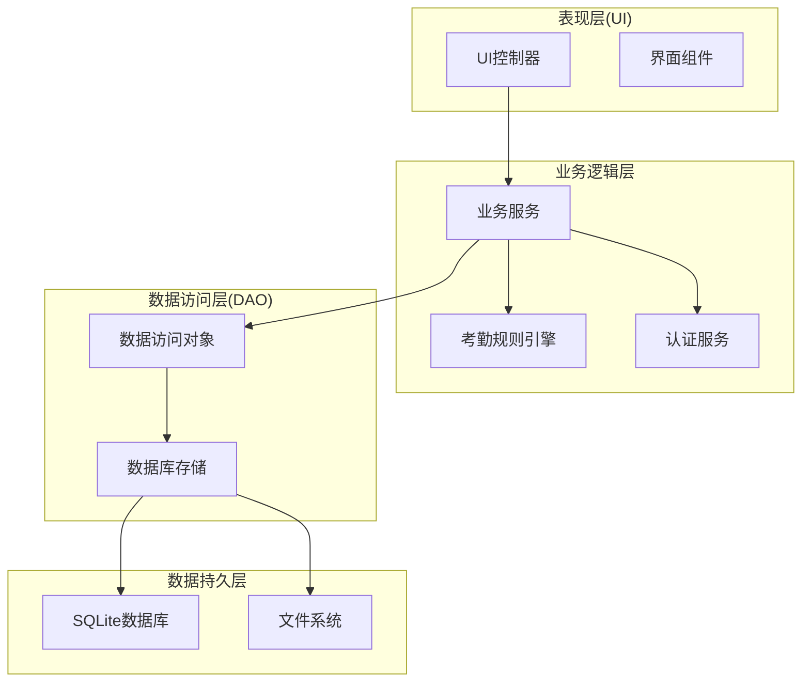

**图表来源**
- [db_storage.h:1-596](file://src/data/db_storage.h#L1-L596)
- [ui_controller.h:21-106](file://src/ui/ui_controller.h#L21-L106)

**章节来源**
- [db_storage.h:1-596](file://src/data/db_storage.h#L1-L596)
- [ui_controller.h:1-106](file://src/ui/ui_controller.h#L1-L106)

## 核心组件

### 数据访问对象(DAO)接口设计

DAO模式在SmartAttendance中通过db_storage.h头文件定义，提供了完整的数据访问接口：

#### 核心数据结构
系统定义了九种核心数据结构，每种结构对应数据库中的特定表：

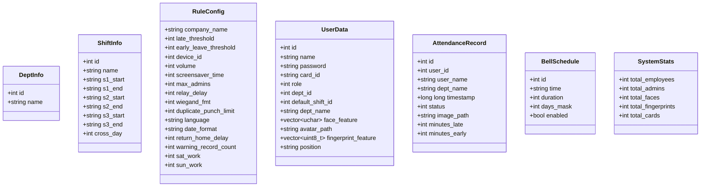

**图表来源**
- [db_storage.h:18-186](file://src/data/db_storage.h#L18-L186)

#### DAO接口分类

系统实现了五个主要的DAO模块：

1. **部门管理DAO**：负责部门信息的CRUD操作
2. **班次管理DAO**：管理上下班时间规则
3. **用户管理DAO**：处理员工信息和生物特征
4. **考勤记录DAO**：记录和查询考勤数据
5. **系统配置DAO**：管理全局系统设置

**章节来源**
- [db_storage.h:215-596](file://src/data/db_storage.h#L215-L596)

## 架构概览

### 数据层架构设计

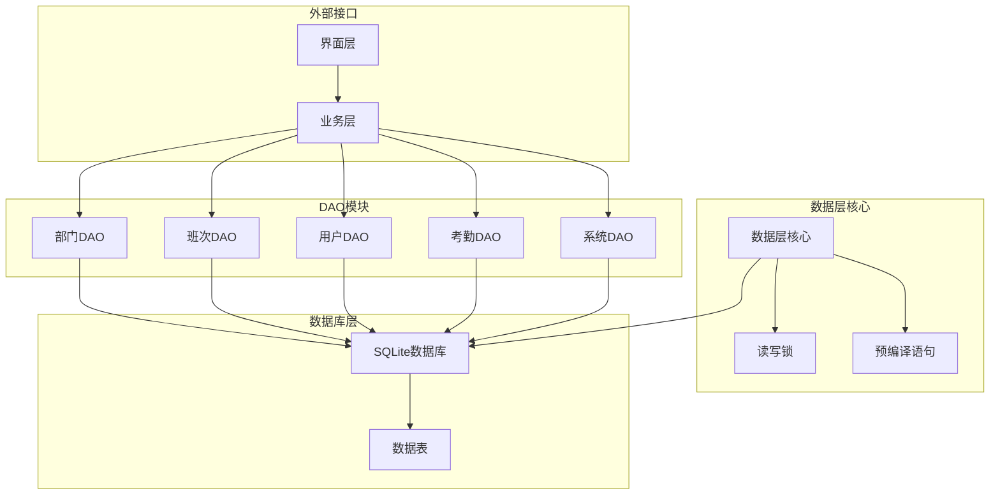

**图表来源**
- [db_storage.cpp:31-38](file://src/data/db_storage.cpp#L31-L38)
- [db_storage.cpp:3276-3282](file://src/data/db_storage.cpp#L276-L282)

### 并发控制机制

系统采用读写锁机制实现高效的并发控制：

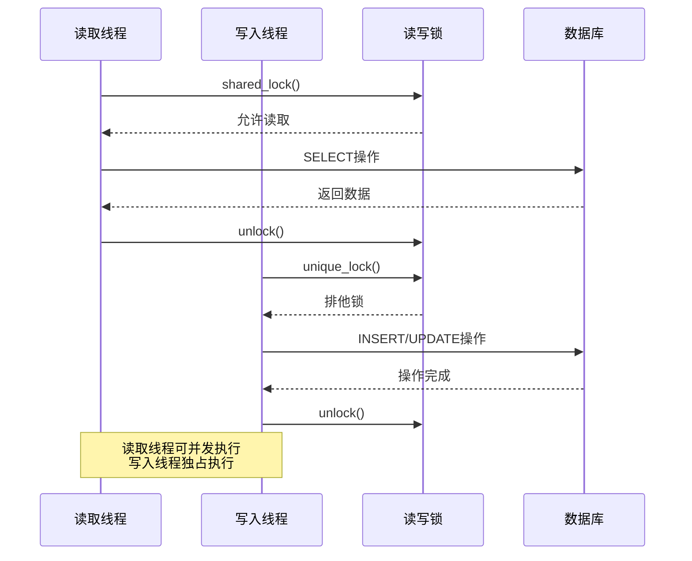

**图表来源**
- [db_storage.cpp:35-37](file://src/data/db_storage.cpp#L35-L37)

**章节来源**
- [db_storage.cpp:31-405](file://src/data/db_storage.cpp#L31-L405)

## 详细组件分析

### 部门管理DAO

部门管理DAO负责部门信息的完整生命周期管理：

#### 核心接口
- `db_add_department()`: 添加新部门
- `db_get_departments()`: 获取所有部门列表
- `db_delete_department()`: 删除指定部门

#### 实现特点
- 使用外键约束确保数据完整性
- 支持部门级联删除
- 提供默认部门播种功能

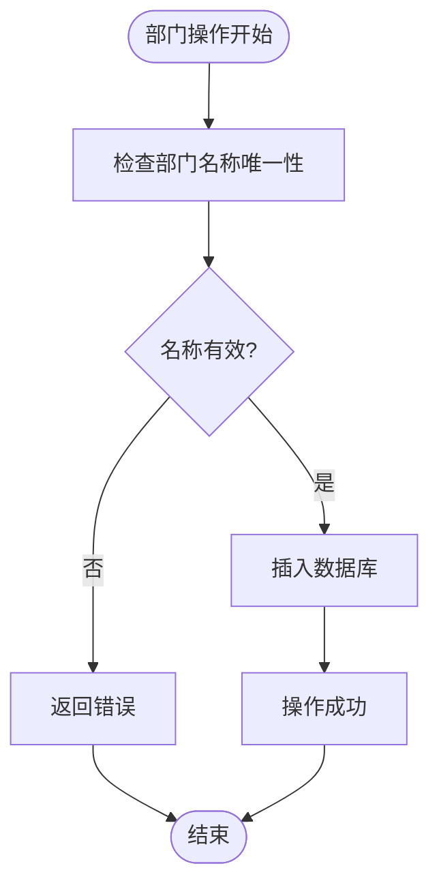

**图表来源**
- [db_storage.cpp:409-424](file://src/data/db_storage.cpp#L409-L424)

**章节来源**
- [db_storage.h:215-237](file://src/data/db_storage.h#L215-L237)
- [db_storage.cpp:409-461](file://src/data/db_storage.cpp#L409-L461)

### 班次管理DAO

班次管理DAO提供灵活的上下班时间规则配置：

#### 核心接口
- `db_update_shift()`: 更新班次时间
- `db_get_shifts()`: 获取班次列表
- `db_get_shift_info()`: 获取班次详细信息
- `db_add_shift()`: 创建新班次
- `db_delete_shift()`: 删除班次

#### 班次规则设计
系统支持最多三个工作时段和跨天设置：

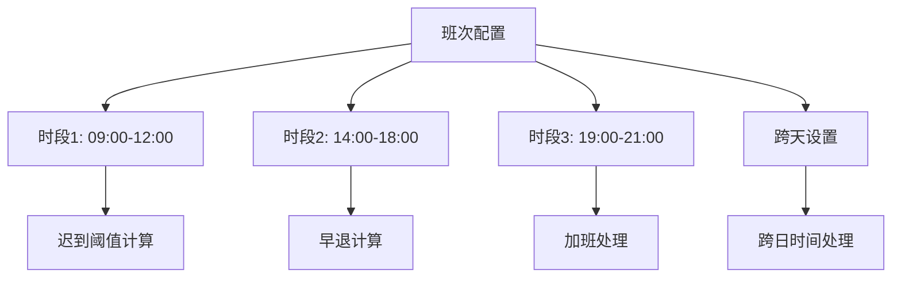

**图表来源**
- [db_storage.h:34-55](file://src/data/db_storage.h#L34-L55)

**章节来源**
- [db_storage.h:238-289](file://src/data/db_storage.h#L238-L289)
- [db_storage.cpp:465-695](file://src/data/db_storage.cpp#L465-L695)

### 用户管理DAO

用户管理DAO处理员工信息和生物特征数据：

#### 核心接口
- `db_add_user()`: 注册新用户
- `db_batch_add_users()`: 批量导入用户
- `db_delete_user()`: 删除用户
- `db_get_user_info()`: 获取用户详情
- `db_get_all_users()`: 获取所有用户
- `db_assign_user_shift()`: 指定用户班次

#### 生物特征管理
系统支持多种生物特征识别：
- 人脸特征数据存储
- 指纹特征数据管理
- 卡号识别支持

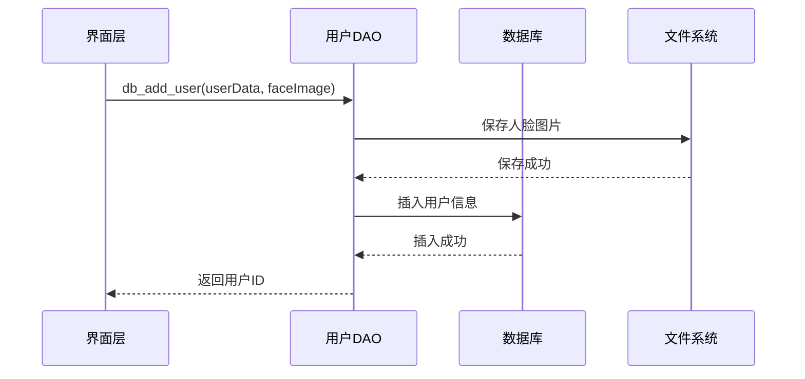

**图表来源**
- [db_storage.cpp:748-803](file://src/data/db_storage.cpp#L748-L803)

**章节来源**
- [db_storage.h:315-420](file://src/data/db_storage.h#L315-L420)
- [db_storage.cpp:748-1262](file://src/data/db_storage.cpp#L748-L1262)

### 考勤记录DAO

考勤记录DAO负责考勤数据的记录和查询：

#### 核心接口
- `db_log_attendance()`: 记录考勤
- `db_get_records()`: 查询考勤记录
- `db_get_records_by_user()`: 按用户查询
- `db_getLastPunchTime()`: 获取最后打卡时间

#### 考勤规则引擎集成
考勤记录DAO与业务规则引擎深度集成：

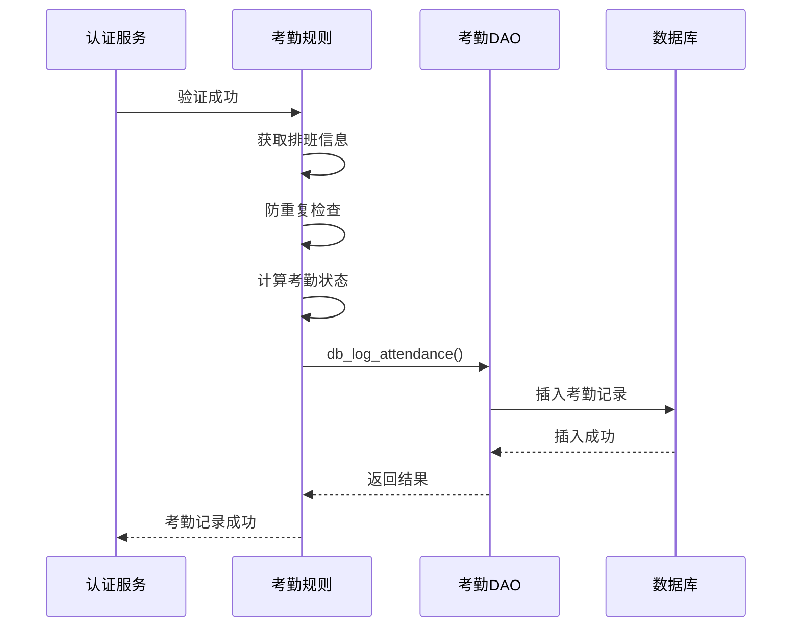

**图表来源**
- [attendance_rule.cpp:198-277](file://src/business/attendance_rule.cpp#L198-L277)

**章节来源**
- [db_storage.h:421-461](file://src/data/db_storage.h#L421-L461)
- [db_storage.cpp:1296-1536](file://src/data/db_storage.cpp#L1296-L1536)

### 系统配置DAO

系统配置DAO管理全局系统设置：

#### 核心接口
- `db_get_global_rules()`: 获取全局规则
- `db_update_global_rules()`: 更新全局规则
- `db_get_system_config()`: 获取系统配置
- `db_set_system_config()`: 设置系统配置

#### 配置管理
系统支持多种配置类型：
- 考勤规则配置
- 设备参数设置
- 用户界面配置
- 系统行为参数

**章节来源**
- [db_storage.h:291-314](file://src/data/db_storage.h#L291-L314)
- [db_storage.cpp:574-744](file://src/data/db_storage.cpp#L574-L744)

## 依赖关系分析

### 组件间依赖关系

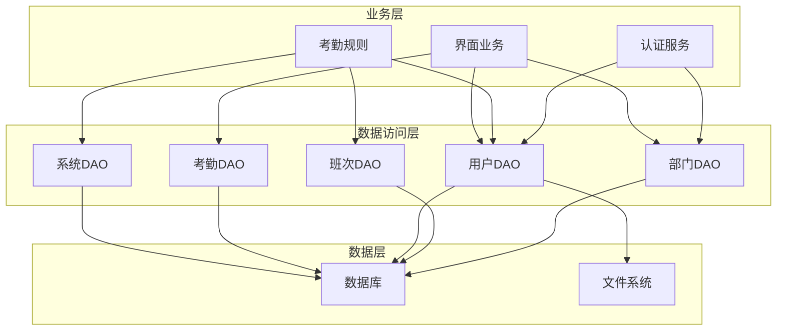

**图表来源**
- [auth_service.cpp:1-90](file://src/business/auth_service.cpp#L1-L90)
- [attendance_rule.cpp:1-277](file://src/business/attendance_rule.cpp#L1-L277)
- [ui_controller.cpp:1-417](file://src/ui/ui_controller.cpp#L1-L417)

### 错误处理机制

系统建立了完整的错误处理机制：

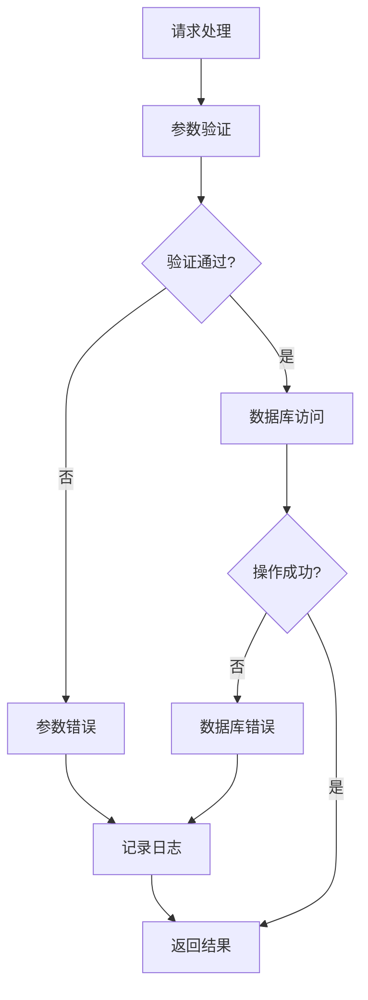

**图表来源**
- [db_storage.cpp:96-104](file://src/data/db_storage.cpp#L96-L104)

**章节来源**
- [db_storage.cpp:96-104](file://src/data/db_storage.cpp#L96-L104)

## 性能考虑

### 连接池设计

系统采用SQLite内建的连接池机制：
- **WAL模式**：提升读写并发性能
- **预编译语句**：减少SQL解析开销
- **连接复用**：避免频繁连接建立

### 缓存策略

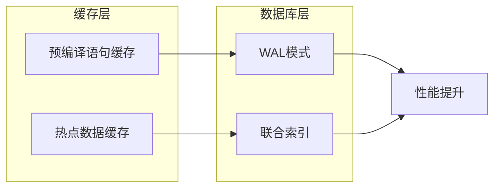

**图表来源**
- [db_storage.cpp:276-282](file://src/data/db_storage.cpp#L276-L282)

### 并发优化

- **读写分离**：读操作使用共享锁，写操作使用独占锁
- **批量操作**：支持事务批量处理
- **异步处理**：文件I/O操作异步执行

**章节来源**
- [db_storage.cpp:124-135](file://src/data/db_storage.cpp#L124-L135)
- [db_storage.cpp:35-37](file://src/data/db_storage.cpp#L35-L37)

## 故障排除指南

### 常见问题及解决方案

#### 数据库连接问题
- **症状**：无法连接数据库
- **原因**：文件权限不足或数据库损坏
- **解决**：检查文件权限，重新初始化数据库

#### 并发访问冲突
- **症状**：读写操作相互阻塞
- **原因**：锁竞争过度
- **解决**：优化查询逻辑，减少长事务

#### 内存不足
- **症状**：系统运行缓慢
- **原因**：缓存过大或数据量过多
- **解决**：调整缓存大小，定期清理历史数据

### 调试技巧

1. **启用详细日志**：查看SQL执行情况
2. **监控性能指标**：观察锁等待时间和查询响应时间
3. **定期备份**：防止数据丢失

**章节来源**
- [db_storage.cpp:118-121](file://src/data/db_storage.cpp#L118-L121)

## 结论

SmartAttendance项目的DAO模式设计体现了现代软件架构的最佳实践：

### 主要成就
- **清晰的分层架构**：实现了业务逻辑与数据访问的完全解耦
- **强大的并发控制**：通过读写锁机制实现了高并发性能
- **完整的错误处理**：建立了完善的异常处理和恢复机制
- **灵活的扩展性**：支持数据源替换和功能扩展

### 技术亮点
- **事务管理**：内置事务支持，确保数据一致性
- **预编译优化**：显著提升查询性能
- **文件系统集成**：生物特征数据的本地存储管理
- **规则引擎集成**：考勤规则的灵活配置和执行

### 未来改进方向
- **连接池优化**：进一步提升并发性能
- **监控增强**：增加更详细的性能监控指标
- **扩展支持**：支持更多类型的数据库和存储方案

该DAO模式为类似的企业级应用提供了优秀的参考模板，展示了如何在保证性能的同时实现代码的可维护性和可扩展性。