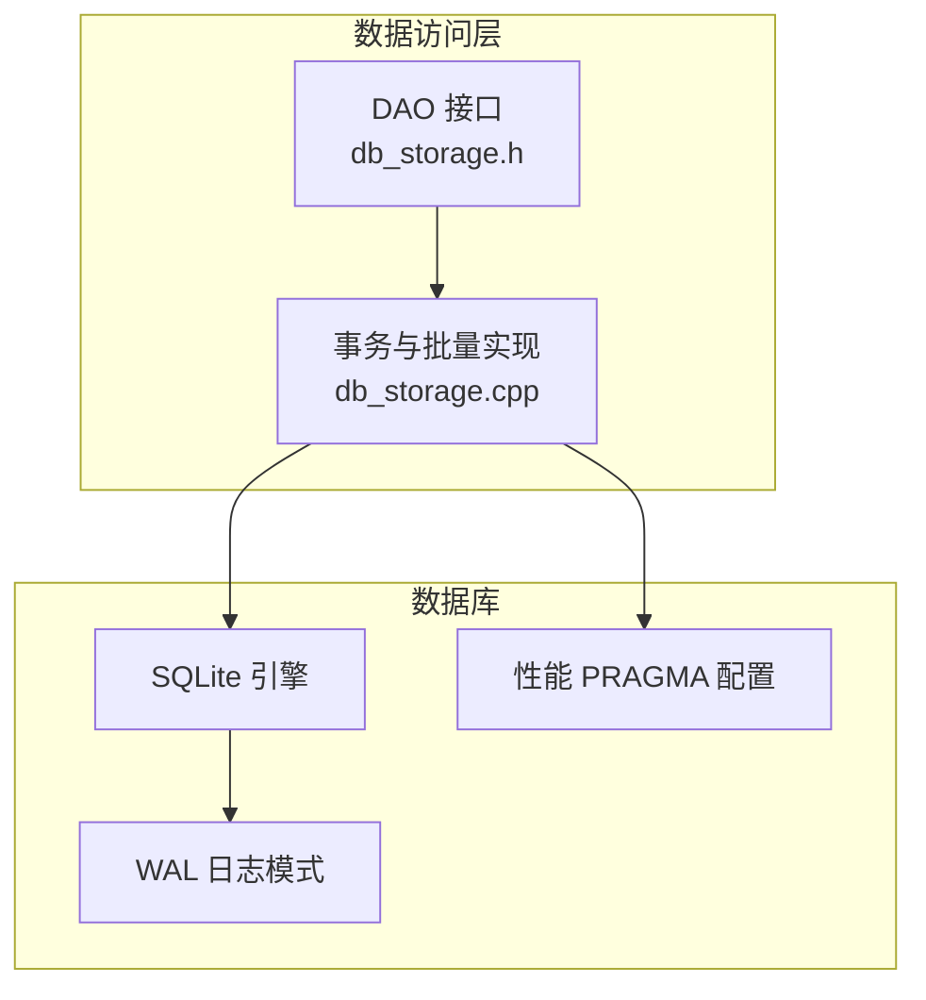
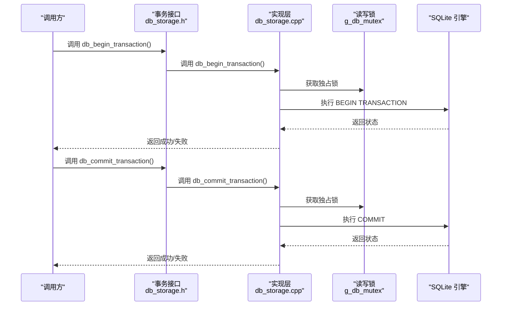
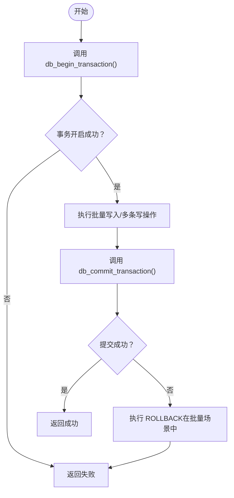
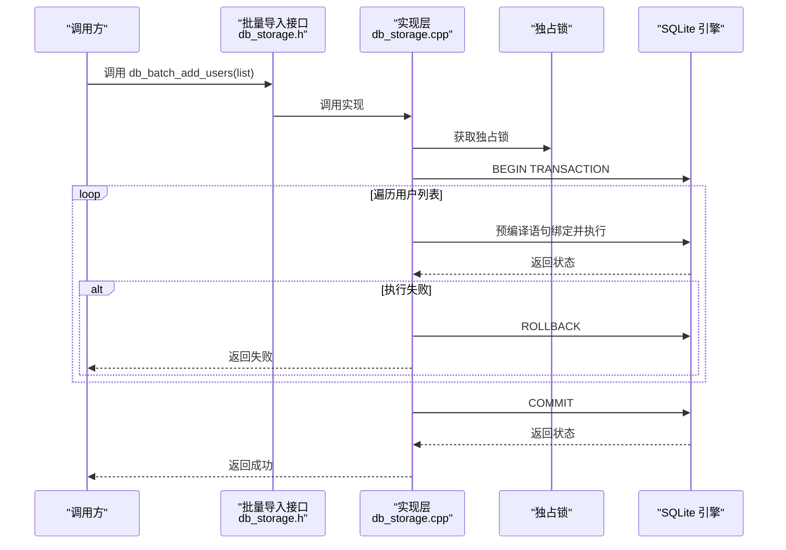
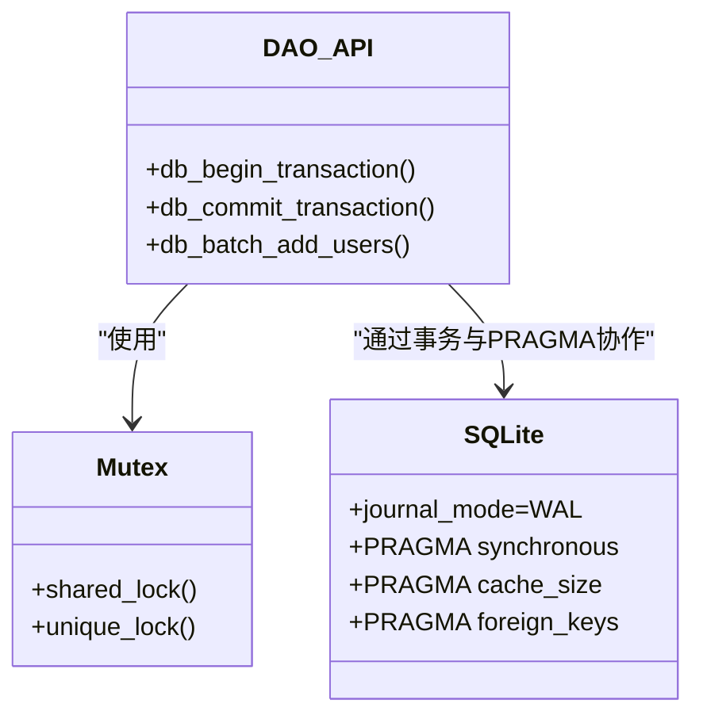
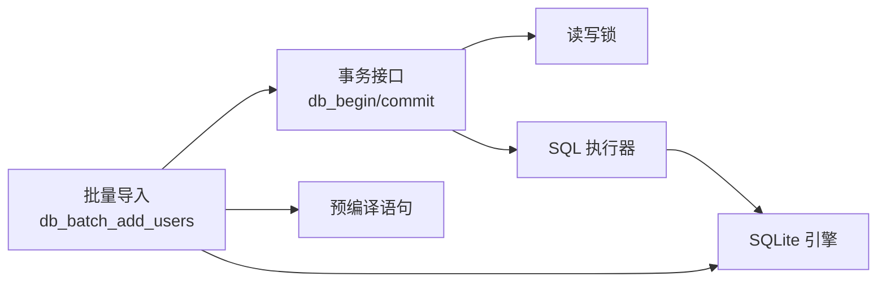

# 事务管理

<cite>
**本文引用的文件**
- [db_storage.cpp](file://src/data/db_storage.cpp)
- [db_storage.h](file://src/data/db_storage.h)
</cite>

## 目录
1. [简介](#简介)
2. [项目结构](#项目结构)
3. [核心组件](#核心组件)
4. [架构总览](#架构总览)
5. [详细组件分析](#详细组件分析)
6. [依赖关系分析](#依赖关系分析)
7. [性能考量](#性能考量)
8. [故障排查指南](#故障排查指南)
9. [结论](#结论)

## 简介
本文件系统性阐述 SmartAttendance 项目中的数据库事务管理设计与实现，重点覆盖以下方面：
- 事务接口的使用方式：开启事务与提交事务
- 在批量操作中的关键作用：批量用户导入、批量数据更新等
- ACID 特性保障与错误处理机制、自动回滚策略
- 事务使用的最佳实践与性能优化建议
- 事务管理在数据一致性保障中的关键作用

## 项目结构
事务相关能力集中在数据访问层（DAO），通过统一的事务接口与批量操作封装，配合读写锁与 SQLite 的 WAL 模式，实现高并发、高性能、强一致的数据访问。

图表来源
- [db_storage.h:463-473](file://src/data/db_storage.h#L463-L473)
- [db_storage.cpp:1538-1552](file://src/data/db_storage.cpp#L1538-L1552)
- [db_storage.cpp:805-904](file://src/data/db_storage.cpp#L805-L904)
- [db_storage.cpp:108-285](file://src/data/db_storage.cpp#L108-L285)

章节来源
- [db_storage.h:195-206](file://src/data/db_storage.h#L195-L206)
- [db_storage.cpp:108-285](file://src/data/db_storage.cpp#L108-L285)

## 核心组件
- 事务接口
  - 开启事务：db_begin_transaction()
  - 提交事务：db_commit_transaction()
- 批量操作
  - 批量用户导入：db_batch_add_users()
  - 其他批量更新场景可复用事务接口
- 锁与并发控制
  - 读写锁：g_db_mutex（共享锁/独占锁）
  - 事务期间持有独占锁，确保写操作互斥
- SQLite 性能与一致性
  - WAL 模式、PRAGMA 参数、预编译语句

章节来源
- [db_storage.h:463-473](file://src/data/db_storage.h#L463-L473)
- [db_storage.h:331-332](file://src/data/db_storage.h#L331-L332)
- [db_storage.cpp:1538-1552](file://src/data/db_storage.cpp#L1538-L1552)
- [db_storage.cpp:805-904](file://src/data/db_storage.cpp#L805-L904)
- [db_storage.cpp:90-104](file://src/data/db_storage.cpp#L90-L104)

## 架构总览
事务管理贯穿数据访问层，围绕“接口层 → 实现层 → 数据库引擎”的链路工作。事务接口在实现层内调用底层 SQL 执行器，同时配合全局读写锁与 SQLite 的 WAL 模式，确保并发安全与性能。

图表来源
- [db_storage.h:463-473](file://src/data/db_storage.h#L463-L473)
- [db_storage.cpp:1538-1552](file://src/data/db_storage.cpp#L1538-L1552)

## 详细组件分析

### 事务接口与使用
- db_begin_transaction()
  - 功能：开启数据库事务，用于批量写入加速
  - 实现要点：在事务期间获取独占锁，调用底层 SQL 执行器执行 BEGIN
- db_commit_transaction()
  - 功能：提交事务，持久化批量写入
  - 实现要点：在事务期间获取独占锁，调用底层 SQL 执行器执行 COMMIT
- 错误处理与自动回滚
  - 事务接口本身不负责自动回滚；批量导入示例展示了在失败时执行 ROLLBACK 的策略

图表来源
- [db_storage.h:463-473](file://src/data/db_storage.h#L463-L473)
- [db_storage.cpp:1538-1552](file://src/data/db_storage.cpp#L1538-L1552)
- [db_storage.cpp:805-904](file://src/data/db_storage.cpp#L805-L904)

章节来源
- [db_storage.h:463-473](file://src/data/db_storage.h#L463-L473)
- [db_storage.cpp:1538-1552](file://src/data/db_storage.cpp#L1538-L1552)

### 批量用户导入与事务协作
- db_batch_add_users(users_list)
  - 场景：U盘/网络批量同步员工数据
  - 事务策略：显式 BEGIN/COMMIT，失败时 ROLLBACK
  - 语义：INSERT OR REPLACE，按工号覆盖或新增
  - 并发控制：批量写入期间获取独占锁
  - 性能优化：预编译语句、批量绑定与执行
- 使用建议
  - 将多条写操作包裹在事务中，显著降低磁盘写入次数
  - 严格错误处理：任一失败即回滚，保证整体一致性

图表来源
- [db_storage.h:331-332](file://src/data/db_storage.h#L331-L332)
- [db_storage.cpp:805-904](file://src/data/db_storage.cpp#L805-L904)

章节来源
- [db_storage.h:331-332](file://src/data/db_storage.h#L331-L332)
- [db_storage.cpp:805-904](file://src/data/db_storage.cpp#L805-L904)

### 锁与并发控制
- 读写锁 g_db_mutex
  - 读操作：共享锁（shared_lock）
  - 写操作：独占锁（unique_lock）
  - 事务期间：独占锁，确保写操作互斥
- 与 SQLite 的协作
  - WAL 模式提升读写并发性能
  - PRAGMA 参数优化同步、缓存、外键等行为

图表来源
- [db_storage.cpp:34](file://src/data/db_storage.cpp#L34)
- [db_storage.cpp:1538-1552](file://src/data/db_storage.cpp#L1538-L1552)
- [db_storage.cpp:108-285](file://src/data/db_storage.cpp#L108-L285)

章节来源
- [db_storage.cpp:34](file://src/data/db_storage.cpp#L34)
- [db_storage.cpp:108-285](file://src/data/db_storage.cpp#L108-L285)

### ACID 特性与错误处理
- 原子性（Atomicity）
  - 事务内多条写操作要么全部成功，要么全部失败（RALLBACK）
- 一致性（Consistency）
  - 外键约束、唯一约束、PRAGMA 设置共同保障
- 隔离性（Isolation）
  - 事务期间独占锁；WAL 模式下读写不阻塞
- 持久性（Durability）
  - COMMIT 后写入持久化；WAL 模式提升可靠性

错误处理与自动回滚策略
- 事务接口不自动回滚，批量导入示例展示了在失败时执行 ROLLBACK 的策略
- 任一写入失败立即终止循环并回滚，避免部分写入导致不一致

章节来源
- [db_storage.cpp:805-904](file://src/data/db_storage.cpp#L805-L904)
- [db_storage.cpp:1538-1552](file://src/data/db_storage.cpp#L1538-L1552)
- [db_storage.cpp:108-285](file://src/data/db_storage.cpp#L108-L285)

## 依赖关系分析
- 事务接口依赖
  - 读写锁：g_db_mutex
  - 底层 SQL 执行器：exec_sql/sqlite3_exec
  - SQLite 引擎：BEGIN/COMMIT/ROLLBACK
- 批量导入依赖
  - 预编译语句：提升批量绑定效率
  - INSERT OR REPLACE：覆盖/新增统一语义
  - 事务：加速与一致性保障

图表来源
- [db_storage.cpp:1538-1552](file://src/data/db_storage.cpp#L1538-L1552)
- [db_storage.cpp:805-904](file://src/data/db_storage.cpp#L805-L904)
- [db_storage.cpp:275-281](file://src/data/db_storage.cpp#L275-L281)

章节来源
- [db_storage.cpp:1538-1552](file://src/data/db_storage.cpp#L1538-L1552)
- [db_storage.cpp:805-904](file://src/data/db_storage.cpp#L805-L904)
- [db_storage.cpp:275-281](file://src/data/db_storage.cpp#L275-L281)

## 性能考量
- WAL 模式
  - 读写不互斥，显著提升并发吞吐
- PRAGMA 优化
  - synchronous=NORMAL、cache_size、foreign_keys 等
- 预编译语句
  - 减少 SQL 解析与编译开销
- 事务批处理
  - 将多次写入合并为一次提交，降低磁盘写放大
- 锁粒度
  - 读写分离，缩短锁持有时间，提高并发

章节来源
- [db_storage.cpp:108-285](file://src/data/db_storage.cpp#L108-L285)
- [db_storage.cpp:275-281](file://src/data/db_storage.cpp#L275-L281)
- [db_storage.cpp:805-904](file://src/data/db_storage.cpp#L805-L904)

## 故障排查指南
- 事务开启失败
  - 检查数据库连接状态与权限
  - 查看底层 SQL 执行器返回的错误信息
- 提交失败
  - 确认事务期间未发生致命错误
  - 在批量场景中，确保出现异常时执行 ROLLBACK
- 批量导入失败
  - 定位具体用户数据与绑定字段
  - 检查预编译语句与绑定顺序
- 并发冲突
  - 确认事务期间独占锁正确持有
  - 避免在事务外进行长时间阻塞操作

章节来源
- [db_storage.cpp:95-104](file://src/data/db_storage.cpp#L95-L104)
- [db_storage.cpp:805-904](file://src/data/db_storage.cpp#L805-L904)
- [db_storage.cpp:1538-1552](file://src/data/db_storage.cpp#L1538-L1552)

## 结论
本项目通过统一的事务接口与严格的批量操作封装，在保证数据一致性的前提下，实现了高并发与高性能的数据访问。事务接口与锁机制、SQLite 的 WAL 模式以及 PRAGMA 优化共同构成了可靠的事务管理体系。遵循本文的最佳实践与故障排查建议，可在批量导入、批量更新等场景中获得稳定、高效的事务行为。