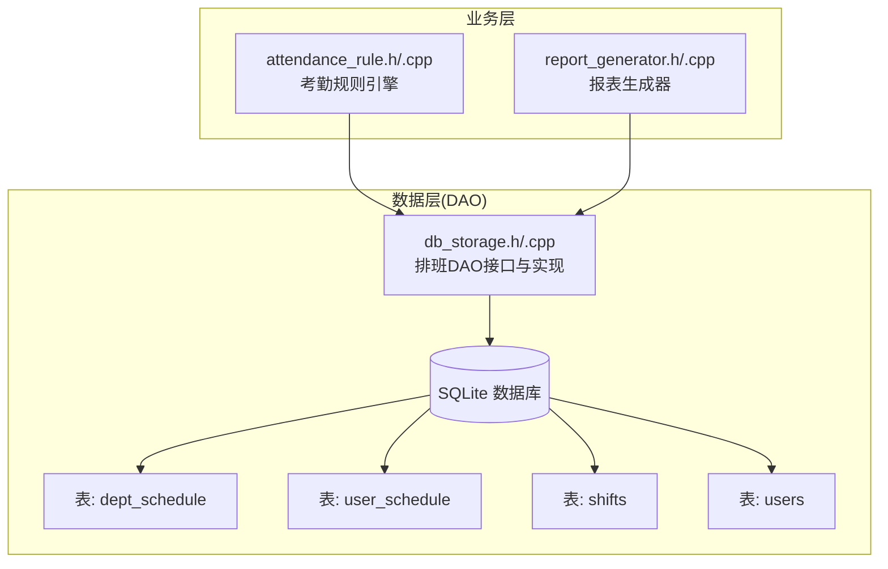
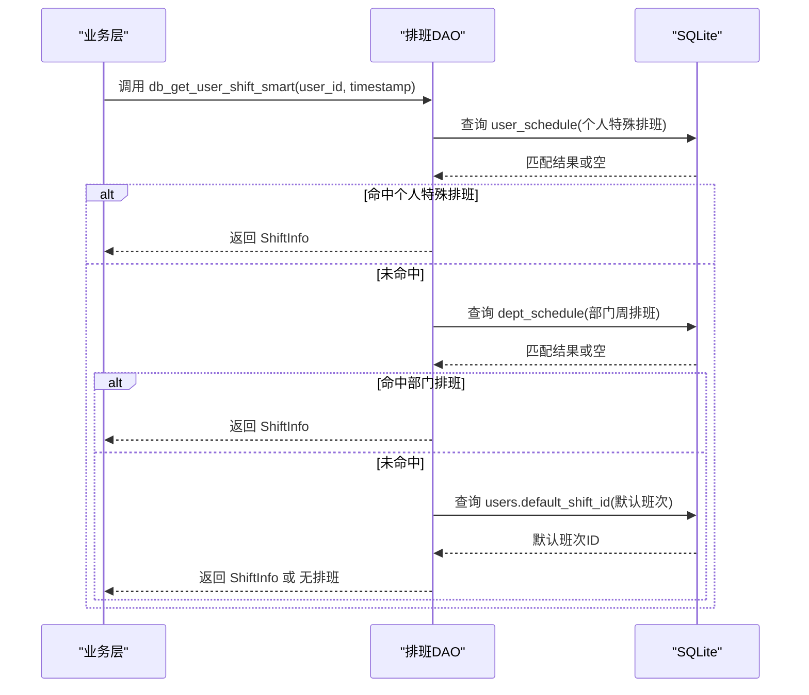
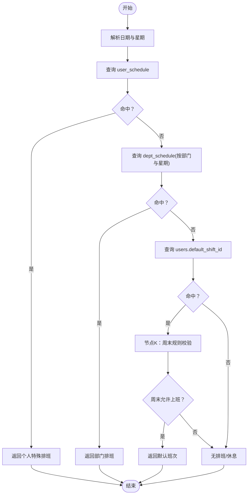
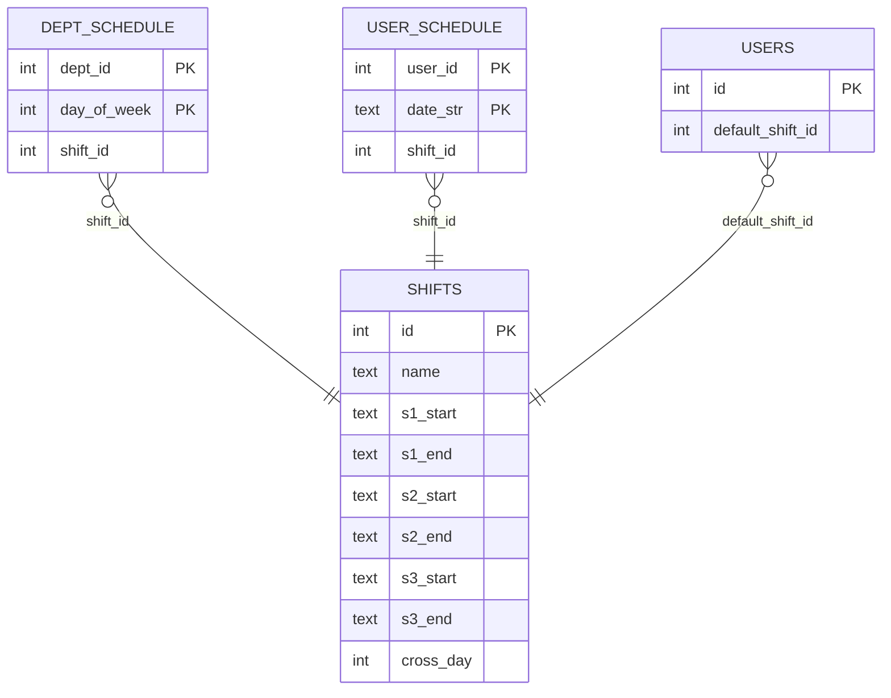
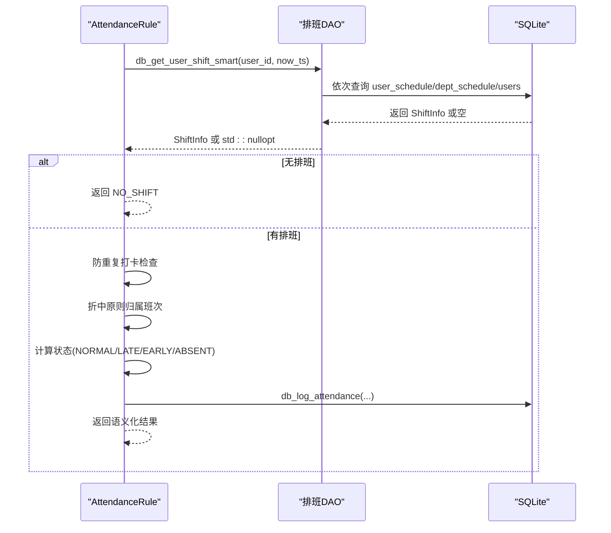
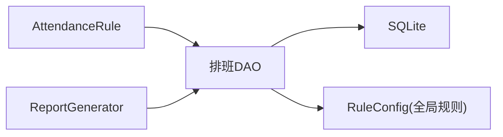

# 排班管理DAO

<cite>
**本文引用的文件**
- [db_storage.h](file://src/data/db_storage.h)
- [db_storage.cpp](file://src/data/db_storage.cpp)
- [attendance_rule.h](file://src/business/attendance_rule.h)
- [attendance_rule.cpp](file://src/business/attendance_rule.cpp)
- [report_generator.h](file://src/business/report_generator.h)
- [report_generator.cpp](file://src/business/report_generator.cpp)
</cite>

## 目录
1. [简介](#简介)
2. [项目结构](#项目结构)
3. [核心组件](#核心组件)
4. [架构总览](#架构总览)
5. [详细组件分析](#详细组件分析)
6. [依赖关系分析](#依赖关系分析)
7. [性能考量](#性能考量)
8. [故障排查指南](#故障排查指南)
9. [结论](#结论)
10. [附录](#附录)

## 简介
本文件聚焦于排班管理DAO模块，系统性阐述以下内容：
- 排班信息管理接口：部门周排班设置(db_set_dept_schedule)、个人特殊排班设置(db_set_user_special_schedule)、智能排班查询(db_get_user_shift_smart)
- 排班优先级逻辑：个人特殊排班 > 部门周排班 > 默认班次
- 智能排班在节点K周末规则下的行为
- 业务规则与算法实现细节
- 最佳实践与常见应用场景
- 排班DAO在智能考勤计算中的核心作用

## 项目结构
排班管理DAO位于数据层(src/data)，围绕SQLite数据库表dept_schedule、user_schedule、shifts、users进行读写；业务层(src/business)在考勤规则与报表生成中广泛调用该DAO。

图表来源
- [db_storage.h:475-504](file://src/data/db_storage.h#L475-L504)
- [db_storage.cpp:1596-1632](file://src/data/db_storage.cpp#L1596-L1632)
- [db_storage.cpp:1634-1763](file://src/data/db_storage.cpp#L1634-L1763)
- [attendance_rule.h:43-88](file://src/business/attendance_rule.h#L43-L88)
- [report_generator.h:89-121](file://src/business/report_generator.h#L89-L121)

章节来源
- [db_storage.h:475-504](file://src/data/db_storage.h#L475-L504)
- [db_storage.cpp:197-227](file://src/data/db_storage.cpp#L197-L227)
- [db_storage.cpp:1596-1632](file://src/data/db_storage.cpp#L1596-L1632)
- [db_storage.cpp:1634-1763](file://src/data/db_storage.cpp#L1634-L1763)
- [attendance_rule.h:43-88](file://src/business/attendance_rule.h#L43-L88)
- [report_generator.h:89-121](file://src/business/report_generator.h#L89-L121)

## 核心组件
- 排班DAO接口族
  - 部门周排班设置：db_set_dept_schedule
  - 个人特殊排班设置：db_set_user_special_schedule
  - 智能排班查询：db_get_user_shift_smart
- 数据结构
  - ShiftInfo：班次详细信息（时段、跨日标志）
  - RuleConfig：全局考勤规则（含节点K周末开关）

章节来源
- [db_storage.h:475-504](file://src/data/db_storage.h#L475-L504)
- [db_storage.h:34-55](file://src/data/db_storage.h#L34-L55)
- [db_storage.h:61-86](file://src/data/db_storage.h#L61-L86)

## 架构总览
排班DAO通过SQLite表承载排班数据，业务层在考勤计算与报表生成中调用DAO完成排班解析与决策。

图表来源
- [db_storage.cpp:1634-1763](file://src/data/db_storage.cpp#L1634-L1763)

## 详细组件分析

### 接口一：部门周排班设置(db_set_dept_schedule)
- 功能：为指定部门在某一周几设置班次，采用“插入即替换”策略，保证同一部门-同一天仅有一条规则。
- 参数：dept_id、day_of_week(0=周日,1=周一,...,6=周六)、shift_id(0代表休息/无班次)。
- 实现要点：
  - 使用互斥锁保护并发写入
  - 采用INSERT OR REPLACE，避免重复键冲突
  - 外键约束：dept_id引用departments，shift_id引用shifts

章节来源
- [db_storage.h:477-483](file://src/data/db_storage.h#L477-L483)
- [db_storage.cpp:1596-1614](file://src/data/db_storage.cpp#L1596-L1614)

### 接口二：个人特殊排班设置(db_set_user_special_schedule)
- 功能：为指定用户在某特定日期设置班次（最高优先级），同样采用“插入即替换”。
- 参数：user_id、date_str("YYYY-MM-DD")、shift_id(0代表当天休息)。
- 实现要点：
  - 使用互斥锁保护并发写入
  - 主键(user_id,date_str)确保唯一性
  - 外键约束：user_id引用users，shift_id引用shifts

章节来源
- [db_storage.h:485-491](file://src/data/db_storage.h#L485-L491)
- [db_storage.cpp:1616-1632](file://src/data/db_storage.cpp#L1616-L1632)

### 接口三：智能排班查询(db_get_user_shift_smart)
- 功能：根据用户与时间戳，按优先级解析当天班次，并结合节点K周末规则进行最终判定。
- 优先级链路：
  1) 个人特殊排班(user_schedule)
  2) 部门周排班(dept_schedule)
  3) 用户默认班次(users.default_shift_id)
- 节点K周末规则：
  - 仅当非个人特殊排班时，才依据全局规则sat_work/sun_work判断周六/周日是否上班
  - 个人特殊排班明确表达“当天要上班”，因此跳过周末检查
- 返回值：std::optional<ShiftInfo>，若当天无排班/休息返回空

图表来源
- [db_storage.cpp:1634-1763](file://src/data/db_storage.cpp#L1634-L1763)
- [db_storage.h:61-86](file://src/data/db_storage.h#L61-L86)

章节来源
- [db_storage.h:493-503](file://src/data/db_storage.h#L493-L503)
- [db_storage.cpp:1634-1763](file://src/data/db_storage.cpp#L1634-L1763)

### 数据模型与表结构
- dept_schedule：部门周排班，联合主键(dept_id, day_of_week)
- user_schedule：个人特殊排班，联合主键(user_id, date_str)
- shifts：班次定义，包含多时段与跨日标志
- users：用户表，包含default_shift_id

图表来源
- [db_storage.cpp:197-227](file://src/data/db_storage.cpp#L197-L227)
- [db_storage.h:34-55](file://src/data/db_storage.h#L34-L55)
- [db_storage.h:104-142](file://src/data/db_storage.h#L104-L142)

章节来源
- [db_storage.cpp:197-227](file://src/data/db_storage.cpp#L197-L227)
- [db_storage.h:34-55](file://src/data/db_storage.h#L34-L55)
- [db_storage.h:104-142](file://src/data/db_storage.h#L104-L142)

### 在智能考勤计算中的核心作用
- 考勤规则引擎在recordAttendance中调用db_get_user_shift_smart，严格遵循“个人特殊 > 部门周排班 > 默认班次”的优先级链路，并在节点K处应用周末规则。
- 若解析结果为空（无排班/周末不上班），直接返回“无排班”，不写入数据库。
- 后续流程基于解析到的ShiftInfo进行打卡归属判断、状态计算与入库。

图表来源
- [attendance_rule.cpp:198-277](file://src/business/attendance_rule.cpp#L198-L277)
- [db_storage.cpp:1634-1763](file://src/data/db_storage.cpp#L1634-L1763)

章节来源
- [attendance_rule.h:43-88](file://src/business/attendance_rule.h#L43-L88)
- [attendance_rule.cpp:198-277](file://src/business/attendance_rule.cpp#L198-L277)

### 在报表生成中的应用
- 报表生成器在批量统计与明细导出时，多次调用db_get_user_shift_smart以判断某条记录或某日是否应计入排班统计。
- 当返回id==0或空时，视为“未排班/休息”，在报表中标记相应状态。

章节来源
- [report_generator.h:89-121](file://src/business/report_generator.h#L89-L121)
- [report_generator.cpp:307](file://src/business/report_generator.cpp#L307)
- [report_generator.cpp:538](file://src/business/report_generator.cpp#L538)
- [report_generator.cpp:544](file://src/business/report_generator.cpp#L544)
- [report_generator.cpp:627](file://src/business/report_generator.cpp#L627)
- [report_generator.cpp:630](file://src/business/report_generator.cpp#L630)
- [report_generator.cpp:860](file://src/business/report_generator.cpp#L860)
- [report_generator.cpp:935](file://src/business/report_generator.cpp#L935)

## 依赖关系分析
- 排班DAO依赖SQLite表结构与全局规则配置
- 业务层依赖排班DAO提供的排班解析能力
- 并发控制：读写分离（共享锁/排他锁），保障高并发场景下的一致性

图表来源
- [db_storage.cpp:1634-1763](file://src/data/db_storage.cpp#L1634-L1763)
- [db_storage.h:61-86](file://src/data/db_storage.h#L61-L86)
- [attendance_rule.h:43-88](file://src/business/attendance_rule.h#L43-L88)
- [report_generator.h:89-121](file://src/business/report_generator.h#L89-L121)

章节来源
- [db_storage.cpp:1634-1763](file://src/data/db_storage.cpp#L1634-L1763)
- [db_storage.h:61-86](file://src/data/db_storage.h#L61-L86)
- [attendance_rule.h:43-88](file://src/business/attendance_rule.h#L43-L88)
- [report_generator.h:89-121](file://src/business/report_generator.h#L89-L121)

## 性能考量
- 读路径采用共享锁，写路径采用排他锁，减少锁竞争
- user_schedule与dept_schedule均具备联合主键，查询命中率高
- db_get_user_shift_smart内部仅执行少量必要查询，复杂度低
- 建议在高频场景下保持合理的索引与缓存策略（如ShiftInfo的热点复用）

## 故障排查指南
- 无排班/休息
  - 现象：db_get_user_shift_smart返回空或id==0
  - 可能原因：个人特殊排班未设置、部门周排班未配置、用户默认班次缺失、节点K周末规则导致周六/周日不上班
  - 排查步骤：核对user_schedule/dept_schedule/users表数据与全局规则sat_work/sun_work
- 优先级异常
  - 现象：个人特殊排班未生效
  - 排查：确认user_schedule中是否存在对应(user_id,date_str)记录；注意日期格式"YYYY-MM-DD"
- 节点K周末规则误解
  - 现象：周末被判定为休息
  - 说明：仅当非个人特殊排班时才受sat_work/sun_work影响；个人特殊排班明确表达“当天要上班”
- 并发写入冲突
  - 现象：db_set_dept_schedule/db_set_user_special_schedule失败
  - 排查：确认互斥锁保护是否正确；检查外键约束与表结构一致性

章节来源
- [db_storage.cpp:1634-1763](file://src/data/db_storage.cpp#L1634-L1763)
- [db_storage.cpp:1596-1632](file://src/data/db_storage.cpp#L1596-L1632)
- [db_storage.h:61-86](file://src/data/db_storage.h#L61-L86)

## 结论
排班管理DAO以简洁稳定的接口与清晰的优先级链路，支撑了智能考勤与报表生成的核心需求。通过个人特殊排班最高优先、部门周排班次之、默认班次兜底的设计，以及节点K周末规则的灵活控制，系统在复杂业务场景下仍能保持一致、可预期的行为。

## 附录
- 最佳实践
  - 个人特殊排班用于临时/紧急变更，尽量避免长期滥用
  - 部门周排班应与组织架构同步维护，确保覆盖面
  - 默认班次应覆盖大多数员工，减少例外情况
  - 节点K周末规则应与公司制度一致，避免误判
- 常见应用场景
  - 调休/加班：使用个人特殊排班设置为某日指定班次或休息
  - 节假日排班：通过部门周排班统一设定节假日班次
  - 新员工入职：先设置默认班次，再根据需要补充个人特殊排班