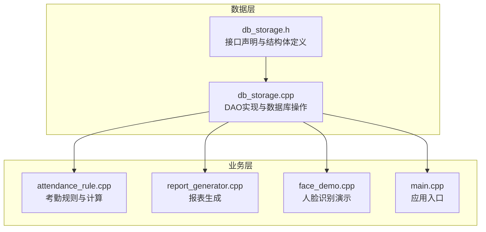
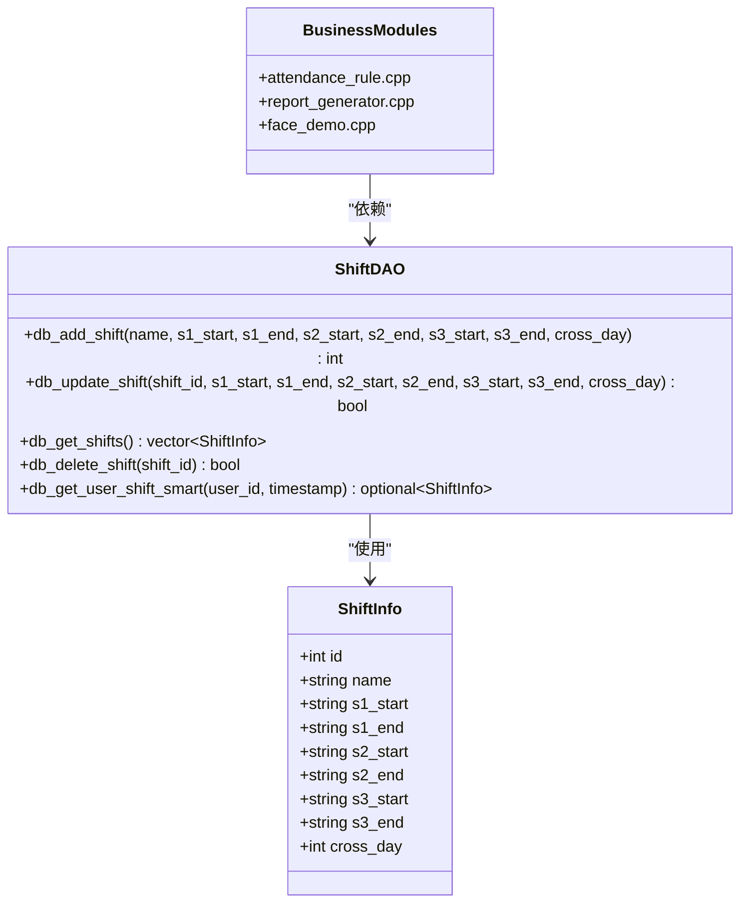
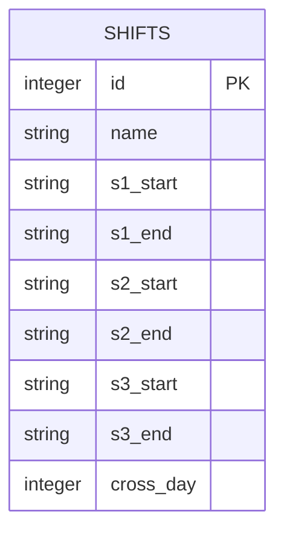
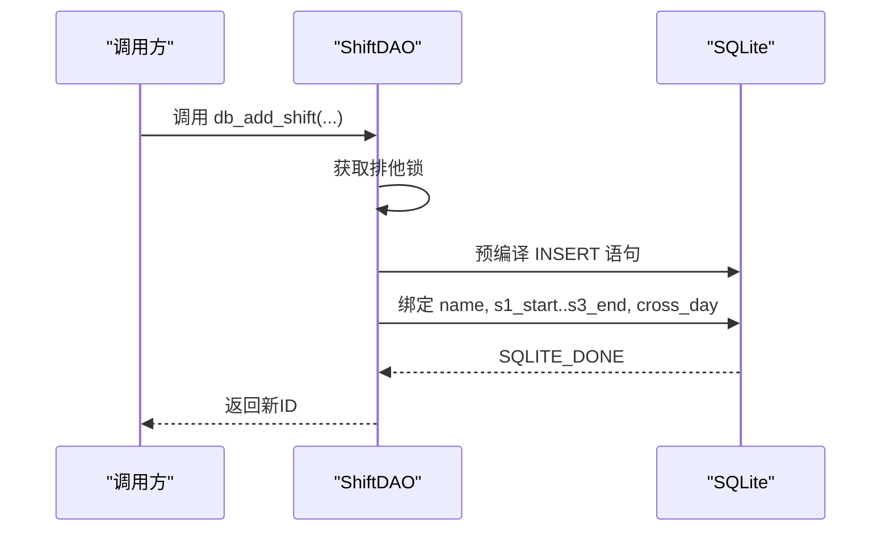
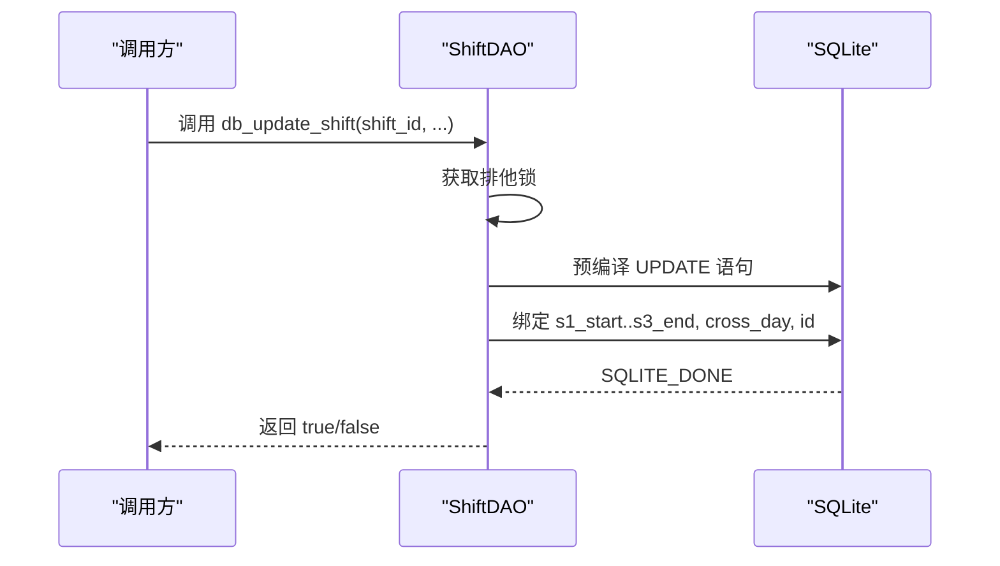
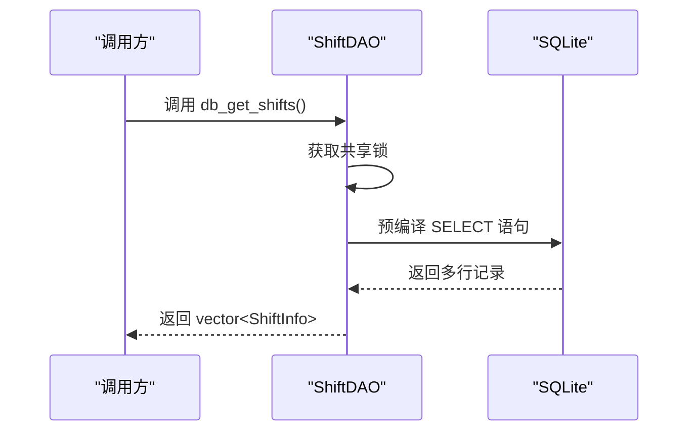
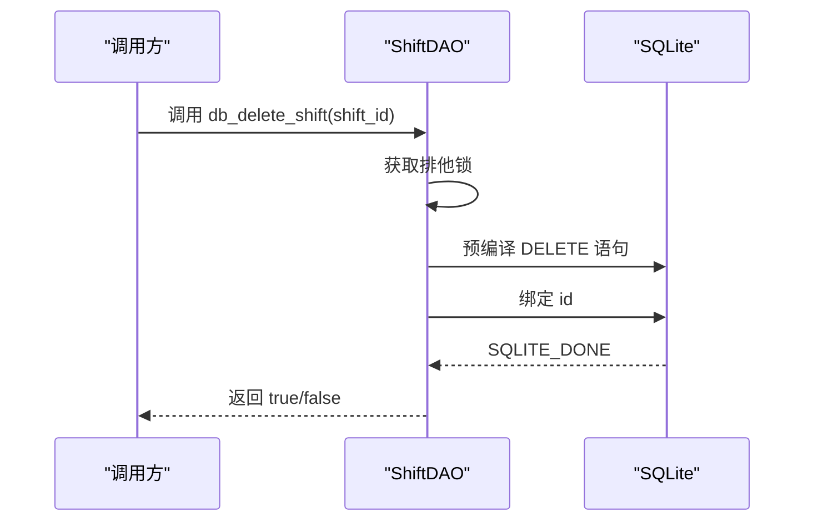
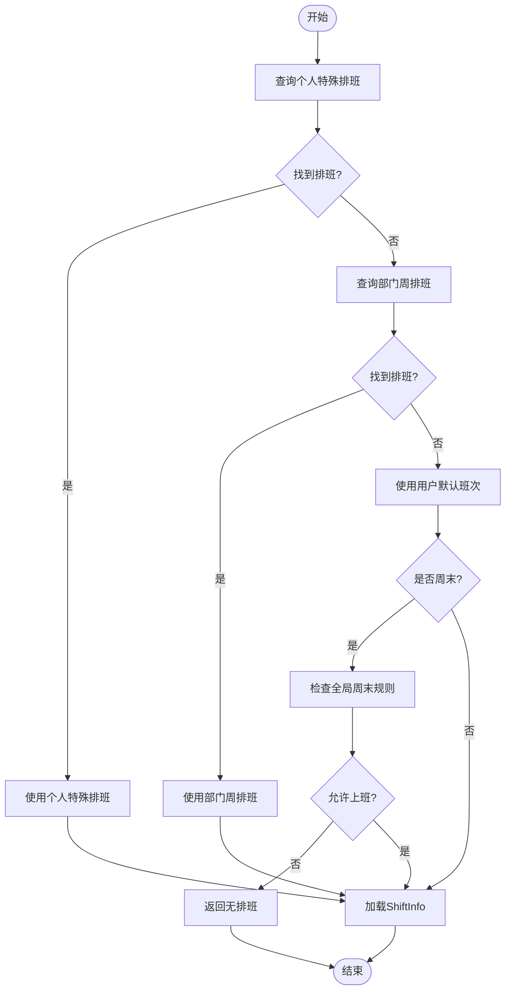
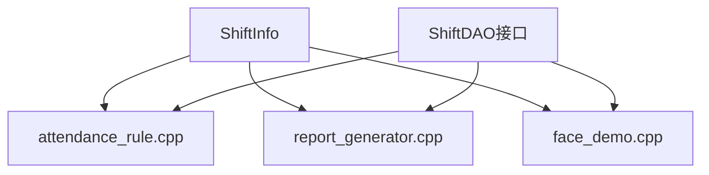

# 班次管理DAO

<cite>
**本文档引用的文件**
- [db_storage.h](file://src/data/db_storage.h)
- [db_storage.cpp](file://src/data/db_storage.cpp)
- [attendance_rule.cpp](file://src/business/attendance_rule.cpp)
- [report_generator.cpp](file://src/business/report_generator.cpp)
- [face_demo.cpp](file://src/business/face_demo.cpp)
- [main.cpp](file://src/main.cpp)
</cite>

## 目录
1. [简介](#简介)
2. [项目结构](#项目结构)
3. [核心组件](#核心组件)
4. [架构概览](#架构概览)
5. [详细组件分析](#详细组件分析)
6. [依赖关系分析](#依赖关系分析)
7. [性能考虑](#性能考虑)
8. [故障排除指南](#故障排除指南)
9. [结论](#结论)
10. [附录](#附录)

## 简介
本文件系统性地文档化了 SmartAttendance 项目中的班次管理DAO模块，重点涵盖以下内容：
- 班次信息管理接口：创建新班次(db_add_shift)、更新班次时间(db_update_shift)、获取班次列表(db_get_shifts)、删除班次(db_delete_shift)等。
- ShiftInfo结构体设计：三个时段(s1/s2/s3)的起止时间、跨天标识等字段的含义与使用。
- 班次管理的业务逻辑：跨天班次处理、时段配置的灵活性、智能排班查询机制。
- 班次配置最佳实践与常见使用场景。
- 班次管理在考勤计算中的核心作用。

## 项目结构
班次管理DAO位于数据层(src/data)，对外提供标准的DAO接口，供业务层调用。相关文件组织如下：
- 数据层头文件：定义ShiftInfo结构体与DAO接口声明
- 数据层实现：实现所有DAO方法，包含数据库表创建、CRUD操作、并发控制与智能排班查询
- 业务层集成：考勤规则、报表生成、人脸识别演示等模块均依赖班次信息进行考勤计算

**图表来源**
- [db_storage.h:18-288](file://src/data/db_storage.h#L18-L288)
- [db_storage.cpp:463-695](file://src/data/db_storage.cpp#L463-L695)
- [attendance_rule.cpp:200-220](file://src/business/attendance_rule.cpp#L200-L220)
- [report_generator.cpp:180-240](file://src/business/report_generator.cpp#L180-L240)
- [face_demo.cpp:830-850](file://src/business/face_demo.cpp#L830-L850)
- [main.cpp:80-85](file://src/main.cpp#L80-L85)

**章节来源**
- [db_storage.h:18-288](file://src/data/db_storage.h#L18-L288)
- [db_storage.cpp:140-339](file://src/data/db_storage.cpp#L140-L339)

## 核心组件
- ShiftInfo结构体：承载单个班次的所有必要信息，包括时段配置与跨天标识，用于考勤计算与报表展示。
- 班次DAO接口：提供创建、更新、查询、删除班次的标准方法，并保证线程安全。
- 智能排班查询：根据个人特殊排班、部门周排班、默认班次以及全局周末规则，确定某天的实际班次。

关键接口与职责：
- db_add_shift：创建新班次，支持最多三个时段与跨天标识。
- db_update_shift：更新现有班次的时段配置与跨天标识。
- db_get_shifts：获取全部班次列表，便于UI展示与管理。
- db_delete_shift：删除指定班次，注意外键约束影响。
- db_get_user_shift_smart：智能排班查询，综合多级排班规则与周末开关。

**章节来源**
- [db_storage.h:33-55](file://src/data/db_storage.h#L33-L55)
- [db_storage.h:238-288](file://src/data/db_storage.h#L238-L288)
- [db_storage.cpp:463-695](file://src/data/db_storage.cpp#L463-L695)
- [db_storage.cpp:1634-1763](file://src/data/db_storage.cpp#L1634-L1763)

## 架构概览
班次管理DAO采用数据访问对象模式，围绕SQLite数据库提供线程安全的CRUD操作，并通过智能排班查询将班次信息与业务规则结合，支撑考勤计算与报表生成。

**图表来源**
- [db_storage.h:33-55](file://src/data/db_storage.h#L33-L55)
- [db_storage.h:238-288](file://src/data/db_storage.h#L238-L288)
- [db_storage.cpp:463-695](file://src/data/db_storage.cpp#L463-L695)
- [db_storage.cpp:1634-1763](file://src/data/db_storage.cpp#L1634-L1763)

## 详细组件分析

### ShiftInfo结构体设计
- 字段说明
  - id：班次ID，数据库自增主键
  - name：班次名称，用于UI展示与识别
  - s1_start/s1_end：时段1的开始与结束时间，格式为"HH:MM"
  - s2_start/s2_end：时段2的开始与结束时间，可为空表示不启用
  - s3_start/s3_end：时段3的开始与结束时间，可为空表示不启用
  - cross_day：跨天标识，0表示当天，1表示次日，用于处理跨天班次
- 设计考量
  - 三个时段的灵活配置满足多种工作制度（如早班、晚班、加班）
  - 跨天标识简化跨天班次的时间比较逻辑
  - 字符串格式统一便于与业务层时间处理保持一致

**图表来源**
- [db_storage.cpp:146-153](file://src/data/db_storage.cpp#L146-L153)

**章节来源**
- [db_storage.h:33-55](file://src/data/db_storage.h#L33-L55)
- [db_storage.cpp:146-153](file://src/data/db_storage.cpp#L146-L153)

### 班次管理DAO接口详解

#### 创建新班次(db_add_shift)
- 功能：向shifts表插入一条新的班次记录，支持最多三个时段与跨天标识
- 并发控制：使用排他锁确保写操作的原子性
- 参数绑定：使用lambda辅助函数绑定字符串参数，空字符串按需求处理
- 返回值：新插入记录的ID，失败返回-1

**图表来源**
- [db_storage.cpp:634-669](file://src/data/db_storage.cpp#L634-L669)

**章节来源**
- [db_storage.cpp:634-669](file://src/data/db_storage.cpp#L634-L669)

#### 更新班次时间(db_update_shift)
- 功能：根据shift_id更新指定班次的时段配置与跨天标识
- 并发控制：使用排他锁保证更新操作的线程安全
- 参数绑定：逐字段绑定，支持部分时段为空的更新场景

**图表来源**
- [db_storage.cpp:465-492](file://src/data/db_storage.cpp#L465-L492)

**章节来源**
- [db_storage.cpp:465-492](file://src/data/db_storage.cpp#L465-L492)

#### 获取班次列表(db_get_shifts)
- 功能：查询所有班次信息，用于UI展示与管理
- 并发控制：使用共享锁保证读操作的并发安全
- 数据提取：逐字段读取并安全处理空值

**图表来源**
- [db_storage.cpp:495-526](file://src/data/db_storage.cpp#L495-L526)

**章节来源**
- [db_storage.cpp:495-526](file://src/data/db_storage.cpp#L495-L526)

#### 删除班次(db_delete_shift)
- 功能：根据shift_id删除对应班次
- 并发控制：使用排他锁保证删除操作的原子性
- 错误处理：捕获并报告执行失败原因

**图表来源**
- [db_storage.cpp:671-695](file://src/data/db_storage.cpp#L671-L695)

**章节来源**
- [db_storage.cpp:671-695](file://src/data/db_storage.cpp#L671-L695)

### 智能排班查询(db_get_user_shift_smart)
- 优先级策略
  1) 个人特殊排班(user_schedule)：最高优先级，管理员手动指定
  2) 部门周排班(dept_schedule)：若无个人特殊排班则查询
  3) 默认班次(users.default_shift_id)：若前两者均无则使用
- 周末规则校验：对于非个人特殊排班的情况，依据全局规则判断周六/周日是否上班
- 返回值：找到班次则返回ShiftInfo，否则返回空

**图表来源**
- [db_storage.cpp:1634-1763](file://src/data/db_storage.cpp#L1634-L1763)

**章节来源**
- [db_storage.cpp:1634-1763](file://src/data/db_storage.cpp#L1634-L1763)

### 跨天班次处理
- cross_day字段用于标识班次是否跨天，0表示当天，1表示次日
- 在考勤计算中，跨天班次的时间比较需要考虑日期变化
- 报表生成与考勤规则模块依赖该字段进行准确的时间判定

**章节来源**
- [db_storage.h:53-54](file://src/data/db_storage.h#L53-L54)
- [db_storage.cpp:1718-1729](file://src/data/db_storage.cpp#L1718-L1729)

### 时段配置的灵活性
- 支持最多三个时段，部分时段可为空，满足不同工作制度
- 时段配置与智能排班查询相结合，实现灵活的排班策略
- 报表生成模块根据时段配置计算迟到、早退等指标

**章节来源**
- [db_storage.h:41-51](file://src/data/db_storage.h#L41-L51)
- [report_generator.cpp:186-232](file://src/business/report_generator.cpp#L186-L232)

## 依赖关系分析
- ShiftInfo作为核心数据载体，在多个业务模块中被广泛使用
- 考勤规则模块依赖ShiftInfo进行迟到、早退等时间计算
- 报表生成模块依赖ShiftInfo进行统计与展示
- 人脸识别演示模块依赖ShiftInfo进行智能匹配与排班展示

**图表来源**
- [db_storage.h:33-55](file://src/data/db_storage.h#L33-L55)
- [attendance_rule.cpp:212-212](file://src/business/attendance_rule.cpp#L212-L212)
- [report_generator.cpp:186-232](file://src/business/report_generator.cpp#L186-L232)
- [face_demo.cpp:836-836](file://src/business/face_demo.cpp#L836-L836)

**章节来源**
- [db_storage.h:33-55](file://src/data/db_storage.h#L33-L55)
- [attendance_rule.cpp:212-212](file://src/business/attendance_rule.cpp#L212-L212)
- [report_generator.cpp:186-232](file://src/business/report_generator.cpp#L186-L232)
- [face_demo.cpp:836-836](file://src/business/face_demo.cpp#L836-L836)

## 性能考虑
- 并发控制：读操作使用共享锁，写操作使用排他锁，平衡并发与一致性
- 预编译语句：高频使用的插入语句预编译，减少解析开销
- 索引优化：为考勤表建立联合索引，加速查询
- 数据类型选择：使用TEXT存储时间字符串，简化业务层处理

## 故障排除指南
- 创建班次失败：检查数据库连接与SQL语法，确认字段绑定正确
- 更新班次异常：确认shift_id存在且未被删除
- 获取班次列表为空：确认数据库初始化完成且存在默认数据
- 智能排班查询无结果：检查个人特殊排班、部门周排班与默认班次配置，以及全局周末规则

**章节来源**
- [db_storage.cpp:679-692](file://src/data/db_storage.cpp#L679-L692)
- [db_storage.cpp:539-542](file://src/data/db_storage.cpp#L539-L542)

## 结论
班次管理DAO模块通过清晰的接口设计与严谨的并发控制，为SmartAttendance系统的考勤计算提供了坚实的数据基础。ShiftInfo结构体的灵活设计与智能排班查询机制，使得系统能够适应多样化的排班需求，并在考勤规则、报表生成等业务场景中发挥核心作用。

## 附录

### 班次配置最佳实践
- 时段设计：根据实际工作制度合理划分时段，避免过多或过少的时段配置
- 跨天标识：跨天班次务必正确设置cross_day，确保时间计算准确
- 智能排班：优先使用个人特殊排班满足临时调整需求，其次使用部门周排班，最后使用默认班次
- 全局规则：合理配置周末规则，确保与企业实际运营情况一致

### 常见使用场景
- 标准班次：适用于朝九晚五的工作制度
- 两班倒：适用于倒班制工作，需要合理设置跨天标识
- 加班时段：针对需要加班的岗位，配置第三时段
- 特殊日期：使用个人特殊排班应对节假日或调休

**章节来源**
- [db_storage.cpp:334-339](file://src/data/db_storage.cpp#L334-L339)
- [db_storage.cpp:1634-1763](file://src/data/db_storage.cpp#L1634-L1763)