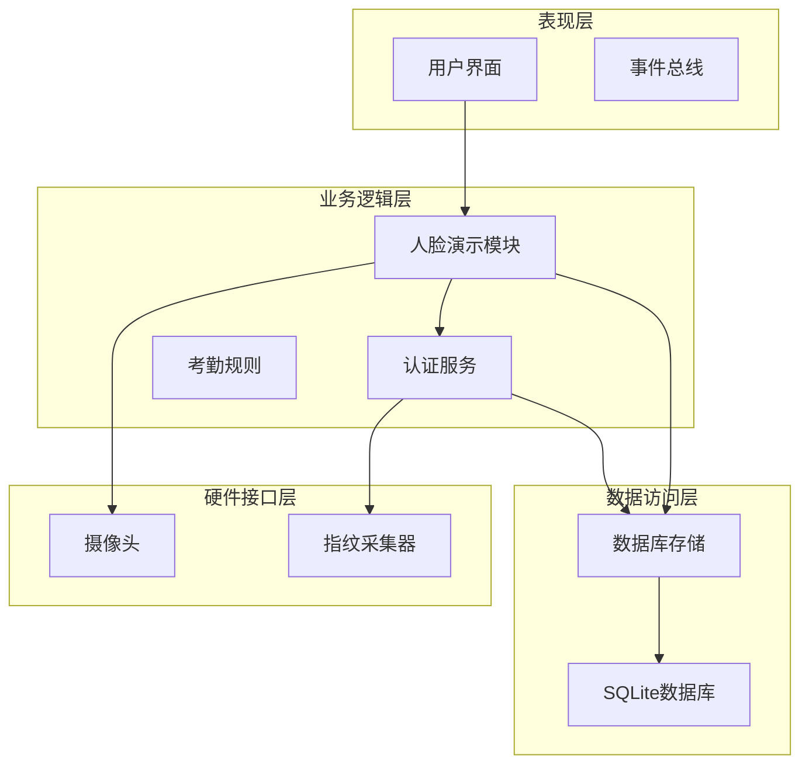
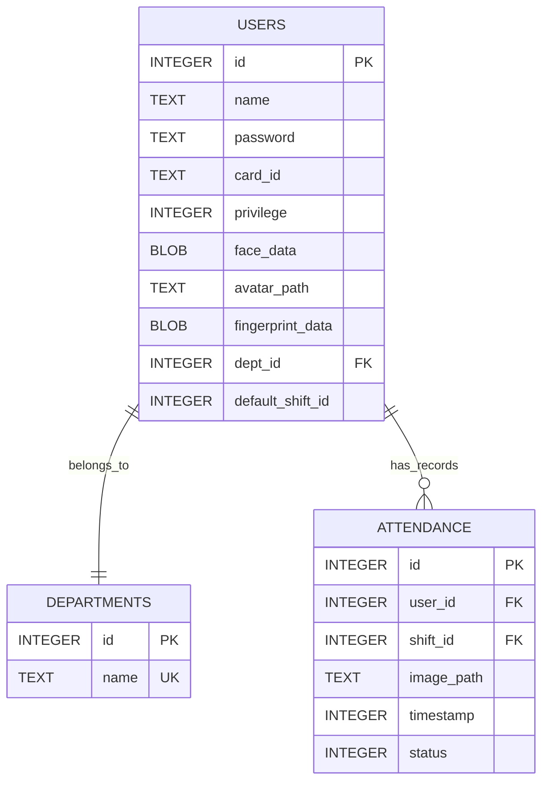
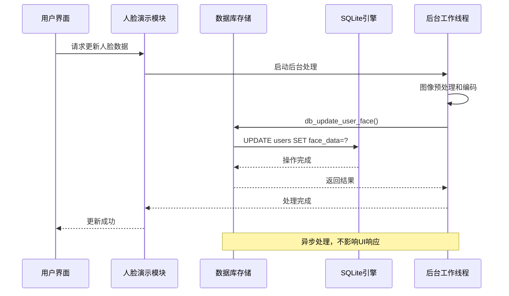
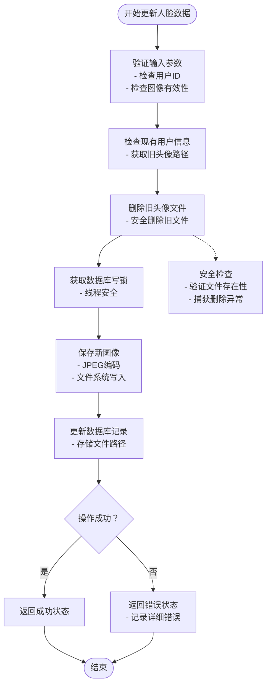
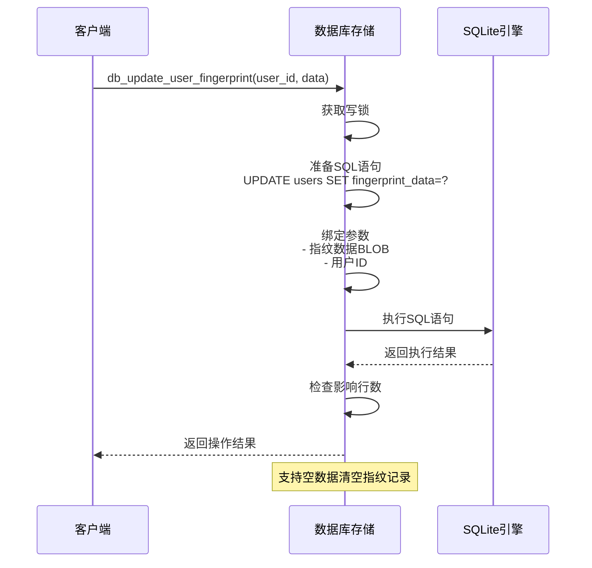
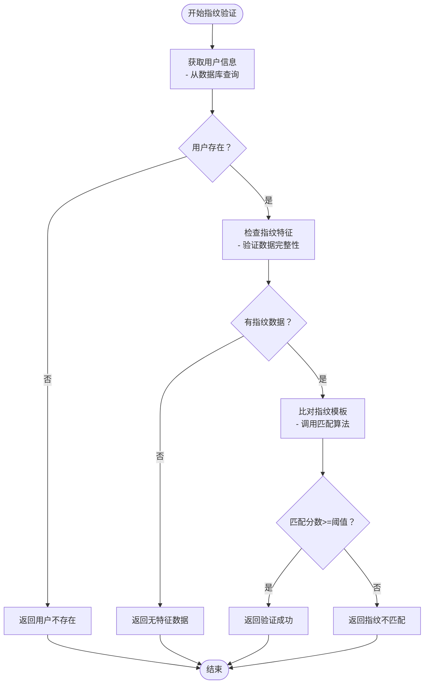
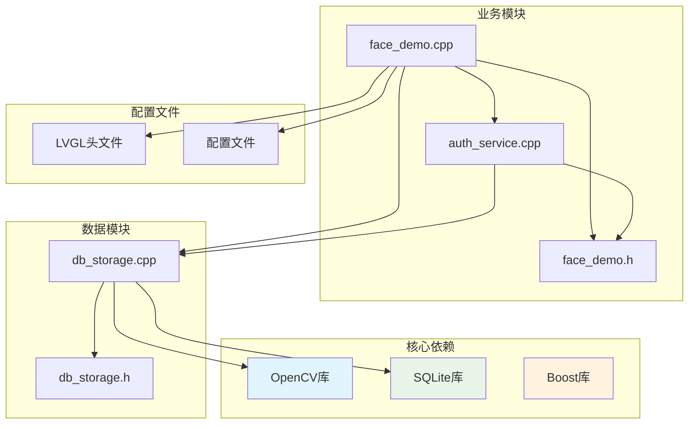

# 生物特征数据管理

<cite>
**本文档引用的文件**
- [db_storage.h](file://src/data/db_storage.h)
- [db_storage.cpp](file://src/data/db_storage.cpp)
- [face_demo.h](file://src/business/face_demo.h)
- [face_demo.cpp](file://src/business/face_demo.cpp)
- [auth_service.h](file://src/business/auth_service.h)
- [auth_service.cpp](file://src/business/auth_service.cpp)
</cite>

## 目录
1. [简介](#简介)
2. [项目结构](#项目结构)
3. [核心组件](#核心组件)
4. [架构概览](#架构概览)
5. [详细组件分析](#详细组件分析)
6. [依赖关系分析](#依赖关系分析)
7. [性能考虑](#性能考虑)
8. [故障排除指南](#故障排除指南)
9. [结论](#结论)

## 简介

本文档详细说明了智能考勤系统中的生物特征数据管理系统。系统实现了人脸特征和指纹特征的完整数据管理流程，包括数据存储格式、安全策略、隐私保护措施以及性能优化方案。

系统采用SQLite数据库作为核心存储引擎，结合OpenCV进行图像处理和特征提取。生物特征数据以二进制格式存储在数据库的BLOB字段中，确保数据的完整性和安全性。

## 项目结构

智能考勤系统采用分层架构设计，主要分为以下层次：

**图表来源**
- [face_demo.cpp:559-684](file://src/business/face_demo.cpp#L559-L684)
- [auth_service.cpp:9-37](file://src/business/auth_service.cpp#L9-L37)
- [db_storage.cpp:108-285](file://src/data/db_storage.cpp#L108-L285)

**章节来源**
- [face_demo.cpp:559-684](file://src/business/face_demo.cpp#L559-L684)
- [db_storage.cpp:108-285](file://src/data/db_storage.cpp#L108-L285)

## 核心组件

### 数据存储结构

系统使用SQLite数据库存储所有用户信息和生物特征数据，核心表结构如下：

**图表来源**
- [db_storage.cpp:181-207](file://src/data/db_storage.cpp#L181-L207)

### 生物特征数据格式

系统支持两种主要的生物特征数据格式：

1. **人脸特征数据**：存储为JPEG格式的二进制数据（BLOB）
2. **指纹特征数据**：存储为原始二进制模板数据（BLOB）

**章节来源**
- [db_storage.cpp:188-191](file://src/data/db_storage.cpp#L188-L191)
- [db_storage.h:130-139](file://src/data/db_storage.h#L130-L139)

## 架构概览

系统采用多线程架构，确保实时性和响应性：

**图表来源**
- [face_demo.cpp:1174-1213](file://src/business/face_demo.cpp#L1174-L1213)
- [db_storage.cpp:1128-1192](file://src/data/db_storage.cpp#L1128-L1192)

## 详细组件分析

### 人脸特征数据管理

#### db_update_user_face接口实现

人脸特征数据的更新流程包含完整的图像处理和存储机制：

**图表来源**
- [db_storage.cpp:1128-1192](file://src/data/db_storage.cpp#L1128-L1192)

#### 图像处理和存储流程

系统采用OpenCV进行图像处理，具体流程如下：

1. **图像预处理**：将BGR图像转换为灰度图像
2. **格式转换**：使用JPEG编码压缩图像数据
3. **文件存储**：将处理后的图像保存到本地文件系统
4. **数据库更新**：更新用户记录中的头像路径

**章节来源**
- [db_storage.cpp:69-89](file://src/data/db_storage.cpp#L69-L89)
- [db_storage.cpp:1128-1192](file://src/data/db_storage.cpp#L1128-L1192)

### 指纹特征数据管理

#### db_update_user_fingerprint接口实现

指纹特征数据的更新采用二进制直接存储方式：

**图表来源**
- [db_storage.cpp:1218-1262](file://src/data/db_storage.cpp#L1218-L1262)

#### 指纹数据存储策略

指纹数据采用直接二进制存储，具有以下特点：

- **存储格式**：原始二进制模板数据
- **存储位置**：SQLite BLOB字段
- **数据完整性**：通过SQLite事务保证一致性
- **性能优化**：使用预编译语句提高执行效率

**章节来源**
- [db_storage.cpp:1218-1262](file://src/data/db_storage.cpp#L1218-L1262)
- [db_storage.h:405-412](file://src/data/db_storage.h#L405-L412)

### 认证服务集成

#### 指纹验证流程

认证服务提供了完整的指纹验证机制：

**图表来源**
- [auth_service.cpp:42-69](file://src/business/auth_service.cpp#L42-L69)

**章节来源**
- [auth_service.cpp:42-69](file://src/business/auth_service.cpp#L42-L69)
- [auth_service.h:33-39](file://src/business/auth_service.h#L33-L39)

## 依赖关系分析

系统各组件之间的依赖关系如下：

**图表来源**
- [face_demo.cpp:1-30](file://src/business/face_demo.cpp#L1-L30)
- [db_storage.cpp:7-22](file://src/data/db_storage.cpp#L7-L22)

**章节来源**
- [face_demo.cpp:1-30](file://src/business/face_demo.cpp#L1-L30)
- [db_storage.cpp:7-22](file://src/data/db_storage.cpp#L7-L22)

## 性能考虑

### 数据库性能优化

系统采用了多项SQLite性能优化策略：

1. **WAL模式**：启用Write-Ahead Logging模式提升并发性能
2. **预编译语句**：缓存常用SQL语句减少解析开销
3. **共享锁机制**：使用shared_mutex实现读写分离
4. **索引优化**：为常用查询建立复合索引

### 图像处理优化

人脸图像处理采用多线程异步处理：

1. **后台处理**：图像处理在独立线程中执行
2. **跳帧检测**：通过跳帧减少CPU负载
3. **内存管理**：合理使用智能指针避免内存泄漏
4. **缓存机制**：维护用户列表和识别模型缓存

### 存储优化

1. **文件系统分离**：将图像文件和数据库分离存储
2. **压缩存储**：人脸图像采用JPEG压缩
3. **清理机制**：定期清理过期的打卡图片
4. **路径管理**：统一管理图像文件路径

**章节来源**
- [db_storage.cpp:123-135](file://src/data/db_storage.cpp#L123-L135)
- [face_demo.cpp:293-551](file://src/business/face_demo.cpp#L293-L551)

## 故障排除指南

### 常见问题及解决方案

#### 数据库连接问题

**症状**：系统启动时无法连接数据库
**原因**：数据库文件损坏或权限不足
**解决方案**：
1. 检查数据库文件是否存在
2. 验证文件读写权限
3. 使用SQLite命令行工具检查数据库完整性

#### 图像存储失败

**症状**：人脸数据更新失败
**原因**：磁盘空间不足或文件系统权限问题
**解决方案**：
1. 检查磁盘空间和权限
2. 验证AVATAR_DIR目录可写性
3. 检查OpenCV图像编码功能

#### 指纹数据读取异常

**症状**：指纹验证总是失败
**原因**：指纹数据格式不正确或匹配算法问题
**解决方案**：
1. 验证指纹数据完整性
2. 检查指纹SDK集成
3. 调整匹配阈值参数

**章节来源**
- [db_storage.cpp:1130-1133](file://src/data/db_storage.cpp#L1130-L1133)
- [auth_service.cpp:56-58](file://src/business/auth_service.cpp#L56-L58)

## 结论

智能考勤系统的生物特征数据管理模块实现了人脸和指纹特征的完整生命周期管理。系统采用SQLite作为存储引擎，结合OpenCV进行图像处理，在保证数据安全性的前提下实现了高效的性能表现。

主要特点包括：

1. **安全存储**：生物特征数据以二进制格式加密存储
2. **高性能**：多线程架构和数据库优化确保实时响应
3. **可扩展性**：模块化设计便于功能扩展和维护
4. **可靠性**：完善的错误处理和恢复机制

该系统为智能考勤应用提供了坚实的技术基础，能够满足企业级应用的需求。