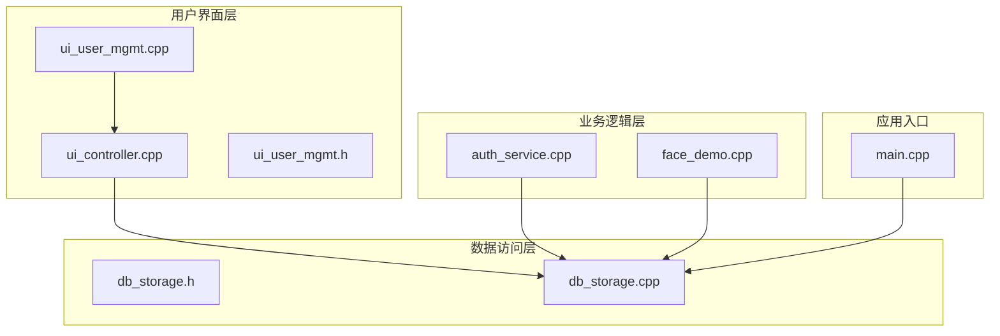
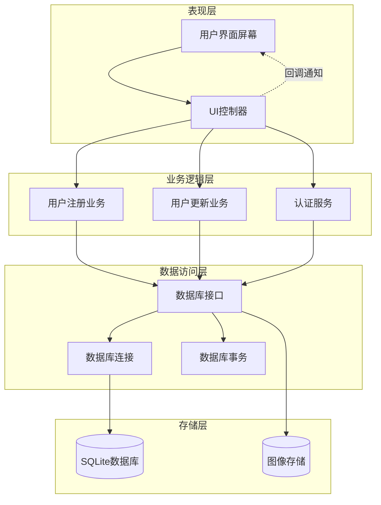
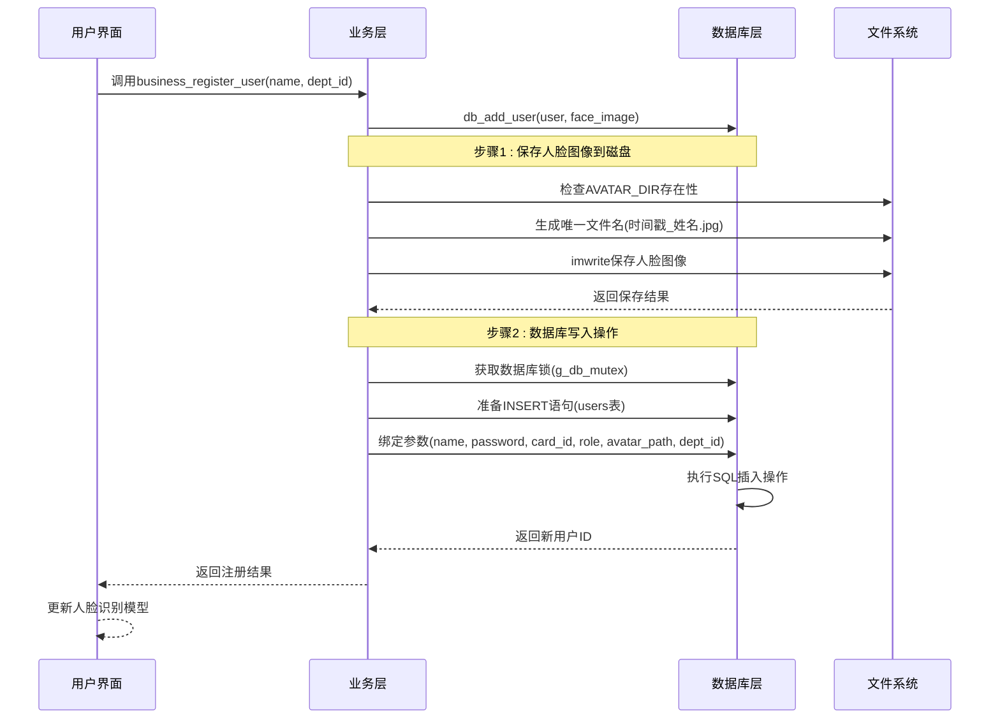
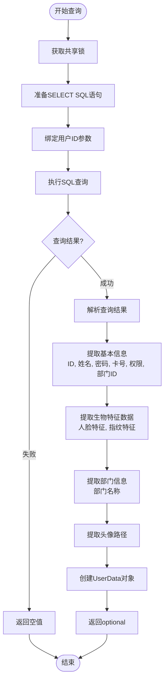
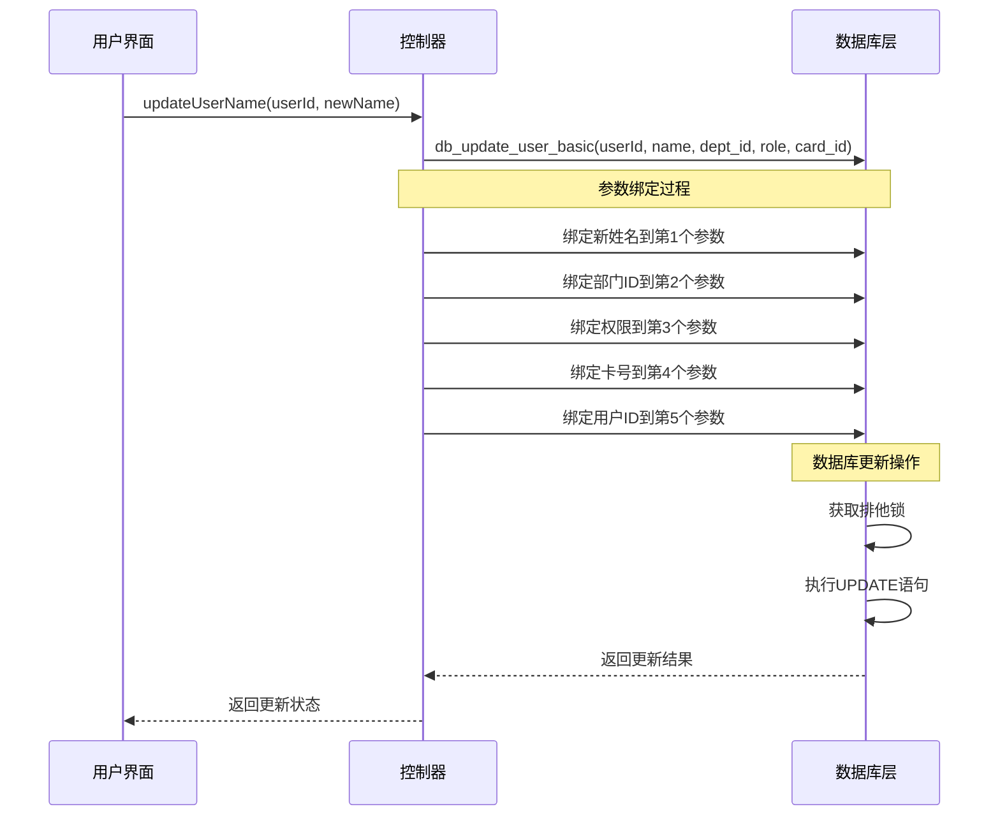
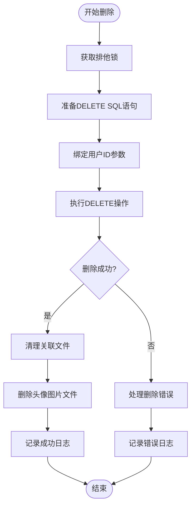
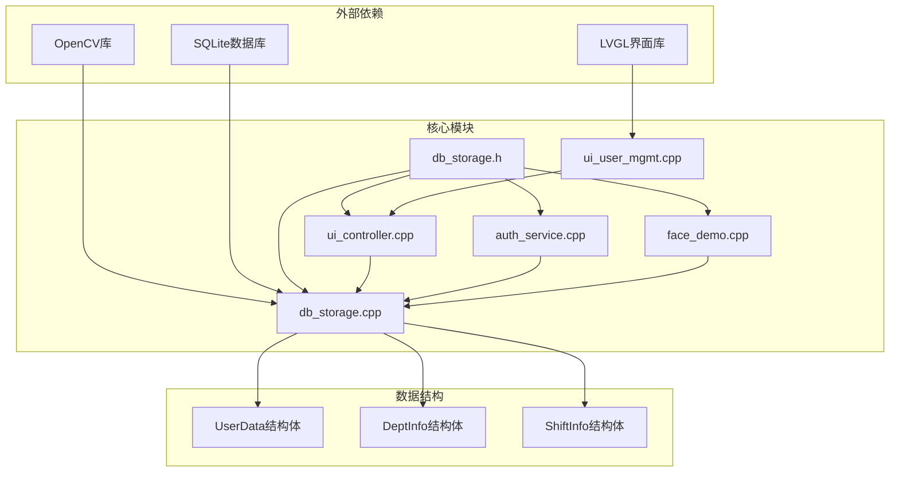
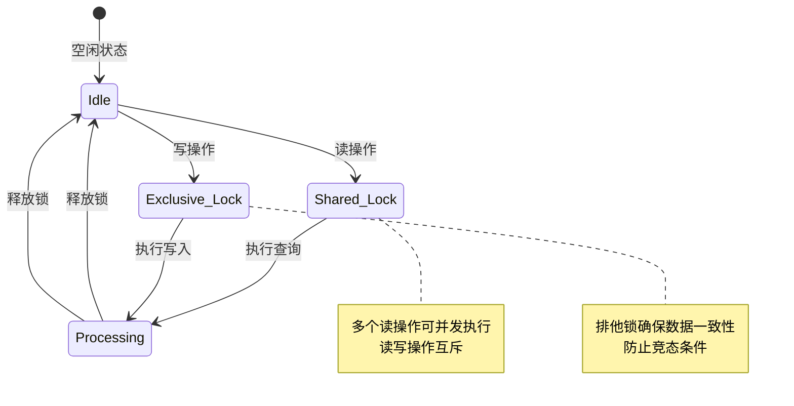

# 用户基本信息管理

<cite>
**本文档引用的文件**
- [db_storage.h](file://src/data/db_storage.h)
- [db_storage.cpp](file://src/data/db_storage.cpp)
- [ui_user_mgmt.h](file://src/ui/screens/user_mgmt/ui_user_mgmt.h)
- [ui_user_mgmt.cpp](file://src/ui/screens/user_mgmt/ui_user_mgmt.cpp)
- [ui_controller.cpp](file://src/ui/ui_controller.cpp)
- [auth_service.h](file://src/business/auth_service.h)
- [auth_service.cpp](file://src/business/auth_service.cpp)
- [face_demo.cpp](file://src/business/face_demo.cpp)
- [main.cpp](file://src/main.cpp)
</cite>

## 目录
1. [简介](#简介)
2. [项目结构](#项目结构)
3. [核心组件](#核心组件)
4. [架构概览](#架构概览)
5. [详细组件分析](#详细组件分析)
6. [依赖关系分析](#依赖关系分析)
7. [性能考虑](#性能考虑)
8. [故障排除指南](#故障排除指南)
9. [结论](#结论)

## 简介

SmartAttendance项目是一个基于OpenCV和SQLite的智能考勤管理系统。本文档专注于用户基本信息管理模块，详细说明用户基本数据的CRUD操作，包括用户注册、用户信息查询、用户信息更新、用户删除等接口。重点解释UserData结构体中基本信息字段的设计，包括姓名、密码、卡号、角色、部门ID等。

该系统采用分层架构设计，将用户界面层、业务逻辑层和数据访问层清晰分离，确保代码的可维护性和扩展性。用户管理功能涵盖了完整的用户生命周期管理，从用户注册到信息维护再到删除清理。

## 项目结构

SmartAttendance项目的用户管理相关文件分布如下：

**图表来源**
- [ui_controller.cpp:1-417](file://src/ui/ui_controller.cpp#L1-L417)
- [db_storage.h:1-596](file://src/data/db_storage.h#L1-L596)
- [db_storage.cpp:1-2171](file://src/data/db_storage.cpp#L1-L2171)

**章节来源**
- [db_storage.h:1-596](file://src/data/db_storage.h#L1-L596)
- [ui_user_mgmt.h:1-74](file://src/ui/screens/user_mgmt/ui_user_mgmt.h#L1-L74)

## 核心组件

### UserData结构体设计

UserData结构体是用户管理的核心数据模型，包含以下基本信息字段：

| 字段名称 | 类型 | 描述 | 约束条件 |
|---------|------|------|----------|
| id | int | 工号/用户ID | 数据库自增主键，唯一标识 |
| name | string | 姓名 | 支持中英文，必填 |
| password | string | 登录密码 | 用于输入验证，可为空 |
| card_id | string | IC/ID卡号 | 用于刷卡验证，可为空 |
| role | int | 权限等级 | 0: 普通员工, 1: 管理员 |
| dept_id | int | 所属部门ID | 关联DeptInfo.id，可为空 |
| default_shift_id | int | 默认班次ID | 绑定的默认班次ID |
| dept_name | string | 部门名称 | 用于UI显示和报表，非数据库字段 |
| face_feature | vector<uchar> | 人脸特征数据 | 二进制流，存储编码后的JPG数据 |
| avatar_path | string | 注册员工的人脸图片路径 | 人脸图片路径 |
| fingerprint_feature | vector<uint8_t> | 指纹特征数据 | 二进制流 |

### 用户管理接口概览

系统提供了完整的用户管理接口，涵盖以下核心功能：

1. **用户注册** - db_add_user(): 注册新用户并保存人脸图像
2. **用户查询** - db_get_user_info(): 获取单个用户详情
3. **用户更新** - db_update_user_basic(): 更新用户基本信息
4. **用户删除** - db_delete_user(): 删除用户及其关联数据

**章节来源**
- [db_storage.h:104-142](file://src/data/db_storage.h#L104-L142)
- [db_storage.h:315-420](file://src/data/db_storage.h#L315-L420)

## 架构概览

用户管理模块采用三层架构设计，确保关注点分离和代码的可维护性：

**图表来源**
- [ui_controller.cpp:232-289](file://src/ui/ui_controller.cpp#L232-L289)
- [db_storage.cpp:748-803](file://src/data/db_storage.cpp#L748-L803)
- [auth_service.cpp:9-37](file://src/business/auth_service.cpp#L9-L37)

## 详细组件分析

### 用户注册流程 (db_add_user)

用户注册是用户管理的核心流程，涉及人脸图像处理和数据库写入两个主要步骤：

**图表来源**
- [face_demo.cpp:1079-1155](file://src/business/face_demo.cpp#L1079-L1155)
- [db_storage.cpp:748-803](file://src/data/db_storage.cpp#L748-L803)

#### 注册流程详细步骤

1. **人脸图像保存**：
   - 检查AVATAR_DIR目录是否存在，不存在则创建
   - 生成基于时间戳和用户名的唯一文件名
   - 使用OpenCV的imwrite函数保存人脸图像到JPG格式

2. **数据库事务处理**：
   - 获取共享互斥锁(g_db_mutex)确保线程安全
   - 准备INSERT SQL语句，包含用户基本信息
   - 绑定所有参数：姓名、密码、卡号、权限、头像路径、部门ID
   - 执行SQL插入操作并返回新生成的用户ID

3. **模型更新**：
   - 将新用户添加到人脸识别模型中
   - 保存更新后的模型到XML文件

**章节来源**
- [db_storage.cpp:748-803](file://src/data/db_storage.cpp#L748-L803)
- [face_demo.cpp:1079-1155](file://src/business/face_demo.cpp#L1079-L1155)

### 用户信息查询 (db_get_user_info)

用户信息查询接口提供灵活的数据检索能力：

**图表来源**
- [db_storage.cpp:906-977](file://src/data/db_storage.cpp#L906-L977)

#### 查询优化策略

1. **延迟加载机制**：
   - 默认不加载BLOB类型的二进制数据，避免不必要的内存占用
   - 仅在需要时才加载人脸特征和指纹特征数据

2. **关联查询优化**：
   - 使用LEFT JOIN获取部门名称，避免额外的查询调用
   - 通过单次查询获取完整的用户信息

**章节来源**
- [db_storage.cpp:906-977](file://src/data/db_storage.cpp#L906-L977)

### 用户信息更新 (db_update_user_basic)

用户信息更新接口支持部分字段的修改：

**图表来源**
- [ui_controller.cpp:233-245](file://src/ui/ui_controller.cpp#L233-L245)
- [db_storage.cpp:1096-1125](file://src/data/db_storage.cpp#L1096-L1125)

#### 更新策略特点

1. **选择性更新**：
   - 支持仅更新特定字段，其他字段保持不变
   - 通过dept_id > 0判断是否更新部门信息

2. **数据完整性**：
   - 使用排他锁确保更新操作的原子性
   - 支持NULL值处理，允许字段为空

**章节来源**
- [ui_controller.cpp:233-282](file://src/ui/ui_controller.cpp#L233-L282)
- [db_storage.cpp:1096-1125](file://src/data/db_storage.cpp#L1096-L1125)

### 用户删除 (db_delete_user)

用户删除操作采用级联删除策略：

**图表来源**
- [db_storage.cpp:979-992](file://src/data/db_storage.cpp#L979-L992)

#### 删除安全保障

1. **级联删除**：
   - 删除用户时自动删除其关联的考勤记录
   - 确保数据库的参照完整性

2. **文件清理**：
   - 删除用户头像图片文件
   - 防止垃圾文件积累

**章节来源**
- [db_storage.cpp:979-992](file://src/data/db_storage.cpp#L979-L992)

## 依赖关系分析

用户管理模块的依赖关系体现了清晰的分层架构：

**图表来源**
- [db_storage.h:10-15](file://src/data/db_storage.h#L10-L15)
- [ui_controller.cpp:1-417](file://src/ui/ui_controller.cpp#L1-L417)

### 关键依赖关系

1. **数据访问层依赖**：
   - db_storage.cpp依赖OpenCV进行图像处理
   - 使用SQLite进行数据持久化存储
   - 通过共享互斥锁实现线程安全

2. **界面层集成**：
   - UI控制器通过db_get_user_info获取用户数据
   - 用户管理屏幕通过UI控制器调用业务功能
   - 认证服务依赖用户信息进行身份验证

3. **业务逻辑封装**：
   - 业务层封装复杂的业务逻辑
   - 为界面层提供简化的API接口
   - 处理用户注册时的模型更新

**章节来源**
- [db_storage.h:10-15](file://src/data/db_storage.h#L10-L15)
- [ui_user_mgmt.cpp:1307-1640](file://src/ui/screens/user_mgmt/ui_user_mgmt.cpp#L1307-L1640)

## 性能考虑

### 线程安全机制

系统采用共享互斥锁(g_db_mutex)确保数据库操作的线程安全：

**图表来源**
- [db_storage.cpp:770-771](file://src/data/db_storage.cpp#L770-L771)

### 性能优化策略

1. **延迟加载机制**：
   - 默认不加载BLOB类型的二进制数据
   - 仅在需要时才加载人脸特征和指纹特征

2. **批量操作支持**：
   - 提供db_batch_add_users接口支持批量导入
   - 使用SQLite事务提高批量操作性能

3. **内存管理优化**：
   - 使用移动语义避免不必要的数据复制
   - 合理的内存分配策略

**章节来源**
- [db_storage.cpp:806-904](file://src/data/db_storage.cpp#L806-L904)
- [db_storage.cpp:1265-1292](file://src/data/db_storage.cpp#L1265-L1292)

## 故障排除指南

### 常见问题及解决方案

#### 用户注册失败

**问题症状**：
- db_add_user返回-1
- 控制台输出错误信息

**可能原因**：
1. 数据库连接失败
2. SQL语句执行错误
3. 文件系统权限问题

**解决步骤**：
1. 检查数据库文件权限
2. 验证AVATAR_DIR目录可写性
3. 确认用户ID唯一性

#### 用户信息查询异常

**问题症状**：
- db_get_user_info返回空值
- optional<UserData>为空

**排查方法**：
1. 验证用户ID是否存在
2. 检查数据库连接状态
3. 确认SQL查询语句正确性

#### 并发访问冲突

**问题症状**：
- 数据库操作出现死锁
- 线程阻塞

**预防措施**：
1. 确保正确使用共享互斥锁
2. 避免长时间持有锁
3. 合理设计事务边界

**章节来源**
- [db_storage.cpp:748-803](file://src/data/db_storage.cpp#L748-L803)
- [db_storage.cpp:906-977](file://src/data/db_storage.cpp#L906-L977)

### 调试技巧

1. **日志记录**：
   - 在关键操作处添加详细日志
   - 记录SQL执行时间和错误信息

2. **单元测试**：
   - 为每个接口编写独立测试
   - 测试边界条件和异常情况

3. **性能监控**：
   - 监控数据库查询性能
   - 分析内存使用情况

## 结论

SmartAttendance项目的用户基本信息管理模块展现了良好的软件工程实践。通过清晰的分层架构、完善的线程安全机制和优化的性能策略，实现了稳定可靠的用户管理功能。

### 主要优势

1. **架构清晰**：三层架构设计确保了代码的可维护性和扩展性
2. **线程安全**：采用共享互斥锁机制保证多线程环境下的数据一致性
3. **性能优化**：延迟加载、批量操作等策略提升了系统性能
4. **安全性考虑**：文件清理、级联删除等机制确保数据完整性

### 改进建议

1. **密码安全**：建议实现密码哈希存储，提升系统安全性
2. **输入验证**：增强用户输入的数据验证和清理机制
3. **错误处理**：完善异常处理和错误恢复机制
4. **监控告警**：增加系统运行状态监控和告警功能

该用户管理模块为整个SmartAttendance系统的稳定运行奠定了坚实基础，为后续功能扩展提供了良好的技术支撑。