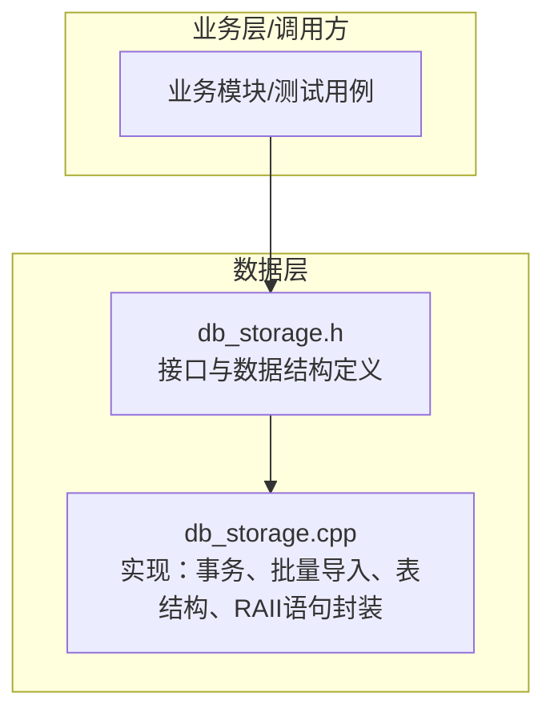
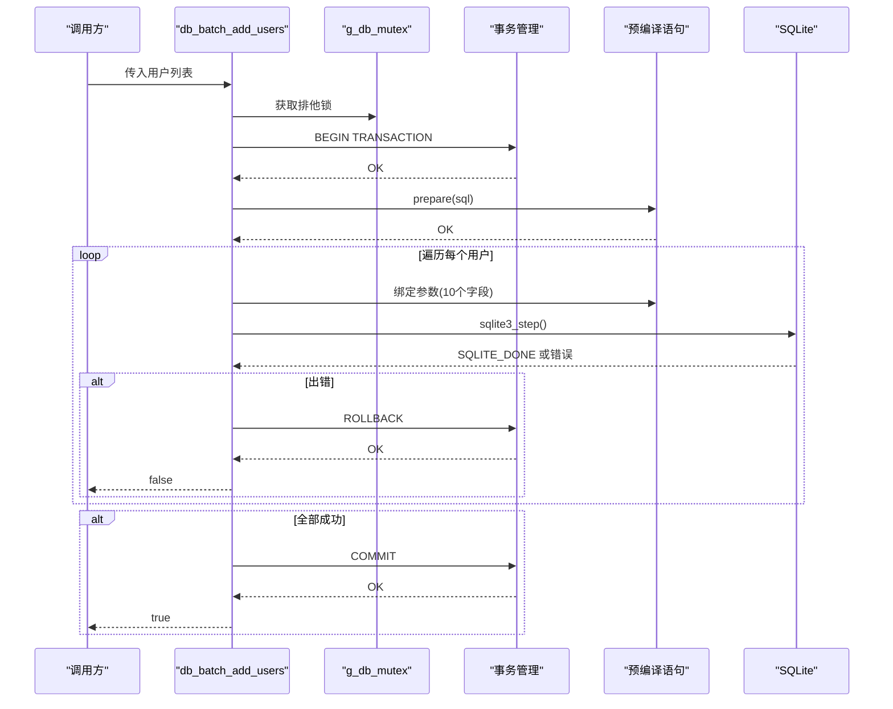
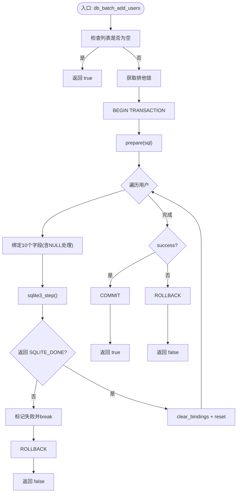
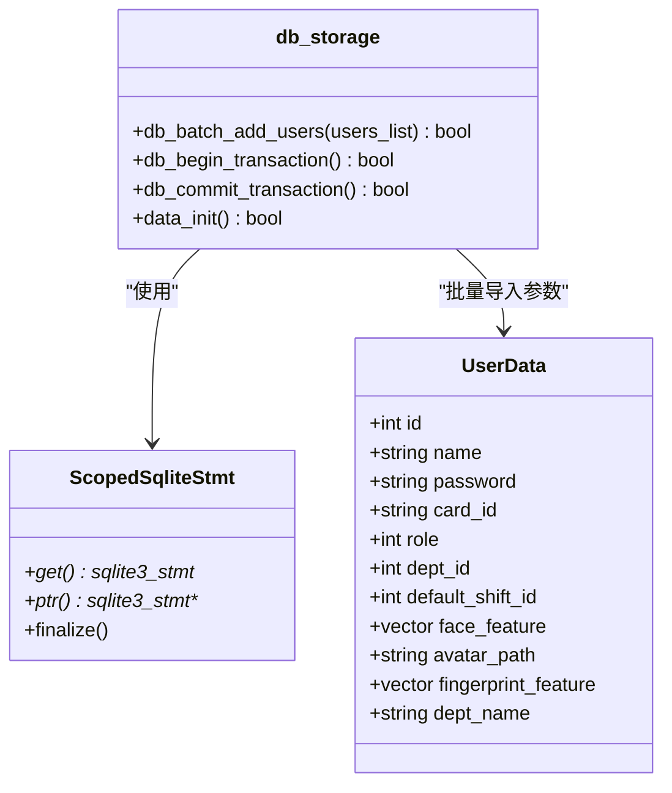
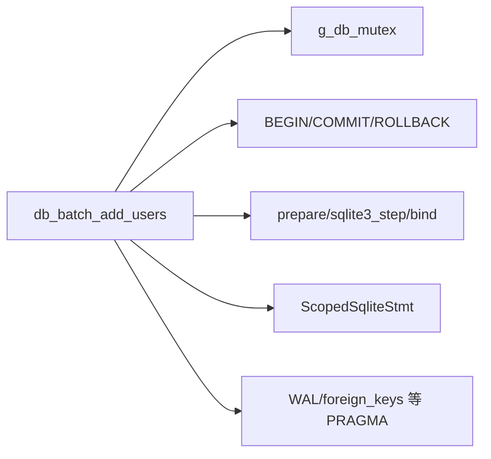

# 用户批量操作

<cite>
**本文引用的文件**
- [db_storage.cpp](file://src/data/db_storage.cpp)
- [db_storage.h](file://src/data/db_storage.h)
</cite>

## 目录
1. [简介](#简介)
2. [项目结构](#项目结构)
3. [核心组件](#核心组件)
4. [架构总览](#架构总览)
5. [详细组件分析](#详细组件分析)
6. [依赖关系分析](#依赖关系分析)
7. [性能考量](#性能考量)
8. [故障排查指南](#故障排查指南)
9. [结论](#结论)
10. [附录](#附录)

## 简介
本文件聚焦于 SmartAttendance 项目中的“用户批量操作”，重点围绕 db_batch_add_users 接口的实现机制进行系统化说明。内容涵盖：
- 事务处理与数据一致性保障
- 错误回滚策略
- 性能优化技术（SQLite 事务加速、批量插入优化）
- 批量导入的数据格式要求、数据验证规则、冲突处理机制
- 最佳实践与常见问题解决方案
- db_batch_add_users 接口的完整实现解析（事务管理、错误处理、性能优化）

## 项目结构
与批量用户导入相关的关键文件位于数据层模块，核心为数据库访问与事务控制：
- 数据层头文件：定义数据结构与对外接口（含 db_batch_add_users 声明）
- 数据层实现：包含数据库初始化、表结构创建、事务接口、批量导入实现等

图表来源
- [db_storage.h:326-332](file://src/data/db_storage.h#L326-L332)
- [db_storage.cpp:805-904](file://src/data/db_storage.cpp#L805-L904)

章节来源
- [db_storage.h:104-142](file://src/data/db_storage.h#L104-L142)
- [db_storage.h:326-332](file://src/data/db_storage.h#L326-L332)
- [db_storage.cpp:108-135](file://src/data/db_storage.cpp#L108-L135)

## 核心组件
- 数据结构：UserData（用户完整信息，包含 id、name、password、card_id、role、dept_id、default_shift_id、face_feature、avatar_path、fingerprint_feature 等）
- 批量导入接口：db_batch_add_users(users_list)
- 事务接口：db_begin_transaction()/db_commit_transaction()（通用事务封装）
- 数据库初始化与性能优化：data_init() 中的 PRAGMA 设置与表结构创建
- 线程安全：全局共享互斥锁 g_db_mutex（读写分离）

章节来源
- [db_storage.h:104-142](file://src/data/db_storage.h#L104-L142)
- [db_storage.h:326-332](file://src/data/db_storage.h#L326-L332)
- [db_storage.cpp:108-135](file://src/data/db_storage.cpp#L108-L135)
- [db_storage.cpp:1540-1552](file://src/data/db_storage.cpp#L1540-L1552)

## 架构总览
db_batch_add_users 的调用链路如下：
- 输入：std::vector<UserData>（批量用户数据）
- 控制流：加锁 → 开启事务 → 预编译 SQL → 循环绑定并执行 → 成功提交，失败回滚
- 输出：布尔值（全部成功返回 true，中途失败返回 false）

图表来源
- [db_storage.cpp:805-904](file://src/data/db_storage.cpp#L805-L904)
- [db_storage.cpp:820-832](file://src/data/db_storage.cpp#L820-L832)
- [db_storage.cpp:881-892](file://src/data/db_storage.cpp#L881-L892)
- [db_storage.cpp:894-901](file://src/data/db_storage.cpp#L894-L901)

## 详细组件分析

### db_batch_add_users 接口实现解析
- 输入参数：std::vector<UserData>& users_list
- 返回值：bool（全部成功为 true）
- 关键步骤：
  1) 空列表短路：空列表直接返回 true
  2) 加锁：使用 std::unique_lock<std::shared_mutex> 获取排他锁，避免与并发读写冲突
  3) 开启事务：执行 BEGIN TRANSACTION，开启批量写入加速
  4) 预编译 SQL：使用 INSERT OR REPLACE INTO users(...)，覆盖更新或新增
  5) 循环绑定与执行：
     - 绑定 10 个字段：id、name、password、card_id、privilege、face_data、avatar_path、fingerprint_data、dept_id、default_shift_id
     - 对空字符串/空二进制数据绑定 NULL，确保兼容性
     - 每次执行后 clear_bindings/reset，避免状态污染
     - 任一用户执行失败立即 break 并标记失败
  6) 提交或回滚：根据 success 标记执行 COMMIT 或 ROLLBACK

图表来源
- [db_storage.cpp:805-904](file://src/data/db_storage.cpp#L805-L904)
- [db_storage.cpp:820-832](file://src/data/db_storage.cpp#L820-L832)
- [db_storage.cpp:836-892](file://src/data/db_storage.cpp#L836-L892)
- [db_storage.cpp:894-901](file://src/data/db_storage.cpp#L894-L901)

章节来源
- [db_storage.cpp:805-904](file://src/data/db_storage.cpp#L805-L904)

### 事务管理与数据一致性
- 事务开启：在批量导入前执行 BEGIN TRANSACTION，显著降低磁盘写放大，提高吞吐
- 一致性策略：INSERT OR REPLACE 语义，若 id 已存在则覆盖更新，否则新增
- 失败回滚：任一用户写入失败即触发 ROLLBACK，保证原子性
- 成功提交：全部成功后 COMMIT，持久化变更

章节来源
- [db_storage.cpp:812-818](file://src/data/db_storage.cpp#L812-L818)
- [db_storage.cpp:820-832](file://src/data/db_storage.cpp#L820-L832)
- [db_storage.cpp:894-901](file://src/data/db_storage.cpp#L894-L901)

### 错误处理与回滚策略
- 预处理失败：prepare 失败立即记录错误并执行 ROLLBACK，返回 false
- 执行失败：单条 sqlite3_step() 非 SQLITE_DONE 时记录错误并 break
- 回滚策略：统一使用 ROLLBACK，确保数据一致性
- 日志输出：包含失败用户 id 与 sqlite3_errmsg(db)，便于定位

章节来源
- [db_storage.cpp:828-832](file://src/data/db_storage.cpp#L828-L832)
- [db_storage.cpp:882-887](file://src/data/db_storage.cpp#L882-L887)
- [db_storage.cpp:898-901](file://src/data/db_storage.cpp#L898-L901)

### 数据格式要求与验证规则
- 必填字段：id（工号）、name（姓名）
- 可选字段：password、card_id、privilege、face_data、avatar_path、fingerprint_data、dept_id、default_shift_id
- 空值处理：
  - 字符串类（password、card_id、name）为空时绑定 NULL
  - 二进制类（face_data、fingerprint_data）为空时绑定 NULL
  - 数值类（dept_id、default_shift_id）≤0 时绑定 NULL
- 冲突处理：INSERT OR REPLACE，按 id 覆盖更新；若 id 不存在则新增
- 外键约束：dept_id、default_shift_id 通过外键关联，无效值将导致约束失败

章节来源
- [db_storage.cpp:836-892](file://src/data/db_storage.cpp#L836-L892)
- [db_storage.cpp:823-825](file://src/data/db_storage.cpp#L823-L825)

### 性能优化技术
- SQLite 事务加速：批量导入前开启事务，避免每条语句单独提交带来的 I/O 放大
- 预编译语句：prepare 一次，循环多次绑定/执行，减少 SQL 解析成本
- 语句状态管理：每次循环后 clear_bindings + reset，避免状态残留
- 数据库性能 PRAGMA：
  - WAL 模式：提升并发读写性能
  - synchronous=NORMAL：兼顾安全与性能
  - temp_store=MEMORY：临时表/索引放内存
  - cache_size：增大缓存
  - foreign_keys=ON：启用外键约束
- 线程安全：全局共享互斥锁 g_db_mutex，写操作使用排他锁，读写互斥

章节来源
- [db_storage.cpp:123-135](file://src/data/db_storage.cpp#L123-L135)
- [db_storage.cpp:812-818](file://src/data/db_storage.cpp#L812-L818)
- [db_storage.cpp:889-892](file://src/data/db_storage.cpp#L889-L892)
- [db_storage.cpp:35](file://src/data/db_storage.cpp#L35-L37)

### 类与数据模型关系

图表来源
- [db_storage.h:104-142](file://src/data/db_storage.h#L104-L142)
- [db_storage.h:326-332](file://src/data/db_storage.h#L326-L332)
- [db_storage.cpp:42-65](file://src/data/db_storage.cpp#L42-L65)

## 依赖关系分析
- db_batch_add_users 依赖：
  - g_db_mutex：全局互斥锁，保证并发安全
  - SQLite：事务、prepare/step、bind、PRAGMA
  - ScopedSqliteStmt：RAII 封装，避免泄漏与重复释放
- 内部耦合：
  - 与 data_init() 的 PRAGMA 设置协同，确保 WAL、foreign_keys 等配置生效
  - 与 INSERT OR REPLACE 语义配合，实现幂等导入
- 外部依赖：
  - OpenCV（仅在用户注册时用于人脸图像保存，批量导入不依赖）

图表来源
- [db_storage.cpp:805-904](file://src/data/db_storage.cpp#L805-L904)
- [db_storage.cpp:123-135](file://src/data/db_storage.cpp#L123-L135)
- [db_storage.cpp:42-65](file://src/data/db_storage.cpp#L42-L65)

章节来源
- [db_storage.cpp:123-135](file://src/data/db_storage.cpp#L123-L135)
- [db_storage.cpp:805-904](file://src/data/db_storage.cpp#L805-L904)

## 性能考量
- 事务批处理：批量导入使用事务显著降低磁盘写放大，提升吞吐
- 预编译语句：prepare 一次，多次执行，减少解析与编译开销
- 语句状态复用：clear_bindings + reset，避免状态污染与额外开销
- 数据库 PRAGMA：WAL、synchronous、temp_store、cache_size、foreign_keys 等综合优化
- 线程安全：写操作使用排他锁，避免并发写竞争

章节来源
- [db_storage.cpp:123-135](file://src/data/db_storage.cpp#L123-L135)
- [db_storage.cpp:812-818](file://src/data/db_storage.cpp#L812-L818)
- [db_storage.cpp:889-892](file://src/data/db_storage.cpp#L889-L892)

## 故障排查指南
- 症状：批量导入返回 false
  - 可能原因：prepare 失败、某用户执行失败、事务开启失败
  - 处理建议：查看日志中包含的用户 id 与 sqlite3_errmsg(db)，定位具体失败点；检查数据格式与空值处理
- 症状：部分用户未导入
  - 可能原因：中间某条执行失败触发 break 与回滚
  - 处理建议：逐条校验用户数据，确保 id 唯一、dept_id/default_shift_id 有效
- 症状：导入后发现数据未更新
  - 可能原因：INSERT OR REPLACE 仅在 id 存在时覆盖；若 id 不存在则新增
  - 处理建议：确认 id 是否正确；如需强制覆盖，确保 id 已存在于数据库
- 症状：并发写入冲突
  - 可能原因：多线程同时写入
  - 处理建议：使用统一入口调用 db_batch_add_users；确保外部不再并发写 users 表

章节来源
- [db_storage.cpp:828-832](file://src/data/db_storage.cpp#L828-L832)
- [db_storage.cpp:882-887](file://src/data/db_storage.cpp#L882-L887)
- [db_storage.cpp:898-901](file://src/data/db_storage.cpp#L898-L901)

## 结论
db_batch_add_users 通过“事务 + 预编译 + 循环绑定 + 明确回滚”的组合，实现了高可靠、高性能的用户批量导入能力。其设计遵循以下原则：
- 原子性：事务包裹，失败即回滚
- 一致性：INSERT OR REPLACE 幂等更新
- 高性能：事务批处理、语句复用、数据库 PRAGMA 优化
- 可维护性：RAII 封装、清晰的日志与错误处理

## 附录
- 数据结构参考：UserData 字段定义与用途
- 接口参考：db_batch_add_users 声明与行为说明
- 事务接口：db_begin_transaction()/db_commit_transaction()（通用事务封装）

章节来源
- [db_storage.h:104-142](file://src/data/db_storage.h#L104-L142)
- [db_storage.h:326-332](file://src/data/db_storage.h#L326-L332)
- [db_storage.cpp:1540-1552](file://src/data/db_storage.cpp#L1540-L1552)