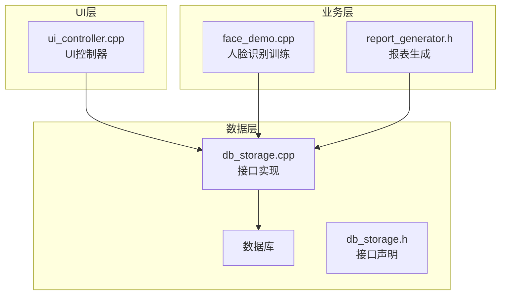
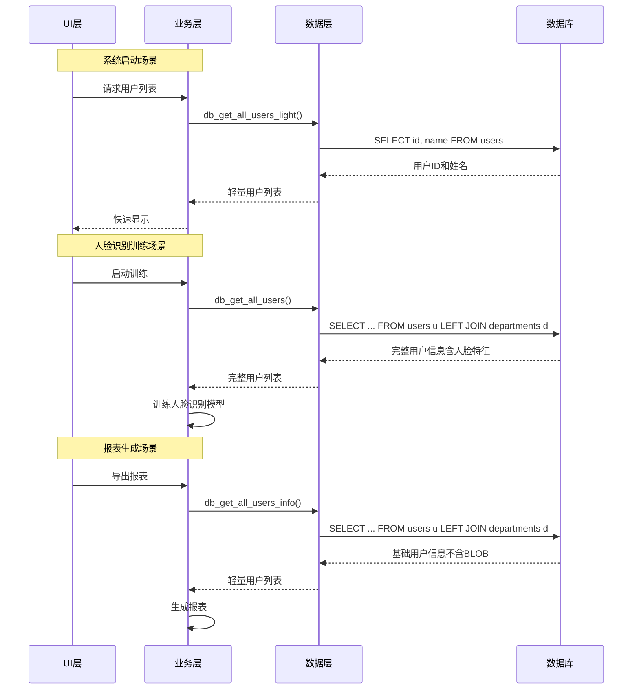
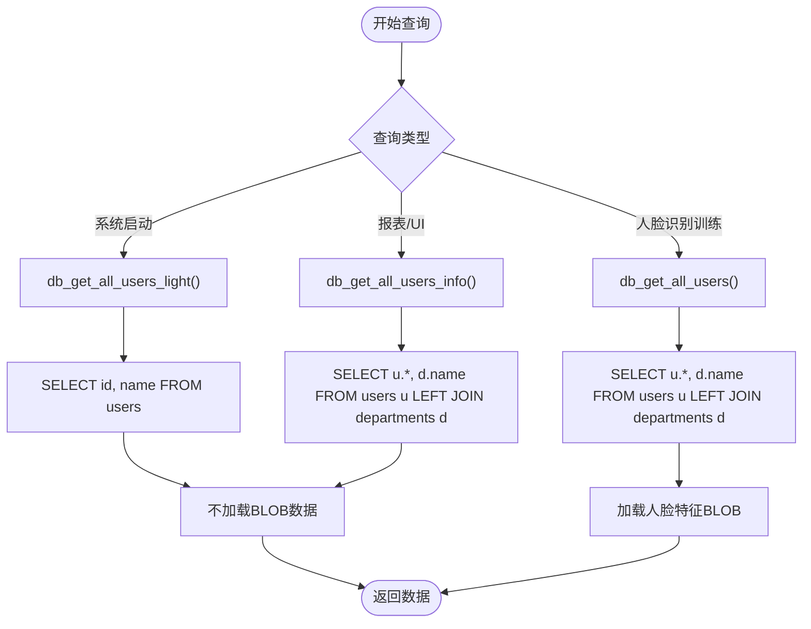
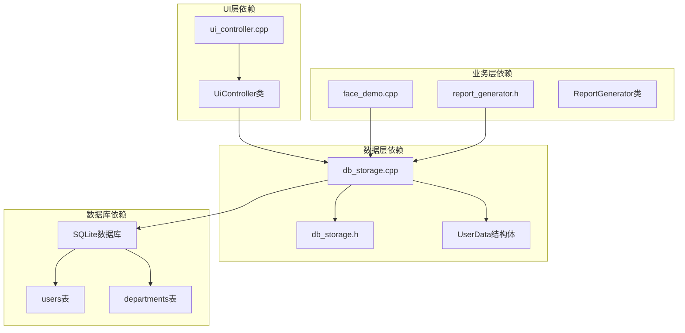

# 用户查询接口

<cite>
**本文档引用的文件**
- [db_storage.h](file://src/data/db_storage.h)
- [db_storage.cpp](file://src/data/db_storage.cpp)
- [face_demo.cpp](file://src/business/face_demo.cpp)
- [report_generator.h](file://src/business/report_generator.h)
- [ui_controller.cpp](file://src/ui/ui_controller.cpp)
</cite>

## 目录
1. [简介](#简介)
2. [项目结构](#项目结构)
3. [核心组件](#核心组件)
4. [架构概览](#架构概览)
5. [详细组件分析](#详细组件分析)
6. [依赖关系分析](#依赖关系分析)
7. [性能考虑](#性能考虑)
8. [故障排除指南](#故障排除指南)
9. [结论](#结论)

## 简介
本文档详细说明SmartAttendance项目中的用户查询接口设计与实现，重点涵盖以下三种不同粒度的查询方法：
- db_get_all_users(): 获取用户完整信息，包含人脸特征数据（BLOB）
- db_get_all_users_info(): 获取用户基础信息（用于报表和UI列表）
- db_get_all_users_light(): 获取用户轻量信息（仅ID和姓名）

文档还解释了用户数据的懒加载策略（默认不加载人脸特征BLOB以优化性能），提供了查询接口的选择指南和性能优化建议，并说明了用户查询在系统启动和人脸识别训练中的应用。

## 项目结构
用户查询接口位于数据层（db_storage），并通过业务层和UI层进行调用。整体架构采用分层设计，数据层负责与数据库交互，业务层负责业务逻辑处理，UI层负责用户界面展示。

**图表来源**
- [db_storage.h:315-420](file://src/data/db_storage.h#L315-L420)
- [db_storage.cpp:994-1292](file://src/data/db_storage.cpp#L994-L1292)
- [face_demo.cpp:587-667](file://src/business/face_demo.cpp#L587-L667)
- [report_generator.h:190-192](file://src/business/report_generator.h#L190-L192)
- [ui_controller.cpp:139-149](file://src/ui/ui_controller.cpp#L139-L149)

**章节来源**
- [db_storage.h:1-596](file://src/data/db_storage.h#L1-L596)
- [db_storage.cpp:994-1292](file://src/data/db_storage.cpp#L994-L1292)

## 核心组件
用户查询接口的核心组件包括三个主要函数，分别对应不同的数据粒度：

### UserData结构体
UserData是用户信息的核心数据结构，包含以下关键字段：
- 基础信息：id、name、password、card_id、role、dept_id、default_shift_id
- 部门信息：dept_name（通过联表查询获得）
- 生物特征：face_feature（人脸特征数据，二进制流）、fingerprint_feature（指纹特征数据）
- 位置信息：position（职位信息）
- 头像路径：avatar_path（注册员工的人脸图片路径）

### 三种查询接口对比

| 接口名称 | 数据粒度 | BLOB字段 | 主要用途 | 性能特点 |
|---------|---------|---------|---------|---------|
| db_get_all_users() | 完整信息 | 包含人脸特征 | 人脸识别训练、完整用户管理 | 高内存占用，适合离线处理 |
| db_get_all_users_info() | 基础信息 | 不包含BLOB | 报表生成、UI列表显示 | 轻量级，适合在线显示 |
| db_get_all_users_light() | 最小信息 | 不包含BLOB | 系统启动、ID映射表构建 | 极轻量，启动最快 |

**章节来源**
- [db_storage.h:104-142](file://src/data/db_storage.h#L104-L142)
- [db_storage.h:355-419](file://src/data/db_storage.h#L355-L419)

## 架构概览
用户查询接口采用懒加载策略，通过不同的SQL查询语句来控制数据加载的粒度。这种设计确保了在不同场景下能够选择最适合的查询方式。

**图表来源**
- [face_demo.cpp:587-667](file://src/business/face_demo.cpp#L587-L667)
- [report_generator.h:190-192](file://src/business/report_generator.h#L190-L192)
- [ui_controller.cpp:139-149](file://src/ui/ui_controller.cpp#L139-L149)

## 详细组件分析

### db_get_all_users() - 完整信息查询
db_get_all_users()接口用于获取用户的完整信息，特别适用于人脸识别训练场景。

#### 实现特点
- 使用LEFT JOIN查询用户表和部门表
- 包含所有用户字段，包括敏感的生物特征数据
- 人脸特征数据作为BLOB字段直接加载到内存
- 适用于需要完整用户信息的离线处理场景

#### 性能分析
- 内存占用较高：需要加载所有用户的BLOB数据
- 适合批量处理而非实时查询
- 在人脸识别训练中提供完整的样本数据

**章节来源**
- [db_storage.cpp:994-1041](file://src/data/db_storage.cpp#L994-L1041)

### db_get_all_users_info() - 基础信息查询
db_get_all_users_info()接口专为报表和UI列表设计，提供轻量级的用户信息查询。

#### 实现特点
- 查询包含部门名称的用户信息
- 不包含人脸特征等大型BLOB数据
- 适合在线显示和报表生成
- 减少了网络传输和内存占用

#### 性能优势
- 内存占用低：避免加载BLOB数据
- 响应速度快：查询语句简单，数据量小
- 适合高频访问场景

**章节来源**
- [db_storage.h:358-363](file://src/data/db_storage.h#L358-L363)

### db_get_all_users_light() - 轻量信息查询
db_get_all_users_light()接口是性能最优的查询方式，仅获取最基本的用户信息。

#### 实现特点
- 仅查询用户ID和姓名两个字段
- 绝对不加载任何BLOB数据
- 用于系统启动时快速构建ID映射表
- 启动速度最快

#### 应用场景
- 系统启动时快速加载用户映射
- UI列表页面的快速显示
- 需要最小数据量的场景

**章节来源**
- [db_storage.cpp:1265-1292](file://src/data/db_storage.cpp#L1265-L1292)

### 懒加载策略实现
系统采用了智能的懒加载策略，通过不同的查询接口来控制数据加载的粒度。

**图表来源**
- [db_storage.cpp:994-1041](file://src/data/db_storage.cpp#L994-L1041)
- [db_storage.cpp:1265-1292](file://src/data/db_storage.cpp#L1265-L1292)

**章节来源**
- [db_storage.cpp:994-1292](file://src/data/db_storage.cpp#L994-L1292)

## 依赖关系分析
用户查询接口的依赖关系体现了清晰的分层架构设计。

**图表来源**
- [ui_controller.cpp:139-149](file://src/ui/ui_controller.cpp#L139-L149)
- [face_demo.cpp:587-667](file://src/business/face_demo.cpp#L587-L667)
- [report_generator.h:190-192](file://src/business/report_generator.h#L190-L192)
- [db_storage.h:315-420](file://src/data/db_storage.h#L315-L420)

**章节来源**
- [ui_controller.cpp:139-166](file://src/ui/ui_controller.cpp#L139-L166)
- [face_demo.cpp:587-667](file://src/business/face_demo.cpp#L587-L667)
- [report_generator.h:190-192](file://src/business/report_generator.h#L190-L192)

## 性能考虑
用户查询接口在设计时充分考虑了性能优化，采用了多种策略来提升系统响应速度和资源利用率。

### 锁机制优化
- 读操作使用共享锁（shared_lock），允许多个读操作并发执行
- 写操作使用独占锁（unique_lock），确保数据一致性
- 在人脸识别训练场景中，完整用户查询使用共享锁保护

### 查询优化策略
- **懒加载**：默认不加载BLOB数据，减少内存占用
- **按需查询**：根据不同场景选择最合适的查询接口
- **预编译语句**：使用预编译的SQL语句提高执行效率

### 内存管理
- 使用智能指针和RAII模式管理数据库连接
- 避免不必要的数据复制和转换
- 及时释放不再使用的内存资源

## 故障排除指南
在使用用户查询接口时，可能会遇到以下常见问题：

### 查询性能问题
**症状**：系统响应缓慢，特别是在人脸识别训练时
**解决方案**：
- 确认使用了合适的查询接口
- 检查数据库索引是否完善
- 考虑分批处理大量数据

### 内存溢出问题
**症状**：系统内存使用过高
**解决方案**：
- 避免在UI显示场景使用db_get_all_users()
- 使用db_get_all_users_info()替代
- 及时释放不再使用的用户数据

### 数据完整性问题
**症状**：查询结果不完整或出现NULL值
**解决方案**：
- 检查数据库连接状态
- 确认用户表和部门表的关联关系
- 验证数据的一致性

**章节来源**
- [db_storage.cpp:994-1041](file://src/data/db_storage.cpp#L994-L1041)
- [db_storage.cpp:1265-1292](file://src/data/db_storage.cpp#L1265-L1292)

## 结论
SmartAttendance项目的用户查询接口设计体现了良好的软件工程实践，通过懒加载策略和多粒度查询接口，实现了性能与功能的平衡。三种查询接口各有明确的应用场景：

1. **db_get_all_users_light()**：适用于系统启动和快速显示场景，提供最快的响应速度
2. **db_get_all_users_info()**：适用于报表生成和UI列表显示，提供轻量级的数据访问
3. **db_get_all_users()**：适用于人脸识别训练等需要完整数据的场景

这种设计不仅提升了系统的整体性能，还为未来的扩展和维护奠定了良好的基础。通过合理的接口选择和使用，可以有效避免性能瓶颈，确保系统在高负载情况下仍能保持稳定的响应速度。