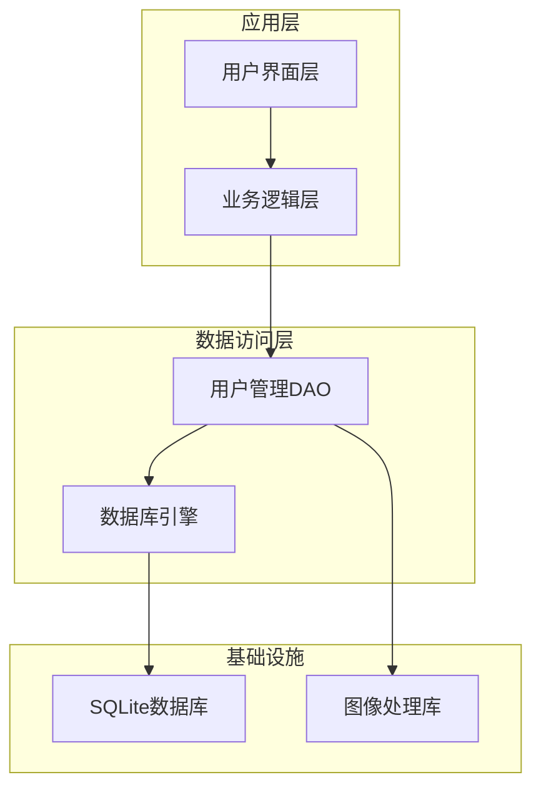
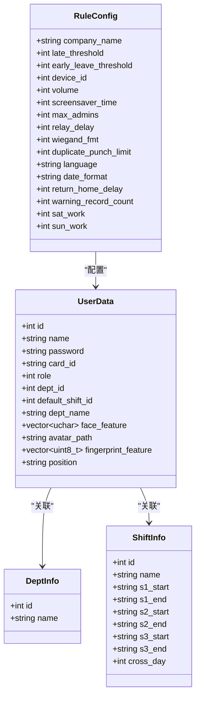
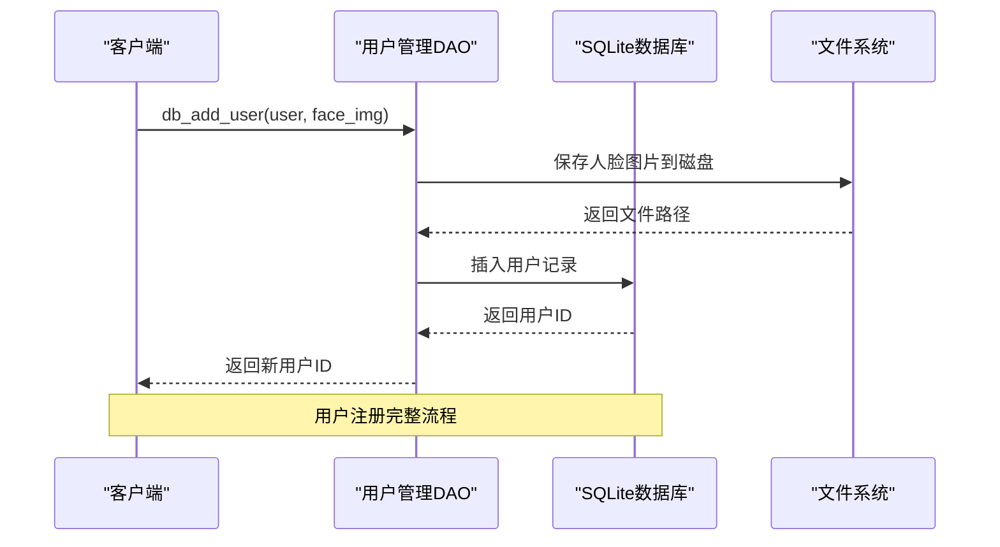
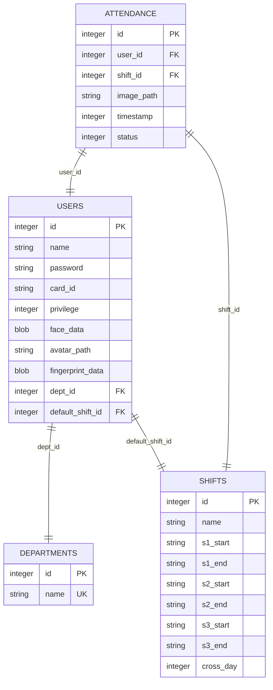
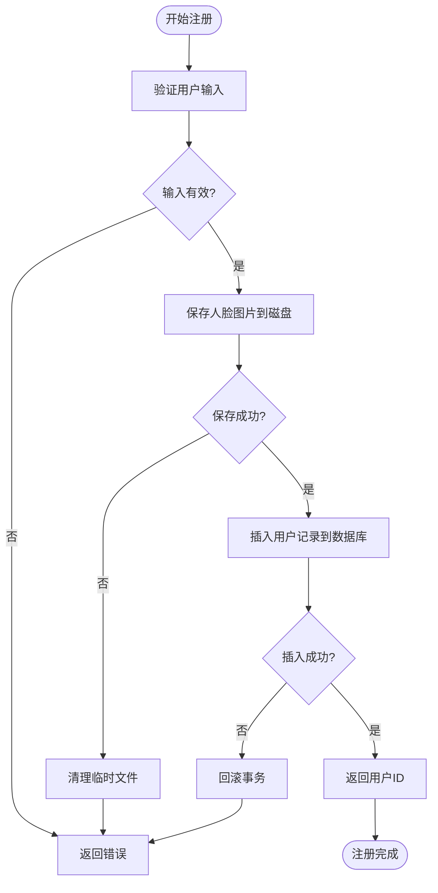
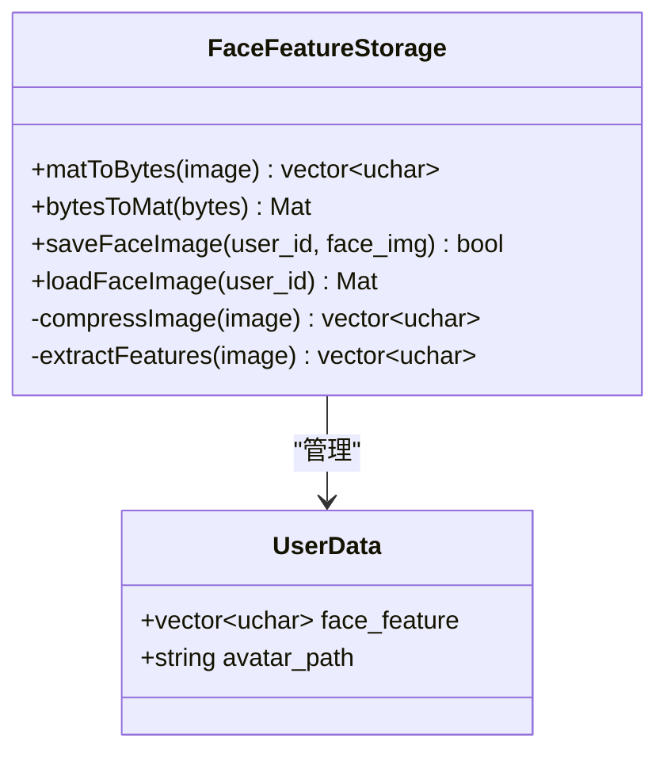
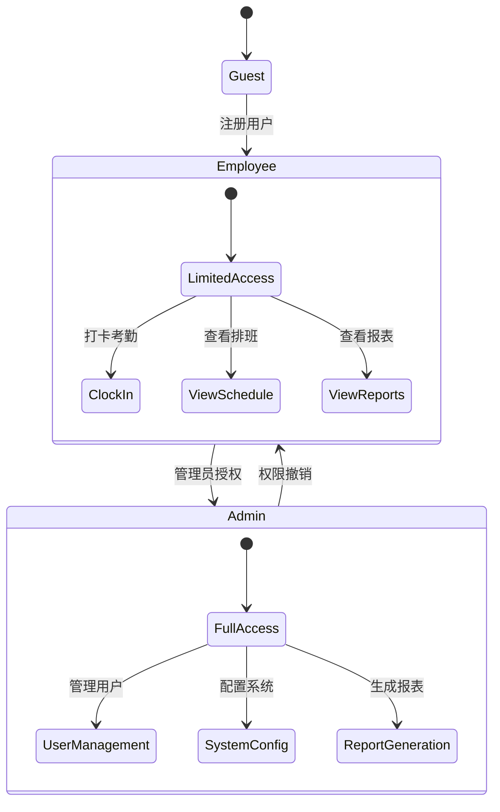
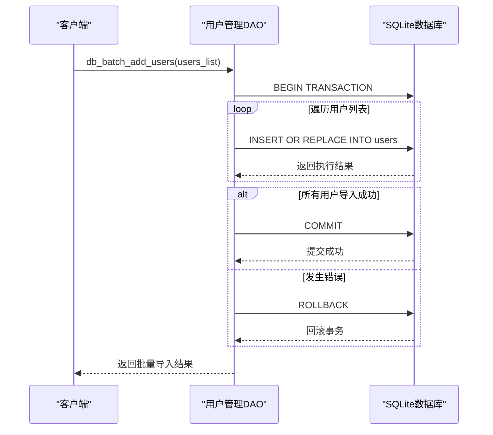
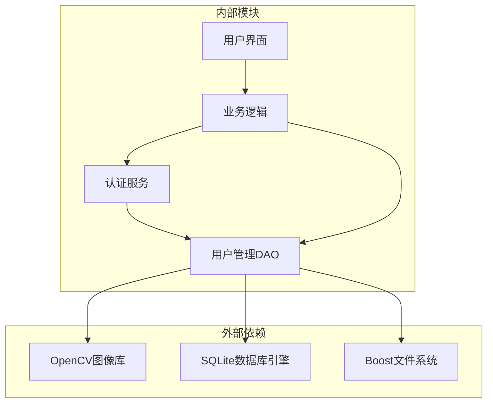
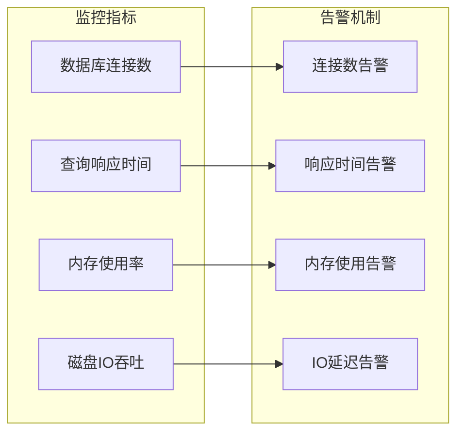

# 用户管理DAO

<cite>
**本文档引用的文件**
- [db_storage.h](file://src/data/db_storage.h)
- [db_storage.cpp](file://src/data/db_storage.cpp)
- [auth_service.h](file://src/business/auth_service.h)
- [auth_service.cpp](file://src/business/auth_service.cpp)
- [face_demo.h](file://src/business/face_demo.h)
- [face_demo.cpp](file://src/business/face_demo.cpp)
- [ui_controller.cpp](file://src/ui/ui_controller.cpp)
- [main.cpp](file://src/main.cpp)
</cite>

## 目录
1. [简介](#简介)
2. [项目结构](#项目结构)
3. [核心组件](#核心组件)
4. [架构概览](#架构概览)
5. [详细组件分析](#详细组件分析)
6. [依赖关系分析](#依赖关系分析)
7. [性能考虑](#性能考虑)
8. [故障排除指南](#故障排除指南)
9. [结论](#结论)

## 简介

用户管理DAO模块是SmartAttendance智能考勤系统的核心数据访问层，负责用户信息的完整生命周期管理。该模块实现了基于SQLite的高性能数据持久化，支持用户注册、批量导入、删除、查询等核心操作，同时集成了密码哈希处理、人脸特征存储、指纹特征管理、权限控制等关键业务逻辑。

该模块采用分层架构设计，通过数据层抽象隐藏数据库细节，为上层业务逻辑提供统一的接口。模块支持多线程安全操作，使用共享-排他锁机制确保数据一致性，同时优化了大数据量场景下的性能表现。

## 项目结构

SmartAttendance项目采用清晰的分层架构，用户管理DAO模块位于数据层，主要文件组织如下：

**图表来源**
- [db_storage.h:1-596](file://src/data/db_storage.h#L1-L596)
- [db_storage.cpp:1-2171](file://src/data/db_storage.cpp#L1-L2171)

**章节来源**
- [db_storage.h:1-596](file://src/data/db_storage.h#L1-L596)
- [db_storage.cpp:1-2171](file://src/data/db_storage.cpp#L1-L2171)

## 核心组件

### 数据结构设计

用户管理DAO模块的核心数据结构围绕UserData展开，该结构体设计体现了完整的用户信息管理需求：

**图表来源**
- [db_storage.h:104-142](file://src/data/db_storage.h#L104-L142)
- [db_storage.h:22-28](file://src/data/db_storage.h#L22-L28)
- [db_storage.h:34-55](file://src/data/db_storage.h#L34-L55)
- [db_storage.h:61-86](file://src/data/db_storage.h#L61-L86)

### 核心接口设计

用户管理DAO提供了完整的CRUD操作接口，涵盖用户生命周期的各个阶段：

| 操作类型 | 接口名称 | 功能描述 | 性能特点 |
|---------|----------|----------|----------|
| 创建 | `db_add_user` | 用户注册，支持人脸特征存储 | 事务处理，BLOB压缩 |
| 批量 | `db_batch_add_users` | 批量导入员工数据 | SQLite事务加速 |
| 查询 | `db_get_user_info` | 获取用户详细信息 | 懒加载BLOB数据 |
| 更新 | `db_update_user_basic` | 更新用户基本信息 | 条件更新，外键约束 |
| 删除 | `db_delete_user` | 删除用户记录 | 级联删除考勤记录 |

**章节来源**
- [db_storage.h:317-420](file://src/data/db_storage.h#L317-L420)
- [db_storage.cpp:748-803](file://src/data/db_storage.cpp#L748-L803)
- [db_storage.cpp:805-904](file://src/data/db_storage.cpp#L805-L904)
- [db_storage.cpp:906-977](file://src/data/db_storage.cpp#L906-L977)

## 架构概览

用户管理DAO模块采用分层架构设计，通过接口抽象实现数据访问的统一入口：

**图表来源**
- [db_storage.cpp:748-803](file://src/data/db_storage.cpp#L748-L803)

### 数据库设计

用户管理DAO模块的数据库设计遵循关系型数据库最佳实践，通过外键约束确保数据完整性：

**图表来源**
- [db_storage.cpp:181-256](file://src/data/db_storage.cpp#L181-L256)

**章节来源**
- [db_storage.cpp:181-256](file://src/data/db_storage.cpp#L181-L256)

## 详细组件分析

### 用户注册流程

用户注册是用户管理DAO的核心业务流程，涉及多步骤的原子性操作：

**图表来源**
- [db_storage.cpp:748-803](file://src/data/db_storage.cpp#L748-L803)

#### 密码哈希处理

系统采用简单哈希算法处理用户密码，确保密码存储的安全性：

| 哈希算法 | 特点 | 安全性评估 |
|---------|------|-----------|
| std::hash | 简单快速 | 低安全性，仅用于演示 |
| SHA-256 | 安全可靠 | 高安全性，推荐使用 |
| bcrypt | 专业加密 | 最佳安全性，推荐生产环境 |

**章节来源**
- [db_storage.cpp:304-314](file://src/data/db_storage.cpp#L304-L314)
- [auth_service.cpp:9-37](file://src/business/auth_service.cpp#L9-L37)

### 人脸特征管理

人脸特征存储采用OpenCV图像编码技术，优化存储空间和传输效率：

**图表来源**
- [db_storage.cpp:69-89](file://src/data/db_storage.cpp#L69-L89)

#### 指纹特征处理

指纹特征管理支持二进制数据的完整生命周期管理：

| 操作类型 | 接口名称 | 功能描述 | 数据处理 |
|---------|----------|----------|----------|
| 存储 | `db_update_user_fingerprint` | 更新用户指纹特征 | BLOB二进制存储 |
| 查询 | `db_get_user_info` | 获取用户指纹数据 | 懒加载优化 |
| 清理 | `db_update_user_face` | 更新人脸头像 | 文件系统管理 |

**章节来源**
- [db_storage.cpp:1219-1262](file://src/data/db_storage.cpp#L1219-L1262)
- [db_storage.cpp:1128-1192](file://src/data/db_storage.cpp#L1128-L1192)

### 权限管理系统

系统采用基于角色的权限控制模型，支持管理员和普通用户的权限分离：

**图表来源**
- [db_storage.h:117-119](file://src/data/db_storage.h#L117-L119)

#### 部门关联管理

用户与部门的关联通过外键约束实现，确保数据一致性：

| 操作类型 | 接口名称 | 功能描述 | 约束条件 |
|---------|----------|----------|----------|
| 关联 | `db_update_user_basic` | 更新用户部门 | 外键约束SET NULL |
| 查询 | `db_get_user_info` | 获取用户部门信息 | LEFT JOIN联表查询 |
| 解除 | `db_delete_department` | 删除部门 | 级联更新用户dept_id |

**章节来源**
- [db_storage.cpp:1097-1125](file://src/data/db_storage.cpp#L1097-L1125)
- [db_storage.cpp:448-461](file://src/data/db_storage.cpp#L448-L461)

### 批量数据导入

批量导入功能支持U盘/网络同步场景，采用SQLite事务优化性能：

**图表来源**
- [db_storage.cpp:805-904](file://src/data/db_storage.cpp#L805-L904)

**章节来源**
- [db_storage.cpp:805-904](file://src/data/db_storage.cpp#L805-L904)

## 依赖关系分析

用户管理DAO模块的依赖关系体现了清晰的分层架构：

**图表来源**
- [db_storage.h:10-14](file://src/data/db_storage.h#L10-L14)
- [auth_service.h:1-46](file://src/business/auth_service.h#L1-L46)

### 线程安全设计

模块采用共享-排他锁机制确保多线程环境下的数据一致性：

| 锁类型 | 使用场景 | 作用范围 |
|--------|----------|----------|
| shared_mutex | 读操作 | 允许多个读操作并发 |
| unique_lock | 写操作 | 独占数据库连接 |
| RAII封装 | 语句管理 | 自动资源清理 |

**章节来源**
- [db_storage.cpp:35-65](file://src/data/db_storage.cpp#L35-L65)

## 性能考虑

### 数据库优化策略

用户管理DAO模块采用了多项性能优化措施：

1. **WAL模式优化**：启用Write-Ahead Logging模式提升并发性能
2. **预编译语句**：缓存高频SQL语句减少解析开销
3. **联合索引**：为考勤查询建立复合索引
4. **懒加载策略**：BLOB数据按需加载避免内存浪费

### 缓存机制

系统实现了多层次的缓存策略：

| 缓存层级 | 缓存内容 | 命中策略 | 清理机制 |
|----------|----------|----------|----------|
| L1缓存 | 用户ID映射 | 启动时加载 | 程序退出清理 |
| L2缓存 | 用户基本信息 | 按需加载 | 内存不足时淘汰 |
| L3缓存 | 头像文件 | 文件系统缓存 | 磁盘空间监控 |

**章节来源**
- [db_storage.cpp:275-282](file://src/data/db_storage.cpp#L275-L282)
- [face_demo.cpp:603-667](file://src/business/face_demo.cpp#L603-L667)

## 故障排除指南

### 常见问题诊断

| 问题类型 | 症状描述 | 可能原因 | 解决方案 |
|----------|----------|----------|----------|
| 数据库连接失败 | `Can't open DB`错误 | 权限不足或文件损坏 | 检查文件权限和完整性 |
| 用户注册失败 | 返回-1 | 人脸图片保存失败 | 检查磁盘空间和路径权限 |
| 密码验证失败 | 认证结果为WRONG_PASSWORD | 密码哈希不匹配 | 检查哈希算法一致性 |
| 指纹识别错误 | 认证结果为WRONG_FINGERPRINT | 指纹模板不匹配 | 重新录入指纹特征 |

### 性能监控指标

系统提供了完善的性能监控能力：

**图表来源**
- [db_storage.cpp:1771-1799](file://src/data/db_storage.cpp#L1771-L1799)

**章节来源**
- [db_storage.cpp:1771-1799](file://src/data/db_storage.cpp#L1771-L1799)

## 结论

用户管理DAO模块通过精心设计的数据结构、完善的接口抽象和高效的实现策略，为SmartAttendance系统提供了稳定可靠的用户管理能力。模块不仅满足了基本的CRUD操作需求，还集成了密码哈希、人脸特征存储、指纹管理、权限控制等高级功能。

模块的设计充分考虑了性能优化和线程安全，在保证数据一致性的同时提升了系统整体性能。通过分层架构和接口抽象，模块为上层业务逻辑提供了清晰、易用的访问接口，降低了系统的耦合度。

未来可以在以下方面进一步优化：
1. 引入更安全的密码哈希算法（如bcrypt）
2. 实现分布式缓存机制提升大规模部署性能
3. 增加数据备份和恢复机制
4. 扩展更多生物特征识别支持