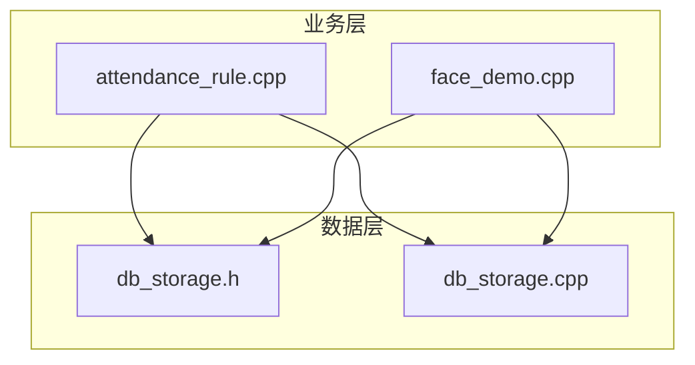
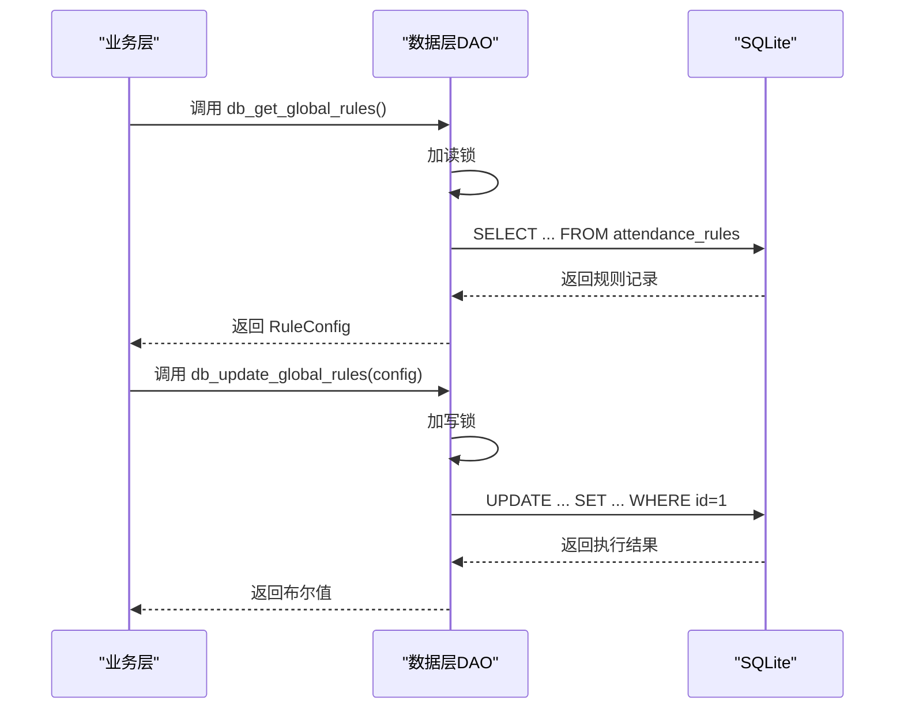
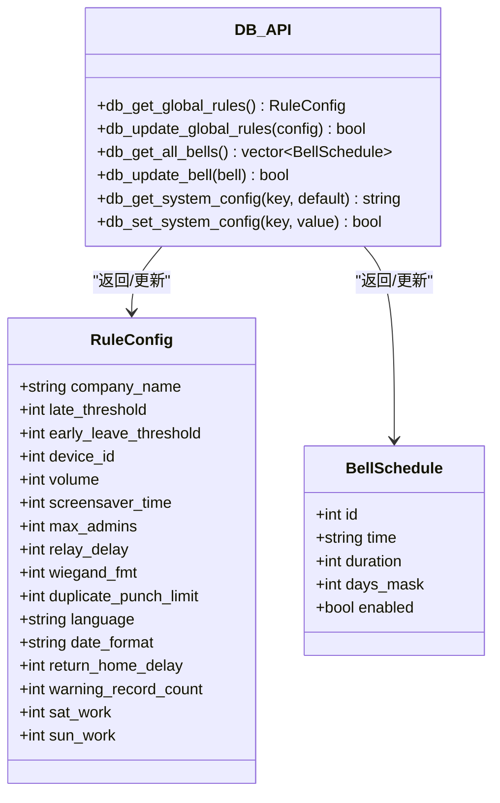

# 系统配置DAO

<cite>
**本文档引用的文件**
- [db_storage.h](file://src/data/db_storage.h)
- [db_storage.cpp](file://src/data/db_storage.cpp)
- [attendance_rule.cpp](file://src/business/attendance_rule.cpp)
- [face_demo.cpp](file://src/business/face_demo.cpp)
</cite>

## 目录
1. [简介](#简介)
2. [项目结构](#项目结构)
3. [核心组件](#核心组件)
4. [架构概览](#架构概览)
5. [详细组件分析](#详细组件分析)
6. [依赖关系分析](#依赖关系分析)
7. [性能考量](#性能考量)
8. [故障排查指南](#故障排查指南)
9. [结论](#结论)

## 简介
本文件档聚焦于SmartAttendance系统的“系统配置DAO模块”。该模块负责管理以下三类关键配置：
- 全局考勤规则配置：控制迟到/早退阈值、设备参数、音量、屏保、管理员数量、防重复打卡、语言/日期格式、返回主界面延迟、记录警告阈值、周末上班策略等。
- 定时响铃配置：管理16个响铃计划槽位，每个槽位包含时间、持续时长、周期掩码（周几）、启用状态。
- 系统全局配置：通用Key-Value型配置项，用于存储任意业务配置（如设备ID、音量、公司名称等）。

DAO模块通过SQLite数据库提供线程安全的读写接口，并在业务层广泛使用这些配置来驱动考勤规则、响铃计划和系统行为。

## 项目结构
系统配置DAO位于数据层(src/data)，对外暴露统一的接口头文件(db_storage.h)，并在实现文件(db_storage.cpp)中完成具体的数据访问逻辑。业务层通过调用这些接口获取或更新配置，例如考勤规则引擎在识别打卡时会读取全局规则，人脸识别演示模块会在启动时加载全局规则和班次信息。

图表来源
- [db_storage.h:1-596](file://src/data/db_storage.h#L1-L596)
- [db_storage.cpp:1-2171](file://src/data/db_storage.cpp#L1-L2171)

章节来源
- [db_storage.h:1-596](file://src/data/db_storage.h#L1-L596)
- [db_storage.cpp:1-2171](file://src/data/db_storage.cpp#L1-L2171)

## 核心组件
- RuleConfig：全局考勤规则结构体，承载考勤阈值、设备参数、界面与国际化设置、安全与防重复策略等。
- BellSchedule：定时响铃计划结构体，承载响铃时间、持续时长、周期掩码、启用状态等。
- 数据库表：
  - attendance_rules：存储全局考勤规则。
  - bells：存储16个响铃计划槽位。
  - system_config：存储通用Key-Value配置。

章节来源
- [db_storage.h:57-98](file://src/data/db_storage.h#L57-L98)
- [db_storage.cpp:155-244](file://src/data/db_storage.cpp#L155-L244)

## 架构概览
系统配置DAO采用“数据层接口 + SQLite持久化”的架构。数据层通过RAII封装的语句对象管理SQL执行，使用共享/排他锁保证并发安全。业务层通过统一接口读取或更新配置，DAO层负责参数绑定、SQL执行与错误处理。

图表来源
- [db_storage.cpp:574-744](file://src/data/db_storage.cpp#L574-L744)

章节来源
- [db_storage.cpp:35-65](file://src/data/db_storage.cpp#L35-L65)
- [db_storage.cpp:574-744](file://src/data/db_storage.cpp#L574-L744)

## 详细组件分析

### RuleConfig结构体设计与参数说明
RuleConfig用于集中管理全局考勤规则，字段含义如下：
- company_name：公司名称
- late_threshold：允许迟到分钟数（默认15）
- early_leave_threshold：允许早退分钟数（默认0）
- device_id：设备编号（1-255）
- volume：音量（0-100）
- screensaver_time：屏保等待时间（分）
- max_admins：管理员人数上限
- relay_delay：继电器延时（秒）
- wiegand_fmt：韦根格式（26/34）
- duplicate_punch_limit：防重复打卡时间（分钟）
- language：语言设置（如"zh-CN","en-US"）
- date_format：日期格式（如"YYYY-MM-DD"）
- return_home_delay：返回主界面超时时间（秒）
- warning_record_count：记录警告数阈值
- sat_work：周六是否上班（0=不上班，1=上班）
- sun_work：周日是否上班（0=不上班，1=上班）

业务逻辑与参数验证规则：
- 阈值类参数（迟到/早退）用于考勤状态判定，建议结合班次时段与跨天规则综合评估。
- 设备参数（device_id、volume、relay_delay、wiegand_fmt）直接影响硬件交互与门禁行为，需与硬件规格匹配。
- 防重复打卡（duplicate_punch_limit）通过时间窗口限制同一用户在短时间内重复打卡，降低误刷风险。
- 语言/日期格式影响UI显示与报表生成，需与系统国际化策略一致。
- 周末上班策略（sat_work/sun_work）为流程图节点K，决定是否将周末纳入考勤计算，建议在节假日与排班策略中统一考虑。

章节来源
- [db_storage.h:57-86](file://src/data/db_storage.h#L57-L86)
- [db_storage.cpp:574-632](file://src/data/db_storage.cpp#L574-L632)

### BellSchedule结构体设计与参数说明
BellSchedule用于管理定时响铃计划，字段含义如下：
- id：槽位编号（1-16）
- time：响铃时间（"HH:MM"）
- duration：响铃时长（秒）
- days_mask：周期掩码（位操作），bit0=周日, bit1=周一, ..., bit6=周六
- enabled：是否启用（true/false）

业务逻辑与参数验证规则：
- days_mask采用位掩码表示周内多天组合，例如0x7E表示周一至周五。
- time格式严格为"HH:MM"，duration为正整数。
- id范围限定在1-16，超出范围可能导致更新失败。
- enabled为布尔值，实际存储为0/1。

章节来源
- [db_storage.h:88-98](file://src/data/db_storage.h#L88-L98)
- [db_storage.cpp:1887-1930](file://src/data/db_storage.cpp#L1887-L1930)

### 全局考勤规则配置接口
- db_get_global_rules：读取全局规则，若数据库字段为NULL或读取失败，使用默认值兜底。
- db_update_global_rules：更新规则，强制更新id=1的记录，绑定所有字段并执行SQL。

参数绑定与错误处理：
- 使用预编译语句与参数绑定，避免SQL注入。
- 写操作使用排他锁，读操作使用共享锁，保证并发安全。
- 更新成功后输出日志，便于运维监控。

章节来源
- [db_storage.cpp:574-632](file://src/data/db_storage.cpp#L574-L632)
- [db_storage.cpp:697-744](file://src/data/db_storage.cpp#L697-L744)

### 定时响铃配置接口
- db_get_all_bells：按id升序返回16个槽位的完整响铃计划。
- db_update_bell：更新指定槽位的响铃设置，绑定time、duration、days_mask、enabled与id。

参数绑定与错误处理：
- 使用预编译语句与参数绑定，避免SQL注入。
- 写操作使用排他锁，读操作使用共享锁，保证并发安全。
- days_mask与enabled分别映射到整数与布尔值，确保数据一致性。

章节来源
- [db_storage.cpp:1887-1930](file://src/data/db_storage.cpp#L1887-L1930)

### 系统全局配置接口
- db_get_system_config：根据key查询配置值，不存在时返回默认值。
- db_set_system_config：设置配置值，存在则更新，不存在则插入。

参数绑定与错误处理：
- 使用INSERT OR REPLACE，键存在覆盖，不存在新增。
- 写操作使用排他锁，读操作使用共享锁，保证并发安全。
- 值以字符串形式存储，业务层读取时按需转换为相应类型。

章节来源
- [db_storage.cpp:1968-2012](file://src/data/db_storage.cpp#L1968-L2012)

### 业务层使用示例
- 考勤规则引擎在识别打卡时读取全局规则，用于防重复打卡检查、迟到/早退判定与状态入库。
- 人脸识别演示模块在启动时加载全局规则与班次列表，用于智能匹配与状态计算。

章节来源
- [attendance_rule.cpp:217-225](file://src/business/attendance_rule.cpp#L217-L225)
- [face_demo.cpp:835-839](file://src/business/face_demo.cpp#L835-L839)

## 依赖关系分析
系统配置DAO的依赖关系如下：
- db_storage.h：声明所有DAO接口与数据结构（RuleConfig、BellSchedule等）。
- db_storage.cpp：实现DAO接口，包含SQLite初始化、表结构创建、事务管理、并发控制与SQL执行。
- 业务层：attendance_rule.cpp与face_demo.cpp通过DAO接口读取配置，驱动考勤规则与界面行为。

图表来源
- [db_storage.h:57-98](file://src/data/db_storage.h#L57-L98)
- [db_storage.cpp:574-744](file://src/data/db_storage.cpp#L574-L744)
- [db_storage.cpp:1887-2012](file://src/data/db_storage.cpp#L1887-L2012)

章节来源
- [db_storage.h:1-596](file://src/data/db_storage.h#L1-L596)
- [db_storage.cpp:1-2171](file://src/data/db_storage.cpp#L1-L2171)

## 性能考量
- 并发控制：使用共享/排他锁分离读写，读多写少场景下显著提升吞吐。
- 预编译语句：对高频SQL进行预编译，减少解析开销。
- 索引优化：为考勤表建立联合索引，加速按用户与时间的查询。
- WAL模式：启用WAL模式提升读写并发性能。
- 事务批量：批量导入/同步用户数据时使用事务，显著提升性能。

章节来源
- [db_storage.cpp:35-65](file://src/data/db_storage.cpp#L35-L65)
- [db_storage.cpp:123-135](file://src/data/db_storage.cpp#L123-L135)
- [db_storage.cpp:253-257](file://src/data/db_storage.cpp#L253-L257)
- [db_storage.cpp:812-895](file://src/data/db_storage.cpp#L812-L895)

## 故障排查指南
常见问题与处理建议：
- SQL执行失败：检查SQL语法与参数绑定，确认数据库连接状态与表结构是否存在。
- 并发冲突：确保读写操作正确加锁，避免在锁外执行耗时操作。
- 参数越界：校验RuleConfig与BellSchedule的数值范围（如device_id、volume、days_mask、id等）。
- 配置未生效：确认db_update_*是否成功返回，检查业务层是否正确读取最新配置。

章节来源
- [db_storage.cpp:96-104](file://src/data/db_storage.cpp#L96-L104)
- [db_storage.cpp:697-744](file://src/data/db_storage.cpp#L697-L744)
- [db_storage.cpp:1887-1930](file://src/data/db_storage.cpp#L1887-L1930)
- [db_storage.cpp:1968-2012](file://src/data/db_storage.cpp#L1968-L2012)

## 结论
系统配置DAO模块通过清晰的接口设计与严格的并发控制，为业务层提供了稳定可靠的配置管理能力。RuleConfig与BellSchedule结构体明确了各类配置的含义与边界，配合db_get_*与db_update_*接口，实现了从规则引擎到响铃计划再到通用配置的全链路支撑。建议在部署与维护过程中遵循参数验证与最佳实践，确保系统配置的准确性与一致性。