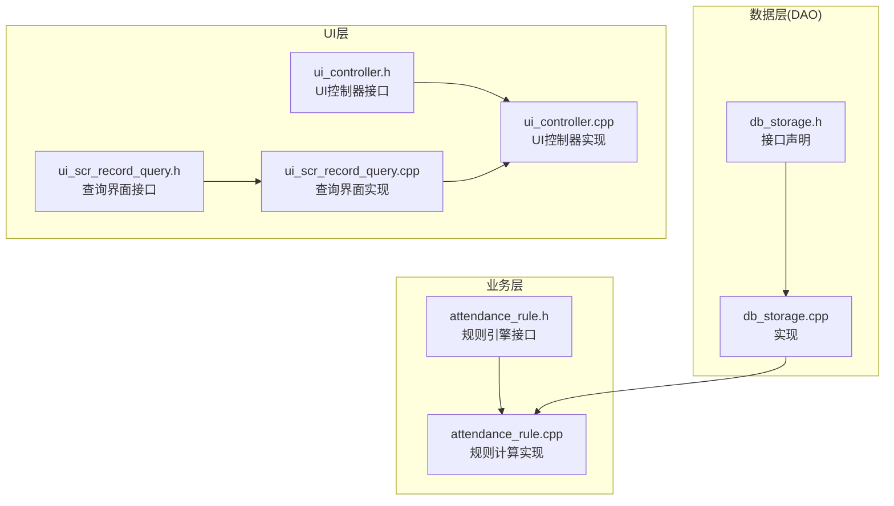
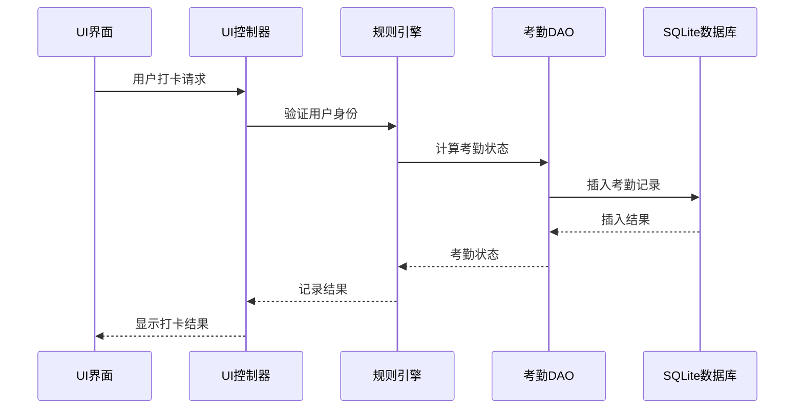
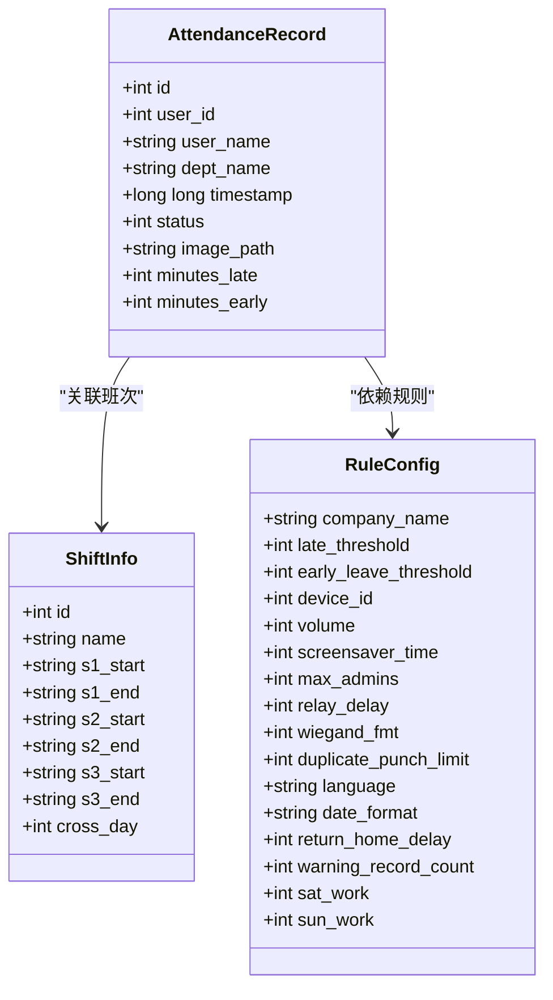
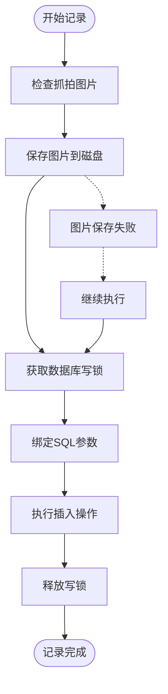
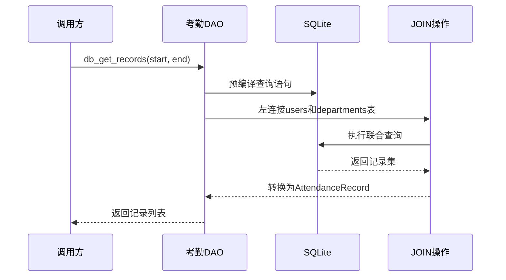
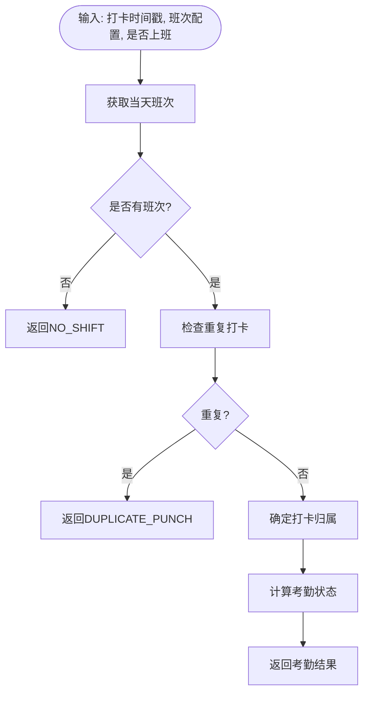
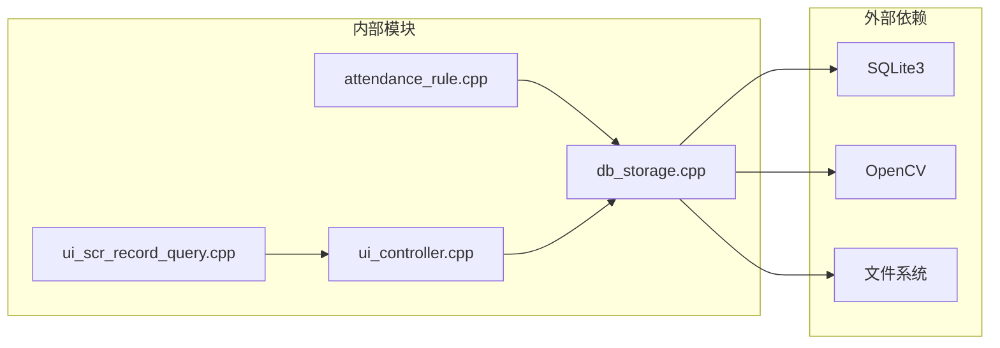
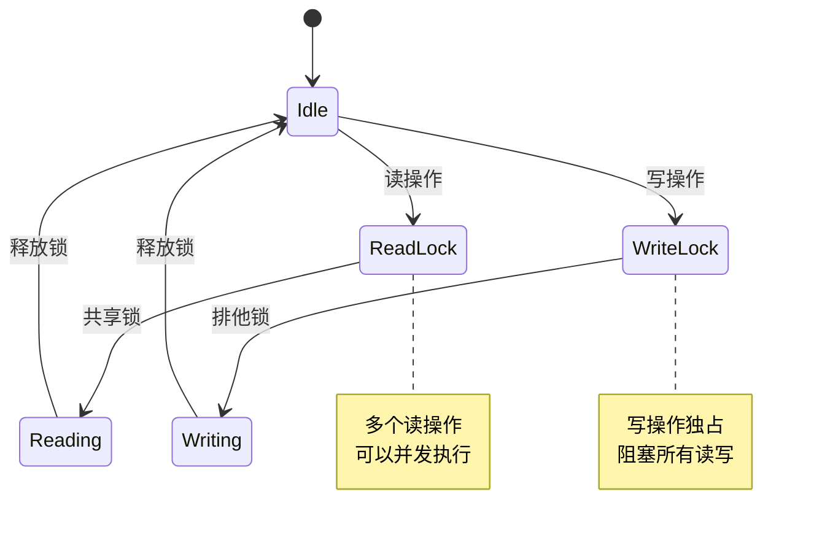

# 考勤记录DAO

<cite>
**本文档引用的文件**
- [db_storage.h](file://src/data/db_storage.h)
- [db_storage.cpp](file://src/data/db_storage.cpp)
- [attendance_rule.h](file://src/business/attendance_rule.h)
- [attendance_rule.cpp](file://src/business/attendance_rule.cpp)
- [ui_scr_record_query.h](file://src/ui/screens/record_query/ui_scr_record_query.h)
- [ui_scr_record_query.cpp](file://src/ui/screens/record_query/ui_scr_record_query.cpp)
- [ui_controller.h](file://src/ui/ui_controller.h)
- [ui_controller.cpp](file://src/ui/ui_controller.cpp)
</cite>

## 目录
1. [简介](#简介)
2. [项目结构](#项目结构)
3. [核心组件](#核心组件)
4. [架构概览](#架构概览)
5. [详细组件分析](#详细组件分析)
6. [依赖关系分析](#依赖关系分析)
7. [性能考虑](#性能考虑)
8. [故障排除指南](#故障排除指南)
9. [结论](#结论)

## 简介
本文档详细阐述SmartAttendance项目中的考勤记录DAO模块，涵盖考勤记录的管理接口、数据结构设计、业务逻辑实现、性能优化策略以及在考勤统计和报表生成中的关键作用。DAO模块基于SQLite实现，提供完整的考勤记录增删改查能力，并通过预编译语句、索引和并发控制保证高性能与高可靠性。

## 项目结构
考勤记录DAO位于src/data目录下，配合业务层规则引擎和UI层查询界面共同构成完整的考勤管理系统：

**图表来源**
- [db_storage.h:421-461](file://src/data/db_storage.h#L421-L461)
- [db_storage.cpp:1294-1536](file://src/data/db_storage.cpp#L1294-L1536)
- [attendance_rule.h:43-89](file://src/business/attendance_rule.h#L43-L89)
- [ui_scr_record_query.h:9-54](file://src/ui/screens/record_query/ui_scr_record_query.h#L9-L54)

**章节来源**
- [db_storage.h:1-596](file://src/data/db_storage.h#L1-L596)
- [db_storage.cpp:1-2171](file://src/data/db_storage.cpp#L1-L2171)

## 核心组件
考勤记录DAO模块的核心接口包括：

### 主要接口
- `db_log_attendance()`: 记录考勤打卡
- `db_get_records()`: 查询时间段内的所有考勤记录
- `db_get_records_by_user()`: 按用户查询考勤记录
- `db_get_all_records_by_time()`: 批量获取全公司考勤记录（报表用）

### 数据结构
- `AttendanceRecord`: 考勤记录视图模型，包含用户信息、时间戳、状态和图片路径
- `ShiftInfo`: 班次信息结构体
- `RuleConfig`: 考勤规则配置

**章节来源**
- [db_storage.h:148-176](file://src/data/db_storage.h#L148-L176)
- [db_storage.h:421-461](file://src/data/db_storage.h#L421-L461)

## 架构概览
考勤记录DAO采用分层架构设计，确保职责分离和代码可维护性：

**图表来源**
- [attendance_rule.cpp:198-277](file://src/business/attendance_rule.cpp#L198-L277)
- [db_storage.cpp:1296-1348](file://src/data/db_storage.cpp#L1296-L1348)

## 详细组件分析

### 考勤记录结构体设计
`AttendanceRecord`结构体精心设计以支持完整的考勤查询和报表需求：

**图表来源**
- [db_storage.h:148-176](file://src/data/db_storage.h#L148-L176)
- [db_storage.h:34-55](file://src/data/db_storage.h#L34-L55)
- [db_storage.h:61-86](file://src/data/db_storage.h#L61-L86)

### 考勤记录管理接口

#### 记录考勤(db_log_attendance)
该接口实现了完整的考勤记录流程：

**图表来源**
- [db_storage.cpp:1296-1348](file://src/data/db_storage.cpp#L1296-L1348)

#### 查询考勤记录(db_get_records)
支持按时间段查询所有考勤记录，包含用户和部门信息：

**图表来源**
- [db_storage.cpp:1439-1481](file://src/data/db_storage.cpp#L1439-L1481)

#### 按用户查询记录(db_get_records_by_user)
提供高效的用户级考勤查询：

**章节来源**
- [db_storage.cpp:1483-1536](file://src/data/db_storage.cpp#L1483-L1536)

### 业务逻辑实现

#### 考勤状态计算
业务层规则引擎负责复杂的考勤状态计算：

**图表来源**
- [attendance_rule.cpp:198-277](file://src/business/attendance_rule.cpp#L198-L277)

**章节来源**
- [attendance_rule.h:16-41](file://src/business/attendance_rule.h#L16-L41)
- [attendance_rule.cpp:127-191](file://src/business/attendance_rule.cpp#L127-L191)

### 图片存储策略
DAO模块采用分离存储策略：

1. **图片文件存储**: 抓拍图片保存在`captured_images`目录，文件名为`{timestamp}_{user_id}.jpg`
2. **数据库存储**: 仅存储图片文件路径，不存储二进制数据
3. **自动清理**: 提供定期清理过期图片的功能

**章节来源**
- [db_storage.cpp:1296-1311](file://src/data/db_storage.cpp#L1296-L1311)
- [db_storage.cpp:1372-1436](file://src/data/db_storage.cpp#L1372-L1436)

## 依赖关系分析

### 组件耦合关系

**图表来源**
- [db_storage.cpp:7-22](file://src/data/db_storage.cpp#L7-L22)
- [db_storage.cpp:1296-1348](file://src/data/db_storage.cpp#L1296-L1348)

### 数据流依赖
DAO模块的依赖关系确保了数据的一致性和完整性：

**章节来源**
- [db_storage.h:1-596](file://src/data/db_storage.h#L1-L596)
- [db_storage.cpp:1-2171](file://src/data/db_storage.cpp#L1-L2171)

## 性能考虑

### 索引设计建议
针对考勤查询的性能优化，建议使用以下索引策略：

1. **复合索引**: `idx_att_user_time(user_id, timestamp DESC)`
2. **时间范围查询优化**: 为timestamp建立单独索引
3. **用户查询优化**: 为user_id建立索引

### 并发控制
DAO模块采用读写锁机制：

**图表来源**
- [db_storage.cpp:35-38](file://src/data/db_storage.cpp#L35-L38)

### 预编译语句优化
- 预编译高频使用的插入语句，避免重复编译开销
- 使用`sqlite3_reset()`和`sqlite3_clear_bindings()`重置语句状态

**章节来源**
- [db_storage.cpp:275-282](file://src/data/db_storage.cpp#L275-L282)
- [db_storage.cpp:1314-1338](file://src/data/db_storage.cpp#L1314-L1338)

## 故障排除指南

### 常见问题诊断

#### 数据库连接问题
- 检查数据库文件是否存在和可访问
- 验证SQLite3库版本兼容性
- 确认数据库文件权限设置

#### 图片存储问题
- 检查`captured_images`目录权限
- 验证磁盘空间充足
- 确认OpenCV图像编码功能正常

#### 查询性能问题
- 检查索引是否正确创建
- 验证查询条件的合理性
- 监控数据库文件大小和碎片化程度

**章节来源**
- [db_storage.cpp:117-122](file://src/data/db_storage.cpp#L117-L122)
- [db_storage.cpp:1372-1436](file://src/data/db_storage.cpp#L1372-L1436)

## 结论
考勤记录DAO模块通过精心设计的数据结构、完善的业务逻辑实现和全面的性能优化策略，为SmartAttendance系统提供了可靠的考勤管理能力。模块采用分层架构设计，确保了代码的可维护性和扩展性。通过合理的索引设计、并发控制和存储策略，DAO模块能够高效处理大规模的考勤数据查询和统计需求，为企业的考勤管理和报表生成提供了坚实的技术基础。