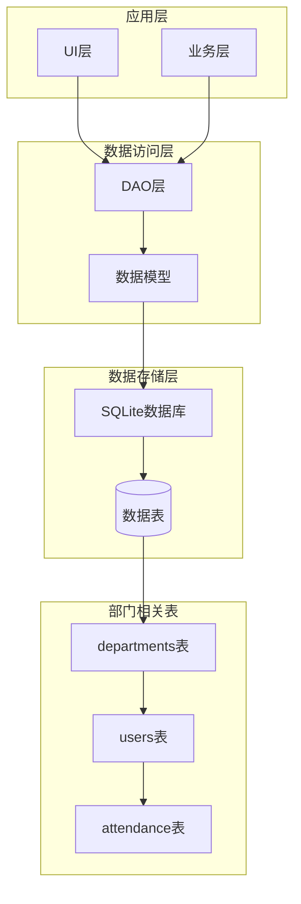
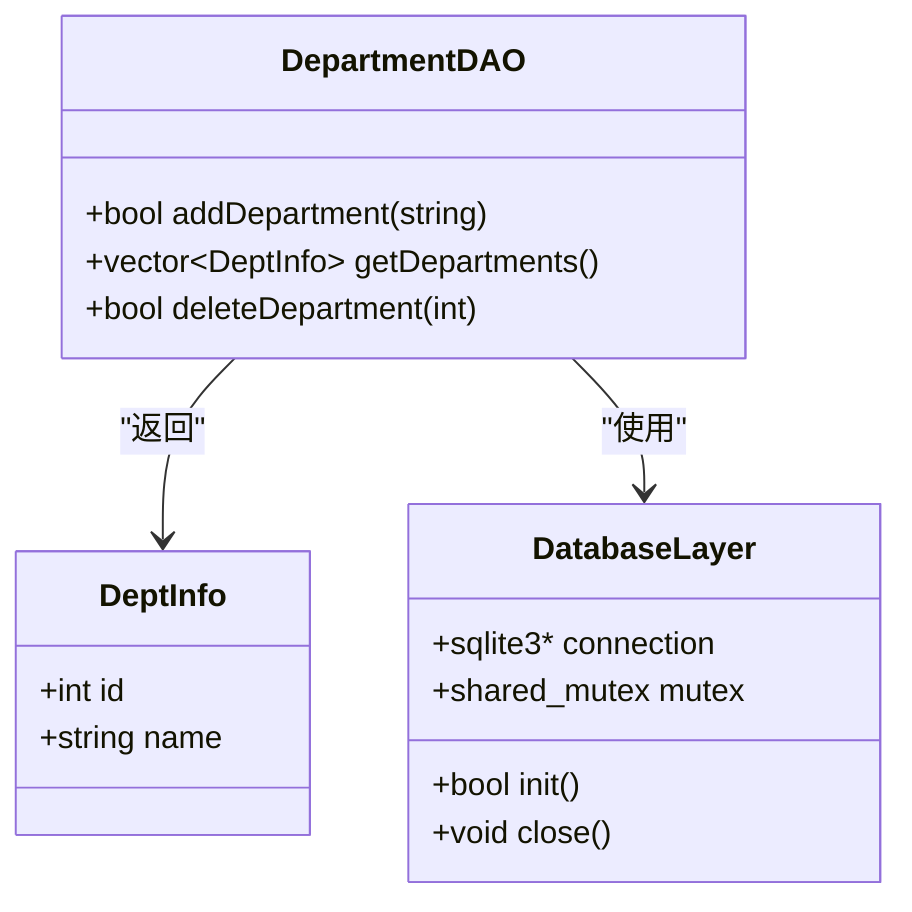
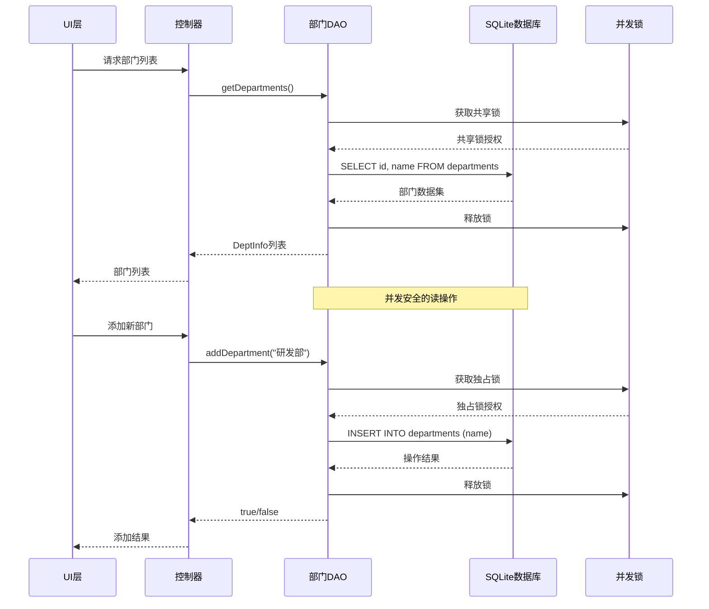
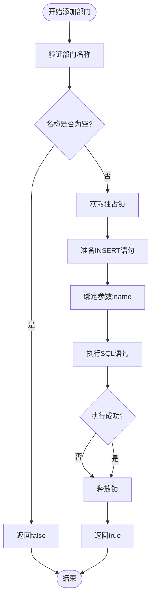
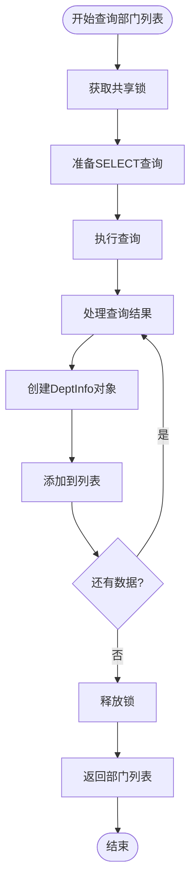
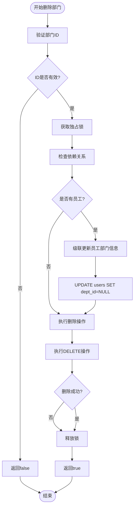
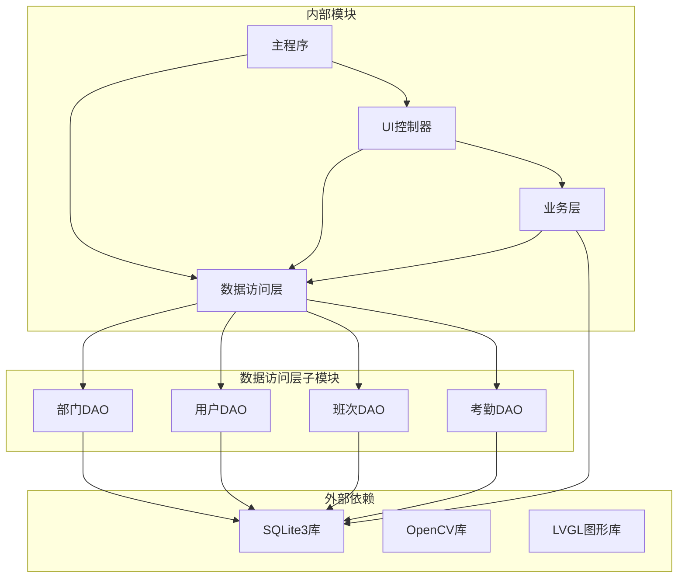
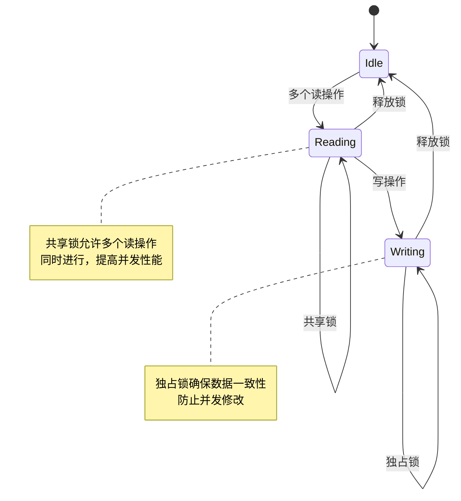

# 部门管理DAO

<cite>
**本文档引用的文件**
- [db_storage.h](file://src/data/db_storage.h)
- [db_storage.cpp](file://src/data/db_storage.cpp)
- [ui_controller.cpp](file://src/ui/ui_controller.cpp)
- [main.cpp](file://src/main.cpp)
</cite>

## 目录
1. [简介](#简介)
2. [项目结构](#项目结构)
3. [核心组件](#核心组件)
4. [架构概览](#架构概览)
5. [详细组件分析](#详细组件分析)
6. [依赖关系分析](#依赖关系分析)
7. [性能考虑](#性能考虑)
8. [故障排除指南](#故障排除指南)
9. [结论](#结论)

## 简介

部门管理DAO模块是SmartAttendance智能考勤系统中的核心数据访问层组件，负责部门信息的完整生命周期管理。该模块实现了基于SQLite的部门数据持久化，提供了标准化的CRUD操作接口，确保部门信息的完整性、一致性和并发安全性。

系统采用分层架构设计，部门管理DAO位于数据层，向上为业务层和UI层提供标准化的数据访问接口。通过严格的外键约束和事务管理，确保数据关系的完整性，特别是在删除部门时能够正确处理级联更新员工部门信息的业务需求。

## 项目结构

部门管理DAO模块在项目中的组织结构如下：



**图表来源**
- [db_storage.cpp:140-285](file://src/data/db_storage.cpp#L140-L285)
- [db_storage.h:18-596](file://src/data/db_storage.h#L18-L596)

**章节来源**
- [db_storage.cpp:140-285](file://src/data/db_storage.cpp#L140-L285)
- [db_storage.h:18-596](file://src/data/db_storage.h#L18-L596)

## 核心组件

### 数据结构设计

部门管理DAO的核心数据结构是`DeptInfo`，这是一个简洁而功能完整的数据传输对象：



**图表来源**
- [db_storage.h:22-28](file://src/data/db_storage.h#L22-L28)
- [db_storage.h:215-236](file://src/data/db_storage.h#L215-L236)

### 核心接口方法

部门管理DAO提供了三个核心接口，每个接口都经过精心设计以满足不同的业务场景：

1. **添加新部门** (`db_add_department`)
2. **获取部门列表** (`db_get_departments`)  
3. **删除指定部门** (`db_delete_department`)

**章节来源**
- [db_storage.h:215-236](file://src/data/db_storage.h#L215-L236)
- [db_storage.cpp:409-461](file://src/data/db_storage.cpp#L409-L461)

## 架构概览

部门管理DAO模块在整个系统架构中扮演着关键的数据持久化角色：



**图表来源**
- [db_storage.cpp:426-445](file://src/data/db_storage.cpp#L426-L445)
- [db_storage.cpp:409-424](file://src/data/db_storage.cpp#L409-L424)

### 数据模型关系

部门管理DAO与系统其他模块的数据模型关系如下：

```mermaid
erDiagram
DEPARTMENTS {
integer id PK
string name UK
}
USERS {
integer id PK
string name
integer dept_id FK
integer default_shift_id
}
ATTENDANCE {
integer id PK
integer user_id FK
integer shift_id
integer timestamp
}
DEPARTMENTS ||--o{ USERS : "拥有"
USERS ||--o{ ATTENDANCE : "产生"
note for DEPARTMENTS """
外键约束: ON DELETE SET NULL
删除部门时，员工dept_id置空
"""
note for USERS """
外键约束: ON DELETE SET NULL
删除用户时，级联删除考勤记录
"""
```

**图表来源**
- [db_storage.cpp:140-207](file://src/data/db_storage.cpp#L140-L207)

**章节来源**
- [db_storage.cpp:140-207](file://src/data/db_storage.cpp#L140-L207)

## 详细组件分析

### 添加新部门 (db_add_department)

添加新部门操作是部门管理中最基础也是最重要的功能之一。该操作确保了部门名称的唯一性约束，并提供了完整的错误处理机制。

#### 核心实现逻辑



**图表来源**
- [db_storage.cpp:409-424](file://src/data/db_storage.cpp#L409-L424)

#### 业务规则实现

添加新部门操作严格遵循以下业务规则：

1. **唯一性约束**：部门名称在数据库层面通过UNIQUE约束保证唯一性
2. **并发安全**：使用独占锁确保多线程环境下的数据一致性
3. **错误处理**：对SQL执行失败情况进行适当的错误处理和日志记录

**章节来源**
- [db_storage.cpp:409-424](file://src/data/db_storage.cpp#L409-L424)
- [db_storage.h:217-222](file://src/data/db_storage.h#L217-L222)

### 获取部门列表 (db_get_departments)

获取部门列表操作提供了系统中所有部门信息的查询功能，支持UI层的部门选择和显示需求。

#### 查询优化策略



**图表来源**
- [db_storage.cpp:426-445](file://src/data/db_storage.cpp#L426-L445)

#### 性能优化特性

1. **共享锁机制**：允许多个读操作并发执行，提高查询性能
2. **预编译语句**：使用SQLite预编译语句减少SQL解析开销
3. **内存管理**：使用RAII模式管理SQLite语句生命周期

**章节来源**
- [db_storage.cpp:426-445](file://src/data/db_storage.cpp#L426-L445)

### 删除部门 (db_delete_department)

删除部门操作是最复杂的部门管理功能，需要处理级联更新员工部门信息的业务逻辑。

#### 级联处理机制



**图表来源**
- [db_storage.cpp:448-461](file://src/data/db_storage.cpp#L448-L461)

#### 外键约束设计

删除部门操作依赖于数据库层面的外键约束设计：

1. **SET NULL机制**：删除部门时，相关员工的`dept_id`字段自动置为NULL
2. **数据完整性**：确保不会出现孤立的员工记录
3. **业务连续性**：员工信息得以保留，仅部门关联被移除

**章节来源**
- [db_storage.cpp:448-461](file://src/data/db_storage.cpp#L448-L461)
- [db_storage.cpp:194](file://src/data/db_storage.cpp#L194)

### 数据结构设计理念

#### DeptInfo结构体设计

`DeptInfo`结构体采用了极简而实用的设计理念：

| 字段 | 类型 | 描述 | 约束 | 用途 |
|------|------|------|------|------|
| `id` | `int` | 部门标识符 | 主键，自增 | 唯一标识部门 |
| `name` | `std::string` | 部门名称 | 非空，唯一 | 显示和搜索 |

这种设计的优势：
1. **最小必要性**：仅包含业务必需的字段
2. **类型安全**：使用强类型确保编译时检查
3. **序列化友好**：便于JSON或其他格式的序列化
4. **内存效率**：紧凑的数据布局减少内存占用

**章节来源**
- [db_storage.h:22-28](file://src/data/db_storage.h#L22-L28)

## 依赖关系分析

### 模块间依赖关系



**图表来源**
- [db_storage.h:10-15](file://src/data/db_storage.h#L10-L15)
- [main.cpp:33](file://src/main.cpp#L33)

### 并发控制机制

部门管理DAO采用了分层的并发控制策略：



**图表来源**
- [db_storage.cpp:35](file://src/data/db_storage.cpp#L35)

**章节来源**
- [db_storage.cpp:35-65](file://src/data/db_storage.cpp#L35-L65)

## 性能考虑

### 查询性能优化

1. **索引策略**：为部门表的`id`和`name`字段建立合适的索引
2. **预编译语句**：复用SQL语句模板减少解析开销
3. **批量操作**：对于大量数据操作使用事务包装

### 内存管理

1. **RAII模式**：使用`ScopedSqliteStmt`自动管理SQLite语句生命周期
2. **智能指针**：在需要时使用智能指针管理动态内存
3. **资源回收**：确保数据库连接和语句在适当时候被释放

### 并发性能

1. **读写分离**：读操作使用共享锁，写操作使用独占锁
2. **锁粒度控制**：最小化锁持有时间，提高并发吞吐量
3. **死锁预防**：通过统一的锁获取顺序避免死锁

## 故障排除指南

### 常见问题及解决方案

#### 部门名称重复错误

**问题描述**：尝试添加重复的部门名称导致操作失败

**解决方法**：
1. 检查部门名称的唯一性约束
2. 提供用户友好的错误提示
3. 建议使用部门名称的变体或添加编号

#### 删除部门失败

**问题描述**：删除部门时操作返回false

**排查步骤**：
1. 验证部门ID的有效性
2. 检查是否存在依赖的员工记录
3. 确认数据库连接状态
4. 查看SQLite错误信息

#### 并发访问冲突

**问题描述**：多线程环境下出现数据不一致

**解决方法**：
1. 确保正确使用共享锁和独占锁
2. 避免在锁保护的代码块中执行耗时操作
3. 检查锁的获取和释放时机

**章节来源**
- [db_storage.cpp:409-461](file://src/data/db_storage.cpp#L409-L461)

## 结论

部门管理DAO模块通过精心设计的数据结构、严格的业务规则实现和完善的并发控制机制，为SmartAttendance系统提供了稳定可靠的部门数据管理能力。模块采用的分层架构设计确保了良好的可维护性和扩展性，而SQLite数据库的选择则提供了轻量级、高效的本地数据存储方案。

该模块的主要优势包括：

1. **数据完整性**：通过外键约束和事务管理确保数据一致性
2. **并发安全**：采用分层锁机制支持高并发访问
3. **性能优化**：预编译语句和索引策略提升查询效率
4. **错误处理**：完善的异常处理和错误恢复机制
5. **易于扩展**：清晰的接口设计便于功能扩展

未来可以在以下方面进一步改进：
- 添加更多的业务规则验证
- 实现更详细的日志记录
- 考虑支持更多类型的部门属性
- 增强批量操作功能