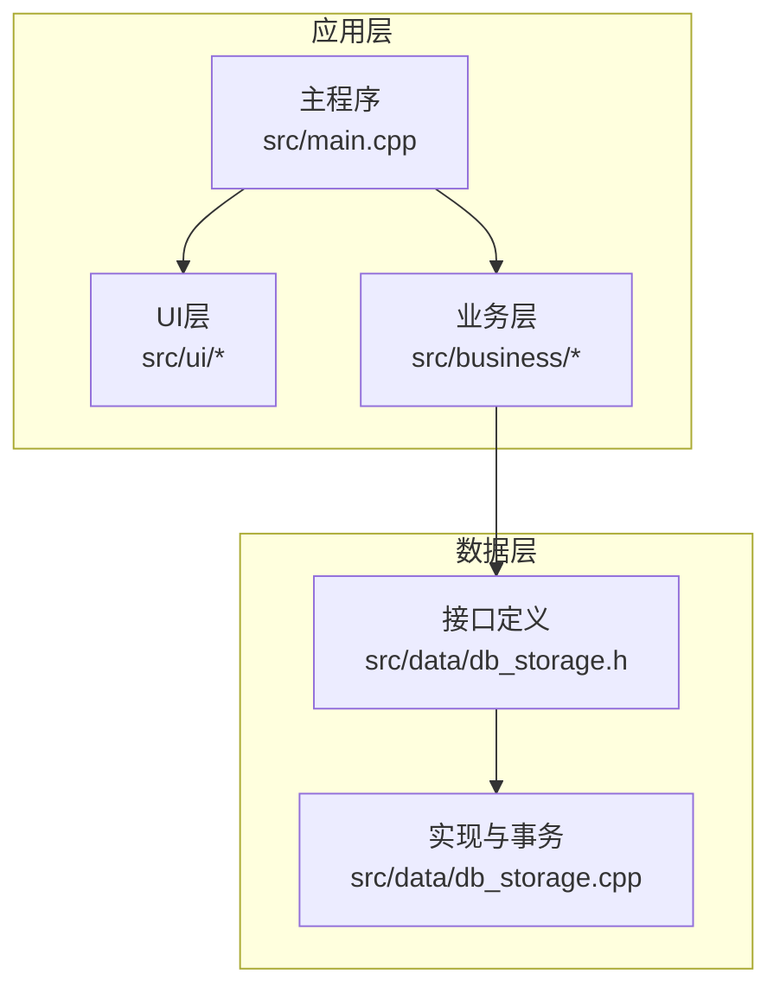
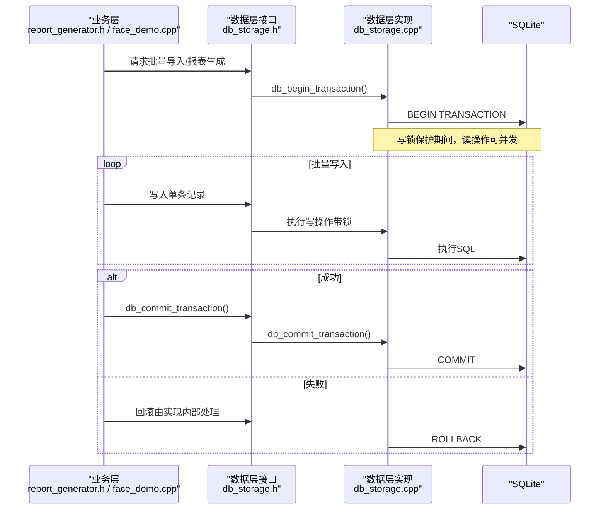
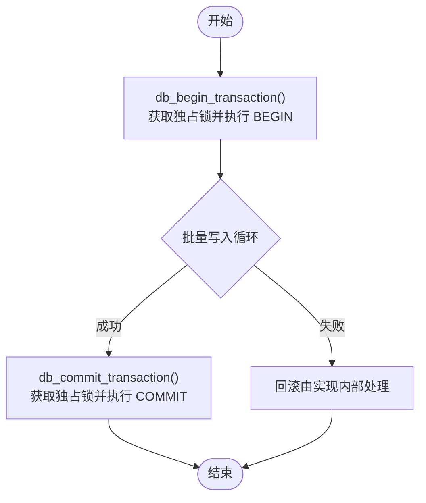
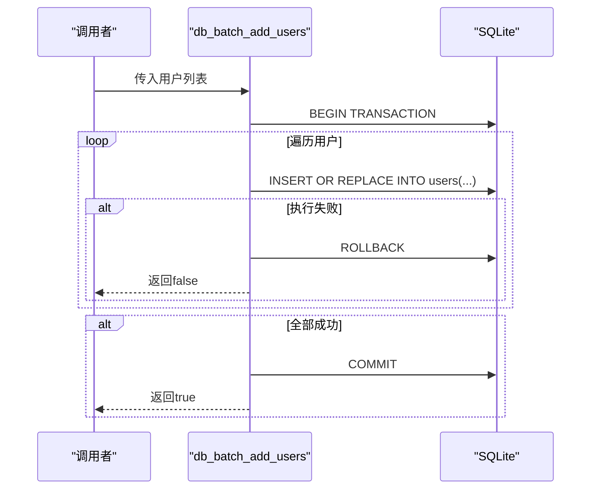
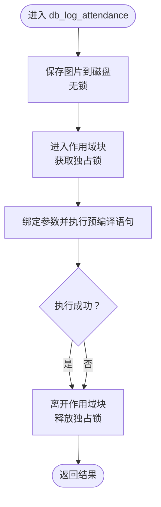
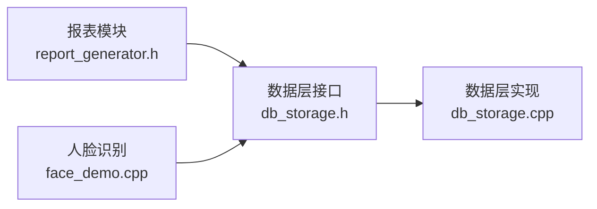

# 事务管理

<cite>
**本文引用的文件**
- [src/main.cpp](file://src/main.cpp)
- [src/data/db_storage.h](file://src/data/db_storage.h)
- [src/data/db_storage.cpp](file://src/data/db_storage.cpp)
- [src/business/report_generator.h](file://src/business/report_generator.h)
- [src/business/face_demo.cpp](file://src/business/face_demo.cpp)
</cite>

## 目录
1. [简介](#简介)
2. [项目结构](#项目结构)
3. [核心组件](#核心组件)
4. [架构总览](#架构总览)
5. [详细组件分析](#详细组件分析)
6. [依赖关系分析](#依赖关系分析)
7. [性能考量](#性能考量)
8. [故障排查指南](#故障排查指南)
9. [结论](#结论)
10. [附录](#附录)

## 简介
本文件聚焦 SmartAttendance 的事务管理实现，系统性阐述数据库事务的 ACID 特性在项目中的落地方式，涵盖事务的开启、提交与回滚机制；批量操作（如用户批量导入、报表生成）的事务处理策略；并发控制（锁策略、死锁预防）；事务隔离级别与性能权衡；最佳实践与常见陷阱；事务日志与审计跟踪方案。文档面向不同技术背景读者，既提供代码级分析，也给出可视化图示与实操建议。

## 项目结构
SmartAttendance 的事务管理主要集中在数据层（db_storage），业务层（report_generator、face_demo）通过数据层提供的事务接口与批量能力完成报表生成与高并发写入场景的事务保障。主程序负责系统初始化与生命周期管理，不直接参与事务细节。

图表来源
- [src/main.cpp:187-246](file://src/main.cpp#L187-L246)
- [src/data/db_storage.h:1-596](file://src/data/db_storage.h#L1-L596)
- [src/data/db_storage.cpp:108-285](file://src/data/db_storage.cpp#L108-L285)

章节来源
- [src/main.cpp:187-246](file://src/main.cpp#L187-L246)
- [src/data/db_storage.h:1-596](file://src/data/db_storage.h#L1-L596)
- [src/data/db_storage.cpp:108-285](file://src/data/db_storage.cpp#L108-L285)

## 核心组件
- 事务接口
  - 开启事务：db_begin_transaction()
  - 提交事务：db_commit_transaction()
- 批量操作
  - 用户批量导入：db_batch_add_users()
  - 数据播种：data_seed()（内部使用事务）
- 并发控制
  - 全局共享互斥锁：g_db_mutex（读写锁）
  - 读路径：共享锁（shared_lock）
  - 写路径：独占锁（unique_lock）
- 性能优化
  - WAL 模式、同步策略、临时存储、缓存大小、外键约束等 SQLite PRAGMA
  - 预编译语句（log_attendance）降低解析与编译开销

章节来源
- [src/data/db_storage.h:463-474](file://src/data/db_storage.h#L463-L474)
- [src/data/db_storage.h:327-332](file://src/data/db_storage.h#L327-L332)
- [src/data/db_storage.cpp:35](file://src/data/db_storage.cpp#L35)
- [src/data/db_storage.cpp:124-135](file://src/data/db_storage.cpp#L124-L135)
- [src/data/db_storage.cpp:1540-1552](file://src/data/db_storage.cpp#L1540-L1552)

## 架构总览
事务管理贯穿“业务层 → 数据层”的调用链，业务层在需要强一致性的批量写入或报表生成时，显式开启事务并在成功后提交，失败则回滚。数据层通过共享互斥锁保证同一时刻只有一个写操作，读操作可并发进行。

图表来源
- [src/data/db_storage.h:463-474](file://src/data/db_storage.h#L463-L474)
- [src/data/db_storage.cpp:805-904](file://src/data/db_storage.cpp#L805-L904)
- [src/data/db_storage.cpp:1540-1552](file://src/data/db_storage.cpp#L1540-L1552)

## 详细组件分析

### 事务接口与生命周期
- db_begin_transaction()
  - 获取独占锁，执行 BEGIN TRANSACTION
  - 适用于批量写入前的上下文
- db_commit_transaction()
  - 获取独占锁，执行 COMMIT
  - 成功提交，失败则保持回滚状态（由调用方处理）

图表来源
- [src/data/db_storage.h:463-474](file://src/data/db_storage.h#L463-L474)
- [src/data/db_storage.cpp:1540-1552](file://src/data/db_storage.cpp#L1540-L1552)

章节来源
- [src/data/db_storage.h:463-474](file://src/data/db_storage.h#L463-L474)
- [src/data/db_storage.cpp:1540-1552](file://src/data/db_storage.cpp#L1540-L1552)

### 批量导入事务处理策略（用户批量导入）
- db_batch_add_users(users_list)
  - 获取独占锁
  - 执行 BEGIN TRANSACTION
  - 使用 INSERT OR REPLACE 高效写入（覆盖更新或新增）
  - 循环绑定参数并执行，任一失败立即 break
  - 成功则 COMMIT，失败则 ROLLBACK
  - 返回布尔值表示整体成功与否

图表来源
- [src/data/db_storage.h:327-332](file://src/data/db_storage.h#L327-L332)
- [src/data/db_storage.cpp:805-904](file://src/data/db_storage.cpp#L805-L904)

章节来源
- [src/data/db_storage.h:327-332](file://src/data/db_storage.h#L327-L332)
- [src/data/db_storage.cpp:805-904](file://src/data/db_storage.cpp#L805-L904)

### 数据播种中的事务使用
- data_seed()
  - 在播种响铃配置时显式开启事务，批量插入 16 条记录后提交
  - 保证播种过程原子性，避免部分播种导致的数据不一致

章节来源
- [src/data/db_storage.cpp:376-384](file://src/data/db_storage.cpp#L376-L384)

### 考勤记录写入的事务与锁策略
- db_log_attendance()
  - 非数据库操作（保存图片）不加锁，避免阻塞读写
  - 数据库写入使用作用域块包裹，进入块获取独占锁，退出即释放
  - 使用预编译语句，减少解析与绑定成本

图表来源
- [src/data/db_storage.cpp:1296-1348](file://src/data/db_storage.cpp#L1296-L1348)

章节来源
- [src/data/db_storage.cpp:1296-1348](file://src/data/db_storage.cpp#L1296-L1348)

### 报表生成中的批量查询与事务
- 报表导出模块（report_generator.h）
  - 提供多种报表导出接口（汇总、明细、部门等）
  - 内部通过 db_get_all_records_by_time 等批量查询接口获取时间段内的全量记录，避免 N+1 查询问题
  - 报表生成本身不涉及写事务，读取使用共享锁，保证并发读取性能

章节来源
- [src/business/report_generator.h:100-134](file://src/business/report_generator.h#L100-L134)
- [src/data/db_storage.h:580-587](file://src/data/db_storage.h#L580-L587)

### 并发控制与锁策略
- 全局共享互斥锁 g_db_mutex
  - 读：shared_lock（允许多个读并发）
  - 写：unique_lock（独占写，阻塞其他读写）
- 读写分离
  - 查询类接口普遍使用共享锁
  - 写入类接口（新增、更新、删除、批量导入）使用独占锁
- 预编译语句与锁粒度
  - 预编译语句（log_attendance）在持有独占锁期间绑定与执行，减少锁竞争
  - 作用域块确保锁持有时间最短，降低阻塞风险

章节来源
- [src/data/db_storage.cpp:35](file://src/data/db_storage.cpp#L35)
- [src/data/db_storage.cpp:426-461](file://src/data/db_storage.cpp#L426-L461)
- [src/data/db_storage.cpp:1296-1348](file://src/data/db_storage.cpp#L1296-L1348)

### 死锁预防与并发注意事项
- 锁粒度最小化
  - 仅在必要时获取独占锁，尽量缩短持有时间（如作用域块）
- 顺序一致性
  - 批量写入时遵循固定顺序，避免交叉依赖导致的锁顺序不一致
- 读写分离
  - 读多写少场景下，共享锁显著提升吞吐
- 队列与异步写入
  - 人脸识别写库采用队列与后台线程，避免主线程阻塞与锁争用

章节来源
- [src/data/db_storage.cpp:1296-1348](file://src/data/db_storage.cpp#L1296-L1348)
- [src/business/face_demo.cpp:935-951](file://src/business/face_demo.cpp#L935-L951)

### 事务隔离级别与性能权衡
- 隔离级别
  - SQLite 默认使用“可重复读”语义，结合 WAL 模式与共享互斥锁，满足多数业务需求
- 性能优化
  - WAL 模式：读写并发提升，写入不阻塞读
  - synchronous=NORMAL：在安全性与性能间取得平衡
  - temp_store=MEMORY：临时表与索引驻留内存，减少磁盘 IO
  - cache_size：增大缓存，提升热点数据命中率
  - 外键约束开启：保证参照完整性
- 事务与性能
  - 批量写入使用事务显著降低日志与检查点开销
  - 预编译语句减少 SQL 解析与绑定成本

章节来源
- [src/data/db_storage.cpp:124-135](file://src/data/db_storage.cpp#L124-L135)
- [src/data/db_storage.cpp:805-904](file://src/data/db_storage.cpp#L805-L904)

### 事务日志与审计跟踪
- 日志输出
  - 成功/失败的关键操作均输出日志（如播种、批量导入、考勤记录写入）
- 建议增强
  - 引入统一的事务日志器，记录事务开始/提交/回滚时间、影响行数、错误码
  - 对关键写操作增加审计字段（操作人、时间戳、变更前后对比），便于追踪与合规

章节来源
- [src/data/db_storage.cpp:376-384](file://src/data/db_storage.cpp#L376-L384)
- [src/data/db_storage.cpp:895-901](file://src/data/db_storage.cpp#L895-L901)
- [src/data/db_storage.cpp:1340-1345](file://src/data/db_storage.cpp#L1340-L1345)

## 依赖关系分析
- 数据层接口与实现
  - db_storage.h 定义事务接口与批量操作
  - db_storage.cpp 实现事务、批量导入、播种、锁策略与性能优化
- 业务层依赖
  - 报表模块通过批量查询接口获取数据
  - 人脸识别模块通过队列与后台线程写入数据库，避免锁争用

图表来源
- [src/business/report_generator.h:100-134](file://src/business/report_generator.h#L100-L134)
- [src/business/face_demo.cpp:935-951](file://src/business/face_demo.cpp#L935-L951)
- [src/data/db_storage.h:327-332](file://src/data/db_storage.h#L327-L332)
- [src/data/db_storage.cpp:805-904](file://src/data/db_storage.cpp#L805-L904)

章节来源
- [src/business/report_generator.h:100-134](file://src/business/report_generator.h#L100-L134)
- [src/business/face_demo.cpp:935-951](file://src/business/face_demo.cpp#L935-L951)
- [src/data/db_storage.h:327-332](file://src/data/db_storage.h#L327-L332)
- [src/data/db_storage.cpp:805-904](file://src/data/db_storage.cpp#L805-L904)

## 性能考量
- 事务批量化
  - 批量导入使用事务，显著降低写放大与检查点频率
- 预编译语句
  - log_attendance 预编译，减少 SQL 解析与绑定成本
- WAL 与 PRAGMA
  - 读写并发、内存临时存储、缓存大小、外键约束等优化
- 锁策略
  - 读写分离与最小锁持有时间，降低锁竞争与阻塞

章节来源
- [src/data/db_storage.cpp:124-135](file://src/data/db_storage.cpp#L124-L135)
- [src/data/db_storage.cpp:1296-1348](file://src/data/db_storage.cpp#L1296-L1348)
- [src/data/db_storage.cpp:805-904](file://src/data/db_storage.cpp#L805-L904)

## 故障排查指南
- 事务开启失败
  - 现象：日志提示“Begin Transaction Failed”
  - 排查：确认数据库连接有效、PRAGMA 设置正确、无其他进程占用
- 批量导入失败
  - 现象：部分用户导入成功，后续回滚
  - 排查：检查单条写入错误日志、唯一约束冲突、BLOB/路径合法性
- 考勤记录写入失败
  - 现象：图片保存成功但数据库写入失败
  - 排查：确认预编译语句已准备、锁持有期间无异常、时间戳与状态参数合法
- 死锁/长时间阻塞
  - 现象：读写操作相互等待
  - 排查：检查是否存在长事务、锁持有时间过长、交叉依赖顺序不当

章节来源
- [src/data/db_storage.cpp:814-818](file://src/data/db_storage.cpp#L814-L818)
- [src/data/db_storage.cpp:882-887](file://src/data/db_storage.cpp#L882-L887)
- [src/data/db_storage.cpp:1318-1321](file://src/data/db_storage.cpp#L1318-L1321)

## 结论
SmartAttendance 的事务管理以 SQLite 为基础，结合 WAL 模式与 PRAGMA 优化，在保证 ACID 的前提下兼顾性能与并发。通过显式的事务接口与严格的锁策略，批量导入与播种等关键路径具备原子性与一致性。建议在现有基础上进一步完善事务日志与审计能力，持续监控锁争用与事务时长，以支撑更高并发与更大规模的部署场景。

## 附录
- 事务代码示例路径
  - [事务开启与提交:1540-1552](file://src/data/db_storage.cpp#L1540-L1552)
  - [批量导入实现:805-904](file://src/data/db_storage.cpp#L805-L904)
  - [播种中的事务使用:376-384](file://src/data/db_storage.cpp#L376-L384)
  - [考勤记录写入与锁策略:1296-1348](file://src/data/db_storage.cpp#L1296-L1348)
- 错误处理策略
  - 批量导入：任一失败立即回滚，返回 false
  - 事务接口：失败时记录错误并回滚，避免半写状态
  - 考勤写入：失败时输出错误日志，不影响图片保存流程