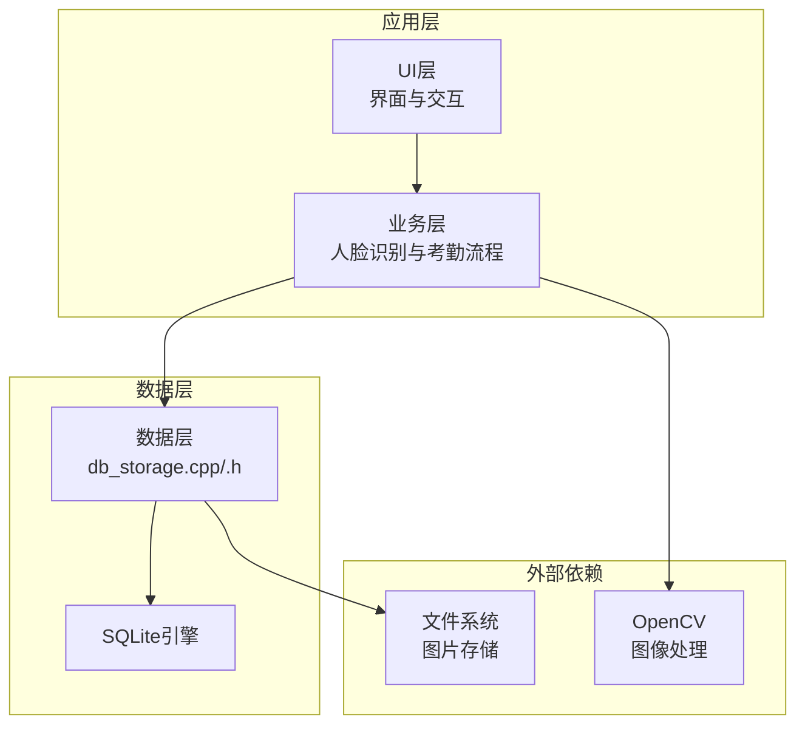
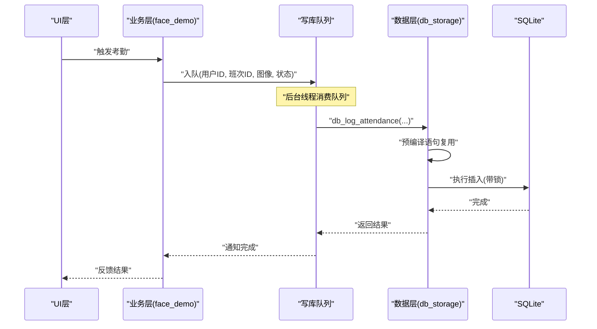
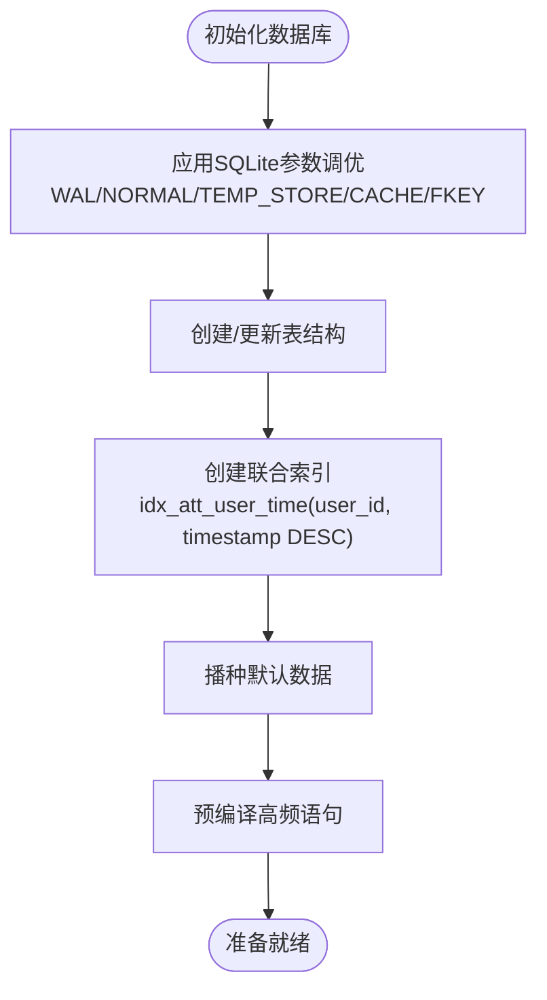
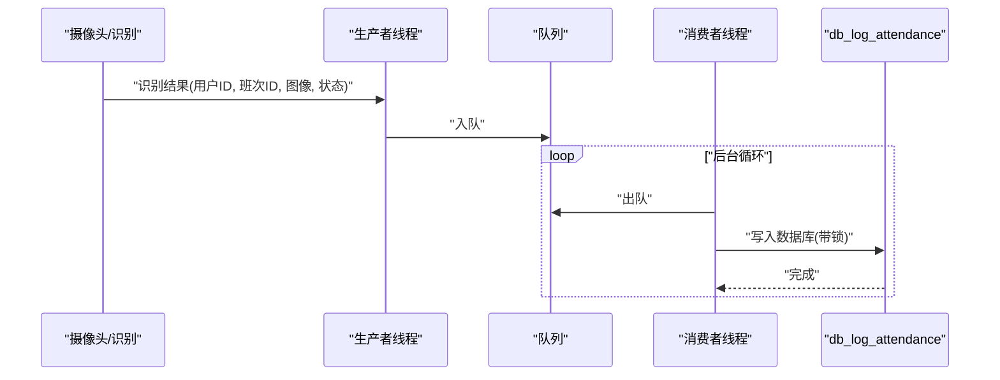
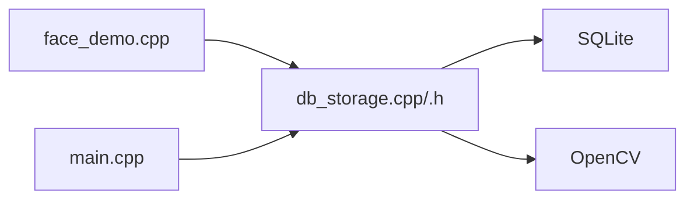

# 性能优化

<cite>
**本文引用的文件**
- [src/data/db_storage.cpp](file://src/data/db_storage.cpp)
- [src/data/db_storage.h](file://src/data/db_storage.h)
- [src/business/face_demo.cpp](file://src/business/face_demo.cpp)
- [tools/stress_test.sh](file://tools/stress_test.sh)
- [src/main.cpp](file://src/main.cpp)
</cite>

## 目录
1. [简介](#简介)
2. [项目结构](#项目结构)
3. [核心组件](#核心组件)
4. [架构总览](#架构总览)
5. [详细组件分析](#详细组件分析)
6. [依赖关系分析](#依赖关系分析)
7. [性能考量](#性能考量)
8. [故障排查指南](#故障排查指南)
9. [结论](#结论)
10. [附录](#附录)

## 简介
本指南面向SmartAttendance项目，聚焦SQLite数据库在嵌入式/边缘设备上的性能优化实践。内容涵盖查询优化、索引设计、缓存机制、并发控制、慢查询分析、内存与磁盘I/O优化、数据库维护（VACUUM、ANALYZE、表重建）、连接池与并发访问、性能监控与基准测试方法等。文档基于仓库现有实现进行归纳总结，并提供可操作的优化建议与排障步骤。

## 项目结构
SmartAttendance采用分层架构，数据层通过SQLite持久化，业务层负责人脸识别与考勤流程，UI层提供交互。数据库性能优化主要集中在数据层（db_storage）与业务层（face_demo）的协作中体现。

图表来源
- [src/data/db_storage.cpp:117-135](file://src/data/db_storage.cpp#L117-L135)
- [src/business/face_demo.cpp:935-951](file://src/business/face_demo.cpp#L935-L951)

章节来源
- [src/data/db_storage.cpp:117-135](file://src/data/db_storage.cpp#L117-L135)
- [src/data/db_storage.h:1-596](file://src/data/db_storage.h#L1-L596)

## 核心组件
- 数据层（db_storage）：封装SQLite连接、表结构初始化、事务、预编译语句、并发控制、BLOB存储、索引与查询接口。
- 业务层（face_demo）：人脸识别与考勤触发，采用生产者-消费者队列异步写库，降低主线程阻塞。
- 主程序（main）：应用启动、初始化数据库、打印系统信息。
- 工具脚本（stress_test.sh）：压力测试与内存监控。

章节来源
- [src/data/db_storage.cpp:108-285](file://src/data/db_storage.cpp#L108-L285)
- [src/data/db_storage.h:187-596](file://src/data/db_storage.h#L187-L596)
- [src/business/face_demo.cpp:935-951](file://src/business/face_demo.cpp#L935-L951)
- [src/main.cpp:82-106](file://src/main.cpp#L82-L106)
- [tools/stress_test.sh:1-20](file://tools/stress_test.sh#L1-L20)

## 架构总览
数据库性能优化的关键点：
- 启用WAL模式、调整同步级别、内存临时存储、增大缓存、开启外键约束。
- 预编译高频SQL，减少解析开销。
- 使用共享/独占锁实现读写分离，提升并发吞吐。
- BLOB数据（人脸、指纹、抓拍图）分离存储，避免大对象影响索引与查询。
- 事务批处理（批量导入/同步）显著提升写入效率。
- 智能排班查询通过多级索引与联合查询优化。

图表来源
- [src/business/face_demo.cpp:935-951](file://src/business/face_demo.cpp#L935-L951)
- [src/data/db_storage.cpp:1296-1348](file://src/data/db_storage.cpp#L1296-L1348)

章节来源
- [src/business/face_demo.cpp:935-951](file://src/business/face_demo.cpp#L935-L951)
- [src/data/db_storage.cpp:1296-1348](file://src/data/db_storage.cpp#L1296-L1348)

## 详细组件分析

### 数据层（db_storage）性能优化要点
- SQLite参数调优
  - WAL模式：提升读写并发，读写不互斥。
  - 同步级别：WAL模式下设为NORMAL兼顾安全与性能。
  - 临时存储：内存临时表/索引，减少磁盘IO。
  - 缓存大小：设置cache_size，增加页缓存容量。
  - 外键约束：开启外键保证数据一致性。
- 表结构与索引
  - 联合索引 idx_att_user_time(user_id, timestamp DESC)：加速“查某人最近打卡/某段时间记录”。
  - 外键约束：保证部门、班次、用户、考勤之间的参照完整性。
- 预编译语句与事务
  - 高频插入语句预编译并缓存，避免重复解析。
  - 批量导入使用事务，显著提升写入吞吐。
- 并发控制
  - 读写锁：共享锁用于读，独占锁用于写，降低锁竞争。
- BLOB与文件存储
  - 人脸、指纹、抓拍图以BLOB或文件形式存储，避免在热点查询列上存放大对象。
- 系统维护
  - 提供清理过期图片、清空表、恢复出厂设置等维护接口。

图表来源
- [src/data/db_storage.cpp:123-135](file://src/data/db_storage.cpp#L123-L135)
- [src/data/db_storage.cpp:253-268](file://src/data/db_storage.cpp#L253-L268)
- [src/data/db_storage.cpp:318-388](file://src/data/db_storage.cpp#L318-L388)
- [src/data/db_storage.cpp:275-282](file://src/data/db_storage.cpp#L275-L282)

章节来源
- [src/data/db_storage.cpp:123-135](file://src/data/db_storage.cpp#L123-L135)
- [src/data/db_storage.cpp:253-268](file://src/data/db_storage.cpp#L253-L268)
- [src/data/db_storage.cpp:318-388](file://src/data/db_storage.cpp#L318-L388)
- [src/data/db_storage.cpp:275-282](file://src/data/db_storage.cpp#L275-L282)

### 业务层（face_demo）并发与异步写库
- 生产者-消费者队列：将识别到的考勤记录放入队列，后台线程异步写库，避免主线程阻塞。
- 队列容量保护：当积压超过阈值时丢弃最新记录，防止内存耗尽。
- 写库线程：从队列取出记录，调用db_log_attendance，使用预编译语句与独占锁执行插入。

图表来源
- [src/business/face_demo.cpp:935-951](file://src/business/face_demo.cpp#L935-L951)
- [src/data/db_storage.cpp:1296-1348](file://src/data/db_storage.cpp#L1296-L1348)

章节来源
- [src/business/face_demo.cpp:935-951](file://src/business/face_demo.cpp#L935-L951)
- [src/data/db_storage.cpp:1296-1348](file://src/data/db_storage.cpp#L1296-L1348)

### 查询与索引优化
- 联合索引 idx_att_user_time：针对“按用户+时间倒序”的查询模式，避免全表扫描。
- 关联查询：在报表与UI列表中使用LEFT JOIN一次性拉取所需字段，减少N+1查询。
- 轻量查询：仅需ID/Name的场景使用不包含BLOB的查询，避免大对象传输。

章节来源
- [src/data/db_storage.cpp:253-268](file://src/data/db_storage.cpp#L253-L268)
- [src/data/db_storage.cpp:1439-1481](file://src/data/db_storage.cpp#L1439-L1481)
- [src/data/db_storage.cpp:1264-1292](file://src/data/db_storage.cpp#L1264-L1292)

### 缓存机制
- 页缓存：通过PRAGMA cache_size增大SQLite页缓存，提升热点数据命中率。
- 预编译语句：g_stmt_log_attendance复用，避免SQL解析与编译开销。
- 临时存储：PRAGMA temp_store=MEMORY，减少磁盘临时文件IO。

章节来源
- [src/data/db_storage.cpp:129-132](file://src/data/db_storage.cpp#L129-L132)
- [src/data/db_storage.cpp:275-282](file://src/data/db_storage.cpp#L275-L282)

### 大数据量场景下的瓶颈与对策
- 瓶颈识别
  - 磁盘IO：大量BLOB写入导致IO压力大。
  - 锁竞争：高并发写入导致独占锁争用。
  - 查询全表扫描：缺少合适索引导致慢查询。
- 对策
  - BLOB分离：抓拍图以文件存储，数据库仅存路径或BLOB，必要时拆分。
  - 并发写入：使用队列+后台线程异步写库，降低主线程阻塞。
  - 索引优化：为热点查询建立联合索引，避免ORDER BY/范围查询全表扫描。
  - 事务批处理：批量导入/同步使用事务，减少提交次数。

章节来源
- [src/data/db_storage.cpp:805-904](file://src/data/db_storage.cpp#L805-L904)
- [src/data/db_storage.cpp:1296-1348](file://src/data/db_storage.cpp#L1296-L1348)
- [src/data/db_storage.cpp:253-268](file://src/data/db_storage.cpp#L253-L268)

### 慢查询分析与执行计划优化
- 慢查询定位
  - 使用PRAGMA query_only与EXPLAIN QUERY PLAN（如可用）分析SQL执行路径。
  - 关注全表扫描、缺少索引、复杂JOIN与子查询。
- 优化手段
  - 为高频过滤/排序列建立索引。
  - 将复杂子查询改写为JOIN，减少嵌套层级。
  - 控制SELECT字段数量，避免不必要的BLOB传输。

章节来源
- [src/data/db_storage.cpp:1439-1481](file://src/data/db_storage.cpp#L1439-L1481)
- [src/data/db_storage.cpp:1264-1292](file://src/data/db_storage.cpp#L1264-L1292)

### 内存管理与磁盘I/O优化
- 内存
  - PRAGMA cache_size增大页缓存，提升热点命中。
  - 临时表/索引放内存，减少磁盘临时文件。
- 磁盘
  - 抓拍图文件独立存储，数据库仅存路径或小对象。
  - 定期清理过期图片，释放磁盘空间。

章节来源
- [src/data/db_storage.cpp:129-132](file://src/data/db_storage.cpp#L129-L132)
- [src/data/db_storage.cpp:1372-1436](file://src/data/db_storage.cpp#L1372-L1436)

### 数据库维护任务
- VACUUM：整理碎片、回收空间（建议在低峰期执行）。
- ANALYZE：更新统计信息，帮助查询优化器选择更优执行计划。
- 表重建：在Schema变更后，必要时重建索引或表以消除碎片。

章节来源
- [src/data/db_storage.cpp:1801-1883](file://src/data/db_storage.cpp#L1801-L1883)

### 连接池与并发访问优化
- 连接池：SQLite默认单写入连接，可通过WAL提升并发读能力。
- 并发控制：共享/独占锁分离读写，避免长时间持有独占锁。
- 事务批处理：批量写入使用BEGIN/COMMIT，减少事务开销。

章节来源
- [src/data/db_storage.cpp:35-38](file://src/data/db_storage.cpp#L35-L38)
- [src/data/db_storage.cpp:805-904](file://src/data/db_storage.cpp#L805-L904)
- [src/data/db_storage.cpp:1540-1552](file://src/data/db_storage.cpp#L1540-L1552)

### 性能测试与基准测试
- 压力测试脚本：监控应用运行期间RSS与内存占用，检测稳定性与内存泄漏风险。
- 建议扩展：结合数据库写入QPS、平均响应时间、慢查询比例等指标，形成基准报告。

章节来源
- [tools/stress_test.sh:1-20](file://tools/stress_test.sh#L1-L20)

## 依赖关系分析
- 数据层依赖SQLite与OpenCV（图像编码/解码）。
- 业务层依赖数据层提供的DAO接口与并发队列。
- 主程序负责初始化与展示系统信息。

图表来源
- [src/business/face_demo.cpp:935-951](file://src/business/face_demo.cpp#L935-L951)
- [src/data/db_storage.cpp:117-135](file://src/data/db_storage.cpp#L117-L135)
- [src/main.cpp:82-106](file://src/main.cpp#L82-L106)

章节来源
- [src/business/face_demo.cpp:935-951](file://src/business/face_demo.cpp#L935-L951)
- [src/data/db_storage.cpp:117-135](file://src/data/db_storage.cpp#L117-L135)
- [src/main.cpp:82-106](file://src/main.cpp#L82-L106)

## 性能考量
- 读写分离：WAL模式下读写不互斥，读多场景收益明显。
- 预编译与缓存：减少SQL解析与编译成本。
- 事务批处理：批量导入/同步显著提升写入吞吐。
- BLOB与文件分离：降低数据库体积与查询开销。
- 并发控制：共享/独占锁降低锁竞争，提升整体吞吐。

## 故障排查指南
- 数据库无法打开
  - 检查数据库文件是否存在与权限。
  - 查看错误信息并确认PRAGMA设置是否成功。
- 写入阻塞或延迟
  - 检查是否使用队列异步写库。
  - 确认独占锁持有时间是否过长。
- 查询缓慢
  - 检查是否命中联合索引。
  - 避免SELECT * 与BLOB传输。
- 磁盘空间不足
  - 定期清理过期图片。
  - 执行VACUUM回收空间。

章节来源
- [src/data/db_storage.cpp:117-135](file://src/data/db_storage.cpp#L117-L135)
- [src/data/db_storage.cpp:1372-1436](file://src/data/db_storage.cpp#L1372-L1436)
- [src/data/db_storage.cpp:1801-1883](file://src/data/db_storage.cpp#L1801-L1883)

## 结论
SmartAttendance在数据层已实现多项SQLite性能优化：WAL模式、缓存与临时存储、外键约束、联合索引、预编译语句与事务批处理。配合业务层的异步写库与并发控制，整体具备良好的读写并发与吞吐表现。建议在大数据量场景下进一步完善索引策略、定期维护数据库、扩展性能监控与基准测试体系，以持续保障系统稳定与高效。

## 附录
- 快速检查清单
  - 是否启用WAL与合适的同步级别
  - 是否为热点查询建立联合索引
  - 是否使用预编译语句与事务批处理
  - 是否将BLOB与大对象分离存储
  - 是否采用队列异步写库并控制队列长度
  - 是否定期清理过期数据与执行VACUUM