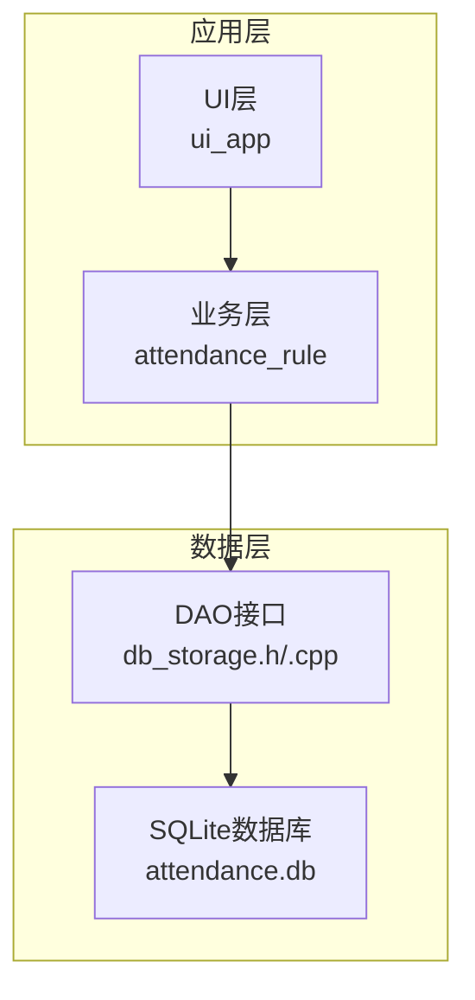
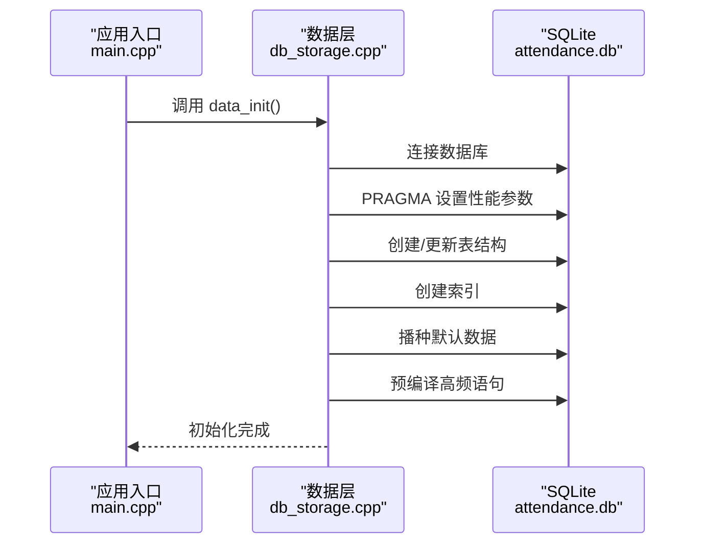
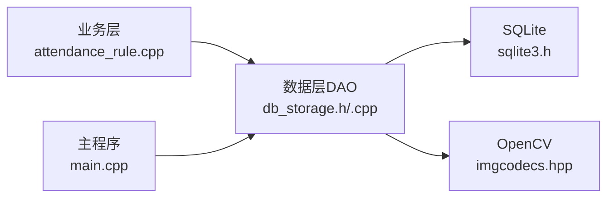

# 数据层设计

<cite>
**本文引用的文件**
- [db_storage.h](file://src/data/db_storage.h)
- [db_storage.cpp](file://src/data/db_storage.cpp)
- [main.cpp](file://src/main.cpp)
- [attendance_rule.h](file://src/business/attendance_rule.h)
- [attendance_rule.cpp](file://src/business/attendance_rule.cpp)
</cite>

## 目录
1. [简介](#简介)
2. [项目结构](#项目结构)
3. [核心组件](#核心组件)
4. [架构总览](#架构总览)
5. [详细组件分析](#详细组件分析)
6. [依赖分析](#依赖分析)
7. [性能考虑](#性能考虑)
8. [故障排查指南](#故障排查指南)
9. [结论](#结论)
10. [附录](#附录)

## 简介
本文件面向SmartAttendance项目的“数据层”，系统性梳理SQLite数据库设计、DAO模式实现、事务与并发控制、数据模型与业务约束、迁移与维护策略、性能优化与备份恢复方案，并给出关键查询与接口的参考路径，帮助开发者与运维人员快速理解与维护数据层。

## 项目结构
数据层位于src/data目录，核心文件为db_storage.h与db_storage.cpp，对外暴露统一的DAO接口，内部封装SQLite连接、表结构、索引、事务与并发控制。业务层（如考勤规则）通过这些接口进行数据访问。

图表来源
- [db_storage.h:189-596](file://src/data/db_storage.h#L189-L596)
- [db_storage.cpp:108-285](file://src/data/db_storage.cpp#L108-L285)
- [main.cpp:202-208](file://src/main.cpp#L202-L208)

章节来源
- [db_storage.h:1-596](file://src/data/db_storage.h#L1-L596)
- [db_storage.cpp:1-285](file://src/data/db_storage.cpp#L1-L285)
- [main.cpp:187-246](file://src/main.cpp#L187-L246)

## 核心组件
- 数据库初始化与表结构创建：在data_init()中完成数据库连接、性能调优、表结构创建与索引建立，并执行数据播种（seed）。
- DAO接口族：涵盖部门、班次、用户、考勤记录、排班、系统配置、节假日、铃声等的CRUD与批量操作。
- 事务与并发：使用RAII语句缓存、预编译语句、共享/排他锁实现读写分离与线程安全。
- 数据模型：以结构体形式抽象实体，如DeptInfo、ShiftInfo、UserData、AttendanceRecord、RuleConfig、BellSchedule、SystemStats等。
- 业务集成：业务层（如考勤规则）通过DAO接口完成排班查询、重复打卡检查、状态计算与入库。

章节来源
- [db_storage.h:16-596](file://src/data/db_storage.h#L16-L596)
- [db_storage.cpp:108-285](file://src/data/db_storage.cpp#L108-L285)
- [attendance_rule.cpp:198-277](file://src/business/attendance_rule.cpp#L198-L277)

## 架构总览
数据层采用“接口+实现”的分层设计，接口集中在头文件，实现集中在源文件。核心流程如下：
- 初始化：data_init()负责连接数据库、设置性能参数、创建/更新表结构、创建索引、播种默认数据、预编译高频语句。
- 业务调用：业务层通过DAO接口进行数据访问，DAO内部使用RAII语句管理器、锁与预编译语句保障性能与安全。
- 维护：提供工厂重置、清空数据、统计查询、系统配置KV表等维护能力。

图表来源
- [db_storage.cpp:108-285](file://src/data/db_storage.cpp#L108-L285)
- [main.cpp:202-208](file://src/main.cpp#L202-L208)

## 详细组件分析

### 数据库设计与表结构
- 部门表(departments)：主键自增，名称唯一。
- 班次表(shifts)：支持三时段与跨日标记。
- 用户表(users)：包含基本信息、权限、部门外键、默认班次外键、人脸与指纹BLOB、注册头像路径。
- 考勤记录表(attendance)：关联用户与班次，记录抓拍路径、时间戳与状态。
- 部门周排班表(dept_schedule)：联合主键(部门+星期)，外键约束。
- 用户特定日期排班表(user_schedule)：联合主键(用户+日期)，外键约束。
- 响铃计划表(bells)：固定1-16槽位，存储时间、持续时长、周期掩码与启用标志。
- 系统配置表(system_config)：键值对存储。
- 全局节假日表(holidays)：日期主键。
- 联合索引(idx_att_user_time)：加速按用户与时间倒序查询。

章节来源
- [db_storage.cpp:140-256](file://src/data/db_storage.cpp#L140-L256)

### 数据模型与实体
- DeptInfo：部门信息。
- ShiftInfo：班次信息，含三时段与跨日标记。
- RuleConfig：全局考勤规则，含迟到/早退阈值、设备参数、语言/日期格式、周末上班开关等。
- BellSchedule：铃声计划，含槽位、时间、时长、周期掩码与启用标志。
- UserData：用户信息，含基本信息、角色、部门、默认班次、人脸/指纹BLOB、头像路径、职位等。
- AttendanceRecord：考勤记录视图模型，含用户与部门名称、时间戳、状态、抓拍路径、迟到/早退分钟数。
- SystemStats：系统统计，含员工总数、管理员数、人脸/指纹/卡号注册数。

章节来源
- [db_storage.h:18-185](file://src/data/db_storage.h#L18-L185)

### DAO模式与CRUD实现
- 部门管理：添加、查询、删除。
- 班次管理：更新、查询、新增、删除。
- 用户管理：注册、批量导入、删除、查询详情、排班绑定、更新基本信息、更新人脸/密码/指纹、轻量列表。
- 考勤记录：记录打卡、查询时间段记录、查询个人记录、清理过期图片。
- 排班管理：设置部门周排班、设置个人特定日期排班、智能获取用户当天班次（含周末规则节点K）。
- 系统配置：键值对读写。
- 节假日管理：新增/修改、删除、查询。
- 铃声管理：查询全部、更新单条。
- 统计与维护：系统统计、清空考勤、清空用户、工厂重置。

章节来源
- [db_storage.h:215-596](file://src/data/db_storage.h#L215-L596)
- [db_storage.cpp:409-2171](file://src/data/db_storage.cpp#L409-L2171)

### 事务管理与连接池设计
- 事务：提供db_begin_transaction()/db_commit_transaction()，业务层在批量导入等场景显式开启事务，显著提升性能并保证原子性。
- 连接池：SQLite未内置连接池，数据层通过单实例连接与锁实现并发控制，避免多线程竞争。
- 预编译语句：对高频插入（打卡）使用预编译语句缓存，减少SQL解析开销。
- 锁策略：使用std::shared_mutex实现读写分离，读多写少场景下提升吞吐。

章节来源
- [db_storage.cpp:35-65](file://src/data/db_storage.cpp#L35-L65)
- [db_storage.cpp:806-904](file://src/data/db_storage.cpp#L806-L904)
- [db_storage.cpp:1540-1552](file://src/data/db_storage.cpp#L1540-L1552)

### 并发控制与线程安全
- 读写锁：共享锁用于读操作，排他锁用于写操作，避免读写互斥。
- RAII语句管理：ScopedSqliteStmt封装sqlite3_stmt生命周期，防止泄漏与Double Free。
- 文件系统：图片保存与删除使用C++17文件系统，配合锁保护。

章节来源
- [db_storage.cpp:42-65](file://src/data/db_storage.cpp#L42-L65)
- [db_storage.cpp:1315-1338](file://src/data/db_storage.cpp#L1315-L1338)

### 数据验证规则与业务约束
- 外键约束：部门/班次与用户/考勤记录的外键约束，ON DELETE SET NULL/CASCADE保证数据一致性。
- 唯一性：部门名称唯一。
- 业务规则：
  - 重复打卡限制：基于全局规则的duplicate_punch_limit分钟窗口。
  - 周末上班规则：节点K（sat_work/sun_work）决定周六/周日是否上班。
  - 折中原则：上午/下午打卡归属判定。
  - 状态计算：迟到/早退/旷工阈值与跨日处理。

章节来源
- [db_storage.cpp:194-207](file://src/data/db_storage.cpp#L194-L207)
- [db_storage.cpp:1697-1729](file://src/data/db_storage.cpp#L1697-L1729)
- [attendance_rule.cpp:198-277](file://src/business/attendance_rule.cpp#L198-L277)

### 数据库迁移策略
- 版本演进：通过ALTER TABLE为现有表增加新列，兼容旧版本数据库。
- 表结构创建：在data_init()中统一创建/更新所有表，确保部署一致性。
- 播种：首次初始化时自动插入默认部门、班次、管理员与铃声槽位，保证最小可用系统。

章节来源
- [db_storage.cpp:177-180](file://src/data/db_storage.cpp#L177-L180)
- [db_storage.cpp:318-387](file://src/data/db_storage.cpp#L318-L387)

### 备份与恢复机制
- 备份：直接复制数据库文件与图片目录即可完成备份。
- 恢复：停止服务后替换数据库文件与图片目录，重启服务。
- 工厂重置：一键删除数据库与图片目录并重新初始化，适合极端场景。

章节来源
- [db_storage.cpp:1864-1883](file://src/data/db_storage.cpp#L1864-L1883)

### 性能调优方案
- WAL模式：提升读写并发性能。
- 同步模式：WAL下使用NORMAL兼顾安全与性能。
- 临时表与索引：临时表与索引放入内存，减少磁盘IO。
- 缓存大小：增大cache_size提升命中率。
- 外键约束：开启foreign_keys确保一致性。
- 预编译语句：缓存高频插入语句。
- 索引：联合索引idx_att_user_time加速按用户与时间查询。

章节来源
- [db_storage.cpp:123-135](file://src/data/db_storage.cpp#L123-L135)
- [db_storage.cpp:275-282](file://src/data/db_storage.cpp#L275-L282)
- [db_storage.cpp:253-256](file://src/data/db_storage.cpp#L253-L256)

### 数据清理与磁盘管理
- 过期图片清理：按天数阈值扫描并删除过期图片，同时清空数据库中的路径字段，避免碎片化。

章节来源
- [db_storage.cpp:1372-1436](file://src/data/db_storage.cpp#L1372-L1436)

### SQL查询示例与接口参考
- 初始化与播种
  - [data_init():108-285](file://src/data/db_storage.cpp#L108-L285)
  - [data_seed():318-387](file://src/data/db_storage.cpp#L318-L387)
- 部门管理
  - [db_add_department():409-424](file://src/data/db_storage.cpp#L409-L424)
  - [db_get_departments():426-446](file://src/data/db_storage.cpp#L426-L446)
  - [db_delete_department():448-461](file://src/data/db_storage.cpp#L448-L461)
- 班次管理
  - [db_update_shift():465-493](file://src/data/db_storage.cpp#L465-L493)
  - [db_get_shifts():495-526](file://src/data/db_storage.cpp#L495-L526)
  - [db_get_shift_info():529-572](file://src/data/db_storage.cpp#L529-L572)
  - [db_add_shift():634-669](file://src/data/db_storage.cpp#L634-L669)
  - [db_delete_shift():671-695](file://src/data/db_storage.cpp#L671-L695)
- 用户管理
  - [db_add_user():748-803](file://src/data/db_storage.cpp#L748-L803)
  - [db_batch_add_users():806-904](file://src/data/db_storage.cpp#L806-L904)
  - [db_delete_user():979-992](file://src/data/db_storage.cpp#L979-L992)
  - [db_get_user_info():906-977](file://src/data/db_storage.cpp#L906-L977)
  - [db_get_all_users():994-1041](file://src/data/db_storage.cpp#L994-L1041)
  - [db_get_all_users_info():356-363](file://src/data/db_storage.cpp#L356-L363)
  - [db_assign_user_shift():1043-1060](file://src/data/db_storage.cpp#L1043-L1060)
  - [db_get_user_shift():1062-1094](file://src/data/db_storage.cpp#L1062-L1094)
  - [db_update_user_basic():1097-1125](file://src/data/db_storage.cpp#L1097-L1125)
  - [db_update_user_face():1128-1192](file://src/data/db_storage.cpp#L1128-L1192)
  - [db_update_user_password():1195-1216](file://src/data/db_storage.cpp#L1195-L1216)
  - [db_update_user_fingerprint():1219-1262](file://src/data/db_storage.cpp#L1219-L1262)
  - [db_get_all_users_light():1265-1292](file://src/data/db_storage.cpp#L1265-L1292)
- 考勤记录
  - [db_log_attendance():1296-1348](file://src/data/db_storage.cpp#L1296-L1348)
  - [db_get_records():1439-1481](file://src/data/db_storage.cpp#L1439-L1481)
  - [db_get_records_by_user():1484-1536](file://src/data/db_storage.cpp#L1484-L1536)
  - [db_getLastPunchTime():1351-1370](file://src/data/db_storage.cpp#L1351-L1370)
  - [db_cleanup_old_attendance_images():1373-1436](file://src/data/db_storage.cpp#L1373-L1436)
- 排班管理
  - [db_set_dept_schedule():1597-1614](file://src/data/db_storage.cpp#L1597-L1614)
  - [db_set_user_special_schedule():1616-1632](file://src/data/db_storage.cpp#L1616-L1632)
  - [db_get_user_shift_smart():1635-1763](file://src/data/db_storage.cpp#L1635-L1763)
- 系统配置与节假日
  - [db_get_system_config():1969-1988](file://src/data/db_storage.cpp#L1969-L1988)
  - [db_set_system_config():1991-2012](file://src/data/db_storage.cpp#L1991-L2012)
  - [db_set_holiday():2018-2038](file://src/data/db_storage.cpp#L2018-L2038)
  - [db_delete_holiday():2041-2055](file://src/data/db_storage.cpp#L2041-L2055)
  - [db_get_holiday():2058-2079](file://src/data/db_storage.cpp#L2058-L2079)
- 铃声管理
  - [db_get_all_bells():1887-1909](file://src/data/db_storage.cpp#L1887-L1909)
  - [db_update_bell():1912-1930](file://src/data/db_storage.cpp#L1912-L1930)
- 统计与维护
  - [db_get_system_stats():1935-1963](file://src/data/db_storage.cpp#L1935-L1963)
  - [db_clear_attendance():1807-1826](file://src/data/db_storage.cpp#L1807-L1826)
  - [db_clear_users():1832-1858](file://src/data/db_storage.cpp#L1832-L1858)
  - [db_factory_reset():1864-1883](file://src/data/db_storage.cpp#L1864-L1883)
  - [data_getLastImageID():1771-1799](file://src/data/db_storage.cpp#L1771-L1799)

## 依赖分析
- 业务层依赖数据层：考勤规则在recordAttendance()中调用db_get_user_shift_smart()、db_get_global_rules()、db_get_records_by_user()与db_log_attendance()。
- 数据层依赖SQLite：通过sqlite3.h与OpenCV进行数据库与图像处理。
- 主程序依赖数据层：main()在初始化阶段调用data_init()，并在退出时调用data_close()。

图表来源
- [attendance_rule.cpp:198-277](file://src/business/attendance_rule.cpp#L198-L277)
- [db_storage.h:189-596](file://src/data/db_storage.h#L189-L596)
- [db_storage.cpp:108-285](file://src/data/db_storage.cpp#L108-L285)
- [main.cpp:202-208](file://src/main.cpp#L202-L208)

章节来源
- [attendance_rule.cpp:1-277](file://src/business/attendance_rule.cpp#L1-L277)
- [db_storage.h:1-596](file://src/data/db_storage.h#L1-L596)
- [db_storage.cpp:1-285](file://src/data/db_storage.cpp#L1-L285)
- [main.cpp:187-246](file://src/main.cpp#L187-L246)

## 性能考虑
- 读写分离：共享锁用于读，排他锁用于写，降低锁竞争。
- 预编译语句：高频插入使用预编译语句缓存，减少解析成本。
- 索引优化：联合索引idx_att_user_time加速按用户与时间查询。
- WAL与缓存：WAL模式、内存临时表、增大缓存提升并发与命中率。
- 批量操作：批量导入使用事务包裹，显著提升吞吐。
- BLOB处理：人脸/指纹BLOB按需加载，避免不必要的I/O。

章节来源
- [db_storage.cpp:35-65](file://src/data/db_storage.cpp#L35-L65)
- [db_storage.cpp:275-282](file://src/data/db_storage.cpp#L275-L282)
- [db_storage.cpp:123-135](file://src/data/db_storage.cpp#L123-L135)
- [db_storage.cpp:253-256](file://src/data/db_storage.cpp#L253-L256)
- [db_storage.cpp:806-904](file://src/data/db_storage.cpp#L806-L904)

## 故障排查指南
- 初始化失败：检查数据库文件权限、磁盘空间、SQLite版本与OpenCV版本。
- SQL错误：查看exec_sql()输出的错误信息，定位具体SQL与标签。
- 锁竞争：确认读写操作是否正确加锁，避免长时间持有排他锁。
- 图片清理失败：检查IMAGE_DIR路径与文件权限，确保只删除该目录下的文件。
- 工厂重置：在极端情况下使用db_factory_reset()，注意备份后再操作。

章节来源
- [db_storage.cpp:96-104](file://src/data/db_storage.cpp#L96-L104)
- [db_storage.cpp:1372-1436](file://src/data/db_storage.cpp#L1372-L1436)
- [db_storage.cpp:1864-1883](file://src/data/db_storage.cpp#L1864-L1883)

## 结论
SmartAttendance数据层以SQLite为核心，采用清晰的DAO接口与完善的并发控制，结合预编译语句、索引与WAL优化，在保证一致性的同时兼顾性能。通过播种与迁移策略，系统具备良好的可部署性与可维护性。业务层通过标准化接口与严格的业务规则（重复打卡、周末规则、折中原则）实现可靠的考勤计算与记录。

## 附录
- 业务层与数据层交互：业务层在recordAttendance()中串联排班查询、重复打卡检查、状态计算与入库，体现完整的数据流。
- 初始化与关闭：主程序在启动时调用data_init()，退出时调用data_close()，确保资源正确释放。

章节来源
- [attendance_rule.cpp:198-277](file://src/business/attendance_rule.cpp#L198-L277)
- [main.cpp:202-208](file://src/main.cpp#L202-L208)
- [db_storage.cpp:390-405](file://src/data/db_storage.cpp#L390-L405)