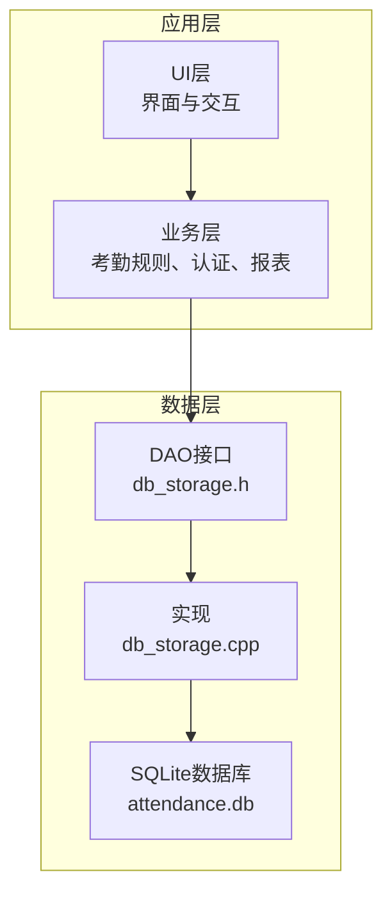
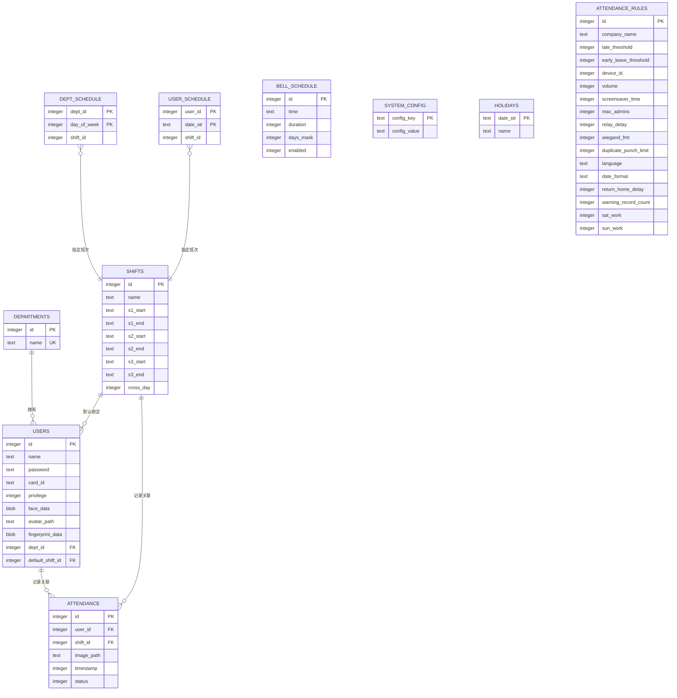
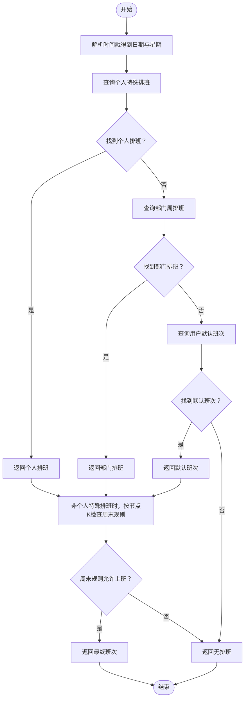
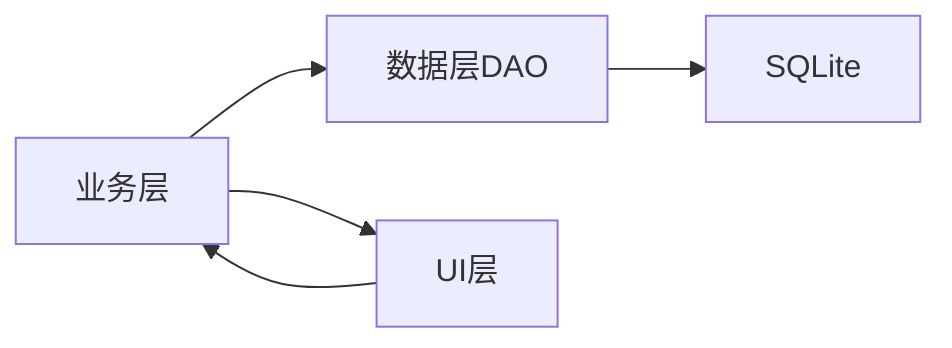

# 数据库设计

<cite>
**本文引用的文件**
- [db_storage.h](file://src/data/db_storage.h)
- [db_storage.cpp](file://src/data/db_storage.cpp)
- [SmartAttendance框架结构.txt](file://docs/SmartAttendance框架结构.txt)
- [attendance_rule.h](file://src/business/attendance_rule.h)
- [face_demo.h](file://src/business/face_demo.h)
</cite>

## 目录
1. [简介](#简介)
2. [项目结构](#项目结构)
3. [核心组件](#核心组件)
4. [架构总览](#架构总览)
5. [详细组件分析](#详细组件分析)
6. [依赖分析](#依赖分析)
7. [性能考量](#性能考量)
8. [故障排查指南](#故障排查指南)
9. [结论](#结论)
10. [附录](#附录)

## 简介
本文件面向SmartAttendance项目，系统性梳理基于SQLite的数据库设计与实现。重点覆盖以下方面：
- 整体架构：数据层DAO封装、SQLite表结构、索引与约束、外键关系
- 核心表设计：部门、班次、用户、考勤记录、系统配置、排班、响铃、节假日等
- ER关系图与表结构定义：主键、外键、唯一约束、检查约束
- 数据规范化与反规范化策略：冗余字段、联合索引、报表优化
- SQL创建语句示例与表关系图

## 项目结构
SmartAttendance采用分层架构，数据层位于src/data，负责SQLite数据库的初始化、表结构创建、种子数据播种、事务控制以及DAO接口实现。业务层通过数据层接口访问数据库，UI层负责展示与交互。

图表来源
- [SmartAttendance框架结构.txt:1-68](file://docs/SmartAttendance框架结构.txt#L1-L68)
- [db_storage.h:1-596](file://src/data/db_storage.h#L1-L596)
- [db_storage.cpp:1-285](file://src/data/db_storage.cpp#L1-L285)

章节来源
- [SmartAttendance框架结构.txt:1-68](file://docs/SmartAttendance框架结构.txt#L1-L68)
- [db_storage.h:1-596](file://src/data/db_storage.h#L1-L596)
- [db_storage.cpp:1-285](file://src/data/db_storage.cpp#L1-L285)

## 核心组件
- 数据层初始化与性能调优：开启WAL、设置同步级别、内存临时表、外键约束、缓存大小
- 表结构创建：departments、shifts、users、attendance、dept_schedule、user_schedule、bells、system_config、holidays
- 种子数据播种：默认部门、默认班次、默认管理员、默认响铃槽位
- DAO接口：部门、班次、用户、考勤、排班、系统配置、节假日、报表辅助查询
- 线程安全：共享读锁/排他写锁封装，预编译语句缓存，事务批处理

章节来源
- [db_storage.cpp:108-285](file://src/data/db_storage.cpp#L108-L285)
- [db_storage.h:188-596](file://src/data/db_storage.h#L188-L596)

## 架构总览
数据层以SQLite为核心，通过DAO接口对外提供统一的CRUD能力。核心表围绕“人-班-事”展开：用户与部门关联，用户绑定默认班次，考勤记录关联用户与班次；排班表支持部门周排班与个人特殊日期排班；系统配置表提供全局参数；节假日表用于考勤计算前置判断。

图表来源
- [db_storage.cpp:139-256](file://src/data/db_storage.cpp#L139-L256)
- [db_storage.h:18-186](file://src/data/db_storage.h#L18-L186)

## 详细组件分析

### 1) 部门表(departments)
- 设计要点
  - 主键自增id
  - 唯一约束name，保证部门名称唯一
- 字段说明
  - id：自增主键
  - name：部门名称，唯一
- 约束与索引
  - 唯一索引：name
- 典型操作
  - 添加部门、查询部门列表、删除部门（外键SET NULL）

章节来源
- [db_storage.cpp:139-143](file://src/data/db_storage.cpp#L139-L143)
- [db_storage.h:18-28](file://src/data/db_storage.h#L18-L28)

### 2) 班次表(shifts)
- 设计要点
  - 支持最多3个时段，跨天标志
  - 便于灵活排班与考勤计算
- 字段说明
  - id：自增主键
  - name：班次名称
  - s1_start/s1_end、s2_start/s2_end、s3_start/s3_end：各时段起止时间
  - cross_day：是否跨天
- 约束与索引
  - 无显式唯一约束
- 典型操作
  - 新增/更新班次、查询班次列表、删除班次

章节来源
- [db_storage.cpp:145-153](file://src/data/db_storage.cpp#L145-L153)
- [db_storage.h:30-55](file://src/data/db_storage.h#L30-L55)

### 3) 用户表(users)
- 设计要点
  - 存储用户基本信息、权限、默认班次、生物特征（人脸、指纹）、头像路径
  - 与部门、班次建立外键关系
- 字段说明
  - id：自增主键
  - name/password/card_id：基本信息
  - privilege：权限等级
  - face_data/fingerprint_data：二进制特征数据
  - avatar_path：注册时人脸图片路径
  - dept_id/default_shift_id：外键
- 约束与索引
  - 外键：dept_id -> departments(id) ON DELETE SET NULL
  - 外键：default_shift_id -> shifts(id) ON DELETE SET NULL
- 典型操作
  - 注册用户、批量导入、更新基本信息/人脸/密码/指纹、查询用户信息、删除用户（级联删除）

章节来源
- [db_storage.cpp:181-195](file://src/data/db_storage.cpp#L181-L195)
- [db_storage.h:100-142](file://src/data/db_storage.h#L100-L142)

### 4) 考勤记录表(attendance)
- 设计要点
  - 记录每次打卡的用户、班次、抓拍图片路径、时间戳、状态
  - 与用户、班次建立外键关系
- 字段说明
  - id：自增主键
  - user_id：外键
  - shift_id：外键
  - image_path：抓拍图片路径
  - timestamp：时间戳
  - status：考勤状态
- 约束与索引
  - 外键：user_id -> users(id) ON DELETE CASCADE
  - 外键：shift_id -> shifts(id) ON DELETE SET NULL
  - 联合索引：idx_att_user_time(user_id, timestamp DESC)
- 典型操作
  - 记录考勤、查询时间段记录、查询个人记录、清理过期图片

章节来源
- [db_storage.cpp:197-207](file://src/data/db_storage.cpp#L197-L207)
- [db_storage.cpp:253-256](file://src/data/db_storage.cpp#L253-L256)
- [db_storage.h:421-461](file://src/data/db_storage.h#L421-L461)

### 5) 部门周排班表(dept_schedule)
- 设计要点
  - 联合主键：dept_id + day_of_week，确保每个部门每天仅有一条规则
  - 与部门、班次建立外键关系
- 字段说明
  - dept_id/day_of_week：联合主键
  - shift_id：班次ID
- 约束与索引
  - 外键：dept_id -> departments(id) ON DELETE CASCADE
  - 外键：shift_id -> shifts(id) ON DELETE SET NULL
- 典型操作
  - 设置部门周排班

章节来源
- [db_storage.cpp:209-217](file://src/data/db_storage.cpp#L209-L217)
- [db_storage.h:475-491](file://src/data/db_storage.h#L475-L491)

### 6) 个人特殊日期排班表(user_schedule)
- 设计要点
  - 联合主键：user_id + date_str，支持个人特定日期排班
  - 与用户、班次建立外键关系
- 字段说明
  - user_id/date_str：联合主键
  - shift_id：班次ID
- 约束与索引
  - 外键：user_id -> users(id) ON DELETE CASCADE
  - 外键：shift_id -> shifts(id) ON DELETE SET NULL
- 典型操作
  - 设置个人特殊日期排班

章节来源
- [db_storage.cpp:219-227](file://src/data/db_storage.cpp#L219-L227)
- [db_storage.h:485-491](file://src/data/db_storage.h#L485-L491)

### 7) 响铃计划表(bells)
- 设计要点
  - 固定16个槽位，每条记录对应一个响铃配置
- 字段说明
  - id：固定ID 1-16
  - time/duration/days_mask/enabled：响铃时间、时长、周期掩码、启用状态
- 约束与索引
  - 主键：id
- 典型操作
  - 获取全部响铃配置、更新单个响铃配置

章节来源
- [db_storage.cpp:229-237](file://src/data/db_storage.cpp#L229-L237)
- [db_storage.h:88-98](file://src/data/db_storage.h#L88-L98)

### 8) 系统配置表(system_config)
- 设计要点
  - 键值对存储，便于扩展系统参数
- 字段说明
  - config_key：主键
  - config_value：值
- 约束与索引
  - 主键：config_key
- 典型操作
  - 获取/设置系统配置

章节来源
- [db_storage.cpp:239-244](file://src/data/db_storage.cpp#L239-L244)
- [db_storage.h:536-552](file://src/data/db_storage.h#L536-L552)

### 9) 全局节假日表(holidays)
- 设计要点
  - 以日期为主键，便于快速判断某日是否节假日
- 字段说明
  - date_str：主键
  - name：节日名称
- 约束与索引
  - 主键：date_str
- 典型操作
  - 设置/删除/查询节假日

章节来源
- [db_storage.cpp:246-251](file://src/data/db_storage.cpp#L246-L251)
- [db_storage.h:554-576](file://src/data/db_storage.h#L554-L576)

### 10) 考勤规则表(attendance_rules)
- 设计要点
  - 存放全局考勤参数，如迟到阈值、音量、设备ID、周末上班开关等
  - 兼容旧版本：动态添加列
- 字段说明
  - 多个业务参数字段（详见头文件注释）
- 约束与索引
  - 主键：id（固定为1）
- 典型操作
  - 获取/更新全局规则

章节来源
- [db_storage.cpp:155-179](file://src/data/db_storage.cpp#L155-L179)
- [db_storage.h:58-86](file://src/data/db_storage.h#L58-L86)

### 11) 数据库初始化与性能调优
- 初始化流程
  - 创建/更新表结构
  - 创建联合索引
  - 播种默认数据
  - 预编译高频SQL
- 性能调优
  - PRAGMA journal_mode=WAL
  - PRAGMA synchronous=NORMAL
  - PRAGMA temp_store=MEMORY
  - PRAGMA cache_size=-20000
  - PRAGMA foreign_keys=ON

章节来源
- [db_storage.cpp:108-285](file://src/data/db_storage.cpp#L108-L285)

### 12) 排班智能查询(db_get_user_shift_smart)
- 设计要点
  - 优先级：个人特殊排班 > 部门周排班 > 用户默认班次
  - 周末规则节点K：周六/周日是否上班由全局规则控制
- 流程图

图表来源
- [db_storage.cpp:1634-1763](file://src/data/db_storage.cpp#L1634-L1763)
- [db_storage.h:495-503](file://src/data/db_storage.h#L495-L503)

## 依赖分析
- 数据层依赖
  - SQLite3：数据库引擎
  - OpenCV：图像处理与特征存储
  - C++标准库：文件系统、线程同步、容器
- 组件耦合
  - 业务层通过数据层接口访问数据库，降低UI与数据存储耦合
  - 数据层内部通过预编译语句与事务提升性能
- 外部集成
  - UI层通过业务层接口间接使用数据层
  - 报表生成器依赖数据层批量查询接口

图表来源
- [db_storage.h:188-596](file://src/data/db_storage.h#L188-L596)
- [SmartAttendance框架结构.txt:1-68](file://docs/SmartAttendance框架结构.txt#L1-L68)

章节来源
- [db_storage.h:188-596](file://src/data/db_storage.h#L188-L596)
- [SmartAttendance框架结构.txt:1-68](file://docs/SmartAttendance框架结构.txt#L1-L68)

## 性能考量
- 索引策略
  - 联合索引idx_att_user_time(user_id, timestamp DESC)：加速按用户与时间范围查询
- 事务与批处理
  - 批量导入用户使用事务，显著提升写入性能
  - 预编译语句缓存：减少SQL解析开销
- 并发控制
  - 读写分离：共享读锁用于查询，排他写锁用于写入
  - 避免长时间持有锁，缩短临界区
- 存储与缓存
  - 抓拍图片落盘，数据库仅存路径，减少BLOB体积
  - 临时表与索引置于内存，降低磁盘IO
- 外键与一致性
  - 开启外键约束，确保引用完整性
  - 级联删除与SET NULL策略，避免悬挂引用

章节来源
- [db_storage.cpp:123-135](file://src/data/db_storage.cpp#L123-L135)
- [db_storage.cpp:253-256](file://src/data/db_storage.cpp#L253-L256)
- [db_storage.cpp:806-904](file://src/data/db_storage.cpp#L806-L904)
- [db_storage.cpp:1314-1347](file://src/data/db_storage.cpp#L1314-L1347)

## 故障排查指南
- 数据库连接失败
  - 检查数据库文件是否存在与权限
  - 确认初始化流程未提前退出
- SQL执行错误
  - 查看错误日志中的tag标识
  - 核对SQL语法与表结构
- 外键约束失败
  - 确认被引用的主键存在
  - 检查删除策略（SET NULL/CASCADE）是否符合预期
- 性能问题
  - 确认索引是否命中
  - 检查是否频繁创建/销毁语句
  - 评估事务使用是否合理
- 数据清理
  - 清空考勤记录会删除图片目录并重建
  - 恢复出厂设置会删除数据库与图片目录并重新初始化

章节来源
- [db_storage.cpp:96-104](file://src/data/db_storage.cpp#L96-L104)
- [db_storage.cpp:1807-1826](file://src/data/db_storage.cpp#L1807-L1826)
- [db_storage.cpp:1864-1883](file://src/data/db_storage.cpp#L1864-L1883)

## 结论
SmartAttendance的数据库设计遵循“以业务为中心”的规范化与反规范化结合策略：
- 规范化：通过外键与唯一约束保证数据一致性
- 反规范化：在报表查询中通过联合索引与冗余字段（如用户姓名、部门名称）减少联表成本
- 性能优化：WAL、内存临时表、预编译语句、事务批处理、读写锁
- 可扩展性：系统配置表与动态列兼容，满足未来参数扩展需求

## 附录

### A. 表结构定义与约束
- departments
  - 主键：id
  - 唯一：name
- shifts
  - 主键：id
- users
  - 主键：id
  - 外键：dept_id -> departments(id) ON DELETE SET NULL
  - 外键：default_shift_id -> shifts(id) ON DELETE SET NULL
- attendance
  - 主键：id
  - 外键：user_id -> users(id) ON DELETE CASCADE
  - 外键：shift_id -> shifts(id) ON DELETE SET NULL
  - 索引：idx_att_user_time(user_id, timestamp DESC)
- dept_schedule
  - 主键：(dept_id, day_of_week)
  - 外键：dept_id -> departments(id) ON DELETE CASCADE
  - 外键：shift_id -> shifts(id) ON DELETE SET NULL
- user_schedule
  - 主键：(user_id, date_str)
  - 外键：user_id -> users(id) ON DELETE CASCADE
  - 外键：shift_id -> shifts(id) ON DELETE SET NULL
- bells
  - 主键：id
- system_config
  - 主键：config_key
- holidays
  - 主键：date_str
- attendance_rules
  - 主键：id

章节来源
- [db_storage.cpp:139-256](file://src/data/db_storage.cpp#L139-L256)
- [db_storage.h:18-186](file://src/data/db_storage.h#L18-L186)

### B. SQL创建语句示例（路径引用）
- 创建部门表
  - [db_storage.cpp:140-143](file://src/data/db_storage.cpp#L140-L143)
- 创建班次表
  - [db_storage.cpp:146-153](file://src/data/db_storage.cpp#L146-L153)
- 创建考勤规则表
  - [db_storage.cpp:156-179](file://src/data/db_storage.cpp#L156-L179)
- 创建用户表
  - [db_storage.cpp:182-195](file://src/data/db_storage.cpp#L182-L195)
- 创建考勤记录表
  - [db_storage.cpp:198-207](file://src/data/db_storage.cpp#L198-L207)
- 创建部门周排班表
  - [db_storage.cpp:210-217](file://src/data/db_storage.cpp#L210-L217)
- 创建个人特殊日期排班表
  - [db_storage.cpp:220-227](file://src/data/db_storage.cpp#L220-L227)
- 创建响铃计划表
  - [db_storage.cpp:230-237](file://src/data/db_storage.cpp#L230-L237)
- 创建系统配置表
  - [db_storage.cpp:240-244](file://src/data/db_storage.cpp#L240-L244)
- 创建节假日表
  - [db_storage.cpp:247-251](file://src/data/db_storage.cpp#L247-L251)
- 创建联合索引
  - [db_storage.cpp:255-256](file://src/data/db_storage.cpp#L255-L256)

### C. 数据流与业务流程
- 人脸识别与考勤记录
  - 业务层调用数据层接口，完成排班查询、状态计算、记录写入
- 报表生成
  - 使用批量查询接口一次性拉取所需数据，避免N+1查询

章节来源
- [face_demo.h:120-166](file://src/business/face_demo.h#L120-L166)
- [attendance_rule.h:43-88](file://src/business/attendance_rule.h#L43-L88)
- [db_storage.h:578-594](file://src/data/db_storage.h#L578-L594)