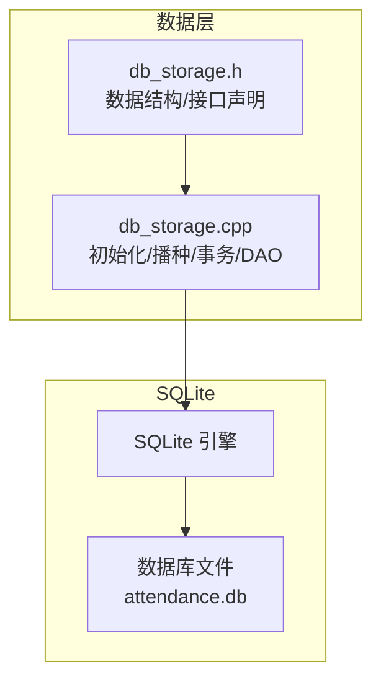
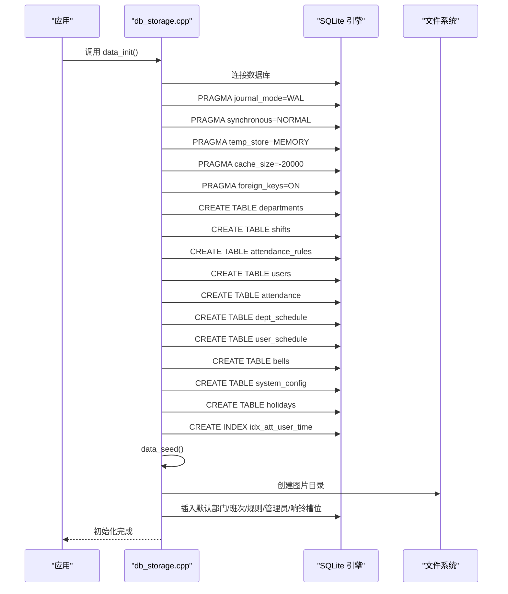
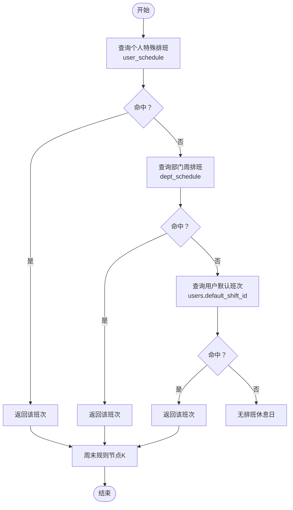
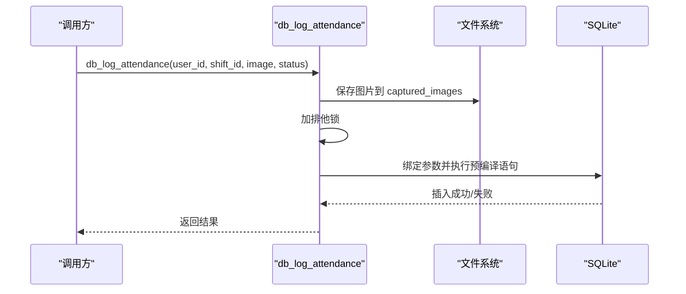
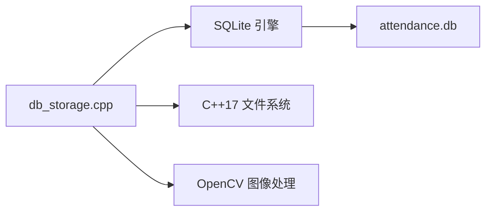
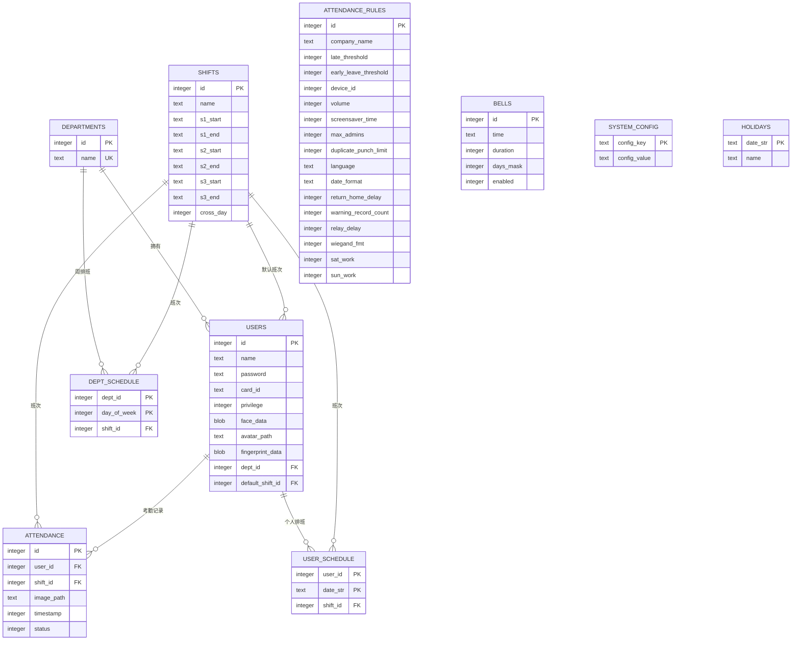

# 数据库表结构

<cite>
**本文引用的文件**
- [db_storage.cpp](file://src/data/db_storage.cpp)
- [db_storage.h](file://src/data/db_storage.h)
</cite>

## 目录
1. [简介](#简介)
2. [项目结构](#项目结构)
3. [核心组件](#核心组件)
4. [架构总览](#架构总览)
5. [详细组件分析](#详细组件分析)
6. [依赖分析](#依赖分析)
7. [性能考量](#性能考量)
8. [故障排查指南](#故障排查指南)
9. [结论](#结论)
10. [附录](#附录)

## 简介
本文件系统性梳理 SmartAttendance 项目中基于 SQLite 的数据库表结构设计，覆盖 departments（部门）、shifts（班次）、users（用户）、attendance（考勤记录）、attendance_rules（规则配置）、dept_schedule（部门周排班）、user_schedule（用户特定日期排班）、bells（响铃计划）、system_config（系统全局配置）、holidays（节假日）等核心表。文档重点阐述：
- 字段定义、数据类型、约束与索引
- 表间外键关系与参照完整性
- 数据库初始化流程、表创建与播种机制
- ER 关系图与数据模型规范化
- 性能优化策略与并发控制
- 数据库迁移与版本升级建议

## 项目结构
SmartAttendance 的数据层集中于 src/data/db_storage.cpp/.h，负责：
- SQLite 连接与性能调优（WAL、同步级别、缓存、外键）
- 表结构创建与升级（CREATE TABLE、ALTER TABLE）
- 数据播种（默认部门、班次、管理员、响铃槽位）
- 高频 CRUD 操作与事务支持
- 排班智能查询（个人特殊排班 > 部门周排班 > 默认班次）

图表来源
- [db_storage.cpp:108-285](file://src/data/db_storage.cpp#L108-L285)
- [db_storage.h:187-213](file://src/data/db_storage.h#L187-L213)

章节来源
- [db_storage.cpp:108-285](file://src/data/db_storage.cpp#L108-L285)
- [db_storage.h:187-213](file://src/data/db_storage.h#L187-L213)

## 核心组件
- 数据库初始化与性能调优：启用 WAL、设置同步级别、内存临时存储、缓存大小、开启外键约束
- 表结构创建：departments、shifts、users、attendance、attendance_rules、dept_schedule、user_schedule、bells、system_config、holidays
- 数据播种：默认部门、标准班次、默认规则、默认管理员、响铃槽位
- 高频操作：考勤记录插入（预编译语句）、用户/班次/部门 CRUD、排班智能查询、报表批量查询
- 并发控制：共享读锁/排他写锁，保证线程安全

章节来源
- [db_storage.cpp:108-285](file://src/data/db_storage.cpp#L108-L285)
- [db_storage.cpp:318-388](file://src/data/db_storage.cpp#L318-L388)
- [db_storage.cpp:1296-1348](file://src/data/db_storage.cpp#L1296-L1348)
- [db_storage.h:187-596](file://src/data/db_storage.h#L187-L596)

## 架构总览
数据库初始化流程与播种机制如下：

图表来源
- [db_storage.cpp:108-285](file://src/data/db_storage.cpp#L108-L285)
- [db_storage.cpp:318-388](file://src/data/db_storage.cpp#L318-L388)

章节来源
- [db_storage.cpp:108-285](file://src/data/db_storage.cpp#L108-L285)
- [db_storage.cpp:318-388](file://src/data/db_storage.cpp#L318-L388)

## 详细组件分析

### 表结构与字段定义

- departments（部门表）
  - 字段：id（主键，自增）、name（非空，唯一）
  - 约束：UNIQUE(name)
  - 用途：归属用户、部门周排班

- shifts（班次表）
  - 字段：id（主键，自增）、name、s1_start/s1_end、s2_start/s2_end、s3_start/s3_end、cross_day（是否跨天）
  - 约束：无显式唯一约束，但通过业务逻辑保证名称可用
  - 用途：用户默认班次、考勤计算依据

- attendance_rules（规则配置表）
  - 字段：id（主键，自增）、company_name、late_threshold、early_leave_threshold、device_id、volume、screensaver_time、max_admins、duplicate_punch_limit、language、date_format、return_home_delay、warning_record_count、relay_delay、wiegand_fmt、sat_work、sun_work
  - 约束：默认值覆盖，兼容旧版本通过 ALTER TABLE 动态添加列
  - 用途：全局考勤规则、设备参数、周末上班开关

- users（用户表）
  - 字段：id（主键，自增）、name（非空）、password、card_id、privilege（角色）、face_data（BLOB）、avatar_path、fingerprint_data（BLOB）、dept_id（外键）、default_shift_id（外键）
  - 约束：外键 dept_id -> departments(id) ON DELETE SET NULL；外键 default_shift_id -> shifts(id) ON DELETE SET NULL
  - 用途：身份认证、权限、生物特征、默认班次

- attendance（考勤记录表）
  - 字段：id（主键，自增）、user_id（非空）、shift_id（外键）、image_path、timestamp、status
  - 约束：外键 user_id -> users(id) ON DELETE CASCADE；外键 shift_id -> shifts(id) ON DELETE SET NULL
  - 索引：idx_att_user_time(user_id, timestamp DESC)
  - 用途：打卡记录、报表统计

- dept_schedule（部门周排班表）
  - 字段：dept_id、day_of_week（0-6）、shift_id
  - 主键：联合主键(dept_id, day_of_week)
  - 约束：外键 dept_id -> departments(id) ON DELETE CASCADE；外键 shift_id -> shifts(id) ON DELETE SET NULL
  - 用途：按部门设定每周排班

- user_schedule（用户特定日期排班表）
  - 字段：user_id、date_str（YYYY-MM-DD）、shift_id
  - 主键：联合主键(user_id, date_str)
  - 约束：外键 user_id -> users(id) ON DELETE CASCADE；外键 shift_id -> shifts(id) ON DELETE SET NULL
  - 用途：个人调休/加班/特殊排班

- bells（响铃计划表）
  - 字段：id（固定1-16）、time（HH:MM）、duration（秒）、days_mask（位掩码）、enabled（0/1）
  - 约束：id 为主键
  - 用途：定时响铃配置

- system_config（系统全局配置表）
  - 字段：config_key（主键）、config_value
  - 约束：主键唯一
  - 用途：键值型配置（如设备ID、音量、语言等）

- holidays（节假日表）
  - 字段：date_str（主键，YYYY-MM-DD）、name
  - 约束：主键唯一
  - 用途：全局节假日管理

章节来源
- [db_storage.cpp:140-251](file://src/data/db_storage.cpp#L140-L251)
- [db_storage.cpp:255](file://src/data/db_storage.cpp#L255)

### 外键关系与参照完整性
- departments 与 users：多对一（users.dept_id -> departments.id），删除部门时将用户 dept_id 置空
- users 与 attendance：一对多（users.id -> attendance.user_id），删除用户时级联删除其考勤记录
- shifts 与 users：多对一（users.default_shift_id -> shifts.id），删除班次时将用户默认班次置空
- shifts 与 attendance：多对一（attendance.shift_id -> shifts.id），删除班次时将记录 shift_id 置空
- dept_schedule：联合主键，删除部门或班次时级联删除
- user_schedule：联合主键，删除用户或班次时级联删除

章节来源
- [db_storage.cpp:194-195](file://src/data/db_storage.cpp#L194-L195)
- [db_storage.cpp:206-207](file://src/data/db_storage.cpp#L206-L207)
- [db_storage.cpp:216-217](file://src/data/db_storage.cpp#L216-L217)
- [db_storage.cpp:226-227](file://src/data/db_storage.cpp#L226-L227)

### 数据库初始化与播种机制
- 初始化步骤
  - 连接数据库
  - 应用性能 PRAGMA：WAL、同步级别、临时存储、缓存、外键
  - 创建全部表与索引
  - 预编译高频插入语句
- 播种逻辑
  - 若 departments 为空：插入默认部门（如 Not Set、R&D、HR）
  - 若 shifts 为空：插入标准班次（上午/下午，无加班）
  - 若 attendance_rules 为空：插入默认规则（迟到阈值、周末开关等）
  - 若 users 为空：创建默认管理员 SuperAdmin，归属首个部门
  - 若 bells 为空：批量插入16个响铃槽位（默认禁用）

章节来源
- [db_storage.cpp:108-135](file://src/data/db_storage.cpp#L108-L135)
- [db_storage.cpp:137-268](file://src/data/db_storage.cpp#L137-L268)
- [db_storage.cpp:275-282](file://src/data/db_storage.cpp#L275-L282)
- [db_storage.cpp:318-388](file://src/data/db_storage.cpp#L318-L388)

### 排班智能查询流程
- 优先级：个人特殊排班 > 部门周排班 > 用户默认班次
- 周末规则：若非个人特殊排班，按全局规则（sat_work/sun_work）判定是否上班
- 返回：ShiftInfo（包含各时段与跨天标志）

图表来源
- [db_storage.cpp:1635-1763](file://src/data/db_storage.cpp#L1635-L1763)

章节来源
- [db_storage.cpp:1635-1763](file://src/data/db_storage.cpp#L1635-L1763)

### 考勤记录插入与并发控制
- 插入流程
  - 保存抓拍图为本地文件（非数据库）
  - 预编译语句插入 attendance 表（user_id、shift_id、image_path、timestamp、status）
- 并发控制
  - 使用共享读锁/排他写锁，保证线程安全
  - 预编译语句减少解析开销，提升吞吐

图表来源
- [db_storage.cpp:1296-1348](file://src/data/db_storage.cpp#L1296-L1348)

章节来源
- [db_storage.cpp:1296-1348](file://src/data/db_storage.cpp#L1296-L1348)

### 数据模型规范化与性能优化
- 规范化
  - 一对一/多对一关系通过外键实现，消除冗余
  - 用户默认班次与实际班次分离，支持灵活排班
  - 响铃计划独立表，便于扩展
- 性能优化
  - WAL 模式提升并发读写
  - NORMAL 同步兼顾安全与性能
  - 临时表/索引内存化，减少磁盘 IO
  - 缓存增大，降低页换入换出
  - 外键约束启用，保障一致性
  - 联合主键避免重复排班
  - 联合索引 idx_att_user_time 加速按用户与时间查询

章节来源
- [db_storage.cpp:123-135](file://src/data/db_storage.cpp#L123-L135)
- [db_storage.cpp:255](file://src/data/db_storage.cpp#L255)

### 数据库迁移与版本升级
- 现状
  - 通过 CREATE TABLE IF NOT EXISTS 保证幂等
  - 通过 ALTER TABLE 动态添加列（如 attendance_rules 的 sat_work/sun_work）
- 建议
  - 引入版本号字段与迁移脚本，按版本号执行增量迁移
  - 对重要表变更增加备份/回滚策略
  - 严格测试 ALTER TABLE 的兼容性与性能影响
  - 对历史数据进行迁移与校验

章节来源
- [db_storage.cpp:177-179](file://src/data/db_storage.cpp#L177-L179)

## 依赖分析
- 组件耦合
  - db_storage.cpp 依赖 SQLite 引擎与文件系统
  - 表间通过外键建立强耦合，遵循参照完整性
- 外部依赖
  - SQLite3（数据库引擎）
  - OpenCV（图片编解码）
  - C++17 文件系统（目录与文件操作）

图表来源
- [db_storage.cpp:1-21](file://src/data/db_storage.cpp#L1-L21)

章节来源
- [db_storage.cpp:1-21](file://src/data/db_storage.cpp#L1-L21)

## 性能考量
- 读写并发
  - WAL 模式显著提升并发读写性能
  - 读写不互斥，适合高并发场景
- 索引与查询
  - idx_att_user_time(user_id, timestamp DESC) 优化按用户与时间范围查询
  - 联表查询使用 LEFT JOIN，避免 N+1 问题
- 写入优化
  - 预编译语句减少 SQL 解析成本
  - 事务批量写入（如批量导入用户）
- 存储与缓存
  - 临时表/索引内存化，减少磁盘 IO
  - 增大缓存，提高热点数据命中率
- 外键约束
  - 开启外键约束，确保数据一致性，避免脏数据

[本节为通用指导，无需具体文件引用]

## 故障排查指南
- 初始化失败
  - 检查数据库文件权限与路径
  - 查看 PRAGMA 设置是否成功
- 插入失败
  - 检查预编译语句是否成功
  - 校验外键是否存在（用户/班次/部门）
- 查询异常
  - 确认索引是否存在
  - 检查时间戳范围与排序
- 数据不一致
  - 确认外键约束已启用
  - 检查 CASCADE/SET NULL 行为是否符合预期

章节来源
- [db_storage.cpp:118-135](file://src/data/db_storage.cpp#L118-L135)
- [db_storage.cpp:1296-1348](file://src/data/db_storage.cpp#L1296-L1348)

## 结论
SmartAttendance 的数据库设计以 SQLite 为核心，围绕“部门-用户-班次-考勤”主线构建，辅以排班、规则、响铃、节假日等扩展表，形成完整的考勤数据模型。通过 WAL、索引、预编译语句与事务等手段实现高性能与高可靠性；通过外键与播种机制保障数据一致性与可用性。建议后续引入正式的版本迁移方案，进一步增强可维护性与可演进性。

[本节为总结性内容，无需具体文件引用]

## 附录

### ER 关系图

图表来源
- [db_storage.cpp:140-251](file://src/data/db_storage.cpp#L140-L251)