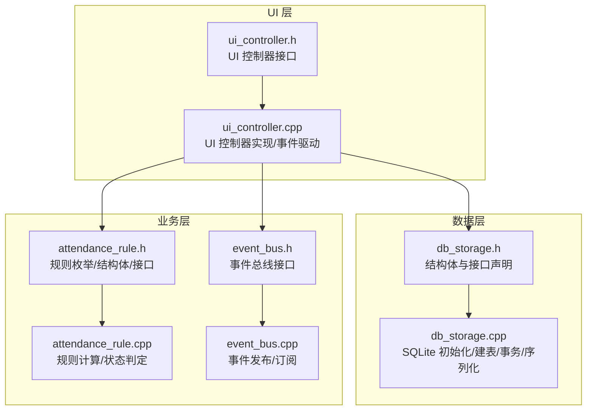
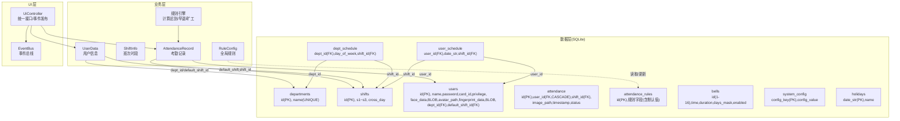
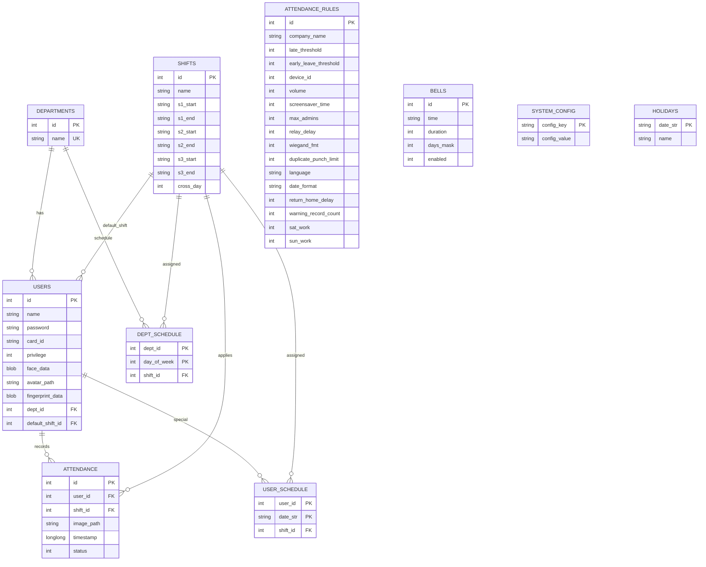
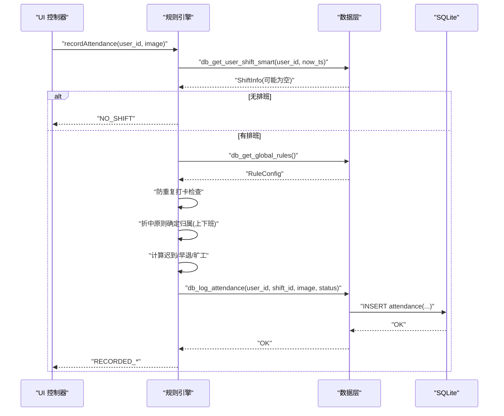
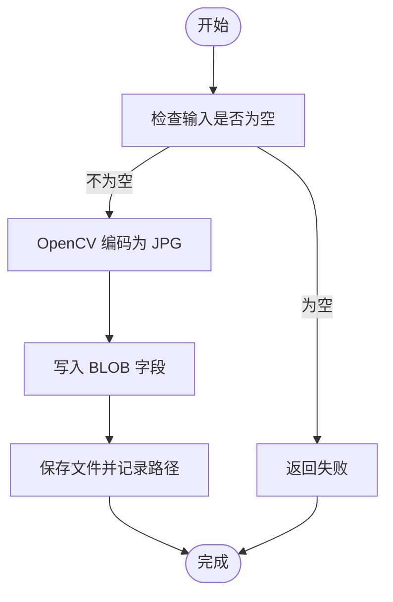
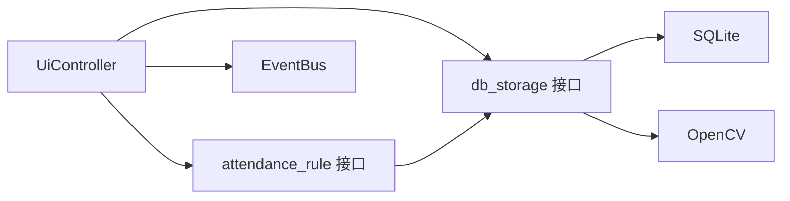

# 数据模型

<cite>
**本文引用的文件**
- [db_storage.h](file://src/data/db_storage.h)
- [db_storage.cpp](file://src/data/db_storage.cpp)
- [attendance_rule.h](file://src/business/attendance_rule.h)
- [attendance_rule.cpp](file://src/business/attendance_rule.cpp)
- [ui_controller.h](file://src/ui/ui_controller.h)
- [ui_controller.cpp](file://src/ui/ui_controller.cpp)
- [event_bus.h](file://src/business/event_bus.h)
- [event_bus.cpp](file://src/business/event_bus.cpp)
</cite>

## 目录
1. [简介](#简介)
2. [项目结构](#项目结构)
3. [核心组件](#核心组件)
4. [架构总览](#架构总览)
5. [详细组件分析](#详细组件分析)
6. [依赖分析](#依赖分析)
7. [性能考量](#性能考量)
8. [故障排查指南](#故障排查指南)
9. [结论](#结论)
10. [附录](#附录)

## 简介
本文件系统化梳理 SmartAttendance 的数据模型与规则引擎，聚焦以下核心数据结构：DeptInfo（部门信息）、ShiftInfo（班次信息）、UserData（用户信息）、AttendanceRecord（考勤记录）、RuleConfig（规则配置）。文档涵盖字段语义、数据类型、约束条件、业务规则、序列化/反序列化策略、验证与完整性保障、关联查询策略、版本演进与兼容性设计，并通过多种图示展示数据模型间的关系与典型流程。

## 项目结构
SmartAttendance 的数据模型主要位于数据层（src/data），业务规则位于业务层（src/business），UI 控制器（src/ui）负责对外接口封装与事件发布。数据层以 SQLite 为核心持久化介质，提供结构化表与索引；业务层提供考勤规则计算与状态语义；UI 层通过控制器统一调度数据与业务能力。

图表来源
- [db_storage.h](file://src/data/db_storage.h)
- [db_storage.cpp](file://src/data/db_storage.cpp)
- [attendance_rule.h](file://src/business/attendance_rule.h)
- [attendance_rule.cpp](file://src/business/attendance_rule.cpp)
- [ui_controller.h](file://src/ui/ui_controller.h)
- [ui_controller.cpp](file://src/ui/ui_controller.cpp)
- [event_bus.h](file://src/business/event_bus.h)
- [event_bus.cpp](file://src/business/event_bus.cpp)

章节来源
- [db_storage.h](file://src/data/db_storage.h)
- [db_storage.cpp](file://src/data/db_storage.cpp)

## 核心组件
本节对五个核心数据结构进行逐项说明，包括字段含义、数据类型、约束与业务规则。

- DeptInfo（部门信息）
  - 字段与类型
    - id: int（主键，自增）
    - name: std::string（非空，唯一）
  - 约束与业务规则
    - name 唯一性约束，保证部门名称不重复。
    - 删除部门时，用户表中 dept_id 通过外键约束置空，避免孤立数据。
  - 关联查询
    - 用户详情查询时通过 LEFT JOIN 获取部门名称，用于 UI 展示。

- ShiftInfo（班次信息）
  - 字段与类型
    - id: int（主键，自增）
    - name: std::string
    - s1_start/s1_end: std::string（时段1起止，格式 "HH:MM"）
    - s2_start/s2_end: std::string（时段2起止）
    - s3_start/s3_end: std::string（时段3起止，可为空）
    - cross_day: int（是否跨天，0/1）
  - 约束与业务规则
    - 时段字段为字符串格式，业务层负责解析与合法性校验。
    - cross_day 用于处理跨日班次（如 22:00-06:00）。
  - 关联查询
    - 用户默认班次通过外键 default_shift_id 关联；考勤记录可关联到具体班次。

- RuleConfig（规则配置）
  - 字段与类型
    - company_name: std::string
    - late_threshold: int（允许迟到分钟数，默认15）
    - early_leave_threshold: int（允许早退分钟数，默认0）
    - device_id: int（设备号，范围 1-255）
    - volume: int（音量，范围 0-100）
    - screensaver_time: int（屏保等待时间，单位分）
    - max_admins: int（管理员人数上限）
    - relay_delay: int（继电器延时，单位秒）
    - wiegand_fmt: int（韦根格式，26/34）
    - duplicate_punch_limit: int（防重复打卡时间，单位分钟）
    - language: std::string（语言设置，如 "zh-CN"）
    - date_format: std::string（日期格式，如 "YYYY-MM-DD"）
    - return_home_delay: int（返回主界面超时，单位秒）
    - warning_record_count: int（记录警告阈值）
    - sat_work/sun_work: int（周六/周日是否上班，0/1）
  - 约束与业务规则
    - 多数字段具备默认值，兼容旧版本数据库自动添加列。
    - 通过全局规则影响考勤状态计算与系统行为（如防重复打卡、周末上班规则）。

- UserData（用户信息）
  - 字段与类型
    - id: int（主键，自增）
    - name/password/card_id: std::string（姓名、登录密码、卡号）
    - role: int（权限等级，0 普通员工，1 管理员）
    - dept_id: int（所属部门，外键，可空）
    - default_shift_id: int（默认班次，外键，可空）
    - dept_name: std::string（UI 展示用，非数据库字段，联表查询获得）
    - face_feature: std::vector<uchar>（人脸特征二进制，BLOB）
    - avatar_path: std::string（注册时人脸图片路径）
    - fingerprint_feature: std::vector<uint8_t>（指纹特征二进制，BLOB）
    - position: std::string（职位信息，用于报表）
  - 约束与业务规则
    - password 存储为哈希值，明文输入经哈希后比对。
    - face_feature 与 fingerprint_feature 为二进制特征，便于识别与检索。
    - dept_id 与 default_shift_id 支持空值，表示未绑定。
  - 关联查询
    - 用户详情查询时 LEFT JOIN 部门表获取 dept_name；批量查询时可选择是否加载 BLOB。

- AttendanceRecord（考勤记录）
  - 字段与类型
    - id: int（主键，自增）
    - user_id: int（关联用户）
    - user_name/dept_name: std::string（关联查询结果，用于报表/UI）
    - timestamp: long long（秒级时间戳）
    - status: int（考勤状态：0 正常，1 迟到，2 早退，3 加班，4 缺卡）
    - image_path: std::string（现场抓拍图片路径）
    - minutes_late/minutes_early: int（报表计算用，迟到/早退分钟数）
  - 约束与业务规则
    - status 与业务层 PunchStatus 对应，入库前由规则引擎计算。
    - image_path 指向磁盘图片，定期清理过期图片。
  - 关联查询
    - 通过 LEFT JOIN users 与 departments 获取 user_name 与 dept_name。

章节来源
- [db_storage.h](file://src/data/db_storage.h)
- [db_storage.cpp](file://src/data/db_storage.cpp)

## 架构总览
数据模型围绕 SQLite 表结构与业务规则引擎协同工作：数据层负责建表、索引、事务与序列化；业务层负责考勤规则计算与状态语义；UI 层通过控制器统一调度并发布系统事件。

图表来源
- [db_storage.cpp](file://src/data/db_storage.cpp)
- [attendance_rule.cpp](file://src/business/attendance_rule.cpp)
- [ui_controller.cpp](file://src/ui/ui_controller.cpp)
- [event_bus.cpp](file://src/business/event_bus.cpp)

## 详细组件分析

### 数据模型关系与关联查询策略
- 外键与级联
  - users.dept_id -> departments.id（ON DELETE SET NULL）
  - users.default_shift_id -> shifts.id（ON DELETE SET NULL）
  - attendance.user_id -> users.id（ON DELETE CASCADE）
  - attendance.shift_id -> shifts.id（ON DELETE SET NULL）
  - dept_schedule.dept_id -> departments.id（ON DELETE CASCADE）
  - dept_schedule.shift_id -> shifts.id（ON DELETE SET NULL）
  - user_schedule.user_id -> users.id（ON DELETE CASCADE）
  - user_schedule.shift_id -> shifts.id（ON DELETE SET NULL）
- 关联查询
  - 用户详情：LEFT JOIN departments 获取 dept_name。
  - 考勤记录：LEFT JOIN users 与 departments 获取 user_name 与 dept_name，避免 N+1 查询。
  - 排班优先级：个人特殊排班 > 部门周排班 > 默认班次（规则引擎实现）。
- 索引
  - attendance(idx_att_user_time: user_id, timestamp DESC) 加速按用户与时间查询。

图表来源
- [db_storage.cpp](file://src/data/db_storage.cpp)

章节来源
- [db_storage.cpp](file://src/data/db_storage.cpp)

### 规则引擎与考勤状态计算
规则引擎根据用户当天排班与全局规则计算打卡状态，核心流程如下：

图表来源
- [attendance_rule.cpp](file://src/business/attendance_rule.cpp)
- [db_storage.cpp](file://src/data/db_storage.cpp)

章节来源
- [attendance_rule.h](file://src/business/attendance_rule.h)
- [attendance_rule.cpp](file://src/business/attendance_rule.cpp)
- [db_storage.cpp](file://src/data/db_storage.cpp)

### 数据序列化与反序列化
- 人脸/指纹特征
  - 序列化：OpenCV Mat 编码为 JPG，存入 UserData.face_feature/fingerprint_feature（BLOB）。
  - 反序列化：从 BLOB 解码为灰度图（便于识别模型使用）。
- 图片存储
  - 抓拍图与注册头像分别保存至独立目录，路径写入数据库。
- 密码存储
  - 明文密码经简单哈希后存储，登录时对输入进行相同哈希比对。

图表来源
- [db_storage.cpp](file://src/data/db_storage.cpp)

章节来源
- [db_storage.cpp](file://src/data/db_storage.cpp)

### 数据验证与完整性保障
- 建表与约束
  - 外键约束开启（PRAGMA foreign_keys=ON），确保引用完整性。
  - departments.name 唯一，避免重复部门名称。
  - 用户默认班次与部门可为空，支持灵活排班。
- 事务与并发
  - 批量导入使用事务（BEGIN/COMMIT/ROLLBACK）保证原子性。
  - 读写锁（shared_mutex）保护数据库句柄与高频语句，提升并发性能。
- 预编译语句
  - 高频插入语句预编译缓存，降低解析开销。
- 索引
  - 联合索引 idx_att_user_time 加速按用户与时间查询。

章节来源
- [db_storage.cpp](file://src/data/db_storage.cpp)

### 版本演进与向后兼容
- 规则表扩展
  - 通过 ALTER TABLE 为旧数据库添加新增列（如 sat_work/sun_work），默认值保证兼容。
- 默认播种
  - 初始化时自动创建默认部门、班次、管理员与响铃槽位，确保新环境可用。
- 全局配置
  - system_config 采用键值对存储，便于新增配置项而不破坏现有结构。

章节来源
- [db_storage.cpp](file://src/data/db_storage.cpp)

## 依赖分析
- 数据层依赖
  - SQLite3：提供持久化与事务支持。
  - OpenCV：图像编码/解码与特征处理。
- 业务层依赖
  - 数据层接口：读取规则、用户、班次与考勤记录。
  - 事件总线：UI 层订阅系统事件（时间更新、磁盘状态）。
- UI 层依赖
  - 控制器封装数据与业务接口，屏蔽底层细节。
  - 事件总线：统一发布系统事件，驱动 UI 更新。

图表来源
- [ui_controller.cpp](file://src/ui/ui_controller.cpp)
- [attendance_rule.cpp](file://src/business/attendance_rule.cpp)
- [db_storage.cpp](file://src/data/db_storage.cpp)
- [event_bus.cpp](file://src/business/event_bus.cpp)

章节来源
- [ui_controller.h](file://src/ui/ui_controller.h)
- [ui_controller.cpp](file://src/ui/ui_controller.cpp)
- [event_bus.h](file://src/business/event_bus.h)
- [event_bus.cpp](file://src/business/event_bus.cpp)

## 性能考量
- 并发与锁
  - 读多写少场景使用共享锁，写操作使用独占锁，平衡吞吐与一致性。
- 索引与查询
  - 联合索引加速按用户与时间的查询，避免全表扫描。
- 事务批处理
  - 批量导入使用事务，显著提升写入性能。
- 预编译语句
  - 高频插入语句预编译，减少 SQL 解析成本。
- 文件系统
  - 图片与特征文件分离存储，避免数据库膨胀；提供定期清理策略。

## 故障排查指南
- 初始化失败
  - 检查数据库文件权限、存储目录创建、PRAGMA 设置是否成功。
- 查询无结果
  - 确认联合索引是否存在；检查 LEFT JOIN 条件与字段拼写。
- 批量导入失败
  - 查看事务回滚日志；确认字段绑定顺序与空值处理。
- 图片无法读取
  - 核对 image_path/avatar_path 是否存在；确认文件系统权限。
- 密码校验失败
  - 确认输入密码是否为空；检查哈希算法一致性。

章节来源
- [db_storage.cpp](file://src/data/db_storage.cpp)

## 结论
SmartAttendance 的数据模型以 SQLite 为基础，结合严格的外键约束与索引策略，支撑起部门、班次、用户与考勤记录的完整业务闭环。业务层规则引擎通过全局规则与排班优先级链，严谨地计算考勤状态并输出语义化结果。UI 层通过控制器与事件总线实现松耦合交互。整体设计兼顾性能、可维护性与可扩展性，为后续功能演进提供了清晰的边界与兼容路径。

## 附录
- 关键接口与职责
  - 数据层：表结构初始化、种子数据、事务、序列化/反序列化、查询与清理。
  - 业务层：规则计算、状态判定、排班优先级解析。
  - UI 层：统一接口封装、事件发布、后台服务与线程管理。