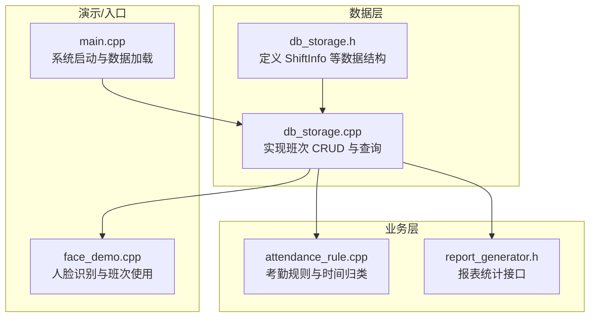
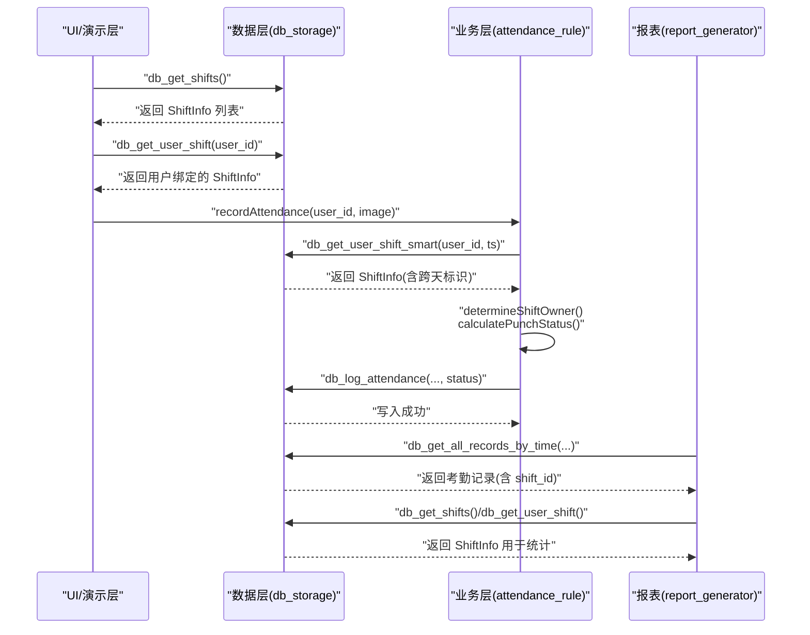
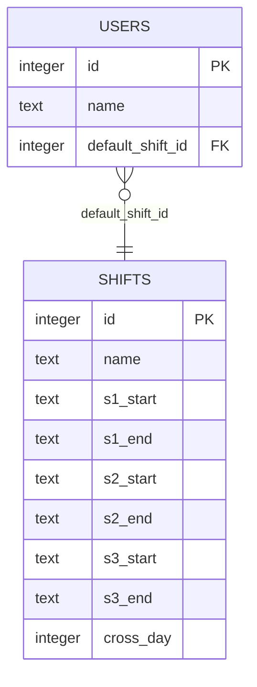
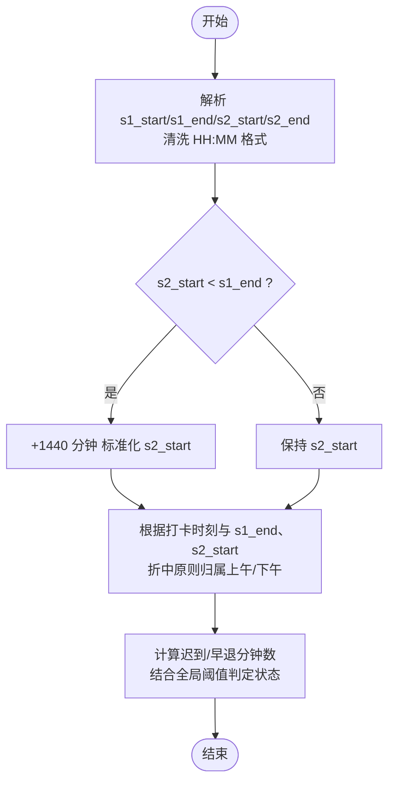
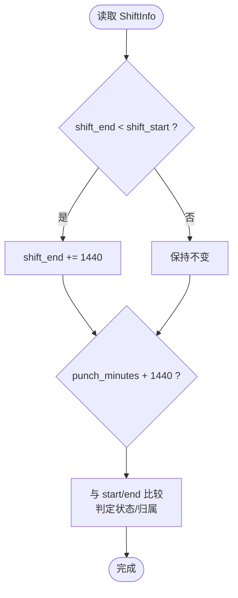
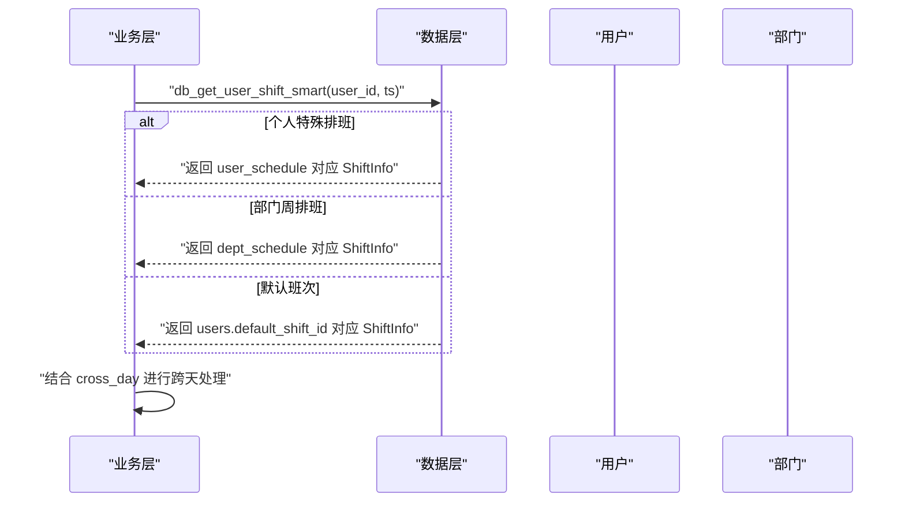
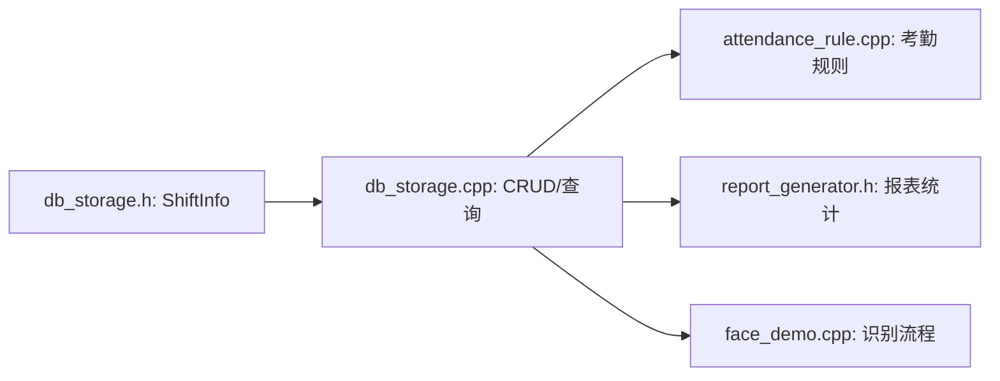

# 班次信息模型

<cite>
**本文引用的文件**
- [db_storage.h](file://src/data/db_storage.h)
- [db_storage.cpp](file://src/data/db_storage.cpp)
- [attendance_rule.cpp](file://src/business/attendance_rule.cpp)
- [report_generator.h](file://src/business/report_generator.h)
- [face_demo.cpp](file://src/business/face_demo.cpp)
- [main.cpp](file://src/main.cpp)
</cite>

## 目录
1. [简介](#简介)
2. [项目结构](#项目结构)
3. [核心组件](#核心组件)
4. [架构概览](#架构概览)
5. [详细组件分析](#详细组件分析)
6. [依赖分析](#依赖分析)
7. [性能考虑](#性能考虑)
8. [故障排查指南](#故障排查指南)
9. [结论](#结论)
10. [附录](#附录)

## 简介
本文件系统性地文档化“班次信息模型”，围绕 ShiftInfo 结构体展开，解释其字段设计（班次ID、名称、三个工作时段、跨天标识）、业务规则（s1_start/s1_end、s2_start/s2_end、s3_start/s3_end 的定义与使用场景）、跨天班次的处理机制与时间计算逻辑，并提供完整的班次管理 API 使用示例（db_add_shift、db_update_shift、db_get_shifts、db_delete_shift 等）。同时阐述班次与用户、部门之间的关联关系，以及在考勤计算中的关键作用，并总结最佳实践与常见问题解决方案。

## 项目结构
本项目采用分层架构，数据层负责数据库访问与持久化（db_storage），业务层负责考勤规则与报表生成（attendance_rule、report_generator），UI/演示层负责交互与展示（face_demo、main）。班次模型位于数据层，贯穿业务层的考勤计算与报表统计。

**图表来源**
- [db_storage.h:33-55](file://src/data/db_storage.h#L33-L55)
- [db_storage.cpp:495-526](file://src/data/db_storage.cpp#L495-L526)
- [attendance_rule.cpp:230-250](file://src/business/attendance_rule.cpp#L230-L250)
- [report_generator.h:186-187](file://src/business/report_generator.h#L186-L187)
- [face_demo.cpp:832-894](file://src/business/face_demo.cpp#L832-L894)
- [main.cpp:80-85](file://src/main.cpp#L80-L85)

**章节来源**
- [db_storage.h:33-55](file://src/data/db_storage.h#L33-L55)
- [db_storage.cpp:150-252](file://src/data/db_storage.cpp#L150-L252)
- [main.cpp:80-85](file://src/main.cpp#L80-L85)

## 核心组件
- ShiftInfo 结构体：承载单个班次的所有必要信息，包括三个工作时段与跨天标识。
- 数据库表 shifts：持久化存储 ShiftInfo 的字段，包含 s1_start/s1_end、s2_start/s2_end、s3_start/s3_end、cross_day。
- 班次管理接口：提供新增、更新、查询、删除班次的能力。
- 跨天处理：在考勤规则与报表统计中统一处理跨天时间边界。

**章节来源**
- [db_storage.h:33-55](file://src/data/db_storage.h#L33-L55)
- [db_storage.cpp:150-153](file://src/data/db_storage.cpp#L150-L153)
- [db_storage.cpp:495-526](file://src/data/db_storage.cpp#L495-L526)

## 架构概览
班次模型在系统中的流转路径如下：数据层提供 ShiftInfo 的持久化与查询；业务层在考勤计算中读取 ShiftInfo 并进行时间归类与状态判定；报表层基于 ShiftInfo 与考勤记录生成统计报表；演示层在识别流程中结合用户默认班次与固定班次进行打卡归属判断。

**图表来源**
- [db_storage.cpp:495-526](file://src/data/db_storage.cpp#L495-L526)
- [db_storage.cpp:1062-1094](file://src/data/db_storage.cpp#L1062-L1094)
- [attendance_rule.cpp:198-277](file://src/business/attendance_rule.cpp#L198-L277)
- [report_generator.h:186-187](file://src/business/report_generator.h#L186-L187)

## 详细组件分析

### ShiftInfo 结构体设计
- 字段说明
  - id：班次ID（数据库自增主键）
  - name：班次名称（如“早班”、“夜班”）
  - s1_start/s1_end：第一工作时段（如 09:00 - 12:00）
  - s2_start/s2_end：第二工作时段（如 13:00 - 18:00）
  - s3_start/s3_end：第三工作时段（可为空，如 19:00 - 21:00）
  - cross_day：是否跨天（0：当天空班；1：次日空班）

- 设计要点
  - 三个时段满足大多数双班制与部分三班制场景。
  - cross_day 作为布尔标志，配合业务层统一处理跨天时间边界。
  - 字段类型为字符串，便于灵活存储与解析，业务层负责格式清洗与标准化。

**章节来源**
- [db_storage.h:33-55](file://src/data/db_storage.h#L33-L55)

### 数据库表结构与字段映射
- shifts 表包含字段：id、name、s1_start、s1_end、s2_start、s2_end、s3_start、s3_end、cross_day。
- cross_day 默认值为 0，表示当天空班。
- 用户表 users 通过 default_shift_id 外键关联 shifts。

**图表来源**
- [db_storage.cpp:150-153](file://src/data/db_storage.cpp#L150-L153)
- [db_storage.cpp:182-195](file://src/data/db_storage.cpp#L182-L195)

**章节来源**
- [db_storage.cpp:150-153](file://src/data/db_storage.cpp#L150-L153)
- [db_storage.cpp:182-195](file://src/data/db_storage.cpp#L182-L195)

### 班次时间规则与业务逻辑
- s1_start/s1_end、s2_start/s2_end、s3_start/s3_end 的定义
  - 采用“HH:MM”字符串格式，业务层通过清洗与解析转换为分钟数进行比较。
  - 时段顺序要求：s1_end ≤ s2_start（若 s2_start 早于 s1_end，则视为跨天）。
  - s3 为可选时段，用于三班制或加班场景。

- 时间归类与状态判定
  - 打卡归属：根据打卡时刻与 s1_end、s2_start 的相对大小，采用“折中原则”确定归属上午或下午。
  - 跨天处理：若 s2_start < s1_end，业务层将 s2_start 视为次日时间（+1440 分钟）进行比较。
  - 上下班状态：基于目标时段的 start/end 与打卡时刻比较，结合全局迟到阈值判定正常/迟到/早退/旷工。

**图表来源**
- [attendance_rule.cpp:24-74](file://src/business/attendance_rule.cpp#L24-L74)
- [attendance_rule.cpp:83-122](file://src/business/attendance_rule.cpp#L83-L122)
- [attendance_rule.cpp:127-191](file://src/business/attendance_rule.cpp#L127-L191)

**章节来源**
- [attendance_rule.cpp:24-74](file://src/business/attendance_rule.cpp#L24-L74)
- [attendance_rule.cpp:83-122](file://src/business/attendance_rule.cpp#L83-L122)
- [attendance_rule.cpp:127-191](file://src/business/attendance_rule.cpp#L127-L191)

### 跨天班次的处理机制与时间计算逻辑
- 标准化策略
  - 若 shift_end < shift_start，业务层将 shift_end + 1440 分钟，确保比较逻辑一致。
  - 若 shift_start 很晚（>18:00）且打卡时间很早（<12:00），将打卡时间 +1440 分钟，避免误判。

- 实际应用
  - 考勤计算：determineShiftOwner 与 calculatePunchStatus 均考虑跨天边界。
  - 报表统计：calculateLateMinutes/calculateEarlyMinutes 依据 ShiftInfo 的 s1_start/s1_end/s2_start/s2_end 与 cross_day 进行分钟数计算。

**图表来源**
- [attendance_rule.cpp:134-149](file://src/business/attendance_rule.cpp#L134-L149)
- [report_generator.h:186-187](file://src/business/report_generator.h#L186-L187)

**章节来源**
- [attendance_rule.cpp:134-149](file://src/business/attendance_rule.cpp#L134-L149)
- [report_generator.h:186-187](file://src/business/report_generator.h#L186-L187)

### 班次管理 API 使用示例
以下为常见操作的调用路径与关键参数说明（以接口声明为准）：

- 新增班次
  - 接口：db_add_shift(name, s1_start, s1_end, s2_start, s2_end, s3_start, s3_end, cross_day)
  - 示例路径：[db_add_shift 声明:278-282](file://src/data/db_storage.h#L278-L282)
  - 实现参考：[db_add_shift 实现:637-668](file://src/data/db_storage.cpp#L637-L668)

- 更新班次
  - 接口：db_update_shift(shift_id, s1_start, s1_end, s2_start, s2_end, s3_start, s3_end, cross_day)
  - 示例路径：[db_update_shift 声明:251-255](file://src/data/db_storage.h#L251-L255)
  - 实现参考：[db_update_shift 实现:464-486](file://src/data/db_storage.cpp#L464-L486)

- 查询班次列表
  - 接口：db_get_shifts()
  - 示例路径：[db_get_shifts 声明](file://src/data/db_storage.h#L261)
  - 实现参考：[db_get_shifts 实现:495-526](file://src/data/db_storage.cpp#L495-L526)

- 查询单个班次
  - 接口：db_get_shift_info(shift_id)
  - 示例路径：[db_get_shift_info 声明](file://src/data/db_storage.h#L268)
  - 实现参考：[db_get_shift_info 实现:529-572](file://src/data/db_storage.cpp#L529-L572)

- 删除班次
  - 接口：db_delete_shift(shift_id)
  - 示例路径：[db_delete_shift 声明](file://src/data/db_storage.h#L288)
  - 实现参考：[db_delete_shift 实现:671-686](file://src/data/db_storage.cpp#L671-L686)

- 获取用户绑定的班次
  - 接口：db_get_user_shift(user_id)
  - 示例路径：[db_get_user_shift 声明](file://src/data/db_storage.h#L376)
  - 实现参考：[db_get_user_shift 实现:1062-1094](file://src/data/db_storage.cpp#L1062-L1094)

**章节来源**
- [db_storage.h:251-288](file://src/data/db_storage.h#L251-L288)
- [db_storage.cpp:464-486](file://src/data/db_storage.cpp#L464-L486)
- [db_storage.cpp:495-526](file://src/data/db_storage.cpp#L495-L526)
- [db_storage.cpp:529-572](file://src/data/db_storage.cpp#L529-L572)
- [db_storage.cpp:671-686](file://src/data/db_storage.cpp#L671-L686)
- [db_storage.cpp:1062-1094](file://src/data/db_storage.cpp#L1062-L1094)

### 班次与用户、部门的关联关系
- 用户与班次
  - users.default_shift_id 外键关联 shifts.id，表示用户的默认班次。
  - 业务层提供 db_get_user_shift(user_id) 获取用户绑定的 ShiftInfo。
  - 演示层在识别流程中可读取用户固定班次并用于打卡归属判断。

- 部门与班次
  - dept_schedule(day_of_week → shift_id) 用于部门周排班。
  - db_get_user_shift_smart(user_id, timestamp) 优先级：个人特殊排班 > 部门周排班 > 默认班次。
  - cross_day 与部门排班共同决定跨日班次的归属。

**图表来源**
- [db_storage.cpp:1062-1094](file://src/data/db_storage.cpp#L1062-L1094)
- [db_storage.cpp:1597-1611](file://src/data/db_storage.cpp#L1597-L1611)
- [db_storage.h:494-503](file://src/data/db_storage.h#L494-L503)

**章节来源**
- [db_storage.cpp:1062-1094](file://src/data/db_storage.cpp#L1062-L1094)
- [db_storage.cpp:1597-1611](file://src/data/db_storage.cpp#L1597-L1611)
- [db_storage.h:494-503](file://src/data/db_storage.h#L494-L503)

### 考勤计算中的作用
- 打卡归属：根据 s1_end 与 s2_start 的相对大小，结合折中原则确定归属上午或下午。
- 状态判定：基于 shift.start/end 与打卡时刻比较，结合全局迟到阈值，输出正常/迟到/早退/旷工。
- 防重复打卡：基于全局规则 duplicate_punch_limit 进行时间窗口内重复检测。
- 数据入库：将最终状态写入 attendance 表，包含 user_id、shift_id、timestamp、status。

**章节来源**
- [attendance_rule.cpp:198-277](file://src/business/attendance_rule.cpp#L198-L277)

### 报表统计中的应用
- 迟到/早退分钟数计算：依据 ShiftInfo 的 s1_start/s1_end/s2_start/s2_end 与 cross_day 进行分钟数换算。
- 月度汇总：按用户维度统计正常天数、迟到次数与分钟数、早退次数与分钟数、旷工天数与未排班天数。

**章节来源**
- [report_generator.h:186-187](file://src/business/report_generator.h#L186-L187)

## 依赖分析
- ShiftInfo 依赖
  - 数据层：db_storage.h 定义结构体；db_storage.cpp 实现 CRUD 与查询。
  - 业务层：attendance_rule.cpp 读取 ShiftInfo 并进行跨天与状态判定；report_generator.h 使用 ShiftInfo 进行分钟数计算。
  - 演示层：face_demo.cpp 读取用户绑定的 ShiftInfo 用于识别与打卡归属。

**图表来源**
- [db_storage.h:33-55](file://src/data/db_storage.h#L33-L55)
- [db_storage.cpp:495-526](file://src/data/db_storage.cpp#L495-L526)
- [attendance_rule.cpp:230-250](file://src/business/attendance_rule.cpp#L230-L250)
- [report_generator.h:186-187](file://src/business/report_generator.h#L186-L187)
- [face_demo.cpp:832-894](file://src/business/face_demo.cpp#L832-L894)

**章节来源**
- [db_storage.h:33-55](file://src/data/db_storage.h#L33-L55)
- [db_storage.cpp:495-526](file://src/data/db_storage.cpp#L495-L526)
- [attendance_rule.cpp:230-250](file://src/business/attendance_rule.cpp#L230-L250)
- [report_generator.h:186-187](file://src/business/report_generator.h#L186-L187)
- [face_demo.cpp:832-894](file://src/business/face_demo.cpp#L832-L894)

## 性能考虑
- 数据访问并发
  - 读操作使用共享锁，写操作使用排他锁，保证多线程安全。
  - 高频查询（如 db_get_shifts、db_get_user_shift）建议缓存结果，减少数据库往返。
- 时间解析与比较
  - 将“HH:MM”解析为分钟数一次完成，避免重复解析。
  - 跨天标准化仅在必要时进行（如 shift_end < shift_start 或 shift_start 很晚），减少额外加减。
- 索引与查询
  - attendance 表已建立联合索引 idx_att_user_time(user_id, timestamp DESC)，提升按用户与时间范围查询效率。

**章节来源**
- [db_storage.cpp:495-526](file://src/data/db_storage.cpp#L495-L526)
- [db_storage.cpp:1062-1094](file://src/data/db_storage.cpp#L1062-L1094)
- [db_storage.cpp:255-256](file://src/data/db_storage.cpp#L255-L256)

## 故障排查指南
- 症状：跨天班次打卡归属异常
  - 检查 s2_start 与 s1_end 的大小关系，确认业务层是否进行了 +1440 分钟标准化。
  - 参考：[跨天标准化逻辑:134-149](file://src/business/attendance_rule.cpp#L134-L149)
- 症状：迟到/早退分钟数统计不准确
  - 确认 ShiftInfo 的 s1_start/s1_end/s2_start/s2_end 与 cross_day 是否正确。
  - 参考：[报表分钟数计算接口:186-187](file://src/business/report_generator.h#L186-L187)
- 症状：用户默认班次未生效
  - 检查 users.default_shift_id 是否正确，以及 db_get_user_shift 的返回值。
  - 参考：[用户绑定班次查询:1062-1094](file://src/data/db_storage.cpp#L1062-L1094)
- 症状：新增/更新班次后未生效
  - 确认 db_add_shift/db_update_shift 的参数顺序与 cross_day 标志位。
  - 参考：[新增/更新实现:464-486](file://src/data/db_storage.cpp#L464-L486)

**章节来源**
- [attendance_rule.cpp:134-149](file://src/business/attendance_rule.cpp#L134-L149)
- [report_generator.h:186-187](file://src/business/report_generator.h#L186-L187)
- [db_storage.cpp:1062-1094](file://src/data/db_storage.cpp#L1062-L1094)
- [db_storage.cpp:464-486](file://src/data/db_storage.cpp#L464-L486)

## 结论
ShiftInfo 作为班次信息的核心载体，通过三个工作时段与跨天标识，支撑了双班制与部分三班制场景。业务层在考勤计算与报表统计中统一处理跨天边界，确保时间判定的准确性与一致性。通过规范的 API 使用与合理的数据结构设计，系统实现了从班次配置到考勤统计的闭环。

## 附录
- 班次配置最佳实践
  - 明确 s1_end 与 s2_start 的边界，避免重叠或过短间隔。
  - 跨天班次务必设置 cross_day=1，并确保 s2_start < s1_end。
  - 为用户设置合理的 default_shift_id，必要时使用个人/部门排班覆盖。
- 常见问题
  - “HH:MM”格式不规范导致解析失败：业务层已内置清洗逻辑，建议严格遵循“HH:MM”。
  - 重复打卡误判：合理设置全局规则 duplicate_punch_limit，避免短时间内重复记录。