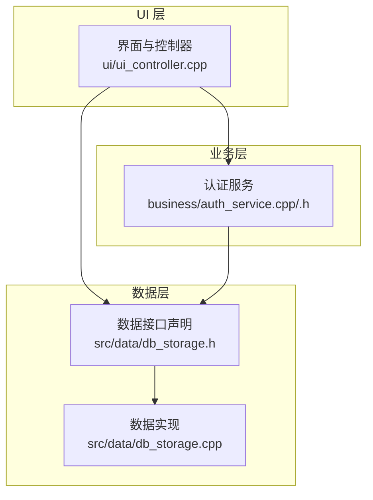
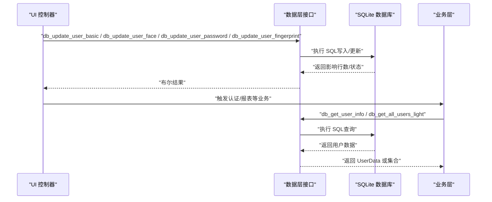
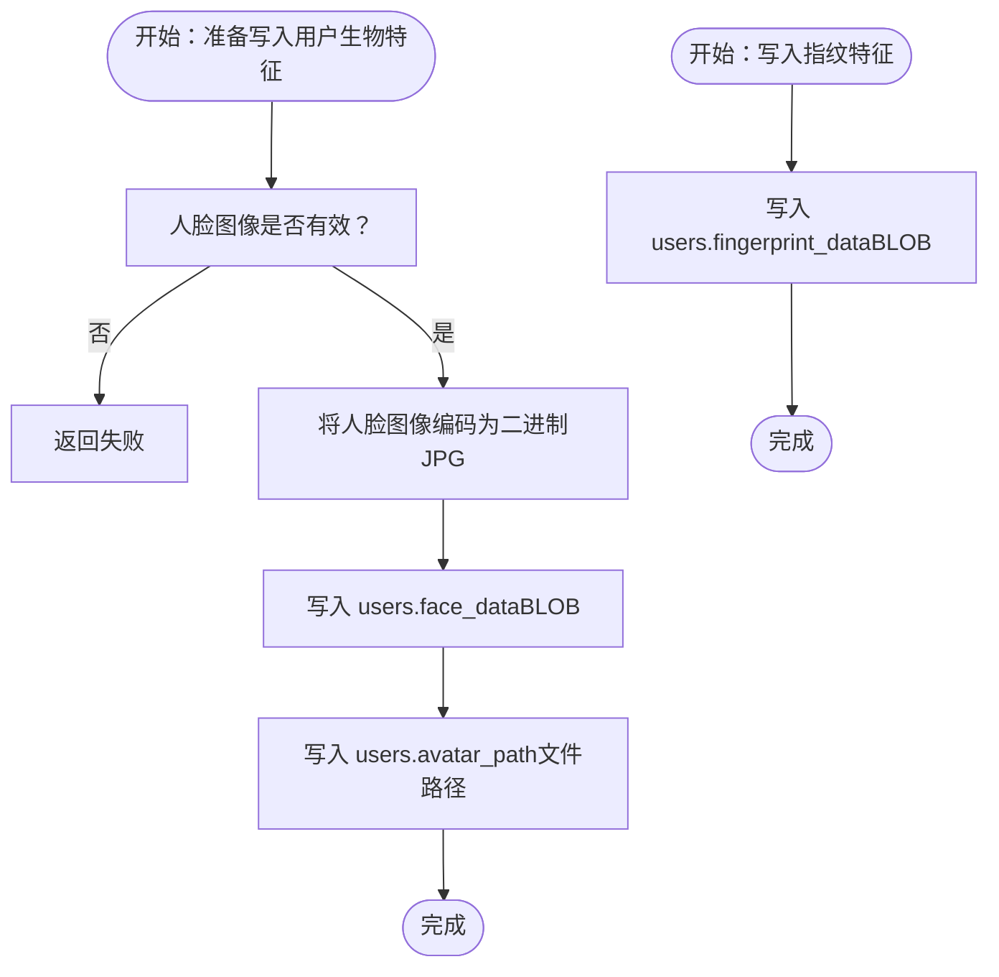
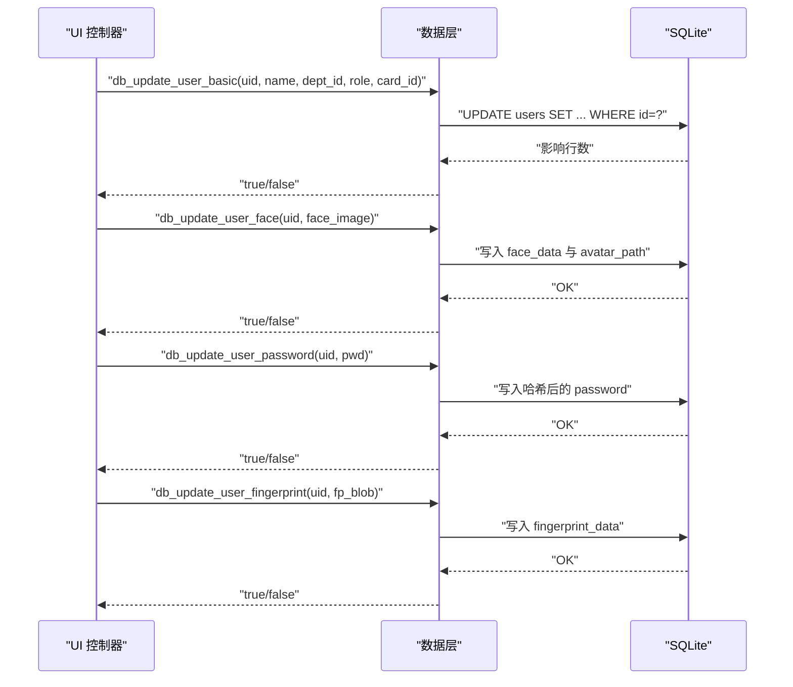
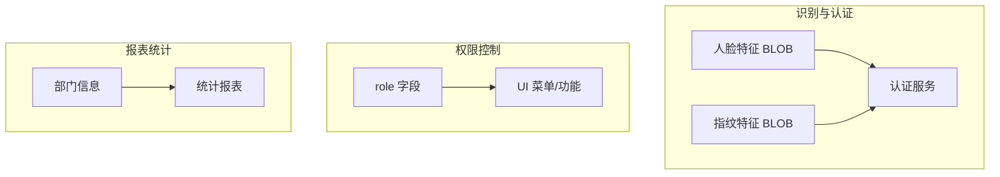
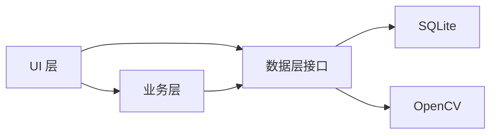

# 用户信息模型

<cite>
**本文引用的文件**
- [src/data/db_storage.h](file://src/data/db_storage.h)
- [src/data/db_storage.cpp](file://src/data/db_storage.cpp)
- [src/business/auth_service.h](file://src/business/auth_service.h)
- [src/business/auth_service.cpp](file://src/business/auth_service.cpp)
- [src/ui/ui_controller.cpp](file://src/ui/ui_controller.cpp)
- [src/main.cpp](file://src/main.cpp)
</cite>

## 目录
1. [简介](#简介)
2. [项目结构](#项目结构)
3. [核心组件](#核心组件)
4. [架构总览](#架构总览)
5. [详细组件分析](#详细组件分析)
6. [依赖关系分析](#依赖关系分析)
7. [性能考量](#性能考量)
8. [故障排查指南](#故障排查指南)
9. [结论](#结论)
10. [附录](#附录)

## 简介
本文件系统性地文档化用户信息模型，围绕 UserData 结构体展开，覆盖字段定义、数据类型、约束条件与业务含义；阐述用户权限体系（普通员工与管理员）；解释生物特征数据（人脸特征与指纹特征）的存储格式与处理流程；给出用户管理相关 API 的使用说明与典型流程；并说明用户数据在人脸识别、权限控制与报表统计中的应用。

## 项目结构
本项目采用分层架构，用户信息模型位于数据层（data layer），并通过业务层与 UI 层交互：
- 数据层：负责数据库初始化、表结构维护、用户数据的增删改查与生物特征的 BLOB 存取。
- 业务层：封装认证服务（AuthService）、考勤规则等业务逻辑。
- UI 层：提供用户管理界面与报表导出等功能。

图表来源
- [src/ui/ui_controller.cpp](file://src/ui/ui_controller.cpp)
- [src/business/auth_service.h](file://src/business/auth_service.h)
- [src/business/auth_service.cpp](file://src/business/auth_service.cpp)
- [src/data/db_storage.h](file://src/data/db_storage.h)
- [src/data/db_storage.cpp](file://src/data/db_storage.cpp)

章节来源
- [src/data/db_storage.cpp:108-256](file://src/data/db_storage.cpp#L108-L256)
- [src/data/db_storage.h:100-142](file://src/data/db_storage.h#L100-L142)

## 核心组件
本节聚焦用户信息模型的核心结构体与关键接口，帮助读者快速理解用户数据的组织方式与访问方式。

- 用户信息结构体：UserData
  - 字段与含义详见下一节“字段定义与约束”。
- 用户管理相关接口（数据层）
  - 新增用户：db_add_user
  - 更新用户基本信息：db_update_user_basic
  - 更新用户人脸特征与头像路径：db_update_user_face
  - 更新用户密码：db_update_user_password
  - 更新用户指纹特征：db_update_user_fingerprint
  - 查询用户信息：db_get_user_info
  - 获取全部用户（轻量版）：db_get_all_users_light
  - 批量导入/同步员工数据：db_batch_add_users

章节来源
- [src/data/db_storage.h:100-142](file://src/data/db_storage.h#L100-L142)
- [src/data/db_storage.h:378-412](file://src/data/db_storage.h#L378-L412)
- [src/data/db_storage.cpp:769-803](file://src/data/db_storage.cpp#L769-L803)
- [src/data/db_storage.cpp:1096-1125](file://src/data/db_storage.cpp#L1096-L1125)
- [src/data/db_storage.cpp:1127-1192](file://src/data/db_storage.cpp#L1127-L1192)
- [src/data/db_storage.cpp:1194-1216](file://src/data/db_storage.cpp#L1194-L1216)
- [src/data/db_storage.cpp:1245-1262](file://src/data/db_storage.cpp#L1245-L1262)
- [src/data/db_storage.cpp:1264-1272](file://src/data/db_storage.cpp#L1264-L1272)
- [src/data/db_storage.cpp:805-832](file://src/data/db_storage.cpp#L805-L832)

## 架构总览
用户数据在系统内的流转路径如下：
- UI 层发起用户管理请求（如修改权限、录入人脸/指纹、修改密码等）。
- UI 层调用数据层提供的接口完成持久化。
- 业务层在需要时（如认证）从数据层读取用户信息。
- 报表与统计模块基于用户数据生成结果。

图表来源
- [src/ui/ui_controller.cpp:139-175](file://src/ui/ui_controller.cpp#L139-L175)
- [src/data/db_storage.h:378-412](file://src/data/db_storage.h#L378-L412)
- [src/data/db_storage.cpp:1096-1216](file://src/data/db_storage.cpp#L1096-L1216)
- [src/business/auth_service.h:23-44](file://src/business/auth_service.h#L23-L44)

## 详细组件分析

### UserData 结构体：字段定义与约束
UserData 是数据库 users 表在应用侧的映射，包含用户身份、权限、生物特征与关联信息。字段定义如下：

- id
  - 类型：整型
  - 约束：主键（自增），非负
  - 业务含义：用户唯一标识（工号）
- name
  - 类型：字符串
  - 约束：非空
  - 业务含义：用户姓名（支持中英文）
- password
  - 类型：字符串
  - 约束：非空（登录验证使用）
  - 业务含义：登录密码（内部统一进行哈希处理）
- card_id
  - 类型：字符串
  - 约束：可空
  - 业务含义：IC/ID 卡号（用于刷卡验证）
- role
  - 类型：整型
  - 约束：0/1（普通员工/管理员）
  - 业务含义：权限等级（决定 UI 菜单与功能可见性）
- dept_id
  - 类型：整型
  - 约束：可空（外键关联 departments.id，删除部门时置空）
  - 业务含义：所属部门 ID
- default_shift_id
  - 类型：整型
  - 约束：可空（外键关联 shifts.id，删除班次时置空）
  - 业务含义：默认班次 ID（用于考勤排班推断）
- dept_name
  - 类型：字符串
  - 约束：非持久化字段（通过联表查询获得）
  - 业务含义：用于 UI 显示与报表
- face_feature
  - 类型：字节数组
  - 约束：BLOB（数据库 users.face_data 字段）
  - 业务含义：人脸特征数据（二进制，用于识别）
- avatar_path
  - 类型：字符串
  - 约束：可空（users.avatar_path 字段）
  - 业务含义：注册时人脸图片的本地文件路径
- fingerprint_feature
  - 类型：字节数组
  - 约束：BLOB（数据库 users.fingerprint_data 字段）
  - 业务含义：指纹特征数据（二进制，用于比对）
- position
  - 类型：字符串
  - 约束：可空
  - 业务含义：职位信息（用于报表展示）

章节来源
- [src/data/db_storage.h:100-142](file://src/data/db_storage.h#L100-L142)
- [src/data/db_storage.cpp:181-196](file://src/data/db_storage.cpp#L181-L196)

### 用户权限体系：普通员工与管理员
- 权限等级 role
  - 0：普通员工（仅可进行考勤打卡）
  - 1：管理员（可进入系统菜单，具备用户管理、报表导出等高级功能）
- UI 与业务层如何体现
  - UI 层根据用户角色决定菜单项与页面可用性。
  - 业务层在认证与授权场景依据 role 决策功能访问。

章节来源
- [src/data/db_storage.h:117-119](file://src/data/db_storage.h#L117-L119)
- [src/ui/ui_controller.cpp:1134-1169](file://src/ui/ui_controller.cpp#L1134-L1169)

### 生物特征数据：存储格式与处理流程
- 存储格式
  - 人脸特征：BLOB（users.face_data），以二进制形式存储；读取时解码为灰度图（便于识别算法使用）。
  - 指纹特征：BLOB（users.fingerprint_data），以二进制形式存储。
  - 头像路径：users.avatar_path，存储注册时人脸图片的本地文件路径。
- 处理流程
  - 人脸特征写入：将 OpenCV Mat 编码为 JPG 二进制后写入数据库；同时更新 avatar_path 指向本地文件。
  - 指纹特征写入：将采集到的指纹特征二进制数据写入数据库。
  - 读取流程：查询用户信息时，同时读取上述 BLOB 字段；必要时将人脸特征还原为图像用于调试或二次处理。
- 文件系统
  - 打卡抓拍图片与注册头像分别存放于独立目录，避免混杂。

图表来源
- [src/data/db_storage.cpp:67-89](file://src/data/db_storage.cpp#L67-L89)
- [src/data/db_storage.cpp:1127-1192](file://src/data/db_storage.cpp#L1127-L1192)
- [src/data/db_storage.cpp:1245-1262](file://src/data/db_storage.cpp#L1245-L1262)

章节来源
- [src/data/db_storage.cpp:67-89](file://src/data/db_storage.cpp#L67-L89)
- [src/data/db_storage.cpp:1127-1192](file://src/data/db_storage.cpp#L1127-L1192)
- [src/data/db_storage.cpp:1245-1262](file://src/data/db_storage.cpp#L1245-L1262)

### 用户管理 API 使用示例与流程
以下为常用用户管理接口的调用流程与要点说明（以路径代替具体代码片段）：

- 新增用户（db_add_user）
  - 输入：UserData（含 name/password/card_id/role/dept_id 等），以及人脸图像（用于生成头像路径与特征）。
  - 输出：返回新用户 ID；若失败返回负值。
  - 关键点：内部对密码进行哈希处理；人脸图像编码为二进制并写入 BLOB；头像路径写入 avatar_path。
  - 参考路径：
    - [src/data/db_storage.cpp:769-803](file://src/data/db_storage.cpp#L769-L803)
    - [src/main.cpp:105-135](file://src/main.cpp#L105-L135)

- 更新用户基本信息（db_update_user_basic）
  - 输入：用户 ID、新姓名、新部门 ID、新权限等级、新卡号。
  - 输出：布尔结果。
  - 关键点：部门 ID 与卡号可为空；权限等级为 0/1。
  - 参考路径：
    - [src/data/db_storage.cpp:1096-1125](file://src/data/db_storage.cpp#L1096-L1125)

- 更新用户人脸特征与头像路径（db_update_user_face）
  - 输入：用户 ID、人脸图像（OpenCV Mat）。
  - 输出：布尔结果。
  - 关键点：人脸图像不能为空；写入 BLOB 并更新头像路径；注意旧图像清理策略（由实现决定）。
  - 参考路径：
    - [src/data/db_storage.cpp:1127-1192](file://src/data/db_storage.cpp#L1127-L1192)

- 更新用户密码（db_update_user_password）
  - 输入：用户 ID、新密码（明文）。
  - 输出：布尔结果。
  - 关键点：内部自动进行哈希处理后再写入数据库。
  - 参考路径：
    - [src/data/db_storage.cpp:1194-1216](file://src/data/db_storage.cpp#L1194-L1216)

- 更新用户指纹特征（db_update_user_fingerprint）
  - 输入：用户 ID、指纹特征二进制数据。
  - 输出：布尔结果。
  - 关键点：指纹特征必须为非空二进制数据；更新后可用于认证比对。
  - 参考路径：
    - [src/data/db_storage.cpp:1245-1262](file://src/data/db_storage.cpp#L1245-L1262)

- 查询用户信息（db_get_user_info）
  - 输入：用户 ID。
  - 输出：可选的 UserData（存在则返回，否则为空）。
  - 参考路径：
    - [src/ui/ui_controller.cpp:151-166](file://src/ui/ui_controller.cpp#L151-L166)

- 获取全部用户（轻量版，仅 ID/Name）
  - 输入：无。
  - 输出：用户列表（不包含人脸特征 BLOB，避免大对象传输）。
  - 参考路径：
    - [src/data/db_storage.cpp:1264-1272](file://src/data/db_storage.cpp#L1264-L1272)

- 批量导入/同步员工数据（db_batch_add_users）
  - 输入：用户列表（包含 id/name/password/card_id/privilege/face_data/avatar_path/fingerprint_data/dept_id/default_shift_id 等）。
  - 输出：布尔结果。
  - 关键点：使用事务与 UPSERT（存在则覆盖）保证一致性与性能。
  - 参考路径：
    - [src/data/db_storage.cpp:805-832](file://src/data/db_storage.cpp#L805-L832)

图表来源
- [src/data/db_storage.h:378-412](file://src/data/db_storage.h#L378-L412)
- [src/data/db_storage.cpp:1096-1216](file://src/data/db_storage.cpp#L1096-L1216)
- [src/data/db_storage.cpp:1245-1262](file://src/data/db_storage.cpp#L1245-L1262)

章节来源
- [src/data/db_storage.h:378-412](file://src/data/db_storage.h#L378-L412)
- [src/data/db_storage.cpp:769-803](file://src/data/db_storage.cpp#L769-L803)
- [src/data/db_storage.cpp:1096-1216](file://src/data/db_storage.cpp#L1096-L1216)
- [src/data/db_storage.cpp:1245-1262](file://src/data/db_storage.cpp#L1245-L1262)
- [src/ui/ui_controller.cpp:151-166](file://src/ui/ui_controller.cpp#L151-L166)

### 用户数据在人脸识别、权限控制与报表统计中的应用
- 人脸识别
  - 人脸特征以二进制 BLOB 存储，读取后可还原为灰度图用于识别算法。
  - 认证流程：业务层调用认证服务，从数据库读取用户信息，比对特征后返回结果。
  - 参考路径：
    - [src/data/db_storage.cpp:67-89](file://src/data/db_storage.cpp#L67-L89)
    - [src/business/auth_service.cpp:39-69](file://src/business/auth_service.cpp#L39-L69)

- 权限控制
  - role 字段决定用户功能权限；UI 层与业务层据此控制菜单与操作。
  - 参考路径：
    - [src/data/db_storage.h:117-119](file://src/data/db_storage.h#L117-L119)
    - [src/ui/ui_controller.cpp:1134-1169](file://src/ui/ui_controller.cpp#L1134-L1169)

- 报表统计
  - 用户数据用于按部门导出报表、统计注册人数、权限分布等。
  - 参考路径：
    - [src/data/db_storage.cpp:2141-2171](file://src/data/db_storage.cpp#L2141-L2171)

图表来源
- [src/data/db_storage.cpp:181-196](file://src/data/db_storage.cpp#L181-L196)
- [src/business/auth_service.cpp:39-69](file://src/business/auth_service.cpp#L39-L69)
- [src/data/db_storage.h:117-119](file://src/data/db_storage.h#L117-L119)
- [src/data/db_storage.cpp:2141-2171](file://src/data/db_storage.cpp#L2141-L2171)

## 依赖关系分析
- 数据层依赖
  - SQLite：提供持久化能力与事务支持。
  - OpenCV：提供图像编解码与矩阵处理能力，用于人脸特征的二进制转换。
- 业务层依赖
  - 数据层接口：读取/写入用户信息。
  - 认证服务：封装密码与指纹验证逻辑。
- UI 层依赖
  - 数据层接口：获取用户列表、查询用户信息。
  - 业务层：触发认证与报表导出等。

图表来源
- [src/data/db_storage.cpp:1-30](file://src/data/db_storage.cpp#L1-L30)
- [src/business/auth_service.h:23-44](file://src/business/auth_service.h#L23-L44)
- [src/ui/ui_controller.cpp:139-175](file://src/ui/ui_controller.cpp#L139-L175)

章节来源
- [src/data/db_storage.cpp:1-30](file://src/data/db_storage.cpp#L1-L30)
- [src/business/auth_service.h:23-44](file://src/business/auth_service.h#L23-L44)

## 性能考量
- 线程安全与并发
  - 使用共享互斥锁（读写锁）保护数据库访问，读多写少场景下显著提升并发性能。
  - 参考路径：
    - [src/data/db_storage.cpp:35-38](file://src/data/db_storage.cpp#L35-L38)
- 性能优化
  - WAL 模式、适度的缓存与内存临时存储，提升读写吞吐。
  - 批量导入使用事务与 UPSERT，降低多次提交开销。
  - 轻量查询（仅 id/name）避免传输大对象（人脸特征 BLOB）。
  - 参考路径：
    - [src/data/db_storage.cpp:124-135](file://src/data/db_storage.cpp#L124-L135)
    - [src/data/db_storage.cpp:805-832](file://src/data/db_storage.cpp#L805-L832)
    - [src/data/db_storage.cpp:1264-1272](file://src/data/db_storage.cpp#L1264-L1272)

## 故障排查指南
- 新增用户失败
  - 检查输入参数（name/password/card_id/role/dept_id）是否符合约束。
  - 确认数据库连接与表结构创建是否成功。
  - 参考路径：
    - [src/data/db_storage.cpp:769-803](file://src/data/db_storage.cpp#L769-L803)
    - [src/data/db_storage.cpp:108-135](file://src/data/db_storage.cpp#L108-L135)
- 更新密码无效
  - 确认新密码已正确哈希；检查 user_id 是否存在。
  - 参考路径：
    - [src/data/db_storage.cpp:1194-1216](file://src/data/db_storage.cpp#L1194-L1216)
- 指纹更新无效果
  - 确认指纹特征非空且格式正确；检查受影响行数是否为 0（可能 user_id 不存在）。
  - 参考路径：
    - [src/data/db_storage.cpp:1245-1262](file://src/data/db_storage.cpp#L1245-L1262)
- 人脸特征无法识别
  - 检查人脸图像是否为空；确认写入 BLOB 与头像路径是否正确。
  - 参考路径：
    - [src/data/db_storage.cpp:1127-1192](file://src/data/db_storage.cpp#L1127-L1192)
    - [src/data/db_storage.cpp:67-89](file://src/data/db_storage.cpp#L67-L89)

章节来源
- [src/data/db_storage.cpp:769-803](file://src/data/db_storage.cpp#L769-L803)
- [src/data/db_storage.cpp:108-135](file://src/data/db_storage.cpp#L108-L135)
- [src/data/db_storage.cpp:1194-1216](file://src/data/db_storage.cpp#L1194-L1216)
- [src/data/db_storage.cpp:1245-1262](file://src/data/db_storage.cpp#L1245-L1262)
- [src/data/db_storage.cpp:1127-1192](file://src/data/db_storage.cpp#L1127-L1192)
- [src/data/db_storage.cpp:67-89](file://src/data/db_storage.cpp#L67-L89)

## 结论
本文档系统化梳理了用户信息模型的结构、权限体系、生物特征存储与处理流程，并给出了用户管理相关 API 的使用说明与流程图示。通过明确字段约束与业务含义，结合线程安全与性能优化策略，有助于在人脸识别、权限控制与报表统计等场景中稳定高效地使用用户数据。

## 附录
- 数据库 users 表结构概览（字段与约束）
  - id：主键（自增）
  - name/password/card_id：文本字段
  - privilege：整型（0/1）
  - face_data：BLOB（人脸特征）
  - avatar_path：文本（头像路径）
  - fingerprint_data：BLOB（指纹特征）
  - dept_id/default_shift_id：整型（外键，删除时置空）
  - 参考路径：
    - [src/data/db_storage.cpp:181-196](file://src/data/db_storage.cpp#L181-L196)