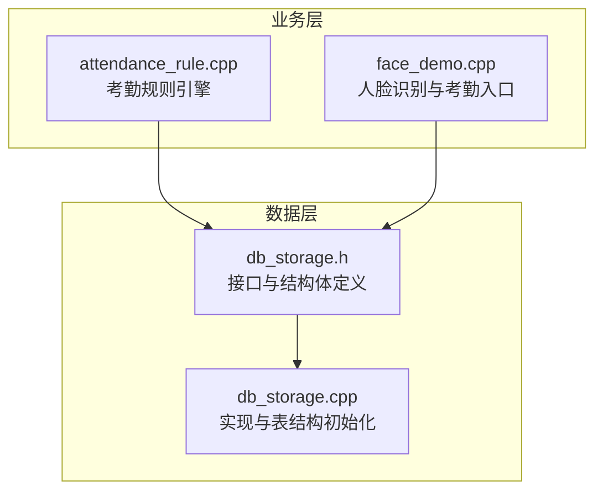
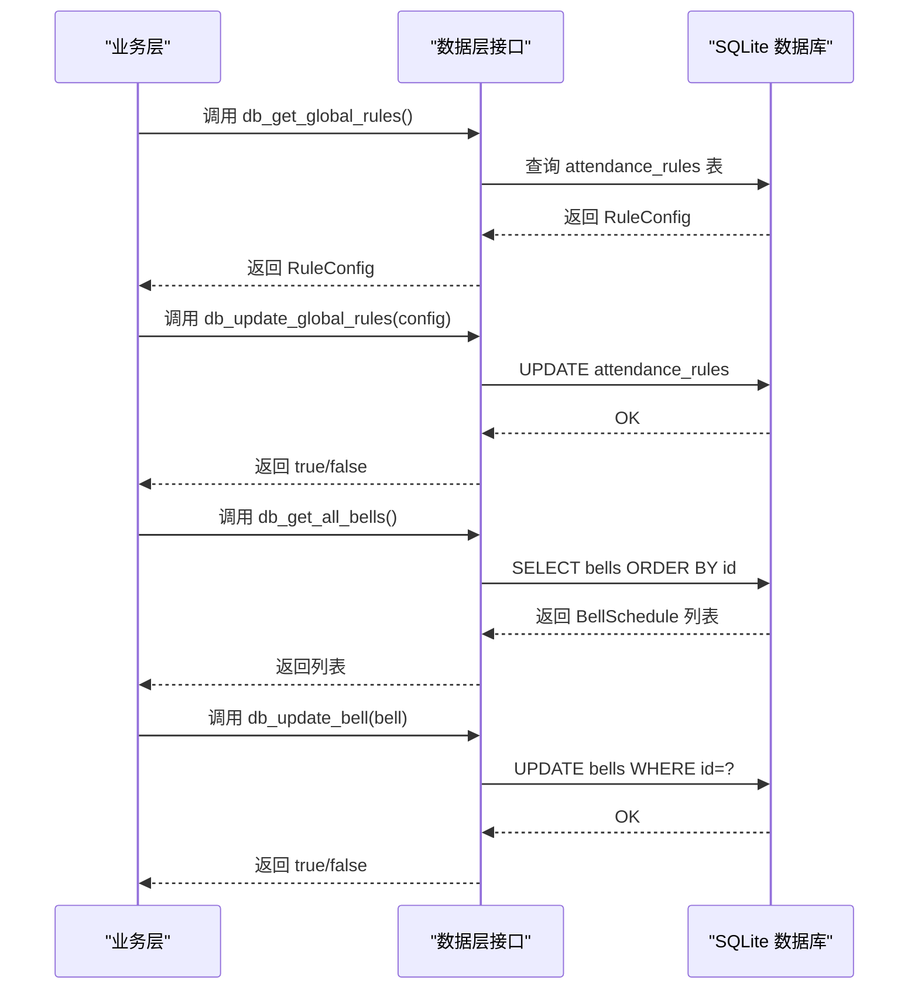
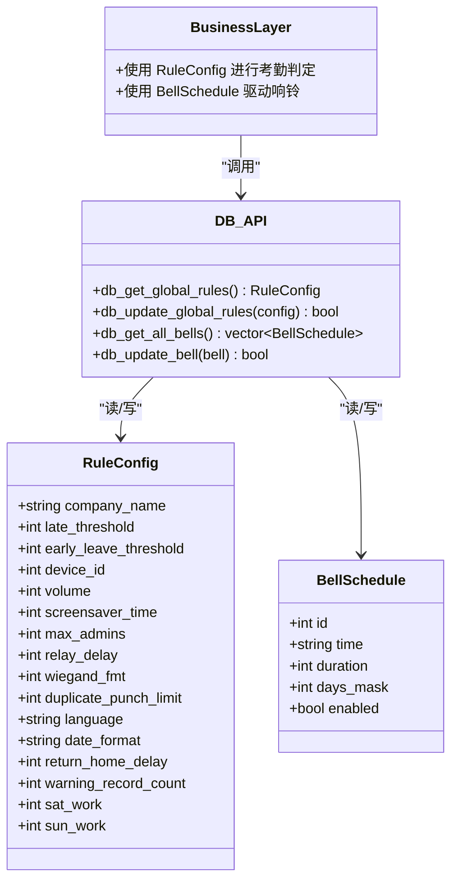

# 系统配置模型

<cite>
**本文档引用的文件**
- [db_storage.h](file://src/data/db_storage.h)
- [db_storage.cpp](file://src/data/db_storage.cpp)
- [attendance_rule.cpp](file://src/business/attendance_rule.cpp)
- [face_demo.cpp](file://src/business/face_demo.cpp)
</cite>

## 目录
1. [简介](#简介)
2. [项目结构](#项目结构)
3. [核心组件](#核心组件)
4. [架构概览](#架构概览)
5. [详细组件分析](#详细组件分析)
6. [依赖关系分析](#依赖关系分析)
7. [性能考量](#性能考量)
8. [故障排查指南](#故障排查指南)
9. [结论](#结论)

## 简介
本文件系统性地文档化系统配置模型，重点围绕 RuleConfig（全局考勤规则）与 BellSchedule（定时响铃配置）两大结构体，阐述其设计目的、字段含义、业务逻辑、持久化映射、API 使用方式以及在系统运行中的动态更新机制。同时给出配置参数在考勤计算、防重复打卡、周末工作规则、门禁控制、界面行为等方面的落地应用示例与最佳实践。

## 项目结构
本项目采用分层架构，配置模型位于数据层（DAO），通过统一的接口暴露给业务层使用。核心文件如下：
- 数据层接口与结构体定义：src/data/db_storage.h
- 数据层实现与表结构初始化：src/data/db_storage.cpp
- 业务层对配置的使用示例：src/business/attendance_rule.cpp、src/business/face_demo.cpp

图表来源
- [db_storage.h:188-313](file://src/data/db_storage.h#L188-L313)
- [db_storage.cpp:108-285](file://src/data/db_storage.cpp#L108-L285)

章节来源
- [db_storage.h:188-313](file://src/data/db_storage.h#L188-L313)
- [db_storage.cpp:108-285](file://src/data/db_storage.cpp#L108-L285)

## 核心组件
本节聚焦 RuleConfig 与 BellSchedule 两大配置模型，说明其字段、默认值、业务含义与持久化映射。

- RuleConfig（全局考勤规则）
  - 字段与默认值：见下表
  - 业务逻辑：用于考勤计算、防重复打卡、周末工作规则、门禁参数、界面行为等
  - 持久化映射：attendance_rules 表
  - API：db_get_global_rules、db_update_global_rules

- BellSchedule（定时响铃配置）
  - 字段与默认值：见下表
  - 业务逻辑：基于时间、持续时间、周期掩码与启用状态，驱动系统定时响铃
  - 持久化映射：bells 表
  - API：db_get_all_bells、db_update_bell

章节来源
- [db_storage.h:61-98](file://src/data/db_storage.h#L61-L98)
- [db_storage.cpp:156-176](file://src/data/db_storage.cpp#L156-L176)
- [db_storage.cpp:230-237](file://src/data/db_storage.cpp#L230-L237)

## 架构概览
RuleConfig 与 BellSchedule 作为数据层配置模型，通过 DAO 接口向业务层开放。业务层在运行时根据配置执行相应逻辑，如考勤状态判定、防重复打卡、周末工作规则、门禁参数应用、界面行为控制等。

图表来源
- [db_storage.h:291-313](file://src/data/db_storage.h#L291-L313)
- [db_storage.cpp:574-632](file://src/data/db_storage.cpp#L574-L632)
- [db_storage.cpp:1887-1930](file://src/data/db_storage.cpp#L1887-L1930)

## 详细组件分析

### RuleConfig（全局考勤规则）
RuleConfig 定义了系统运行所需的全局配置，涵盖迟到/早退阈值、设备ID、音量、屏保时间、管理员数量限制、门禁参数、防重复打卡限制、语言设置、日期格式、返回主界面超时时间、记录警告数阈值、周末工作规则等。

- 字段与默认值
  - company_name：公司名称，默认 "Smart Co."
  - late_threshold：允许迟到分钟数，默认 15
  - early_leave_threshold：允许早退分钟数，默认 0
  - device_id：设备号（1-255），默认 1
  - volume：音量（0-100），默认 70
  - screensaver_time：屏保等待时间（分），默认 0（关闭）
  - max_admins：管理员人数限制，默认 10
  - relay_delay：继电器延时（秒），默认 5
  - wiegand_fmt：韦根格式（26/34），默认 26
  - duplicate_punch_limit：防重复打卡时间（分钟），默认 3
  - language：语言设置（如 "zh-CN", "en-US"），默认 "zh-CN"
  - date_format：日期格式（如 "YYYY-MM-DD"），默认 "YYYY-MM-DD"
  - return_home_delay：返回主界面超时时间（秒），默认 30
  - warning_record_count：记录警告数阈值，默认 99
  - sat_work：星期六是否上班（0=不上班，1=上班），默认 0
  - sun_work：星期日是否上班（0=不上班，1=上班），默认 0

- 业务逻辑与运行时影响
  - 迟到/早退阈值：用于考勤状态判定，参见考勤规则引擎
  - 防重复打卡：在规定时间内禁止重复打卡
  - 周末工作规则：决定周六/周日是否按排班计算
  - 门禁参数：控制继电器延时与韦根格式
  - 界面行为：音量、屏保、语言、日期格式、返回主界面超时、警告阈值等

- 持久化映射与默认播种
  - 表结构：attendance_rules
  - 默认播种：首次初始化时插入默认规则（迟到阈值、周末工作规则等）

- API 使用示例
  - 获取规则：db_get_global_rules()
  - 更新规则：db_update_global_rules(config)

章节来源
- [db_storage.h:61-86](file://src/data/db_storage.h#L61-L86)
- [db_storage.cpp:156-176](file://src/data/db_storage.cpp#L156-L176)
- [db_storage.cpp:346-351](file://src/data/db_storage.cpp#L346-L351)
- [db_storage.cpp:574-632](file://src/data/db_storage.cpp#L574-L632)
- [db_storage.cpp:697-744](file://src/data/db_storage.cpp#L697-L744)

### BellSchedule（定时响铃配置）
BellSchedule 描述系统的定时响铃配置，支持最多 16 个响铃槽位，每个槽位包含响铃时间、持续时长、周期掩码与启用状态。

- 字段与默认值
  - id：响铃槽位编号（1-16），默认播种时初始化
  - time：响铃时间（"HH:MM"），默认 "00:00"
  - duration：响铃时长（秒），默认 5
  - days_mask：周期掩码（位操作）：bit0=周日, bit1=周一, ..., bit6=周六
  - enabled：是否启用（0/1），默认 0（禁用）

- 业务逻辑与运行时影响
  - days_mask：通过位掩码表达每周重复周期，便于按日调度响铃
  - enabled：控制响铃是否生效
  - time/duration：决定响铃触发时刻与持续时长

- 持久化映射与默认播种
  - 表结构：bells
  - 默认播种：首次初始化时插入 16 条记录，初始状态为禁用

- API 使用示例
  - 获取全部响铃：db_get_all_bells()
  - 更新单个响铃：db_update_bell(bell)

章节来源
- [db_storage.h:91-98](file://src/data/db_storage.h#L91-L98)
- [db_storage.cpp:230-237](file://src/data/db_storage.cpp#L230-L237)
- [db_storage.cpp:375-385](file://src/data/db_storage.cpp#L375-L385)
- [db_storage.cpp:1887-1909](file://src/data/db_storage.cpp#L1887-L1909)
- [db_storage.cpp:1912-1930](file://src/data/db_storage.cpp#L1912-L1930)

### 配置在系统运行中的作用与动态更新机制

- 防重复打卡限制
  - 业务层在执行考勤记录前，读取 RuleConfig.duplicate_punch_limit 并在限定时间内拒绝重复打卡
  - 示例路径：[attendance_rule.cpp:217-225](file://src/business/attendance_rule.cpp#L217-L225)

- 周末工作规则
  - RuleConfig.sat_work/sun_work 决定周六/周日是否按排班计算，影响考勤归属与状态判定
  - 示例路径：[db_storage.cpp:574-632](file://src/data/db_storage.cpp#L574-L632)

- 门禁参数
  - RuleConfig.relay_delay 与 RuleConfig.wiegand_fmt 用于控制门禁动作与通信格式
  - 示例路径：[db_storage.cpp:574-632](file://src/data/db_storage.cpp#L574-L632)

- 界面行为控制
  - RuleConfig.volume、screensaver_time、language、date_format、return_home_delay、warning_record_count 等影响 UI 行为与提示
  - 示例路径：[face_demo.cpp:831-839](file://src/business/face_demo.cpp#L831-L839)

- 动态更新机制
  - 业务层通过 db_update_global_rules() 与 db_update_bell() 将配置变更持久化
  - 数据层使用读写锁保证并发安全
  - 示例路径：
    - [db_storage.cpp:697-744](file://src/data/db_storage.cpp#L697-L744)
    - [db_storage.cpp:1912-1930](file://src/data/db_storage.cpp#L1912-L1930)

章节来源
- [attendance_rule.cpp:217-225](file://src/business/attendance_rule.cpp#L217-L225)
- [face_demo.cpp:831-839](file://src/business/face_demo.cpp#L831-L839)
- [db_storage.cpp:697-744](file://src/data/db_storage.cpp#L697-L744)
- [db_storage.cpp:1912-1930](file://src/data/db_storage.cpp#L1912-L1930)

## 依赖关系分析

图表来源
- [db_storage.h:61-98](file://src/data/db_storage.h#L61-L98)
- [db_storage.h:291-313](file://src/data/db_storage.h#L291-L313)
- [db_storage.cpp:574-632](file://src/data/db_storage.cpp#L574-L632)
- [db_storage.cpp:1887-1930](file://src/data/db_storage.cpp#L1887-L1930)

章节来源
- [db_storage.h:61-98](file://src/data/db_storage.h#L61-L98)
- [db_storage.h:291-313](file://src/data/db_storage.h#L291-L313)
- [db_storage.cpp:574-632](file://src/data/db_storage.cpp#L574-L632)
- [db_storage.cpp:1887-1930](file://src/data/db_storage.cpp#L1887-L1930)

## 性能考量
- 读写锁策略：数据层使用共享锁（读）与排他锁（写），提升并发读取效率，避免写入冲突
- 预编译语句：高频写入（如考勤记录）使用预编译语句，降低 SQL 解析开销
- 索引优化：为考勤记录建立联合索引，加速按用户与时间的查询
- 默认播种：初始化时一次性插入默认规则与响铃槽位，避免运行时多次写入

章节来源
- [db_storage.cpp:35-65](file://src/data/db_storage.cpp#L35-L65)
- [db_storage.cpp:255-256](file://src/data/db_storage.cpp#L255-L256)
- [db_storage.cpp:276-282](file://src/data/db_storage.cpp#L276-L282)

## 故障排查指南
- 配置读取异常
  - 确认 attendance_rules 表存在且包含默认记录
  - 检查 db_get_global_rules() 是否正确绑定字段
  - 参考路径：[db_storage.cpp:574-632](file://src/data/db_storage.cpp#L574-L632)

- 配置更新失败
  - 检查 db_update_global_rules() 的 SQL 与参数绑定
  - 确认写锁已获取且 SQL 执行成功
  - 参考路径：[db_storage.cpp:697-744](file://src/data/db_storage.cpp#L697-L744)

- 响铃配置异常
  - 确认 bells 表存在且包含 1-16 的槽位
  - 检查 db_update_bell() 的 SQL 与参数绑定
  - 参考路径：[db_storage.cpp:1887-1930](file://src/data/db_storage.cpp#L1887-L1930)

- 并发访问问题
  - 确认读写锁使用正确，读多写少场景使用共享锁
  - 参考路径：[db_storage.cpp:35-65](file://src/data/db_storage.cpp#L35-L65)

章节来源
- [db_storage.cpp:574-632](file://src/data/db_storage.cpp#L574-L632)
- [db_storage.cpp:697-744](file://src/data/db_storage.cpp#L697-L744)
- [db_storage.cpp:1887-1930](file://src/data/db_storage.cpp#L1887-L1930)
- [db_storage.cpp:35-65](file://src/data/db_storage.cpp#L35-L65)

## 结论
RuleConfig 与 BellSchedule 作为系统配置的核心模型，通过明确的字段定义、合理的默认值与完善的持久化映射，支撑起考勤计算、防重复打卡、周末工作规则、门禁控制与界面行为等关键业务。配合数据层的读写锁与预编译语句优化，系统在高并发场景下仍能保持稳定与高效。建议在生产环境中通过 db_update_global_rules() 与 db_update_bell() 进行配置的动态更新，并结合业务层的使用示例进行验证与回归测试。