# 考勤记录模型

<cite>
**本文档引用的文件**
- [db_storage.h](file://src/data/db_storage.h)
- [db_storage.cpp](file://src/data/db_storage.cpp)
- [attendance_rule.h](file://src/business/attendance_rule.h)
- [attendance_rule.cpp](file://src/business/attendance_rule.cpp)
- [report_generator.h](file://src/business/report_generator.h)
- [face_demo.cpp](file://src/business/face_demo.cpp)
</cite>

## 目录
1. [简介](#简介)
2. [项目结构](#项目结构)
3. [核心组件](#核心组件)
4. [架构概览](#架构概览)
5. [详细组件分析](#详细组件分析)
6. [依赖分析](#依赖分析)
7. [性能考虑](#性能考虑)
8. [故障排除指南](#故障排除指南)
9. [结论](#结论)
10. [附录](#附录)

## 简介

本文档详细阐述SmartAttendance项目中的考勤记录模型设计。该模型以SQLite数据库为核心，通过结构化的数据结构和完善的查询机制，实现了高效的考勤数据管理。系统采用LEFT JOIN关联查询机制，将考勤记录与用户、部门信息进行动态关联，提供了完整的考勤状态管理和报表生成功能。

## 项目结构

SmartAttendance项目采用分层架构设计，考勤记录模型位于数据层（Data Layer），通过清晰的接口定义与业务层进行交互：

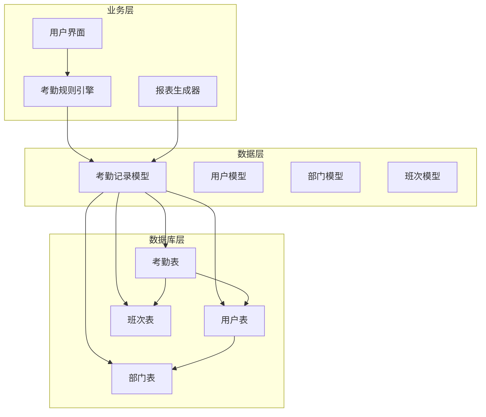

**图表来源**
- [db_storage.h:148-176](file://src/data/db_storage.h#L148-L176)
- [db_storage.cpp:197-207](file://src/data/db_storage.cpp#L197-L207)

**章节来源**
- [db_storage.h:1-596](file://src/data/db_storage.h#L1-L596)
- [db_storage.cpp:108-285](file://src/data/db_storage.cpp#L108-L285)

## 核心组件

### 考勤记录结构体设计

考勤记录模型采用`AttendanceRecord`结构体，该结构体继承了视图模型的设计理念，通过关联查询将分散的数据整合为完整的业务视图：

| 字段名称 | 数据类型 | 描述 | 存储格式 |
|---------|---------|------|---------|
| id | int | 记录流水号 | 数据库自增主键 |
| user_id | int | 关联的用户ID | 外键引用users.id |
| user_name | string | 用户姓名 | 关联查询结果 |
| dept_name | string | 部门名称 | 关联查询结果 |
| timestamp | long long | 打卡时间戳 | 秒级Unix时间戳 |
| status | int | 考勤状态码 | 0:正常, 1:迟到, 2:早退, 3:旷工 |
| image_path | string | 现场抓拍图片路径 | 文件系统相对路径 |
| minutes_late | int | 迟到分钟数 | 报表计算用 |
| minutes_early | int | 早退分钟数 | 报表计算用 |

### 考勤状态码定义与业务含义

系统采用整数状态码表示考勤状态，具有明确的业务含义和优先级关系：

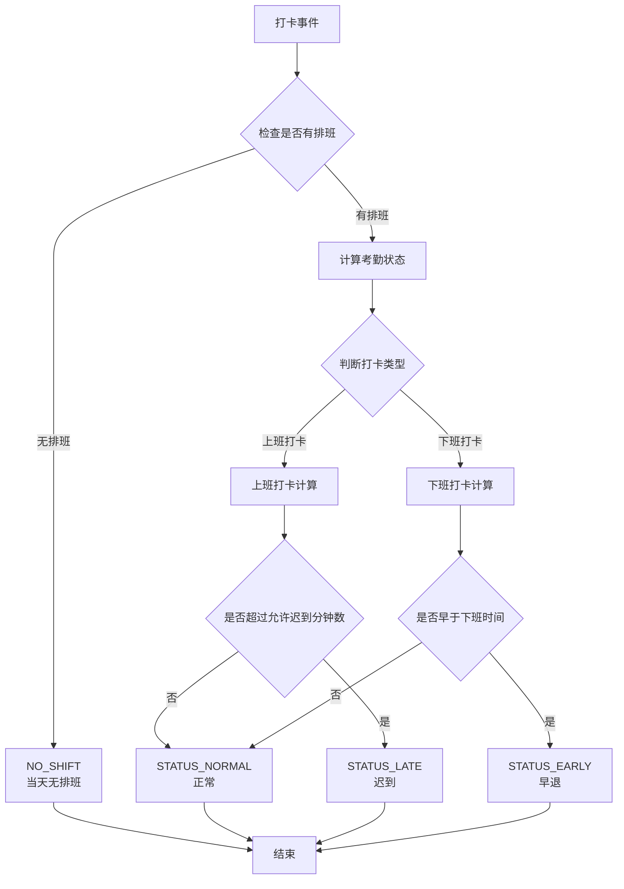

**图表来源**
- [attendance_rule.cpp:247-191](file://src/business/attendance_rule.cpp#L247-L191)

**章节来源**
- [db_storage.h:164-166](file://src/data/db_storage.h#L164-L166)
- [attendance_rule.h:28-41](file://src/business/attendance_rule.h#L28-L41)

## 架构概览

系统采用三层架构设计，考勤记录模型通过清晰的接口层次实现数据访问和业务逻辑分离：

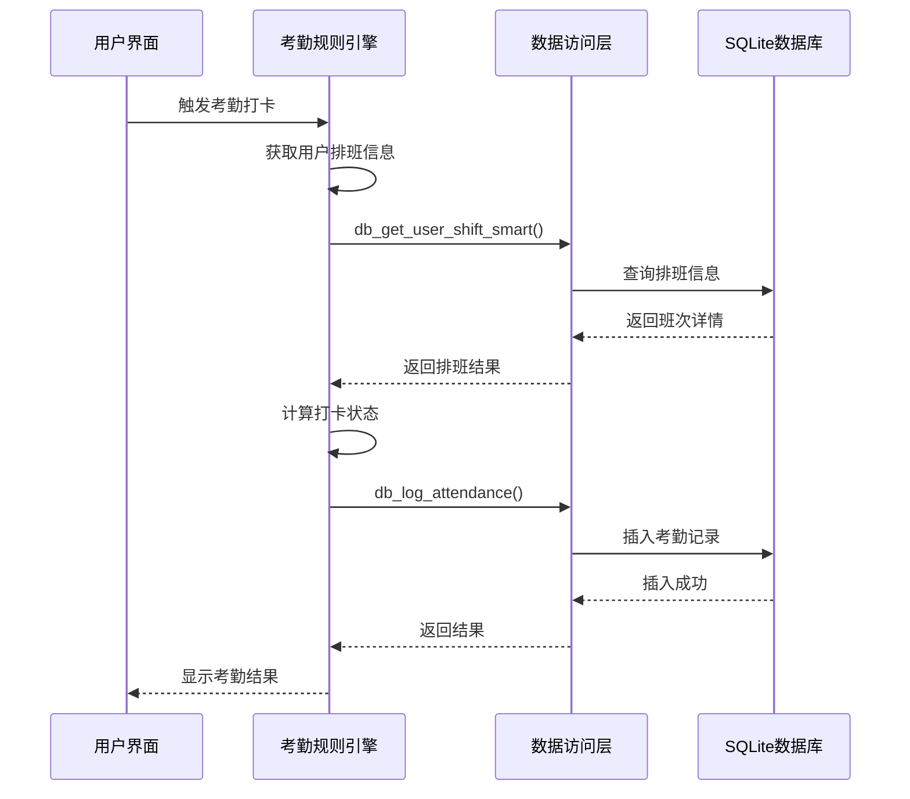

**图表来源**
- [attendance_rule.cpp:198-277](file://src/business/attendance_rule.cpp#L198-L277)
- [db_storage.cpp:1296-1348](file://src/data/db_storage.cpp#L1296-L1348)

**章节来源**
- [db_storage.h:421-461](file://src/data/db_storage.h#L421-L461)
- [attendance_rule.cpp:193-277](file://src/business/attendance_rule.cpp#L193-L277)

## 详细组件分析

### 数据模型设计

#### 考勤记录表结构

考勤记录表采用规范化设计，通过外键约束确保数据完整性：

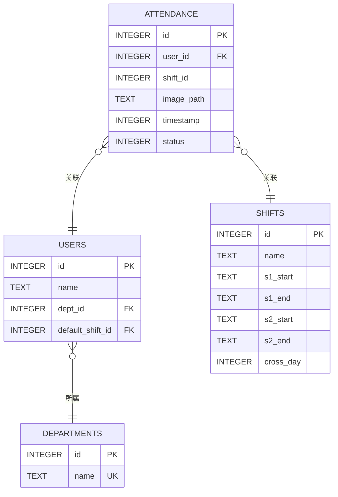

**图表来源**
- [db_storage.cpp:197-207](file://src/data/db_storage.cpp#L197-L207)
- [db_storage.cpp:181-195](file://src/data/db_storage.cpp#L181-L195)

#### 关联查询机制

系统通过LEFT JOIN实现高效的关联查询，避免N+1查询问题：

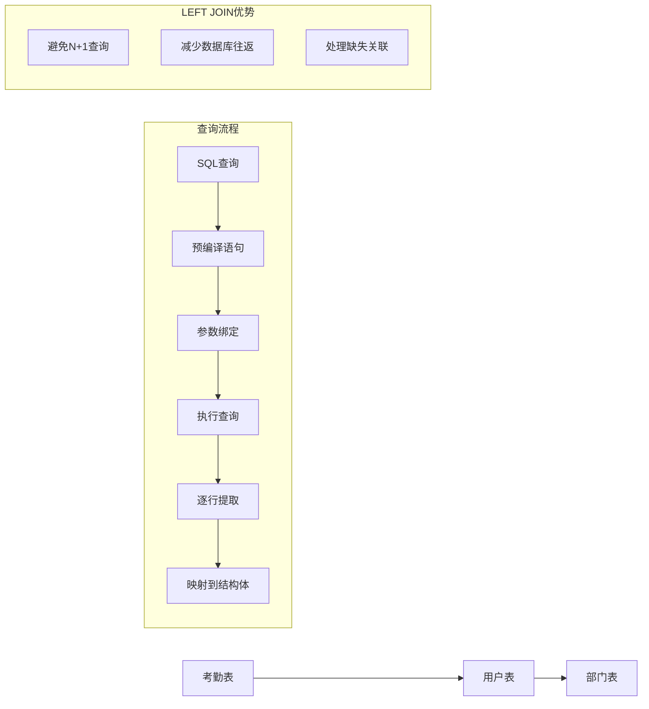

**图表来源**
- [db_storage.cpp:1445-1452](file://src/data/db_storage.cpp#L1445-L1452)
- [db_storage.cpp:2089-2097](file://src/data/db_storage.cpp#L2089-L2097)

**章节来源**
- [db_storage.cpp:1439-1481](file://src/data/db_storage.cpp#L1439-L1481)
- [db_storage.cpp:2084-2139](file://src/data/db_storage.cpp#L2084-L2139)

### 时间戳处理与计算逻辑

#### 时间戳存储格式

系统采用Unix时间戳（秒级）存储时间信息，具有以下特点：

- **精度统一**：所有时间均转换为秒级精度
- **时区无关**：基于UTC时间存储，便于跨时区应用
- **范围广泛**：支持20世纪到21世纪的时间范围
- **存储高效**：单个整数类型，占用空间小

#### 时间计算算法

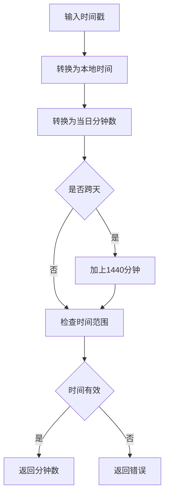

**图表来源**
- [attendance_rule.cpp:127-191](file://src/business/attendance_rule.cpp#L127-L191)

**章节来源**
- [db_storage.cpp:1296-1348](file://src/data/db_storage.cpp#L1296-L1348)
- [attendance_rule.cpp:15-74](file://src/business/attendance_rule.cpp#L15-L74)

### API接口设计

#### 考勤记录查询接口

系统提供多种查询接口，满足不同场景需求：

| 接口名称 | 参数 | 功能描述 | 返回值 |
|---------|------|----------|--------|
| db_get_records | start_ts, end_ts | 按时间段查询所有考勤记录 | AttendanceRecord列表 |
| db_get_records_by_user | user_id, start_ts, end_ts | 按用户查询考勤记录 | AttendanceRecord列表 |
| db_get_all_records_by_time | start_ts, end_ts | 批量查询全公司记录 | AttendanceRecord列表 |

#### 考勤记录管理接口

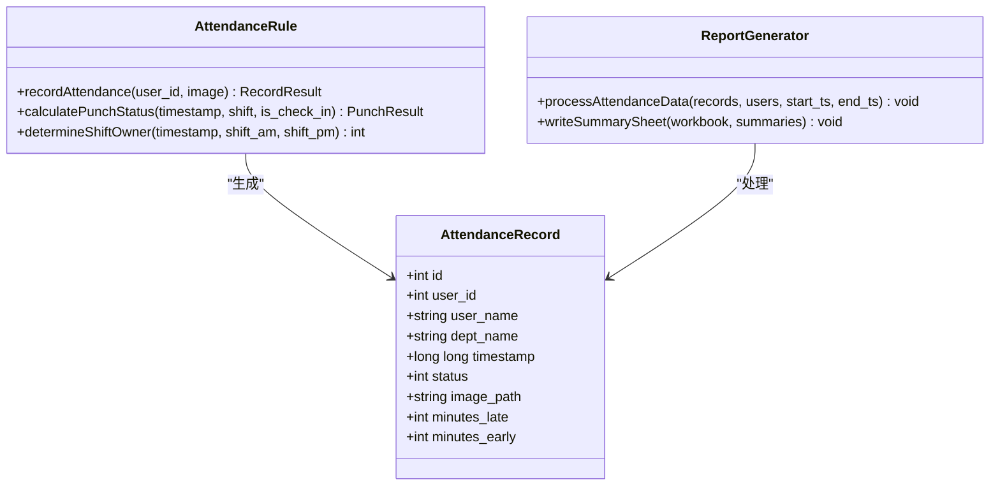

**图表来源**
- [db_storage.h:148-176](file://src/data/db_storage.h#L148-L176)
- [attendance_rule.h:43-89](file://src/business/attendance_rule.h#L43-L89)
- [report_generator.h:33-221](file://src/business/report_generator.h#L33-L221)

**章节来源**
- [db_storage.h:421-461](file://src/data/db_storage.h#L421-L461)
- [db_storage.cpp:1439-1536](file://src/data/db_storage.cpp#L1439-L1536)

## 依赖分析

### 组件耦合关系

系统采用松耦合设计，各组件间通过清晰的接口进行通信：

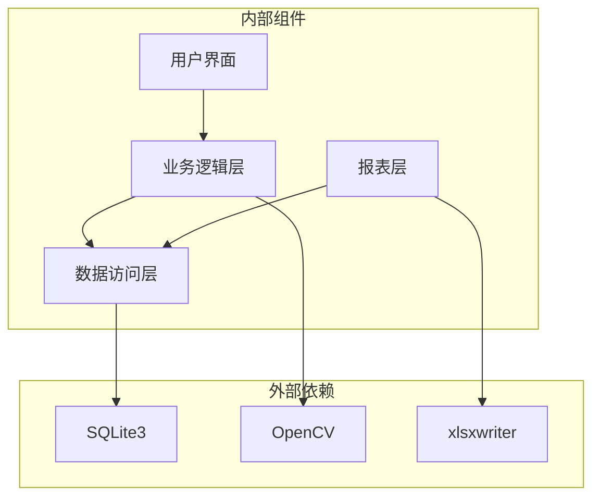

**图表来源**
- [db_storage.cpp:8-18](file://src/data/db_storage.cpp#L8-L18)
- [report_generator.h:12-13](file://src/business/report_generator.h#L12-L13)

### 错误处理机制

系统采用多层次的错误处理策略：

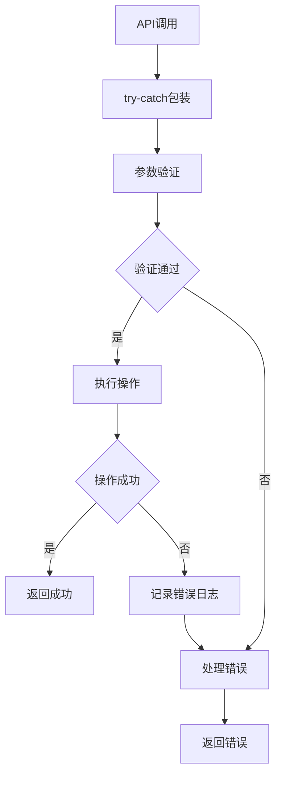

**图表来源**
- [db_storage.cpp:96-104](file://src/data/db_storage.cpp#L96-L104)

**章节来源**
- [db_storage.cpp:1-800](file://src/data/db_storage.cpp#L1-L800)

## 性能考虑

### 数据库性能优化

系统采用多项性能优化措施：

1. **WAL模式**：启用Write-Ahead Logging提升并发性能
2. **预编译语句**：缓存常用SQL语句，减少编译开销
3. **联合索引**：为user_id和timestamp建立复合索引
4. **共享锁机制**：读操作使用共享锁，提高并发读取性能

### 内存管理策略

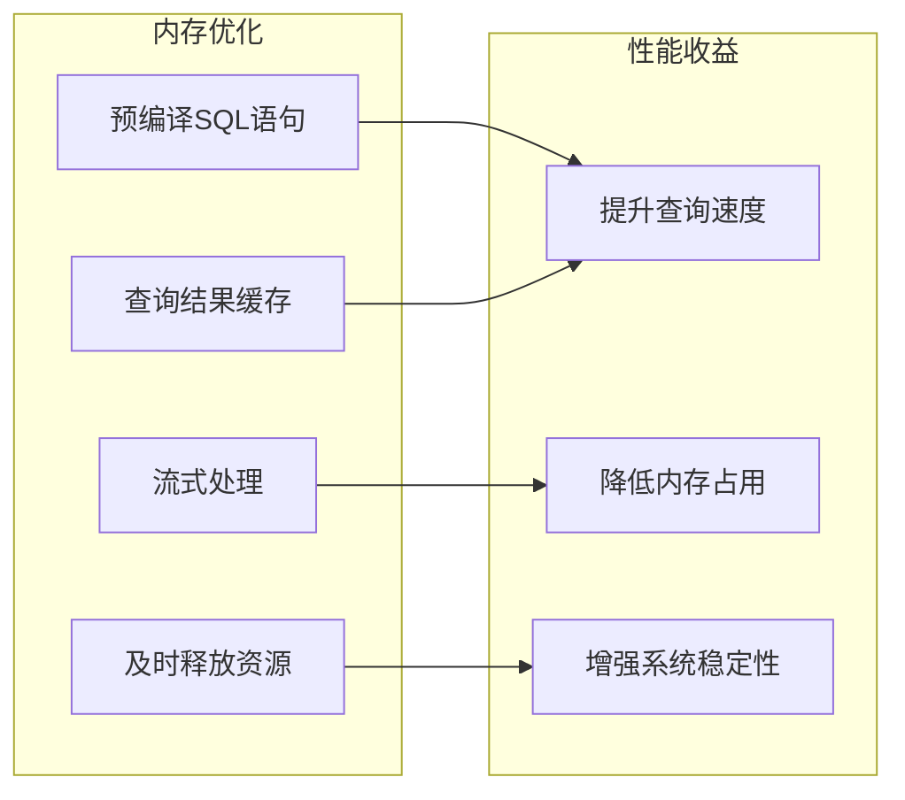

**图表来源**
- [db_storage.cpp:275-282](file://src/data/db_storage.cpp#L275-L282)
- [db_storage.cpp:35-65](file://src/data/db_storage.cpp#L35-L65)

**章节来源**
- [db_storage.cpp:124-135](file://src/data/db_storage.cpp#L124-L135)
- [db_storage.cpp:253-256](file://src/data/db_storage.cpp#L253-L256)

## 故障排除指南

### 常见问题诊断

#### 数据库连接问题

当遇到数据库连接失败时，检查以下要点：

1. **文件权限**：确保数据库文件和目录具有正确的读写权限
2. **磁盘空间**：确认有足够的磁盘空间存储数据和图片
3. **文件锁定**：检查是否存在其他进程占用数据库文件

#### 查询性能问题

如果查询响应缓慢，考虑：

1. **索引优化**：确认复合索引是否正确使用
2. **查询条件**：优化WHERE子句的过滤条件
3. **数据量控制**：合理设置查询的时间范围

### 日志分析方法

系统提供详细的日志输出，便于问题定位：

- **初始化日志**：显示数据库连接和表结构创建过程
- **操作日志**：记录关键数据操作的执行结果
- **错误日志**：捕获SQL执行错误和系统异常

**章节来源**
- [db_storage.cpp:96-104](file://src/data/db_storage.cpp#L96-L104)
- [db_storage.cpp:1370-1370](file://src/data/db_storage.cpp#L1370-L1370)

## 结论

SmartAttendance项目的考勤记录模型设计体现了现代软件工程的最佳实践。通过合理的数据结构设计、完善的关联查询机制、高效的性能优化策略，系统能够稳定地处理大规模的考勤数据。模型的模块化设计使得各个组件职责清晰，易于维护和扩展。

未来可以考虑的改进方向包括：增加更多维度的统计分析功能、优化大数据量下的查询性能、增强数据备份和恢复机制等。

## 附录

### API使用示例

#### 基本查询操作

```cpp
// 查询指定时间段内的所有考勤记录
auto records = db_get_records(start_timestamp, end_timestamp);

// 查询指定用户的考勤记录
auto user_records = db_get_records_by_user(user_id, start_timestamp, end_timestamp);

// 批量查询全公司记录用于报表
auto all_records = db_get_all_records_by_time(start_timestamp, end_timestamp);
```

#### 考勤状态处理

```cpp
// 生成格式化的考勤记录文本
auto formatted_record = business_get_record_at(index, buffer, buffer_size);
```

### 报表生成集成

系统提供的报表生成器可以直接使用考勤记录模型进行数据分析和可视化：

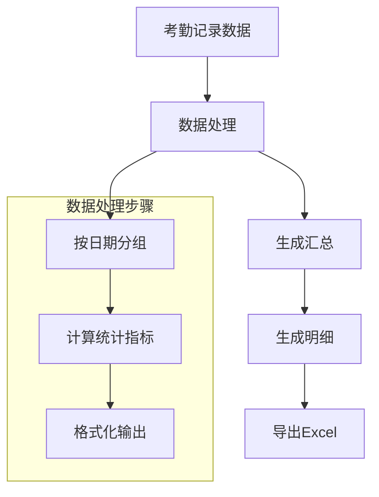

**图表来源**
- [report_generator.h:206-219](file://src/business/report_generator.h#L206-L219)