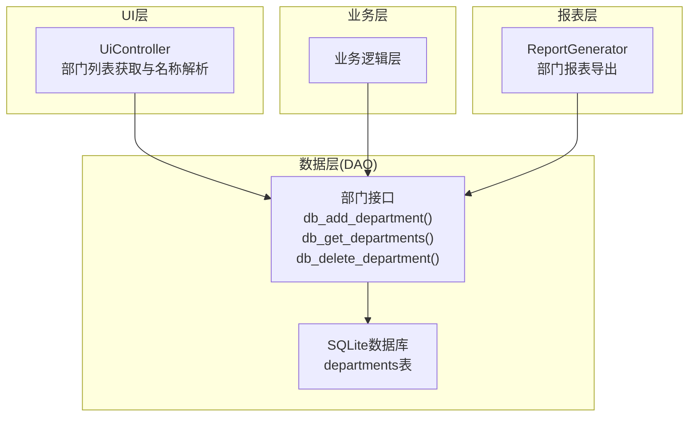
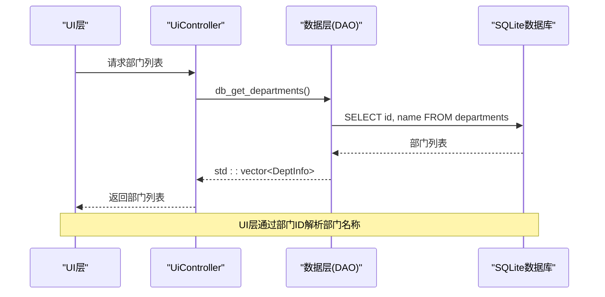
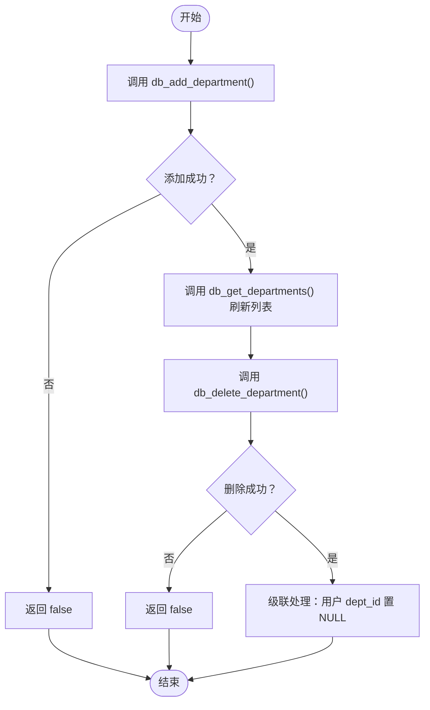
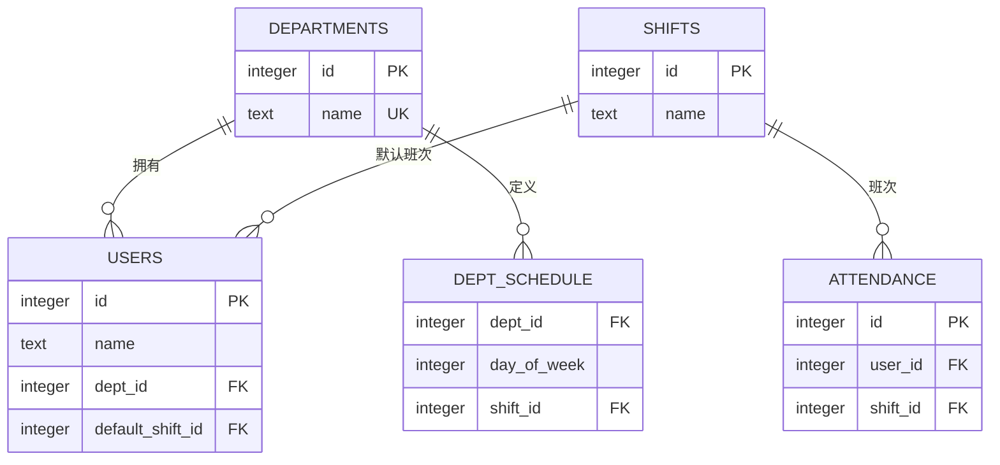
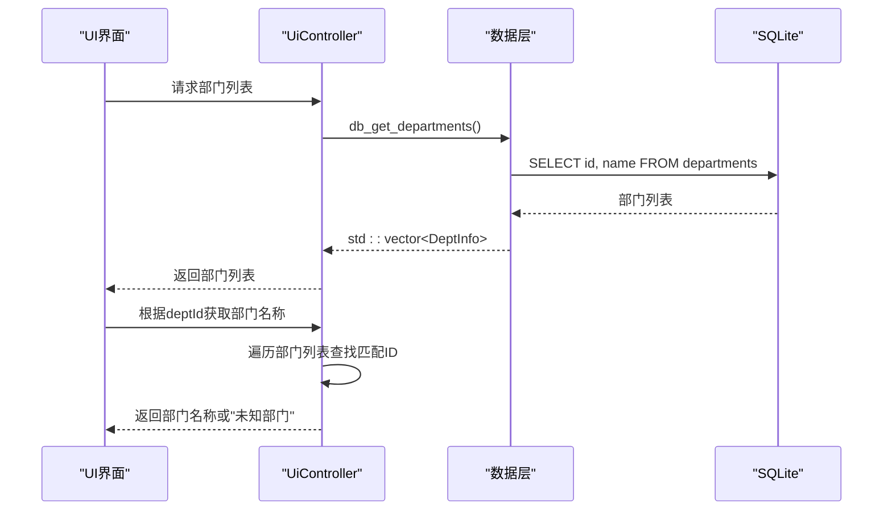
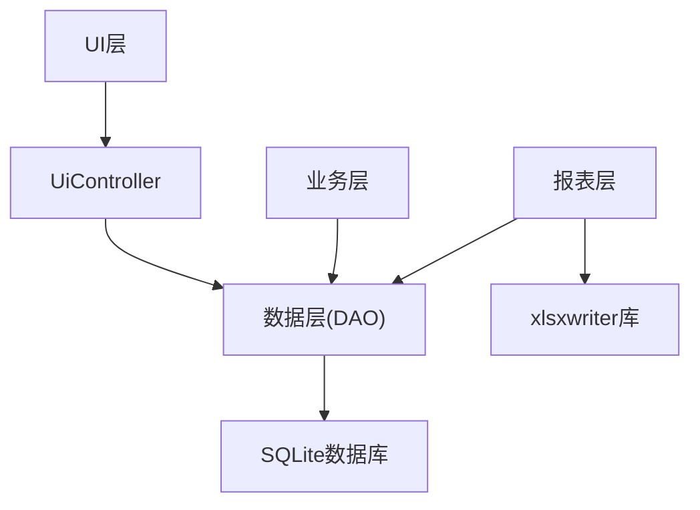

# 部门信息模型

<cite>
**本文引用的文件**
- [db_storage.h](file://src/data/db_storage.h)
- [db_storage.cpp](file://src/data/db_storage.cpp)
- [ui_controller.cpp](file://src/ui/ui_controller.cpp)
- [report_generator.h](file://src/business/report_generator.h)
- [main.cpp](file://src/main.cpp)
</cite>

## 目录
1. [简介](#简介)
2. [项目结构](#项目结构)
3. [核心组件](#核心组件)
4. [架构概览](#架构概览)
5. [详细组件分析](#详细组件分析)
6. [依赖分析](#依赖分析)
7. [性能考虑](#性能考虑)
8. [故障排除指南](#故障排除指南)
9. [结论](#结论)
10. [附录](#附录)

## 简介
本文档详细阐述SmartAttendance项目中的部门信息模型，重点解析DeptInfo结构体的设计理念、字段含义与约束条件，完整梳理部门管理的生命周期（创建、查询、删除），深入说明部门与用户之间的外键关联关系及删除时的级联处理机制，并提供部门数据的验证规则与业务约束。同时，文档包含实际代码示例的路径引用，展示如何使用db_add_department、db_get_departments、db_delete_department等接口，并解释部门数据在UI层的展示逻辑与报表统计中的应用。

## 项目结构
部门信息模型位于数据层（DAO层），通过SQLite数据库持久化存储，对外提供简洁的C++接口。UI层通过控制器封装调用数据层接口，业务层负责业务逻辑处理，报表模块基于数据层提供的查询接口生成各类统计报表。

**图表来源**
- [ui_controller.cpp:86-102](file://src/ui/ui_controller.cpp#L86-L102)
- [db_storage.h:215-236](file://src/data/db_storage.h#L215-L236)
- [db_storage.cpp:140-143](file://src/data/db_storage.cpp#L140-L143)
- [report_generator.h:131-134](file://src/business/report_generator.h#L131-L134)

**章节来源**
- [db_storage.h:18-28](file://src/data/db_storage.h#L18-L28)
- [db_storage.cpp:140-143](file://src/data/db_storage.cpp#L140-L143)
- [ui_controller.cpp:86-102](file://src/ui/ui_controller.cpp#L86-L102)
- [report_generator.h:131-134](file://src/business/report_generator.h#L131-L134)

## 核心组件
- DeptInfo结构体：封装部门标识与名称，作为数据层与业务层交互的核心数据载体。
- 部门DAO接口：提供添加、查询、删除部门的标准方法。
- 数据库表结构：departments表定义了部门ID与名称的存储规范及唯一性约束。
- 外键关联：用户表与部门表建立外键关系，删除部门时触发级联处理策略。

**章节来源**
- [db_storage.h:18-28](file://src/data/db_storage.h#L18-L28)
- [db_storage.h:215-236](file://src/data/db_storage.h#L215-L236)
- [db_storage.cpp:140-143](file://src/data/db_storage.cpp#L140-L143)

## 架构概览
部门信息模型遵循分层架构：
- UI层：负责用户交互与展示，通过UiController获取部门列表并解析部门名称。
- 业务层：处理业务规则与流程，间接调用数据层接口。
- 数据层：封装数据库操作，提供DAO接口，保证并发安全与数据一致性。
- 报表层：基于数据层查询接口生成统计报表，支持按部门维度导出。

**图表来源**
- [ui_controller.cpp:86-102](file://src/ui/ui_controller.cpp#L86-L102)
- [db_storage.cpp:426-446](file://src/data/db_storage.cpp#L426-L446)

**章节来源**
- [ui_controller.cpp:86-102](file://src/ui/ui_controller.cpp#L86-L102)
- [db_storage.cpp:426-446](file://src/data/db_storage.cpp#L426-L446)

## 详细组件分析

### DeptInfo结构体设计
- 字段定义
  - id：整型，数据库自增主键，唯一标识每个部门。
  - name：字符串，部门名称，具有唯一性约束。
- 设计理念
  - 简洁明确：仅包含必要字段，便于序列化与传输。
  - 唯一约束：通过数据库层面的UNIQUE约束保证部门名称唯一，避免重复。
  - 可扩展性：结构体设计为扁平数据，便于与其他结构体组合使用（如用户结构体中包含部门名称字段）。

**章节来源**
- [db_storage.h:18-28](file://src/data/db_storage.h#L18-L28)
- [db_storage.cpp:140-143](file://src/data/db_storage.cpp#L140-L143)

### 部门管理生命周期
- 创建部门
  - 接口：db_add_department(const std::string& dept_name)
  - 行为：向departments表插入一条记录，名称由调用方提供。
  - 并发：写操作使用排他锁，保证线程安全。
  - 返回：成功返回true，失败返回false。
- 查询部门
  - 接口：std::vector<DeptInfo> db_get_departments()
  - 行为：查询departments表的id与name字段，返回完整列表。
  - 并发：读操作使用共享锁，允许多线程并发读取。
  - 返回：std::vector<DeptInfo>，包含所有部门信息。
- 删除部门
  - 接口：bool db_delete_department(int dept_id)
  - 行为：删除departments表中指定ID的部门记录。
  - 级联处理：删除部门后，原属于该部门的员工其dept_id将被置为NULL（外键约束SET NULL）。
  - 并发：写操作使用排他锁，保证线程安全。

**图表来源**
- [db_storage.cpp:409-461](file://src/data/db_storage.cpp#L409-L461)
- [db_storage.cpp:192-195](file://src/data/db_storage.cpp#L192-L195)

**章节来源**
- [db_storage.cpp:409-461](file://src/data/db_storage.cpp#L409-L461)
- [db_storage.h:215-236](file://src/data/db_storage.h#L215-L236)

### 外键关联关系与级联处理
- 部门与用户
  - 外键：users表的dept_id引用departments表的id。
  - 级联策略：ON DELETE SET NULL，删除部门时，相关用户的dept_id被置为NULL。
- 部门与排班
  - 外键：dept_schedule表的dept_id引用departments表的id。
  - 级联策略：ON DELETE CASCADE，删除部门时，相关排班规则被级联删除。
- 用户与班次
  - 外键：users表的default_shift_id引用shifts表的id。
  - 级联策略：ON DELETE SET NULL，删除班次时，相关用户的默认班次被置为NULL。
- 考勤记录与班次
  - 外键：attendance表的shift_id引用shifts表的id。
  - 级联策略：ON DELETE SET NULL，删除班次时，相关考勤记录的shift_id被置为NULL。

**图表来源**
- [db_storage.cpp:140-143](file://src/data/db_storage.cpp#L140-L143)
- [db_storage.cpp:182-195](file://src/data/db_storage.cpp#L182-L195)
- [db_storage.cpp:197-207](file://src/data/db_storage.cpp#L197-L207)
- [db_storage.cpp:209-217](file://src/data/db_storage.cpp#L209-L217)

**章节来源**
- [db_storage.cpp:140-143](file://src/data/db_storage.cpp#L140-L143)
- [db_storage.cpp:182-195](file://src/data/db_storage.cpp#L182-L195)
- [db_storage.cpp:197-207](file://src/data/db_storage.cpp#L197-L207)
- [db_storage.cpp:209-217](file://src/data/db_storage.cpp#L209-L217)

### 部门数据验证规则与业务约束
- 唯一性约束
  - 部门名称在数据库层面具有UNIQUE约束，确保同一名称的部门不会重复创建。
- 非空约束
  - 部门名称为NOT NULL，防止空名称的无效数据。
- 业务约束
  - 删除部门时，系统会自动将原属于该部门的员工dept_id置为NULL，避免悬挂引用。
  - 删除部门时，相关排班规则也会被级联删除，保持数据一致性。

**章节来源**
- [db_storage.cpp:140-143](file://src/data/db_storage.cpp#L140-L143)
- [db_storage.cpp:192-195](file://src/data/db_storage.cpp#L192-L195)
- [db_storage.cpp:209-217](file://src/data/db_storage.cpp#L209-L217)

### 实际代码示例路径
以下示例展示了如何使用部门管理接口，具体代码内容请参考相应文件路径：

- 添加部门
  - 示例路径：[db_add_department调用示例:94-103](file://src/main.cpp#L94-L103)
- 查询部门列表
  - 示例路径：[db_get_departments调用示例:75-103](file://src/main.cpp#L75-L103)
- 删除部门
  - 示例路径：[db_delete_department调用示例:448-461](file://src/data/db_storage.cpp#L448-L461)
- UI层展示逻辑
  - 示例路径：[部门列表获取与名称解析:86-102](file://src/ui/ui_controller.cpp#L86-L102)
- 报表统计应用
  - 示例路径：[按部门导出报表接口:131-134](file://src/business/report_generator.h#L131-L134)

**章节来源**
- [main.cpp:75-103](file://src/main.cpp#L75-L103)
- [db_storage.cpp:448-461](file://src/data/db_storage.cpp#L448-L461)
- [ui_controller.cpp:86-102](file://src/ui/ui_controller.cpp#L86-L102)
- [report_generator.h:131-134](file://src/business/report_generator.h#L131-L134)

### UI层展示逻辑
- 部门列表获取
  - UiController通过db_get_departments()获取所有部门信息，返回std::vector<DeptInfo>。
- 部门名称解析
  - UiController维护一个部门ID到名称的映射，遍历部门列表查找匹配的ID并返回对应名称。
- 默认值处理
  - 若未找到匹配的部门ID，返回"未知部门"作为默认显示值。

**图表来源**
- [ui_controller.cpp:86-102](file://src/ui/ui_controller.cpp#L86-L102)
- [db_storage.cpp:426-446](file://src/data/db_storage.cpp#L426-L446)

**章节来源**
- [ui_controller.cpp:86-102](file://src/ui/ui_controller.cpp#L86-L102)
- [db_storage.cpp:426-446](file://src/data/db_storage.cpp#L426-L446)

### 报表统计中的应用
- 按部门导出报表
  - ReportGenerator提供按部门名称导出报表的接口，内部通过db_get_users_by_dept()获取指定部门的所有用户信息。
- 月度汇总与明细
  - 报表模块基于数据层提供的考勤记录与用户信息，按部门维度进行统计与展示。
- 数据一致性
  - 由于删除部门时会将用户dept_id置为NULL，报表模块在查询用户信息时仍能正确关联部门名称，确保统计准确性。

**章节来源**
- [report_generator.h:131-134](file://src/business/report_generator.h#L131-L134)
- [db_storage.cpp:192-195](file://src/data/db_storage.cpp#L192-L195)

## 依赖分析
- 组件耦合
  - UI层依赖数据层接口，通过UiController封装调用。
  - 业务层与数据层松耦合，通过标准接口交互。
  - 报表层依赖数据层查询接口，不直接操作数据库。
- 外部依赖
  - SQLite作为本地嵌入式数据库，提供ACID特性与高可靠性。
  - xlsxwriter用于报表导出功能。
- 潜在循环依赖
  - 项目采用单向依赖（UI->业务->数据），未发现循环依赖风险。

**图表来源**
- [ui_controller.cpp:86-102](file://src/ui/ui_controller.cpp#L86-L102)
- [db_storage.h:215-236](file://src/data/db_storage.h#L215-L236)
- [report_generator.h:131-134](file://src/business/report_generator.h#L131-L134)

**章节来源**
- [ui_controller.cpp:86-102](file://src/ui/ui_controller.cpp#L86-L102)
- [db_storage.h:215-236](file://src/data/db_storage.h#L215-L236)
- [report_generator.h:131-134](file://src/business/report_generator.h#L131-L134)

## 性能考虑
- 并发控制
  - 读操作使用共享锁，写操作使用排他锁，有效避免竞态条件。
  - 部门查询为轻量级操作，适合频繁调用。
- 索引与查询
  - 部门表仅包含少量字段，查询开销极低。
  - 用户表的dept_id外键索引有助于提升关联查询性能。
- 缓存策略
  - UI层可缓存部门列表，减少重复查询次数。
- 批量操作
  - 删除部门涉及级联处理，建议在业务层进行批量操作优化。

## 故障排除指南
- 添加部门失败
  - 检查部门名称是否已存在（UNIQUE约束）。
  - 确认数据库连接状态与权限。
- 查询部门列表为空
  - 首次运行时可能需要触发数据播种（data_seed）。
  - 检查数据库文件是否存在且可读。
- 删除部门后用户信息异常
  - 确认删除操作成功执行。
  - 检查用户dept_id是否已被置为NULL。
- UI层部门名称显示异常
  - 确认部门ID与名称映射逻辑正确。
  - 检查默认值处理逻辑（"未知部门"）。

**章节来源**
- [db_storage.cpp:409-461](file://src/data/db_storage.cpp#L409-L461)
- [ui_controller.cpp:86-102](file://src/ui/ui_controller.cpp#L86-L102)

## 结论
SmartAttendance项目的部门信息模型通过DeptInfo结构体与DAO接口实现了清晰的数据抽象与稳定的业务边界。数据库层面的唯一性约束与外键级联策略确保了数据一致性与完整性。UI层与报表层通过标准化接口获取部门数据，既满足了展示需求，又支持多维度统计分析。整体设计具备良好的可维护性与扩展性，为后续功能演进奠定了坚实基础。

## 附录
- 数据库初始化与播种
  - 首次运行时自动创建departments表并插入默认部门（如"Not Set"）。
- 接口使用建议
  - 在调用db_add_department前进行名称唯一性检查。
  - 删除部门前评估对用户与排班的影响。
  - UI层应缓存部门列表以提升响应速度。

**章节来源**
- [db_storage.cpp:318-331](file://src/data/db_storage.cpp#L318-L331)
- [db_storage.cpp:409-461](file://src/data/db_storage.cpp#L409-L461)
- [ui_controller.cpp:86-102](file://src/ui/ui_controller.cpp#L86-L102)