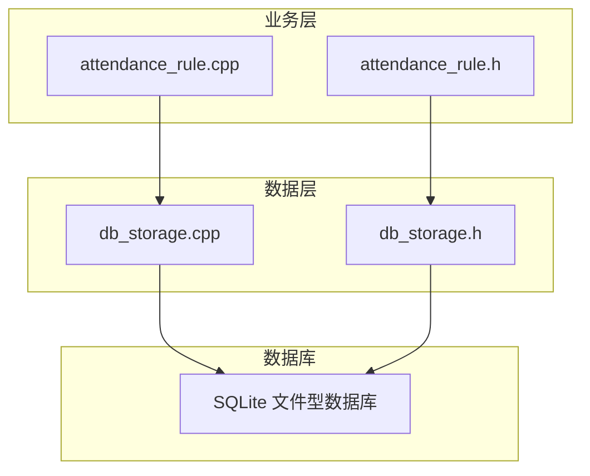
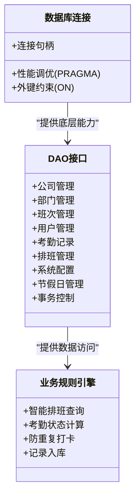
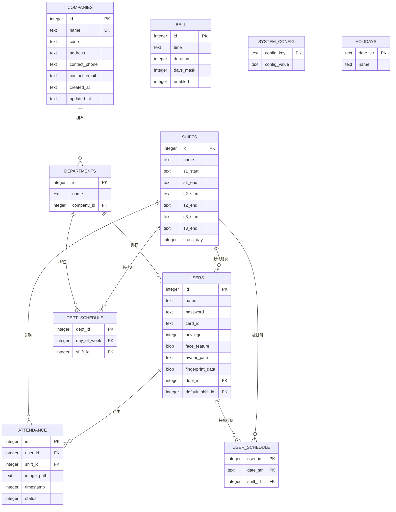
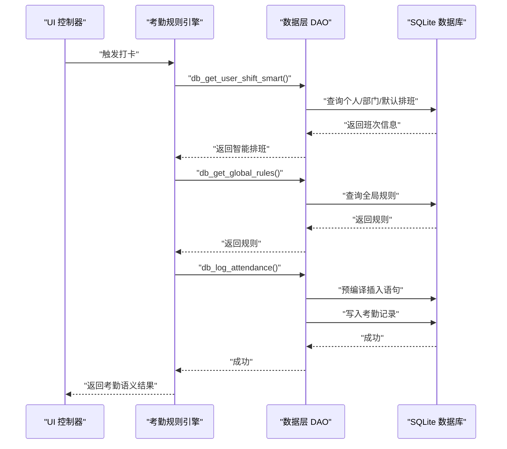

# 数据库设计

<cite>
**本文引用的文件**
- [db_storage.cpp](file://src/data/db_storage.cpp)
- [db_storage.h](file://src/data/db_storage.h)
- [attendance_rule.cpp](file://src/business/attendance_rule.cpp)
- [attendance_rule.h](file://src/business/attendance_rule.h)
- [main.cpp](file://src/main.cpp)
- [report_generator.cpp](file://src/business/report_generator.cpp)
</cite>

## 更新摘要
**所做更改**
- 新增多公司架构支持，包括新的companies表和公司管理接口
- 更新部门表结构，添加company_id外键关系
- 用户表face_data字段重命名为face_feature
- 新增部门-公司联合索引优化查询性能
- 完善公司管理DAO接口，支持CRUD操作
- 更新实体关系模型以反映新的多公司架构

## 目录
1. [简介](#简介)
2. [项目结构](#项目结构)
3. [核心组件](#核心组件)
4. [架构总览](#架构总览)
5. [详细组件分析](#详细组件分析)
6. [依赖分析](#依赖分析)
7. [性能考虑](#性能考虑)
8. [故障排查指南](#故障排查指南)
9. [结论](#结论)
10. [附录](#附录)

## 简介
本文件面向智能考勤系统，基于现有代码库，系统化梳理数据库设计与实现，涵盖表结构、字段定义、数据类型选择、实体关系模型、外键约束、DAO 模式与事务处理、数据迁移与版本管理策略、性能优化与安全备份方案。**更新内容**：新增多公司架构支持，包括companies表、departments表的company_id外键关系，以及用户表face_data字段重命名为face_feature。

## 项目结构
数据库层位于 src/data，核心文件为 db_storage.cpp/.h，提供 SQLite 数据库的初始化、表结构创建与升级、DAO 接口与事务控制。业务层 attendance_rule.cpp/.h 通过 DAO 接口完成考勤规则计算与记录入库。

**图表来源**
- [db_storage.cpp:133-310](file://src/data/db_storage.cpp#L133-L310)
- [db_storage.h:213-240](file://src/data/db_storage.h#L213-L240)
- [attendance_rule.cpp:263-342](file://src/business/attendance_rule.cpp#L263-L342)

**章节来源**
- [db_storage.cpp:133-310](file://src/data/db_storage.cpp#L133-L310)
- [db_storage.h:213-240](file://src/data/db_storage.h#L213-L240)

## 核心组件
- 数据库初始化与性能调优：开启 WAL、设置同步级别、内存临时存储、缓存大小、外键约束等。
- **多公司架构支持**：新增companies表，支持多公司多部门组织架构
- 表结构与索引：公司、部门、班次、用户、考勤记录、部门周排班、用户特定日期排班、响铃计划、系统配置、节假日等。
- DAO 接口：提供 CRUD 与批量导入、事务控制、智能排班查询、系统统计、**公司管理**等。
- 事务与并发：使用共享读锁/排他写锁保证线程安全，批量操作使用事务加速。
- 数据迁移与兼容：通过 ALTER TABLE 动态兼容旧表结构，INSERT OR REPLACE 实现平滑升级。
- 数据安全与维护：提供工厂重置、清空记录与用户、磁盘图片清理、系统统计等。

**章节来源**
- [db_storage.cpp:148-161](file://src/data/db_storage.cpp#L148-L161)
- [db_storage.cpp:222-293](file://src/data/db_storage.cpp#L222-L293)
- [db_storage.cpp:432-486](file://src/data/db_storage.cpp#L432-L486)
- [db_storage.cpp:1563-1578](file://src/data/db_storage.cpp#L1563-L1578)
- [db_storage.cpp:1826-1908](file://src/data/db_storage.cpp#L1826-L1908)

## 架构总览
数据库层采用 SQLite 文件型数据库，通过 RAII 封装的语句对象与预编译语句提升安全性与性能；使用共享/排他锁实现并发控制；通过事务加速批量写入；通过外键约束与 ON DELETE 策略保障数据一致性。**新增**：支持多公司架构，每个部门必须归属于特定公司。

**图表来源**
- [db_storage.cpp:148-161](file://src/data/db_storage.cpp#L148-L161)
- [db_storage.cpp:432-486](file://src/data/db_storage.cpp#L432-L486)
- [db_storage.cpp:1659-1788](file://src/data/db_storage.cpp#L1659-L1788)
- [attendance_rule.cpp:263-342](file://src/business/attendance_rule.cpp#L263-L342)

## 详细组件分析

### 表结构与字段定义
- **公司表 companies**
  - 字段：id（自增主键）、name（唯一）、code、address、contact_phone、contact_email、created_at、updated_at
  - 用途：多公司架构的基础，支持企业级部署
- **部门表 departments**
  - 字段：id（自增主键）、name、company_id（外键，关联companies.id，CASCADE）
  - 用途：组织架构基础，支持多公司多部门
- **班次表 shifts**
  - 字段：id（自增主键）、name、s1_start/s1_end、s2_start/s2_end、s3_start/s3_end、cross_day
  - 用途：支持多时段与跨天班次
- **考勤规则表 attendance_rules**
  - 字段：id（固定）、company_name、late_threshold、early_leave_threshold、device_id、volume、screensaver_time、max_admins、duplicate_punch_limit、language、date_format、return_home_delay、warning_record_count、relay_delay、wiegand_fmt、sat_work、sun_work
  - 用途：全局系统配置与规则
- **用户表 users**
  - 字段：id（自增主键）、name、password、card_id、privilege、face_feature（BLOB，重命名自face_data）、avatar_path、fingerprint_data（BLOB）、dept_id（外键）、default_shift_id（外键）
  - 用途：员工身份、权限与生物特征
- **考勤记录表 attendance**
  - 字段：id（自增主键）、user_id（外键，CASCADE）、shift_id（外键，SET NULL）、image_path、timestamp、status
  - 用途：打卡流水
- **部门周排班表 dept_schedule**
  - 字段：dept_id、day_of_week（0-6）、shift_id（外键，SET NULL），联合主键
  - 用途：部门按周排班
- **用户特定日期排班表 user_schedule**
  - 字段：user_id、date_str（"YYYY-MM-DD"）、shift_id（外键，SET NULL），联合主键
  - 用途：个人特殊日期排班
- **响铃计划表 bells**
  - 字段：id（1-16）、time、duration、days_mask、enabled
  - 用途：定时响铃配置
- **系统配置表 system_config**
  - 字段：config_key（PK）、config_value
  - 用途：键值型配置
- **节假日表 holidays**
  - 字段：date_str（PK）、name
  - 用途：全局节假日

**章节来源**
- [db_storage.cpp:164-276](file://src/data/db_storage.cpp#L164-L276)
- [db_storage.h:18-202](file://src/data/db_storage.h#L18-L202)

### 实体关系模型与外键约束
- companies.id → departments.company_id（CASCADE）
- users.dept_id → departments.id（SET NULL）
- users.default_shift_id → shifts.id（SET NULL）
- attendance.user_id → users.id（CASCADE）
- attendance.shift_id → shifts.id（SET NULL）
- dept_schedule.dept_id → departments.id（CASCADE）
- dept_schedule.shift_id → shifts.id（SET NULL）
- user_schedule.user_id → users.id（CASCADE）
- user_schedule.shift_id → shifts.id（SET NULL）

**图表来源**
- [db_storage.cpp:164-276](file://src/data/db_storage.cpp#L164-L276)
- [db_storage.h:18-202](file://src/data/db_storage.h#L18-L202)

### 数据访问模式（DAO 模式）
- 生命周期与性能调优：data_init() 打开数据库、设置 PRAGMA、创建/升级表、创建索引、播种默认数据、预编译高频语句。
- 并发控制：使用共享读锁/排他写锁包裹 SQL 执行，保证线程安全。
- 事务控制：db_begin_transaction()/db_commit_transaction() 包裹批量写入，显著提升性能。
- 高频语句预编译：预编译考勤记录插入语句，减少准备开销。
- 批量导入：db_batch_add_users() 使用 INSERT OR REPLACE，支持批量同步与覆盖更新。
- **公司管理接口**：db_add_company()、db_get_all_companies()、db_get_company_info()、db_update_company()、db_delete_company()、db_get_default_company_id()
- **智能排班查询**：db_get_user_shift_smart() 优先级链：个人特殊排班 → 部门周排班 → 默认班次 → 节点K周末规则。
- 系统统计：db_get_system_stats() 使用聚合一次性统计多指标。

**章节来源**
- [db_storage.cpp:133-310](file://src/data/db_storage.cpp#L133-L310)
- [db_storage.cpp:432-486](file://src/data/db_storage.cpp#L432-L486)
- [db_storage.cpp:831-929](file://src/data/db_storage.cpp#L831-L929)
- [db_storage.cpp:1659-1788](file://src/data/db_storage.cpp#L1659-L1788)
- [db_storage.cpp:1959-1988](file://src/data/db_storage.cpp#L1959-L1988)

### 数据迁移策略与版本管理
- 动态兼容：通过 ALTER TABLE 为旧表增加新列，确保升级时数据不丢失。
- 平滑升级：使用 INSERT OR REPLACE 实现"存在则更新，不存在则插入"，避免破坏既有数据。
- 事务保障：批量导入与排班导入均使用事务，失败自动回滚。
- 版本无关：SQLite 文件即数据库，无需额外版本号管理；通过表结构与列存在性检测实现兼容。
- **字段重命名**：face_data字段重命名为face_feature，保持向后兼容性。

**章节来源**
- [db_storage.cpp:202-204](file://src/data/db_storage.cpp#L202-L204)
- [db_storage.cpp:847-849](file://src/data/db_storage.cpp#L847-L849)
- [db_storage.cpp:2117-2167](file://src/data/db_storage.cpp#L2117-L2167)

### 数据安全与备份恢复
- 工厂重置：db_factory_reset() 关闭连接、删除数据库文件与图片目录、重新初始化。
- 清空记录：db_clear_attendance() 清空考勤表并重建图片目录。
- 清空用户：db_clear_users() 清空用户表（依赖外键 CASCADE 清理考勤记录）。
- 磁盘清理：db_cleanup_old_attendance_images() 自动清理过期图片并置空路径，避免磁盘膨胀。
- 系统统计：db_get_system_stats() 快速统计注册与认证方式分布，便于审计。

**章节来源**
- [db_storage.cpp:1826-1908](file://src/data/db_storage.cpp#L1826-L1908)
- [db_storage.cpp:1397-1461](file://src/data/db_storage.cpp#L1397-L1461)
- [db_storage.cpp:1959-1988](file://src/data/db_storage.cpp#L1959-L1988)

## 依赖分析
- 业务层依赖数据层：attendance_rule.cpp 通过 db_get_user_shift_smart()、db_get_global_rules()、db_log_attendance() 等接口完成考勤计算与入库。
- 数据层依赖 SQLite：使用 sqlite3 API 进行连接、执行、准备语句、绑定参数、事务控制。
- 并发与线程安全：共享/排他锁贯穿所有写操作，读操作使用共享锁，避免竞争条件。
- 外键与一致性：通过外键与 ON DELETE 策略确保删除部门/用户时不影响完整性。
- **公司管理依赖**：report_generator.cpp 通过 db_get_all_users_info() 获取用户信息，其中包含face_feature字段。

**图表来源**
- [attendance_rule.cpp:263-342](file://src/business/attendance_rule.cpp#L263-L342)
- [db_storage.cpp:1321-1373](file://src/data/db_storage.cpp#L1321-L1373)
- [db_storage.cpp:1659-1788](file://src/data/db_storage.cpp#L1659-L1788)

**章节来源**
- [attendance_rule.cpp:263-342](file://src/business/attendance_rule.cpp#L263-L342)
- [db_storage.cpp:1321-1373](file://src/data/db_storage.cpp#L1321-L1373)

## 性能考虑
- WAL 模式：开启 WAL 提升并发读写性能，读写不互斥。
- 同步级别：设置为 NORMAL，在安全与性能间取得平衡。
- 临时存储：将临时表/索引放入内存，降低磁盘 IO。
- 缓存大小：设置合适的 cache_size，提升热点数据命中率。
- 外键约束：开启 foreign_keys，确保引用完整性。
- 预编译语句：预编译高频插入语句，减少准备开销。
- **索引优化**：为 attendance(user_id, timestamp DESC) 建立联合索引，加速按用户与时间范围查询；为 departments(company_id) 建立索引，加速按公司查询部门。
- 批量事务：批量导入与排班导入使用 BEGIN/COMMIT，显著提升吞吐。
- BLOB 存储：人脸与指纹特征以 BLOB 存储，注意控制大小与备份策略。

**章节来源**
- [db_storage.cpp:148-161](file://src/data/db_storage.cpp#L148-L161)
- [db_storage.cpp:278-282](file://src/data/db_storage.cpp#L278-L282)
- [db_storage.cpp:300-307](file://src/data/db_storage.cpp#L300-L307)
- [db_storage.cpp:837-929](file://src/data/db_storage.cpp#L837-L929)
- [db_storage.cpp:2117-2167](file://src/data/db_storage.cpp#L2117-L2167)

## 故障排查指南
- SQL 错误：exec_sql() 统一捕获并打印错误信息，定位失败位置。
- 事务失败：批量导入/排班导入失败会回滚，检查 BEGIN/COMMIT 与单条执行结果。
- 预编译失败：log_attendance 预编译失败会导致插入失败，检查 data_init() 是否成功。
- 外键约束：删除部门/用户时若仍有引用，需先清理或使用 SET NULL/CASCADE 策略。
- **公司管理问题**：检查 companies 表是否存在，确认默认公司ID是否正确。
- 磁盘清理：定期执行 db_cleanup_old_attendance_images()，避免图片占用过多空间。
- 工厂重置：遇到严重数据损坏时，使用 db_factory_reset() 恢复初始状态。

**章节来源**
- [db_storage.cpp:121-129](file://src/data/db_storage.cpp#L121-L129)
- [db_storage.cpp:837-929](file://src/data/db_storage.cpp#L837-L929)
- [db_storage.cpp:1397-1461](file://src/data/db_storage.cpp#L1397-L1461)
- [db_storage.cpp:1889-1908](file://src/data/db_storage.cpp#L1889-L1908)

## 结论
本数据库设计以 SQLite 为核心，结合预编译语句、事务与并发锁，实现了高性能、高可靠的数据访问。**更新内容**：新增多公司架构支持，通过companies表和departments表的company_id外键关系，支持企业级多公司部署。通过外键约束与 ON DELETE 策略保障数据一致性，通过动态 ALTER 与 INSERT OR REPLACE 实现平滑升级。配合工厂重置、清空与磁盘清理等维护手段，满足智能考勤系统的日常运行与长期演进需求。

## 附录
- 数据库文件：attendance.db
- 图片目录：captured_images、registered_avatars
- **索引**：idx_att_user_time、idx_dept_company
- 关键 PRAGMA：journal_mode=WAL、synchronous=NORMAL、temp_store=MEMORY、cache_size、foreign_keys=ON

**章节来源**
- [db_storage.cpp:29](file://src/data/db_storage.cpp#L29)
- [db_storage.cpp:25](file://src/data/db_storage.cpp#L25-L27)
- [db_storage.cpp:280-282](file://src/data/db_storage.cpp#L280-L282)
- [db_storage.cpp:148-161](file://src/data/db_storage.cpp#L148-L161)