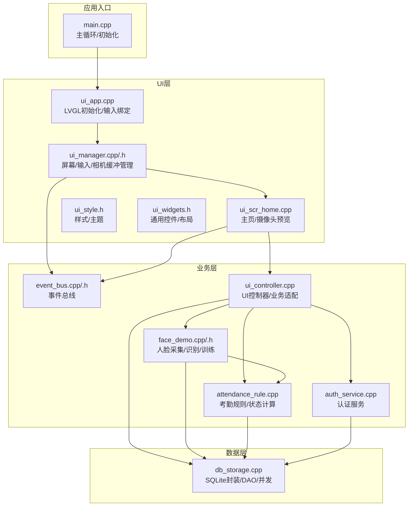
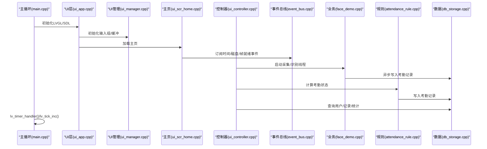
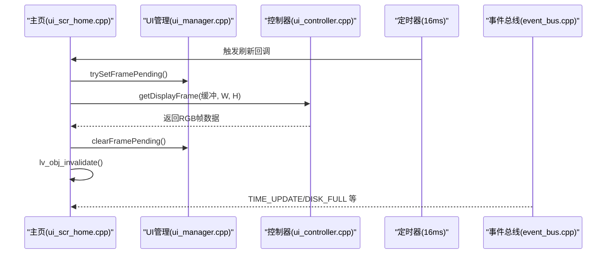
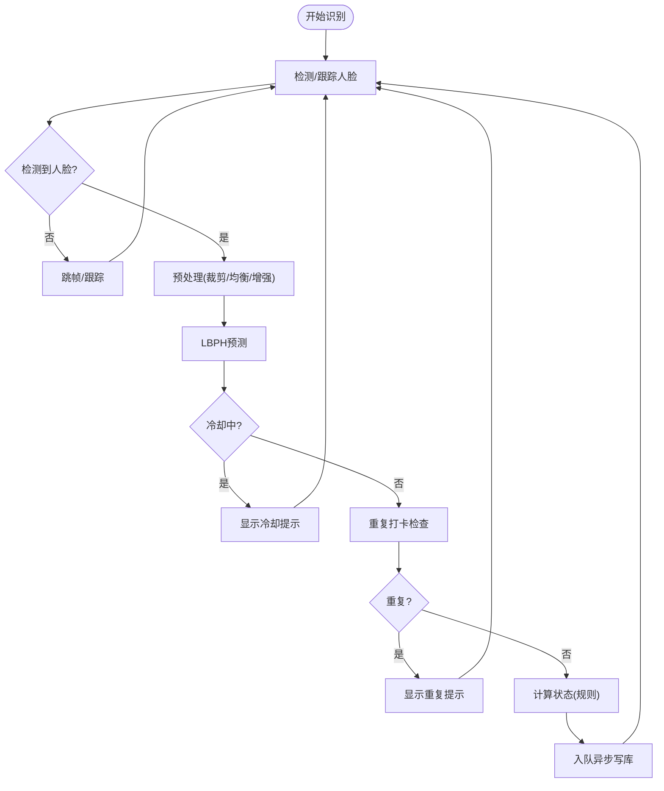
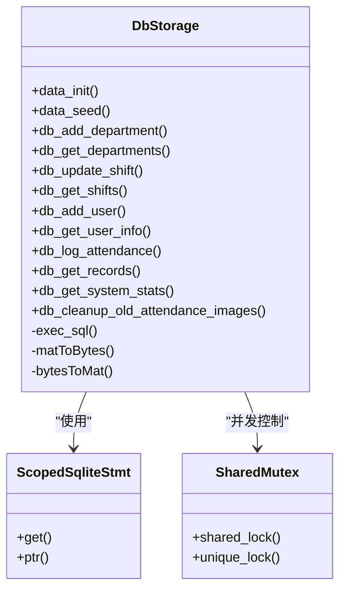
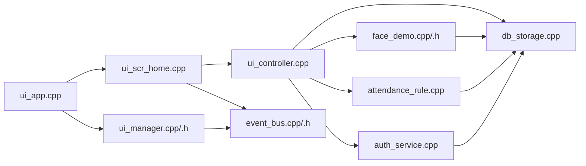

# 核心模块详解

<cite>
**本文档引用的文件**
- [src/main.cpp](file://src/main.cpp)
- [src/ui/ui_app.cpp](file://src/ui/ui_app.cpp)
- [src/ui/ui_controller.cpp](file://src/ui/ui_controller.cpp)
- [src/ui/managers/ui_manager.cpp](file://src/ui/managers/ui_manager.cpp)
- [src/ui/managers/ui_manager.h](file://src/ui/managers/ui_manager.h)
- [src/ui/screens/home/ui_scr_home.cpp](file://src/ui/screens/home/ui_scr_home.cpp)
- [src/ui/common/ui_style.h](file://src/ui/common/ui_style.h)
- [src/ui/common/ui_widgets.h](file://src/ui/common/ui_widgets.h)
- [src/business/face_demo.cpp](file://src/business/face_demo.cpp)
- [src/business/face_demo.h](file://src/business/face_demo.h)
- [src/business/attendance_rule.cpp](file://src/business/attendance_rule.cpp)
- [src/business/auth_service.cpp](file://src/business/auth_service.cpp)
- [src/business/event_bus.cpp](file://src/business/event_bus.cpp)
- [src/business/event_bus.h](file://src/business/event_bus.h)
- [src/data/db_storage.cpp](file://src/data/db_storage.cpp)
- [lv_conf.h](file://lv_conf.h)
</cite>

## 目录
1. [简介](#简介)
2. [项目结构](#项目结构)
3. [核心组件](#核心组件)
4. [架构总览](#架构总览)
5. [详细组件分析](#详细组件分析)
6. [依赖关系分析](#依赖关系分析)
7. [性能考量](#性能考量)
8. [故障排查指南](#故障排查指南)
9. [结论](#结论)
10. [附录](#附录)

## 简介
本文件面向智能考勤系统核心模块，围绕UI层、业务层与数据层展开，重点解析：
- UI层：LVGL集成方案、屏幕管理机制、控件库使用与事件处理流程
- 业务层：人脸识别引擎架构、认证服务设计、考勤规则计算逻辑
- 数据层：SQLite数据库封装、DAO模式实现、线程安全机制
并提供模块协作关系、数据传递机制、性能优化建议与常见问题解决方案。

## 项目结构
系统采用三层架构：
- UI层：基于LVGL，负责界面渲染、输入设备绑定、屏幕管理与事件分发
- 业务层：封装人脸识别、考勤规则计算、事件总线与后台线程
- 数据层：SQLite封装、DAO接口、事务与并发控制

图表来源
- [src/main.cpp:187-246](file://src/main.cpp#L187-L246)
- [src/ui/ui_app.cpp:34-94](file://src/ui/ui_app.cpp#L34-L94)
- [src/ui/managers/ui_manager.cpp:1-125](file://src/ui/managers/ui_manager.cpp#L1-L125)
- [src/ui/screens/home/ui_scr_home.cpp:1-269](file://src/ui/screens/home/ui_scr_home.cpp#L1-L269)
- [src/business/face_demo.cpp:557-694](file://src/business/face_demo.cpp#L557-L694)
- [src/business/attendance_rule.cpp:263-342](file://src/business/attendance_rule.cpp#L263-L342)
- [src/business/auth_service.cpp:1-90](file://src/business/auth_service.cpp#L1-L90)
- [src/business/event_bus.cpp:1-28](file://src/business/event_bus.cpp#L1-L28)
- [src/ui/ui_controller.cpp:1-680](file://src/ui/ui_controller.cpp#L1-L680)
- [src/data/db_storage.cpp:133-430](file://src/data/db_storage.cpp#L133-L430)

章节来源
- [src/main.cpp:187-246](file://src/main.cpp#L187-L246)
- [src/ui/ui_app.cpp:34-94](file://src/ui/ui_app.cpp#L34-L94)
- [src/ui/managers/ui_manager.cpp:1-125](file://src/ui/managers/ui_manager.cpp#L1-L125)
- [src/ui/screens/home/ui_scr_home.cpp:1-269](file://src/ui/screens/home/ui_scr_home.cpp#L1-L269)
- [src/business/face_demo.cpp:557-694](file://src/business/face_demo.cpp#L557-L694)
- [src/business/attendance_rule.cpp:263-342](file://src/business/attendance_rule.cpp#L263-L342)
- [src/business/auth_service.cpp:1-90](file://src/business/auth_service.cpp#L1-L90)
- [src/business/event_bus.cpp:1-28](file://src/business/event_bus.cpp#L1-L28)
- [src/ui/ui_controller.cpp:1-680](file://src/ui/ui_controller.cpp#L1-L680)
- [src/data/db_storage.cpp:133-430](file://src/data/db_storage.cpp#L133-L430)

## 核心组件
- UI层
  - LVGL集成：使用SDL驱动创建窗口与输入设备，绑定键盘到UI组，实现可聚焦控件导航
  - 屏幕管理：统一注册/销毁屏幕，异步清理避免事件回调期间释放对象
  - 相机缓冲：UIManager提供RGB888帧缓冲与原子帧待更新标记，配合UI控制器同步显示
  - 事件处理：通过事件总线订阅/发布时间、磁盘状态、摄像头帧就绪、屏幕切换等事件
- 业务层
  - 人脸识别：后台线程采集/检测/识别，预处理与ROI增强，异步写库队列
  - 考勤规则：时间容错解析、跨日处理、折中原则归属班次、状态判定与入库
  - 认证服务：密码/指纹验证，返回标准化结果
  - UI控制器：封装数据层与业务层接口，提供报表导出、系统统计、导入设置表等功能
- 数据层
  - SQLite封装：RAII语句封装、预编译语句缓存、WAL模式、外键约束、联合索引
  - DAO模式：部门/班次/用户/考勤记录等CRUD接口，线程安全通过共享锁/写锁实现
  - 并发控制：读写分离锁，数据库写入线程与识别线程解耦

章节来源
- [src/ui/ui_app.cpp:34-94](file://src/ui/ui_app.cpp#L34-L94)
- [src/ui/managers/ui_manager.cpp:1-125](file://src/ui/managers/ui_manager.cpp#L1-L125)
- [src/ui/screens/home/ui_scr_home.cpp:1-269](file://src/ui/screens/home/ui_scr_home.cpp#L1-L269)
- [src/business/face_demo.cpp:246-800](file://src/business/face_demo.cpp#L246-L800)
- [src/business/attendance_rule.cpp:1-342](file://src/business/attendance_rule.cpp#L1-L342)
- [src/business/auth_service.cpp:1-90](file://src/business/auth_service.cpp#L1-L90)
- [src/ui/ui_controller.cpp:1-680](file://src/ui/ui_controller.cpp#L1-L680)
- [src/data/db_storage.cpp:1-800](file://src/data/db_storage.cpp#L1-L800)

## 架构总览
系统主循环负责驱动LVGL心跳，UI层与业务层并行工作，数据层通过DAO接口提供统一访问。事件总线贯穿UI与业务层，实现松耦合通信。

图表来源
- [src/main.cpp:229-238](file://src/main.cpp#L229-L238)
- [src/ui/ui_app.cpp:34-94](file://src/ui/ui_app.cpp#L34-L94)
- [src/ui/managers/ui_manager.cpp:1-125](file://src/ui/managers/ui_manager.cpp#L1-L125)
- [src/ui/screens/home/ui_scr_home.cpp:240-269](file://src/ui/screens/home/ui_scr_home.cpp#L240-L269)
- [src/business/face_demo.cpp:246-800](file://src/business/face_demo.cpp#L246-L800)
- [src/business/attendance_rule.cpp:263-342](file://src/business/attendance_rule.cpp#L263-L342)
- [src/data/db_storage.cpp:1-800](file://src/data/db_storage.cpp#L1-L800)

## 详细组件分析

### UI层设计与实现
- LVGL集成与输入绑定
  - 使用SDL创建窗口与输入设备，键盘绑定到UI组，支持循环导航
  - 屏幕宏定义与分辨率配置，确保控件布局适配
- 屏幕管理机制
  - 注册屏幕指针引用，统一销毁策略，避免重复释放
  - 异步定时器清理非活动屏幕，确保事件回调完成后回收
- 控件库与样式
  - 通用布局容器、表单控件、列表按钮、网格菜单等
  - 主题色板与字体声明，保证视觉一致性
- 事件处理流程
  - 主页按键事件：进入菜单或退出程序
  - 定时器刷新摄像头帧：原子帧待更新标记+UI控制器同步
  - 事件总线：时间更新、磁盘状态、摄像头帧就绪、屏幕切换

图表来源
- [src/ui/screens/home/ui_scr_home.cpp:110-121](file://src/ui/screens/home/ui_scr_home.cpp#L110-L121)
- [src/ui/managers/ui_manager.cpp:88-102](file://src/ui/managers/ui_manager.cpp#L88-L102)
- [src/ui/ui_controller.cpp:212-231](file://src/ui/ui_controller.cpp#L212-L231)
- [src/business/event_bus.cpp:14-28](file://src/business/event_bus.cpp#L14-L28)

章节来源
- [src/ui/ui_app.cpp:34-94](file://src/ui/ui_app.cpp#L34-L94)
- [src/ui/managers/ui_manager.cpp:1-125](file://src/ui/managers/ui_manager.cpp#L1-L125)
- [src/ui/screens/home/ui_scr_home.cpp:1-269](file://src/ui/screens/home/ui_scr_home.cpp#L1-L269)
- [src/ui/common/ui_style.h:1-48](file://src/ui/common/ui_style.h#L1-L48)
- [src/ui/common/ui_widgets.h:1-152](file://src/ui/common/ui_widgets.h#L1-L152)

### 业务层：人脸识别与考勤规则
- 人脸识别引擎
  - 后台采集线程：跳帧检测、跟踪状态、冷却时间、防抖缓存
  - 预处理流水线：裁剪边界、尺寸归一化、直方图均衡化、ROI增强
  - 识别与打卡：预测标签、冷却控制、状态计算、异步写库队列
  - 模型训练：全量训练与本地模型读写
- 考勤规则计算
  - 时间容错解析：去除空格/全角字符、多种分隔符、纯数字格式
  - 跨日处理：AM结束与PM开始跨日修正，凌晨打卡归类
  - 折中原则：模糊时段归属上午/下午
  - 状态判定：正常/迟到/早退/旷工，分钟差记录
  - 防重复打卡：基于规则的重复限制
- 认证服务
  - 密码验证：哈希比对
  - 指纹验证：模板匹配（占位）

图表来源
- [src/business/face_demo.cpp:291-549](file://src/business/face_demo.cpp#L291-L549)
- [src/business/attendance_rule.cpp:148-256](file://src/business/attendance_rule.cpp#L148-L256)

章节来源
- [src/business/face_demo.cpp:1-800](file://src/business/face_demo.cpp#L1-L800)
- [src/business/attendance_rule.cpp:1-342](file://src/business/attendance_rule.cpp#L1-L342)
- [src/business/auth_service.cpp:1-90](file://src/business/auth_service.cpp#L1-L90)

### 数据层：SQLite封装与DAO模式
- 数据库初始化与性能优化
  - WAL模式、同步级别、临时表内存化、缓存大小、外键约束
  - 预编译高频SQL语句，降低开销
- 表结构与索引
  - 部门/班次/用户/考勤记录/部门周排班/用户特定日期排班/响铃计划/系统配置/节假日
  - 联合索引加速查询
- DAO接口与线程安全
  - 读写分离锁：共享锁用于读，独占锁用于写
  - RAII语句封装，避免泄漏
  - 哈希密码接口、播种默认数据、清理过期图片

图表来源
- [src/data/db_storage.cpp:133-430](file://src/data/db_storage.cpp#L133-L430)
- [src/data/db_storage.cpp:42-65](file://src/data/db_storage.cpp#L42-L65)

章节来源
- [src/data/db_storage.cpp:1-800](file://src/data/db_storage.cpp#L1-L800)

### UI控制器：业务适配与系统功能
- 用户与部门管理：查询、新增、更新、删除、密码修改、权限变更
- 考勤记录查询与报表导出：个人/全员/自定义时间段
- 系统统计与设置导入/导出：USB目录模拟、Excel解析/生成
- 摄像头帧同步：UIManager缓冲区与UI控制器拷贝
- 后台服务：监控线程（时间/磁盘）、采集线程（帧率控制）

章节来源
- [src/ui/ui_controller.cpp:1-680](file://src/ui/ui_controller.cpp#L1-L680)

### 事件总线：模块间解耦通信
- 事件类型：时间更新、磁盘状态、摄像头帧就绪、屏幕切换
- 订阅/发布：线程安全回调列表，避免竞态

章节来源
- [src/business/event_bus.h:1-43](file://src/business/event_bus.h#L1-L43)
- [src/business/event_bus.cpp:1-28](file://src/business/event_bus.cpp#L1-L28)

## 依赖关系分析
- UI层依赖
  - LVGL核心、SDL驱动、UI管理器、样式与控件库
  - 通过事件总线与业务层解耦
- 业务层依赖
  - OpenCV人脸识别、SQLite数据层、事件总线
  - 通过UI控制器桥接UI层
- 数据层依赖
  - SQLite3、OpenCV图像编解码

图表来源
- [src/ui/ui_app.cpp:1-94](file://src/ui/ui_app.cpp#L1-L94)
- [src/ui/managers/ui_manager.cpp:1-156](file://src/ui/managers/ui_manager.cpp#L1-L156)
- [src/ui/screens/home/ui_scr_home.cpp:1-269](file://src/ui/screens/home/ui_scr_home.cpp#L1-L269)
- [src/ui/ui_controller.cpp:1-680](file://src/ui/ui_controller.cpp#L1-L680)
- [src/business/face_demo.cpp:1-212](file://src/business/face_demo.cpp#L1-L212)
- [src/business/attendance_rule.cpp:1-342](file://src/business/attendance_rule.cpp#L1-L342)
- [src/business/auth_service.cpp:1-90](file://src/business/auth_service.cpp#L1-L90)
- [src/business/event_bus.cpp:1-28](file://src/business/event_bus.cpp#L1-L28)
- [src/data/db_storage.cpp:1-800](file://src/data/db_storage.cpp#L1-L800)

章节来源
- [src/ui/ui_app.cpp:1-94](file://src/ui/ui_app.cpp#L1-L94)
- [src/ui/managers/ui_manager.h:1-156](file://src/ui/managers/ui_manager.h#L1-L156)
- [src/ui/screens/home/ui_scr_home.cpp:1-269](file://src/ui/screens/home/ui_scr_home.cpp#L1-L269)
- [src/ui/ui_controller.cpp:1-680](file://src/ui/ui_controller.cpp#L1-L680)
- [src/business/face_demo.h:1-212](file://src/business/face_demo.h#L1-L212)
- [src/business/attendance_rule.cpp:1-342](file://src/business/attendance_rule.cpp#L1-L342)
- [src/business/auth_service.cpp:1-90](file://src/business/auth_service.cpp#L1-L90)
- [src/business/event_bus.h:1-43](file://src/business/event_bus.h#L1-L43)
- [src/data/db_storage.cpp:1-800](file://src/data/db_storage.cpp#L1-L800)

## 性能考量
- UI层
  - LVGL默认刷新周期与屏幕刷新频率匹配，避免过度重绘
  - 相机帧缓冲采用原子标记与互斥锁，降低UI线程阻塞
- 业务层
  - 识别线程跳帧检测与跟踪，减少CPU占用
  - 预处理参数可调，平衡质量与性能
  - 异步写库队列，避免主线程阻塞
- 数据层
  - WAL模式提升并发读写性能
  - 预编译语句与共享锁/独占锁分离
  - 联合索引加速查询

## 故障排查指南
- LVGL/SDL相关
  - 确认SDL环境变量与WSLg配置，避免黑屏/无法创建窗口
  - 检查lv_conf.h中SDL相关配置
- 人脸识别
  - 模型文件损坏或缺失：全量训练并保存新模型
  - 摄像头断流：自动重连与强制释放逻辑
  - 识别冷却与重复打卡：检查冷却时间与重复限制
- 数据库
  - 写入失败：检查预编译语句与锁状态
  - 磁盘空间不足：监控线程发布磁盘状态事件，UI显示警告
- UI崩溃
  - 屏幕销毁时机：使用异步定时器清理，避免回调期间释放

章节来源
- [src/ui/ui_app.cpp:34-94](file://src/ui/ui_app.cpp#L34-L94)
- [src/business/face_demo.cpp:312-549](file://src/business/face_demo.cpp#L312-L549)
- [src/business/event_bus.cpp:14-28](file://src/business/event_bus.cpp#L14-L28)
- [src/data/db_storage.cpp:415-430](file://src/data/db_storage.cpp#L415-L430)

## 结论
本系统通过清晰的三层架构与事件总线实现模块解耦，UI层以LVGL高效渲染，业务层以OpenCV与SQLite实现人脸识别与考勤规则计算，数据层提供线程安全的DAO封装。整体设计兼顾实时性与稳定性，具备良好的扩展性与维护性。

## 附录
- LVGL配置要点
  - 颜色深度、默认刷新周期、SDL驱动启用
  - 字体与控件启用情况
- API与接口
  - 业务层：business_init/business_get_display_frame/business_register_user等
  - 数据层：db_add_user/db_get_user_info/db_log_attendance等
  - UI控制器：UiController单例与各类业务适配接口

章节来源
- [lv_conf.h:1-800](file://lv_conf.h#L1-L800)
- [src/business/face_demo.h:34-212](file://src/business/face_demo.h#L34-L212)
- [src/data/db_storage.cpp:773-800](file://src/data/db_storage.cpp#L773-L800)
- [src/ui/ui_controller.cpp:1-680](file://src/ui/ui_controller.cpp#L1-L680)