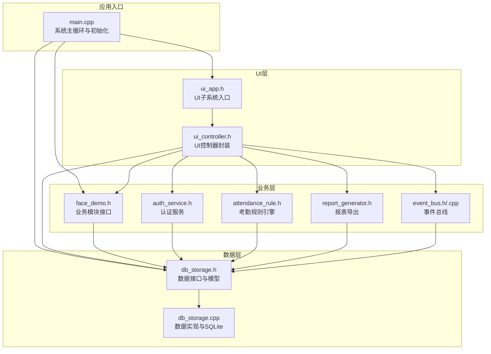
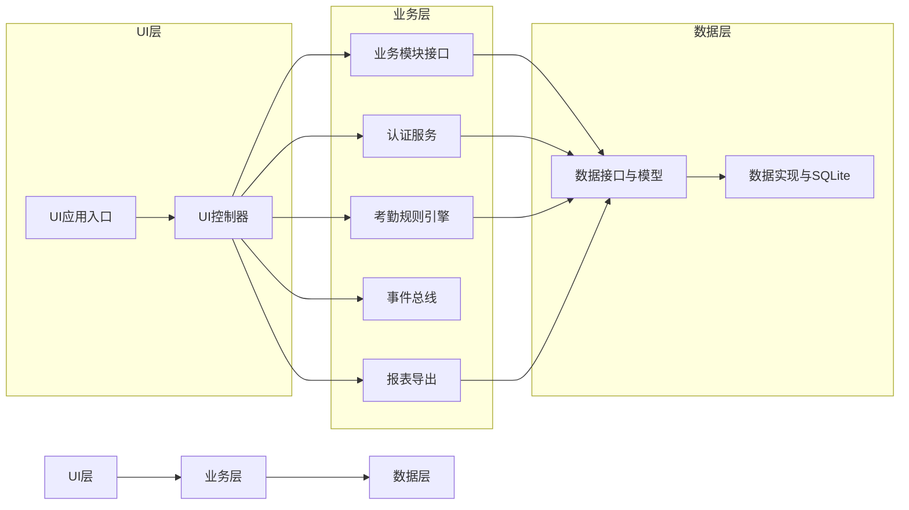
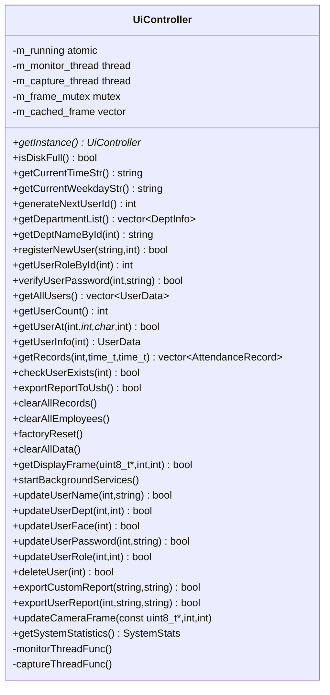
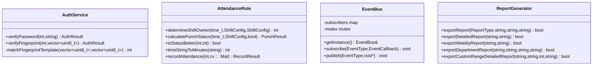
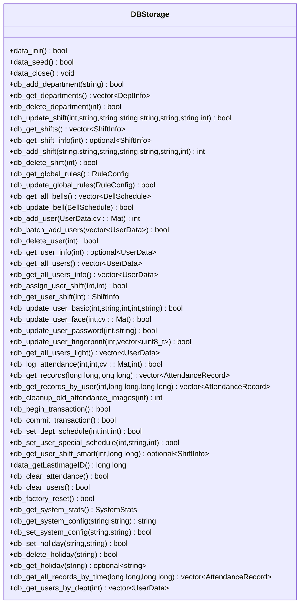
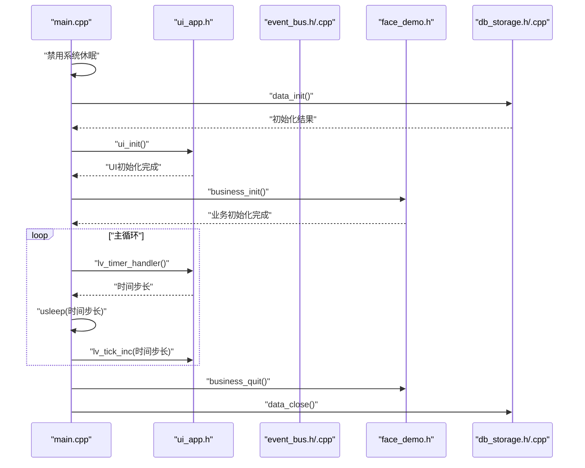
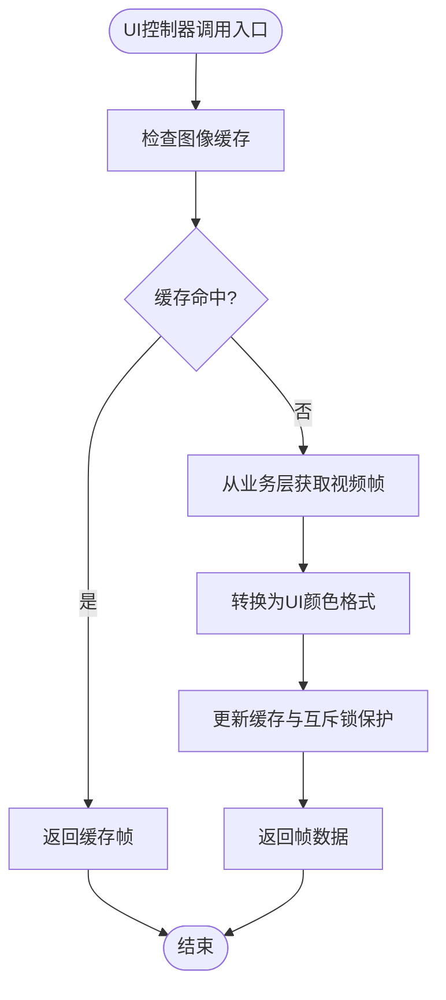
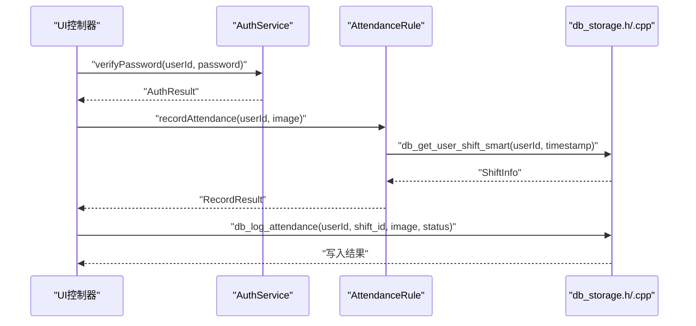
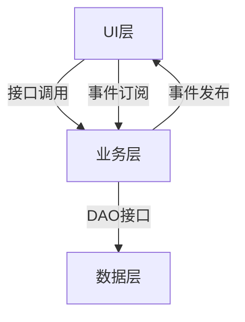

# 三层架构设计

<cite>
**本文引用的文件**
- [src/main.cpp](file://src/main.cpp)
- [src/ui/ui_app.h](file://src/ui/ui_app.h)
- [src/ui/ui_controller.h](file://src/ui/ui_controller.h)
- [src/business/face_demo.h](file://src/business/face_demo.h)
- [src/business/auth_service.h](file://src/business/auth_service.h)
- [src/business/attendance_rule.h](file://src/business/attendance_rule.h)
- [src/business/event_bus.h](file://src/business/event_bus.h)
- [src/business/event_bus.cpp](file://src/business/event_bus.cpp)
- [src/business/report_generator.h](file://src/business/report_generator.h)
- [src/data/db_storage.h](file://src/data/db_storage.h)
- [src/data/db_storage.cpp](file://src/data/db_storage.cpp)
</cite>

## 目录
1. [简介](#简介)
2. [项目结构](#项目结构)
3. [核心组件](#核心组件)
4. [架构总览](#架构总览)
5. [详细组件分析](#详细组件分析)
6. [依赖分析](#依赖分析)
7. [性能考量](#性能考量)
8. [故障排查指南](#故障排查指南)
9. [结论](#结论)
10. [附录](#附录)

## 简介
本文件面向SmartAttendance系统，基于其现有代码实现，系统化阐述三层架构（UI层、业务层、数据层）的职责划分、边界定义、交互机制与控制流。文档通过架构图、类图与序列图，直观展示层间通信协议与数据传递方式，并总结分层架构的优势、权衡与扩展性设计要点。同时提供可追溯的代码示例路径，帮助读者定位到具体实现位置。

## 项目结构
SmartAttendance采用清晰的分层组织：
- UI层：负责用户界面初始化、事件驱动与显示更新，典型入口为UI应用初始化函数与控制器封装。
- 业务层：封装业务规则、认证、考勤计算、事件总线与报表导出等核心业务逻辑。
- 数据层：封装数据库连接、表结构、CRUD与事务接口，提供稳定的持久化能力。

图表来源
- [src/main.cpp:187-246](file://src/main.cpp#L187-L246)
- [src/ui/ui_app.h:12](file://src/ui/ui_app.h#L12)
- [src/ui/ui_controller.h:21-106](file://src/ui/ui_controller.h#L21-L106)
- [src/business/face_demo.h:40](file://src/business/face_demo.h#L40)
- [src/business/auth_service.h:23](file://src/business/auth_service.h#L23)
- [src/business/attendance_rule.h:43](file://src/business/attendance_rule.h#L43)
- [src/business/event_bus.h:21](file://src/business/event_bus.h#L21)
- [src/business/report_generator.h:33](file://src/business/report_generator.h#L33)
- [src/data/db_storage.h:195](file://src/data/db_storage.h#L195)
- [src/data/db_storage.cpp:108](file://src/data/db_storage.cpp#L108)

章节来源
- [src/main.cpp:187-246](file://src/main.cpp#L187-L246)
- [src/ui/ui_app.h:12](file://src/ui/ui_app.h#L12)
- [src/ui/ui_controller.h:21-106](file://src/ui/ui_controller.h#L21-L106)
- [src/business/face_demo.h:40](file://src/business/face_demo.h#L40)
- [src/business/auth_service.h:23](file://src/business/auth_service.h#L23)
- [src/business/attendance_rule.h:43](file://src/business/attendance_rule.h#L43)
- [src/business/event_bus.h:21](file://src/business/event_bus.h#L21)
- [src/business/report_generator.h:33](file://src/business/report_generator.h#L33)
- [src/data/db_storage.h:195](file://src/data/db_storage.h#L195)
- [src/data/db_storage.cpp:108](file://src/data/db_storage.cpp#L108)

## 核心组件
- UI层
  - UI应用入口：负责HAL初始化、输入设备配置、管理器启动与主页加载。
  - UI控制器：封装UI所需的业务调用，提供单例访问点，包含系统状态、员工管理、记录查询、维护与报表、摄像头图像获取等接口。
- 业务层
  - 业务模块接口：提供人脸预处理、视频帧获取、用户注册与更新、考勤记录查询等接口。
  - 认证服务：提供密码与指纹验证，返回标准化结果枚举。
  - 考勤规则引擎：根据排班与时间计算打卡状态，输出语义化记录结果。
  - 事件总线：提供线程安全的发布/订阅机制，支持时间更新、磁盘状态、摄像头帧就绪等事件。
  - 报表导出：支持汇总、异常、员工信息、周报、部门报表等类型导出。
- 数据层
  - 数据接口与模型：定义部门、班次、用户、考勤记录、系统配置等数据结构与DAO接口。
  - 数据实现：封装SQLite连接、表结构创建/升级、事务、文件系统操作与线程安全。

章节来源
- [src/ui/ui_app.h:12](file://src/ui/ui_app.h#L12)
- [src/ui/ui_controller.h:21-106](file://src/ui/ui_controller.h#L21-L106)
- [src/business/face_demo.h:40](file://src/business/face_demo.h#L40)
- [src/business/auth_service.h:23](file://src/business/auth_service.h#L23)
- [src/business/attendance_rule.h:43](file://src/business/attendance_rule.h#L43)
- [src/business/event_bus.h:21](file://src/business/event_bus.h#L21)
- [src/business/report_generator.h:33](file://src/business/report_generator.h#L33)
- [src/data/db_storage.h:195](file://src/data/db_storage.h#L195)
- [src/data/db_storage.cpp:108](file://src/data/db_storage.cpp#L108)

## 架构总览
三层架构通过清晰的职责边界与接口契约实现解耦：
- UI层仅依赖业务层提供的受控接口，不直接访问数据层。
- 业务层聚合数据层与第三方库（OpenCV、SQLite），封装领域规则。
- 数据层专注于持久化与资源管理，提供稳定的数据访问与事务保障。

图表来源
- [src/ui/ui_app.h:12](file://src/ui/ui_app.h#L12)
- [src/ui/ui_controller.h:21-106](file://src/ui/ui_controller.h#L21-L106)
- [src/business/face_demo.h:40](file://src/business/face_demo.h#L40)
- [src/business/auth_service.h:23](file://src/business/auth_service.h#L23)
- [src/business/attendance_rule.h:43](file://src/business/attendance_rule.h#L43)
- [src/business/event_bus.h:21](file://src/business/event_bus.h#L21)
- [src/business/report_generator.h:33](file://src/business/report_generator.h#L33)
- [src/data/db_storage.h:195](file://src/data/db_storage.h#L195)
- [src/data/db_storage.cpp:108](file://src/data/db_storage.cpp#L108)

## 详细组件分析

### UI层组件分析
- UI应用入口
  - 职责：完成HAL初始化、输入设备配置、管理器启动与主页加载。
  - 交互：被主程序调用，随后驱动UI主循环。
- UI控制器
  - 职责：封装业务调用、系统状态查询、员工管理、记录查询、维护与报表、摄像头帧获取与更新。
  - 设计：单例模式提供全局访问点；内部包含监控与捕获线程，使用互斥锁保护图像缓存。
  - 依赖：依赖数据层结构体与业务层接口。

图表来源
- [src/ui/ui_controller.h:21-106](file://src/ui/ui_controller.h#L21-L106)

章节来源
- [src/ui/ui_app.h:12](file://src/ui/ui_app.h#L12)
- [src/ui/ui_controller.h:21-106](file://src/ui/ui_controller.h#L21-L106)

### 业务层组件分析
- 业务模块接口
  - 职责：提供人脸预处理配置、视频帧获取、用户注册与更新、考勤记录查询等接口。
  - 设计：C/C++混合接口，便于UI层调用；包含预处理配置结构体与枚举。
- 认证服务
  - 职责：提供密码与指纹验证，返回标准化结果枚举。
  - 设计：静态方法封装，便于直接调用。
- 考勤规则引擎
  - 职责：根据排班与时间计算打卡状态，输出语义化记录结果。
  - 设计：静态方法封装，严格遵循规则流程。
- 事件总线
  - 职责：提供线程安全的发布/订阅机制，支持多种事件类型。
  - 设计：单例、互斥锁保护订阅者列表，发布时复制回调列表避免死锁。
- 报表导出
  - 职责：支持多种报表类型的导出，封装Excel写入细节。
  - 设计：面向报表类型的抽象，内部处理数据聚合与样式。

图表来源
- [src/business/auth_service.h:23](file://src/business/auth_service.h#L23)
- [src/business/attendance_rule.h:43](file://src/business/attendance_rule.h#L43)
- [src/business/event_bus.h:21](file://src/business/event_bus.h#L21)
- [src/business/report_generator.h:33](file://src/business/report_generator.h#L33)

章节来源
- [src/business/face_demo.h:40](file://src/business/face_demo.h#L40)
- [src/business/auth_service.h:23](file://src/business/auth_service.h#L23)
- [src/business/attendance_rule.h:43](file://src/business/attendance_rule.h#L43)
- [src/business/event_bus.h:21](file://src/business/event_bus.h#L21)
- [src/business/event_bus.cpp:1-28](file://src/business/event_bus.cpp#L1-L28)
- [src/business/report_generator.h:33](file://src/business/report_generator.h#L33)

### 数据层组件分析
- 数据接口与模型
  - 职责：定义部门、班次、用户、考勤记录、系统配置等数据结构与DAO接口。
  - 设计：提供完整的CRUD与事务接口，支持批量导入、排班管理、节假日管理与报表辅助查询。
- 数据实现
  - 职责：封装SQLite连接、表结构创建/升级、事务、文件系统操作与线程安全。
  - 设计：使用RAII封装stmt生命周期，读写锁分离提升并发性能，WAL模式优化读写并发。

图表来源
- [src/data/db_storage.h:195](file://src/data/db_storage.h#L195)

章节来源
- [src/data/db_storage.h:195](file://src/data/db_storage.h#L195)
- [src/data/db_storage.cpp:108](file://src/data/db_storage.cpp#L108)

### 层间交互与控制流

#### 主程序启动与初始化序列
主程序负责系统初始化顺序与主循环驱动，确保UI层先于业务层初始化，以便业务层线程发出的事件能被UI订阅。

图表来源
- [src/main.cpp:187-246](file://src/main.cpp#L187-L246)
- [src/ui/ui_app.h:12](file://src/ui/ui_app.h#L12)
- [src/business/event_bus.h:21](file://src/business/event_bus.h#L21)
- [src/business/event_bus.cpp:1-28](file://src/business/event_bus.cpp#L1-L28)
- [src/business/face_demo.h:40](file://src/business/face_demo.h#L40)
- [src/data/db_storage.h:195](file://src/data/db_storage.h#L195)
- [src/data/db_storage.cpp:108](file://src/data/db_storage.cpp#L108)

章节来源
- [src/main.cpp:187-246](file://src/main.cpp#L187-L246)

#### UI控制器与业务/数据层交互流程
UI控制器作为UI层与业务/数据层的适配器，封装复杂调用并提供线程安全的图像缓存与后台服务。

图表来源
- [src/ui/ui_controller.h:61](file://src/ui/ui_controller.h#L61)
- [src/business/face_demo.h:99](file://src/business/face_demo.h#L99)

章节来源
- [src/ui/ui_controller.h:61](file://src/ui/ui_controller.h#L61)
- [src/business/face_demo.h:99](file://src/business/face_demo.h#L99)

#### 认证与考勤记录流程
认证成功后，业务层调用考勤规则引擎进行状态计算，并最终写入数据层。

图表来源
- [src/business/auth_service.h:31](file://src/business/auth_service.h#L31)
- [src/business/attendance_rule.h:87](file://src/business/attendance_rule.h#L87)
- [src/data/db_storage.h:432](file://src/data/db_storage.h#L432)

章节来源
- [src/business/auth_service.h:31](file://src/business/auth_service.h#L31)
- [src/business/attendance_rule.h:87](file://src/business/attendance_rule.h#L87)
- [src/data/db_storage.h:432](file://src/data/db_storage.h#L432)

## 依赖分析
- 组件耦合与内聚
  - UI层与业务层通过受控接口耦合，内聚于UI展示与交互。
  - 业务层与数据层通过DAO接口耦合，内聚于业务规则与数据访问。
  - 事件总线降低UI与业务层之间的直接耦合，提高扩展性。
- 外部依赖与集成点
  - UI层依赖LVGL与SDL；业务层依赖OpenCV；数据层依赖SQLite与文件系统。
- 潜在循环依赖
  - 当前结构未发现循环依赖；UI控制器依赖业务与数据接口，业务层依赖数据接口，符合单向依赖。

图表来源
- [src/ui/ui_controller.h:21-106](file://src/ui/ui_controller.h#L21-L106)
- [src/business/event_bus.h:21](file://src/business/event_bus.h#L21)
- [src/business/event_bus.cpp:1-28](file://src/business/event_bus.cpp#L1-L28)
- [src/data/db_storage.h:195](file://src/data/db_storage.h#L195)

章节来源
- [src/ui/ui_controller.h:21-106](file://src/ui/ui_controller.h#L21-L106)
- [src/business/event_bus.h:21](file://src/business/event_bus.h#L21)
- [src/business/event_bus.cpp:1-28](file://src/business/event_bus.cpp#L1-L28)
- [src/data/db_storage.h:195](file://src/data/db_storage.h#L195)

## 性能考量
- 数据层并发与事务
  - 使用读写锁分离读写操作，WAL模式提升并发性能；预编译语句与RAII封装stmt生命周期，减少资源泄漏风险。
  - 事务接口用于批量导入/更新，显著提升吞吐量。
- UI层主循环
  - 通过LVGL心跳与tick驱动，限制最小/最大休眠时间，平衡响应速度与CPU占用。
- 业务层图像处理
  - 预处理配置与线程安全的图像缓存，减少UI渲染开销；摄像头捕获线程与监控线程分离，避免阻塞UI。

章节来源
- [src/data/db_storage.cpp:35](file://src/data/db_storage.cpp#L35)
- [src/data/db_storage.cpp:42-65](file://src/data/db_storage.cpp#L42-L65)
- [src/main.cpp:229-238](file://src/main.cpp#L229-L238)
- [src/ui/ui_controller.h:93-104](file://src/ui/ui_controller.h#L93-L104)

## 故障排查指南
- 数据库初始化失败
  - 现象：data_init返回false。
  - 排查：检查数据库文件权限、存储目录创建、SQLite版本与PRAGMA设置。
  - 参考路径：[src/data/db_storage.cpp:108-135](file://src/data/db_storage.cpp#L108-L135)
- UI初始化异常
  - 现象：UI层初始化失败或主循环无响应。
  - 排查：确认ui_init调用顺序、LVGL心跳与tick驱动是否正常。
  - 参考路径：[src/ui/ui_app.h:12](file://src/ui/ui_app.h#L12)，[src/main.cpp:229-238](file://src/main.cpp#L229-L238)
- 业务层线程问题
  - 现象：摄像头无帧或事件未触发。
  - 排查：检查startBackgroundServices调用、线程启动与互斥锁保护。
  - 参考路径：[src/ui/ui_controller.h:63](file://src/ui/ui_controller.h#L63)，[src/ui/ui_controller.h:93-104](file://src/ui/ui_controller.h#L93-L104)
- 认证与考勤失败
  - 现象：认证失败或考勤记录未写入。
  - 排查：核对AuthResult与RecordResult，检查db_log_attendance返回值。
  - 参考路径：[src/business/auth_service.h:31](file://src/business/auth_service.h#L31)，[src/business/attendance_rule.h:87](file://src/business/attendance_rule.h#L87)，[src/data/db_storage.h:432](file://src/data/db_storage.h#L432)

章节来源
- [src/data/db_storage.cpp:108-135](file://src/data/db_storage.cpp#L108-L135)
- [src/ui/ui_app.h:12](file://src/ui/ui_app.h#L12)
- [src/main.cpp:229-238](file://src/main.cpp#L229-L238)
- [src/ui/ui_controller.h:63](file://src/ui/ui_controller.h#L63)
- [src/ui/ui_controller.h:93-104](file://src/ui/ui_controller.h#L93-L104)
- [src/business/auth_service.h:31](file://src/business/auth_service.h#L31)
- [src/business/attendance_rule.h:87](file://src/business/attendance_rule.h#L87)
- [src/data/db_storage.h:432](file://src/data/db_storage.h#L432)

## 结论
SmartAttendance的三层架构通过清晰的职责划分与接口契约实现了良好的解耦与扩展性。UI层专注展示与交互，业务层封装领域规则与第三方库，数据层提供稳定持久化。事件总线进一步降低了层间耦合，提升了系统可维护性。建议在后续迭代中继续强化接口稳定性、完善异常处理与日志体系，并持续评估性能瓶颈与并发策略。

## 附录
- 代码示例路径（不含具体代码内容）
  - UI应用入口初始化：[src/ui/ui_app.h:12](file://src/ui/ui_app.h#L12)
  - UI控制器接口集合：[src/ui/ui_controller.h:21-106](file://src/ui/ui_controller.h#L21-L106)
  - 业务模块初始化与接口：[src/business/face_demo.h:40](file://src/business/face_demo.h#L40)
  - 认证服务接口：[src/business/auth_service.h:31](file://src/business/auth_service.h#L31)
  - 考勤规则引擎核心方法：[src/business/attendance_rule.h:87](file://src/business/attendance_rule.h#L87)
  - 事件总线单例与发布/订阅：[src/business/event_bus.h:21](file://src/business/event_bus.h#L21)，[src/business/event_bus.cpp:1-28](file://src/business/event_bus.cpp#L1-L28)
  - 数据层初始化与DAO接口：[src/data/db_storage.h:195](file://src/data/db_storage.h#L195)，[src/data/db_storage.cpp:108](file://src/data/db_storage.cpp#L108)
  - 主程序初始化与主循环：[src/main.cpp:187-246](file://src/main.cpp#L187-L246)