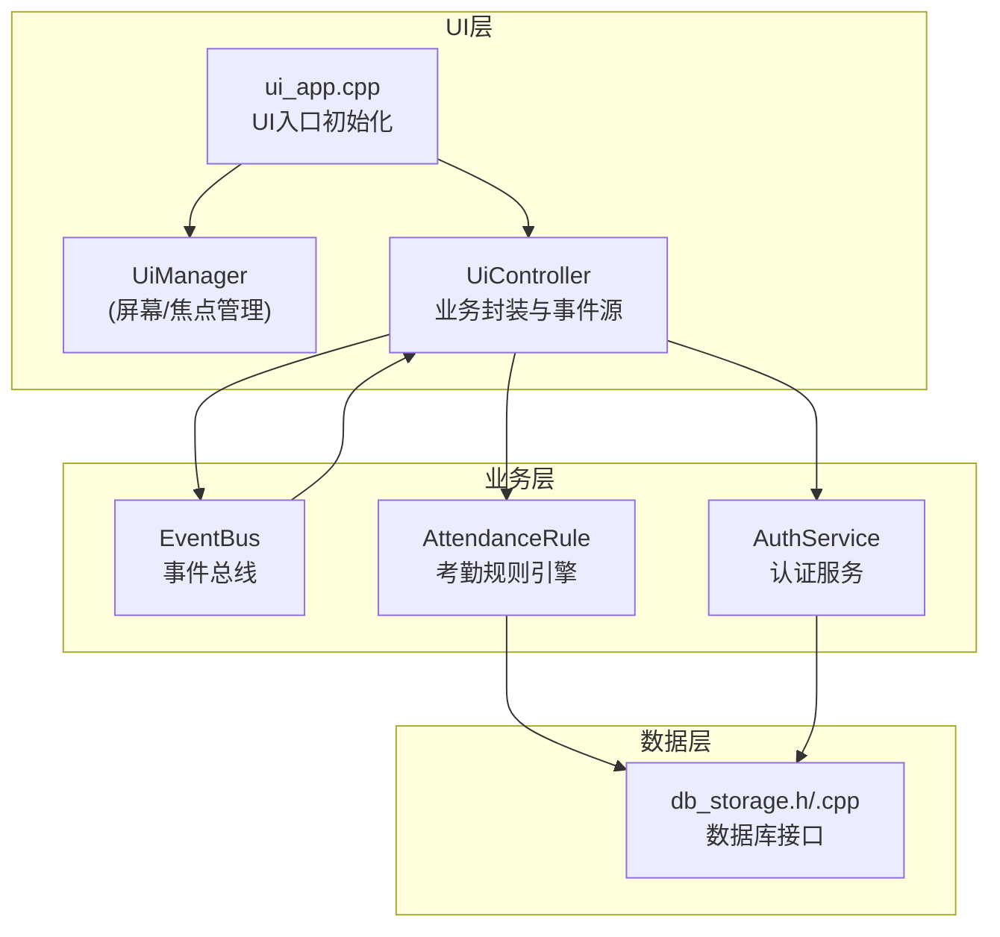
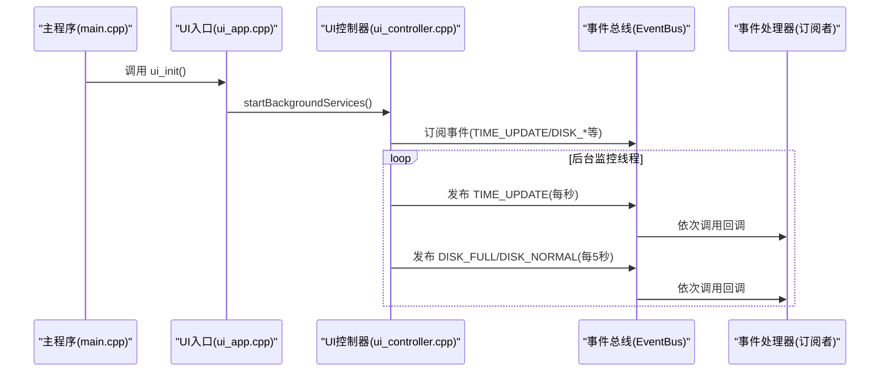
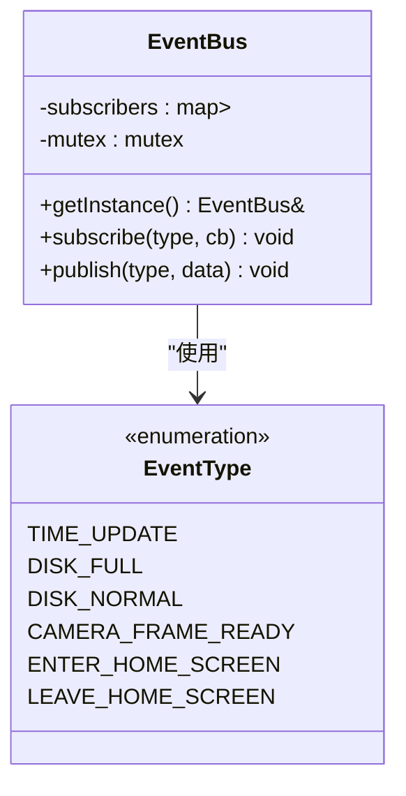
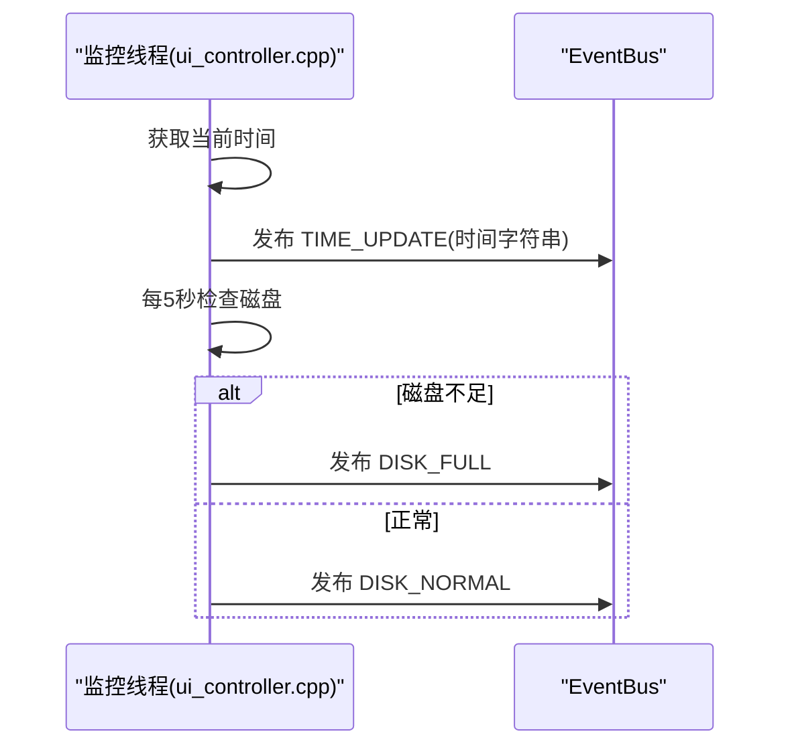
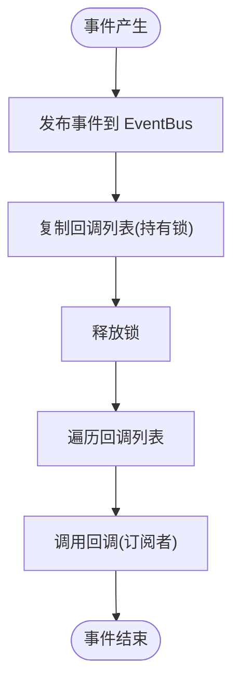
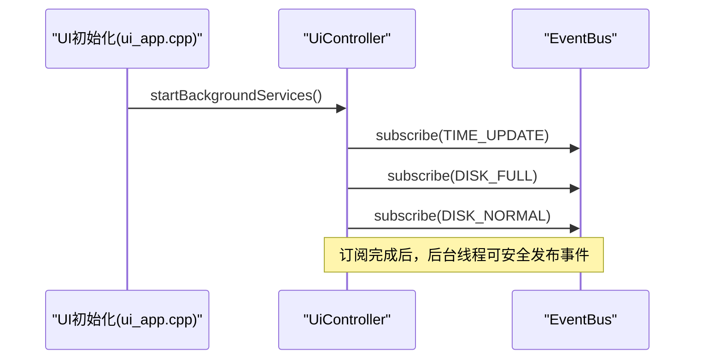
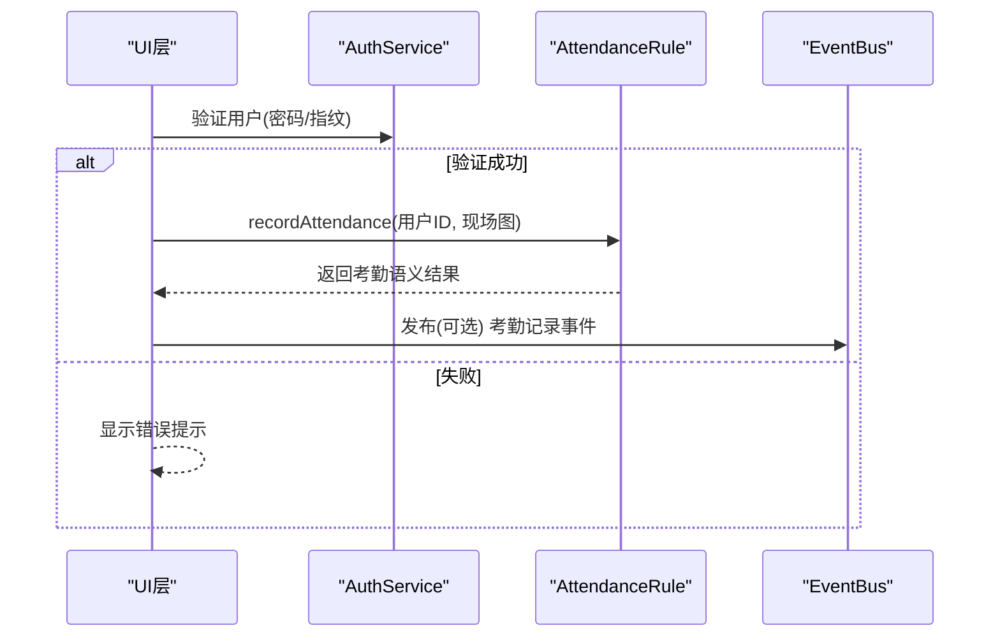
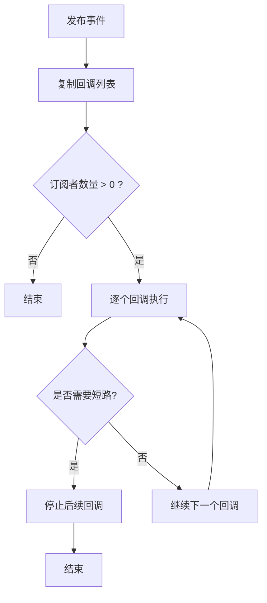
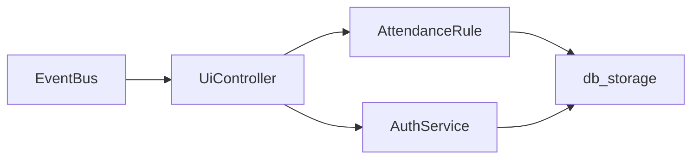

# 事件驱动机制

<cite>
**本文档引用的文件**
- [event_bus.h](file://src/business/event_bus.h)
- [event_bus.cpp](file://src/business/event_bus.cpp)
- [ui_controller.h](file://src/ui/ui_controller.h)
- [ui_controller.cpp](file://src/ui/ui_controller.cpp)
- [main.cpp](file://src/main.cpp)
- [ui_app.h](file://src/ui/ui_app.h)
- [ui_app.cpp](file://src/ui/ui_app.cpp)
- [attendance_rule.h](file://src/business/attendance_rule.h)
- [attendance_rule.cpp](file://src/business/attendance_rule.cpp)
- [auth_service.h](file://src/business/auth_service.h)
- [auth_service.cpp](file://src/business/auth_service.cpp)
</cite>

## 目录
1. [简介](#简介)
2. [项目结构](#项目结构)
3. [核心组件](#核心组件)
4. [架构总览](#架构总览)
5. [详细组件分析](#详细组件分析)
6. [依赖关系分析](#依赖关系分析)
7. [性能考虑](#性能考虑)
8. [故障排查指南](#故障排查指南)
9. [结论](#结论)
10. [附录](#附录)

## 简介
本文件围绕智能考勤系统的事件驱动机制展开，重点阐述 EventBus 事件总线的设计与实现，解释事件的发布、订阅、处理流程与生命周期管理，说明组件间松耦合通信的理念与实践，并给出事件类型定义、处理器注册机制、异步事件处理模式及典型事件处理示例（用户操作事件、系统状态变更事件、业务逻辑事件）。同时，文档涵盖事件优先级、事件过滤与事件传播机制的实现要点与扩展方向。

## 项目结构
智能考勤系统采用分层架构：UI 层负责展示与交互，业务层封装业务规则与流程，数据层负责持久化与查询。EventBus 作为跨层通信中枢，连接 UI 与业务/数据层，支撑系统状态与业务事件的解耦传递。

**图表来源**
- [ui_app.cpp:34-94](file://src/ui/ui_app.cpp#L34-L94)
- [ui_controller.cpp:380-410](file://src/ui/ui_controller.cpp#L380-L410)
- [event_bus.h:23-41](file://src/business/event_bus.h#L23-L41)
- [attendance_rule.cpp:263-342](file://src/business/attendance_rule.cpp#L263-L342)
- [auth_service.cpp:9-37](file://src/business/auth_service.cpp#L9-L37)

**章节来源**
- [ui_app.cpp:34-94](file://src/ui/ui_app.cpp#L34-L94)
- [ui_controller.cpp:380-410](file://src/ui/ui_controller.cpp#L380-L410)
- [event_bus.h:10-41](file://src/business/event_bus.h#L10-L41)

## 核心组件
- 事件总线 EventBus：提供线程安全的事件订阅与发布能力，支持多处理器回调链式调用。
- 事件类型 EventType：定义系统事件集合，包括时间更新、磁盘状态、摄像头帧就绪、页面切换等。
- UI 控制器 UiController：作为事件源与业务封装器，负责启动后台线程并发布系统状态事件；同时封装业务接口供 UI 使用。
- 业务规则引擎 AttendanceRule：封装考勤计算与记录流程，可作为事件处理器的消费者之一。
- 认证服务 AuthService：提供身份验证能力，可与事件总线配合触发认证结果事件（扩展点）。

**章节来源**
- [event_bus.h:10-41](file://src/business/event_bus.h#L10-L41)
- [event_bus.cpp:8-28](file://src/business/event_bus.cpp#L8-L28)
- [ui_controller.h:21-108](file://src/ui/ui_controller.h#L21-L108)
- [ui_controller.cpp:380-410](file://src/ui/ui_controller.cpp#L380-L410)
- [attendance_rule.h:43-89](file://src/business/attendance_rule.h#L43-L89)
- [auth_service.h:23-44](file://src/business/auth_service.h#L23-L44)

## 架构总览
EventBus 采用单例模式，内部维护事件类型到回调列表的映射，并通过互斥锁保证线程安全。UI 控制器在后台线程中周期性发布系统状态事件（如每秒时间更新、每5秒磁盘状态），业务层与 UI 层分别订阅感兴趣事件，实现解耦协作。

**图表来源**
- [main.cpp:213-225](file://src/main.cpp#L213-L225)
- [ui_app.cpp:86-92](file://src/ui/ui_app.cpp#L86-L92)
- [ui_controller.cpp:380-410](file://src/ui/ui_controller.cpp#L380-L410)
- [event_bus.cpp:14-28](file://src/business/event_bus.cpp#L14-L28)

**章节来源**
- [main.cpp:213-225](file://src/main.cpp#L213-L225)
- [ui_app.cpp:86-92](file://src/ui/ui_app.cpp#L86-L92)
- [ui_controller.cpp:380-410](file://src/ui/ui_controller.cpp#L380-L410)
- [event_bus.cpp:14-28](file://src/business/event_bus.cpp#L14-L28)

## 详细组件分析

### 事件总线 EventBus 设计与实现
- 单例模式：getInstance 提供全局唯一实例，避免重复创建。
- 订阅机制：subscribe 将回调函数追加到对应事件类型的回调列表。
- 发布机制：publish 复制回调列表并在释放锁后逐一调用，避免死锁与竞态条件。
- 线程安全：使用互斥锁保护订阅者列表与发布过程，确保并发安全。

**图表来源**
- [event_bus.h:23-41](file://src/business/event_bus.h#L23-L41)
- [event_bus.cpp:3-6](file://src/business/event_bus.cpp#L3-L6)

**章节来源**
- [event_bus.h:23-41](file://src/business/event_bus.h#L23-L41)
- [event_bus.cpp:8-28](file://src/business/event_bus.cpp#L8-L28)

### UI 控制器作为事件源与业务封装
- 启动后台服务：startBackgroundServices 启动监控线程与摄像头采集线程。
- 监控线程：每秒发布 TIME_UPDATE；每5秒检查磁盘状态并发布 DISK_FULL 或 DISK_NORMAL。
- 摄像头线程：周期性从业务层获取帧数据并推送至 UI 管理器。
- 业务封装：提供用户管理、报表导出、系统统计等接口，屏蔽底层细节。

**图表来源**
- [ui_controller.cpp:394-410](file://src/ui/ui_controller.cpp#L394-L410)
- [event_bus.cpp:14-28](file://src/business/event_bus.cpp#L14-L28)

**章节来源**
- [ui_controller.cpp:380-410](file://src/ui/ui_controller.cpp#L380-L410)

### 事件类型定义与生命周期
- 事件类型：包含系统时间更新、磁盘状态、摄像头帧就绪、页面进入/离开等。
- 生命周期：事件在发布端产生，在订阅端消费；发布后即结束，不持久化。
- 数据传递：事件数据以 void* 传递，订阅端需按约定类型解析（如时间字符串）。

**图表来源**
- [event_bus.cpp:14-28](file://src/business/event_bus.cpp#L14-L28)

**章节来源**
- [event_bus.h:10-18](file://src/business/event_bus.h#L10-L18)
- [event_bus.cpp:14-28](file://src/business/event_bus.cpp#L14-L28)

### 事件处理器注册机制与异步处理
- 注册：UI 层在 UI 初始化后订阅事件，确保后台线程发出的首个事件能被及时处理。
- 异步：监控线程与采集线程独立运行，事件发布与处理解耦，避免阻塞 UI 主循环。
- 并发：EventBus 使用互斥锁保护订阅者列表，发布时复制回调列表，降低锁持有时间。

**图表来源**
- [ui_app.cpp:86-92](file://src/ui/ui_app.cpp#L86-L92)
- [ui_controller.cpp:380-391](file://src/ui/ui_controller.cpp#L380-L391)
- [event_bus.cpp:8-12](file://src/business/event_bus.cpp#L8-L12)

**章节来源**
- [ui_app.cpp:86-92](file://src/ui/ui_app.cpp#L86-L92)
- [ui_controller.cpp:380-391](file://src/ui/ui_controller.cpp#L380-L391)
- [event_bus.cpp:8-12](file://src/business/event_bus.cpp#L8-L12)

### 业务逻辑事件示例：考勤记录与认证
- 考勤记录：认证成功后，UI 层调用业务层记录考勤，业务层内部可发布与考勤相关的事件（扩展点）。
- 认证服务：提供密码与指纹验证，可扩展为发布认证结果事件，供 UI 层提示与后续流程联动。

**图表来源**
- [auth_service.cpp:9-37](file://src/business/auth_service.cpp#L9-L37)
- [attendance_rule.cpp:263-342](file://src/business/attendance_rule.cpp#L263-L342)
- [event_bus.cpp:14-28](file://src/business/event_bus.cpp#L14-L28)

**章节来源**
- [auth_service.h:23-44](file://src/business/auth_service.h#L23-L44)
- [auth_service.cpp:9-37](file://src/business/auth_service.cpp#L9-L37)
- [attendance_rule.h:43-89](file://src/business/attendance_rule.h#L43-L89)
- [attendance_rule.cpp:263-342](file://src/business/attendance_rule.cpp#L263-L342)

### 事件优先级、过滤与传播机制
- 优先级：当前实现未内置事件优先级；可通过在订阅时插入顺序或引入优先级参数扩展。
- 过滤：可在订阅回调中基于事件数据进行条件过滤，避免无效处理。
- 传播：EventBus 采用广播式传播，所有订阅者均会被调用；若需短路传播，可在回调内部自行控制。

**图表来源**
- [event_bus.cpp:14-28](file://src/business/event_bus.cpp#L14-L28)

**章节来源**
- [event_bus.cpp:14-28](file://src/business/event_bus.cpp#L14-L28)

## 依赖关系分析
EventBus 作为跨层通信枢纽，被 UI 控制器依赖；UI 控制器进一步依赖业务层与数据层；业务层内部可扩展为事件处理器的消费者。整体依赖清晰，符合分层架构要求。

**图表来源**
- [event_bus.h:23-41](file://src/business/event_bus.h#L23-L41)
- [ui_controller.cpp:12-14](file://src/ui/ui_controller.cpp#L12-L14)
- [attendance_rule.cpp:2-6](file://src/business/attendance_rule.cpp#L2-L6)
- [auth_service.cpp](file://src/business/auth_service.cpp#L2)

**章节来源**
- [event_bus.h:23-41](file://src/business/event_bus.h#L23-L41)
- [ui_controller.cpp:12-14](file://src/ui/ui_controller.cpp#L12-L14)
- [attendance_rule.cpp:2-6](file://src/business/attendance_rule.cpp#L2-L6)
- [auth_service.cpp](file://src/business/auth_service.cpp#L2)

## 性能考虑
- 发布路径优化：发布时复制回调列表并在解锁后调用，减少锁持有时间，提升并发吞吐。
- 线程分离：监控与采集线程独立运行，避免阻塞 UI 主循环。
- 数据传递：事件数据以 void* 传递，建议约定固定类型与生命周期，避免额外拷贝与内存泄漏。
- 扩展建议：对于高频事件（如摄像头帧），可考虑批处理或丢弃策略，避免 UI 压力过大。

## 故障排查指南
- 事件未到达：确认订阅发生在后台线程启动之前；检查订阅回调是否正确注册。
- 线程安全问题：确保回调内部不访问共享资源或使用互斥锁；避免在回调中长时间阻塞。
- 数据类型不匹配：核对事件数据类型与订阅端解析逻辑，避免崩溃或异常行为。
- 性能瓶颈：监控回调执行耗时，必要时拆分任务或引入异步处理。

**章节来源**
- [event_bus.cpp:8-28](file://src/business/event_bus.cpp#L8-L28)
- [ui_controller.cpp:380-410](file://src/ui/ui_controller.cpp#L380-L410)

## 结论
EventBus 为智能考勤系统提供了简洁高效的事件驱动基础设施，实现了 UI 与业务/数据层之间的松耦合通信。通过明确的事件类型、线程安全的发布/订阅机制与异步处理模式，系统具备良好的可扩展性与可维护性。未来可在事件优先级、过滤与短路传播等方面进一步增强，以满足更复杂的业务场景。

## 附录
- 事件类型清单
  - TIME_UPDATE：系统时间更新（每秒）
  - DISK_FULL：磁盘空间不足
  - DISK_NORMAL：磁盘空间恢复正常
  - CAMERA_FRAME_READY：摄像头新帧就绪（扩展）
  - ENTER_HOME_SCREEN / LEAVE_HOME_SCREEN：页面进入/离开（扩展）

- 典型事件处理示例
  - 用户操作事件：按键/点击触发的页面切换与业务调用（通过 UI 层封装）。
  - 系统状态变更事件：时间更新与磁盘状态变化（由 UI 控制器发布）。
  - 业务逻辑事件：认证成功后的考勤记录（由业务层触发，UI 层订阅）。

**章节来源**
- [event_bus.h:10-18](file://src/business/event_bus.h#L10-L18)
- [ui_controller.cpp:394-410](file://src/ui/ui_controller.cpp#L394-L410)
- [auth_service.cpp:9-37](file://src/business/auth_service.cpp#L9-L37)
- [attendance_rule.cpp:263-342](file://src/business/attendance_rule.cpp#L263-L342)