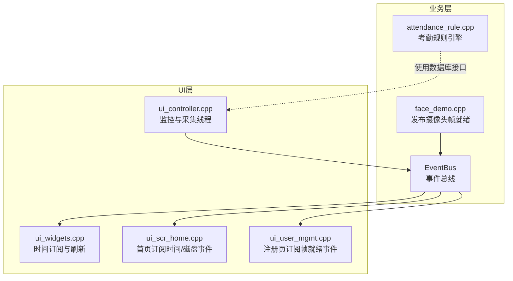
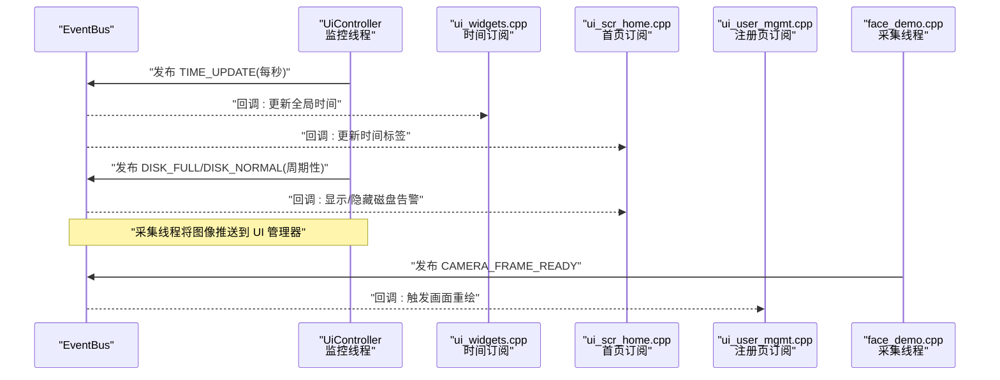
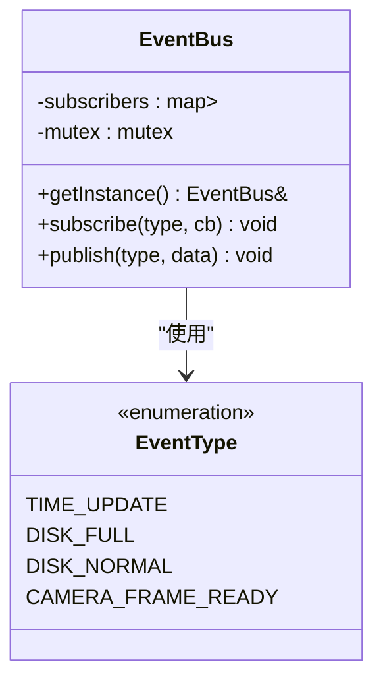
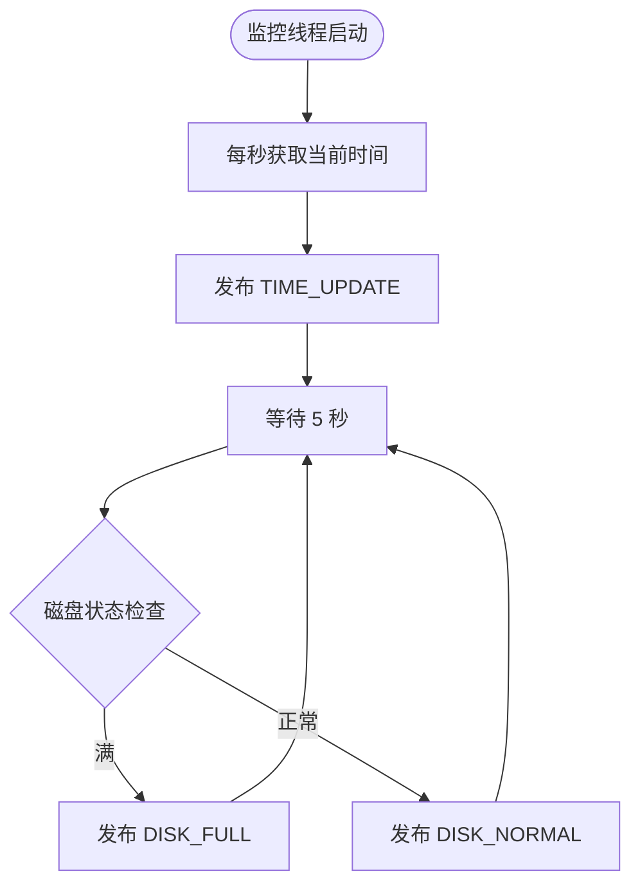
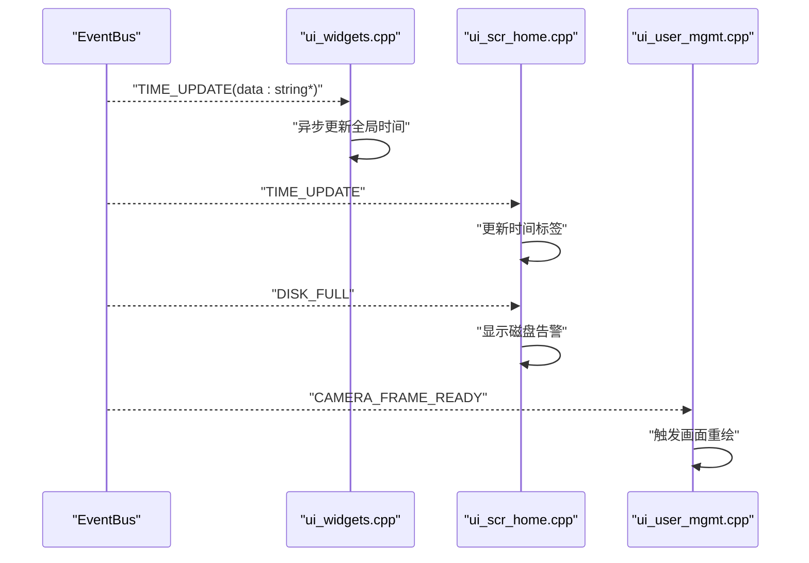
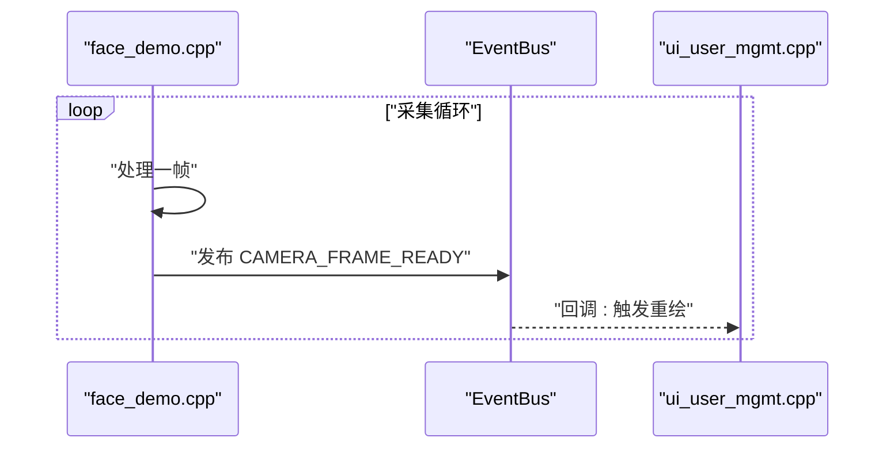
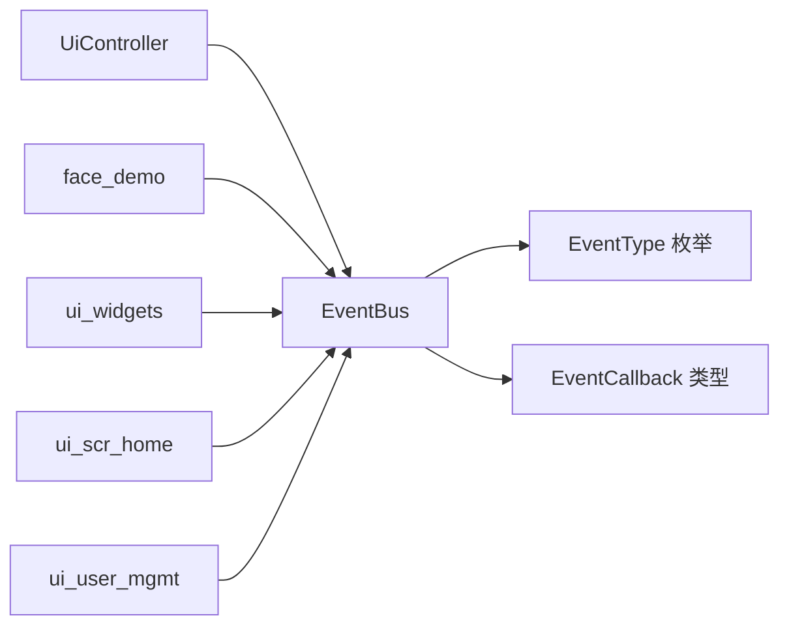

# 事件驱动架构

<cite>
**本文引用的文件**
- [event_bus.h](file://src/business/event_bus.h)
- [event_bus.cpp](file://src/business/event_bus.cpp)
- [ui_controller.h](file://src/ui/ui_controller.h)
- [ui_controller.cpp](file://src/ui/ui_controller.cpp)
- [ui_widgets.cpp](file://src/ui/common/ui_widgets.cpp)
- [ui_scr_home.cpp](file://src/ui/screens/home/ui_scr_home.cpp)
- [ui_user_mgmt.cpp](file://src/ui/screens/user_mgmt/ui_user_mgmt.cpp)
- [face_demo.cpp](file://src/business/face_demo.cpp)
- [attendance_rule.h](file://src/business/attendance_rule.h)
- [attendance_rule.cpp](file://src/business/attendance_rule.cpp)
</cite>

## 目录
1. [引言](#引言)
2. [项目结构](#项目结构)
3. [核心组件](#核心组件)
4. [架构总览](#架构总览)
5. [详细组件分析](#详细组件分析)
6. [依赖关系分析](#依赖关系分析)
7. [性能考量](#性能考量)
8. [故障排查指南](#故障排查指南)
9. [结论](#结论)
10. [附录](#附录)

## 引言
本文件系统性阐述 SmartAttendance 的事件驱动架构，围绕事件总线的设计原理、实现机制与使用模式展开，涵盖事件的发布、订阅、路由与处理流程，解释模块间如何通过事件实现解耦，给出事件类型定义、消息格式与序列化方案，总结事件驱动架构的优势、性能特性与调试技巧，并提供可直接定位到源码的示例路径与最佳实践。

## 项目结构
SmartAttendance 的事件驱动主要集中在业务层与 UI 层之间，通过轻量的 EventBus 实现松耦合通信：
- 事件总线：src/business/event_bus.{h,cpp}
- UI 控制器：src/ui/ui_controller.{h,cpp}
- UI 组件与页面：src/ui/common/ui_widgets.cpp、src/ui/screens/home/ui_scr_home.cpp、src/ui/screens/user_mgmt/ui_user_mgmt.cpp
- 业务模块：src/business/face_demo.cpp（发布摄像头帧就绪事件）、src/business/attendance_rule.{h,cpp}（考勤规则引擎）

图表来源
- [event_bus.h:10-39](file://src/business/event_bus.h#L10-L39)
- [event_bus.cpp:1-28](file://src/business/event_bus.cpp#L1-L28)
- [ui_controller.cpp:375-417](file://src/ui/ui_controller.cpp#L375-L417)
- [ui_widgets.cpp:115-138](file://src/ui/common/ui_widgets.cpp#L115-L138)
- [ui_scr_home.cpp:235-254](file://src/ui/screens/home/ui_scr_home.cpp#L235-L254)
- [ui_user_mgmt.cpp:1496-1503](file://src/ui/screens/user_mgmt/ui_user_mgmt.cpp#L1496-L1503)
- [face_demo.cpp:520-530](file://src/business/face_demo.cpp#L520-L530)

章节来源
- [event_bus.h:1-41](file://src/business/event_bus.h#L1-L41)
- [event_bus.cpp:1-28](file://src/business/event_bus.cpp#L1-L28)
- [ui_controller.h:1-106](file://src/ui/ui_controller.h#L1-L106)
- [ui_controller.cpp:375-417](file://src/ui/ui_controller.cpp#L375-L417)
- [ui_widgets.cpp:115-138](file://src/ui/common/ui_widgets.cpp#L115-L138)
- [ui_scr_home.cpp:235-254](file://src/ui/screens/home/ui_scr_home.cpp#L235-L254)
- [ui_user_mgmt.cpp:1496-1503](file://src/ui/screens/user_mgmt/ui_user_mgmt.cpp#L1496-L1503)
- [face_demo.cpp:520-530](file://src/business/face_demo.cpp#L520-L530)

## 核心组件
- 事件总线 EventBus
  - 单例模式提供全局访问
  - 支持订阅与发布，线程安全
  - 事件类型枚举：时间更新、磁盘状态、摄像头帧就绪
  - 回调签名：std::function<void(void*)>
- UI 控制器 UiController
  - 监控线程：每秒发布时间更新事件，周期性发布磁盘状态事件
  - 采集线程：从业务层获取图像并推送 UI
- UI 组件与页面
  - 订阅时间更新事件，异步刷新时间标签
  - 订阅磁盘状态事件，显示/隐藏磁盘告警
  - 订阅摄像头帧就绪事件，触发画面重绘
- 业务模块
  - face_demo 发布摄像头帧就绪事件，驱动 UI 实时画面
  - attendance_rule 提供考勤规则计算，与数据库交互

章节来源
- [event_bus.h:10-39](file://src/business/event_bus.h#L10-L39)
- [event_bus.cpp:1-28](file://src/business/event_bus.cpp#L1-L28)
- [ui_controller.cpp:375-417](file://src/ui/ui_controller.cpp#L375-L417)
- [ui_widgets.cpp:115-138](file://src/ui/common/ui_widgets.cpp#L115-L138)
- [ui_scr_home.cpp:235-254](file://src/ui/screens/home/ui_scr_home.cpp#L235-L254)
- [ui_user_mgmt.cpp:1496-1503](file://src/ui/screens/user_mgmt/ui_user_mgmt.cpp#L1496-L1503)
- [face_demo.cpp:520-530](file://src/business/face_demo.cpp#L520-L530)
- [attendance_rule.h:1-92](file://src/business/attendance_rule.h#L1-L92)
- [attendance_rule.cpp:198-277](file://src/business/attendance_rule.cpp#L198-L277)

## 架构总览
事件驱动架构通过 EventBus 实现跨线程、跨模块的松耦合通信：
- 发布端：UiController（时间/磁盘）、face_demo（摄像头帧）
- 订阅端：UI 组件（时间标签、磁盘告警）、注册界面（摄像头画面）
- 路由策略：按事件类型分发至对应回调集合
- 处理策略：回调在 UI 线程中通过异步调用更新界面

图表来源
- [ui_controller.cpp:375-417](file://src/ui/ui_controller.cpp#L375-L417)
- [ui_widgets.cpp:115-138](file://src/ui/common/ui_widgets.cpp#L115-L138)
- [ui_scr_home.cpp:235-254](file://src/ui/screens/home/ui_scr_home.cpp#L235-L254)
- [ui_user_mgmt.cpp:1496-1503](file://src/ui/screens/user_mgmt/ui_user_mgmt.cpp#L1496-L1503)
- [face_demo.cpp:520-530](file://src/business/face_demo.cpp#L520-L530)
- [event_bus.cpp:14-28](file://src/business/event_bus.cpp#L14-L28)

## 详细组件分析

### 事件总线 EventBus 设计与实现
- 设计要点
  - 单例：全局唯一实例，避免重复创建
  - 线程安全：使用互斥锁保护订阅者列表与发布过程
  - 松耦合：回调以 void* 传递数据，便于扩展不同消息格式
- 关键接口
  - subscribe：按事件类型注册回调
  - publish：广播事件，复制回调列表后在锁外依次调用
- 数据结构
  - map<EventType, vector<EventCallback>>：按事件类型维护回调列表
  - mutex：保护订阅者变更与发布过程

图表来源
- [event_bus.h:10-39](file://src/business/event_bus.h#L10-L39)
- [event_bus.cpp:1-28](file://src/business/event_bus.cpp#L1-L28)

章节来源
- [event_bus.h:10-39](file://src/business/event_bus.h#L10-L39)
- [event_bus.cpp:1-28](file://src/business/event_bus.cpp#L1-L28)

### UI 控制器的事件发布流程
- 监控线程
  - 每秒生成时间字符串并发布 TIME_UPDATE
  - 每 5 秒检查磁盘状态并发布 DISK_FULL 或 DISK_NORMAL
- 采集线程
  - 从业务层获取图像，推送到 UI 管理器（非事件总线）

图表来源
- [ui_controller.cpp:375-417](file://src/ui/ui_controller.cpp#L375-L417)

章节来源
- [ui_controller.cpp:375-417](file://src/ui/ui_controller.cpp#L375-L417)

### UI 组件的事件订阅与处理
- 时间订阅（ui_widgets.cpp）
  - 首次订阅时注册回调，收到 TIME_UPDATE 后通过异步调用更新全局时间与星期
- 首页订阅（ui_scr_home.cpp）
  - 订阅 TIME_UPDATE 更新时间标签
  - 订阅 DISK_FULL 显示磁盘告警
- 注册页订阅（ui_user_mgmt.cpp）
  - 订阅 CAMERA_FRAME_READY 触发画面重绘

图表来源
- [ui_widgets.cpp:115-138](file://src/ui/common/ui_widgets.cpp#L115-L138)
- [ui_scr_home.cpp:235-254](file://src/ui/screens/home/ui_scr_home.cpp#L235-L254)
- [ui_user_mgmt.cpp:1496-1503](file://src/ui/screens/user_mgmt/ui_user_mgmt.cpp#L1496-L1503)

章节来源
- [ui_widgets.cpp:115-138](file://src/ui/common/ui_widgets.cpp#L115-L138)
- [ui_scr_home.cpp:235-254](file://src/ui/screens/home/ui_scr_home.cpp#L235-L254)
- [ui_user_mgmt.cpp:1496-1503](file://src/ui/screens/user_mgmt/ui_user_mgmt.cpp#L1496-L1503)

### 业务模块的事件发布与处理
- face_demo
  - 后台采集循环中，当有新帧就绪时发布 CAMERA_FRAME_READY
  - UI 注册页订阅该事件以驱动画面刷新
- attendance_rule
  - 考勤规则引擎，负责计算打卡状态与入库
  - 通过数据库接口与 UI 控制器协作，不直接参与事件总线

图表来源
- [face_demo.cpp:520-530](file://src/business/face_demo.cpp#L520-L530)
- [ui_user_mgmt.cpp:1496-1503](file://src/ui/screens/user_mgmt/ui_user_mgmt.cpp#L1496-L1503)
- [event_bus.cpp:14-28](file://src/business/event_bus.cpp#L14-L28)

章节来源
- [face_demo.cpp:520-530](file://src/business/face_demo.cpp#L520-L530)
- [ui_user_mgmt.cpp:1496-1503](file://src/ui/screens/user_mgmt/ui_user_mgmt.cpp#L1496-L1503)
- [attendance_rule.h:1-92](file://src/business/attendance_rule.h#L1-L92)
- [attendance_rule.cpp:198-277](file://src/business/attendance_rule.cpp#L198-L277)

## 依赖关系分析
- EventBus 依赖
  - 事件类型枚举与回调类型别名
  - STL 容器与互斥锁
- 发布端依赖
  - UiController 依赖 EventBus 发布时间/磁盘事件
  - face_demo 依赖 EventBus 发布摄像头帧事件
- 订阅端依赖
  - UI 组件与页面依赖 EventBus 接收事件
  - 通过异步调用确保 UI 更新在 UI 线程执行

图表来源
- [event_bus.h:10-39](file://src/business/event_bus.h#L10-L39)
- [ui_controller.cpp:375-417](file://src/ui/ui_controller.cpp#L375-L417)
- [face_demo.cpp:520-530](file://src/business/face_demo.cpp#L520-L530)
- [ui_widgets.cpp:115-138](file://src/ui/common/ui_widgets.cpp#L115-L138)
- [ui_scr_home.cpp:235-254](file://src/ui/screens/home/ui_scr_home.cpp#L235-L254)
- [ui_user_mgmt.cpp:1496-1503](file://src/ui/screens/user_mgmt/ui_user_mgmt.cpp#L1496-L1503)

章节来源
- [event_bus.h:10-39](file://src/business/event_bus.h#L10-L39)
- [ui_controller.cpp:375-417](file://src/ui/ui_controller.cpp#L375-L417)
- [face_demo.cpp:520-530](file://src/business/face_demo.cpp#L520-L530)
- [ui_widgets.cpp:115-138](file://src/ui/common/ui_widgets.cpp#L115-L138)
- [ui_scr_home.cpp:235-254](file://src/ui/screens/home/ui_scr_home.cpp#L235-L254)
- [ui_user_mgmt.cpp:1496-1503](file://src/ui/screens/user_mgmt/ui_user_mgmt.cpp#L1496-L1503)

## 性能考量
- 发布路径优化
  - 发布时复制回调列表并在锁外调用，降低锁持有时间，提升并发吞吐
- 订阅路径优化
  - 回调内部通过异步调用更新 UI，避免阻塞事件线程
- 调度频率
  - 时间事件每秒一次，磁盘检查每 5 秒一次，兼顾实时性与开销
- 图像传输
  - 采集线程与 UI 管理器之间采用缓存与睡眠控制，避免过度占用 CPU

章节来源
- [event_bus.cpp:14-28](file://src/business/event_bus.cpp#L14-L28)
- [ui_controller.cpp:375-417](file://src/ui/ui_controller.cpp#L375-L417)
- [ui_widgets.cpp:115-138](file://src/ui/common/ui_widgets.cpp#L115-L138)
- [ui_scr_home.cpp:235-254](file://src/ui/screens/home/ui_scr_home.cpp#L235-L254)
- [ui_user_mgmt.cpp:1496-1503](file://src/ui/screens/user_mgmt/ui_user_mgmt.cpp#L1496-L1503)

## 故障排查指南
- 事件未到达
  - 检查订阅是否在 UI 线程中注册，确保回调在 UI 线程中执行
  - 确认事件类型与订阅一致
- 回调未执行
  - 检查回调内部是否正确使用异步调用更新 UI
  - 确认回调参数类型匹配（如 TIME_UPDATE 传入 string*）
- 性能问题
  - 适当降低事件发布频率（如磁盘检查）
  - 避免在回调中执行耗时操作，将耗时任务移出回调
- 资源泄漏
  - 确保 UI 销毁时解除相关定时器与事件回调绑定

章节来源
- [ui_widgets.cpp:115-138](file://src/ui/common/ui_widgets.cpp#L115-L138)
- [ui_scr_home.cpp:235-254](file://src/ui/screens/home/ui_scr_home.cpp#L235-L254)
- [ui_user_mgmt.cpp:1496-1503](file://src/ui/screens/user_mgmt/ui_user_mgmt.cpp#L1496-L1503)

## 结论
SmartAttendance 的事件驱动架构通过轻量 EventBus 实现 UI 与业务模块的解耦：UiController 负责系统状态与资源监控，face_demo 负责图像采集，UI 组件通过订阅事件实现响应式更新。该设计具备良好的扩展性与可维护性，适合在多线程环境下稳定运行。

## 附录

### 事件类型定义与消息格式
- 事件类型
  - TIME_UPDATE：每秒触发，携带时间字符串指针
  - DISK_FULL / DISK_NORMAL：磁盘状态变化，无额外数据
  - CAMERA_FRAME_READY：摄像头新帧就绪，无额外数据
- 消息格式
  - 通过 void* 传递数据，回调内部进行类型转换与处理
  - 示例路径：[事件类型定义:10-16](file://src/business/event_bus.h#L10-L16)

章节来源
- [event_bus.h:10-16](file://src/business/event_bus.h#L10-L16)

### 最佳实践
- 发布端
  - 使用单例 EventBus，避免重复创建
  - 发布频率合理规划，避免 UI 线程过载
- 订阅端
  - 在 UI 线程中注册回调，使用异步调用更新界面
  - 对可选数据进行空值检查与生命周期管理
- 扩展建议
  - 引入事件负载序列化（如 JSON）以支持跨进程/网络场景
  - 为关键事件增加统计与日志，便于性能分析与故障定位

章节来源
- [event_bus.cpp:14-28](file://src/business/event_bus.cpp#L14-L28)
- [ui_widgets.cpp:115-138](file://src/ui/common/ui_widgets.cpp#L115-L138)
- [ui_scr_home.cpp:235-254](file://src/ui/screens/home/ui_scr_home.cpp#L235-L254)
- [ui_user_mgmt.cpp:1496-1503](file://src/ui/screens/user_mgmt/ui_user_mgmt.cpp#L1496-L1503)