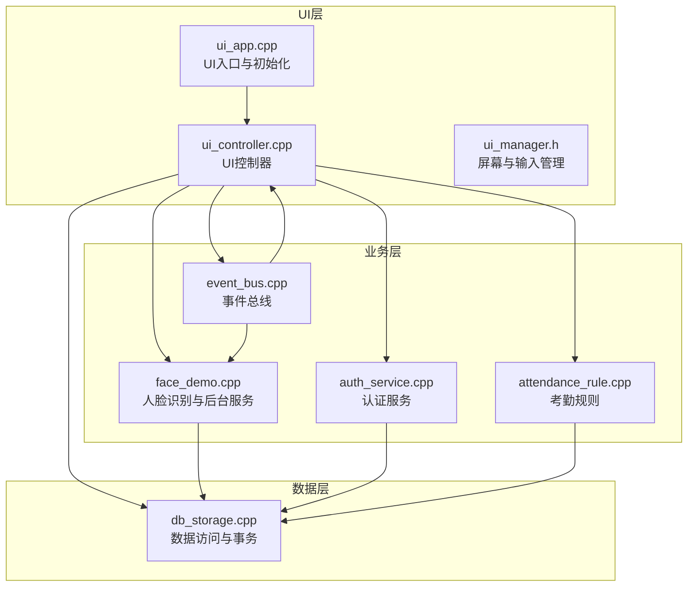
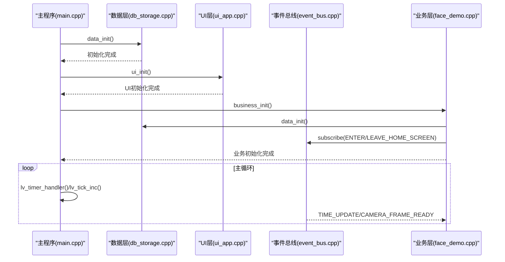
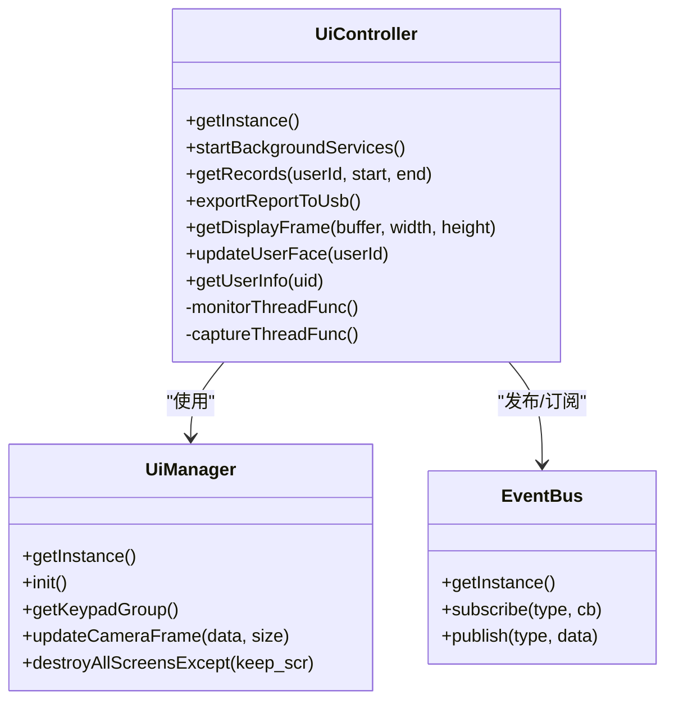
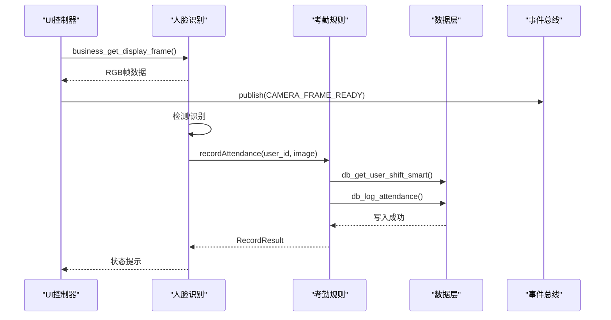
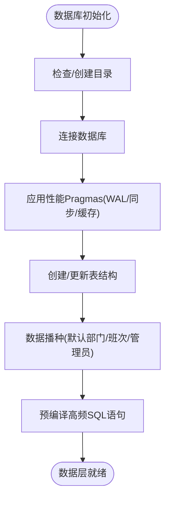
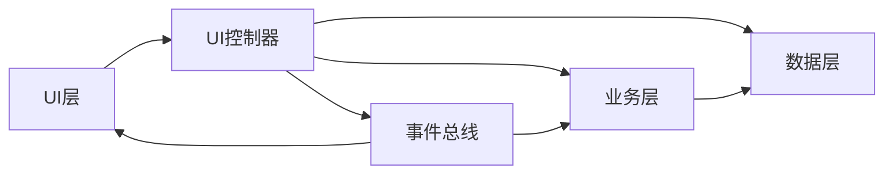

# 分层架构详解

<cite>
**本文档引用的文件**
- [main.cpp](file://src/main.cpp)
- [ui_app.cpp](file://src/ui/ui_app.cpp)
- [ui_controller.cpp](file://src/ui/ui_controller.cpp)
- [ui_controller.h](file://src/ui/ui_controller.h)
- [ui_manager.h](file://src/ui/managers/ui_manager.h)
- [auth_service.cpp](file://src/business/auth_service.cpp)
- [auth_service.h](file://src/business/auth_service.h)
- [face_demo.cpp](file://src/business/face_demo.cpp)
- [face_demo.h](file://src/business/face_demo.h)
- [attendance_rule.cpp](file://src/business/attendance_rule.cpp)
- [event_bus.cpp](file://src/business/event_bus.cpp)
- [event_bus.h](file://src/business/event_bus.h)
- [db_storage.cpp](file://src/data/db_storage.cpp)
- [db_storage.h](file://src/data/db_storage.h)
</cite>

## 目录
1. [简介](#简介)
2. [项目结构](#项目结构)
3. [核心组件](#核心组件)
4. [架构总览](#架构总览)
5. [详细组件分析](#详细组件分析)
6. [依赖分析](#依赖分析)
7. [性能考虑](#性能考虑)
8. [故障排查指南](#故障排查指南)
9. [结论](#结论)

## 简介
本文件面向智能考勤系统，系统采用经典的三层架构（UI层、业务层、数据层），通过清晰的职责划分与接口定义实现模块解耦。UI层负责用户交互与显示；业务层负责业务规则、算法与流程编排；数据层负责持久化与数据访问。系统通过事件总线实现松耦合通信，通过线程池与锁机制保障并发安全与性能。

## 项目结构
系统采用按层组织的目录结构：
- UI层：负责界面渲染、输入处理与屏幕管理
- 业务层：负责人脸识别、考勤规则、认证与后台服务
- 数据层：负责数据库访问、事务与数据模型

图表来源
- [ui_app.cpp:34-94](file://src/ui/ui_app.cpp#L34-L94)
- [ui_controller.cpp:1-120](file://src/ui/ui_controller.cpp#L1-L120)
- [face_demo.cpp:557-694](file://src/business/face_demo.cpp#L557-L694)
- [auth_service.cpp:9-37](file://src/business/auth_service.cpp#L9-L37)
- [attendance_rule.cpp:263-342](file://src/business/attendance_rule.cpp#L263-L342)
- [event_bus.cpp:1-28](file://src/business/event_bus.cpp#L1-L28)
- [db_storage.cpp:133-310](file://src/data/db_storage.cpp#L133-L310)

章节来源
- [main.cpp:187-246](file://src/main.cpp#L187-L246)
- [ui_app.cpp:34-94](file://src/ui/ui_app.cpp#L34-L94)
- [ui_controller.cpp:1-120](file://src/ui/ui_controller.cpp#L1-L120)
- [face_demo.cpp:557-694](file://src/business/face_demo.cpp#L557-L694)
- [db_storage.cpp:133-310](file://src/data/db_storage.cpp#L133-L310)

## 核心组件
- UI层组件
  - UI入口与初始化：负责LVGL环境、SDL驱动、输入设备绑定与主页加载
  - UI控制器：封装业务接口，提供线程安全的数据访问与后台服务
  - 屏幕管理器：管理屏幕生命周期、输入组与摄像头帧缓冲
- 业务层组件
  - 人脸识别与后台服务：视频采集、人脸检测与识别、异步写库、配置缓存
  - 认证服务：密码与指纹验证
  - 考勤规则：时间解析、班次归属判断、状态计算与记录
  - 事件总线：线程安全的发布/订阅机制
- 数据层组件
  - 数据访问对象：提供部门、班次、用户、考勤、排班等CRUD接口
  - 事务与并发：读写锁、预编译语句、事务封装、索引优化

章节来源
- [ui_app.cpp:34-94](file://src/ui/ui_app.cpp#L34-L94)
- [ui_controller.h:21-110](file://src/ui/ui_controller.h#L21-L110)
- [ui_manager.h:71-156](file://src/ui/managers/ui_manager.h#L71-L156)
- [face_demo.h:34-212](file://src/business/face_demo.h#L34-L212)
- [auth_service.h:23-46](file://src/business/auth_service.h#L23-L46)
- [attendance_rule.cpp:10-342](file://src/business/attendance_rule.cpp#L10-L342)
- [event_bus.h:23-43](file://src/business/event_bus.h#L23-L43)
- [db_storage.h:213-683](file://src/data/db_storage.h#L213-L683)

## 架构总览
系统启动顺序与控制流如下：
- 主程序初始化系统环境，禁用休眠，执行框架依赖检查
- 初始化数据层（数据库连接、表结构、播种）
- 初始化UI层（LVGL、SDL、输入绑定、主页加载）
- 初始化业务层（加载模型、启动采集与写库线程）
- 进入主循环，驱动LVGL心跳与事件处理

图表来源
- [main.cpp:187-246](file://src/main.cpp#L187-L246)
- [db_storage.cpp:133-310](file://src/data/db_storage.cpp#L133-L310)
- [ui_app.cpp:34-94](file://src/ui/ui_app.cpp#L34-L94)
- [face_demo.cpp:557-694](file://src/business/face_demo.cpp#L557-L694)
- [event_bus.cpp:14-28](file://src/business/event_bus.cpp#L14-L28)

## 详细组件分析

### UI层组件分析
- UI入口与初始化
  - 功能：初始化LVGL、创建SDL窗口与输入设备、样式与输入组初始化、绑定键盘到UI组、启动后台服务、加载主页
  - 关键点：键盘输入绑定到UI组，确保焦点导航与操作一致性
- UI控制器
  - 功能：封装数据层与业务层接口，提供线程安全的数据访问、后台服务（监控与采集线程）、报表导出、系统信息查询
  - 关键点：使用互斥锁保护图像缓冲区，原子标志控制帧更新，线程分离避免阻塞
- 屏幕管理器
  - 功能：管理屏幕对象生命周期、输入组、摄像头帧缓冲与异步销毁
  - 关键点：原子标志避免竞态，互斥锁保护共享缓冲区

图表来源
- [ui_controller.h:21-110](file://src/ui/ui_controller.h#L21-L110)
- [ui_manager.h:71-156](file://src/ui/managers/ui_manager.h#L71-L156)
- [event_bus.h:23-43](file://src/business/event_bus.h#L23-L43)

章节来源
- [ui_app.cpp:34-94](file://src/ui/ui_app.cpp#L34-L94)
- [ui_controller.cpp:1-120](file://src/ui/ui_controller.cpp#L1-L120)
- [ui_controller.h:21-110](file://src/ui/ui_controller.h#L21-L110)
- [ui_manager.h:71-156](file://src/ui/managers/ui_manager.h#L71-L156)

### 业务层组件分析
- 人脸识别与后台服务
  - 功能：视频采集、人脸检测与识别、异步写库队列、配置缓存、冷却时间控制、重复打卡防抖
  - 关键点：生产者-消费者模型，读写锁保护共享帧，条件变量协调线程，异常捕获避免崩溃
- 认证服务
  - 功能：密码与指纹验证，返回标准化结果枚举
  - 关键点：用户信息查询与特征数据校验，指纹比对占位实现
- 考勤规则
  - 功能：时间解析、班次归属判断、状态计算、重复打卡检查、记录入库
  - 关键点：跨天处理、折中原则、状态优先级与结果映射
- 事件总线
  - 功能：线程安全的事件发布/订阅，支持时间更新、磁盘状态、摄像头帧就绪等事件

图表来源
- [ui_controller.cpp:658-680](file://src/ui/ui_controller.cpp#L658-L680)
- [face_demo.cpp:246-285](file://src/business/face_demo.cpp#L246-L285)
- [attendance_rule.cpp:263-342](file://src/business/attendance_rule.cpp#L263-L342)
- [db_storage.cpp:458-458](file://src/data/db_storage.h#L458-L458)
- [event_bus.cpp:14-28](file://src/business/event_bus.cpp#L14-L28)

章节来源
- [face_demo.cpp:246-285](file://src/business/face_demo.cpp#L246-L285)
- [face_demo.cpp:557-694](file://src/business/face_demo.cpp#L557-L694)
- [auth_service.cpp:9-37](file://src/business/auth_service.cpp#L9-L37)
- [attendance_rule.cpp:10-342](file://src/business/attendance_rule.cpp#L10-L342)
- [event_bus.cpp:1-28](file://src/business/event_bus.cpp#L1-L28)

### 数据层组件分析
- 数据访问对象
  - 功能：提供完整的CRUD接口，包括部门、班次、用户、考勤、排班、系统配置等
  - 关键点：预编译语句、联合索引、事务封装、BLOB序列化与反序列化
- 并发与性能
  - 功能：读写锁分离、WAL模式、同步策略、缓存与队列
  - 关键点：共享锁用于读取，排他锁用于写入；预编译语句减少解析开销

图表来源
- [db_storage.cpp:133-310](file://src/data/db_storage.cpp#L133-L310)

章节来源
- [db_storage.h:213-683](file://src/data/db_storage.h#L213-L683)
- [db_storage.cpp:133-310](file://src/data/db_storage.cpp#L133-L310)

## 依赖分析
- 层间依赖
  - UI层依赖业务层与数据层接口，通过UI控制器封装调用
  - 业务层依赖数据层与事件总线，负责规则与算法
  - 数据层独立，提供DAO接口与事务封装
- 内部依赖
  - UI控制器聚合数据层与业务层接口，提供统一入口
  - 业务层内部通过事件总线解耦屏幕切换与识别状态
  - 数据层通过读写锁与预编译语句降低并发冲突

图表来源
- [ui_controller.cpp:1-120](file://src/ui/ui_controller.cpp#L1-L120)
- [face_demo.cpp:557-694](file://src/business/face_demo.cpp#L557-L694)
- [event_bus.cpp:1-28](file://src/business/event_bus.cpp#L1-L28)
- [db_storage.cpp:133-310](file://src/data/db_storage.cpp#L133-L310)

章节来源
- [ui_controller.cpp:1-120](file://src/ui/ui_controller.cpp#L1-L120)
- [face_demo.cpp:557-694](file://src/business/face_demo.cpp#L557-L694)
- [event_bus.cpp:1-28](file://src/business/event_bus.cpp#L1-L28)
- [db_storage.cpp:133-310](file://src/data/db_storage.cpp#L133-L310)

## 性能考虑
- 数据层
  - WAL模式提升并发读写性能，预编译语句减少解析开销
  - 联合索引加速“按用户+时间”查询，减少N+1问题
  - 读写锁分离，读多写少场景下提升吞吐
- 业务层
  - 生产者-消费者队列与条件变量，避免频繁上下文切换
  - 识别冷却时间与重复打卡防抖，降低数据库写入压力
  - 异常捕获避免线程崩溃影响整体系统
- UI层
  - 帧缓冲原子标志与互斥锁，避免UI渲染阻塞
  - 后台线程分离，主线程专注LVGL心跳

## 故障排查指南
- 启动失败
  - 检查依赖版本：OpenCV、SQLite3、LVGL版本输出
  - 确认数据库初始化与播种是否成功
- UI无画面
  - 检查SDL窗口创建与输入设备绑定
  - 确认业务层采集线程是否启动
- 识别异常
  - 检查模型文件是否存在与可读
  - 确认摄像头连接与重连逻辑
- 数据库写入失败
  - 检查事务提交与异常捕获
  - 确认预编译语句与锁状态

章节来源
- [main.cpp:49-151](file://src/main.cpp#L49-L151)
- [face_demo.cpp:246-285](file://src/business/face_demo.cpp#L246-L285)
- [db_storage.cpp:133-310](file://src/data/db_storage.cpp#L133-L310)

## 结论
本系统通过清晰的三层架构实现了UI、业务与数据的有效解耦，配合事件总线与线程安全机制，满足实时性与稳定性的需求。数据层的并发优化与业务层的算法封装为后续扩展提供了良好基础。建议持续关注异常处理与日志记录，进一步完善监控与可观测性。