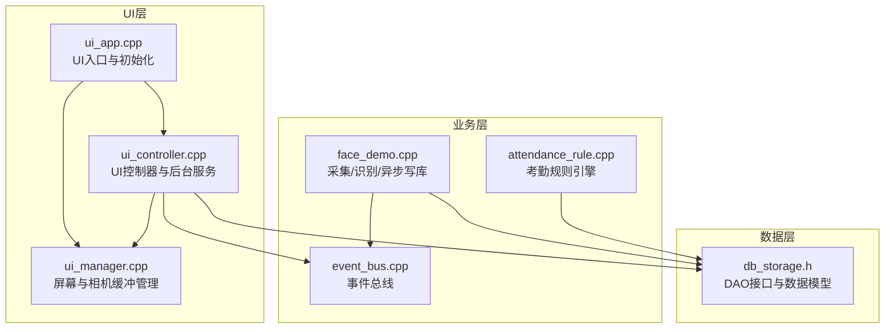
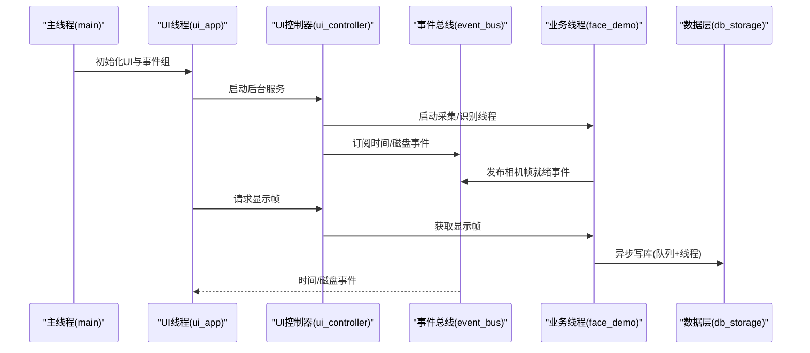
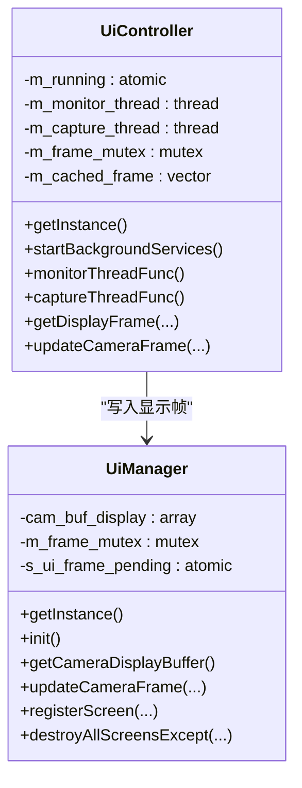
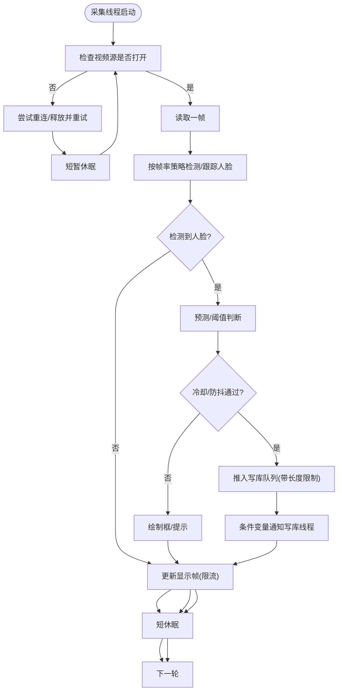
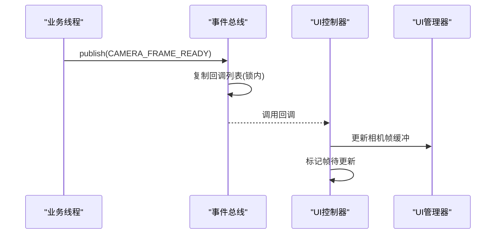
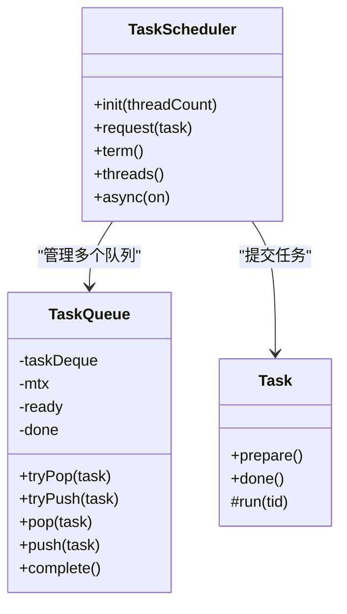
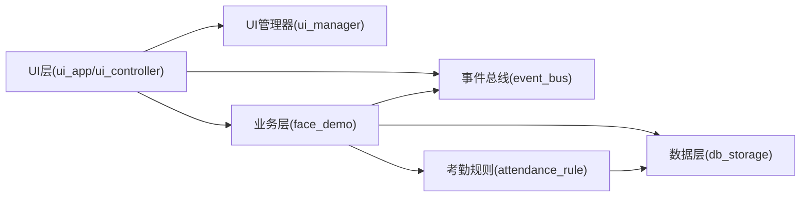

# 多线程设计模式

<cite>
**本文档引用的文件**
- [src/main.cpp](file://src/main.cpp)
- [src/ui/ui_app.cpp](file://src/ui/ui_app.cpp)
- [src/ui/ui_controller.h](file://src/ui/ui_controller.h)
- [src/ui/ui_controller.cpp](file://src/ui/ui_controller.cpp)
- [src/ui/managers/ui_manager.h](file://src/ui/managers/ui_manager.h)
- [src/ui/managers/ui_manager.cpp](file://src/ui/managers/ui_manager.cpp)
- [src/business/event_bus.h](file://src/business/event_bus.h)
- [src/business/event_bus.cpp](file://src/business/event_bus.cpp)
- [src/business/face_demo.h](file://src/business/face_demo.h)
- [src/business/face_demo.cpp](file://src/business/face_demo.cpp)
- [src/data/db_storage.h](file://src/data/db_storage.h)
- [src/business/attendance_rule.h](file://src/business/attendance_rule.h)
- [src/business/attendance_rule.cpp](file://src/business/attendance_rule.cpp)
- [libs/lvgl/src/libs/thorvg/tvgTaskScheduler.h](file://libs/lvgl/src/libs/thorvg/tvgTaskScheduler.h)
- [libs/lvgl/src/libs/thorvg/tvgTaskScheduler.cpp](file://libs/lvgl/src/libs/thorvg/tvgTaskScheduler.cpp)
</cite>

## 目录
1. [简介](#简介)
2. [项目结构](#项目结构)
3. [核心组件](#核心组件)
4. [架构总览](#架构总览)
5. [详细组件分析](#详细组件分析)
6. [依赖关系分析](#依赖关系分析)
7. [性能考量](#性能考量)
8. [故障排查指南](#故障排查指南)
9. [结论](#结论)
10. [附录](#附录)

## 简介
本文件面向智能考勤系统，系统性梳理其多线程设计模式与实现要点，重点覆盖以下方面：
- 线程职责划分：UI线程、业务线程、摄像头线程的分离与协作
- 同步与通信：事件总线、互斥锁、条件变量、原子变量的使用
- 线程安全与死锁预防：锁粒度、顺序、RAII与异常安全
- 典型线程协调：人脸识别线程、数据库写入线程、UI更新线程
- 线程池与资源调度：LVGL ThorVG任务调度器的线程池模式
- 性能优化：帧率控制、队列背压、锁范围最小化

## 项目结构
系统采用“UI层-业务层-数据层”的三层架构，配合事件驱动与多线程协作：
- UI层：负责显示与交互，使用LVGL与SDL驱动，管理屏幕与输入组
- 业务层：负责人脸识别、规则计算、数据缓存与异步写库
- 数据层：封装SQLite访问与业务数据模型

图表来源
- [src/ui/ui_app.cpp:34-94](file://src/ui/ui_app.cpp#L34-L94)
- [src/ui/managers/ui_manager.cpp:1-125](file://src/ui/managers/ui_manager.cpp#L1-L125)
- [src/ui/ui_controller.cpp:380-391](file://src/ui/ui_controller.cpp#L380-L391)
- [src/business/face_demo.cpp:246-285](file://src/business/face_demo.cpp#L246-L285)
- [src/business/event_bus.cpp:1-28](file://src/business/event_bus.cpp#L1-L28)
- [src/business/attendance_rule.cpp:263-342](file://src/business/attendance_rule.cpp#L263-L342)
- [src/data/db_storage.h:1-683](file://src/data/db_storage.h#L1-L683)

章节来源
- [src/main.cpp:187-246](file://src/main.cpp#L187-L246)
- [src/ui/ui_app.cpp:34-94](file://src/ui/ui_app.cpp#L34-L94)

## 核心组件
- UI线程
  - 负责LVGL主循环、屏幕渲染、输入事件处理
  - 通过事件总线订阅时间与磁盘状态变化
  - 通过UI控制器与UI管理器进行相机帧显示与屏幕切换
- 业务线程
  - 后台采集线程：持续读取视频帧、人脸检测/识别、绘制标注、更新显示帧
  - 数据库写入线程：从队列取任务，串行写库，异常隔离
- 摄像头线程
  - UI控制器的采集线程负责从业务层获取帧并写入UI管理器缓冲区
- 事件总线
  - 线程安全的发布/订阅机制，承载时间、磁盘、相机帧等事件
- 数据层
  - 提供线程安全的DAO接口与数据模型，配合业务层异步写库

章节来源
- [src/ui/ui_controller.cpp:380-410](file://src/ui/ui_controller.cpp#L380-L410)
- [src/business/face_demo.cpp:291-549](file://src/business/face_demo.cpp#L291-L549)
- [src/business/event_bus.h:10-41](file://src/business/event_bus.h#L10-L41)
- [src/data/db_storage.h:214-683](file://src/data/db_storage.h#L214-L683)

## 架构总览
系统主线程负责LVGL心跳与tick推进，UI线程负责渲染与事件处理，业务线程负责实时视频处理与识别，UI控制器负责桥接业务与UI。

图表来源
- [src/main.cpp:226-238](file://src/main.cpp#L226-L238)
- [src/ui/ui_app.cpp:86-93](file://src/ui/ui_app.cpp#L86-L93)
- [src/ui/ui_controller.cpp:380-410](file://src/ui/ui_controller.cpp#L380-L410)
- [src/business/event_bus.cpp:14-28](file://src/business/event_bus.cpp#L14-L28)
- [src/business/face_demo.cpp:246-285](file://src/business/face_demo.cpp#L246-L285)

## 详细组件分析

### UI线程与UI控制器
- 职责
  - 启动后台服务：监控线程与采集线程
  - 订阅事件：时间更新、磁盘状态、相机帧就绪
  - 提供UI所需的数据接口：用户、记录、报表、系统统计
  - 管理相机帧缓存与显示缓冲区
- 线程同步
  - 使用互斥锁保护相机帧缓存
  - 使用原子变量标记帧待更新
  - 使用条件变量与互斥锁在业务层与UI层之间传递帧数据

图表来源
- [src/ui/ui_controller.h:21-108](file://src/ui/ui_controller.h#L21-L108)
- [src/ui/ui_controller.cpp:380-410](file://src/ui/ui_controller.cpp#L380-L410)
- [src/ui/managers/ui_manager.h:71-155](file://src/ui/managers/ui_manager.h#L71-L155)
- [src/ui/managers/ui_manager.cpp:48-56](file://src/ui/managers/ui_manager.cpp#L48-L56)

章节来源
- [src/ui/ui_controller.cpp:380-410](file://src/ui/ui_controller.cpp#L380-L410)
- [src/ui/managers/ui_manager.cpp:48-56](file://src/ui/managers/ui_manager.cpp#L48-L56)

### 业务线程：采集/识别与异步写库
- 职责
  - 后台采集线程：读取视频帧、人脸检测/识别、绘制标注、更新显示帧
  - 数据库写入线程：从队列取任务，串行写库，异常隔离
  - 事件发布：相机帧就绪事件
- 同步与通信
  - 使用互斥锁保护共享帧与显示帧
  - 使用条件变量与互斥锁实现生产者-消费者队列
  - 使用原子变量控制线程运行标志
- 防抖与冷却
  - 识别冷却时间、重复打卡防抖、跳帧策略降低CPU占用

图表来源
- [src/business/face_demo.cpp:291-549](file://src/business/face_demo.cpp#L291-L549)
- [src/business/face_demo.cpp:246-285](file://src/business/face_demo.cpp#L246-L285)

章节来源
- [src/business/face_demo.cpp:246-285](file://src/business/face_demo.cpp#L246-L285)
- [src/business/face_demo.cpp:291-549](file://src/business/face_demo.cpp#L291-L549)

### 事件总线：线程间解耦通信
- 设计
  - 单例事件总线，线程安全发布/订阅
  - 事件类型：时间更新、磁盘状态、相机帧就绪、屏幕切换
- 实现
  - 订阅时加锁维护回调列表
  - 发布时复制回调列表，释放锁后再逐一调用，避免死锁

图表来源
- [src/business/event_bus.h:23-41](file://src/business/event_bus.h#L23-L41)
- [src/business/event_bus.cpp:14-28](file://src/business/event_bus.cpp#L14-L28)
- [src/business/face_demo.cpp:522-527](file://src/business/face_demo.cpp#L522-L527)
- [src/ui/ui_controller.cpp:320-332](file://src/ui/ui_controller.cpp#L320-L332)
- [src/ui/managers/ui_manager.cpp:48-56](file://src/ui/managers/ui_manager.cpp#L48-L56)

章节来源
- [src/business/event_bus.cpp:8-28](file://src/business/event_bus.cpp#L8-L28)

### 数据层与线程安全
- DAO接口提供线程安全的数据库访问
- 业务层通过异步队列+专用写库线程避免SQLite并发竞争
- 业务层内部使用互斥锁保护共享数据结构（名称映射、用户缓存、记录缓存）

章节来源
- [src/data/db_storage.h:214-683](file://src/data/db_storage.h#L214-L683)
- [src/business/face_demo.cpp:246-285](file://src/business/face_demo.cpp#L246-L285)

### 考勤规则引擎
- 负责打卡归属判断、状态计算、重复打卡防抖与写库
- 与业务层协同，确保规则一致性与线程安全

章节来源
- [src/business/attendance_rule.h:43-89](file://src/business/attendance_rule.h#L43-L89)
- [src/business/attendance_rule.cpp:263-342](file://src/business/attendance_rule.cpp#L263-L342)

### LVGL线程池：ThorVG任务调度器
- 采用固定线程池模型，任务队列+条件变量
- 支持异步/同步两种模式切换
- 适用于图形渲染与动画等耗时任务的并行化

图表来源
- [libs/lvgl/src/libs/thorvg/tvgTaskScheduler.h:115-125](file://libs/lvgl/src/libs/thorvg/tvgTaskScheduler.h#L115-L125)
- [libs/lvgl/src/libs/thorvg/tvgTaskScheduler.cpp:48-104](file://libs/lvgl/src/libs/thorvg/tvgTaskScheduler.cpp#L48-L104)
- [libs/lvgl/src/libs/thorvg/tvgTaskScheduler.cpp:107-180](file://libs/lvgl/src/libs/thorvg/tvgTaskScheduler.cpp#L107-L180)

章节来源
- [libs/lvgl/src/libs/thorvg/tvgTaskScheduler.cpp:107-180](file://libs/lvgl/src/libs/thorvg/tvgTaskScheduler.cpp#L107-L180)

## 依赖关系分析
- UI层依赖业务层提供的显示帧与后台服务
- 业务层依赖数据层DAO接口与事件总线
- UI控制器同时依赖UI管理器与业务层
- 事件总线为UI与业务层提供松耦合通信

图表来源
- [src/ui/ui_app.cpp:86-93](file://src/ui/ui_app.cpp#L86-L93)
- [src/ui/ui_controller.cpp:380-410](file://src/ui/ui_controller.cpp#L380-L410)
- [src/business/face_demo.cpp:557-694](file://src/business/face_demo.cpp#L557-L694)
- [src/business/event_bus.cpp:14-28](file://src/business/event_bus.cpp#L14-L28)
- [src/business/attendance_rule.cpp:263-342](file://src/business/attendance_rule.cpp#L263-L342)
- [src/data/db_storage.h:214-683](file://src/data/db_storage.h#L214-L683)

章节来源
- [src/ui/ui_controller.cpp:380-410](file://src/ui/ui_controller.cpp#L380-L410)
- [src/business/face_demo.cpp:557-694](file://src/business/face_demo.cpp#L557-L694)

## 性能考量
- 帧率与CPU占用
  - 采集线程采用跳帧策略与短休眠，兼顾识别精度与流畅度
  - 显示帧更新限流，避免UI队列爆炸
- 队列背压
  - 写库队列长度限制，防止内存膨胀
  - 条件变量通知，避免忙轮询
- 锁范围最小化
  - 仅在必要时持有锁，尽快释放
  - 使用RAII锁包装，异常安全
- I/O与磁盘
  - 定期检查磁盘空间，及时发布事件，避免阻塞主线程
- 图形渲染
  - LVGL ThorVG任务调度器提供线程池，提升渲染吞吐

章节来源
- [src/business/face_demo.cpp:291-549](file://src/business/face_demo.cpp#L291-L549)
- [src/business/face_demo.cpp:246-285](file://src/business/face_demo.cpp#L246-L285)
- [src/ui/ui_controller.cpp:400-410](file://src/ui/ui_controller.cpp#L400-L410)
- [libs/lvgl/src/libs/thorvg/tvgTaskScheduler.cpp:107-180](file://libs/lvgl/src/libs/thorvg/tvgTaskScheduler.cpp#L107-L180)

## 故障排查指南
- 摄像头无画面
  - 检查视频源打开状态与重连逻辑
  - 确认采集线程与显示帧更新流程
- 识别不工作
  - 检查模型加载与训练状态
  - 确认识别开关与冷却时间
- 写库失败
  - 检查写库线程是否存活
  - 查看队列长度与异常捕获
- UI卡顿
  - 检查显示帧更新频率与锁持有时间
  - 确认LVGL主循环与tick推进

章节来源
- [src/business/face_demo.cpp:314-344](file://src/business/face_demo.cpp#L314-L344)
- [src/business/face_demo.cpp:246-285](file://src/business/face_demo.cpp#L246-L285)
- [src/ui/ui_controller.cpp:516-527](file://src/ui/ui_controller.cpp#L516-L527)
- [src/main.cpp:226-238](file://src/main.cpp#L226-L238)

## 结论
本系统通过清晰的线程职责划分与事件驱动机制，实现了UI流畅、业务实时、数据可靠的多线程架构。关键设计包括：
- UI线程专注渲染与交互，业务线程专注实时处理，数据层通过异步写库保障一致性
- 事件总线提供松耦合通信，减少模块间直接依赖
- 严格的锁使用与异常隔离，确保系统稳定性
- 队列与限流策略平衡性能与资源占用

## 附录
- 线程安全最佳实践
  - 锁粒度最小化，避免在锁内执行I/O或长耗时操作
  - 使用RAII与作用域锁，防止遗漏解锁
  - 条件变量与互斥锁成对使用，注意虚假唤醒
  - 原子变量用于简单标志位，避免重型锁
- 死锁预防
  - 固定加锁顺序，避免交叉依赖
  - 限定锁持有时间，尽早释放
  - 使用超时与重试策略，避免无限等待